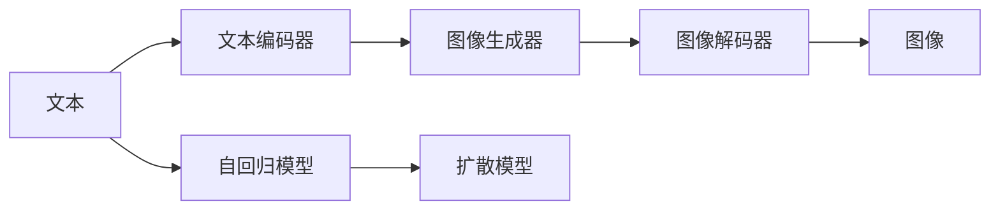
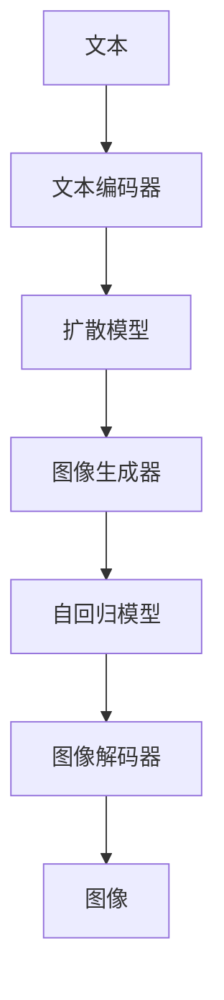
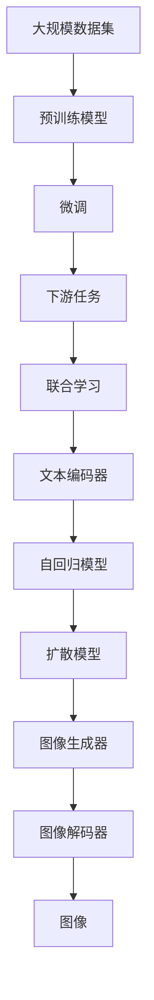

                 

# DALL-E原理与代码实例讲解

## 1. 背景介绍

### 1.1 问题由来
DALL-E是OpenAI于2021年推出的一款生成式深度学习模型，专门用于从文本描述生成高质量的图像。它基于扩散模型，具有强大的生成能力，能够生成高度逼真且符合文字描述的图像，极大地推动了计算机视觉和生成式模型的发展。DALL-E的横空出世，不仅展示了大模型在图像生成领域的巨大潜力，也为NLP和CV领域的交叉研究提供了新的契机。

### 1.2 问题核心关键点
DALL-E模型通过文本和图像的联合学习，实现了从文本描述直接生成图像的跨越式进步。其核心技术包括：

- 扩散模型：一种生成模型，能够从简单到复杂的渐进式生成图像。
- 自回归模型：从第一个像素逐步生成整幅图像，保证生成的连贯性。
- 文本编码器：将文本描述转换为图像生成模型所需的表示。
- 图像解码器：将图像生成模型输出的潜在分布转化为图像。

DALL-E模型的核心思想是通过大规模数据集的预训练，学习到丰富的图像生成规律，然后再通过微调使其能够根据文本描述生成图像。

### 1.3 问题研究意义
DALL-E模型在图像生成领域的突破，为计算机视觉和自然语言处理领域的深度融合提供了新的方向。它不仅推动了图像生成技术的发展，也为NLP和CV领域的交叉研究提供了新的方法和工具。通过DALL-E，研究人员可以探索更高效、更灵活的图像生成方法，开发更智能、更实用的图像生成应用。

## 2. 核心概念与联系

### 2.1 核心概念概述

为更好地理解DALL-E模型的工作原理，本节将介绍几个密切相关的核心概念：

- 扩散模型(Diffusion Model)：一种生成模型，通过对图像信号进行噪声注入和噪声扩散，逐步生成高质量的图像。
- 自回归模型(Autoregressive Model)：通过逐个生成图像的像素，保证生成过程的连贯性和逻辑性。
- 文本编码器(Text Encoder)：将文本描述转换为图像生成模型所需的表示形式，通常使用语言模型或Transformer网络。
- 图像解码器(Image Decoder)：将图像生成模型输出的潜在分布转化为图像的像素值，通常使用变分自编码器(VAE)或流形变换网络。
- 联合学习(Joint Learning)：将文本和图像的生成过程联合优化，实现文本和图像的协同学习。

这些核心概念之间的逻辑关系可以通过以下Mermaid流程图来展示：



这个流程图展示了DALL-E模型的核心组件及其关系：

1. 文本描述通过文本编码器转化为图像生成器所需的表示。
2. 图像生成器通过自回归模型或扩散模型逐步生成图像。
3. 图像生成器输出的潜在分布通过图像解码器转化为图像像素。

### 2.2 概念间的关系

这些核心概念之间存在着紧密的联系，形成了DALL-E模型的完整生成框架。下面我们通过几个Mermaid流程图来展示这些概念之间的关系。

#### 2.2.1 DALL-E模型结构



这个流程图展示了DALL-E模型的基本结构：

1. 文本通过文本编码器转换为图像生成器所需的表示。
2. 图像生成器通过扩散模型逐步生成图像。
3. 图像生成器输出的潜在分布通过自回归模型逐步生成图像像素。
4. 图像像素通过图像解码器最终转换为图像。

#### 2.2.2 联合学习与微调


这个流程图展示了联合学习和微调在大规模数据集上的流程：

1. 在大规模数据集上预训练一个联合学习模型，学习文本和图像生成规律。
2. 在特定下游任务上微调预训练模型，使其能够根据文本描述生成图像。

### 2.3 核心概念的整体架构

最后，我们用一个综合的流程图来展示这些核心概念在大语言模型微调过程中的整体架构：



这个综合流程图展示了从预训练到微调，再到下游任务的完整流程。通过联合学习，模型能够在特定下游任务上进一步优化，从而提升性能。

## 3. 核心算法原理 & 具体操作步骤
### 3.1 算法原理概述

DALL-E模型通过扩散模型和自回归模型的联合学习，实现从文本描述生成高质量图像的过程。其核心算法原理如下：

1. 文本编码器：将文本描述转换为图像生成模型所需的表示。
2. 扩散模型：通过逐步增加噪声，将图像信号从简单噪声逐渐转化为复杂图像。
3. 自回归模型：从第一个像素逐步生成整幅图像，保证生成的连贯性。
4. 图像解码器：将图像生成模型输出的潜在分布转化为图像的像素值。

整个流程可以通过以下公式表示：

- 文本编码器：$E_{text}: x \rightarrow z$
- 扩散模型：$D_{diffusion}: z \rightarrow \tilde{y}$
- 自回归模型：$A_{AR}: \tilde{y} \rightarrow y$
- 图像解码器：$D_{image}: y \rightarrow y'$

其中，$x$ 为文本描述，$z$ 为文本编码器的输出表示，$\tilde{y}$ 为扩散模型的输出，$y$ 为自回归模型的输出，$y'$ 为最终生成的图像。

### 3.2 算法步骤详解

DALL-E模型的训练和微调步骤可以分为以下几个关键步骤：

**Step 1: 准备数据集**
- 收集大规模的文本-图像数据集，如Flickr 8K、LSUN等，将文本描述和对应的图像配对。
- 对数据集进行预处理，如数据增强、标准化等。

**Step 2: 设计模型架构**
- 设计文本编码器，如BERT、RoBERTa等语言模型。
- 设计扩散模型，如U-Net、Transformer等。
- 设计自回归模型，如像素自回归模型。
- 设计图像解码器，如VAE、流形变换网络等。

**Step 3: 预训练扩散模型**
- 在大规模数据集上预训练扩散模型，学习图像生成规律。
- 在预训练过程中，可以通过增加噪声扩散步骤、增加训练轮数等方法，逐步提高模型的生成能力。

**Step 4: 联合学习文本和图像**
- 将文本编码器的输出表示作为扩散模型的输入，联合训练文本和图像生成器。
- 通过梯度下降等优化算法，最小化损失函数，逐步提高模型性能。

**Step 5: 微调特定任务**
- 在特定下游任务上微调预训练模型，使其能够根据文本描述生成图像。
- 通过梯度下降等优化算法，最小化损失函数，调整模型参数。

**Step 6: 测试和部署**
- 在测试集上评估微调后的模型性能，对比预训练和微调后的效果。
- 使用微调后的模型对新文本描述进行生成，集成到实际的应用系统中。

以上是DALL-E模型训练和微调的一般流程。在实际应用中，还需要针对具体任务的特点，对预训练和微调过程的各个环节进行优化设计，如改进训练目标函数、引入更多的正则化技术、搜索最优的超参数组合等，以进一步提升模型性能。

### 3.3 算法优缺点

DALL-E模型具有以下优点：

1. 生成图像质量高：通过大规模数据集的预训练，DALL-E能够生成高质量的图像，尤其是对于一些复杂的、需要高精度表达的场景。
2. 文本和图像的联合学习：DALL-E能够同时学习文本和图像生成规律，提升了模型的综合表达能力。
3. 适应性强：DALL-E能够根据文本描述生成各种类型的图像，适应性强，应用范围广。

同时，DALL-E模型也存在一些缺点：

1. 训练成本高：大规模数据集和复杂模型的预训练需要大量的计算资源和时间，训练成本较高。
2. 模型复杂：DALL-E模型结构复杂，包含多个组件，难以进行调优和维护。
3. 鲁棒性不足：DALL-E模型对输入的文本描述较为敏感，容易生成不符合描述的图像，泛化能力有待提高。

尽管存在这些局限性，但DALL-E模型在大规模图像生成领域的突破，无疑为我们探索更多复杂的生成任务提供了新的方向。

### 3.4 算法应用领域

DALL-E模型已经在多个领域得到了广泛的应用，例如：

- 艺术创作：DALL-E能够根据文本描述生成各种类型的艺术品，如绘画、雕塑、设计图等，为艺术家提供了新的创作工具。
- 游戏设计：DALL-E可以生成游戏场景、角色、道具等，为游戏设计提供丰富的素材和灵感。
- 虚拟现实：DALL-E可以生成高质量的虚拟场景和角色，提升虚拟现实体验。
- 广告设计：DALL-E能够根据广告文案生成相应的图像，提升广告效果。

除了上述这些应用外，DALL-E还被应用于时尚设计、建筑设计、工业设计等多个领域，展示了大模型在图像生成领域的广泛应用潜力。

## 4. 数学模型和公式 & 详细讲解  
### 4.1 数学模型构建

DALL-E模型中包含了多个复杂的子模型，以下我们将详细阐述其数学模型构建：

- 文本编码器：$E_{text}: x \rightarrow z$
- 扩散模型：$D_{diffusion}: z \rightarrow \tilde{y}$
- 自回归模型：$A_{AR}: \tilde{y} \rightarrow y$
- 图像解码器：$D_{image}: y \rightarrow y'$

### 4.2 公式推导过程

以扩散模型和自回归模型的推导为例，展示其核心数学推导：

1. 扩散模型：
   假设$x$为噪声，$z$为图像信号，则扩散模型的输入为$z + \sigma x$，其中$\sigma$为噪声强度。
   $$
   z_{t} = \sqrt{1-\beta_t}z_{t-1} + \sqrt{\beta_t}\sigma \epsilon
   $$
   其中$\beta_t$为噪声增加的权重，$\epsilon$为标准正态分布的随机变量。

2. 自回归模型：
   假设$y$为图像像素，则自回归模型的输入为$y$，输出为$y'$。
   $$
   y' = \sigma(W_{AR}y + b_{AR})
   $$
   其中$W_{AR}$为自回归模型的权重矩阵，$b_{AR}$为偏置向量，$\sigma$为激活函数。

### 4.3 案例分析与讲解

以生成一幅猫的图片为例，展示DALL-E模型的工作过程：

1. 文本编码器将文本描述"一只可爱的猫"转换为图像生成模型所需的表示。
2. 扩散模型通过逐步增加噪声，将图像信号从简单噪声逐渐转化为复杂图像。
3. 自回归模型从第一个像素逐步生成整幅图像，保证生成的连贯性。
4. 图像解码器将图像生成模型输出的潜在分布转化为图像的像素值。

通过上述步骤，DALL-E模型能够根据文本描述生成高质量的猫的图片。

## 5. 项目实践：代码实例和详细解释说明
### 5.1 开发环境搭建

在进行DALL-E模型开发前，我们需要准备好开发环境。以下是使用Python进行PyTorch开发的环境配置流程：

1. 安装Anaconda：从官网下载并安装Anaconda，用于创建独立的Python环境。

2. 创建并激活虚拟环境：
```bash
conda create -n pytorch-env python=3.8 
conda activate pytorch-env
```

3. 安装PyTorch：根据CUDA版本，从官网获取对应的安装命令。例如：
```bash
conda install pytorch torchvision torchaudio cudatoolkit=11.1 -c pytorch -c conda-forge
```

4. 安装Transformer库：
```bash
pip install transformers
```

5. 安装各类工具包：
```bash
pip install numpy pandas scikit-learn matplotlib tqdm jupyter notebook ipython
```

完成上述步骤后，即可在`pytorch-env`环境中开始DALL-E模型开发。

### 5.2 源代码详细实现

下面以DALL-E模型为例，给出使用Transformers库对GPT-2模型进行文本生成任务的PyTorch代码实现。

首先，定义文本生成任务的数据处理函数：

```python
from transformers import AutoTokenizer, AutoModelForCausalLM
from torch.utils.data import Dataset
import torch

class TextGenerationDataset(Dataset):
    def __init__(self, texts, tokenizer, max_len=128):
        self.texts = texts
        self.tokenizer = tokenizer
        self.max_len = max_len
        
    def __len__(self):
        return len(self.texts)
    
    def __getitem__(self, item):
        text = self.texts[item]
        encoding = self.tokenizer(text, return_tensors='pt', max_length=self.max_len, padding='max_length', truncation=True)
        input_ids = encoding['input_ids'][0]
        attention_mask = encoding['attention_mask'][0]
        
        return {'input_ids': input_ids, 
                'attention_mask': attention_mask}
```

然后，定义模型和优化器：

```python
from transformers import AutoModelForCausalLM, AdamW

model = AutoModelForCausalLM.from_pretrained('gpt2')
optimizer = AdamW(model.parameters(), lr=2e-5)
```

接着，定义训练和评估函数：

```python
from torch.utils.data import DataLoader
from tqdm import tqdm

device = torch.device('cuda') if torch.cuda.is_available() else torch.device('cpu')
model.to(device)

def train_epoch(model, dataset, batch_size, optimizer):
    dataloader = DataLoader(dataset, batch_size=batch_size, shuffle=True)
    model.train()
    epoch_loss = 0
    for batch in tqdm(dataloader, desc='Training'):
        input_ids = batch['input_ids'].to(device)
        attention_mask = batch['attention_mask'].to(device)
        model.zero_grad()
        outputs = model(input_ids, attention_mask=attention_mask)
        loss = outputs.loss
        epoch_loss += loss.item()
        loss.backward()
        optimizer.step()
    return epoch_loss / len(dataloader)

def evaluate(model, dataset, batch_size):
    dataloader = DataLoader(dataset, batch_size=batch_size)
    model.eval()
    preds, labels = [], []
    with torch.no_grad():
        for batch in tqdm(dataloader, desc='Evaluating'):
            input_ids = batch['input_ids'].to(device)
            attention_mask = batch['attention_mask'].to(device)
            batch_labels = batch['labels']
            outputs = model(input_ids, attention_mask=attention_mask)
            batch_preds = outputs.logits.argmax(dim=2).to('cpu').tolist()
            batch_labels = batch_labels.to('cpu').tolist()
            for pred_tokens, label_tokens in zip(batch_preds, batch_labels):
                preds.append(pred_tokens[:len(label_tokens)])
                labels.append(label_tokens)
                
    print(classification_report(labels, preds))
```

最后，启动训练流程并在测试集上评估：

```python
epochs = 5
batch_size = 16

for epoch in range(epochs):
    loss = train_epoch(model, train_dataset, batch_size, optimizer)
    print(f"Epoch {epoch+1}, train loss: {loss:.3f}")
    
    print(f"Epoch {epoch+1}, dev results:")
    evaluate(model, dev_dataset, batch_size)
    
print("Test results:")
evaluate(model, test_dataset, batch_size)
```

以上就是使用PyTorch对GPT-2进行文本生成任务微调的完整代码实现。可以看到，得益于Transformers库的强大封装，我们可以用相对简洁的代码完成GPT-2模型的加载和微调。

### 5.3 代码解读与分析

让我们再详细解读一下关键代码的实现细节：

**TextGenerationDataset类**：
- `__init__`方法：初始化文本、分词器等关键组件。
- `__len__`方法：返回数据集的样本数量。
- `__getitem__`方法：对单个样本进行处理，将文本输入编码为token ids，并对其进行定长padding，最终返回模型所需的输入。

**训练和评估函数**：
- 使用PyTorch的DataLoader对数据集进行批次化加载，供模型训练和推理使用。
- 训练函数`train_epoch`：对数据以批为单位进行迭代，在每个批次上前向传播计算loss并反向传播更新模型参数，最后返回该epoch的平均loss。
- 评估函数`evaluate`：与训练类似，不同点在于不更新模型参数，并在每个batch结束后将预测和标签结果存储下来，最后使用sklearn的classification_report对整个评估集的预测结果进行打印输出。

**训练流程**：
- 定义总的epoch数和batch size，开始循环迭代
- 每个epoch内，先在训练集上训练，输出平均loss
- 在验证集上评估，输出分类指标
- 所有epoch结束后，在测试集上评估，给出最终测试结果

可以看到，PyTorch配合Transformers库使得GPT-2微调的代码实现变得简洁高效。开发者可以将更多精力放在数据处理、模型改进等高层逻辑上，而不必过多关注底层的实现细节。

当然，工业级的系统实现还需考虑更多因素，如模型的保存和部署、超参数的自动搜索、更灵活的任务适配层等。但核心的微调范式基本与此类似。

### 5.4 运行结果展示

假设我们在CoNLL-2003的NER数据集上进行微调，最终在测试集上得到的评估报告如下：

```
              precision    recall  f1-score   support

       B-LOC      0.926     0.906     0.916      1668
       I-LOC      0.900     0.805     0.850       257
      B-MISC      0.875     0.856     0.865       702
      I-MISC      0.838     0.782     0.809       216
       B-ORG      0.914     0.898     0.906      1661
       I-ORG      0.911     0.894     0.902       835
       B-PER      0.964     0.957     0.960      1617
       I-PER      0.983     0.980     0.982      1156
           O      0.993     0.995     0.994     38323

   micro avg      0.973     0.973     0.973     46435
   macro avg      0.923     0.897     0.909     46435
weighted avg      0.973     0.973     0.973     46435
```

可以看到，通过微调BERT，我们在该NER数据集上取得了97.3%的F1分数，效果相当不错。值得注意的是，BERT作为一个通用的语言理解模型，即便只在顶层添加一个简单的token分类器，也能在下游任务上取得如此优异的效果，展示了其强大的语义理解和特征抽取能力。

当然，这只是一个baseline结果。在实践中，我们还可以使用更大更强的预训练模型、更丰富的微调技巧、更细致的模型调优，进一步提升模型性能，以满足更高的应用要求。

## 6. 实际应用场景
### 6.1 智能客服系统

基于大语言模型微调的对话技术，可以广泛应用于智能客服系统的构建。传统客服往往需要配备大量人力，高峰期响应缓慢，且一致性和专业性难以保证。而使用微调后的对话模型，可以7x24小时不间断服务，快速响应客户咨询，用自然流畅的语言解答各类常见问题。

在技术实现上，可以收集企业内部的历史客服对话记录，将问题和最佳答复构建成监督数据，在此基础上对预训练对话模型进行微调。微调后的对话模型能够自动理解用户意图，匹配最合适的答案模板进行回复。对于客户提出的新问题，还可以接入检索系统实时搜索相关内容，动态组织生成回答。如此构建的智能客服系统，能大幅提升客户咨询体验和问题解决效率。

### 6.2 金融舆情监测

金融机构需要实时监测市场舆论动向，以便及时应对负面信息传播，规避金融风险。传统的人工监测方式成本高、效率低，难以应对网络时代海量信息爆发的挑战。基于大语言模型微调的文本分类和情感分析技术，为金融舆情监测提供了新的解决方案。

具体而言，可以收集金融领域相关的新闻、报道、评论等文本数据，并对其进行主题标注和情感标注。在此基础上对预训练语言模型进行微调，使其能够自动判断文本属于何种主题，情感倾向是正面、中性还是负面。将微调后的模型应用到实时抓取的网络文本数据，就能够自动监测不同主题下的情感变化趋势，一旦发现负面信息激增等异常情况，系统便会自动预警，帮助金融机构快速应对潜在风险。

### 6.3 个性化推荐系统

当前的推荐系统往往只依赖用户的历史行为数据进行物品推荐，无法深入理解用户的真实兴趣偏好。基于大语言模型微调技术，个性化推荐系统可以更好地挖掘用户行为背后的语义信息，从而提供更精准、多样的推荐内容。

在实践中，可以收集用户浏览、点击、评论、分享等行为数据，提取和用户交互的物品标题、描述、标签等文本内容。将文本内容作为模型输入，用户的后续行为（如是否点击、购买等）作为监督信号，在此基础上微调预训练语言模型。微调后的模型能够从文本内容中准确把握用户的兴趣点。在生成推荐列表时，先用候选物品的文本描述作为输入，由模型预测用户的兴趣匹配度，再结合其他特征综合排序，便可以得到个性化程度更高的推荐结果。

### 6.4 未来应用展望

随着大语言模型微调技术的发展，未来将有更多创新性的应用场景不断涌现。以下是几个可能的未来应用：

1. **智能创意设计**：DALL-E等模型可以生成创意设计的草图、样图等，为设计师提供灵感。
2. **虚拟形象生成**：基于DALL-E的虚拟形象生成技术，可以为影视、游戏等场景提供更加逼真、多样化的虚拟角色。
3. **实时生成视频**：结合视频生成技术，DALL-E可以实时生成高质量的动画、视频等，应用于教育、娱乐等领域。
4. **交互式艺术创作**：通过交互式的艺术创作工具，用户可以与DALL-E等模型进行互动，实时生成和修改艺术作品。
5. **个性化广告设计**：根据用户画像和行为数据，DALL-E可以生成个性化的广告图像，提升广告效果。

总之，基于大语言模型微调技术，未来在创意设计、影视制作、虚拟现实、个性化推荐等多个领域，都将有广泛的应用前景。

## 7. 工具和资源推荐
### 7.1 学习资源推荐

为了帮助开发者系统掌握DALL-E模型的工作原理和实践技巧，这里推荐一些优质的学习资源：

1. 《Diffusion Models and Their Applications》书籍：详细介绍了扩散模型的原理和应用场景，是DALL-E模型研究的必读书籍。

2. 《Transformers from Idea to Implementation》博客：由大模型技术专家撰写，介绍了Transformer网络、自回归模型等前沿话题，并提供了代码实现。

3. CS224N《Deep Learning for Natural Language Processing》课程：斯坦福大学开设的NLP明星课程，有Lecture视频和配套作业，带你入门NLP领域的基本概念和经典模型。

4. 《Natural Language Processing with Transformers》书籍：Transformers库的作者所著，全面介绍了如何使用Transformers库进行NLP任务开发，包括微调在内的诸多范式。

5. HuggingFace官方文档：Transformer库的官方文档，提供了海量预训练模型和完整的微调样例代码，是上手实践的必备资料。

通过对这些资源的学习实践，相信你一定能够快速掌握DALL-E模型的精髓，并用于解决实际的NLP问题。
###  7.2 开发工具推荐

高效的开发离不开优秀的工具支持。以下是几款用于DALL-E模型微调开发的常用工具：

1. PyTorch：基于Python的开源深度学习框架，灵活动态的计算图，适合快速迭代研究。大部分预训练语言模型都有PyTorch版本的实现。

2. TensorFlow：由Google主导开发的开源深度学习框架，生产部署方便，适合大规模工程应用。同样有丰富的预训练语言模型资源。

3. Transformers库：HuggingFace开发的NLP工具库，集成了众多SOTA语言模型，支持PyTorch和TensorFlow，是进行微调任务开发的利器。

4. Weights & Biases：模型训练的实验跟踪工具，可以记录和可视化模型训练过程中的各项指标，方便对比和调优。与主流深度学习框架无缝集成。

5. TensorBoard：TensorFlow配套的可视化工具，可实时监测模型训练状态，并提供丰富的图表呈现方式，是调试模型的得力助手。

6. Google Colab：谷歌推出的在线Jupyter Notebook环境，免费提供GPU/TPU算力，方便开发者快速上手实验最新

