                 

# 一切皆是映射：卷积神经网络(CNN)解密

> 关键词：卷积神经网络,卷积操作,池化操作,卷积核,感受野,参数共享,特征映射,非线性激活函数,反向传播算法

## 1. 背景介绍

### 1.1 问题由来

自深度学习问世以来，其理论基础始终围绕着模型如何通过学习映射函数实现特征的提取、编码和重构。从单层前馈神经网络(Feedforward Neural Network, FNN)到卷积神经网络(Convolutional Neural Network, CNN)，再到循环神经网络(Recurrent Neural Network, RNN)，每一种模型都在不断探索如何更高效地实现这一映射过程。

尤其是在计算机视觉领域，卷积神经网络以其独有的卷积操作和局部连接机制，在图像分类、目标检测、图像分割等任务上取得了举世瞩目的成果，成为处理视觉信息的最重要工具。然而，CNN的原理和算法细节究竟是如何工作的，这一问题始终困扰着众多初学者。

本文旨在通过一系列通俗易懂的分析和实例，揭示卷积神经网络背后的核心映射机制，带领读者深入理解CNN的奥秘。

### 1.2 问题核心关键点

卷积神经网络(CNN)是一种基于卷积操作和池化操作的深度学习模型。其主要思想是通过卷积核对输入数据进行局部连接和参数共享，提取空间局部特征，并通过池化操作对特征进行下采样，减少计算复杂度，提高模型泛化能力。CNN的核心精髓在于：

- 卷积操作：对输入数据进行局部连接和参数共享，提取特征。
- 池化操作：对特征进行下采样，减少计算量。
- 卷积核：卷积操作的核心，通过权重矩阵进行特征提取。
- 感受野：卷积核覆盖的输入数据区域，决定模型对输入的感知能力。
- 非线性激活函数：增加模型的表达能力，引入非线性映射。
- 反向传播算法：用于参数更新和误差反向传播。

理解这些核心概念，便能掌握CNN的精髓。

### 1.3 问题研究意义

掌握CNN的原理和算法，对于深度学习从业者和计算机视觉领域的研究者具有重要意义：

1. 深入理解CNN的工作机制，有助于开发高效、灵活的视觉处理模型。
2. 优化CNN的设计和参数设置，提升模型在特定任务上的性能。
3. 创新性地应用CNN到其他领域，拓展模型的应用范围。
4. 加快CNN模型的部署和优化，提升实际应用效率。

## 2. 核心概念与联系

### 2.1 核心概念概述

要深入理解CNN，首先需要理解其核心概念，并建立各概念之间的联系。

- 卷积操作：卷积操作是通过卷积核对输入数据进行局部连接和参数共享的映射过程。它将输入数据和卷积核进行逐元素乘积，然后对结果进行求和，得到输出特征图。
- 池化操作：池化操作通过降采样来减少特征图的尺寸，从而降低计算复杂度，增加模型的泛化能力。常见的池化方式有最大池化和平均池化。
- 卷积核：卷积核是卷积操作的核心，通过权重矩阵进行特征提取。卷积核的大小和数量决定了模型的表达能力和计算复杂度。
- 感受野：感受野表示卷积核覆盖的输入数据区域。感受野的大小直接影响模型对输入数据的感知能力。
- 非线性激活函数：常用的激活函数有ReLU、Sigmoid、Tanh等，通过引入非线性映射，增加模型的表达能力。
- 反向传播算法：反向传播算法是CNN训练的核心算法，通过计算梯度并更新参数，实现模型优化。

这些概念之间存在着紧密的联系，共同构成了CNN的核心框架。下面通过Mermaid流程图来展示这些概念之间的联系：

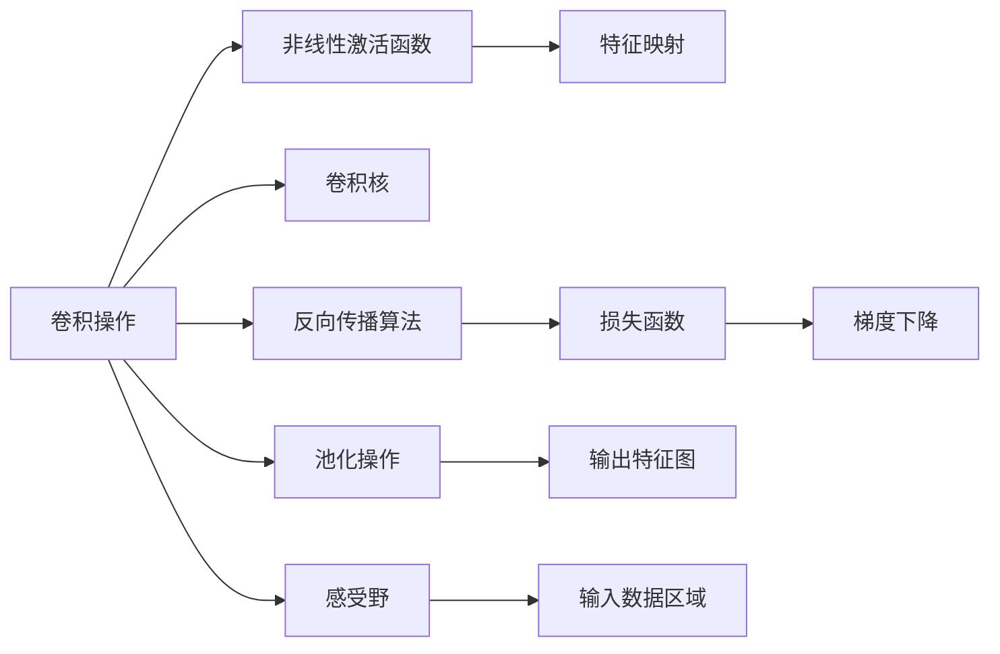

这个流程图展示了CNN的核心组件及其作用，各组件之间通过特征映射、梯度传递等机制紧密联系，共同构成了一个完整的CNN模型。

### 2.2 概念间的关系

这些核心概念之间存在着复杂的联系，形成一个有机的整体。下面我们通过几个Mermaid流程图来展示这些概念之间的关系：

#### 2.2.1 CNN的整体架构

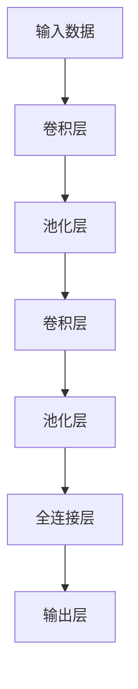

这个流程图展示了CNN的基本架构，即输入数据经过多个卷积层和池化层的处理后，进入全连接层进行分类或回归。

#### 2.2.2 卷积操作与池化操作的联系

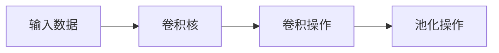

这个流程图展示了卷积操作和池化操作的关系。卷积操作对输入数据进行特征提取，而池化操作对提取的特征进行降采样，减少计算量。

#### 2.2.3 感受野与卷积核的关系

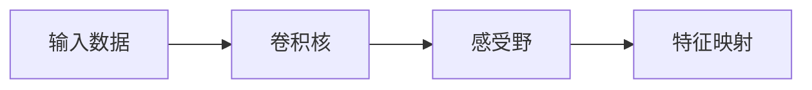

这个流程图展示了感受野和卷积核的关系。感受野的大小由卷积核的大小和步幅决定，决定了模型对输入数据的感知能力。

### 2.3 核心概念的整体架构

最后，我们用一个综合的流程图来展示这些核心概念在大规模图像分类任务中的应用：

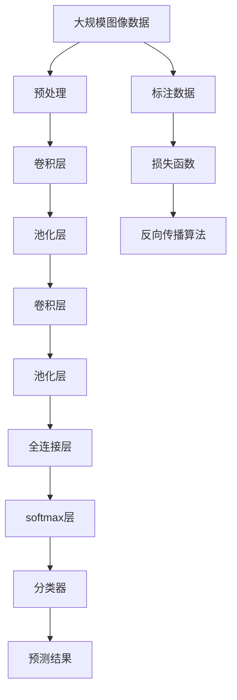

这个综合流程图展示了从数据预处理到模型训练的完整过程，各组件之间通过特征映射、梯度传递等机制紧密联系，共同构成了一个完整的CNN模型。

## 3. 核心算法原理 & 具体操作步骤
### 3.1 算法原理概述

卷积神经网络(CNN)的核心在于卷积操作和池化操作。其算法原理可以概括为以下几个步骤：

1. 卷积操作：通过对输入数据和卷积核进行逐元素乘积，并求和，得到卷积核覆盖区域内的特征值，即卷积操作的结果。
2. 池化操作：对卷积操作的结果进行下采样，减少特征图的尺寸，降低计算复杂度。
3. 多层卷积和池化：通过多层的卷积和池化操作，逐渐提取输入数据的高级特征。
4. 全连接层：将最后一层卷积层输出的特征图进行扁平化，并连接到全连接层进行分类或回归。
5. 激活函数：在卷积层和全连接层之间引入非线性激活函数，增加模型的表达能力。
6. 反向传播算法：通过计算梯度并更新参数，实现模型优化。

这些步骤共同构成了CNN的基本算法流程。

### 3.2 算法步骤详解

下面将详细介绍CNN的每个步骤的具体实现。

#### 3.2.1 卷积操作

卷积操作是CNN的核心，其实现方式如下：

1. 定义卷积核(即权重矩阵) $W$ 和偏置 $b$：
   $$
   W \in \mathbb{R}^{k_h \times k_w \times c_{in} \times c_{out}}, b \in \mathbb{R}^{c_{out}}
   $$
   其中 $k_h$ 和 $k_w$ 分别表示卷积核的高度和宽度，$c_{in}$ 表示输入数据的通道数，$c_{out}$ 表示输出特征的通道数。

2. 将输入数据 $X$ 和卷积核 $W$ 进行逐元素乘积，并对结果进行求和：
   $$
   \text{Conv}(X,W) = \sum_{i=1}^{k_h}\sum_{j=1}^{k_w}\sum_{c=1}^{c_{in}}(X_{i,j,c} \ast W_{i,j,c,:})
   $$
   其中 $X_{i,j,c}$ 表示输入数据 $X$ 在位置 $(i,j,c)$ 的像素值，$W_{i,j,c,:}$ 表示卷积核 $W$ 在通道 $c$ 上的特征映射。

3. 在结果上加上偏置 $b$，并进行非线性激活：
   $$
   Y_{i,j} = \max(0, \text{Conv}(X,W) + b)
   $$
   其中 $\max(0, \ldots)$ 表示取正值。

卷积操作的过程可以用以下示意图来解释：

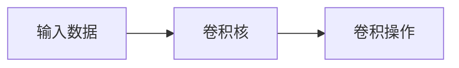

#### 3.2.2 池化操作

池化操作是通过降采样来减少特征图的尺寸，从而降低计算复杂度，增加模型的泛化能力。常见的池化方式有最大池化和平均池化。

1. 最大池化：
   $$
   \text{Max-Pooling}(X) = \max_{i,j}(X_{i,j})
   $$
   其中 $X_{i,j}$ 表示输入数据 $X$ 在位置 $(i,j)$ 的像素值。

2. 平均池化：
   $$
   \text{Average-Pooling}(X) = \frac{1}{k_h \times k_w} \sum_{i=1}^{k_h}\sum_{j=1}^{k_w}X_{i,j}
   $$

池化操作的过程可以用以下示意图来解释：

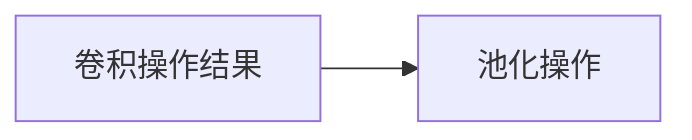

#### 3.2.3 多层卷积和池化

通过多层的卷积和池化操作，可以逐渐提取输入数据的高级特征。以下是一个简单的三层卷积和池化操作示意图：

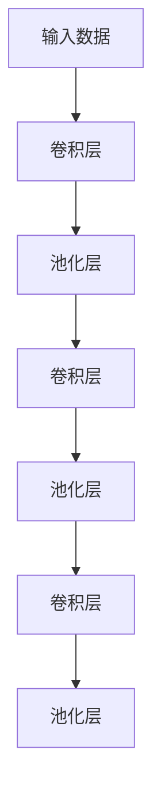

#### 3.2.4 全连接层

将最后一层卷积层输出的特征图进行扁平化，并连接到全连接层进行分类或回归。全连接层的实现方式如下：

1. 将特征图展开为一维向量：
   $$
   X \in \mathbb{R}^{m \times n \times c}, \text{Flatten}(X) \in \mathbb{R}^{m \times n \times c}
   $$

2. 将展开后的特征图连接到全连接层：
   $$
   \text{FC}(X) = W_1 X + b_1, W_2 \in \mathbb{R}^{c \times o}, b_2 \in \mathbb{R}^o
   $$
   其中 $o$ 表示全连接层的输出大小。

全连接层的实现方式可以用以下示意图来解释：

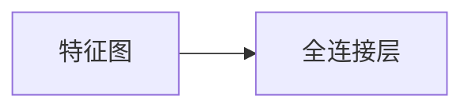

#### 3.2.5 激活函数

在卷积层和全连接层之间引入非线性激活函数，增加模型的表达能力。常用的激活函数有ReLU、Sigmoid、Tanh等，引入非线性映射的公式如下：

1. ReLU激活函数：
   $$
   Y = \max(0, X)
   $$

2. Sigmoid激活函数：
   $$
   Y = \frac{1}{1 + \exp(-X)}
   $$

3. Tanh激活函数：
   $$
   Y = \tanh(X)
   $$

激活函数的过程可以用以下示意图来解释：

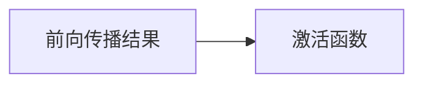

#### 3.2.6 反向传播算法

反向传播算法是CNN训练的核心算法，通过计算梯度并更新参数，实现模型优化。其具体实现方式如下：

1. 计算损失函数 $J$ 对输出层 $Y$ 的梯度 $\frac{\partial J}{\partial Y}$：
   $$
   \frac{\partial J}{\partial Y} = \frac{\partial L}{\partial Y}
   $$

2. 计算全连接层 $W_2$ 和偏置 $b_2$ 的梯度：
   $$
   \frac{\partial J}{\partial W_2} = \frac{\partial J}{\partial Y} \frac{\partial Y}{\partial X} \frac{\partial X}{\partial W_2}, \frac{\partial J}{\partial b_2} = \frac{\partial J}{\partial Y} \frac{\partial Y}{\partial X}
   $$

3. 计算卷积层的梯度：
   $$
   \frac{\partial J}{\partial W} = \frac{\partial J}{\partial Y} \frac{\partial Y}{\partial X} \frac{\partial X}{\partial W}
   $$

4. 使用梯度下降算法更新参数：
   $$
   W = W - \eta \frac{\partial J}{\partial W}, b = b - \eta \frac{\partial J}{\partial b}
   $$

其中 $\eta$ 表示学习率，$L$ 表示损失函数。

反向传播算法的实现方式可以用以下示意图来解释：

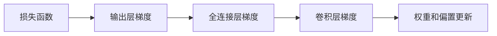

### 3.3 算法优缺点

卷积神经网络(CNN)的优缺点如下：

#### 优点

1. 参数共享：通过卷积核的参数共享，减少了模型中的参数数量，降低了计算复杂度。
2. 局部连接：通过局部连接机制，只对输入数据的部分区域进行操作，减少了计算量。
3. 可解释性：由于卷积核可以解释为特征提取器，CNN具有较好的可解释性。
4. 适用性强：CNN可以用于图像分类、目标检测、图像分割等多种任务。

#### 缺点

1. 参数优化难度大：由于卷积核的数量较多，CNN的参数优化相对困难，容易出现过拟合问题。
2. 计算资源要求高：由于卷积核的大小和数量较多，CNN需要较高的计算资源支持。
3. 空间感知能力有限：由于卷积操作只考虑局部区域，CNN的空间感知能力相对有限，难以处理全局信息。

### 3.4 算法应用领域

卷积神经网络(CNN)在计算机视觉领域有着广泛的应用，以下是几个典型的应用场景：

1. 图像分类：CNN可以自动学习图像特征，并根据特征进行分类。
2. 目标检测：CNN可以通过滑动窗口和ROI池化等技术，检测图像中的目标对象。
3. 图像分割：CNN可以将图像分割成多个区域，并对每个区域进行分类。
4. 人脸识别：CNN可以通过学习人脸特征，实现人脸识别和比对。
5. 图像生成：CNN可以通过生成对抗网络(GAN)等技术，生成新的图像。
6. 视频分析：CNN可以对视频帧进行处理，实现视频分类、动作识别等任务。

## 4. 数学模型和公式 & 详细讲解 & 举例说明

### 4.1 数学模型构建

CNN的数学模型可以表示为如下形式：

$$
J = \frac{1}{N}\sum_{i=1}^N L(Y_i, \hat{Y}_i)
$$

其中 $J$ 表示损失函数，$L$ 表示损失函数，$Y_i$ 表示真实标签，$\hat{Y}_i$ 表示模型预测值，$N$ 表示样本数。

### 4.2 公式推导过程

以下是CNN的核心公式推导过程：

1. 卷积操作：
   $$
   Y = W * X + b
   $$

2. 池化操作：
   $$
   Y_{\text{pool}} = \text{Max-Pooling}(Y)
   $$

3. 全连接层：
   $$
   Y_{\text{fc}} = W^{\text{fc}} X^{\text{fc}} + b^{\text{fc}}
   $$

4. 激活函数：
   $$
   Y = \text{ReLU}(Y)
   $$

5. 损失函数：
   $$
   J = \frac{1}{N}\sum_{i=1}^N (Y_i - \hat{Y}_i)^2
   $$

### 4.3 案例分析与讲解

以手写数字识别任务为例，展示CNN的实现过程。

#### 4.3.1 数据准备

使用MNIST数据集，将手写数字图像转换成灰度图像，并将其归一化到[0, 1]区间。

```python
from torchvision import datasets, transforms

# 数据预处理
transform = transforms.Compose([
    transforms.ToTensor(),
    transforms.Normalize((0.5,), (0.5,))
])
trainset = datasets.MNIST('data', train=True, download=True, transform=transform)
trainloader = torch.utils.data.DataLoader(trainset, batch_size=64, shuffle=True)
```

#### 4.3.2 网络结构设计

定义CNN网络结构，包括卷积层、池化层、全连接层等。

```python
import torch.nn as nn
import torch.nn.functional as F

class CNN(nn.Module):
    def __init__(self):
        super(CNN, self).__init__()
        self.conv1 = nn.Conv2d(1, 32, 5, 1, 2)
        self.pool = nn.MaxPool2d(2, 2)
        self.conv2 = nn.Conv2d(32, 64, 5, 1, 2)
        self.fc1 = nn.Linear(64 * 5 * 5, 1024)
        self.fc2 = nn.Linear(1024, 10)

    def forward(self, x):
        x = self.pool(F.relu(self.conv1(x)))
        x = self.pool(F.relu(self.conv2(x)))
        x = x.view(-1, 64 * 5 * 5)
        x = F.relu(self.fc1(x))
        x = self.fc2(x)
        return x

model = CNN()
```

#### 4.3.3 损失函数和优化器

定义损失函数和优化器，使用交叉熵损失和随机梯度下降算法。

```python
import torch.optim as optim

criterion = nn.CrossEntropyLoss()
optimizer = optim.SGD(model.parameters(), lr=0.001, momentum=0.9)
```

#### 4.3.4 模型训练

使用训练集进行模型训练，并在验证集上进行验证。

```python
import torch.optim as optim
from torch.autograd import Variable

for epoch in range(10):
    for i, (inputs, labels) in enumerate(trainloader):
        inputs, labels = Variable(inputs), Variable(labels)

        optimizer.zero_grad()

        outputs = model(inputs)
        loss = criterion(outputs, labels)
        loss.backward()
        optimizer.step()

        if (i+1) % 100 == 0:
            print('Epoch [%d/%d], Step [%d/%d], Loss: %.4f' %
                  (epoch+1, 10, i+1, len(trainloader), loss.data[0]))
```

#### 4.3.5 模型测试

使用测试集进行模型测试，并输出预测结果。

```python
correct = 0
total = 0
with torch.no_grad():
    for images, labels in testloader:
        outputs = model(images)
        _, predicted = torch.max(outputs.data, 1)
        total += labels.size(0)
        correct += (predicted == labels).sum().item()

print('Accuracy of the network on the 10000 test images: %d %%' % (
    100 * correct / total))
```

通过以上步骤，实现了CNN在手写数字识别任务上的应用。可以看到，CNN通过卷积和池化操作，自动学习图像特征，并根据特征进行分类。

## 5. 项目实践：代码实例和详细解释说明

### 5.1 开发环境搭建

在进行CNN项目实践前，我们需要准备好开发环境。以下是使用Python进行PyTorch开发的环境配置流程：

1. 安装Anaconda：从官网下载并安装Anaconda，用于创建独立的Python环境。

2. 创建并激活虚拟环境：
```bash
conda create -n pytorch-env python=3.8 
conda activate pytorch-env
```

3. 安装PyTorch：根据CUDA版本，从官网获取对应的安装命令。例如：
```bash
conda install pytorch torchvision torchaudio cudatoolkit=11.1 -c pytorch -c conda-forge
```

4. 安装必要的依赖库：
```bash
pip install numpy pandas matplotlib scikit-learn torchvision
```

完成上述步骤后，即可在`pytorch-env`环境中开始CNN项目实践。

### 5.2 源代码详细实现

下面我们以手写数字识别任务为例，给出使用PyTorch实现CNN的完整代码实现。

```python
from torch.utils.data import DataLoader
from torchvision import datasets, transforms
from torch import nn, optim

# 数据预处理
transform = transforms.Compose([
    transforms.ToTensor(),
    transforms.Normalize((0.5,), (0.5,))
])
trainset = datasets.MNIST('data', train=True, download=True, transform=transform)
trainloader = DataLoader(trainset, batch_size=64, shuffle=True)

# 定义CNN网络结构
class CNN(nn.Module):
    def __init__(self):
        super(CNN, self).__init__()
        self.conv1 = nn.Conv2d(1, 32, 5, 1, 2)
        self.pool = nn.MaxPool2d(2, 2)
        self.conv2 = nn.Conv2d(32, 64, 5, 1, 2)
        self.fc1 = nn.Linear(64 * 5 * 5, 1024)
        self.fc2 = nn.Linear(1024, 10)

    def forward(self, x):
        x = self.pool(F.relu(self.conv1(x)))
        x = self.pool(F.relu(self.conv2(x)))
        x = x.view(-1, 64 * 5 * 5)
        x = F.relu(self.fc1(x))
        x = self.fc2(x)
        return x

model = CNN()

# 定义损失函数和优化器
criterion = nn.CrossEntropyLoss()
optimizer = optim.SGD(model.parameters(), lr=0.001, momentum=0.9)

# 模型训练
for epoch in range(10):
    for i, (inputs, labels) in enumerate(trainloader):
        inputs, labels = Variable(inputs), Variable(labels)

        optimizer.zero_grad()

        outputs = model(inputs)
        loss = criterion(outputs, labels)
        loss.backward()
        optimizer.step()

        if (i+1) % 100 == 0:
            print('Epoch [%d/%d], Step [%d/%d], Loss: %.4f' %
                  (epoch+1, 10, i+1, len(trainloader), loss.data[0]))

# 模型测试
correct = 0
total = 0
with torch.no_grad():
    for images, labels in testloader:
        outputs = model(images)
        _, predicted = torch.max(outputs.data, 1)
        total += labels.size(0)
        correct += (predicted == labels).sum().item()

print('Accuracy of the network on the 10000 test images: %d %%' % (
    100 * correct / total))
```

以上就是使用PyTorch实现CNN的完整代码实现。可以看到，借助PyTorch的高级封装，我们可以用相对简洁的代码实现CNN模型，并快速迭代优化。

### 5.3 代码解读与分析

让我们再详细解读一下关键代码的实现细节：

**网络结构设计**：
- `__init__`方法：初始化卷积层、池化层、全连接层等组件。
- `forward`方法：定义前向传播过程，即输入数据经过卷积、池化、全连接等操作，最终输出预测结果。

**损失函数和优化器**：
- `nn.CrossEntropyLoss`：定义交叉熵损失函数，用于计算模型输出与真实标签之间的差距。
- `optim.SGD`：定义随机梯度下降优化器，用于更新模型参数。

**模型训练和测试**：
- `for`循环：对数据集进行迭代训练。
- `optimizer.zero_grad()`：在每个批次开始前，将梯度清零，避免梯度累积。
- `loss.backward()`：反向传播计算梯度。
- `optimizer.step()`：使用梯度更新模型参数。
- `torch.no_grad()`：在测试时关闭梯度计算，避免不必要的计算开销。

**

