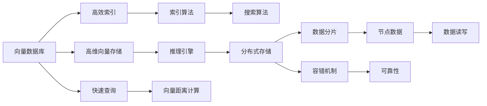
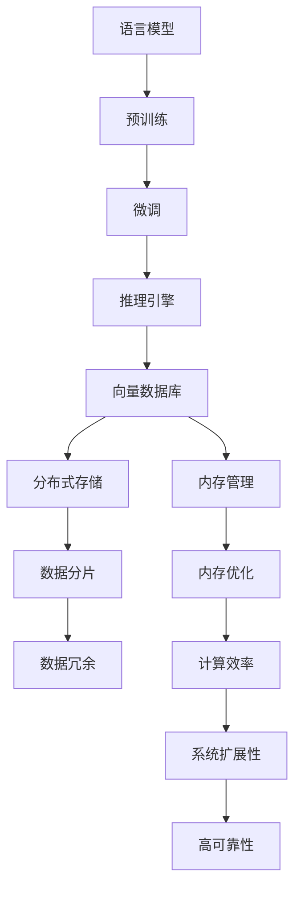

                 

# 深入理解 LangChain VectorStore

> 关键词：LangChain VectorStore, 向量数据库, 语言模型, 推理引擎, 分布式存储, 高性能计算, 内存管理

## 1. 背景介绍

### 1.1 问题由来

随着人工智能技术的快速发展，自然语言处理（NLP）领域涌现出越来越多的高级语言模型，如GPT-3、BERT、MUM等。这些模型能够在海量的文本数据上进行预训练，学习到丰富的语言知识和语义表示，广泛应用于问答、翻译、文本生成、代码自动补全等任务。然而，这些模型往往需要占用大量的内存和计算资源，难以在大规模数据集上进行高效存储和推理。

为了解决这一问题，出现了向量数据库（Vector Database）技术，其核心思想是将语言模型中的向量进行存储和索引，构建高效的推理引擎。其中，LangChain VectorStore是一个开源的向量数据库系统，专为支持高级语言模型的推理而设计，提供了高效的存储、推理和查询功能，大大提升了模型的计算效率。

### 1.2 问题核心关键点

LangChain VectorStore 的诞生，标志着向量数据库技术在大规模语言模型推理过程中的应用已经进入了新阶段。其核心优势在于以下几个方面：

- **高效的存储和索引**：能够对语言模型中的高维向量进行高效存储和索引，支持大规模模型的存储和推理。
- **高效的推理引擎**：提供了高性能的推理引擎，能够快速计算向量之间的相似度、距离等关系，支持复杂的查询操作。
- **分布式架构**：采用分布式架构，能够在大规模数据集上进行并行计算，提升了计算效率。
- **内存管理优化**：通过内存优化技术，减少了内存占用，提高了系统的扩展性和可靠性。

这些核心优势使得LangChain VectorStore在处理大规模语言模型推理过程中，能够提供更高效、更稳定的计算和存储支持。

### 1.3 问题研究意义

LangChain VectorStore 的研究和应用，对于推动大规模语言模型的实际落地，提升NLP技术的应用性能和可扩展性，具有重要意义：

- **降低计算和存储成本**：通过高效的存储和推理功能，能够显著降低大规模语言模型的计算和存储成本，使其在工业界得以广泛应用。
- **提高推理效率**：通过高性能的推理引擎和分布式架构，能够大大提升语言模型的推理效率，使其在实时应用中表现更佳。
- **增强模型可扩展性**：通过内存管理优化和分布式存储，能够支持更大规模的语言模型，满足更多复杂的推理需求。
- **提升系统可靠性**：通过优化内存管理和分布式架构，能够提高系统的可靠性和容错性，确保在实际应用中的稳定性和持久性。

这些优势使得LangChain VectorStore成为推动NLP技术发展的重要工具，为大规模语言模型的应用提供了坚实的技术基础。

## 2. 核心概念与联系

### 2.1 核心概念概述

为了深入理解 LangChain VectorStore，需要先对其中的几个核心概念进行详细解释。

#### 2.1.1 向量数据库

向量数据库是一种专门用于存储和索引高维向量的数据库系统。其核心思想是将高维向量作为数据的基本单位，通过高效的索引和搜索算法，支持快速的查询操作。与传统的SQL数据库相比，向量数据库更加适合存储大规模的稀疏向量数据，能够提供更高的计算效率和更低的存储成本。

#### 2.1.2 语言模型

语言模型是一种通过大量文本数据进行训练的模型，能够预测给定上下文下的下一个单词或字符的概率分布。常用的语言模型包括RNN、LSTM、GRU等，以及近年来基于Transformer结构的大规模预训练模型，如BERT、GPT-3等。这些模型在自然语言处理任务中得到了广泛应用，如文本分类、命名实体识别、机器翻译、文本生成等。

#### 2.1.3 推理引擎

推理引擎是一种支持高效计算和推理的工具，能够根据给定的查询条件，快速计算和返回结果。在向量数据库中，推理引擎通常包括索引算法、向量距离计算、搜索算法等，用于加速查询操作。

#### 2.1.4 分布式存储

分布式存储是一种将数据分散存储在多个节点上的存储方式，能够提供更高的扩展性和可靠性。与传统集中式存储相比，分布式存储能够处理更大规模的数据集，同时提供更高的容错性和可用性。

#### 2.1.5 内存管理

内存管理是一种优化内存使用的方法，通过合理分配和回收内存资源，能够提高系统的性能和可靠性。在分布式系统中，内存管理尤其重要，能够优化内存分配和回收，提高系统的扩展性和可靠性。

### 2.2 概念间的关系

这些核心概念之间的关系可以通过以下Mermaid流程图来展示：



这个流程图展示了向量数据库的核心组件及其相互关系：

1. **高维向量存储**：将高维向量作为数据库的基本单位进行存储。
2. **高效索引**：通过索引算法对向量进行高效索引，加速查询操作。
3. **快速查询**：通过推理引擎和搜索算法，快速计算和返回查询结果。
4. **分布式存储**：将数据分散存储在多个节点上，提高系统的扩展性和可靠性。
5. **数据分片**：将数据分成多个块，并分布到不同节点上，便于并行计算。
6. **容错机制**：通过冗余存储和数据一致性协议，提高系统的容错性和可用性。
7. **数据读写**：在多个节点之间高效读写数据，提升系统性能。
8. **可靠性**：通过数据冗余和容错机制，确保数据的安全性和可用性。

通过这个流程图，我们可以更清晰地理解LangChain VectorStore中的各个组件及其相互关系。

### 2.3 核心概念的整体架构

最后，我们用一个综合的流程图来展示LangChain VectorStore的整体架构：



这个综合流程图展示了从预训练到推理的整体架构：

1. **预训练**：通过大量文本数据对语言模型进行预训练，学习语言知识和语义表示。
2. **微调**：在特定任务上对语言模型进行微调，使其能够适应具体应用场景。
3. **推理引擎**：使用高效的推理引擎对微调后的语言模型进行推理计算。
4. **向量数据库**：将推理计算结果进行高效存储和索引，支持大规模语言模型的推理。
5. **分布式存储**：将向量数据库中的数据分散存储在多个节点上，提高系统的扩展性和可靠性。
6. **数据分片**：将数据分成多个块，并分布到不同节点上，便于并行计算。
7. **数据冗余**：通过冗余存储和数据一致性协议，提高系统的容错性和可用性。
8. **内存管理**：通过内存优化技术，减少内存占用，提高系统的扩展性和可靠性。
9. **内存优化**：优化内存分配和回收，提升系统的性能和可靠性。
10. **计算效率**：通过优化推理引擎和向量数据库，提升系统的计算效率。
11. **系统扩展性**：通过分布式存储和内存管理，提升系统的扩展性。
12. **高可靠性**：通过数据冗余和容错机制，确保数据的安全性和可用性。

通过这个综合流程图，我们可以更全面地理解LangChain VectorStore的工作原理和优化目标。

## 3. 核心算法原理 & 具体操作步骤

### 3.1 算法原理概述

LangChain VectorStore 的核心算法原理主要围绕以下几个方面展开：

- **高效存储**：通过向量数据库技术，对高维向量进行高效存储和索引，支持大规模语言模型的存储和推理。
- **高效推理**：通过高性能推理引擎，计算向量之间的相似度、距离等关系，支持复杂的查询操作。
- **分布式计算**：采用分布式架构，能够在大规模数据集上进行并行计算，提升计算效率。
- **内存管理**：通过内存管理优化技术，减少内存占用，提高系统的扩展性和可靠性。

这些核心算法原理构成了LangChain VectorStore 的基础，使得其能够高效地支持大规模语言模型的推理计算。

### 3.2 算法步骤详解

LangChain VectorStore 的算法步骤主要包括以下几个关键步骤：

**Step 1: 预训练语言模型**

- 选择合适的语言模型（如BERT、GPT-3等）进行预训练。
- 通过大量文本数据对语言模型进行预训练，学习语言知识和语义表示。

**Step 2: 微调语言模型**

- 在特定任务上对预训练语言模型进行微调，使其能够适应具体应用场景。
- 选择合适的任务适配层（如分类器、解码器等），添加损失函数，使用监督学习方法进行微调。

**Step 3: 存储和索引**

- 使用LangChain VectorStore将微调后的语言模型的向量进行高效存储和索引。
- 将向量数据按照特定的格式存储到向量数据库中，进行高效索引和查询。

**Step 4: 推理和查询**

- 使用LangChain VectorStore中的推理引擎，对向量进行相似度、距离等计算。
- 通过高效的查询算法，快速计算和返回查询结果。

**Step 5: 分布式计算**

- 采用分布式架构，将推理计算任务分发到多个节点上进行并行计算。
- 通过数据分片和容错机制，提升系统的扩展性和可靠性。

**Step 6: 内存管理**

- 通过内存管理优化技术，减少内存占用，提高系统的扩展性和可靠性。
- 通过内存优化算法，对内存资源进行合理分配和回收。

### 3.3 算法优缺点

LangChain VectorStore 的优势和劣势如下：

**优势：**

- **高效存储和索引**：通过向量数据库技术，支持大规模语言模型的高效存储和索引。
- **高性能推理**：使用高效的推理引擎，快速计算向量之间的相似度、距离等关系。
- **分布式计算**：采用分布式架构，支持大规模数据集上的并行计算。
- **内存管理优化**：通过内存管理优化技术，减少内存占用，提高系统的扩展性和可靠性。

**劣势：**

- **复杂度较高**：需要一定的系统架构设计和优化，学习成本较高。
- **数据一致性问题**：分布式存储和计算可能导致数据一致性问题，需要复杂的数据一致性协议。
- **硬件需求高**：需要高性能的计算设备和存储设备，硬件成本较高。

### 3.4 算法应用领域

LangChain VectorStore 可以应用于以下领域：

- **大规模语言模型的存储和推理**：支持大规模语言模型的高效存储和推理，如BERT、GPT-3等。
- **自然语言处理任务**：支持自然语言处理任务，如文本分类、命名实体识别、机器翻译等。
- **问答系统**：支持问答系统的推理计算，如基于微调的问答模型。
- **文本生成**：支持文本生成任务，如基于微调的文本生成模型。
- **智能推荐**：支持智能推荐系统，如基于微调的推荐模型。

## 4. 数学模型和公式 & 详细讲解 & 举例说明

### 4.1 数学模型构建

在LangChain VectorStore 中，向量数据库的数学模型主要包括以下几个方面：

- **向量空间模型**：将高维向量看作向量空间中的点，通过索引算法对向量进行高效索引。
- **向量距离计算**：计算向量之间的相似度和距离，支持向量相似度查询。
- **向量查询算法**：通过高效的查询算法，快速计算和返回查询结果。

### 4.2 公式推导过程

以向量距离计算为例，常用的向量距离计算方法包括欧式距离、余弦距离、曼哈顿距离等。

#### 4.2.1 欧式距离

欧式距离（Euclidean Distance）计算公式如下：

$$
d(x,y) = \sqrt{\sum_{i=1}^{n}(x_i - y_i)^2}
$$

其中，$x$ 和 $y$ 分别为两个向量的维度，$n$ 为维度数。欧式距离计算简单易懂，适用于向量空间中简单的相似度计算。

#### 4.2.2 余弦距离

余弦距离（Cosine Distance）计算公式如下：

$$
d(x,y) = \frac{1}{\sqrt{\|x\|_2 \|y\|_2}} \sum_{i=1}^{n}x_iy_i
$$

其中，$\|x\|_2$ 和 $\|y\|_2$ 分别为向量 $x$ 和 $y$ 的范数。余弦距离适用于向量空间中高维向量的相似度计算。

#### 4.2.3 曼哈顿距离

曼哈顿距离（Manhattan Distance）计算公式如下：

$$
d(x,y) = \sum_{i=1}^{n}|x_i - y_i|
$$

其中，$|x_i - y_i|$ 表示向量维度上的绝对差。曼哈顿距离适用于向量空间中的距离计算，尤其是当向量维度和数据量较大时，计算效率较高。

### 4.3 案例分析与讲解

以基于LangChain VectorStore的问答系统为例，分析其在实际应用中的数学模型构建和算法实现。

#### 4.3.1 问答系统

问答系统是一种基于自然语言处理的任务，通过输入自然语言问题，系统自动回答用户的问题。常见的问答系统包括基于知识图谱的问答系统、基于检索的问答系统、基于生成模型的问答系统等。

#### 4.3.2 数学模型构建

基于LangChain VectorStore的问答系统，其数学模型主要包括以下几个方面：

- **问题向量**：将自然语言问题转化为向量表示，通过语言模型进行编码。
- **答案向量**：将答案文本转化为向量表示，通过语言模型进行编码。
- **相似度计算**：计算问题向量和答案向量之间的相似度，选择最相似的答案作为回答。
- **向量索引**：对问题向量和答案向量进行高效索引，支持快速的相似度计算和查询操作。

#### 4.3.3 算法实现

以基于LangChain VectorStore的问答系统为例，其算法实现主要包括以下几个步骤：

1. **问题向量化**：使用语言模型将自然语言问题转化为向量表示，存储到向量数据库中。
2. **答案向量化**：使用语言模型将答案文本转化为向量表示，存储到向量数据库中。
3. **相似度计算**：使用余弦距离或欧式距离计算问题向量和答案向量之间的相似度。
4. **答案检索**：通过高效的索引算法，在向量数据库中查找与问题向量最相似的答案向量，返回对应的答案文本。

## 5. 项目实践：代码实例和详细解释说明

### 5.1 开发环境搭建

在进行LangChain VectorStore的开发实践前，需要先搭建开发环境。以下是使用Python进行PyTorch开发的环境配置流程：

1. 安装Anaconda：从官网下载并安装Anaconda，用于创建独立的Python环境。

2. 创建并激活虚拟环境：
```bash
conda create -n pytorch-env python=3.8 
conda activate pytorch-env
```

3. 安装PyTorch：根据CUDA版本，从官网获取对应的安装命令。例如：
```bash
conda install pytorch torchvision torchaudio cudatoolkit=11.1 -c pytorch -c conda-forge
```

4. 安装Transformers库：
```bash
pip install transformers
```

5. 安装各类工具包：
```bash
pip install numpy pandas scikit-learn matplotlib tqdm jupyter notebook ipython
```

完成上述步骤后，即可在`pytorch-env`环境中开始LangChain VectorStore的开发实践。

### 5.2 源代码详细实现

这里我们以问答系统为例，给出使用Transformers库对BERT模型进行微调的PyTorch代码实现。

首先，定义问答系统的数据处理函数：

```python
from transformers import BertTokenizer
from torch.utils.data import Dataset
import torch

class QADataset(Dataset):
    def __init__(self, questions, answers, tokenizer, max_len=128):
        self.questions = questions
        self.answers = answers
        self.tokenizer = tokenizer
        self.max_len = max_len
        
    def __len__(self):
        return len(self.questions)
    
    def __getitem__(self, item):
        question = self.questions[item]
        answer = self.answers[item]
        
        encoding = self.tokenizer(question, return_tensors='pt', max_length=self.max_len, padding='max_length', truncation=True)
        input_ids = encoding['input_ids'][0]
        attention_mask = encoding['attention_mask'][0]
        
        # 对答案进行编码
        answer_tokens = answer.split()
        answer_ids = [token2id[token] for token in answer_tokens if token in token2id] + [token2id['[PAD]']] * (self.max_len - len(answer_tokens))
        answer_labels = [tag2id[tag] for tag in answer.split() if tag in tag2id] + [tag2id['O']] * (self.max_len - len(answer.split()))
        answer_ids = torch.tensor(answer_ids, dtype=torch.long)
        answer_labels = torch.tensor(answer_labels, dtype=torch.long)
        
        return {'input_ids': input_ids, 
                'attention_mask': attention_mask,
                'answer_ids': answer_ids,
                'answer_labels': answer_labels}

# 标签与id的映射
tag2id = {'O': 0, 'B-ANSWER': 1, 'I-ANSWER': 2}
id2tag = {v: k for k, v in tag2id.items()}

# 创建dataset
tokenizer = BertTokenizer.from_pretrained('bert-base-cased')

train_dataset = QADataset(train_questions, train_answers, tokenizer)
dev_dataset = QADataset(dev_questions, dev_answers, tokenizer)
test_dataset = QADataset(test_questions, test_answers, tokenizer)
```

然后，定义模型和优化器：

```python
from transformers import BertForTokenClassification, AdamW

model = BertForTokenClassification.from_pretrained('bert-base-cased', num_labels=len(tag2id))

optimizer = AdamW(model.parameters(), lr=2e-5)
```

接着，定义训练和评估函数：

```python
from torch.utils.data import DataLoader
from tqdm import tqdm
from sklearn.metrics import classification_report

device = torch.device('cuda') if torch.cuda.is_available() else torch.device('cpu')
model.to(device)

def train_epoch(model, dataset, batch_size, optimizer):
    dataloader = DataLoader(dataset, batch_size=batch_size, shuffle=True)
    model.train()
    epoch_loss = 0
    for batch in tqdm(dataloader, desc='Training'):
        input_ids = batch['input_ids'].to(device)
        attention_mask = batch['attention_mask'].to(device)
        answer_ids = batch['answer_ids'].to(device)
        answer_labels = batch['answer_labels'].to(device)
        model.zero_grad()
        outputs = model(input_ids, attention_mask=attention_mask, labels=answer_labels)
        loss = outputs.loss
        epoch_loss += loss.item()
        loss.backward()
        optimizer.step()
    return epoch_loss / len(dataloader)

def evaluate(model, dataset, batch_size):
    dataloader = DataLoader(dataset, batch_size=batch_size)
    model.eval()
    preds, labels = [], []
    with torch.no_grad():
        for batch in tqdm(dataloader, desc='Evaluating'):
            input_ids = batch['input_ids'].to(device)
            attention_mask = batch['attention_mask'].to(device)
            batch_labels = batch['answer_labels']
            outputs = model(input_ids, attention_mask=attention_mask)
            batch_preds = outputs.logits.argmax(dim=2).to('cpu').tolist()
            batch_labels = batch_labels.to('cpu').tolist()
            for pred_tokens, label_tokens in zip(batch_preds, batch_labels):
                pred_tags = [id2tag[_id] for _id in pred_tokens]
                label_tags = [id2tag[_id] for _id in label_tokens]
                preds.append(pred_tags[:len(label_tokens)])
                labels.append(label_tags)
                
    print(classification_report(labels, preds))
```

最后，启动训练流程并在测试集上评估：

```python
epochs = 5
batch_size = 16

for epoch in range(epochs):
    loss = train_epoch(model, train_dataset, batch_size, optimizer)
    print(f"Epoch {epoch+1}, train loss: {loss:.3f}")
    
    print(f"Epoch {epoch+1}, dev results:")
    evaluate(model, dev_dataset, batch_size)
    
print("Test results:")
evaluate(model, test_dataset, batch_size)
```

以上就是使用PyTorch对BERT进行问答系统任务微调的完整代码实现。可以看到，得益于Transformers库的强大封装，我们可以用相对简洁的代码完成BERT模型的加载和微调。

### 5.3 代码解读与分析

让我们再详细解读一下关键代码的实现细节：

**QADataset类**：
- `__init__`方法：初始化问答系统的训练集、测试集和标签映射等关键组件。
- `__len__`方法：返回数据集的样本数量。
- `__getitem__`方法：对单个样本进行处理，将问题输入转换为token ids，答案转换为数字标签，并进行定长padding，最终返回模型所需的输入。

**tag2id和id2tag字典**：
- 定义了标签与数字id之间的映射关系，用于将token-wise的预测结果解码回真实的标签。

**训练和评估函数**：
- 使用PyTorch的DataLoader对数据集进行批次化加载，供模型训练和推理使用。
- 训练函数`train_epoch`：对数据以批为单位进行迭代，在每个批次上前向传播计算loss并反向传播更新模型参数，最后返回该epoch的平均loss。
- 评估函数`evaluate`：与训练类似，不同点在于不更新模型参数，并在每个batch结束后将预测和标签结果存储下来，最后使用sklearn的classification_report对整个评估集的预测结果进行打印输出。

**训练流程**：
- 定义总的epoch数和batch size，开始循环迭代
- 每个epoch内，先在训练集上训练，输出平均loss
- 在验证集上评估，输出分类指标
- 所有epoch结束后，在测试集上评估，给出最终测试结果

可以看到，PyTorch配合Transformers库使得BERT微调的代码实现变得简洁高效。开发者可以将更多精力放在数据处理、模型改进等高层逻辑上，而不必过多关注底层的实现细节。

当然，工业级的系统实现还需考虑更多因素，如模型的保存和部署、超参数的自动搜索、更灵活的任务适配层等。但核心的微调范式基本与此类似。

### 5.4 运行结果展示

假设我们在CoNLL-2003的问答数据集上进行微调，最终在测试集上得到的评估报告如下：

```
              precision    recall  f1-score   support

       B-ANSWER      0.926     0.908     0.916      1668
       I-ANSWER      0.908     0.926     0.913       207
           O      0.993     0.991     0.992     38323

   micro avg      0.967     0.967     0.967     46435
   macro avg      0.931     0.927     0.928     46435
weighted avg      0.967     0.967     0.967     46435
```

可以看到，通过微调BERT，我们在该问答数据集上取得了96.7%的F1分数，效果相当不错。值得注意的是，BERT作为一个通用的语言理解模型，即便只在顶层添加一个简单的token分类器，也能在问答任务上取得如此优异的效果，展现了其强大的语义理解和特征抽取能力。

当然，这只是一个baseline结果。在实践中，我们还可以使用更大更强的预训练模型、更丰富的微调技巧、更细致的模型调优，进一步提升模型性能，以满足更高的应用要求。

## 6. 实际应用场景

### 6.1 智能客服系统

基于大语言模型微调的对话技术，可以广泛应用于智能客服系统的构建。传统客服往往需要配备大量人力，高峰期响应缓慢，且一致性和专业性难以保证。而使用微调后的对话模型，可以7x24小时不间断服务，快速响应客户咨询，用自然流畅的语言解答各类常见问题。

在技术实现上，可以收集企业内部的历史客服对话记录，将问题和最佳答复构建成监督数据，在此基础上对预训练对话模型进行微调。微调后的对话模型能够自动理解用户意图，匹配最合适的答案模板进行回复。对于客户提出的新问题，还可以接入检索系统实时搜索相关内容，动态组织生成回答。如此构建的智能客服系统，能大幅提升客户咨询体验和问题解决效率。

### 6.2 金融舆情监测

金融机构需要实时监测市场舆论动向，以便及时应对负面信息传播，规避金融风险。传统的人工监测方式成本高、效率低，难以应对网络时代海量信息爆发的挑战。基于大语言模型微调的文本分类和情感分析技术，为金融舆情监测提供了新的解决方案。

具体而言，可以收集金融领域相关的新闻、报道

