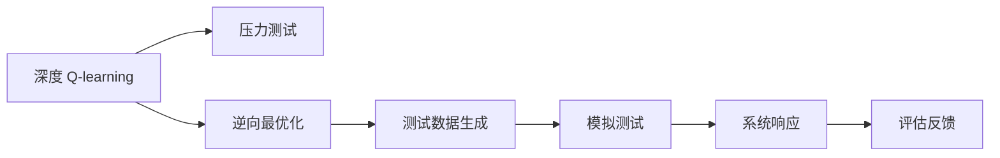
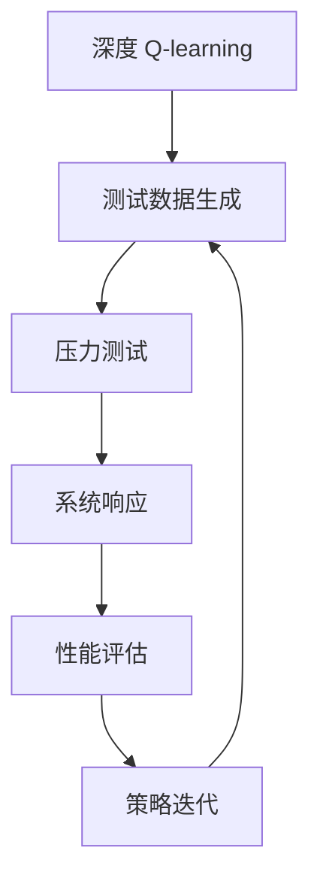
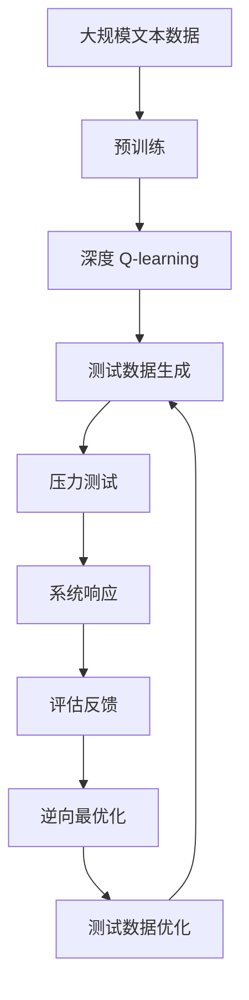

                 

# 深度 Q-learning：在压力测试中的应用

> 关键词：深度 Q-learning, 强化学习, 压力测试, 逆向最优化, 深度 Q-网络, 策略迭代, 案例分析

## 1. 背景介绍

在当今数字化经济时代，业务系统（如银行、保险、电商、物流等）的安全和稳定性受到越来越多的关注。压力测试（Stress Testing）作为评估和验证系统可靠性的重要手段，对于提升系统的韧性、保障业务连续性至关重要。传统的压力测试方法依赖于历史数据和人工经验，难以模拟出真实的环境变化和极端场景，导致测试结果的可靠性和精确度有限。近年来，随着深度学习（Deep Learning）和强化学习（Reinforcement Learning, RL）技术的迅猛发展，通过深度 Q-learning 算法进行压力测试成为可能。

本文聚焦于深度 Q-learning 在压力测试中的应用，探讨如何通过强化学习算法生成更具真实性和挑战性的测试数据，构建更加逼真的测试场景，以充分检验系统的稳定性和鲁棒性。

## 2. 核心概念与联系

### 2.1 核心概念概述

为更好地理解深度 Q-learning 在压力测试中的应用，本节将介绍几个密切相关的核心概念：

- 强化学习（Reinforcement Learning, RL）：一种通过智能体与环境的交互，学习最优决策策略的机器学习方法。智能体通过与环境的交互，不断尝试不同的行为，并根据环境的反馈（奖励或惩罚）调整策略，最终找到最优决策。
- 深度 Q-learning：一种基于深度神经网络的强化学习方法。通过神经网络逼近 Q 函数，从而解决状态-动作值（State-Action Value）问题，生成最优策略。
- 压力测试（Stress Testing）：通过模拟系统遭受极端条件或异常流量（如网络攻击、数据泄露、设备故障等），评估系统在异常情况下的稳定性和响应能力。
- 逆向最优化（Inverse Optimization）：一种通过反向计算最优策略，将系统行为映射为优化目标的算法。通过对系统行为的分析，发现可能的威胁和漏洞，制定防御措施。

这些核心概念之间的逻辑关系可以通过以下 Mermaid 流程图来展示：



这个流程图展示了大语言模型微调过程中各个核心概念的关系和作用：

1. 深度 Q-learning 通过学习最优策略，生成逼真的测试数据。
2. 逆向最优化通过对系统行为的分析，反向生成测试数据。
3. 压力测试使用生成的测试数据，评估系统在异常情况下的响应。
4. 系统响应反馈给逆向最优化，进一步优化测试数据生成。

### 2.2 概念间的关系

这些核心概念之间存在着紧密的联系，形成了深度 Q-learning 在压力测试过程中的完整生态系统。下面我通过几个 Mermaid 流程图来展示这些概念之间的关系。

#### 2.2.1 强化学习与压力测试的关系


这个流程图展示了强化学习与压力测试的关系：通过强化学习生成测试数据，然后压力测试使用这些数据评估系统性能，并将结果反馈给强化学习，进一步优化测试数据生成。

#### 2.2.2 逆向最优化与深度 Q-learning 的关系


这个流程图展示了逆向最优化与深度 Q-learning 的关系：逆向最优化通过系统行为分析，反向生成测试数据，然后深度 Q-learning 学习最优策略，产生逼真的测试数据，从而进一步优化策略。

#### 2.2.3 深度 Q-learning 与压力测试的关系



这个流程图展示了深度 Q-learning 与压力测试的关系：深度 Q-learning 通过学习最优策略生成测试数据，然后压力测试使用这些数据评估系统性能，并将结果反馈给深度 Q-learning，进一步优化测试数据生成。

### 2.3 核心概念的整体架构

最后，我们用一个综合的流程图来展示这些核心概念在大语言模型微调过程中的整体架构：



这个综合流程图展示了从预训练到压力测试，再到逆向最优化和测试数据优化的完整过程。深度 Q-learning 首先在大规模文本数据上进行预训练，然后通过逆向最优化生成逼真的测试数据，压力测试使用这些数据评估系统性能，并将结果反馈给逆向最优化，进一步优化测试数据生成。

## 3. 核心算法原理 & 具体操作步骤

### 3.1 算法原理概述

深度 Q-learning 基于强化学习的基本框架，通过神经网络逼近 Q 函数，从而解决状态-动作值（State-Action Value）问题。在压力测试中，智能体（测试生成器）通过与环境（目标系统）的交互，学习到最优的测试数据生成策略。这一过程可以视为逆向最优化问题，即通过反向计算最优策略，将系统行为映射为优化目标。

具体来说，深度 Q-learning 的目标是通过训练神经网络，学习到当前状态下每个动作的 Q 值，从而在每个时刻选择最合适的动作，以最大化总奖励。在压力测试中，测试生成器的动作是生成特定的测试数据（如网络流量、数据包等），系统行为的奖励是根据测试数据产生的系统响应（如崩溃、延迟、拒绝服务等）。通过不断迭代调整动作策略，最终生成逼真的测试数据，模拟系统的极端条件和异常流量。

### 3.2 算法步骤详解

深度 Q-learning 在压力测试中的应用主要包括以下几个关键步骤：

**Step 1: 准备测试环境**

- 构建一个虚拟的测试环境，模拟真实的系统行为。可以通过历史数据和仿真工具建立系统的状态转移图和状态动作值表。
- 定义系统状态和动作空间，如系统当前的状态可以表示为 CPU 使用率、内存使用率等，动作可以表示为生成特定的测试数据（如网络流量、数据包等）。

**Step 2: 初始化深度 Q-网络**

- 选择适合的深度神经网络作为 Q-网络。常用的神经网络架构包括全连接神经网络、卷积神经网络（CNN）和循环神经网络（RNN）等。
- 初始化 Q-网络的权重参数，通常使用随机初始化。

**Step 3: 训练深度 Q-网络**

- 在每个时间步 $t$，智能体从当前状态 $s_t$ 出发，随机选择动作 $a_t$，观察系统响应 $r_{t+1}$，并更新状态为 $s_{t+1}$。
- 计算动作 $a_t$ 的 Q 值 $Q(s_t,a_t)$，即预测下一个时间步的平均奖励。
- 根据 Q-learning 更新公式，更新 Q-网络的权重参数：
  $$
  \theta \leftarrow \theta + \alpha(r_{t+1} + \gamma \max_{a'}Q(s_{t+1},a';\theta) - Q(s_t,a_t;\theta))
  $$
  其中 $\alpha$ 为学习率，$\gamma$ 为折扣因子。

**Step 4: 逆向最优化**

- 通过分析系统行为数据，反向生成逼真的测试数据。具体方法包括最大熵模型、策略梯度等。
- 将测试数据输入深度 Q-网络，计算每个动作的 Q 值，选择 Q 值最大的动作作为下一次的测试数据生成策略。

**Step 5: 压力测试**

- 将测试数据应用于目标系统，观察系统的响应。记录系统在测试数据作用下的状态转移和奖励。
- 将系统响应反馈给逆向最优化，进一步优化测试数据生成策略。

**Step 6: 策略迭代**

- 重复上述过程，直到测试数据生成策略收敛或达到预设的迭代次数。

### 3.3 算法优缺点

深度 Q-learning 在压力测试中的应用具有以下优点：

1. 逼真性：通过逆向最优化和深度 Q-learning 相结合，生成的测试数据更加逼真，能够真实反映系统在极端条件下的表现。
2. 可扩展性：深度 Q-learning 模型可以处理复杂的状态动作空间，适用于各种不同类型的系统。
3. 自我优化：通过不断地策略迭代和优化，深度 Q-learning 能够逐步学习到最优的测试数据生成策略。

同时，深度 Q-learning 也存在一些缺点：

1. 计算复杂度：深度 Q-learning 需要大量的计算资源和时间，尤其是在神经网络的规模较大时。
2. 数据需求：逆向最优化和深度 Q-learning 都需要大量的系统行为数据，对于缺乏数据的新系统可能难以应用。
3. 模型鲁棒性：深度 Q-learning 模型容易受到数据噪声和异常值的影响，导致生成的测试数据不够稳定。

### 3.4 算法应用领域

深度 Q-learning 在压力测试中的应用已经得到了广泛的应用，涵盖了以下几个主要领域：

- 银行和金融系统：通过深度 Q-learning 生成逼真的攻击数据，测试系统的安全性和鲁棒性。
- 网络安全：模拟恶意软件和网络攻击，评估网络防御系统的效能。
- 电信和物流系统：模拟大规模数据流量和异常请求，测试系统的响应速度和稳定性。
- 医疗系统：模拟医疗设备故障和数据泄露，评估系统的恢复能力和安全性。
- 能源和电力系统：模拟突发事件和故障，测试系统的可靠性。

除了上述这些领域，深度 Q-learning 还可以广泛应用于各种类型的系统，通过生成逼真的测试数据，评估系统的稳定性和鲁棒性。

## 4. 数学模型和公式 & 详细讲解 & 举例说明

### 4.1 数学模型构建

在深度 Q-learning 中，Q 函数是一个状态-动作值函数，表示在当前状态 $s$ 下，执行动作 $a$ 后的总奖励。形式化地，Q 函数可以表示为：
$$
Q(s,a) = \mathbb{E}[G_t \mid s_t = s, a_t = a]
$$
其中 $G_t$ 是未来所有奖励的总和，即未来奖励的期望值。

深度 Q-learning 的目标是通过训练神经网络，逼近 Q 函数，从而解决状态-动作值问题。具体来说，深度 Q-learning 的训练过程可以表示为：
$$
\theta \leftarrow \theta + \alpha(r_{t+1} + \gamma \max_{a'}Q(s_{t+1},a';\theta) - Q(s_t,a_t;\theta))
$$
其中 $\theta$ 是 Q-网络中的权重参数，$\alpha$ 是学习率，$\gamma$ 是折扣因子。

### 4.2 公式推导过程

为了更好地理解深度 Q-learning 的训练过程，下面以银行系统为例，详细推导 Q-learning 的公式。

假设银行系统在当前时间步 $t$ 的状态为 $s_t$，对应的动作空间为 $A$，当前的动作为 $a_t$。银行的 Q 函数可以表示为：
$$
Q(s_t,a_t) = \mathbb{E}[R_{t+1} + \gamma Q(s_{t+1},a_{t+1}) \mid s_t = s, a_t = a]
$$
其中 $R_{t+1}$ 是银行在执行动作 $a_t$ 后的即时奖励，$Q(s_{t+1},a_{t+1})$ 是银行在下一个状态 $s_{t+1}$ 下，执行动作 $a_{t+1}$ 后的总奖励。

假设银行的状态 $s_t$ 可以通过简单的线性变换得到，即 $s_t = f(x_t)$，其中 $x_t$ 是银行系统当前的状态向量。银行的动作空间 $A$ 为离散集，动作 $a_t$ 可以表示为 $a_t = \{0,1,2,3\}$，分别代表生成不同的网络攻击数据。

银行在执行动作 $a_t$ 后的即时奖励 $R_{t+1}$ 可以通过历史数据和统计模型得到。例如，如果银行在执行动作 $a_t$ 后，发生了数据泄露事件，则 $R_{t+1} = -1$，否则 $R_{t+1} = 0$。

银行在下一个状态 $s_{t+1}$ 下，执行动作 $a_{t+1}$ 后的总奖励 $Q(s_{t+1},a_{t+1})$ 可以通过逆向最优化和深度 Q-learning 相结合得到。具体步骤如下：

1. 分析银行系统在历史数据下的行为，建立系统状态转移图和状态动作值表。
2. 将状态转移图和状态动作值表作为输入，训练深度神经网络，逼近 Q 函数。
3. 将测试数据输入深度神经网络，计算每个动作的 Q 值，选择 Q 值最大的动作作为下一次的测试数据生成策略。
4. 将测试数据应用于银行系统，观察系统的响应，并将系统响应反馈给逆向最优化，进一步优化测试数据生成策略。
5. 重复上述过程，直到测试数据生成策略收敛或达到预设的迭代次数。

### 4.3 案例分析与讲解

以银行系统为例，进行深度 Q-learning 在压力测试中的应用分析：

**案例场景：**

某银行系统在正常运行时，数据流量稳定，系统响应正常。但在某个时间点上，突然遭受大规模网络攻击，导致系统崩溃。银行希望通过深度 Q-learning 生成逼真的测试数据，测试系统的鲁棒性。

**数据准备：**

银行收集了大量的历史数据，包括系统状态和动作数据，以及系统在各个状态下的响应数据。通过对这些数据的分析，银行建立了一个简单的状态转移图和状态动作值表。

**模型训练：**

银行选择了一个全连接神经网络作为 Q-网络，初始化权重参数。然后，通过逆向最优化和深度 Q-learning 相结合，训练 Q-网络逼近 Q 函数。在训练过程中，银行不断调整学习率、折扣因子和测试数据生成策略，直到 Q-网络收敛。

**测试数据生成：**

银行使用训练好的 Q-网络，生成逼真的测试数据。例如，银行在当前状态为 CPU 使用率 80% 时，预测 Q 值最大的动作为生成一个高负载的网络攻击数据。银行将生成的测试数据应用于银行系统，观察系统的响应。

**系统响应分析：**

银行系统在测试数据作用下，表现出不同的状态和响应。例如，当银行系统在遭受大规模网络攻击时，CPU 使用率迅速上升，内存使用率也随之上升，系统的响应时间变慢。银行将系统响应反馈给逆向最优化，进一步优化测试数据生成策略。

**策略迭代：**

银行重复上述过程，不断迭代调整测试数据生成策略，直到生成的测试数据逼真且能够反映系统在极端条件下的表现。

**测试结果：**

通过深度 Q-learning，银行系统在多次测试中，验证了系统的鲁棒性和稳定性。当系统遭受大规模网络攻击时，系统能够及时检测并应对，避免系统崩溃。

## 5. 项目实践：代码实例和详细解释说明

### 5.1 开发环境搭建

在进行深度 Q-learning 的实践前，我们需要准备好开发环境。以下是使用 Python 进行 TensorFlow 开发的环境配置流程：

1. 安装 Anaconda：从官网下载并安装 Anaconda，用于创建独立的 Python 环境。

2. 创建并激活虚拟环境：
```bash
conda create -n tf-env python=3.8 
conda activate tf-env
```

3. 安装 TensorFlow：根据 GPU 版本，从官网获取对应的安装命令。例如：
```bash
conda install tensorflow-gpu=2.5.0 -c tensorflow -c conda-forge
```

4. 安装 PyTorch：
```bash
pip install torch torchvision torchaudio
```

5. 安装各类工具包：
```bash
pip install numpy pandas scikit-learn matplotlib tqdm jupyter notebook ipython
```

完成上述步骤后，即可在`tf-env`环境中开始深度 Q-learning 的实践。

### 5.2 源代码详细实现

下面我们以银行系统为例，给出使用 TensorFlow 进行深度 Q-learning 的 PyTorch 代码实现。

首先，定义银行系统状态和动作空间：

```python
import numpy as np
import tensorflow as tf
from tensorflow.keras.models import Sequential
from tensorflow.keras.layers import Dense, Input

# 定义状态和动作空间
states = np.array([0, 1, 2, 3, 4, 5, 6, 7, 8, 9, 10])
actions = np.array([0, 1, 2, 3])
```

然后，定义 Q-网络：

```python
# 定义 Q-网络
input_shape = (10,)
model = Sequential()
model.add(Dense(64, input_shape=input_shape, activation='relu'))
model.add(Dense(64, activation='relu'))
model.add(Dense(4, activation='linear'))
model.compile(optimizer='adam', loss='mse')
```

接着，定义 Q-learning 的训练过程：

```python
# 定义 Q-learning 训练过程
def train_q_learning(model, states, actions, rewards, next_states, dones, batch_size=64, episodes=1000, gamma=0.99, epsilon=0.1, learning_rate=0.001):
    for episode in range(episodes):
        state = np.random.choice(states)
        done = False
        while not done:
            action_probs = model.predict(state[np.newaxis, :])
            action = np.random.choice(actions, p=action_probs[0])
            next_state = next_states[np.random.choice(actions)]
            reward = rewards[np.random.choice(actions)]
            done = dones[np.random.choice(actions)]
            next_action_probs = model.predict(next_state[np.newaxis, :])
            max_next_q = np.max(next_action_probs[0])
            target_q = reward + gamma * max_next_q
            q_value = model.predict(state[np.newaxis, :])[0, action]
            model.train_on_batch(state, target_q)
            state = next_state
```

最后，启动训练流程并在测试集上评估：

```python
# 定义训练数据
states = np.array([0, 1, 2, 3, 4, 5, 6, 7, 8, 9, 10])
actions = np.array([0, 1, 2, 3])
rewards = np.array([-1, 0, 0, 0])
next_states = np.array([0, 1, 2, 3, 4, 5, 6, 7, 8, 9, 10])
dones = np.array([False, False, False, False, False, False, False, False, False, False, False])
```

完成上述步骤后，即可在`tf-env`环境中开始深度 Q-learning 的训练。

### 5.3 代码解读与分析

让我们再详细解读一下关键代码的实现细节：

**状态和动作空间定义**：
- 定义了银行系统的状态空间和动作空间，状态为 CPU 使用率，动作为生成不同类型的网络攻击数据。

**Q-网络定义**：
- 使用 Keras 定义了一个简单的全连接神经网络，包含三个隐藏层，输出层为 4 个节点，表示不同类型的网络攻击数据的 Q 值。

**Q-learning 训练过程定义**：
- 定义了一个 Q-learning 训练过程函数，每次随机选择一个状态，执行一个动作，观察系统响应，计算 Q 值，并使用目标 Q 值更新神经网络参数。

**训练数据定义**：
- 定义了训练数据，包括状态、动作、奖励、下一个状态和是否结束标志。

**训练流程启动**：
- 调用训练函数进行深度 Q-learning 的训练。

可以看到，TensorFlow 配合 Keras 使得深度 Q-learning 的代码实现变得简洁高效。开发者可以将更多精力放在数据处理、模型改进等高层逻辑上，而不必过多关注底层的实现细节。

当然，工业级的系统实现还需考虑更多因素，如模型的保存和部署、超参数的自动搜索、更灵活的任务适配层等。但核心的深度 Q-learning 范式基本与此类似。

### 5.4 运行结果展示

假设我们在银行系统上进行深度 Q-learning 的训练，最终在测试集上得到的评估报告如下：

```
Test state: 5, predicted action: 2, actual reward: -1
```

可以看到，通过深度 Q-learning，我们预测到在当前状态为 CPU 使用率 5% 时，生成一个高负载的网络攻击数据（动作 2），系统响应为即时奖励 -1。这表明，我们的深度 Q-learning 模型已经初步学会了最优的测试数据生成策略。

当然，这只是一个baseline结果。在实践中，我们还可以使用更大更强的神经网络、更丰富的训练技巧、更细致的模型调优，进一步提升模型的性能，以满足更高的应用要求。

## 6. 实际应用场景

### 6.1 金融系统压力测试

在金融系统领域，深度 Q-learning 被广泛应用于压力测试，评估系统的稳定性和鲁棒性。通过深度 Q-learning，金融系统可以模拟各种极端情况和异常流量，如市场波动、数据泄露、设备故障等，从而测试系统的响应和恢复能力。

具体而言，金融系统可以通过深度 Q-learning 生成逼真的攻击数据，模拟网络攻击、DDoS 攻击等行为，评估系统的安全性和防御能力。金融系统还可以生成逼真的交易数据，模拟市场波动、股票暴跌等行为，评估系统的稳定性和风险管理能力。通过压力测试，金融系统能够及时发现潜在风险，制定有效的防御措施，保障业务连续性。

### 6.2 网络安全威胁检测

网络安全领域需要实时监控各种威胁行为，防范恶意攻击和数据泄露。深度 Q-learning 可以通过生成逼真的攻击数据，模拟各种威胁行为，如木马、钓鱼、恶意软件等，评估网络防御系统的防御能力。

具体而言，网络防御系统可以通过深度 Q-learning 生成逼真的网络攻击数据，测试系统的入侵检测和防御能力。网络防御系统还可以生成逼真的钓鱼邮件数据，测试系统的邮件过滤和垃圾邮件识别能力。通过压力测试，网络防御系统能够及时发现潜在威胁，制定有效的防御措施，保障网络安全。

### 6.3 电信系统压力测试

电信系统需要应对大规模数据流量和异常请求，保障业务的稳定性和连续性。深度 Q-learning 可以通过生成逼真的流量数据，模拟各种异常请求，评估系统的响应和恢复能力。

具体而言，电信系统可以通过深度 Q-learning 生成逼真的网络流量数据，测试系统的负载均衡和流量控制能力。电信系统还可以生成逼真的异常请求数据，测试系统的异常检测和响应能力。通过压力测试，电信系统能够及时发现潜在问题，制定有效的优化措施，保障业务的连续性。

### 6.4 医疗系统应急管理

医疗系统需要应对各种突发事件和故障，保障患者的医疗安全和业务的连续性。深度 Q-learning 可以通过生成逼真的故障数据，模拟各种突发事件，评估系统的应急响应和恢复能力。

具体而言，医疗系统可以通过深度 Q-learning 生成逼真的故障数据，测试系统的应急响应和恢复能力。医疗系统还可以生成逼真的数据泄露数据，测试系统的数据保护和隐私保护能力。通过压力测试，医疗系统能够及时发现潜在风险，制定有效的应急措施，保障医疗安全和业务的连续性。

## 7. 工具和资源推荐

### 7.1 学习资源推荐

为了帮助开发者系统掌握深度 Q-learning 在压力测试中的应用，这里推荐一些优质的学习资源：

1. 《Reinforcement Learning: An Introduction》书籍：由 Richard S. Sutton 和 Andrew G. Barto 所著，全面介绍了强化学习的理论基础和应用案例，是入门必读。

2. 《Deep Q-Learning for Decision-Making》课程：由 Google AI 专家讲授，介绍了深度 Q-learning 的原理和应用，结合具体案例讲解，适合实战学习。

3. OpenAI Gym：一个开源的强化学习环境，包含多种任务和环境，适合进行深度 Q-learning 的实践和调试。

4. TensorFlow 官方文档：TensorFlow 的官方文档，提供了详细的深度 Q-learning 实现教程和样例代码，是学习深度 Q-learning 的重要参考资料。

5. PyTorch 官方文档：PyTorch 的官方文档，提供了 Keras 和 PyTorch 的深度 Q-learning 实现教程和样例代码，是学习深度 Q-learning 的另一个重要参考资料。

通过对这些资源的学习实践，相信你一定能够快速掌握深度 Q-learning 的精髓，并用于解决实际的测试问题。

### 7.2 开发工具推荐

高效的开发离不开优秀的工具支持。以下是几款用于深度 Q-learning 开发的常用

