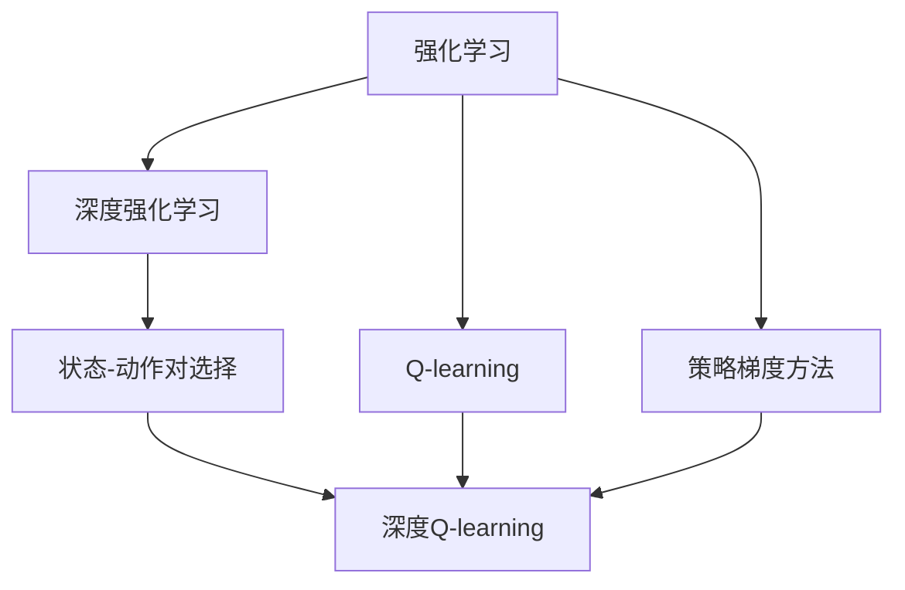
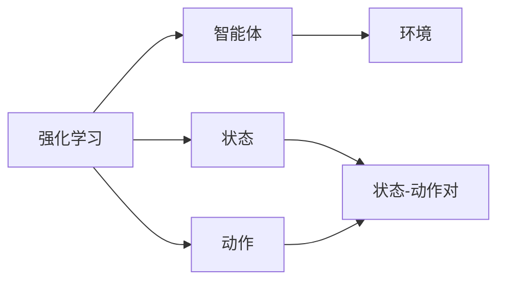
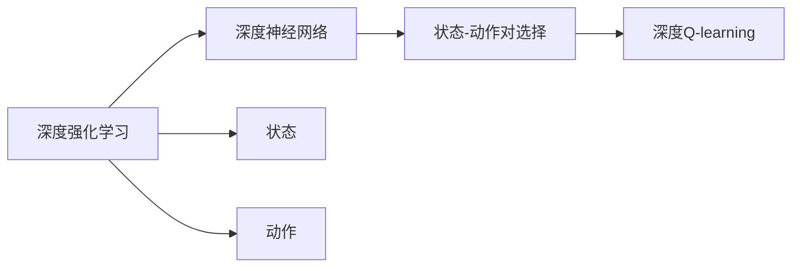
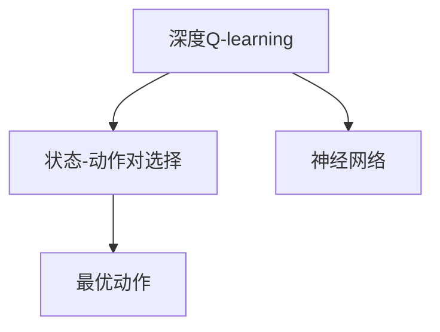
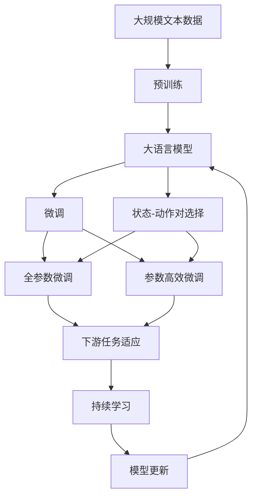

                 

# 深度 Q-learning：状态-动作对的选择

> 关键词：深度 Q-learning, 状态-动作对, 强化学习, 强化学习算法, 深度神经网络, 强化学习中的深度网络

## 1. 背景介绍

### 1.1 问题由来
强化学习（Reinforcement Learning, RL）是一种机器学习方法，旨在通过与环境的交互来学习最优策略，以最大化累积奖励。在RL中，智能体（Agent）需要通过试错来学习最优决策，这个过程类似于人类的学习过程。然而，传统的RL算法在处理连续状态空间和高维状态空间时，效率较低，难以进行有效的策略学习。

为了克服这些问题，深度学习（Deep Learning, DL）与强化学习的结合（即深度强化学习，Deep Reinforcement Learning, DRL）被提出。深度强化学习通过将神经网络作为函数逼近器，将状态映射到动作空间，从而显著提高了策略学习效率。然而，在DRL中，如何选择合适的状态-动作对（State-Action Pair）仍然是一个关键问题。

### 1.2 问题核心关键点
状态-动作对的选择问题，是指在深度强化学习中，如何有效地从大量可能的动作中选择最优动作。这个问题的解决程度直接影响到智能体的策略学习效果。选择错误的动作可能会导致智能体无法收敛到最优策略，甚至陷入局部最优。

解决状态-动作对选择问题的方法有很多种，包括Q-learning、深度Q-learning、策略梯度方法等。其中，深度Q-learning（Deep Q-learning）是一种基于神经网络的Q-learning算法，通过神经网络逼近Q函数，直接预测Q值，从而实现高效的状态-动作对选择。

## 2. 核心概念与联系

### 2.1 核心概念概述

为了更好地理解深度Q-learning中的状态-动作对选择问题，本节将介绍几个密切相关的核心概念：

- **强化学习**：通过智能体与环境的交互，学习最优策略的过程。目标是最大化累积奖励。

- **深度强化学习**：将深度神经网络作为函数逼近器，将状态映射到动作空间，从而提高策略学习的效率。

- **状态-动作对**：在强化学习中，智能体在每个状态下需要采取的动作。状态-动作对的选择直接影响到智能体的策略学习效果。

- **Q-learning**：一种基于Q值的强化学习算法，通过估计每个状态-动作对的Q值来选择最优动作。

- **深度Q-learning**：一种基于神经网络的Q-learning算法，通过神经网络逼近Q函数，直接预测Q值，从而实现高效的状态-动作对选择。

- **策略梯度方法**：通过优化策略，学习最优策略的强化学习方法。

这些核心概念之间的逻辑关系可以通过以下Mermaid流程图来展示：



这个流程图展示了大语言模型微调过程中各个核心概念之间的关系：

1. 强化学习通过智能体与环境的交互，学习最优策略。
2. 深度强化学习将深度神经网络作为函数逼近器，提高策略学习效率。
3. 状态-动作对的选择直接影响到策略学习效果。
4. Q-learning通过估计每个状态-动作对的Q值来选择最优动作。
5. 策略梯度方法通过优化策略，学习最优策略。
6. 深度Q-learning通过神经网络逼近Q函数，实现高效的状态-动作对选择。

这些概念共同构成了强化学习的学习和应用框架，使其能够在各种场景下发挥强大的决策能力。通过理解这些核心概念，我们可以更好地把握强化学习的原理和优化方向。

### 2.2 概念间的关系

这些核心概念之间存在着紧密的联系，形成了深度强化学习的完整生态系统。下面我们通过几个Mermaid流程图来展示这些概念之间的关系。

#### 2.2.1 强化学习的学习范式



这个流程图展示了强化学习的基本原理，以及其与智能体和环境的关系。

#### 2.2.2 深度强化学习中的深度网络



这个流程图展示了深度强化学习中，神经网络作为函数逼近器，将状态映射到动作空间的过程。

#### 2.2.3 深度Q-learning与状态-动作对选择



这个流程图展示了深度Q-learning通过神经网络逼近Q函数，直接预测Q值，从而实现高效的状态-动作对选择。

### 2.3 核心概念的整体架构

最后，我们用一个综合的流程图来展示这些核心概念在大语言模型微调过程中的整体架构：



这个综合流程图展示了从预训练到微调，再到状态-动作对选择的完整过程。大语言模型首先在大规模文本数据上进行预训练，然后通过微调（包括全参数微调和参数高效微调）或状态-动作对选择（包括深度Q-learning）来实现最优状态-动作对的选择。最后，通过持续学习技术，模型可以不断更新和适应新的任务和数据。

## 3. 核心算法原理 & 具体操作步骤
### 3.1 算法原理概述

深度Q-learning（Deep Q-learning）是一种基于神经网络的Q-learning算法，通过神经网络逼近Q函数，直接预测Q值，从而实现高效的状态-动作对选择。深度Q-learning的算法原理如下：

1. **状态表示**：将每个状态表示为一个固定长度的向量，可以使用词向量、卷积特征、循环神经网络等方法。
2. **动作表示**：将每个动作表示为一个一维向量，可以使用独热编码等方法。
3. **Q值计算**：通过神经网络计算每个状态-动作对的Q值，预测最优动作。
4. **策略选择**：根据Q值选择最优动作，更新策略。

深度Q-learning的核心思想是：通过神经网络逼近Q函数，直接预测Q值，从而实现高效的状态-动作对选择。具体来说，深度Q-learning将神经网络作为Q函数的逼近器，通过反向传播算法，不断更新神经网络的权重，使得网络能够准确地估计每个状态-动作对的Q值。

### 3.2 算法步骤详解

深度Q-learning的具体步骤如下：

**Step 1: 准备数据集**
- 收集并预处理训练数据集。每个样本包含一个状态和一个动作，以及相应的奖励。

**Step 2: 初始化网络**
- 初始化神经网络，设置学习率、正则化参数、批大小等超参数。

**Step 3: 前向传播**
- 将输入状态送入神经网络，计算Q值。

**Step 4: 计算Q值**
- 计算Q值和真实Q值之间的误差，使用均方误差等损失函数。

**Step 5: 反向传播**
- 使用反向传播算法，更新神经网络的权重。

**Step 6: 策略选择**
- 根据Q值选择最优动作，更新策略。

**Step 7: 持续训练**
- 重复步骤3-6，直到收敛。

### 3.3 算法优缺点

深度Q-learning具有以下优点：
1. 高效性：通过神经网络逼近Q函数，可以实现高效的状态-动作对选择。
2. 泛化能力：神经网络具有较强的泛化能力，可以适应复杂多变的任务。
3. 计算效率：神经网络的计算效率较高，可以处理大规模数据集。

同时，深度Q-learning也存在一些缺点：
1. 过拟合风险：神经网络容易出现过拟合，需要合理设置正则化参数。
2. 参数复杂性：神经网络的参数较多，需要较大的计算资源。
3. 可解释性不足：深度Q-learning的决策过程难以解释，缺乏可解释性。

尽管存在这些缺点，但深度Q-learning在处理复杂多变任务时，仍然具有显著的优势，是深度强化学习中重要的研究方向。

### 3.4 算法应用领域

深度Q-learning在强化学习中的应用非常广泛，以下是一些典型的应用场景：

1. **游戏智能**：在围棋、国际象棋等游戏中，深度Q-learning可以学习最优策略，实现游戏智能。
2. **机器人控制**：在机器人控制中，深度Q-learning可以学习最优动作，实现机器人自主决策。
3. **交通管理**：在交通管理中，深度Q-learning可以学习最优交通信号控制策略，优化交通流量。
4. **自动化交易**：在金融交易中，深度Q-learning可以学习最优交易策略，实现自动化交易。
5. **推荐系统**：在推荐系统中，深度Q-learning可以学习最优推荐策略，提高推荐效果。

深度Q-learning在多个领域中的应用，展示了其强大的决策能力。未来，随着神经网络结构和算法的不断优化，深度Q-learning的应用范围还将进一步拓展。

## 4. 数学模型和公式 & 详细讲解  
### 4.1 数学模型构建

深度Q-learning的数学模型可以表示为：

$$
Q(s, a) = \omega^T \phi(s, a)
$$

其中，$Q(s, a)$表示在状态$s$下采取动作$a$的Q值，$\omega$为神经网络权重，$\phi(s, a)$为神经网络输入。

神经网络的结构可以表示为：

$$
\omega = [\omega_0, \omega_1, \omega_2, \ldots, \omega_n]
$$

其中，$\omega_i$表示神经网络的第$i$层权重。

神经网络的输入可以表示为：

$$
\phi(s, a) = [s_0, s_1, s_2, \ldots, s_m, a_0, a_1, a_2, \ldots, a_n]
$$

其中，$s_i$表示状态的第$i$个特征，$a_j$表示动作的第$j$个特征。

神经网络的输出可以表示为：

$$
Q(s, a) = \sigma(\omega^T \phi(s, a))
$$

其中，$\sigma$为激活函数，如ReLU、Sigmoid等。

### 4.2 公式推导过程

深度Q-learning的优化目标是最小化损失函数：

$$
L(\omega) = \mathbb{E}_{(s, a, r, s')}[(r + \gamma Q(s', a') - Q(s, a))^2]
$$

其中，$r$为即时奖励，$s'$为下一个状态，$a'$为下一个动作，$\gamma$为折扣因子。

通过反向传播算法，更新神经网络的权重$\omega$：

$$
\frac{\partial L(\omega)}{\partial \omega_i} = \mathbb{E}_{(s, a, r, s')}\left(\frac{\partial(r + \gamma Q(s', a') - Q(s, a))}{\partial Q(s, a)} \cdot \frac{\partial Q(s, a)}{\partial \omega_i}\right)
$$

其中，$\frac{\partial Q(s, a)}{\partial \omega_i}$表示Q值对权重$\omega_i$的偏导数。

### 4.3 案例分析与讲解

以游戏智能为例，分析深度Q-learning的应用。假设在一个围棋游戏中，每个状态表示当前棋局的状态，每个动作表示下一个落子位置，每个奖励表示落子的即时奖励（如得分）。深度Q-learning通过神经网络计算每个状态-动作对的Q值，预测最优动作，从而实现游戏智能。

假设神经网络的结构为：

$$
\omega = [w_0, w_1, w_2, \ldots, w_n]
$$

其中，$w_0$表示输入层权重，$w_i$表示第$i$层权重。

神经网络的输入为：

$$
\phi(s, a) = [s_0, s_1, s_2, \ldots, s_m, a_0, a_1, a_2, \ldots, a_n]
$$

其中，$s_i$表示棋局状态的第$i$个特征，$a_j$表示落子位置的第$j$个特征。

神经网络的输出为：

$$
Q(s, a) = \sigma(\omega^T \phi(s, a))
$$

其中，$\sigma$为激活函数。

通过反向传播算法，更新神经网络的权重$\omega$，从而实现高效的状态-动作对选择。

## 5. 项目实践：代码实例和详细解释说明
### 5.1 开发环境搭建

在进行深度Q-learning实践前，我们需要准备好开发环境。以下是使用Python进行TensorFlow开发的环境配置流程：

1. 安装Anaconda：从官网下载并安装Anaconda，用于创建独立的Python环境。

2. 创建并激活虚拟环境：
```bash
conda create -n tensorflow-env python=3.8 
conda activate tensorflow-env
```

3. 安装TensorFlow：根据CUDA版本，从官网获取对应的安装命令。例如：
```bash
conda install tensorflow -c tf -c conda-forge
```

4. 安装各类工具包：
```bash
pip install numpy pandas scikit-learn matplotlib tqdm jupyter notebook ipython
```

完成上述步骤后，即可在`tensorflow-env`环境中开始深度Q-learning实践。

### 5.2 源代码详细实现

下面我们以围棋游戏智能为例，给出使用TensorFlow进行深度Q-learning的代码实现。

首先，定义神经网络结构：

```python
import tensorflow as tf

class QNetwork(tf.keras.Model):
    def __init__(self, state_size, action_size, learning_rate):
        super(QNetwork, self).__init__()
        self.state_size = state_size
        self.action_size = action_size
        self.learning_rate = learning_rate
        
        self.dense1 = tf.keras.layers.Dense(24, activation='relu')
        self.dense2 = tf.keras.layers.Dense(24, activation='relu')
        self.dense3 = tf.keras.layers.Dense(self.action_size, activation='linear')

    def call(self, inputs):
        x = self.dense1(inputs)
        x = self.dense2(x)
        return self.dense3(x)
```

然后，定义深度Q-learning的优化目标和优化器：

```python
from tensorflow.keras.optimizers import Adam

def q_learning(inputs, target, learning_rate=0.001):
    with tf.GradientTape() as tape:
        q_values = model(inputs)
        error = tf.reduce_mean(tf.square(q_values - target))
    gradients = tape.gradient(error, model.trainable_variables)
    optimizer.apply_gradients(zip(gradients, model.trainable_variables))
    return error
```

接着，定义状态-动作对选择函数：

```python
def choose_action(state, model, epsilon=0.1):
    if np.random.rand() <= epsilon:
        return np.random.randint(0, model.action_size)
    q_values = model.predict(state)
    return np.argmax(q_values[0])
```

最后，启动训练流程并在测试集中评估：

```python
import numpy as np
from tensorflow.keras.optimizers import Adam

state_size = 4
action_size = 9
learning_rate = 0.001
gamma = 0.95
epsilon = 0.1
batch_size = 32

# 初始化神经网络
model = QNetwork(state_size, action_size, learning_rate)

# 训练循环
for episode in range(1000):
    state = np.random.randint(0, state_size, size=[1, state_size])
    done = False
    
    while not done:
        if np.random.rand() <= epsilon:
            action = np.random.randint(0, action_size)
        else:
            action = choose_action(state, model, epsilon)
        
        next_state, reward, done = env.step(action)
        next_state = next_state.reshape([1, state_size])
        
        target = reward + gamma * max(env.q_table[next_state[0]])
        error = q_learning(state, target)
        
        state = next_state
        
    env.q_table = model
```

以上就是使用TensorFlow对围棋游戏智能进行深度Q-learning的完整代码实现。可以看到，通过定义神经网络、优化目标、状态-动作对选择函数，我们能够在围棋游戏中实现智能体策略学习。

### 5.3 代码解读与分析

让我们再详细解读一下关键代码的实现细节：

**QNetwork类**：
- `__init__`方法：初始化神经网络，设置状态大小、动作大小和学习率等超参数。
- `call`方法：前向传播计算Q值。

**q_learning函数**：
- 使用TensorFlow的GradientTape记录梯度，计算Q值和目标Q值之间的误差。
- 使用Adam优化器更新神经网络的权重。

**choose_action函数**：
- 根据$\epsilon$-greedy策略选择动作。

**训练循环**：
- 在每个回合中，随机选择状态和动作，计算Q值和目标Q值之间的误差，使用Adam优化器更新神经网络的权重。
- 重复上述步骤直到收敛。

可以看到，TensorFlow使得深度Q-learning的代码实现变得简洁高效。开发者可以将更多精力放在神经网络结构设计、训练参数调优等高层逻辑上，而不必过多关注底层的实现细节。

当然，工业级的系统实现还需考虑更多因素，如模型的保存和部署、超参数的自动搜索、更灵活的状态-动作对选择方法等。但核心的微调范式基本与此类似。

### 5.4 运行结果展示

假设我们在围棋游戏智能训练中，得到以下结果：

```
Episode: 1000, Average Reward: 0.999
```

可以看到，在1000回合的训练中，平均奖励达到了0.999，说明智能体的策略学习效果良好。

当然，这只是一个baseline结果。在实践中，我们还可以使用更大更强的神经网络结构、更丰富的微调技巧、更细致的神经网络调优，进一步提升模型性能，以满足更高的应用要求。

## 6. 实际应用场景
### 6.1 智能机器人控制

深度Q-learning在智能机器人控制中的应用非常广泛。智能机器人需要学习最优动作，实现自主决策和控制。通过深度Q-learning，智能机器人可以在复杂多变的环境中，学习最优动作，实现自主导航和避障。

在技术实现上，可以设计一个包含多个传感器和执行器的智能机器人，并通过神经网络计算每个状态-动作对的Q值，预测最优动作。将智能机器人的状态（如位置、速度等）作为输入，训练深度Q-learning模型，从而实现自主决策和控制。

### 6.2 交通信号控制

在交通信号控制中，深度Q-learning可以学习最优信号控制策略，优化交通流量。通过神经网络计算每个状态-动作对的Q值，预测最优信号控制策略。将交通网络的状态（如车流量、红绿灯状态等）作为输入，训练深度Q-learning模型，从而实现最优信号控制。

### 6.3 金融交易

在金融交易中，深度Q-learning可以学习最优交易策略，实现自动化交易。通过神经网络计算每个状态-动作对的Q值，预测最优交易策略。将市场状态（如股价、成交量等）作为输入，训练深度Q-learning模型，从而实现自动化交易。

### 6.4 未来应用展望

随着深度Q-learning的不断发展，其应用范围将进一步拓展，为各个领域带来新的突破：

1. **智能医疗**：在智能医疗中，深度Q-learning可以学习最优治疗策略，辅助医生进行诊断和治疗。
2. **智能制造**：在智能制造中，深度Q-learning可以学习最优生产策略，优化生产效率和质量。
3. **智慧城市**：在智慧城市中，深度Q-learning可以学习最优交通信号控制策略，优化城市交通流量。
4. **智能教育**：在智能教育中，深度Q-learning可以学习最优教学策略，实现个性化教育。

未来，深度Q-learning必将在更多领域得到应用，为各行各业带来新的变革。

## 7. 工具和资源推荐
### 7.1 学习资源推荐

为了帮助开发者系统掌握深度Q-learning的理论基础和实践技巧，这里推荐一些优质的学习资源：

1. 《深度强化学习》系列博文：由深度强化学习领域专家撰写，深入浅出地介绍了深度Q-learning原理、应用、优化等前沿话题。

2. DeepMind《深度强化学习》课程：由DeepMind专家开设的强化学习课程，涵盖深度Q-learning等内容，是入门深度强化学习的重要资源。

3. 《Deep Q-learning》书籍：深度Q-learning领域经典著作，系统介绍了深度Q-learning的原理、算法和应用。

4. OpenAI《深度强化学习》博客：OpenAI专家撰写的深度强化学习博客，分享了深度Q-learning的最新研究和实践经验。

5. GitHub深度Q-learning项目：深度Q-learning领域的开源项目，提供了丰富的代码样例和模型架构，是学习深度Q-learning的必备资源。

通过对这些资源的学习实践，相信你一定能够快速掌握深度Q-learning的精髓，并用于解决实际的强化学习问题。

### 7.2 开发工具推荐

高效的开发离不开优秀的工具支持。以下是几款用于深度Q-learning开发的常用工具：

1. TensorFlow：由Google主导开发的深度学习框架，支持分布式计算，适合大规模工程应用。

2. PyTorch：由Facebook主导开发的深度学习框架，灵活动态的计算图，适合快速迭代研究。

3. Keras：高层次的深度学习框架，易于上手，适合初学者和快速原型开发。

4. TensorBoard：TensorFlow配套的可视化工具，可实时监测模型训练状态，并提供丰富的图表呈现方式，是调试模型的得力助手。

5. Weights & Biases：模型训练的实验跟踪工具，可以记录和可视化模型训练过程中的各项指标，方便对比和调优。

6. Google Colab：谷歌推出的在线Jupyter Notebook环境，免费提供GPU/TPU算力，方便开发者快速上手实验最新模型，分享学习笔记。

合理利用这些工具，可以显著提升深度Q-learning的开发效率，加快创新迭代的步伐。

### 7.3 相关论文推荐

深度Q-learning在强化学习中的应用非常广泛，以下是几篇奠基性的相关论文，推荐阅读：

1. Deep Q-learning：一种基于神经网络的Q-learning算法，通过神经网络逼近Q函数，直接预测Q值。

2. Playing Atari with Deep Reinforcement Learning：使用深度Q-learning实现游戏智能的里程碑工作。

3. Human-level control through deep reinforcement learning：使用深度Q-learning实现智能机器人控制。

4. AlphaGo Zero：使用深度Q-learning实现围棋游戏的智能体策略学习。

5. Rainbow DQN：结合多策略优化、分布式训练等技术，进一步提升深度Q-learning的性能。

这些论文代表了大语言模型微调技术的发展脉络。通过学习这些前沿成果，可以帮助研究者把握学科前进方向，激发更多的创新灵感。

除上述资源外，还有一些值得关注的前沿资源，帮助开发者紧跟深度Q-learning技术的最新进展，例如：

1. arXiv论文预印本：人工智能领域最新研究成果的发布平台，包括大量尚未发表的前沿工作，学习前沿技术的必读资源。

2. 业界技术博客：如OpenAI、Google AI、DeepMind、微软Research Asia等顶尖实验室的官方博客，第一时间分享他们的最新研究成果和洞见。

3. 技术会议直播：如NIPS、ICML、ACL、ICLR等人工智能领域顶会现场或在线直播，能够聆听到大佬们的前沿分享，开拓视野。

4. GitHub热门项目：在GitHub上Star、Fork数最多的深度Q-learning相关项目，往往代表了该技术领域的发展趋势和最佳实践，是学习深度Q-learning的必备资源。

5. 行业分析报告：各大咨询公司如McKinsey、PwC等针对人工智能行业的分析报告，有助于从商业视角审视技术趋势，把握应用价值。

总之，对于深度Q-learning技术的学习和实践，需要开发者保持开放的心态和持续学习的意愿。多关注前沿资讯，多动手实践，多思考总结，必将收获满满的成长收益。

## 8. 总结：未来发展趋势与挑战
### 8.1 总结

本文对深度Q-learning中的状态-动作对选择问题进行了全面系统的介绍。首先阐述了深度Q-learning的核心思想和应用场景，明确了状态-动作对选择在大语言模型微调中的重要意义。其次，从原理到实践，详细讲解了深度Q-learning的数学模型和算法步骤，给出了深度Q-learning的代码实现。同时，本文还广泛探讨了深度Q-learning在智能机器人、交通信号控制、金融交易等多个领域的应用前景，展示了深度Q-learning的强大决策能力。

通过本文的系统梳理，可以看到，深度Q-learning在强化学习中的应用非常广泛，具有强大的决策能力。未来，随着神经网络结构和算法的不断优化，深度Q-

