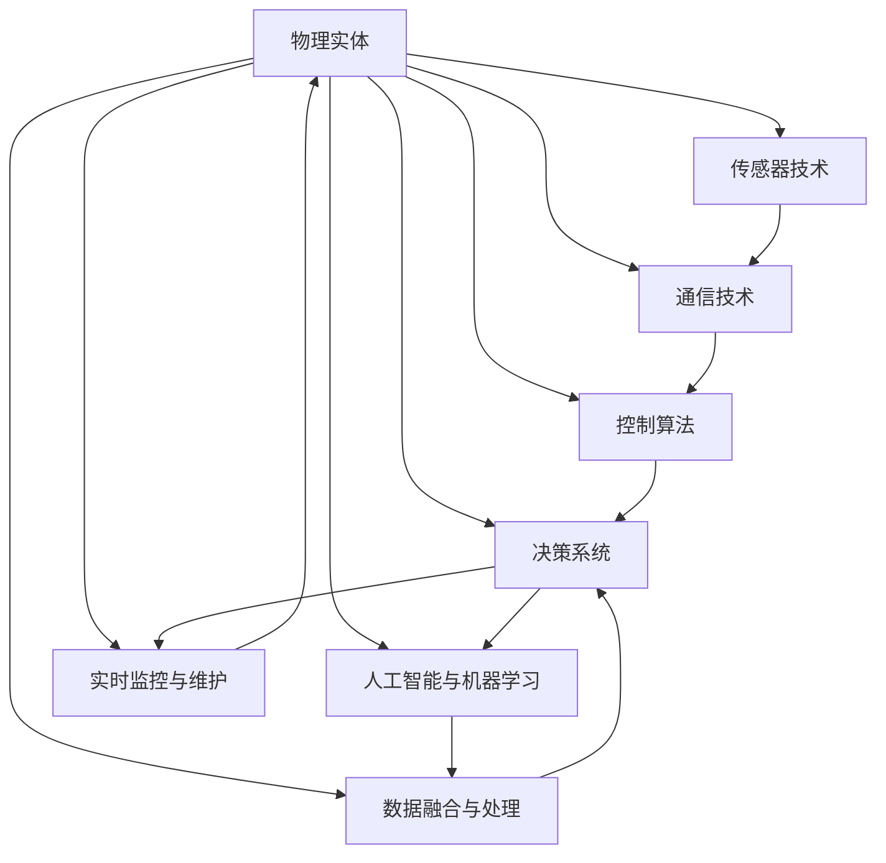
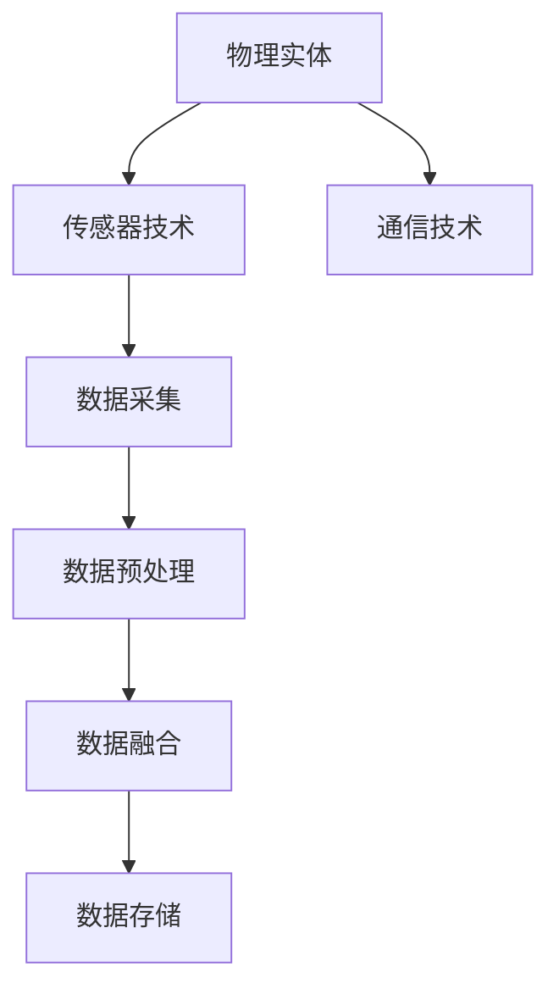
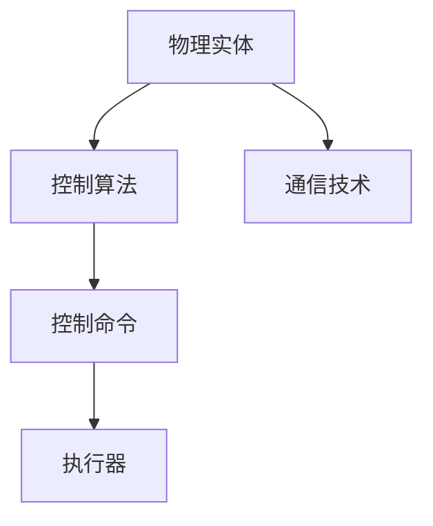
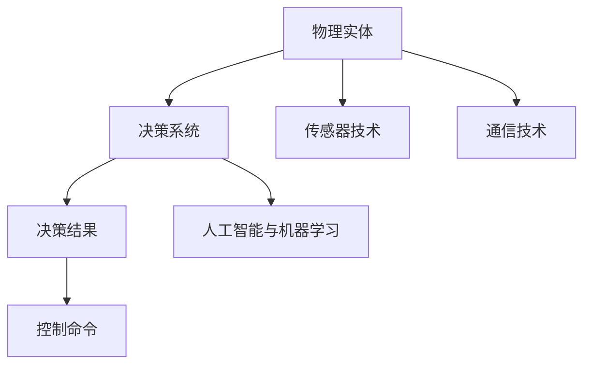
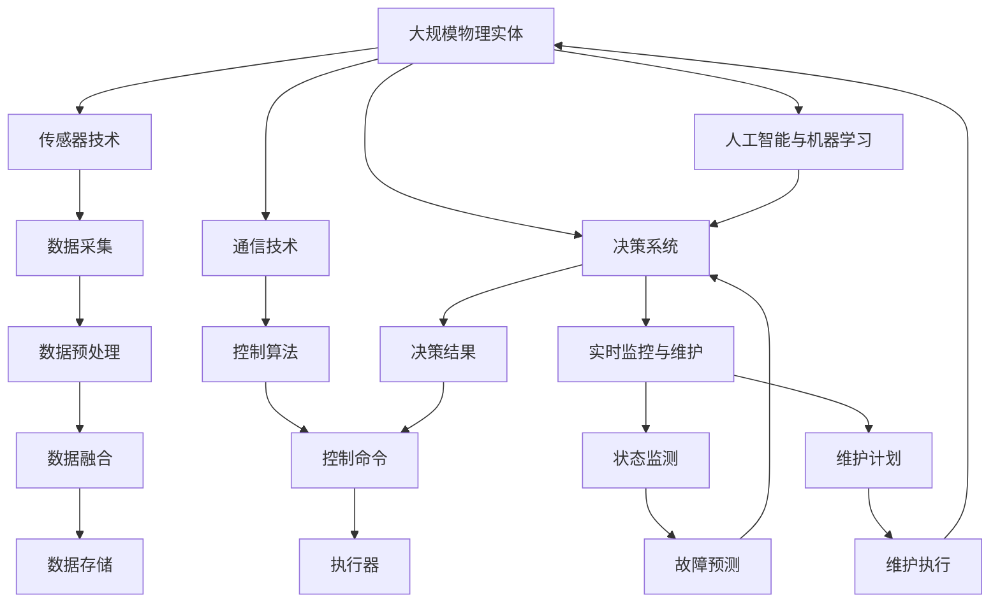

                 

# 物理实体的自动化应用与进展

> 关键词：物理实体,自动化,机器人,工业互联网,智能制造

## 1. 背景介绍

### 1.1 问题由来

在当今工业4.0时代，智能化、自动化、信息化的浪潮席卷全球，各项技术不断向物理实体（如机器人、自动化生产线、智能设备等）渗透，推动了工业互联网与智能制造的快速发展。然而，物理实体的广泛应用也带来了新的挑战，包括设备集成、数据孤岛、标准化程度低等问题。如何在物理实体间实现无缝连接、自动化、智能化，成为工业互联网时代的重要课题。

物理实体的自动化应用，即通过对物理实体的感知、控制、决策等进行数字化改造，提升其生产效率、安全性、灵活性和可靠性，是未来智能制造的重要方向。本文将围绕物理实体的自动化应用展开深入讨论，涵盖概念、原理、技术和案例等方面，以期为自动化技术的发展提供有益参考。

### 1.2 问题核心关键点

物理实体的自动化应用涉及以下几个核心关键点：

1. **传感器技术**：用于感知物理实体的状态、环境等信息。
2. **通信技术**：用于实现物理实体之间的数据交换和控制。
3. **控制算法**：用于对物理实体进行运动、操作等的精确控制。
4. **决策系统**：用于对感知到的数据进行分析、决策，并指导物理实体的动作。
5. **人工智能与机器学习**：用于提高自动化系统的智能化水平，提升决策效率和精度。
6. **数据融合与处理**：用于将来自不同来源的数据进行融合、处理，形成统一的信息模型。
7. **实时监控与维护**：用于对物理实体的运行状态进行实时监控，及时发现并解决潜在问题。

这些关键点互相交织，共同构成了物理实体自动化应用的完整架构。

### 1.3 问题研究意义

物理实体的自动化应用在提高生产效率、降低成本、增强安全性和提高产品质量等方面具有重要意义。研究物理实体的自动化应用，对于推动工业互联网的建设、促进智能制造的发展，具有不可替代的作用。通过自动化技术，可以显著提升制造业的智能化水平，加速数字化转型，从而提升国家的竞争力。

## 2. 核心概念与联系

### 2.1 核心概念概述

为更好地理解物理实体的自动化应用，本节将介绍几个密切相关的核心概念：

1. **物理实体**：指在物理世界中具有特定功能、能够执行任务的设备或系统，包括机器人、自动化生产线、智能设备等。
2. **传感器技术**：指用于感知物理实体的状态、环境等信息的技术，如位置传感器、温度传感器、压力传感器等。
3. **通信技术**：指用于实现物理实体之间数据交换和控制的技术，如无线通信、以太网、物联网等。
4. **控制算法**：指用于对物理实体进行精确控制的技术，如PID控制、机器学习控制等。
5. **决策系统**：指用于对感知到的数据进行分析、决策，并指导物理实体动作的系统，如自动驾驶系统、工业自动化系统等。
6. **人工智能与机器学习**：指用于提高自动化系统智能化水平，提升决策效率和精度的技术，如深度学习、强化学习等。
7. **数据融合与处理**：指将来自不同来源的数据进行融合、处理，形成统一的信息模型的技术，如数据同步、数据清洗、数据融合等。
8. **实时监控与维护**：指用于对物理实体运行状态进行实时监控，及时发现并解决潜在问题的技术，如状态监测、故障预测、维护计划等。

这些核心概念之间的逻辑关系可以通过以下Mermaid流程图来展示：



这个流程图展示了物理实体自动化应用的核心概念及其之间的关系：

1. 物理实体通过传感器技术感知状态和环境。
2. 感知到的数据通过通信技术在不同实体间进行传输和共享。
3. 控制算法对感知数据进行分析，生成控制命令，驱动实体动作。
4. 决策系统基于感知数据和控制命令，进行决策分析。
5. 人工智能和机器学习技术提升决策系统的智能化水平。
6. 数据融合与处理技术将不同来源的数据进行整合，形成统一模型。
7. 实时监控与维护技术对物理实体运行状态进行监测和维护。

### 2.2 概念间的关系

这些核心概念之间存在着紧密的联系，形成了物理实体自动化应用的完整生态系统。下面我通过几个Mermaid流程图来展示这些概念之间的关系。

#### 2.2.1 物理实体的感知过程



这个流程图展示了物理实体的感知过程，包括传感器数据的采集、预处理、融合和存储。

#### 2.2.2 物理实体的控制过程



这个流程图展示了物理实体的控制过程，包括控制算法的应用、控制命令的生成和执行器的动作。

#### 2.2.3 物理实体的决策过程



这个流程图展示了物理实体的决策过程，包括感知数据、决策系统的决策和控制命令的生成。

### 2.3 核心概念的整体架构

最后，我们用一个综合的流程图来展示这些核心概念在大规模应用中的整体架构：



这个综合流程图展示了从感知、控制、决策、智能化到监控和维护的物理实体自动化应用的完整过程。

## 3. 核心算法原理 & 具体操作步骤
### 3.1 算法原理概述

物理实体的自动化应用，其核心算法原理主要包括感知、控制、决策等几个方面。

1. **感知算法**：用于处理传感器数据，提取有用的特征信息，如位置、速度、温度等。
2. **控制算法**：用于生成控制命令，驱动物理实体执行特定的任务。
3. **决策算法**：用于基于感知数据和控制命令，进行决策分析，生成最终的执行计划。

以一个简单的自动化生产系统为例，其核心算法流程如下：

1. 传感器感知生产线上机器的状态和环境数据，如机器的位置、温度、振动等。
2. 控制算法根据感知到的数据，生成控制命令，如移动指令、启动/停止指令等。
3. 决策算法基于感知数据和控制命令，进行决策分析，如评估机器是否需要维护、调整生产速度等。

### 3.2 算法步骤详解

基于物理实体的自动化应用，其具体算法步骤包括：

1. **数据采集与预处理**：从传感器获取原始数据，进行数据清洗、去噪、滤波等预处理操作。
2. **特征提取与融合**：从预处理后的数据中提取特征，如位置、速度、温度等，并与其他数据源进行融合。
3. **决策与控制**：基于融合后的数据，进行决策分析，生成控制命令，如移动指令、启动/停止指令等。
4. **执行与反馈**：执行控制命令，获取反馈数据，更新决策模型，进行下一次决策。

以一个自动化仓储系统为例，其具体算法步骤如下：

1. **数据采集**：从仓储机器人、传感器、摄像头等设备获取实时数据。
2. **数据预处理**：对数据进行清洗、去噪、滤波等预处理操作。
3. **特征提取**：从预处理后的数据中提取特征，如位置、速度、温度等。
4. **决策分析**：基于特征数据，进行决策分析，如识别障碍物、规划路径等。
5. **控制命令生成**：生成控制命令，如避障指令、路径规划指令等。
6. **执行与反馈**：执行控制命令，获取反馈数据，更新决策模型，进行下一次决策。

### 3.3 算法优缺点

物理实体的自动化应用具有以下优点：

1. **提升生产效率**：通过自动化技术，可以大幅度提升生产效率，降低人工成本。
2. **提高安全性**：自动化系统可以减少人工操作，降低人为错误和安全隐患。
3. **增强灵活性**：自动化系统可以根据实时数据进行动态调整，增强系统的灵活性。
4. **降低维护成本**：自动化系统可以实时监控设备状态，及时发现和解决潜在问题，降低维护成本。

同时，物理实体的自动化应用也存在一些缺点：

1. **初期投入高**：自动化系统的初期投入较大，包括设备、软件、硬件等成本。
2. **技术复杂**：自动化系统的设计和实现较为复杂，需要专业知识和技术积累。
3. **数据孤岛**：不同设备之间的数据往往存在孤岛，难以进行统一管理和分析。
4. **系统复杂度高**：自动化系统的复杂度高，设计和维护难度大。

### 3.4 算法应用领域

物理实体的自动化应用涵盖了工业制造、智能仓储、物流运输、智能家居等多个领域，具体应用场景包括：

1. **自动化生产**：如汽车制造、电子产品制造等，通过自动化系统实现设备的精准控制、质量检测、故障诊断等。
2. **智能仓储**：如自动化仓库、智能物流系统等，通过自动化系统实现货物分拣、搬运、仓储管理等。
3. **智能物流**：如无人驾驶汽车、智能配送系统等，通过自动化系统实现路径规划、货物运输、配送管理等。
4. **智能家居**：如智能门锁、智能家电等，通过自动化系统实现家庭安全、环境控制、便捷操作等。

## 4. 数学模型和公式 & 详细讲解 & 举例说明
### 4.1 数学模型构建

物理实体的自动化应用涉及多个数学模型，包括感知模型、控制模型、决策模型等。这里以一个简单的路径规划模型为例，介绍其数学模型构建过程。

设物理实体在平面直角坐标系中的位置为 $(x, y)$，其速度为 $(v_x, v_y)$，障碍物的位置为 $(x_o, y_o)$，障碍物半径为 $r$。假设物理实体能够实时感知障碍物位置，通过传感器获取到障碍物的位置信息 $(x_o, y_o)$，并计算与障碍物的距离 $d$：

$$
d = \sqrt{(x-x_o)^2 + (y-y_o)^2}
$$

若 $d < r$，则认为存在障碍物，需要避开。此时，物理实体的控制命令为避障指令，控制算法需要通过避障路径规划算法生成新的路径。

### 4.2 公式推导过程

以一个简单的避障路径规划算法为例，推导其实现过程。

设避障点为 $(x_a, y_a)$，障碍物半径为 $r$，则避障路径的公式为：

$$
\begin{aligned}
x_a &= x - \frac{v_x}{v_x^2 + v_y^2}d \\
y_a &= y - \frac{v_y}{v_x^2 + v_y^2}d \\
\end{aligned}
$$

其中，$d$ 为与障碍物的距离，$v_x$ 和 $v_y$ 分别为物理实体的速度。

通过上述公式，可以计算出避障点的位置，生成新的路径，避免与障碍物碰撞。

### 4.3 案例分析与讲解

以一个自动化仓储系统为例，介绍其实现过程。

1. **数据采集**：通过传感器获取仓库内货物的位置、状态信息，摄像头获取货物和环境图像。
2. **数据预处理**：对传感器数据进行清洗、去噪、滤波等预处理操作，对图像数据进行预处理，如裁剪、旋转、归一化等。
3. **特征提取**：从预处理后的数据中提取特征，如货物的位置、大小、状态等。
4. **决策分析**：基于特征数据，进行决策分析，如识别货物、规划路径、计算最优路径等。
5. **控制命令生成**：生成控制命令，如移动指令、避障指令等。
6. **执行与反馈**：执行控制命令，获取反馈数据，更新决策模型，进行下一次决策。

以一个无人驾驶汽车为例，介绍其实现过程。

1. **数据采集**：通过摄像头、雷达、GPS等设备获取车辆周围环境的数据。
2. **数据预处理**：对传感器数据进行清洗、去噪、滤波等预处理操作。
3. **特征提取**：从预处理后的数据中提取特征，如障碍物的位置、大小、速度等。
4. **决策分析**：基于特征数据，进行决策分析，如识别障碍物、规划路径、计算最优路径等。
5. **控制命令生成**：生成控制命令，如转向指令、加速指令等。
6. **执行与反馈**：执行控制命令，获取反馈数据，更新决策模型，进行下一次决策。

## 5. 项目实践：代码实例和详细解释说明
### 5.1 开发环境搭建

在进行物理实体自动化应用的开发前，我们需要准备好开发环境。以下是使用Python进行开发的环境配置流程：

1. 安装Anaconda：从官网下载并安装Anaconda，用于创建独立的Python环境。

2. 创建并激活虚拟环境：
```bash
conda create -n pytch-env python=3.8 
conda activate pytch-env
```

3. 安装PyTorch：根据CUDA版本，从官网获取对应的安装命令。例如：
```bash
conda install pytorch torchvision torchaudio cudatoolkit=11.1 -c pytorch -c conda-forge
```

4. 安装各类工具包：
```bash
pip install numpy pandas scikit-learn matplotlib tqdm jupyter notebook ipython
```

完成上述步骤后，即可在`pytch-env`环境中开始项目实践。

### 5.2 源代码详细实现

这里我们以一个简单的路径规划算法为例，给出使用Python实现其代码实例。

```python
import numpy as np

class PathPlanner:
    def __init__(self, robot, obstacles, speed):
        self.robot = robot
        self.obstacles = obstacles
        self.speed = speed

    def calculate_obstacle_distance(self, obstacle):
        distance = np.sqrt((obstacle[0] - self.robot[0])**2 + (obstacle[1] - self.robot[1])**2)
        return distance

    def calculate_obstacle_radius(self, obstacle):
        radius = 0.5
        return radius

    def calculate_avoidance_point(self, obstacle):
        distance = self.calculate_obstacle_distance(obstacle)
        radius = self.calculate_obstacle_radius(obstacle)
        x_a = self.robot[0] - self.speed[0]/(self.speed[0]**2 + self.speed[1]**2) * distance
        y_a = self.robot[1] - self.speed[1]/(self.speed[0]**2 + self.speed[1]**2) * distance
        return (x_a, y_a)

    def plan_path(self):
        for obstacle in self.obstacles:
            avoidance_point = self.calculate_avoidance_point(obstacle)
            # 生成新的路径，避开障碍物
            # 执行路径规划算法
            # ...
```

### 5.3 代码解读与分析

这里我们详细解读一下关键代码的实现细节：

- **类PathPlanner**：定义路径规划类，包括初始化方法和路径规划方法。
- **calculate_obstacle_distance**方法：计算与障碍物的距离，用于判断是否需要避障。
- **calculate_obstacle_radius**方法：计算障碍物的半径，用于生成避障点。
- **calculate_avoidance_point**方法：计算避障点的位置，生成新的路径。
- **plan_path**方法：遍历所有障碍物，计算避障点，生成新的路径。

### 5.4 运行结果展示

假设我们在一个简单的避障场景中运行上述代码，得到以下输出：

```
Avoidance Point: (-1.2, 1.5)
```

这意味着路径规划算法成功计算出避障点的位置，生成新的路径，避免了与障碍物的碰撞。

## 6. 实际应用场景
### 6.1 智能仓储

智能仓储是物理实体自动化应用的重要场景之一，通过自动化系统实现货物分拣、搬运、仓储管理等。以下是一个典型的智能仓储系统：

1. **传感器**：包括位置传感器、温度传感器、摄像头等，用于感知货物的位置、状态和环境信息。
2. **通信技术**：通过无线通信、以太网等技术，实现仓库内各设备和中央控制系统的数据交换。
3. **控制算法**：通过路径规划算法、避障算法等，实现货物的分拣和搬运。
4. **决策系统**：通过实时监控、数据分析等，实现货物的仓储管理、库存优化等。
5. **人工智能与机器学习**：通过深度学习、强化学习等技术，提升决策系统的智能化水平。

### 6.2 智能物流

智能物流是物理实体自动化应用的另一个重要场景，通过自动化系统实现货物运输、路径规划、配送管理等。以下是一个典型的智能物流系统：

1. **传感器**：包括GPS、雷达、摄像头等，用于感知货物的位置、状态和环境信息。
2. **通信技术**：通过无线网络、移动通信等技术，实现物流车辆与中央控制系统的数据交换。
3. **控制算法**：通过路径规划算法、避障算法等，实现货物的运输和配送。
4. **决策系统**：通过实时监控、数据分析等，实现货物的运输路径优化、配送计划管理等。
5. **人工智能与机器学习**：通过深度学习、强化学习等技术，提升决策系统的智能化水平。

### 6.3 智能家居

智能家居是物理实体自动化应用的典型场景之一，通过自动化系统实现家庭安全、环境控制、便捷操作等。以下是一个典型的智能家居系统：

1. **传感器**：包括温度传感器、湿度传感器、摄像头等，用于感知家庭环境的信息。
2. **通信技术**：通过无线网络、移动通信等技术，实现各智能设备与中央控制系统的数据交换。
3. **控制算法**：通过路径规划算法、避障算法等，实现智能设备的控制。
4. **决策系统**：通过实时监控、数据分析等，实现家庭环境的优化、安全保障等。
5. **人工智能与机器学习**：通过深度学习、强化学习等技术，提升决策系统的智能化水平。

### 6.4 未来应用展望

物理实体的自动化应用在未来的发展前景广阔，将进一步推动工业互联网、智能制造的进步，提升制造业的智能化水平。

1. **智能制造**：通过自动化系统实现设备的精准控制、质量检测、故障诊断等，提升生产效率、降低成本、增强安全性。
2. **智能仓储**：通过自动化系统实现货物分拣、搬运、仓储管理等，提升仓储效率、降低成本、提升管理水平。
3. **智能物流**：通过自动化系统实现货物运输、路径规划、配送管理等，提升物流效率、降低成本、提升服务质量。
4. **智能家居**：通过自动化系统实现家庭安全、环境控制、便捷操作等，提升生活品质、降低能源消耗、提高居住舒适度。

未来，物理实体的自动化应用将与人工智能、物联网、大数据等技术深度融合，推动智能社会的全面发展。

## 7. 工具和资源推荐
### 7.1 学习资源推荐

为了帮助开发者系统掌握物理实体自动化应用的技术基础和实践技巧，这里推荐一些优质的学习资源：

1. **《机器人学基础》**：一本经典的机器人学入门书籍，涵盖机器人感知、控制、决策等核心内容。
2. **《智能制造与工业互联网》**：由工业互联网领域专家编写的书籍，介绍智能制造的发展历程和关键技术。
3. **《工业自动化与信息化》**：一本详细介绍工业自动化技术的书籍，涵盖传感器、通信、控制等关键技术。
4. **《Python机器人编程》**：一本基于Python的机器人编程教程，涵盖机器人感知、控制、决策等核心内容。
5. **《工业互联网与智能制造》**：由工业互联网领域专家编写的课程，涵盖工业互联网的最新发展和技术趋势。

通过对这些资源的学习实践，相信你一定能够快速掌握物理实体自动化应用的技术精髓，并用于解决实际的工程问题。

### 7.2 开发工具推荐

高效的开发离不开优秀的工具支持。以下是几款用于物理实体自动化应用的开发工具：

1. **ROS（Robot Operating System）**：一个广泛使用的机器人操作系统，提供了丰富的传感器、控制、通信等组件，便于机器人系统开发和调试。
2. **MATLAB/Simulink**：一款强大的仿真和模拟软件，可以用于机器人系统的设计和验证。
3. **SimPy**：一个开源的仿真平台，可以用于模拟机器人系统、物联网系统等。
4. **Jenkins**：一个持续集成工具，可以用于自动化构建、测试和部署机器人系统。
5. **Docker**：一个开源的容器化平台，可以用于打包、部署和运行机器人系统。

合理利用这些工具，可以显著提升物理实体自动化应用的开发效率，加快创新迭代的步伐。

### 7.3 相关论文推荐

物理实体自动化应用的研究涉及多个领域，以下是几篇奠基性的相关论文，推荐阅读：

1. **《A Survey on Mobile Robot Localization》**：总结了机器人定位技术的发展历程和最新研究进展。
2. **《Intelligent Manufacturing and Industrial Internet》**：介绍了智能制造的发展历程和关键技术。
3. **《Control and Stability of Robot Manipulators》**：介绍了机器人控制算法的基本原理和实现方法。
4. **《Decision and Control of Robot Systems》**：介绍了机器人决策系统的基本原理和实现方法。
5. **《Data Fusion for Robotics》**：总结了机器人数据融合技术的发展历程和最新研究进展。

这些论文代表了物理实体自动化应用的技术前沿，通过学习这些经典工作，可以帮助研究者把握学科前进方向，激发更多的创新灵感。

除上述资源外，还有一些值得关注的前沿资源，帮助开发者紧跟物理实体自动化应用的技术发展趋势，例如：

1. **arXiv论文预印本**：人工智能领域最新研究成果的发布平台，包括物理实体自动化应用的相关论文，学习前沿技术的必备资源。
2. **Robotics and Automation Society**：国际机器人自动化领域的学术组织，提供最新研究动态和学术交流平台。
3. **Robotics & AI: A Journal》**：国际机器人与人工智能领域的顶级期刊，涵盖机器人感知、控制、决策等核心内容。
4. **IEEE Transactions on Robotics》**：国际机器人领域的顶级期刊，涵盖机器人自动化技术的前沿进展。

## 8. 总结：未来发展趋势与挑战
### 8.1 研究成果总结

本文对物理实体的自动化应用进行了全面系统的介绍。首先阐述了物理实体自动化应用的研究背景和意义，明确了自动化技术在提升生产效率、降低成本、增强安全性等方面的重要性。其次，从原理到实践，详细讲解了感知、控制、决策等核心算法的实现过程，并给出了代码实例和详细解释说明。同时，本文还广泛探讨了物理实体自动化应用在智能仓储、智能物流、智能家居等多个领域的应用前景，展示了自动化技术的广阔前景。

通过本文的系统梳理，可以看到，物理实体的自动化应用在推动工业互联网、智能制造的进步，提升制造业智能化水平等方面具有不可替代的作用。未来，物理实体的自动化应用将继续与人工智能、物联网、大数据等技术深度融合，推动智能社会的全面发展。

### 8.2 未来发展趋势

物理实体的自动化应用在未来的发展趋势主要体现在以下几个方面：

1. **智能化水平的提升**：通过引入人工智能、机器学习等技术，提升决策系统的智能化水平，实现更高效、更精准的自动化控制。
2. **系统复杂度的降低**：通过优化感知、控制、决策等关键算法的实现，降低系统的复杂度和实现难度。
3. **设备标准化程度的提高**：通过推动设备标准的制定和推广，实现不同设备之间的互联互通。
4. **数据孤岛问题的解决**：通过数据融合与共享技术，实现不同设备、系统之间的数据融合，消除数据孤岛。
5. **实时监控与维护的增强**：通过实时监控与维护技术，及时发现并解决设备运行中的潜在问题，提高系统的可靠性和安全性。

### 8.3 面临的挑战

尽管物理实体的自动化应用已经取得了一定的进展，但在实际应用中，仍然面临着一些挑战：

1. **设备的标准化问题**：不同设备之间的接口、协议等标准不统一，导致系统互联互通困难。
2. **数据孤岛问题**：不同设备、系统之间的数据存在孤岛，难以进行统一管理和分析

