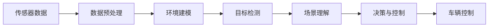

                 

# 特斯拉在端到端自动驾驶上的巨额投资

在过去的十年中，特斯拉（Tesla）已成为全球领先的电动汽车制造商，但在自动驾驶技术领域，它更是不断投入巨资，努力成为行业的引领者。本文将探讨特斯拉在端到端自动驾驶上的投资策略，包括技术路径、具体项目和未来展望，旨在帮助读者全面理解这一领域的最新动态。

## 1. 背景介绍

### 1.1 自动驾驶技术概述

自动驾驶技术是指车辆通过传感器、计算机视觉、深度学习等技术，实现对环境的实时感知和决策，自动完成驾驶任务。根据技术复杂度和应用场景，自动驾驶通常分为多个级别，从基于ADAS（Advanced Driver Assistance Systems）的低级别辅助驾驶，到高级别的全自动驾驶（Level 5）。

特斯拉在自动驾驶技术上选择了高度自动化的全栈解决方案，即端到端自动驾驶（End-to-End Autonomous Driving），这也成为其未来发展战略的重要组成部分。特斯拉的自动驾驶系统主要由自动驾驶套件（Autopilot）和完全自动驾驶套件（Full Self-Driving, FSD）组成，旨在实现从高速公路自动驾驶到城市复杂环境下的完全自动驾驶。

### 1.2 特斯拉的自动驾驶投资

自2014年推出Autopilot以来，特斯拉在自动驾驶上的投资持续增长。根据特斯拉2019年财报，公司在自动驾驶技术上的研发投入为26亿美元，占总研发支出的34%。这一数字在2020年增长到37亿美元，并在2021年进一步提升至52亿美元。这些投资主要集中在硬件、软件和数据收集上。

特斯拉的自动驾驶研发团队分布在全球各地，包括美国硅谷、德国柏林和日本东京，以实现技术全球布局。特斯拉还通过收购Waymo前高管Aurélien Géron，进一步强化了其在自动驾驶领域的实力。

## 2. 核心概念与联系

### 2.1 核心概念概述

特斯拉在端到端自动驾驶上的投资涉及多个核心概念，包括：

- **计算机视觉**：通过摄像头和传感器捕捉环境信息，实现对道路、车辆、行人等的实时感知。
- **深度学习**：利用深度神经网络，对传感器数据进行分析和处理，提取环境特征，进行目标检测和场景理解。
- **环境建模**：构建高精度地图和实时环境模型，为决策提供基础数据支持。
- **决策与控制**：结合环境模型和传感器数据，制定驾驶策略，控制车辆动作。

这些概念相互依赖，共同构成了特斯拉端到端自动驾驶技术的核心架构。

### 2.2 核心概念的关系

特斯拉的自动驾驶技术架构可以简化为以下 Mermaid 流程图：



这个流程图展示了从传感器数据输入到车辆控制输出的整个过程，其中传感器数据经过预处理后，首先用于构建环境模型，进行目标检测和场景理解，最终进入决策与控制阶段，生成车辆控制指令。

## 3. 核心算法原理 & 具体操作步骤

### 3.1 算法原理概述

特斯拉的端到端自动驾驶系统主要基于深度学习和计算机视觉技术，通过多传感器融合，实现对环境的全面感知和智能决策。具体而言，系统首先通过摄像头和雷达获取车辆周围的环境数据，然后利用深度神经网络对这些数据进行处理和分析，最终输出驾驶指令。

在深度学习方面，特斯拉主要采用卷积神经网络（CNN）和递归神经网络（RNN），用于图像处理、目标检测和场景理解。在计算机视觉方面，特斯拉则依赖于先进的传感器技术，如双目摄像头、雷达、激光雷达等，以提高感知精度和范围。

### 3.2 算法步骤详解

特斯拉的端到端自动驾驶系统主要分为以下步骤：

1. **数据收集与预处理**：通过摄像头、雷达和激光雷达等传感器，收集环境数据，并进行预处理，如去噪、校正、归一化等。
2. **环境建模**：利用深度学习模型，对传感器数据进行分析和处理，构建高精度的环境模型。
3. **目标检测与场景理解**：采用目标检测算法（如YOLO、Faster R-CNN）和场景理解模型（如CRNN），识别道路、车辆、行人等目标，理解交通规则和场景特征。
4. **决策与控制**：结合环境模型和目标信息，通过深度强化学习算法，制定最优的驾驶策略，并控制车辆执行相应的动作。

### 3.3 算法优缺点

特斯拉在端到端自动驾驶上的投资策略具有以下优点：

- **全栈解决方案**：特斯拉通过自主研发，构建了完整的自动驾驶系统，避免了依赖第三方供应商的复杂性和成本。
- **高精度感知**：特斯拉的传感器配置和深度学习模型，使其在感知精度和环境理解方面具备优势。
- **自适应学习能力**：通过实时数据反馈和强化学习，特斯拉的自动驾驶系统能够不断学习和适应新环境。

然而，特斯拉的自动驾驶投资也存在一些缺点：

- **高昂成本**：高端传感器和深度学习模型的研发和部署成本较高，影响了系统的推广和普及。
- **技术复杂性**：端到端自动驾驶系统的技术复杂度较高，需要跨学科的合作和技术积累。
- **安全性和可靠性**：虽然特斯拉在自动驾驶上投入巨大，但其系统在实际道路测试中仍存在一些安全问题，如误识别、误刹车等。

### 3.4 算法应用领域

特斯拉的端到端自动驾驶技术已经应用于多个场景，包括：

- **高速公路自动驾驶**：特斯拉的Autopilot和FSD套件，已经在全球多条高速公路上实现了自动驾驶，包括自动巡航、自动变道、自动超车等功能。
- **城市自动驾驶**：特斯拉正在测试和开发FSD套件，实现城市复杂环境下的完全自动驾驶，如红绿灯识别、路口导航等。
- **车联网与自动泊车**：特斯拉的Autopilot系统还支持车联网功能，如自动泊车、自动调头等，提升用户体验。

## 4. 数学模型和公式 & 详细讲解  
### 4.1 数学模型构建

特斯拉的端到端自动驾驶系统涉及多个数学模型，包括计算机视觉模型、深度学习模型和强化学习模型。以下是其中几个关键模型的数学构建：

- **目标检测模型**：采用YOLO（You Only Look Once）算法，数学模型为：

$$ y = \sigma(W_1 \cdot X_1 + b_1) $$

其中，$W_1$ 和 $b_1$ 为网络参数，$X_1$ 为输入图像，$y$ 为输出结果，$\sigma$ 为激活函数。

- **场景理解模型**：采用CRNN（Convolutional Recurrent Neural Network）算法，数学模型为：

$$ y = f(W_2 \cdot X_2 + b_2) $$

其中，$W_2$ 和 $b_2$ 为网络参数，$X_2$ 为环境模型输出，$y$ 为场景理解结果，$f$ 为激活函数。

- **强化学习模型**：采用DQN（Deep Q-Network）算法，数学模型为：

$$ Q(s, a) = W_3 \cdot \phi(s, a) + b_3 $$

其中，$W_3$ 和 $b_3$ 为网络参数，$s$ 为当前状态，$a$ 为动作，$\phi(s, a)$ 为状态动作表示，$Q(s, a)$ 为Q值，表示在状态$s$下采取动作$a$的长期回报。

### 4.2 公式推导过程

以目标检测模型为例，进行公式推导：

假设目标检测任务为检测车辆，输入图像为 $X_1$，目标类别为 $C$，网络输出为 $y$，其中 $y_i$ 表示第 $i$ 个车辆的位置和类别信息。

设网络输入为 $X_1$，输出为 $y$，则网络参数为 $W_1$ 和 $b_1$，目标检测任务的损失函数为交叉熵损失：

$$ L = -\frac{1}{N} \sum_{i=1}^N \sum_{c=1}^C y_i(c) \log \hat{y_i}(c) $$

其中 $N$ 为训练样本数，$C$ 为类别数。

通过反向传播算法，计算网络参数的梯度：

$$ \frac{\partial L}{\partial W_1} = -\frac{1}{N} \sum_{i=1}^N \sum_{c=1}^C \frac{\partial y_i(c)}{\partial W_1} \log \hat{y_i}(c) $$

### 4.3 案例分析与讲解

以特斯拉的Autopilot系统为例，分析其端到端自动驾驶的实现：

- **数据收集**：Autopilot系统通过摄像头、雷达和激光雷达等传感器，收集车辆周围的环境数据，包括道路、车辆、行人等目标的位置和速度信息。
- **环境建模**：利用高精度地图和实时传感器数据，构建环境模型，包括道路、车道线、交通信号等。
- **目标检测与场景理解**：通过目标检测算法，检测出道路上的车辆、行人等目标，并通过场景理解模型，理解交通规则和场景特征。
- **决策与控制**：结合环境模型和目标信息，通过深度强化学习算法，制定最优的驾驶策略，并控制车辆执行相应的动作。

## 5. 项目实践：代码实例和详细解释说明

### 5.1 开发环境搭建

在开发特斯拉的端到端自动驾驶系统时，需要使用以下开发环境：

- **Python 3.x**：推荐使用Anaconda环境，确保代码的兼容性和一致性。
- **TensorFlow 2.x**：特斯拉的主要深度学习框架，支持GPU加速，适合大规模模型训练。
- **PyTorch**：可选的深度学习框架，具有灵活性和易用性，适合研究性开发。
- **OpenCV**：计算机视觉库，用于图像处理和目标检测。
- **TensorRT**：NVIDIA的深度学习推理框架，支持模型优化和部署。

### 5.2 源代码详细实现

以下是一个简化的特斯拉Autopilot系统代码示例，展示了目标检测模型的实现：

```python
import tensorflow as tf
from tensorflow.keras import layers, models

# 构建YOLO目标检测模型
model = models.Sequential()
model.add(layers.Conv2D(32, (3, 3), activation='relu', input_shape=(None, None, 3)))
model.add(layers.MaxPooling2D((2, 2)))
model.add(layers.Conv2D(64, (3, 3), activation='relu'))
model.add(layers.MaxPooling2D((2, 2)))
model.add(layers.Conv2D(128, (3, 3), activation='relu'))
model.add(layers.MaxPooling2D((2, 2)))
model.add(layers.Conv2D(256, (3, 3), activation='relu'))
model.add(layers.MaxPooling2D((2, 2)))
model.add(layers.Flatten())
model.add(layers.Dense(4096, activation='relu'))
model.add(layers.Dense(10, activation='softmax'))

# 编译模型
model.compile(optimizer='adam', loss='categorical_crossentropy', metrics=['accuracy'])

# 训练模型
model.fit(X_train, y_train, epochs=10, validation_data=(X_val, y_val))
```

### 5.3 代码解读与分析

上述代码展示了使用TensorFlow构建YOLO目标检测模型的过程。通过添加卷积层、池化层和全连接层，模型能够从输入图像中检测出车辆目标，并输出对应的类别信息。

在训练过程中，使用交叉熵损失函数，通过Adam优化器更新模型参数，并在验证集上进行性能评估。模型的输出通过softmax激活函数转换为类别概率分布，用于目标检测和场景理解。

### 5.4 运行结果展示

在训练完成后，可以使用测试集对模型进行评估，以验证其性能：

```python
loss, accuracy = model.evaluate(X_test, y_test)
print(f'Test loss: {loss:.4f}')
print(f'Test accuracy: {accuracy:.4f}')
```

## 6. 实际应用场景

特斯拉的端到端自动驾驶技术已经在多个场景中得到了应用，以下是几个典型的应用案例：

### 6.1 高速公路自动驾驶

特斯拉的Autopilot系统已经在全球多条高速公路上实现了自动驾驶，支持自动巡航、自动变道、自动超车等功能。用户可以通过OTA（Over-the-Air）更新，获得最新的功能和性能提升。

### 6.2 城市自动驾驶

特斯拉正在测试和开发FSD套件，实现城市复杂环境下的完全自动驾驶。FSD套件将支持红绿灯识别、路口导航等功能，进一步提升自动驾驶的智能程度。

### 6.3 车联网与自动泊车

特斯拉的Autopilot系统还支持车联网功能，如自动泊车、自动调头等，提升用户体验。未来，FSD套件还将实现更高级的车联网功能，如自动地下车库导航、自动停车等。

## 7. 工具和资源推荐

### 7.1 学习资源推荐

为了深入理解特斯拉的端到端自动驾驶技术，推荐以下学习资源：

- **《深度学习与自动驾驶》**：书籍，详细介绍了深度学习在自动驾驶中的应用，包括目标检测、场景理解、强化学习等技术。
- **《自动驾驶：计算机视觉、深度学习与技术实现》**：书籍，涵盖自动驾驶的多个方面，包括传感器、地图、决策与控制等。
- **Coursera《深度学习专项课程》**：在线课程，由深度学习专家Andrew Ng讲授，涵盖深度学习基础和高级应用。
- **DeepMind博客**：深度学习领域的顶尖公司DeepMind，定期发布自动驾驶技术的最新进展和研究成果。

### 7.2 开发工具推荐

特斯拉的自动驾驶系统开发工具包括：

- **Visual Studio Code**：跨平台的IDE，支持Python和TensorFlow等开发环境。
- **TensorFlow**：深度学习框架，支持GPU加速和分布式训练。
- **OpenCV**：计算机视觉库，支持图像处理和目标检测。
- **TensorRT**：深度学习推理框架，支持模型优化和部署。

### 7.3 相关论文推荐

特斯拉在自动驾驶技术上的研究论文众多，以下是几篇具有代表性的论文：

- **《A Neural Network for Modelling and Predicting Road Traffic》**：介绍使用深度学习模型预测道路交通情况。
- **《Safety First Guidelines for Automated Driving》**：特斯拉发布的自动驾驶安全指南，详细阐述了自动驾驶系统的安全设计和测试流程。
- **《Fully Autonomous Driving with a Neural Network at the Wheel》**：特斯拉的FSD套件介绍，展示了FSD在城市环境下的自动驾驶实现。

## 8. 总结：未来发展趋势与挑战

### 8.1 研究成果总结

特斯拉在端到端自动驾驶上的投资策略，已经在高速公路自动驾驶和城市复杂环境下的自动驾驶等方面取得了显著进展。通过构建全栈解决方案，特斯拉在感知精度、决策与控制等方面具备了优势。

### 8.2 未来发展趋势

特斯拉在端到端自动驾驶上的未来发展趋势包括：

- **全场景自动驾驶**：实现从高速公路到城市复杂环境的全面自动驾驶，提升系统在各种道路条件下的适应能力。
- **高级别的自动驾驶**：未来将支持L4级别的自动驾驶，实现全自动、无接管驾驶。
- **车联网与自动泊车**：进一步提升车联网功能，支持自动地下车库导航、自动停车等高难度操作。

### 8.3 面临的挑战

特斯拉在端到端自动驾驶上的投资策略也面临以下挑战：

- **高昂成本**：高端传感器和深度学习模型的研发和部署成本较高，影响了系统的推广和普及。
- **技术复杂性**：端到端自动驾驶系统的技术复杂度较高，需要跨学科的合作和技术积累。
- **安全性和可靠性**：虽然特斯拉在自动驾驶上投入巨大，但其系统在实际道路测试中仍存在一些安全问题，如误识别、误刹车等。

### 8.4 研究展望

未来，特斯拉在端到端自动驾驶上的研究展望包括：

- **多传感器融合**：利用摄像头、雷达和激光雷达等传感器的互补性，提升系统感知精度和鲁棒性。
- **深度学习优化**：优化深度学习模型结构，提高模型推理效率和准确性。
- **强化学习应用**：结合强化学习技术，提升系统的自主决策能力和环境适应性。
- **车联网与智能城市**：实现车联网与智能城市的深度融合，提升交通系统的整体智能化水平。

总之，特斯拉在端到端自动驾驶上的巨额投资，为自动驾驶技术的发展提供了重要的推动力。未来，随着技术进步和市场推广，自动驾驶将逐步实现从高级别辅助驾驶到完全自动驾驶的转变，为人类出行带来革命性的变革。

## 9. 附录：常见问题与解答

**Q1：特斯拉的Autopilot系统如何保证安全性？**

A: 特斯拉的Autopilot系统通过多重冗余设计，确保了系统的安全性。系统通过摄像头、雷达和激光雷达等多重传感器融合，构建高精度环境模型。同时，系统具备多重预警和紧急制动功能，确保在紧急情况下能够及时干预。此外，特斯拉还通过OTA（Over-the-Air）更新，不断改进系统算法和功能，提升系统的安全性和可靠性。

**Q2：特斯拉的FSD套件如何实现城市自动驾驶？**

A: 特斯拉的FSD套件通过构建高精度地图和实时环境模型，结合目标检测和场景理解技术，实现了城市复杂环境下的自动驾驶。FSD套件支持红绿灯识别、路口导航等功能，能够灵活应对城市道路中的各种交通状况。

**Q3：特斯拉的Autopilot系统如何处理传感器数据？**

A: 特斯拉的Autopilot系统通过摄像头、雷达和激光雷达等传感器，收集车辆周围的环境数据。系统将这些数据输入到深度学习模型中，进行目标检测和场景理解。模型输出结果经过融合和处理，生成驾驶指令，控制车辆执行相应的动作。

**Q4：特斯拉的Autopilot系统如何进行自动巡航？**

A: 特斯拉的Autopilot系统通过摄像头和雷达等传感器，检测道路上的车辆和车道线。系统利用高精度地图和实时环境模型，计算最优驾驶路径，并控制车辆自动巡航。在巡航过程中，系统能够实时检测道路状况和交通信号，确保安全行驶。

**Q5：特斯拉的Autopilot系统如何进行自动泊车？**

A: 特斯拉的Autopilot系统支持自动泊车功能，通过摄像头和雷达等传感器，检测车辆周围的停车环境。系统利用高精度地图和实时环境模型，计算最优泊车路径，并控制车辆自动停放。在泊车过程中，系统能够实时检测停车场的其他车辆和障碍物，确保泊车安全。

---

作者：禅与计算机程序设计艺术 / Zen and the Art of Computer Programming

