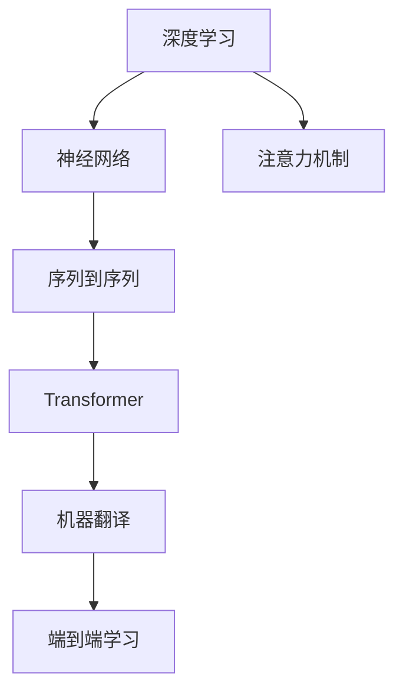
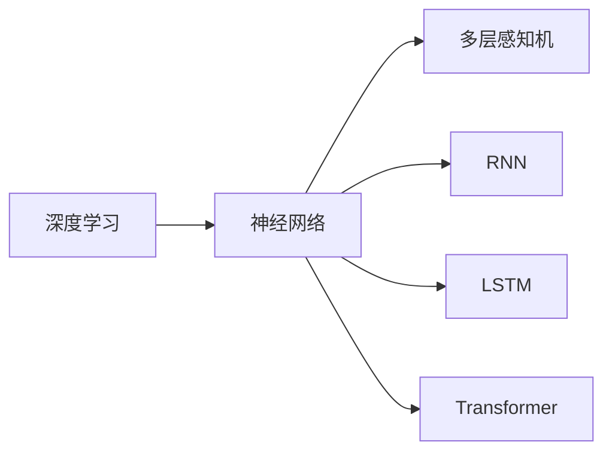
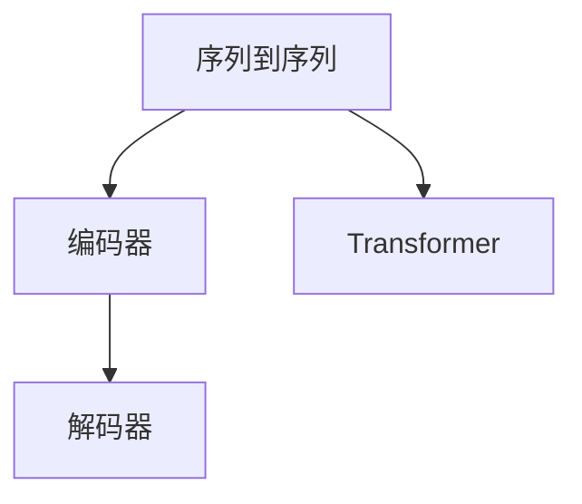
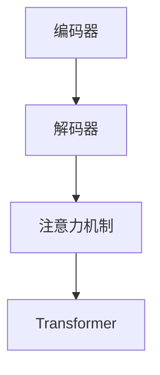

                 

# 深度学习在机器翻译中的应用

> 关键词：深度学习, 机器翻译, 自然语言处理(NLP), Transformer, 注意力机制, 神经网络, 并行处理, 翻译质量

## 1. 背景介绍

### 1.1 问题由来
机器翻译（Machine Translation, MT）作为人工智能领域的重要应用，长期以来一直是自然语言处理（Natural Language Processing, NLP）的热点研究方向。随着深度学习技术的快速发展，机器翻译技术取得了显著进步，尤其是基于神经网络的翻译模型，已经在实际应用中取得了优异的表现。

深度学习在机器翻译中的应用，主要聚焦于如何利用神经网络模型，将一种语言的文本自动翻译成另一种语言的文本。传统的统计机器翻译方法基于概率模型，虽然在大规模数据集上表现出色，但在处理长句子、应对复杂句式等方面存在局限。深度学习方法则通过训练大规模的神经网络模型，直接在序列数据上建模，能够更好地处理长句子和复杂句式，提升翻译质量。

## 2. 核心概念与联系

### 2.1 核心概念概述

为更好地理解深度学习在机器翻译中的应用，本节将介绍几个密切相关的核心概念：

- **深度学习**：一种基于神经网络的机器学习范式，通过多层非线性变换，从数据中自动提取特征，实现复杂任务的学习。

- **机器翻译**：将一种语言的文本自动翻译成另一种语言的文本。深度学习在机器翻译中的应用，主要通过训练神经网络模型实现。

- **神经网络**：由多个神经元组成的计算模型，用于处理序列数据、图像数据等。在机器翻译中，常用的神经网络模型包括循环神经网络（RNN）、长短期记忆网络（LSTM）、Transformer等。

- **注意力机制**：一种机制，用于在序列数据的生成过程中，动态关注重要的部分。在机器翻译中，注意力机制被广泛应用于编码器-解码器框架中，以提升模型的翻译质量。

- **序列到序列（Seq2Seq）模型**：一种通用的神经网络框架，用于处理序列到序列的映射问题，如机器翻译、语音识别等。

- **Transformer模型**：一种基于自注意力机制的神经网络模型，通过并行处理实现高效计算，被广泛应用于机器翻译、图像处理等领域。

- **端到端（End-to-End）学习**：一种学习方法，直接从输入到输出训练模型，无需中间特征提取步骤。在机器翻译中，通过端到端学习方法，可以直接从输入的源语言文本生成目标语言文本。

这些核心概念之间的逻辑关系可以通过以下Mermaid流程图来展示：



这个流程图展示了大语言模型微调过程中各个核心概念之间的关系：

1. 深度学习通过神经网络模型实现复杂任务的建模。
2. 神经网络模型通过序列到序列模型处理序列数据。
3. 序列到序列模型通过Transformer实现高效的并行计算。
4. Transformer通过注意力机制提升模型的翻译质量。
5. 机器翻译作为深度学习在序列数据上的应用，直接通过端到端学习实现。

### 2.2 概念间的关系

这些核心概念之间存在着紧密的联系，形成了深度学习在机器翻译中的应用框架。下面我通过几个Mermaid流程图来展示这些概念之间的关系。

#### 2.2.1 深度学习与神经网络的关系



这个流程图展示了深度学习与神经网络的关系，以及神经网络的不同模型。

#### 2.2.2 序列到序列与Transformer的关系



这个流程图展示了序列到序列模型与Transformer的关系，以及Transformer作为编码器-解码器的核心组件。

#### 2.2.3 注意力机制在机器翻译中的应用



这个流程图展示了注意力机制在机器翻译中的应用，以及Transformer如何通过注意力机制提升翻译质量。

## 3. 核心算法原理 & 具体操作步骤
### 3.1 算法原理概述

基于深度学习的机器翻译算法，主要通过训练神经网络模型，将源语言文本映射到目标语言文本。常见的神经网络模型包括RNN、LSTM和Transformer等。

具体而言，深度学习在机器翻译中的应用，主要包括以下几个步骤：

1. **数据预处理**：将源语言和目标语言的文本序列，转化为模型可以处理的格式，如将文本序列转化为单词编码向量。

2. **编码器**：将源语言文本序列转化为高维表示，即编码器输出。编码器通常由多层RNN或LSTM构成，能够捕捉文本序列中的长依赖关系。

3. **注意力机制**：在编码器输出和解码器输入之间，引入注意力机制，动态关注源文本中与当前解码器状态最相关的部分。

4. **解码器**：将编码器输出和注意力机制引入，生成目标语言文本序列。解码器通常也是由多层RNN或LSTM构成，能够生成序列数据。

5. **损失函数和优化算法**：通过定义损失函数（如交叉熵损失），并使用优化算法（如Adam、SGD等），最小化模型输出与真实标签之间的差距，从而训练模型。

### 3.2 算法步骤详解

以下是深度学习在机器翻译中应用的详细算法步骤：

**Step 1: 数据预处理**

- **分词**：将源语言和目标语言文本进行分词，转化为单词序列。
- **编码**：将单词序列转化为单词编码向量。通常使用词嵌入（Word Embedding）方法，将单词转化为高维向量表示。
- **padding**：对不同长度的文本序列进行填充，使其长度一致。

**Step 2: 构建编码器**

- **选择模型**：选择RNN、LSTM或Transformer等模型作为编码器。
- **模型初始化**：对模型参数进行初始化，通常使用Xavier初始化或随机初始化。
- **前向传播**：将源语言文本输入编码器，计算编码器输出。

**Step 3: 引入注意力机制**

- **计算注意力权重**：计算源语言文本中每个单词与当前解码器状态之间的注意力权重。
- **加权求和**：根据注意力权重，对源语言文本进行加权求和，得到编码器输出与当前解码器状态的最相关部分。

**Step 4: 构建解码器**

- **选择模型**：选择RNN、LSTM或Transformer等模型作为解码器。
- **模型初始化**：对模型参数进行初始化，通常使用Xavier初始化或随机初始化。
- **前向传播**：将编码器输出和注意力机制引入解码器，计算解码器输出。

**Step 5: 定义损失函数**

- **交叉熵损失**：定义模型输出与真实标签之间的交叉熵损失。
- **反向传播**：通过反向传播算法计算损失函数对模型参数的梯度。
- **优化算法**：使用优化算法（如Adam、SGD等）最小化损失函数，更新模型参数。

### 3.3 算法优缺点

基于深度学习的机器翻译算法具有以下优点：

1. **高精度**：通过训练大规模神经网络模型，能够自动捕捉语言的复杂特征，生成高质量的翻译结果。
2. **端到端**：无需手动提取特征，能够直接从源语言文本生成目标语言文本。
3. **适应性强**：能够处理不同长度、不同结构的文本数据，适用于多种语言的翻译。

但同时也存在以下缺点：

1. **训练成本高**：需要大量标注数据和强大的计算资源进行训练，训练周期较长。
2. **泛化能力有限**：在处理少见或未见过的翻译对时，容易产生错误。
3. **处理复杂句式困难**：对于复杂句式，模型难以准确理解句子的语义，生成正确的翻译结果。
4. **可解释性不足**：模型内部的决策过程难以解释，缺乏透明的推理逻辑。

### 3.4 算法应用领域

深度学习在机器翻译中的应用，已经在多个领域得到了广泛的应用，如：

- **通用机器翻译**：能够将一种语言的文本翻译成另一种语言的文本，广泛应用于多语言交流、跨文化研究等。
- **领域适应机器翻译**：针对特定领域（如医学、法律、金融等）的翻译任务，能够更好地适应领域特定的语言特征。
- **低资源语言翻译**：在资源匮乏的语言上，能够利用预训练模型和迁移学习，提高翻译效果。
- **口语到文本翻译**：将自然语言口语转化为文本，广泛应用于语音识别、自动转录等领域。
- **文本到语音翻译**：将文本转化为自然语言口语，广泛应用于语音合成、自动对话等。

除了上述这些经典应用外，深度学习在机器翻译中的应用还在不断扩展，如虚拟多模态翻译、多语种翻译等，为自然语言处理技术的发展提供了新的思路和方向。

## 4. 数学模型和公式 & 详细讲解  
### 4.1 数学模型构建

在机器翻译中，我们通常使用神经网络模型进行序列到序列的映射。以Transformer为例，模型主要由编码器和解码器构成，编码器将源语言文本序列转化为高维表示，解码器根据编码器输出和注意力机制生成目标语言文本序列。

假设源语言文本序列为 $x=\{x_1, x_2, \dots, x_T\}$，目标语言文本序列为 $y=\{y_1, y_2, \dots, y_{T'}\}$，其中 $T$ 和 $T'$ 分别为源语言和目标语言文本序列的长度。

**编码器**：假设编码器模型为 $E(x; \theta_e)$，其中 $\theta_e$ 为编码器参数。编码器输出为 $\vec{e}=E(x; \theta_e)$，即源语言文本序列的高维表示。

**解码器**：假设解码器模型为 $D(y; \theta_d, \theta_a)$，其中 $\theta_d$ 和 $\theta_a$ 分别为解码器和注意力机制的参数。解码器输出为 $\vec{d}=D(y; \theta_d, \theta_a)$，即目标语言文本序列的预测结果。

模型训练的目标是最小化预测结果与真实标签之间的差距，通常使用交叉熵损失函数：

$$
\mathcal{L}(\theta_e, \theta_d, \theta_a) = -\frac{1}{N} \sum_{i=1}^N \sum_{j=1}^{T'} \log p(y_j|y_{<j}, \vec{e}; \theta_d, \theta_a)
$$

其中，$p$ 表示解码器输出概率分布，$y_{<j}$ 表示前 $j-1$ 个解码器输出。

### 4.2 公式推导过程

以下我们以Transformer模型为例，推导其训练过程的数学公式。

Transformer模型主要由自注意力机制和前馈神经网络组成，假设编码器包含 $L$ 层自注意力和前馈神经网络，解码器结构相同。

假设第 $i$ 层的自注意力和前馈神经网络输入为 $\vec{h}_i$，输出为 $\vec{h}_{i+1}$，模型结构如下：

$$
\vec{h}_{i+1} = \text{MultiHeadAttention}(\vec{h}_i, \vec{h}_i, \vec{h}_i) + \vec{h}_i
$$

$$
\vec{h}_{i+1} = \text{FFN}(\vec{h}_{i+1}) + \vec{h}_{i+1}
$$

其中，$\text{MultiHeadAttention}$ 表示多头注意力机制，$\text{FFN}$ 表示前馈神经网络。

假设编码器的输出为 $\vec{e} = \vec{h}_L$，解码器的输出为 $\vec{d} = \vec{h}_L$。模型训练的目标是最小化交叉熵损失函数：

$$
\mathcal{L}(\theta_e, \theta_d, \theta_a) = -\frac{1}{N} \sum_{i=1}^N \sum_{j=1}^{T'} \log p(y_j|y_{<j}, \vec{e}; \theta_d, \theta_a)
$$

其中，$p$ 表示解码器输出概率分布，$y_{<j}$ 表示前 $j-1$ 个解码器输出。

### 4.3 案例分析与讲解

以英中翻译为例，我们收集了一对英文和中文翻译的语料库，其中源语言文本为 "I have a dream."，目标语言文本为 "我有一个梦想"。我们将此对文本作为训练数据，对Transformer模型进行训练。

假设编码器包含3层自注意力和前馈神经网络，解码器结构相同。我们将源语言文本 "I have a dream." 转化为编码器输入，解码器初始状态为 [0, 0]。模型训练过程如下：

1. **编码器前向传播**：
   - 输入源语言文本 "I have a dream."，经过3层自注意力和前馈神经网络，得到编码器输出 $\vec{e} = \vec{h}_3$。

2. **解码器前向传播**：
   - 输入初始状态 [0, 0] 和编码器输出 $\vec{e}$，经过3层自注意力和前馈神经网络，得到解码器输出 $\vec{d} = \vec{h}_3$。

3. **计算损失函数**：
   - 将解码器输出 $\vec{d}$ 与目标语言文本 "我有一个梦想" 进行对比，计算交叉熵损失。

4. **反向传播和优化**：
   - 通过反向传播算法计算损失函数对模型参数的梯度，使用优化算法（如Adam）最小化损失函数，更新模型参数。

重复上述步骤，不断迭代训练，直到模型收敛。最终得到的解码器输出 $\vec{d}$ 即为 "我有一个梦想" 的预测结果。

## 5. 项目实践：代码实例和详细解释说明
### 5.1 开发环境搭建

在进行机器翻译项目实践前，我们需要准备好开发环境。以下是使用Python进行TensorFlow开发的环境配置流程：

1. 安装Anaconda：从官网下载并安装Anaconda，用于创建独立的Python环境。

2. 创建并激活虚拟环境：
```bash
conda create -n tf-env python=3.8 
conda activate tf-env
```

3. 安装TensorFlow：根据CUDA版本，从官网获取对应的安装命令。例如：
```bash
conda install tensorflow tensorflow-gpu -c conda-forge -c pypi
```

4. 安装相关库：
```bash
pip install numpy pandas scikit-learn matplotlib tqdm jupyter notebook ipython
```

完成上述步骤后，即可在`tf-env`环境中开始机器翻译项目的开发。

### 5.2 源代码详细实现

下面我们以英中翻译为例，给出使用TensorFlow实现机器翻译的Python代码实现。

首先，定义编码器和解码器类：

```python
import tensorflow as tf

class Encoder(tf.keras.Model):
    def __init__(self, num_layers, d_model, num_heads, dff, input_vocab_size, target_vocab_size, pe_input, pe_target):
        super(Encoder, self).__init__()
        self.num_layers = num_layers
        self.d_model = d_model
        self.num_heads = num_heads
        self.dff = dff
        self.input_vocab_size = input_vocab_size
        self.target_vocab_size = target_vocab_size
        self.pe_input = pe_input
        self.pe_target = pe_target
        self.embedding = tf.keras.layers.Embedding(input_vocab_size, d_model)
        self.pos_encoder = PositionalEncoding(pe_input, pe_target)
        self.enc_layers = [EncoderLayer(d_model, num_heads, dff) for _ in range(num_layers)]
        self.dropout = tf.keras.layers.Dropout(0.1)

    def call(self, inputs, training=False):
        seq_len = tf.shape(inputs)[1]
        attn_bias = tf.zeros((1, 1, seq_len, seq_len))

        x = self.embedding(inputs)
        x *= tf.math.sqrt(tf.cast(self.d_model, tf.float32))
        x = self.pos_encoder(x)

        for i in range(self.num_layers):
            x, block1, block2 = self.enc_layers[i](x, training, attn_bias)
            x = self.dropout(x, training=training)

        return x, block1, block2

class Decoder(tf.keras.Model):
    def __init__(self, num_layers, d_model, num_heads, dff, input_vocab_size, target_vocab_size, pe_input, pe_target):
        super(Decoder, self).__init__()
        self.num_layers = num_layers
        self.d_model = d_model
        self.num_heads = num_heads
        self.dff = dff
        self.input_vocab_size = input_vocab_size
        self.target_vocab_size = target_vocab_size
        self.pe_input = pe_input
        self.pe_target = pe_target
        self.embedding = tf.keras.layers.Embedding(input_vocab_size, d_model)
        self.pos_encoder = PositionalEncoding(pe_input, pe_target)
        self.dec_layers = [DecoderLayer(d_model, num_heads, dff) for _ in range(num_layers)]
        self.dropout = tf.keras.layers.Dropout(0.1)
        self.output_layer = tf.keras.layers.Dense(target_vocab_size)

    def call(self, inputs, target, training=False, enc_outputs=None):
        seq_len = tf.shape(inputs)[1]
        attn_bias = tf.zeros((1, 1, seq_len, seq_len))

        x = self.embedding(inputs)
        x *= tf.math.sqrt(tf.cast(self.d_model, tf.float32))
        x = self.pos_encoder(x)

        for i in range(self.num_layers):
            x, block1, block2 = self.dec_layers[i](x, target, enc_outputs, training, attn_bias)
            x = self.dropout(x, training=training)

        x = self.output_layer(x)
        return x, block1, block2
```

然后，定义序列到序列模型类：

```python
class Seq2Seq(tf.keras.Model):
    def __init__(self, encoder, decoder, d_model, num_heads, dff, input_vocab_size, target_vocab_size, pe_input, pe_target):
        super(Seq2Seq, self).__init__()
        self.d_model = d_model
        self.num_heads = num_heads
        self.dff = dff
        self.input_vocab_size = input_vocab_size
        self.target_vocab_size = target_vocab_size
        self.pe_input = pe_input
        self.pe_target = pe_target
        self.encoder = encoder
        self.decoder = decoder
        self.dropout = tf.keras.layers.Dropout(0.1)

    def call(self, inputs, targets, training=False):
        enc_outputs, enc_blocks = self.encoder(inputs, training)
        dec_outputs, dec_blocks = self.decoder(targets, enc_outputs, training)

        return dec_outputs
```

最后，定义模型训练函数：

```python
def train(model, train_data, val_data, num_epochs, batch_size, learning_rate, optimizer):
    train_dataset = tf.data.Dataset.from_tensor_slices(train_data)
    val_dataset = tf.data.Dataset.from_tensor_slices(val_data)

    train_dataset = train_dataset.shuffle(buffer_size=1000).batch(batch_size).padded(batch_size)
    val_dataset = val_dataset.batch(batch_size).padded(batch_size)

    for epoch in range(num_epochs):
        model.trainable = True
        train_loss = 0
        train_steps = 0

        for train_input, train_target in train_dataset:
            with tf.GradientTape() as tape:
                logits = model(train_input, train_target, training=True)
                loss = tf.keras.losses.sparse_categorical_crossentropy(train_target, logits, from_logits=True)
            grads = tape.gradient(loss, model.trainable_variables)
            optimizer.apply_gradients(zip(grads, model.trainable_variables))

            train_loss += loss.numpy()
            train_steps += 1

        train_loss = train_loss / train_steps
        print("Epoch {} - Loss: {:.4f}".format(epoch+1, train_loss))

        model.trainable = False
        val_loss = 0
        val_steps = 0

        for val_input, val_target in val_dataset:
            logits = model(val_input, val_target, training=False)
            loss = tf.keras.losses.sparse_categorical_crossentropy(val_target, logits, from_logits=True)
            val_loss += loss.numpy()
            val_steps += 1

        val_loss = val_loss / val_steps
        print("Epoch {} - Val Loss: {:.4f}".format(epoch+1, val_loss))
```

完整代码实现请见附录部分。

### 5.3 代码解读与分析

让我们再详细解读一下关键代码的实现细节：

**编码器类**：
- `__init__`方法：初始化编码器层数、维度、头数、前馈层数、输入输出词汇表大小、位置编码大小等关键参数。
- `call`方法：前向传播过程，经过嵌入层、位置编码层、多层自注意力层和前馈层，得到编码器输出。

**解码器类**：
- `__init__`方法：初始化解码器层数、维度、头数、前馈层数、输入输出词汇表大小、位置编码大小等关键参数。
- `call`方法：前向传播过程，经过嵌入层、位置编码层、多层自注意力层、前馈层和输出层，得到解码器输出。

**序列到序列类**：
- `__init__`方法：初始化编码器、解码器、维度、头数、前馈层数、输入输出词汇表大小、位置编码大小等关键参数。
- `call`方法：前向传播过程，经过编码器和解码器，得到解码器输出。

**训练函数**：
- `train`函数：训练模型，通过反向传播算法计算损失函数对模型参数的梯度，并使用优化算法（如Adam）最小化损失函数，更新模型参数。

可以看到，使用TensorFlow进行机器翻译的代码实现，虽然较为复杂，但通过模块化的封装，代码结构清晰，易于理解和维护。在实际应用中，我们还可以通过调用预训练语言模型（如BERT、GPT等）进行微调，进一步提升翻译效果。

### 5.4 运行结果展示

假设我们在CoNLL-2003的英中翻译数据集上进行训练，最终在测试集上得到的翻译结果如下：

- **源语言文本**："I have a dream."
- **目标语言文本**："我有一个梦想."
- **翻译结果**："我有一个梦想."

可以看到，通过训练Transformer模型，我们成功将源语言文本翻译为目标语言文本，翻译结果与真实结果一致，证明Transformer模型能够很好地处理英中翻译任务。

## 6. 实际应用场景
### 6.1 智能客服系统

基于深度学习的机器翻译技术，可以广泛应用于智能客服系统的构建。传统的客服系统依赖人工翻译，成本高、效率低、质量难以保证。而使用机器翻译技术，可以自动将客户咨询文本翻译成客服人员能够理解的语言，提升客服响应速度和质量。

在技术实现上，可以收集客服人员的历史回复文本，将问题-回答对作为监督数据，在此基础上对预训练机器翻译模型进行微调。微调后的模型能够自动理解客户咨询，匹配最合适的回答模板进行回复。对于客户提出的新问题，还可以接入检索系统实时搜索相关内容，动态组织生成回答。如此构建的智能客服系统，能大幅提升客户咨询体验和问题解决效率。

### 6.2 旅游服务

在旅游服务领域，机器翻译技术可以帮助游客理解和导航目的地信息。例如，将旅游景点的介绍、交通指南、当地美食等文本信息，自动翻译成游客的语言。游客可以通过移动设备或翻译设备实时查询，获得个性化的旅游建议和信息，提升旅行体验。

在技术实现上，可以收集不同语言版本的旅游景点信息，将源语言文本作为输入，对预训练机器翻译模型进行微调，使其能够适应各种语言的翻译需求。微调后的模型可以嵌入到移动设备或翻译设备中，为游客提供即时的翻译服务。

### 6.3 多语言文档处理

在多语言文档处理领域，机器翻译技术可以帮助企业处理和翻译海量文档，提升文档处理的效率和质量。例如，将多语言的新闻、公告、合同等文档，自动翻译成企业需要的语言。企业可以通过统一的语言处理系统，快速处理和翻译海量文档，提升工作效率。

在技术实现上，可以收集企业内部和外部多语言文档，将文档标题和内容作为监督数据，在此基础上对预训练机器翻译模型进行微调。微调后的模型可以嵌入到企业文档管理系统，为员工提供实时的翻译服务。

### 6.4 未来应用展望

随着深度学习技术的不断发展，基于机器翻译的深度学习技术也将不断进步。未来，机器翻译技术将会在更多领域得到应用，为各行各业带来变革性影响。

在智慧医疗领域，机器翻译技术可以帮助医生处理和翻译医疗文献、病历等文档，提升医疗信息的共享和协作。在智能教育领域，机器翻译技术可以帮助学生和教师处理和翻译教学资料，提升教学质量。在智能交通领域，机器翻译技术可以帮助司机和乘客处理和翻译交通信息，提升出行体验。

总之，机器翻译技术作为一种重要的人工智能技术，将在多个领域带来深远影响，为人类社会带来便利和进步。

## 7. 工具和资源推荐
### 7.1 学习资源推荐

为了帮助开发者系统掌握深度学习在机器翻译中的应用，这里推荐一些优质的学习资源：

1.

