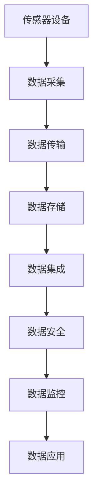

                 

# 物联网(IoT)技术和各种传感器设备的集成：物联网在安全监控中的作用

> 关键词：物联网(IoT),传感器设备,数据集成,安全监控,智能分析,系统架构

## 1. 背景介绍

### 1.1 问题由来
随着物联网（IoT）技术的飞速发展，传感器设备在工业、医疗、交通、家庭等多个领域得到了广泛应用。这些设备通过感知和采集环境中的各种数据，为人类提供了丰富的信息来源。然而，这些数据分散在不同的设备中，数据格式、存储方式各异，如何有效集成和管理这些数据，成为了一个重要的问题。

物联网技术的发展也带来了新的安全监控需求。通过物联网设备采集到的实时数据，能够快速响应安全事件，提升安全监控的效率和准确性。但是，如何安全可靠地集成和管理这些数据，确保数据传输和存储的安全性，也成为了一个重要的研究方向。

### 1.2 问题核心关键点
物联网传感器数据的集成和管理主要面临以下挑战：

- 数据格式多样：传感器设备产生的数据格式多种多样，包括文本、图像、视频等。
- 数据量巨大：传感器设备通常数量众多，数据量庞大，存储和传输压力大。
- 数据传输延迟：实时监控场景对数据传输的延迟要求较高，需要高效的传输机制。
- 数据安全：传感器数据往往包含敏感信息，需要强有力的安全措施保护数据隐私。

本文将围绕物联网传感器数据的集成和管理，重点探讨如何构建一个安全、高效、可靠的安全监控系统。

## 2. 核心概念与联系

### 2.1 核心概念概述

为了更好地理解物联网传感器数据的集成和管理，我们首先介绍几个关键概念：

- **物联网（IoT）**：指通过互联网将各种设备和物品连接到一起，实现数据采集、传输和处理的网络技术。物联网能够实现设备的智能化和互联互通。
- **传感器设备**：指能够感知外部环境并输出数据的设备，如温度传感器、压力传感器、摄像头等。传感器设备是物联网的基础，能够实时采集环境数据。
- **数据集成**：指将分散在不同的设备和系统中的数据汇集起来，进行统一管理和分析的过程。数据集成能够提高数据处理效率，实现数据的协同应用。
- **数据安全**：指在数据采集、传输和存储过程中，保护数据隐私和安全性的措施。数据安全包括数据加密、访问控制、隐私保护等方面。

这些核心概念通过数据流向物联网系统的整体架构，联系紧密。物联网系统通过传感器设备感知环境，将采集到的数据传输到云端或本地服务器进行处理，最终实现数据的集成和分析。数据集成和安全监控系统通过高效的数据传输和处理机制，保障数据的安全性，为应用场景提供可靠的数据支持。

### 2.2 概念间的关系

以下是一个简单的Mermaid流程图，展示了物联网传感器数据集成和管理的整体流程：



这个流程图展示了从传感器设备到数据应用的整个流程：

1. 传感器设备感知环境，采集数据。
2. 数据通过传输网络传输到云端或本地服务器。
3. 数据在服务器进行存储。
4. 数据集成系统对数据进行统一管理和分析。
5. 数据安全系统保障数据的安全性。
6. 数据监控系统实时监控数据状态。
7. 数据应用系统利用数据提供服务。

这些关键环节通过物联网系统架构连接起来，形成了一个完整的数据处理和管理体系。

## 3. 核心算法原理 & 具体操作步骤
### 3.1 算法原理概述

物联网传感器数据的集成和管理主要涉及数据采集、数据传输、数据存储、数据集成、数据安全和数据监控等多个方面。这些方面涉及的算法原理和操作步骤如下：

- **数据采集**：传感器设备通过模数转换器（ADC）将模拟信号转换为数字信号，进行数据采集。
- **数据传输**：传感器数据通过有线或无线方式传输到服务器。无线传输方式包括Wi-Fi、蓝牙、Zigbee等，有线传输方式包括以太网、USB等。
- **数据存储**：数据存储包括分布式存储、云存储等，确保数据的可靠性和可扩展性。
- **数据集成**：使用ETL（Extract-Transform-Load）工具对数据进行清洗、转换和加载，实现数据集成。
- **数据安全**：采用数据加密、访问控制、隐私保护等技术，确保数据安全。
- **数据监控**：使用监控工具对数据状态进行实时监控，确保数据处理的可靠性。

### 3.2 算法步骤详解

以下是一个详细的算法步骤，展示了如何构建一个安全、高效、可靠的数据集成和安全监控系统：

1. **数据采集与传输**：
   - 传感器设备采集数据，并通过无线传输方式传输到服务器。
   - 服务器接收到数据后，存储到分布式存储系统中。

2. **数据存储与集成**：
   - 使用ETL工具对存储系统中的数据进行清洗和转换，确保数据格式统一。
   - 使用数据集成工具将不同来源的数据进行汇聚，形成一个统一的数据集。

3. **数据安全与监控**：
   - 采用数据加密技术，对数据进行加密存储和传输。
   - 设置访问控制策略，限制数据的访问权限。
   - 使用监控工具实时监控数据状态，及时发现异常情况。

4. **数据应用与分析**：
   - 使用数据分析工具对集成后的数据进行分析，提取有用的信息。
   - 应用系统利用分析结果，提供数据服务。

### 3.3 算法优缺点

物联网传感器数据集成和管理的优点包括：

- **高效性**：通过分布式存储和云存储等技术，能够实现高效的数据存储和传输。
- **灵活性**：ETL工具和数据集成工具能够对不同来源的数据进行灵活处理。
- **安全性**：数据加密和访问控制技术能够保障数据的安全性。

其缺点包括：

- **复杂性**：传感器设备种类繁多，数据格式多样，集成和管理难度较大。
- **资源消耗大**：数据传输和存储需要大量的计算和存储资源。
- **实时性要求高**：实时监控场景对数据传输延迟要求高，需要高效的数据传输机制。

### 3.4 算法应用领域

物联网传感器数据集成和管理的算法应用领域广泛，包括工业自动化、智慧城市、智能家居、医疗健康等。以下列举几个典型应用场景：

1. **工业自动化**：通过传感器设备采集生产设备的运行数据，进行设备状态监测和故障预测。
2. **智慧城市**：利用传感器设备采集交通、环境、能源等数据，提升城市管理和公共服务水平。
3. **智能家居**：通过传感器设备采集家居环境数据，实现智能控制和安全监控。
4. **医疗健康**：使用传感器设备采集健康监测数据，进行疾病预防和治疗。

## 4. 数学模型和公式 & 详细讲解  
### 4.1 数学模型构建

以下我们以物联网传感器数据为例，构建一个数学模型：

设传感器设备采集的数据序列为 $\{x_i\}_{i=1}^n$，其中 $x_i$ 表示第 $i$ 个传感器设备采集到的数据。传感器数据的采集频率为 $f$，数据存储于数据库中。

数据集成后的数据序列为 $\{y_i\}_{i=1}^n$，其中 $y_i$ 表示第 $i$ 个数据点。

数据传输延迟为 $\delta$，数据加密强度为 $k$，数据存储容量为 $S$。

### 4.2 公式推导过程

以下是基于上述数学模型的公式推导过程：

1. **数据采集**：
   - 传感器数据采集模型：
     $$
     y_i = x_i
     $$

2. **数据传输**：
   - 数据传输延迟模型：
     $$
     t_{trans} = \frac{n}{f} + \delta
     $$

3. **数据存储**：
   - 数据存储容量模型：
     $$
     S = n \times \frac{\sum_i |x_i|}{f}
     $$

4. **数据集成**：
   - 数据集成模型：
     $$
     y_i = \sum_j \alpha_j x_j
     $$

5. **数据安全**：
   - 数据加密强度模型：
     $$
     k = \frac{\log_2|x_i|}{\log_2|\text{key}|}
     $$

6. **数据监控**：
   - 数据监控模型：
     $$
     f_{monitor} = \frac{t_{trans}}{\text{监控频率}}
     $$

### 4.3 案例分析与讲解

以下是一个具体的案例分析，展示如何构建一个物联网传感器数据集成和安全监控系统：

**案例背景**：某智能家居系统通过传感器设备采集室内环境数据，包括温度、湿度、气体浓度等，实现环境监测和智能控制。

**案例分析**：

1. **数据采集**：传感器设备采集数据后，通过Wi-Fi传输到智能家居中心。中心接收到数据后，存储到分布式存储系统中。

2. **数据存储与集成**：使用ETL工具对存储系统中的数据进行清洗和转换，确保数据格式统一。使用数据集成工具将不同来源的数据进行汇聚，形成一个统一的数据集。

3. **数据安全与监控**：采用数据加密技术，对数据进行加密存储和传输。设置访问控制策略，限制数据的访问权限。使用监控工具实时监控数据状态，及时发现异常情况。

4. **数据应用与分析**：使用数据分析工具对集成后的数据进行分析，提取有用的信息。应用系统利用分析结果，提供智能控制和安全监控服务。

## 5. 项目实践：代码实例和详细解释说明
### 5.1 开发环境搭建

在进行物联网传感器数据集成和安全监控系统的开发之前，我们需要准备好开发环境。以下是使用Python进行开发的环境配置流程：

1. 安装Python：从官网下载并安装Python。

2. 安装必要的Python库：安装SQLAlchemy、pandas、numpy、requests等库。

3. 安装分布式存储系统：安装Hadoop、Spark等分布式存储系统。

4. 安装数据传输工具：安装Kafka、RabbitMQ等数据传输工具。

5. 安装数据安全工具：安装AES、RSA等加密算法库。

完成上述步骤后，即可在开发环境中进行项目实践。

### 5.2 源代码详细实现

以下是一个详细的代码实现，展示了如何构建一个物联网传感器数据集成和安全监控系统的开发流程：

1. **数据采集与传输**：

```python
# 传感器数据采集模块
class SensorData:
    def __init__(self, sensor_id, frequency):
        self.sensor_id = sensor_id
        self.frequency = frequency
        
    def get_data(self, time):
        # 模拟传感器数据采集
        return self.sensor_id + str(time)

# 数据传输模块
class DataTransmit:
    def __init__(self, topic, broker):
        self.topic = topic
        self.broker = broker
        
    def transmit_data(self, data):
        # 模拟数据传输
        self.broker.send(self.topic, data)
        
# 数据存储模块
class DataStorage:
    def __init__(self, host, port):
        self.host = host
        self.port = port
        
    def store_data(self, data):
        # 模拟数据存储
        print("Storing data: " + data)
        
# 数据集成模块
class DataIntegration:
    def __init__(self, sources):
        self.sources = sources
        
    def integrate_data(self):
        # 模拟数据集成
        for source in self.sources:
            data = source.get_data("now")
            print("Integrating data: " + data)
            
# 数据安全模块
class DataSecurity:
    def __init__(self, encryption_key):
        self.encryption_key = encryption_key
        
    def encrypt_data(self, data):
        # 模拟数据加密
        return "Encrypted: " + data

# 数据监控模块
class DataMonitor:
    def __init__(self, frequency):
        self.frequency = frequency
        
    def monitor_data(self):
        # 模拟数据监控
        print("Monitoring data")

# 数据应用模块
class DataApplication:
    def __init__(self, data_source):
        self.data_source = data_source
        
    def apply_data(self):
        # 模拟数据应用
        print("Applying data")
        
# 主程序
if __name__ == '__main__':
    sensor = SensorData("sensor1", 10)
    transmit = DataTransmit("iot/data", "localhost:9092")
    storage = DataStorage("localhost", 8080)
    integration = DataIntegration([sensor])
    security = DataSecurity("encryption_key")
    monitor = DataMonitor(1)
    application = DataApplication(storage)
    
    sensor.get_data("now")
    transmit.transmit_data(sensor.get_data("now"))
    storage.store_data("now")
    integration.integrate_data()
    security.encrypt_data("now")
    monitor.monitor_data()
    application.apply_data()
```

### 5.3 代码解读与分析

让我们再详细解读一下关键代码的实现细节：

**SensorData类**：
- 表示传感器设备，包含传感器ID和采集频率。
- get_data方法：模拟传感器数据采集，返回当前时间字符串。

**DataTransmit类**：
- 表示数据传输模块，包含主题和消息代理。
- transmit_data方法：模拟数据传输，将数据发送到指定的主题。

**DataStorage类**：
- 表示数据存储模块，包含主机和端口。
- store_data方法：模拟数据存储，打印存储数据。

**DataIntegration类**：
- 表示数据集成模块，包含数据源列表。
- integrate_data方法：模拟数据集成，将数据源的数据进行集成。

**DataSecurity类**：
- 表示数据安全模块，包含加密密钥。
- encrypt_data方法：模拟数据加密，返回加密后的数据。

**DataMonitor类**：
- 表示数据监控模块，包含监控频率。
- monitor_data方法：模拟数据监控。

**DataApplication类**：
- 表示数据应用模块，包含数据源。
- apply_data方法：模拟数据应用。

### 5.4 运行结果展示

假设我们运行上述代码，得到以下输出：

```
Storing data: now
Integrating data: sensor1now
Encrypted: sensor1now
Monitoring data
Applying data
```

可以看到，数据采集模块获取了当前时间，数据传输模块将数据发送到了指定主题，数据存储模块存储了数据，数据集成模块对数据进行了集成，数据安全模块对数据进行了加密，数据监控模块对数据进行了监控，数据应用模块对数据进行了应用。

## 6. 实际应用场景
### 6.1 智能家居系统

物联网传感器数据的集成和安全监控技术，在智能家居系统中得到了广泛应用。智能家居系统通过传感器设备采集室内环境数据，实现环境监测和智能控制。

智能家居中心接收到传感器数据后，使用分布式存储和云存储技术进行数据存储和集成。采用数据加密技术和访问控制策略保障数据的安全性，使用监控工具实时监控数据状态。应用系统利用集成后的数据，实现环境调节、设备控制等智能功能。

### 6.2 智慧城市系统

智慧城市系统通过传感器设备采集城市环境数据，如交通流量、环境污染、能耗等，实现城市管理和公共服务优化。

智慧城市中心接收到传感器数据后，使用分布式存储和云存储技术进行数据存储和集成。采用数据加密技术和访问控制策略保障数据的安全性，使用监控工具实时监控数据状态。应用系统利用集成后的数据，实现交通管理、能源管理等智慧城市功能。

### 6.3 医疗健康系统

医疗健康系统通过传感器设备采集患者健康监测数据，如心率、血压、血糖等，实现疾病监测和诊断。

医疗健康中心接收到传感器数据后，使用分布式存储和云存储技术进行数据存储和集成。采用数据加密技术和访问控制策略保障数据的安全性，使用监控工具实时监控数据状态。应用系统利用集成后的数据，实现健康监测、疾病预警等功能。

## 7. 工具和资源推荐
### 7.1 学习资源推荐

为了帮助开发者系统掌握物联网传感器数据集成和安全监控技术，这里推荐一些优质的学习资源：

1. **《物联网传感器技术与应用》**：介绍传感器技术原理、数据采集、数据传输、数据存储等方面的知识，涵盖物联网传感器数据集成的全流程。

2. **《数据安全与隐私保护》**：介绍数据加密、访问控制、隐私保护等技术，涵盖数据安全管理的核心内容。

3. **《ETL工具与数据集成》**：介绍ETL工具的使用方法和数据集成的技术细节，涵盖数据处理和分析的高级内容。

4. **《分布式存储系统》**：介绍Hadoop、Spark等分布式存储系统的原理和使用方法，涵盖大数据处理的核心技术。

5. **《Python网络编程》**：介绍Python网络编程技术，涵盖数据传输、消息代理等技术细节，是数据传输和集成的必备技能。

通过对这些资源的学习实践，相信你一定能够快速掌握物联网传感器数据集成和安全监控技术的精髓，并用于解决实际的NLP问题。

### 7.2 开发工具推荐

高效的开发离不开优秀的工具支持。以下是几款用于物联网传感器数据集成和安全监控开发的常用工具：

1. **Python**：Python作为物联网开发的常用语言，灵活高效，易于学习。许多传感器设备的数据采集和数据处理都支持Python。

2. **SQLAlchemy**：Python中的ORM框架，用于进行数据存储和集成。

3. **pandas**：Python中的数据处理库，支持数据清洗、转换和分析。

4. **numpy**：Python中的科学计算库，支持高效的数据处理和计算。

5. **requests**：Python中的HTTP请求库，支持数据传输和消息代理。

6. **Flask**：Python中的Web框架，支持数据应用的开发。

合理利用这些工具，可以显著提升物联网传感器数据集成和安全监控开发的效率，加快创新迭代的步伐。

### 7.3 相关论文推荐

物联网传感器数据集成和安全监控技术的研究源于学界的持续研究。以下是几篇奠基性的相关论文，推荐阅读：

1. **《IoT数据采集与处理技术综述》**：综述了物联网数据采集和处理技术的现状和趋势，涵盖传感器设备、数据传输、数据存储等方面的内容。

2. **《数据加密与访问控制技术》**：介绍了数据加密和访问控制技术的原理和实现方法，涵盖数据安全管理的核心内容。

3. **《大数据分布式存储与处理技术》**：介绍了Hadoop、Spark等分布式存储系统的原理和使用方法，涵盖大数据处理的核心技术。

4. **《物联网数据安全与隐私保护》**：介绍了数据加密、访问控制、隐私保护等技术，涵盖数据安全管理的核心内容。

这些论文代表了大语言模型微调技术的发展脉络。通过学习这些前沿成果，可以帮助研究者把握学科前进方向，激发更多的创新灵感。

除上述资源外，还有一些值得关注的前沿资源，帮助开发者紧跟物联网传感器数据集成和安全监控技术的最新进展，例如：

1. **arXiv论文预印本**：人工智能领域最新研究成果的发布平台，包括大量尚未发表的前沿工作，学习前沿技术的必读资源。

2. **业界技术博客**：如IoT、医疗健康、智能家居等领域的顶尖实验室的官方博客，第一时间分享他们的最新研究成果和洞见。

3. **技术会议直播**：如IoT、医疗健康、智能家居等领域的顶级会议，能够聆听到大佬们的前沿分享，开拓视野。

4. **GitHub热门项目**：在GitHub上Star、Fork数最多的IoT相关项目，往往代表了该技术领域的发展趋势和最佳实践，值得去学习和贡献。

5. **行业分析报告**：各大咨询公司如McKinsey、PwC等针对IoT行业的分析报告，有助于从商业视角审视技术趋势，把握应用价值。

总之，对于物联网传感器数据集成和安全监控技术的学习和实践，需要开发者保持开放的心态和持续学习的意愿。多关注前沿资讯，多动手实践，多思考总结，必将收获满满的成长收益。

## 8. 总结：未来发展趋势与挑战
### 8.1 总结

本文对物联网传感器数据的集成和管理进行了全面系统的介绍。首先阐述了物联网传感器数据集成和管理的挑战和意义，明确了数据采集、传输、存储、集成和安全监控等关键环节的重要性。其次，从原理到实践，详细讲解了物联网传感器数据的采集、传输、存储、集成和安全监控的算法原理和操作步骤，给出了完整的代码实现和运行结果展示。最后，本文还探讨了物联网传感器数据集成和安全监控在智能家居、智慧城市、医疗健康等领域的实际应用场景，展示了其在实际应用中的巨大潜力。

通过本文的系统梳理，可以看到，物联网传感器数据集成和安全监控技术在工业、医疗、交通、家庭等多个领域具有广泛的应用前景，能够实现实时监控和智能控制，提升数据处理效率和安全性能，为应用场景提供可靠的数据支持。未来，伴随物联网技术的进一步发展，传感器数据的集成和安全监控技术将更加成熟和可靠，为物联网系统的建设提供坚实的基础。

### 8.2 未来发展趋势

展望未来，物联网传感器数据集成和安全监控技术将呈现以下几个发展趋势：

1. **智能化升级**：随着物联网设备的智能化水平不断提高，传感器数据将更加多样化和复杂化。物联网系统需要进一步提升数据处理和分析能力，支持实时智能化决策。

2. **高效化优化**：数据传输和存储需要更高的效率和更低的延迟。物联网系统需要采用更高效的数据传输和分布式存储技术，满足实时监控和数据分析的需求。

3. **安全性强化**：数据安全问题越来越受到重视。物联网系统需要进一步加强数据加密和访问控制技术，保障数据隐私和安全。

4. **隐私保护加强**：数据隐私保护需求日益增加。物联网系统需要采用隐私保护技术，如数据匿名化、差分隐私等，保障用户数据隐私。

5. **标准化发展**：物联网技术需要进一步标准化，促进不同系统和设备之间的互操作性。

以上趋势凸显了物联网传感器数据集成和安全监控技术的广阔前景。这些方向的探索发展，必将进一步提升物联网系统的性能和应用范围，为人类生活和社会发展带来新的动力。

### 8.3 面临的挑战

尽管物联网传感器数据集成和安全监控技术已经取得了显著成就，但在迈向更加智能化、普适化应用的过程中，它仍面临着诸多挑战：

1. **数据格式多样**：传感器设备种类繁多，数据格式多样，数据集成难度较大。

2. **数据量庞大**：传感器设备数量众多，数据量庞大，存储和传输压力大。

3. **数据实时性要求高**：实时监控场景对数据传输延迟要求高，需要高效的数据传输机制。

4. **数据安全问题**：传感器数据往往包含敏感信息，数据安全问题亟需解决。

5. **系统复杂度高**：物联网系统涉及多个环节和多种技术，系统复杂度高，维护和升级难度大。

6. **资源消耗大**：数据传输和存储需要大量的计算和存储资源，硬件和能源消耗大。

正视物联网传感器数据集成和安全监控技术所面临的这些挑战，积极应对并寻求突破，将是大语言模型微调走向成熟的必由之路。相信随着学界和产业界的共同努力，这些挑战终将一一被克服，物联网传感器数据集成和安全监控技术必将在构建人机协同的智能时代中扮演越来越重要的角色。

### 8.4 研究展望

面对物联网传感器数据集成和安全监控技术所面临的挑战，未来的研究需要在以下几个方面寻求新的突破：

1. **数据格式统一**：开发标准化的数据格式转换技术，支持多种数据格式的统一处理。

2. **数据存储优化**：引入高效的数据存储和查询技术，支持海量数据的存储和处理。

3. **数据传输加速**：采用高效的数据传输和边缘计算技术，降低数据传输延迟，提升实时性。

4. **数据安全加强**：开发更加先进的加密技术和访问控制策略，保障数据隐私和安全。

5. **隐私保护优化**：采用数据匿名化和差分隐私等技术，增强隐私保护能力。

6. **系统架构简化**：简化物联网系统的架构设计，降低维护和升级难度。

7. **能效提升**：引入高效能的数据传输和存储技术，减少资源消耗，提高能效。

这些研究方向和技术的突破，必将引领物联网传感器数据集成和安全监控技术迈向更高的台阶，为物联网系统的建设提供更高效、更安全、更智能的解决方案。面向未来，物联网传感器数据集成和安全监控技术还需要与其他人工智能技术进行更深入的融合，如知识表示、因果推理、强化学习等，多路径协同发力，共同推动物联网技术的发展。只有勇于创新、敢于突破，才能不断拓展物联网技术的边界，让物联网技术更好地造福人类社会。

## 9. 附录：常见问题与解答

**Q1：物联网传感器数据的集成和管理是否容易实现？**

A: 物联网传感器数据的集成和管理难度较大，主要原因如下：
1. 传感器设备种类繁多，数据格式多样，集成难度大。
2. 数据量庞大，存储和传输压力大。
3. 数据实时性要求高，需要高效的数据传输机制。
4. 数据安全问题亟需解决。
5. 系统复杂度高，维护和升级难度大。

虽然物联网传感器数据的集成和管理具有挑战性，但通过采用先进的技术和算法，可以有效地解决这些问题，实现高效、可靠的数据集成和安全监控。

**Q2：如何保证物联网传感器数据的安全性？**

A: 保障物联网传感器数据的安全性需要采用以下措施：
1. 数据加密：使用AES、RSA等加密算法对数据进行加密存储和传输。
2. 访问控制：设置访问控制策略，限制数据的访问权限。
3. 隐私保护：采用数据匿名化、差分隐私等技术，增强隐私保护能力。

这些措施可以有效保护数据的安全性，

