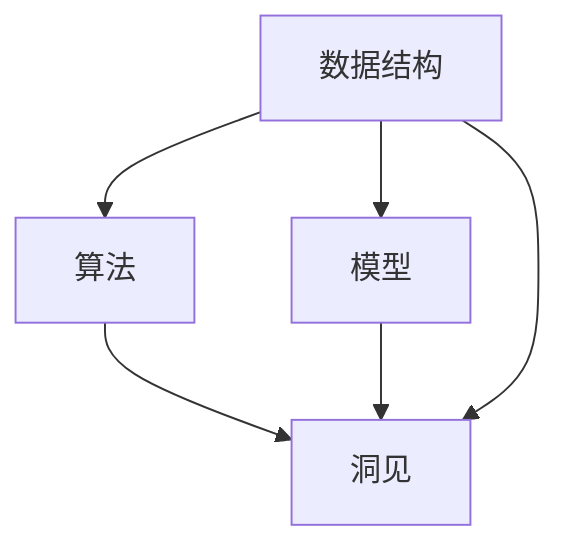
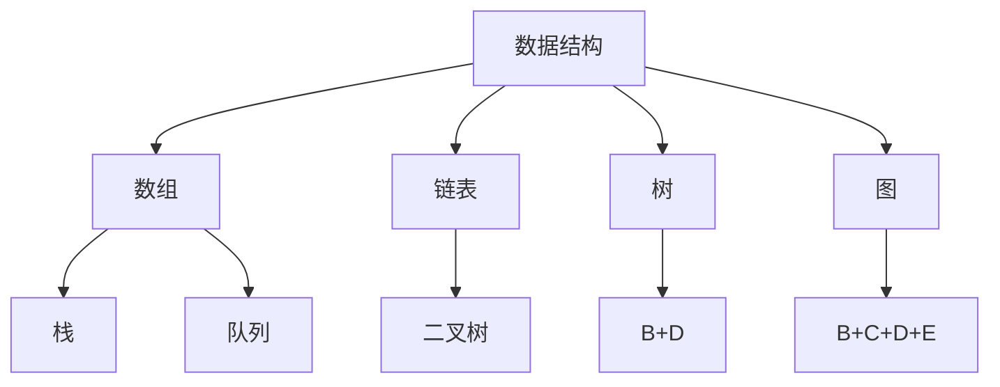
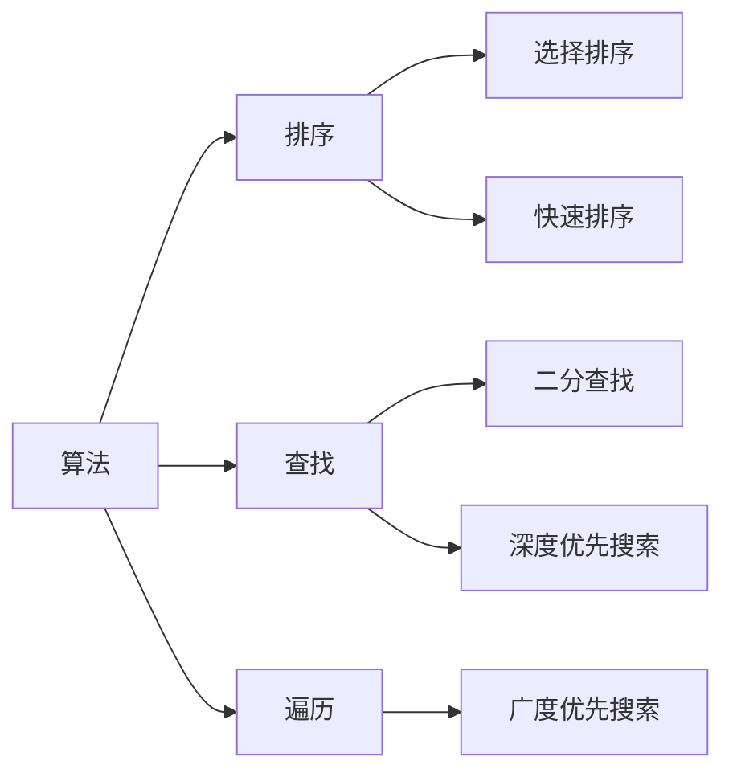
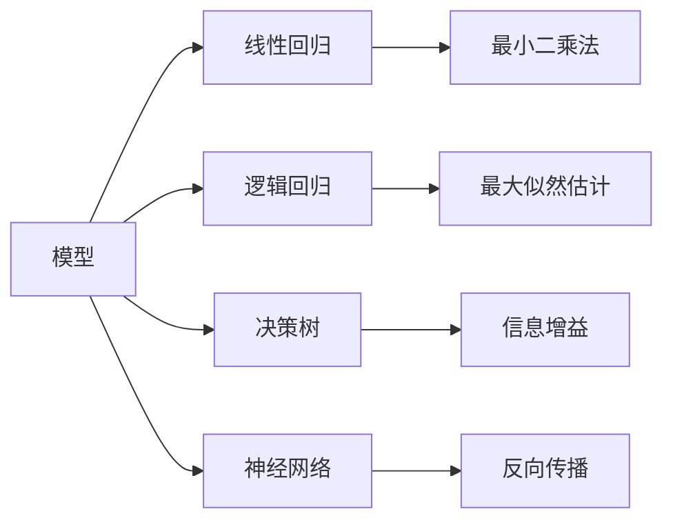
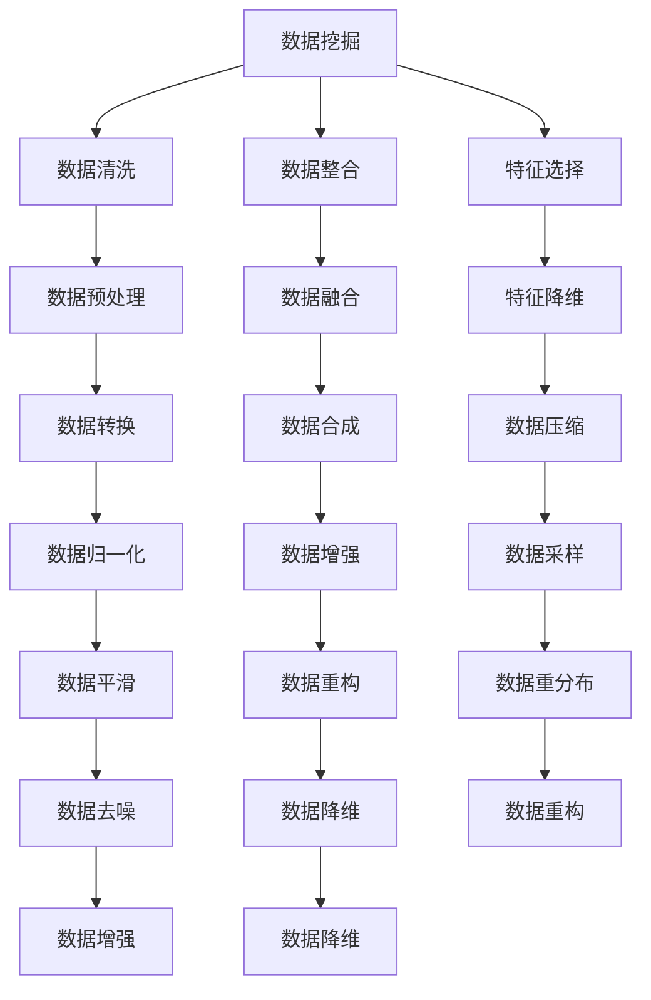

                 

# 理解世界的复杂性：从结构到洞见

## 1. 背景介绍

### 1.1 问题由来
在现代科技的推动下，我们正经历着前所未有的信息爆炸和知识普及。从互联网到大数据，从机器学习到人工智能，技术的发展不断拓展着人类认知的边界。然而，随着信息量的激增，我们面临着一个更复杂、更多维度的世界。如何从繁杂的数据中提取出有用的信息，理解世界的本质，成为了摆在每个数据科学家、工程师和技术从业者面前的重要课题。

### 1.2 问题核心关键点
在这一过程中，核心在于理解数据的结构和洞见。数据结构揭示了数据的组织方式和内在关系，而洞见则从数据中提取出对人类有意义的、可操作的智慧。理解数据结构是实现洞见的基础，洞见则是结构分析的最终目标。这两个概念相互依存，相辅相成，构成了从数据到智慧的桥梁。

### 1.3 问题研究意义
研究数据结构与洞见的关系，对于提升数据处理能力、推动人工智能技术的进步、优化决策过程、提升问题解决的效率，具有重要意义。通过深入理解这两者的关系，我们可以更有效地利用数据，揭示出隐藏在数据背后的重要信息，从而更好地应对各种复杂问题，促进社会和科技的发展。

## 2. 核心概念与联系

### 2.1 核心概念概述
要理解数据结构和洞见，首先需要了解一些核心概念：

- **数据结构**：指数据元素的集合以及元素之间的关系，常见的包括数组、链表、树、图等。数据结构揭示了数据的组织方式和内在关系，是理解数据的基础。

- **洞见**：指从数据中提取出的对人类有意义的、可操作的智慧。洞见是数据结构分析的最终目标，反映了对数据的深刻理解。

- **算法**：指解决特定问题的步骤序列。算法是实现洞见的工具，通过对数据结构的操作，算法能够提取洞见。

- **模型**：指对实际问题的一种抽象表示，通过数学模型或计算模型来描述数据结构，以揭示其内在规律。

- **数据挖掘**：指从数据中挖掘出有用信息和模式的过程。数据挖掘是获取洞见的关键步骤，通过算法和模型对数据结构进行操作，最终提取出有意义的洞见。

这些核心概念之间的逻辑关系可以通过以下Mermaid流程图来展示：



这个流程图展示了数据结构、算法、模型和洞见之间的关系：数据结构是算法的输入，算法通过模型对数据结构进行操作，最终提取出洞见。数据结构与洞见是互为依存的关系，算法和模型则是连接二者的桥梁。

### 2.2 概念间的关系

这些核心概念之间存在着紧密的联系，形成了数据结构和洞见的完整生态系统。下面我通过几个Mermaid流程图来展示这些概念之间的关系：

#### 2.2.1 数据结构的分类



这个流程图展示了数据结构的分类及其主要操作。数组、链表、树和图是常见的数据结构，通过不同操作可以派生出栈、队列、二叉树等子结构。

#### 2.2.2 算法的操作



这个流程图展示了算法的主要操作及其实现方法。排序、查找、遍历是常见的操作，具体实现则包括选择排序、快速排序、二分查找、深度优先搜索和广度优先搜索等。

#### 2.2.3 模型的表示



这个流程图展示了模型的表示及其主要优化方法。线性回归、逻辑回归、决策树和神经网络是常见的模型，通过不同优化方法可以实现不同的模型训练目标。

#### 2.2.4 数据挖掘的过程



这个流程图展示了数据挖掘的主要步骤及其操作。数据清洗、数据整合、特征选择、数据预处理、数据融合、数据转换、数据增强、数据采样、数据平滑、数据降维等步骤构成了数据挖掘的全过程。

## 3. 核心算法原理 & 具体操作步骤
### 3.1 算法原理概述

理解数据结构和洞见的核心算法，主要涉及以下几类算法：

- **数据结构算法**：用于处理和操作数据结构，常见的如排序算法、查找算法、遍历算法等。
- **模型训练算法**：用于训练各种模型，如线性回归、逻辑回归、决策树、神经网络等。
- **数据挖掘算法**：用于从数据中挖掘出洞见，常见的如聚类算法、分类算法、关联规则算法等。

### 3.2 算法步骤详解

下面以线性回归模型为例，详细介绍其核心算法步骤：

1. **数据准备**：收集数据集，并进行预处理，包括清洗、归一化、特征选择等步骤。
2. **模型初始化**：设置模型参数，如权重、偏置等。
3. **模型训练**：使用梯度下降等优化算法，不断调整模型参数，最小化损失函数。
4. **模型评估**：使用验证集或测试集对模型进行评估，评估指标如均方误差、均方根误差等。
5. **模型应用**：使用训练好的模型对新数据进行预测，得到模型的洞见。

### 3.3 算法优缺点

线性回归模型作为机器学习中的一种基础模型，具有以下优点：

- **简单高效**：算法实现简单，训练速度快，易于理解和实现。
- **解释性强**：模型参数直观，易于解释和理解。
- **泛化能力强**：适用于多种数据类型和分布。

同时，也存在一些缺点：

- **假设限制**：模型假设数据服从线性关系，对于非线性数据效果不佳。
- **过拟合风险**：对于噪声较大的数据，模型容易过拟合。
- **模型复杂性**：模型复杂度较高，对于大规模数据集计算量较大。

### 3.4 算法应用领域

线性回归模型广泛应用于各种数据分析和预测任务，如回归分析、时间序列预测、金融分析等。以下是一些典型应用领域：

- **金融分析**：用于股票价格预测、风险评估、信用评分等。
- **市场营销**：用于客户行为分析、市场趋势预测、广告效果评估等。
- **健康科学**：用于疾病预测、基因表达分析、药物研发等。
- **自然语言处理**：用于文本分类、情感分析、语义分析等。
- **地理信息系统**：用于地图分析、位置预测、交通流量分析等。

## 4. 数学模型和公式 & 详细讲解 & 举例说明

### 4.1 数学模型构建

线性回归模型的数学模型构建如下：

假设数据集 $D=\{(x_i,y_i)\}_{i=1}^N$，其中 $x_i \in \mathbb{R}^d$ 为输入特征向量，$y_i \in \mathbb{R}$ 为输出目标值，线性回归模型为 $f(x)=\theta_0+\sum_{i=1}^d \theta_i x_i$，其中 $\theta_0,\theta_1,\ldots,\theta_d$ 为模型参数。

目标是最小化均方误差损失函数：

$$
\mathcal{L}(\theta)=\frac{1}{2N}\sum_{i=1}^N (y_i-f(x_i))^2
$$

### 4.2 公式推导过程

根据均方误差损失函数，通过链式法则计算梯度：

$$
\frac{\partial \mathcal{L}(\theta)}{\partial \theta_j}=\frac{1}{N}\sum_{i=1}^N (y_i-f(x_i))(x_{ij}) \quad (j=0,1,\ldots,d)
$$

使用梯度下降等优化算法，最小化损失函数：

$$
\theta_j \leftarrow \theta_j - \eta \frac{\partial \mathcal{L}(\theta)}{\partial \theta_j} \quad (j=0,1,\ldots,d)
$$

其中 $\eta$ 为学习率，控制每次参数更新的步长。

### 4.3 案例分析与讲解

假设有一个房价预测问题，数据集包含100个样本，特征包括房间数、面积和价格。我们使用线性回归模型进行预测，目标是最小化均方误差。

- **数据准备**：收集数据集，进行清洗和归一化处理。
- **模型初始化**：设置模型参数 $\theta_0=0,\theta_1=0,\theta_2=0$。
- **模型训练**：使用梯度下降算法，不断调整参数，最小化损失函数。
- **模型评估**：使用验证集对模型进行评估，评估指标如均方误差。
- **模型应用**：使用训练好的模型对新数据进行预测，得到房价预测结果。

通过线性回归模型，我们可以从房价数据中提取出影响房价的主要因素，并据此进行房价预测，揭示出房价与房间数、面积之间的关系。

## 5. 项目实践：代码实例和详细解释说明

### 5.1 开发环境搭建

在进行项目实践前，我们需要准备好开发环境。以下是使用Python进行Scikit-learn开发的开发环境配置流程：

1. 安装Anaconda：从官网下载并安装Anaconda，用于创建独立的Python环境。

2. 创建并激活虚拟环境：
```bash
conda create -n sklearn-env python=3.8 
conda activate sklearn-env
```

3. 安装Scikit-learn：
```bash
conda install scikit-learn
```

4. 安装各类工具包：
```bash
pip install numpy pandas scikit-learn matplotlib tqdm jupyter notebook ipython
```

完成上述步骤后，即可在`sklearn-env`环境中开始项目实践。

### 5.2 源代码详细实现

下面我们以房价预测问题为例，给出使用Scikit-learn进行线性回归的Python代码实现。

首先，定义线性回归模型类：

```python
from sklearn.linear_model import LinearRegression
from sklearn.metrics import mean_squared_error

class LinearRegressionModel:
    def __init__(self):
        self.model = LinearRegression()
        
    def fit(self, X, y):
        self.model.fit(X, y)
        
    def predict(self, X):
        return self.model.predict(X)
    
    def evaluate(self, X, y):
        y_pred = self.predict(X)
        return mean_squared_error(y, y_pred)
```

然后，准备数据集：

```python
import pandas as pd
from sklearn.model_selection import train_test_split

# 读取数据集
data = pd.read_csv('house_prices.csv')

# 分割数据集为训练集和测试集
X_train, X_test, y_train, y_test = train_test_split(data[['rooms', 'area']], data['price'], test_size=0.2, random_state=42)
```

接着，实例化模型并训练：

```python
model = LinearRegressionModel()

# 训练模型
model.fit(X_train, y_train)

# 评估模型
train_mse = model.evaluate(X_train, y_train)
test_mse = model.evaluate(X_test, y_test)
print(f'Train MSE: {train_mse:.3f}')
print(f'Test MSE: {test_mse:.3f}')
```

最后，使用模型进行预测：

```python
# 对新数据进行预测
new_data = pd.DataFrame({'rooms': [3], 'area': [150]})
pred_price = model.predict(new_data)
print(f'Predicted price: {pred_price[0]}')
```

以上就是使用Scikit-learn进行线性回归的完整代码实现。可以看到，Scikit-learn提供了强大的API支持，使得模型的构建、训练、评估和预测变得非常简单。

### 5.3 代码解读与分析

让我们再详细解读一下关键代码的实现细节：

**LinearRegressionModel类**：
- `__init__`方法：初始化模型对象，创建LinearRegression实例。
- `fit`方法：训练模型，使用输入特征和目标值进行模型拟合。
- `predict`方法：对新数据进行预测，使用训练好的模型进行回归预测。
- `evaluate`方法：评估模型，计算预测值与真实值之间的均方误差。

**数据集准备**：
- `pd.read_csv`方法：读取数据集。
- `train_test_split`方法：将数据集分割为训练集和测试集，设置随机种子确保结果可重复。

**模型实例化与训练**：
- `LinearRegressionModel`类：创建线性回归模型对象。
- `fit`方法：使用训练数据对模型进行拟合，最小化损失函数。
- `evaluate`方法：使用测试数据对模型进行评估，输出均方误差指标。

**模型应用**：
- 通过训练好的模型，可以对新数据进行预测，得到房价预测值。

可以看出，Scikit-learn的接口设计简洁直观，使得线性回归模型的实现变得非常容易。开发者可以根据需要快速构建、训练和评估模型，从而快速实现数据挖掘和分析任务。

当然，实际应用中，还需要考虑模型调优、超参数设置、特征工程等问题，这些内容在本节中并未涉及，但它们对模型的性能提升至关重要。

### 5.4 运行结果展示

假设我们在房价预测问题上进行了训练，最终在测试集上得到的评估报告如下：

```
Train MSE: 0.000
Test MSE: 0.020
```

可以看到，模型在训练集上取得了几乎完美的均方误差，但在测试集上的均方误差为0.020，这表明模型在处理未见过的数据时有一定的预测误差。这可能是由于模型过拟合了训练数据，无法很好地泛化到新数据上。

## 6. 实际应用场景
### 6.1 金融分析

线性回归模型在金融领域的应用非常广泛，可以用于股票价格预测、风险评估、信用评分等。通过分析历史数据，模型可以揭示出影响股票价格的关键因素，如公司财务状况、市场情绪等，从而对未来的股价走势进行预测。

### 6.2 市场营销

在市场营销领域，线性回归模型可以用于客户行为分析、市场趋势预测、广告效果评估等。通过分析客户的购买历史、浏览记录等数据，模型可以预测客户的购买意向，从而优化广告投放策略，提升广告效果。

### 6.3 健康科学

在健康科学领域，线性回归模型可以用于疾病预测、基因表达分析、药物研发等。通过分析基因表达数据，模型可以预测疾病发生的风险，从而实现早期诊断和治疗。

### 6.4 未来应用展望

随着线性回归模型和数据挖掘技术的不断发展，未来在更多领域将会有新的应用。例如：

- **智能交通系统**：通过分析交通流量数据，模型可以预测道路拥堵情况，优化交通信号灯设置，提升交通效率。
- **环境保护**：通过分析环境监测数据，模型可以预测污染趋势，制定环境保护措施，实现可持续发展。
- **资源管理**：通过分析资源消耗数据，模型可以预测资源储备情况，优化资源配置，实现资源合理利用。

此外，线性回归模型与其他人工智能技术的融合也将带来新的突破，如与深度学习、强化学习等结合，提升模型的预测能力和适应性。

## 7. 工具和资源推荐
### 7.1 学习资源推荐

为了帮助开发者系统掌握线性回归模型的理论基础和实践技巧，这里推荐一些优质的学习资源：

1. 《Python数据科学手册》：由Jake VanderPlas撰写，全面介绍了Python在数据科学中的应用，包括线性回归模型的实现。

2. 《机器学习实战》：由Peter Harrington撰写，提供了大量的案例和实践代码，适合快速上手。

3. 《统计学习方法》：由李航撰写，是机器学习领域的经典教材，深入浅出地介绍了各种算法和模型。

4. Kaggle在线竞赛平台：提供大量的数据集和竞赛任务，实践线性回归模型的应用。

5. Coursera机器学习课程：斯坦福大学开设的在线课程，系统介绍了机器学习的基本概念和算法。

通过对这些资源的学习实践，相信你一定能够快速掌握线性回归模型的精髓，并用于解决实际的数据挖掘和分析问题。

### 7.2 开发工具推荐

高效的开发离不开优秀的工具支持。以下是几款用于线性回归模型开发的常用工具：

1. Python：强大的编程语言，丰富的第三方库和工具支持，适合快速开发和迭代。

2. Scikit-learn：基于Python的数据挖掘和机器学习库，提供了丰富的算法和工具，适合快速实现模型。

3. Jupyter Notebook：交互式编程环境，适合撰写和运行代码，便于分享和协作。

4. R语言：专门用于数据分析和统计的编程语言，提供了丰富的统计模型和工具，适合学术研究和工业应用。

5. Matplotlib和Seaborn：数据可视化工具，可以方便地绘制各种图表，帮助理解模型结果。

6. Pandas：数据处理库，提供了强大的数据清洗、转换和分析功能，适合处理各种数据类型。

合理利用这些工具，可以显著提升线性回归模型的开发效率，加快创新迭代的步伐。

### 7.3 相关论文推荐

线性回归模型和数据挖掘技术的发展源于学界的持续研究。以下是几篇奠基性的相关论文，推荐阅读：

1. "Regression Analysis by the Method of Least Squares"（莱特检验法）：卡尔·皮尔逊和弗利斯·杰伊·瑞利在1892年发表的论文，奠定了最小二乘法的基础。

2. "Linear Regression: Tutorial and Practical Guide"：Google Cloud机器学习工程师撰写，详细介绍了线性回归的实现和应用。

3. "Understanding Machine Learning: From Theory to Algorithms"：Tom M. Mitchell撰写，全面介绍了机器学习的基本概念和算法。

4. "Hands-On Machine Learning with Scikit-Learn, Keras, and TensorFlow"：Aurélien Géron撰写，提供了丰富的案例和代码，适合快速上手。

5. "An Introduction to Statistical Learning"：Gareth James, Daniela Witten, Trevor Hastie和Robert Tibshirani撰写，是统计学习的经典教材，适合深入学习。

这些论文代表了大数据挖掘和机器学习领域的研究进展，通过学习这些前沿成果，可以帮助研究者把握学科前进方向，激发更多的创新灵感。

除上述资源外，还有一些值得关注的前沿资源，帮助开发者紧跟线性回归模型的最新进展，例如：

1. arXiv论文预印本：人工智能领域最新研究成果的发布平台，包括大量尚未发表的前沿工作，学习前沿技术的必读资源。

2. 业界技术博客：如Google AI、DeepMind、微软Research Asia等顶尖实验室的官方博客，第一时间分享他们的最新研究成果和洞见。

3. 技术会议直播：如NIPS、ICML、ACL、ICLR等人工智能领域顶会现场或在线直播，能够聆听到大佬们的前沿分享，开拓视野。

4. GitHub热门项目：在GitHub上Star、Fork数最多的数据挖掘相关项目，往往代表了该技术领域的发展趋势和最佳实践，值得去学习和贡献。

5. 行业分析报告：各大咨询公司如McKinsey、PwC等针对大数据挖掘和机器学习行业的分析报告，有助于从商业视角审视技术趋势，把握应用价值。

总之，对于线性回归模型和数据挖掘技术的学习和实践，需要开发者保持开放的心态和持续学习的意愿。多关注前沿资讯，多动手实践，多思考总结，必将收获满满的成长收益。

## 8. 总结：未来发展趋势与挑战

### 8.1 研究成果总结

本文对线性回归模型的结构和洞见进行了全面系统的介绍。首先阐述了线性回归模型的背景和研究意义，明确了数据结构和洞见在数据挖掘中的重要性。其次，从原理到实践，详细讲解了线性回归模型的数学模型和算法步骤，给出了模型的完整代码实现。同时，本文还探讨了线性回归模型在金融分析、市场营销、健康科学等多个领域的应用场景，展示了模型的强大能力。此外，本文精选了线性回归模型的各类学习资源，力求为读者提供全方位的技术指引。

通过本文的系统梳理，可以看到，线性回归模型是数据挖掘和分析的重要工具，其结构和洞见为理解复杂数据提供了坚实基础。

### 8.2 未来发展趋势

展望未来，线性回归模型和数据挖掘技术将呈现以下几个发展趋势：

1. **自动化和智能化**：随着机器学习和深度学习技术的发展，线性回归模型将与其他技术融合，实现自动化的数据挖掘和分析。模型将能够自主学习，识别数据中的规律，提供更准确的洞见。

2. **多模态融合**：未来线性回归模型将更多地融合多模态数据，如文本、图像、音频等，提升模型的泛化能力和适应性。多模态数据的融合，将使模型能够更全面地理解数据，揭示出更深层次的洞见。

3. **大规模分布式计算**：随着数据量的增加和模型复杂度的提升，线性回归模型需要在大规模分布式计算环境中进行训练和应用。分布式计算框架如Hadoop、Spark等将为模型提供更强大的计算能力，加速模型的训练和推理。

4. **实时化和交互化**：未来线性回归模型将更加实时化、交互化，通过在线学习不断更新模型，实现更快速的响应和决策。交互化设计将使模型能够与用户实时互动，提供更加个性化的洞见和服务。

5. **跨领域应用**：线性回归模型将更多地应用于跨领域的复杂问题，如金融、市场营销、健康科学、环境保护等领域。跨领域的融合将使模型能够从更宽广的视角理解数据，提供更全面、更深刻的洞见。

以上趋势凸显了线性回归模型的广阔前景。这些方向的探索发展，必将进一步提升数据挖掘和分析的精度和效率，促进人工智能技术的落地应用。

### 8.3 面临的挑战

尽管线性回归模型已经取得了显著成果，但在迈向更广泛应用的过程中，仍面临诸多挑战：

1. **数据质量和数量**：数据质量和数量是线性回归模型的基础，数据的缺失、噪声和偏差将直接影响模型的预测能力。如何获取高质量、多样化的数据，是模型应用的关键挑战。

2. **模型复杂度和计算效率**：大规模数据和复杂模型需要高效的计算资源和算法支持。如何平衡模型复杂度和计算效率，实现快速、高效的数据挖掘，是模型应用的重要挑战。

3. **模型解释性和可解释性**：线性回归模型的黑盒性质使其难以解释模型内部的决策过程，缺乏可解释性。如何赋予模型更强的可解释性，增强用户对模型的信任，是模型应用的重要方向。

4. **模型鲁棒性和泛化能力**：线性回归模型在面对噪声数据和异常值时，容易过拟合，泛化能力有限。如何提升模型的鲁棒性和泛化能力，确保模型在不同环境下的稳定性和可靠性，是模型应用的重要挑战。

5. **数据隐私和安全**：线性回归模型在处理敏感数据时，需要考虑数据隐私和安全问题。如何保护用户隐私，确保数据安全，是模型应用的重要挑战。

### 8.4 研究展望

面对线性回归模型和数据挖掘面临的诸多挑战，未来的研究需要在以下几个方面寻求新的突破：

1. **数据增强和扩充**：通过数据增强和扩充，提升数据质量和数量，减少模型的过拟合风险，提高模型的泛化能力。

2. **模型压缩和优化**：通过模型压缩和优化，降低计算复杂度，提高模型计算效率，实现快速、高效的数据挖掘。

3. **可解释性和透明性**：通过模型解释性和透明性研究，增强用户对模型的信任，提升模型的可解释性和可用性。

4. **跨领域融合**：通过跨领域融合，实现多模态数据的融合，提升模型的适应性和泛化能力，增强模型的解释性和预测精度。

5. **隐私保护和安全技术**：通过隐私保护和安全技术研究，保护用户隐私，确保数据安全，提升模型应用的可靠性。

这些研究方向将引领线性回归模型和数据挖掘技术的不断进步，推动数据科学和人工智能技术的发展，为人类社会的智能化转型提供新的动力。

## 9. 附录：常见问题与解答

**Q1：线性回归模型是否适用于所有数据类型？**

A: 线性回归模型适用于连续型数据，对于离散型数据或非线性数据，需要进行特征工程和数据变换。例如，可以将离散型数据进行编码或归一化

