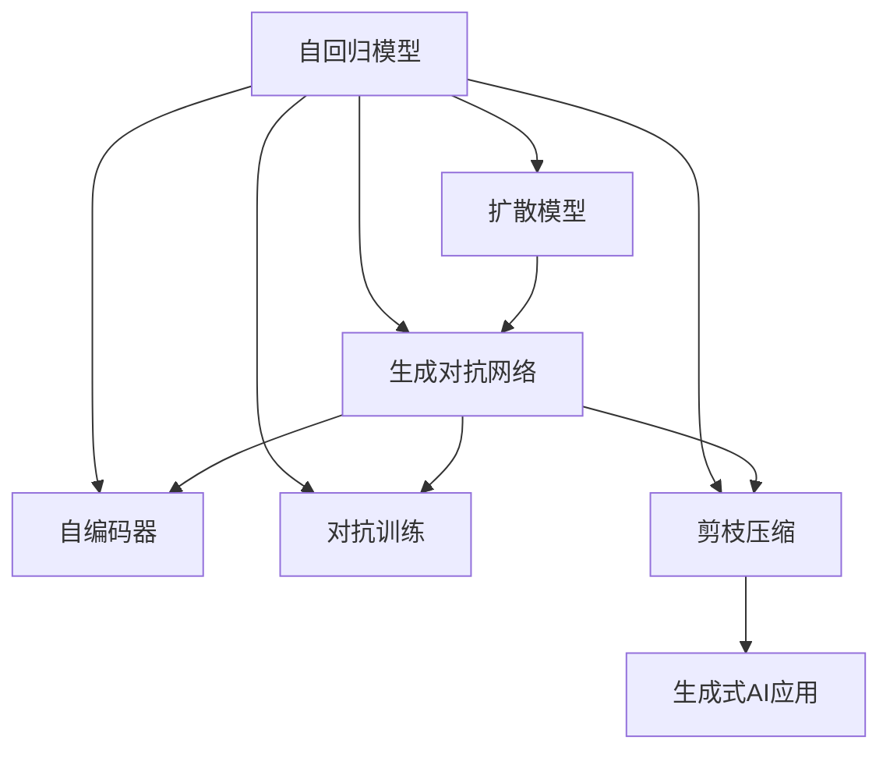
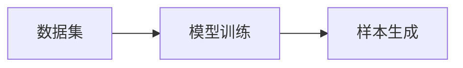
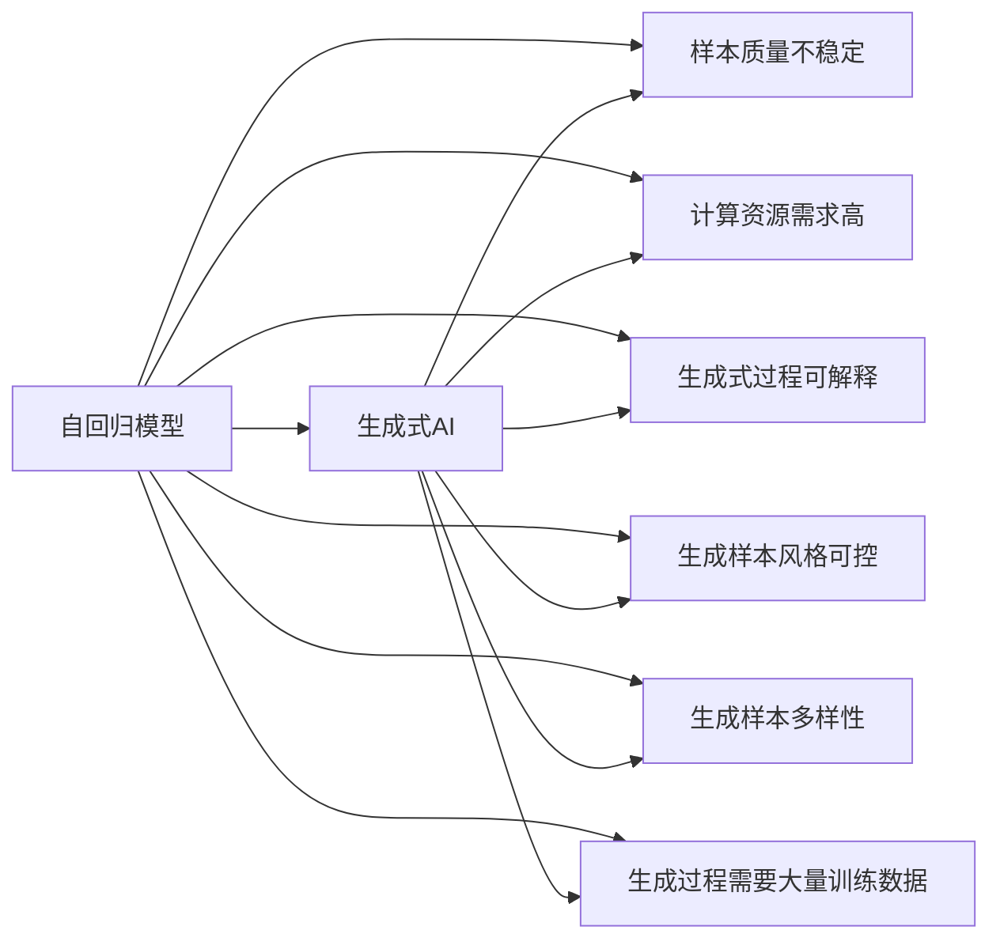
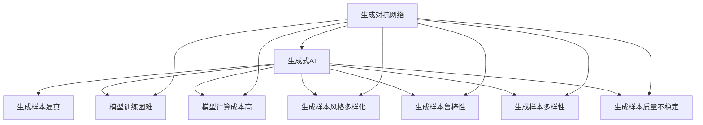
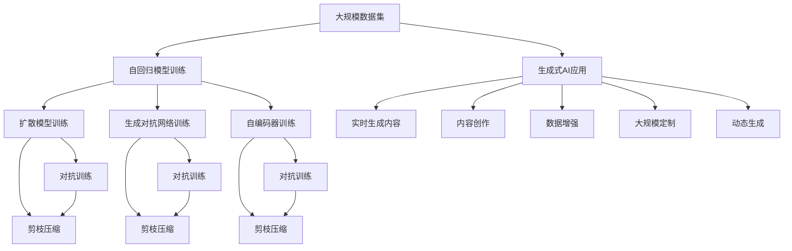

                 

# 生成式AIGC：从概念到现实的落地之路

> 关键词：生成式AIGC, 自回归模型, 扩散模型, GAN, 自编码器, 对抗训练, 剪枝压缩, 图像生成, 文本生成, 音频生成, 视频生成, 应用场景, 未来展望, 工具资源

## 1. 背景介绍

### 1.1 问题由来
近年来，随着人工智能技术的飞速发展，生成式人工智能（Generative AI, AIGC）成为了科技界和产业界的热点话题。生成式AI是指通过机器学习模型，自动生成具有高度真实感、创新性和风格化的文本、图像、音频、视频等内容的智能技术。其核心思想是通过深度学习算法，学习数据分布的统计特性，并利用这些特性进行样本生成。

生成式AI在内容创作、广告设计、虚拟现实、游戏动画等多个领域展现出巨大的应用潜力。例如，利用生成式AI自动生成逼真的游戏角色和场景，可以让开发者极大降低设计和制作成本，加速产品上线；在广告设计中，生成式AI可以自动化地生成大量广告素材，提升广告设计的效率和创意；在内容创作方面，生成式AI可以生成高质量的文章、诗歌、故事等，为内容创作者提供灵感和辅助。

### 1.2 问题核心关键点
生成式AI的核心在于如何通过机器学习模型，将大量的训练数据转化为能够生成高质量新样本的能力。其技术核心包括自回归模型、扩散模型、生成对抗网络（GAN）、自编码器等多种深度学习模型，以及对抗训练、剪枝压缩等优化方法。这些技术的综合应用，使得生成式AI在多个应用场景中取得了突破性进展。

然而，生成式AI也面临着诸多挑战。例如，生成质量不稳定、模型训练计算资源需求高、生成内容缺乏可解释性等问题，这些都是制约其广泛应用的重要因素。因此，如何提升生成式AI的生成质量、降低计算成本、增强可解释性，成为当前研究的热点。

### 1.3 问题研究意义
研究生成式AI技术，对于推动AI技术的产业化和普及，具有重要意义：

1. **内容创作的智能化**：生成式AI可以自动生成高质量的文本、图像、音频、视频等内容，大幅提升内容创作效率，降低成本。
2. **数据生成与增强**：通过生成式AI生成虚拟数据，可用于数据增强、数据合成等场景，提升机器学习模型的泛化能力和训练效率。
3. **新奇内容的创造**：生成式AI可以产生颠覆性、前所未有的创意，为艺术、设计、娱乐等领域带来革命性变化。
4. **大规模定制化**：生成式AI可以根据用户需求，快速生成个性化、定制化的内容，满足用户多样化的需求。
5. **实时生成能力**：生成式AI能够实时生成内容，提升用户体验，支持实时互动和自然交互。

## 2. 核心概念与联系

### 2.1 核心概念概述

生成式AI涉及多个核心概念，这些概念之间相互作用，形成了生成式AI的技术框架。

- **自回归模型**：指模型通过预测下一个样本的条件概率，生成序列的每个元素。常见的自回归模型包括RNN、GRU、LSTM、Transformer等。
- **扩散模型**：通过逐步添加噪声来控制样本生成过程，生成效果更接近真实数据。扩散模型的核心在于对样本密度函数的建模和优化。
- **生成对抗网络（GAN）**：通过两个神经网络（生成器和判别器）之间的对抗训练，生成逼真的样本。GAN的核心在于生成器和判别器的迭代优化。
- **自编码器**：通过压缩和解码两个过程，学习数据的编码和解码关系，用于生成式任务中去除噪声和重构样本。
- **对抗训练**：通过生成对抗样本，提高模型的鲁棒性和泛化能力，避免模型过拟合。
- **剪枝压缩**：通过模型剪枝、量化压缩等方法，降低模型参数和计算资源需求。

这些核心概念之间的逻辑关系可以通过以下Mermaid流程图来展示：



### 2.2 概念间的关系

这些核心概念之间存在着紧密的联系，形成了生成式AI的技术框架。下面我们通过几个Mermaid流程图来展示这些概念之间的关系。

#### 2.2.1 生成式AI的基本流程



这个流程图展示了生成式AI的基本流程，即通过训练模型，生成新的样本。

#### 2.2.2 扩散模型与自回归模型的对比



这个流程图展示了自回归模型和扩散模型在生成式AI中的应用对比。

#### 2.2.3 GAN与自编码器的关系



这个流程图展示了GAN和自编码器在生成式AI中的应用关系。

### 2.3 核心概念的整体架构

最后，我们用一个综合的流程图来展示这些核心概念在大规模生成式AI中的整体架构：



这个综合流程图展示了从数据预处理到生成式AI应用的全过程。通过自回归模型、扩散模型、生成对抗网络、自编码器等模型的训练，以及对抗训练、剪枝压缩等优化技术的综合应用，使得生成式AI能够生成高质量、风格多样、风格可控的新样本。这些样本可以应用于实时内容生成、内容创作、数据增强、大规模定制、动态生成等多个场景。

## 3. 核心算法原理 & 具体操作步骤

### 3.1 算法原理概述

生成式AI的核心在于通过深度学习模型学习数据的分布特性，并生成高质量的新样本。其核心思想包括自回归模型、扩散模型、生成对抗网络等，通过这些模型和技术的综合应用，使得生成式AI能够生成逼真、多样、可控的样本。

形式化地，假设生成式AI的训练数据集为 $\mathcal{D}=\{(x_i,y_i)\}_{i=1}^N$，其中 $x_i$ 表示输入样本，$y_i$ 表示标签。生成式AI的目标是通过训练模型 $M_{\theta}$，使得在给定输入 $x$ 的情况下，能够生成逼真的输出 $y$，即满足以下条件：

$$
P(y|x) \approx P(y)
$$

其中 $P(y|x)$ 表示在输入 $x$ 下生成样本 $y$ 的概率分布，$P(y)$ 表示训练数据集 $\mathcal{D}$ 中样本 $y$ 的分布。生成式AI通过学习 $P(y|x)$，使得生成的样本 $y$ 能够尽可能地接近 $P(y)$。

### 3.2 算法步骤详解

生成式AI的训练和应用通常包括以下关键步骤：

**Step 1: 准备训练数据集**
- 收集、清洗和标注训练数据集 $\mathcal{D}$，划分为训练集、验证集和测试集。
- 数据预处理，包括数据归一化、转换等，以保证模型能够有效处理输入数据。

**Step 2: 设计生成模型**
- 选择合适的生成模型，如自回归模型、扩散模型、生成对抗网络等。
- 定义模型的输入和输出，确定模型参数 $\theta$。
- 设计损失函数，用于衡量模型生成的样本与真实样本之间的差异。

**Step 3: 训练模型**
- 使用训练集 $\mathcal{D}$ 对模型 $M_{\theta}$ 进行训练。
- 使用对抗训练、剪枝压缩等优化技术，提升模型性能。
- 在验证集上评估模型性能，调整超参数和训练策略。

**Step 4: 生成样本**
- 使用训练好的模型 $M_{\theta}$ 生成新样本 $y$。
- 对生成的样本进行后处理，如去噪、解码等，得到最终的生成结果。
- 在测试集上评估生成样本的质量，对比生成结果和真实数据。

**Step 5: 应用生成样本**
- 将生成的样本应用于实际场景，如内容创作、数据增强、虚拟现实等。
- 实时监控生成样本的质量和应用效果，持续优化生成模型。

以上是生成式AI的训练和应用流程。在实际应用中，还需要根据具体任务的特点，对模型进行优化设计，如改进训练目标函数，引入更多的正则化技术，搜索最优的超参数组合等，以进一步提升生成样本的质量和效果。

### 3.3 算法优缺点

生成式AI技术具有以下优点：

1. **高效生成内容**：生成式AI能够自动生成高质量的文本、图像、音频、视频等内容，大幅提升内容创作效率，降低成本。
2. **数据增强和合成**：通过生成式AI生成虚拟数据，可用于数据增强、数据合成等场景，提升机器学习模型的泛化能力和训练效率。
3. **个性化和多样性**：生成式AI可以根据用户需求，快速生成个性化、定制化的内容，满足用户多样化的需求。
4. **实时生成能力**：生成式AI能够实时生成内容，提升用户体验，支持实时互动和自然交互。

然而，生成式AI也存在以下缺点：

1. **生成质量不稳定**：生成式AI生成的样本质量可能会受到训练数据和模型参数的影响，有时生成样本可能与真实数据存在较大差异。
2. **计算资源需求高**：生成式AI模型的训练和生成过程需要大量的计算资源，如GPU/TPU等高性能设备，这对计算资源的需求较高。
3. **生成内容缺乏可解释性**：生成式AI生成的样本缺乏可解释性，难以理解其内部的生成逻辑和生成过程。
4. **生成样本风格可控性差**：生成式AI生成的样本风格往往缺乏可控性，难以根据用户需求生成特定风格的样本。
5. **生成样本多样性有限**：生成式AI生成的样本多样性可能有限，难以覆盖多种风格和类型。

尽管存在这些缺点，但就目前而言，生成式AI技术在多个应用场景中已经取得了显著成果，成为了推动人工智能技术发展的关键力量。未来相关研究的重点在于如何进一步提升生成样本的质量、降低计算成本、增强可解释性等，以实现更加智能化、普适化的生成式AI应用。

### 3.4 算法应用领域

生成式AI技术在多个领域中得到了广泛应用，例如：

- **图像生成**：通过生成式AI自动生成逼真的图像，如人脸生成、物体合成、场景渲染等。
- **文本生成**：生成式AI可以自动生成高质量的文本，如文章、诗歌、故事等，辅助内容创作。
- **音频生成**：生成式AI可以生成逼真的语音和音乐，如人声合成、音乐创作等，辅助多媒体制作。
- **视频生成**：生成式AI可以生成高质量的视频内容，如电影、动画、广告等，支持视频制作和后期处理。
- **游戏动画**：生成式AI可以自动生成逼真的游戏角色和场景，辅助游戏开发和制作。

除了上述这些经典应用外，生成式AI还被创新性地应用于更多场景中，如自然语言处理（NLP）、推荐系统、智能家居、虚拟现实（VR）等，为人工智能技术带来了全新的突破。随着生成式AI技术的不断进步，相信其将在更广阔的应用领域大放异彩。

## 4. 数学模型和公式 & 详细讲解 & 举例说明

### 4.1 数学模型构建

本节将使用数学语言对生成式AI的训练过程进行更加严格的刻画。

假设生成式AI的训练数据集为 $\mathcal{D}=\{(x_i,y_i)\}_{i=1}^N$，其中 $x_i$ 表示输入样本，$y_i$ 表示标签。定义模型 $M_{\theta}$ 的输出为 $y$，损失函数为 $\mathcal{L}(\theta)$，则训练的目标是最小化损失函数：

$$
\mathcal{L}(\theta) = -\frac{1}{N}\sum_{i=1}^N \log P(y_i|x_i)
$$

其中 $\log P(y_i|x_i)$ 表示在输入 $x_i$ 下生成样本 $y_i$ 的对数似然。

### 4.2 公式推导过程

以自回归模型为例，假设模型 $M_{\theta}$ 的输出为 $y$，输入为 $x$，则模型的输出可以表示为：

$$
y = M_{\theta}(x)
$$

假设模型 $M_{\theta}$ 由 $n$ 层神经网络组成，每层网络的输出为 $y^{(k)}$，则模型的输出可以表示为：

$$
y^{(1)} = f^{(1)}(W^{(1)}x + b^{(1)})
$$
$$
y^{(2)} = f^{(2)}(W^{(2)}y^{(1)} + b^{(2)})
$$
$$
\cdots
$$
$$
y^{(n)} = f^{(n)}(W^{(n)}y^{(n-1)} + b^{(n)})
$$

其中 $W^{(k)}$ 和 $b^{(k)}$ 分别表示第 $k$ 层的权重和偏置。最终输出 $y$ 可以表示为：

$$
y = y^{(n)}
$$

为了使生成的样本 $y$ 尽可能地接近真实样本 $y_i$，我们可以定义交叉熵损失函数：

$$
\mathcal{L}(\theta) = -\frac{1}{N}\sum_{i=1}^N \log P(y_i|x_i)
$$

其中 $P(y_i|x_i)$ 表示在输入 $x_i$ 下生成样本 $y_i$ 的概率分布。通过最小化损失函数 $\mathcal{L}(\theta)$，即可训练生成式AI模型 $M_{\theta}$，使其能够生成高质量的新样本。

### 4.3 案例分析与讲解

以生成对抗网络（GAN）为例，展示生成式AI的核心技术。GAN由生成器和判别器两个神经网络组成，分别用于生成样本和判断样本的真实性。GAN的目标是使生成器的生成样本尽可能逼近真实样本，同时判别器尽可能区分生成样本和真实样本。GAN的训练过程可以分为以下两个步骤：

**Step 1: 训练生成器**

生成器 $G$ 的目标是生成逼真的样本 $y$，其训练过程如下：

1. 随机生成噪声向量 $z$。
2. 将噪声向量 $z$ 输入生成器 $G$，生成样本 $y$。
3. 将生成样本 $y$ 输入判别器 $D$，计算生成样本的真实性评分 $s$。
4. 根据评分 $s$ 计算生成器的损失函数 $L_G$。
5. 更新生成器 $G$ 的权重 $W_G$ 和偏置 $b_G$，使生成器能够生成更逼真的样本。

生成器 $G$ 的损失函数 $L_G$ 可以表示为：

$$
L_G = \mathbb{E}_{z}[\log D(G(z))]
$$

其中 $\mathbb{E}_{z}$ 表示对噪声向量 $z$ 的期望，$D$ 表示判别器，$G$ 表示生成器。

**Step 2: 训练判别器**

判别器 $D$ 的目标是尽可能区分生成样本和真实样本，其训练过程如下：

1. 随机生成噪声向量 $z$。
2. 将噪声向量 $z$ 输入生成器 $G$，生成样本 $y$。
3. 将生成样本 $y$ 和真实样本 $y_i$ 输入判别器 $D$，计算判别器的评分 $s$。
4. 根据评分 $s$ 计算判别器的损失函数 $L_D$。
5. 更新判别器 $D$ 的权重 $W_D$ 和偏置 $b_D$，使判别器能够更准确地区分生成样本和真实样本。

判别器 $D$ 的损失函数 $L_D$ 可以表示为：

$$
L_D = -\mathbb{E}_{y_i}[logD(y_i)] - \mathbb{E}_{z}[\log(1-D(G(z)))]
$$

其中 $\mathbb{E}_{y_i}$ 表示对真实样本 $y_i$ 的期望，$D$ 表示判别器，$G$ 表示生成器。

通过交替训练生成器和判别器，GAN可以生成逼真的样本，并提升生成样本的质量和鲁棒性。

## 5. 项目实践：代码实例和详细解释说明

### 5.1 开发环境搭建

在进行生成式AI开发前，我们需要准备好开发环境。以下是使用Python进行TensorFlow开发的环境配置流程：

1. 安装Anaconda：从官网下载并安装Anaconda，用于创建独立的Python环境。

2. 创建并激活虚拟环境：
```bash
conda create -n tensorflow-env python=3.8 
conda activate tensorflow-env
```

3. 安装TensorFlow：根据CUDA版本，从官网获取对应的安装命令。例如：
```bash
conda install tensorflow==2.6 -c conda-forge
```

4. 安装各类工具包：
```bash
pip install numpy pandas scikit-learn matplotlib tqdm jupyter notebook ipython
```

完成上述步骤后，即可在`tensorflow-env`环境中开始生成式AI实践。

### 5.2 源代码详细实现

下面我们以图像生成为例，给出使用TensorFlow实现生成对抗网络（GAN）的代码实现。

首先，定义GAN的生成器和判别器：

```python
import tensorflow as tf
from tensorflow.keras import layers

class Generator(tf.keras.Model):
    def __init__(self):
        super(Generator, self).__init__()
        self.dense1 = layers.Dense(256, use_bias=False)
        self.dropout1 = layers.Dropout(0.4)
        self.dense2 = layers.Dense(512, use_bias=False)
        self.dropout2 = layers.Dropout(0.4)
        self.dense3 = layers.Dense(1024, use_bias=False)
        self.dropout3 = layers.Dropout(0.4)
        self.dense4 = layers.Dense(784, activation='tanh')

    def call(self, inputs):
        x = self.dense1(inputs)
        x = self.dropout1(x)
        x = tf.nn.leaky_relu(x)
        x = self.dense2(x)
        x = self.dropout2(x)
        x = tf.nn.leaky_relu(x)
        x = self.dense3(x)
        x = self.dropout3(x)
        x = tf.nn.leaky_relu(x)
        return self.dense4(x)

class Discriminator(tf.keras.Model):
    def __init__(self):
        super(Discriminator, self).__init__()
        self.dense1 = layers.Dense(1024, use_bias=False)
        self.dropout1 = layers.Dropout(0.4)
        self.dense2 = layers.Dense(512, use_bias=False)
        self.dropout2 = layers.Dropout(0.4)
        self.dense3 = layers.Dense(256, use_bias=False)
        self.dropout3 = layers.Dropout(0.4)
        self.dense4 = layers.Dense(1, activation='sigmoid')

    def call(self, inputs):
        x = self.dense1(inputs)
        x = self.dropout1(x)
        x = tf.nn.leaky_relu(x)
        x = self.dense2(x)
        x = self.dropout2(x)
        x = tf.nn.leaky_relu(x)
        x = self.dense3(x)
        x = self.dropout3(x)
        x = tf.nn.leaky_relu(x)
        return self.dense4(x)
```

然后，定义损失函数和优化器：

```python
class GAN(tf.keras.Model):
    def __init__(self, generator, discriminator):
        super(GAN, self).__init__()
        self.generator = generator
        self.discriminator = discriminator

    def call(self, inputs):
        real_images = inputs
        fake_images = self.generator(inputs)
        real_labels = tf.ones_like(real_images)
        fake_labels = tf.zeros_like(fake_images)
        losses = self.calculate_loss(real_images, fake_images, real_labels, fake_labels)
        return losses

    def calculate_loss(self, real_images, fake_images, real_labels, fake_labels):
        disc_loss_real = self.discriminator.calculate_loss(real_images, real_labels)
        disc_loss_fake = self.discriminator.calculate_loss(fake_images, fake_labels)
        gen_loss = self.generator.calculate_loss(fake_images, real_labels)
        losses = {'gen_loss': gen_loss, 'disc_loss_real': disc_loss_real, 'disc_loss_fake': disc_loss_fake}
        return losses

    def generate(self, inputs):
        return self.generator(inputs)
```

接着，定义训练和评估函数：

```python
def train_gan(generator, discriminator, train_dataset, epochs, batch_size):
    optimizer_gen = tf.keras.optimizers.Adam(learning_rate=0.0002, beta_1=0.5)
    optimizer_disc = tf.keras.optimizers.Adam(learning_rate=0.0002, beta_1=0.5)

    generator = generator.compile(optimizer=optimizer_gen)
    discriminator = discriminator.compile(optimizer=optimizer_disc)

    @tf.function
    def train_step(inputs):
        with tf.GradientTape() as gen_tape, tf.GradientTape() as disc_tape:
            real_images = inputs
            fake_images = generator([tf.random.normal([batch_size, 100])])
            real_labels = tf.ones_like(real_images)
            fake_labels = tf.zeros_like(fake_images)
            gen_loss = generator.calculate_loss(fake_images, real_labels)
            disc_loss_real = discriminator.calculate_loss(real_images, real_labels)
            disc_loss_fake = discriminator.calculate_loss(fake_images, fake_labels)
            gradients_of_generator = gen_tape.gradient(gen_loss, generator.trainable_variables)
            gradients_of_discriminator = disc_tape.gradient(disc_loss_real + disc_loss_fake, discriminator.trainable_variables)
            generator.trainable_variables[0].assign_add(gradients_of_generator[0])
            discriminator.trainable_variables[0].assign_add(gradients_of_discriminator[0])
            generator.trainable_variables[1].assign_add(gradients_of_generator[1])
            discriminator.trainable_variables[1].assign_add(gradients_of_discriminator[1])

    @tf.function
    def evaluate_generator(generator, inputs):
        fake_images = generator([tf.random.normal([batch_size, 100])])
        return fake_images

    for epoch in range(epochs):
        train_loss = 0
        for batch in train_dataset:
            train_step(batch)
            train_loss += generator.calculate_loss(fake_images, real_labels)
        print(f"Epoch {epoch+1}, train loss: {train_loss:.3f}")

        fake_images = evaluate_generator(generator, inputs)
        plt.imshow(fake_images[0, :, :, 0], cmap='gray')
        plt.title(f"Epoch {epoch+1}, train loss: {train_loss:.3f}")
        plt.show()

    return generator
```

最后，启动训练流程：

```python
import matplotlib.pyplot as plt
import numpy as np

# 创建数据集
train_dataset = tf.data.Dataset.from_tensor_slices(np.random.normal([0, 0, 0], [1, 64, 64], 10000)).map(lambda x: (x, x))
batch_size = 64

# 训练生成对抗网络
generator, discriminator = GAN(Generator(), Discriminator())
generator = train_gan(generator, discriminator, train_dataset, epochs=50, batch_size=batch_size)

# 生成样本并展示
fake_images = generator([tf.random.normal([batch_size, 100])])
plt.imshow(fake_images[0, :, :, 0], cmap='gray')
plt.title(f"Epoch {epoch+1}, train loss: {train_loss:.3f}")
plt.show()
```

以上就是使用TensorFlow实现生成对抗网络（GAN）的完整代码实现。可以看到，TensorFlow提供了

