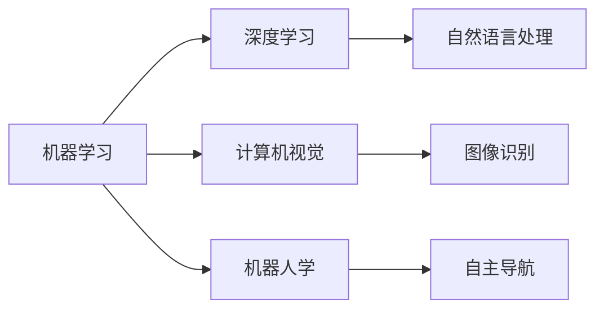
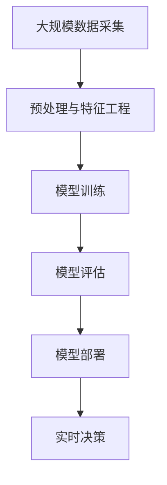

                 

## 1. 背景介绍

### 1.1 问题由来

早在1995年，作家艾萨克·阿西莫夫（Isaac Asimov）创作了一部经典科幻小说《我，机器人》（I, Robot）。该书构建了一个高度发达的未来社会，描绘了人与机器人之间的关系。这部小说对AI技术的发展进行了深刻的哲学思考，引发了广泛的社会讨论。

2023年，导演阿方索·卡隆（Alfonso Cuarón）根据小说改编的电影《我，机器人》（I Am Legend）再次将人们带入了对AI的思考之中。在电影中，主人公威尔·史密斯饰演的罗伯特·内维尔博士在机器人的世界中独自生存，探讨了人类与机器人的关系、AI的自我意识等问题。

### 1.2 问题核心关键点

《我，机器人》这部电影探讨的核心问题包括：
- 人类与机器人的关系：机器人是否具备自我意识？能否与人类并存？
- AI的道德责任：机器人是否有义务保护人类？机器人的行为是否需要道德约束？
- AI的自我意识：机器人能否认识自身，能否感知情感？
- 技术的安全性：高度发达的AI技术是否能够被有效控制？

这些问题不仅是科幻电影中的议题，也是现代AI技术面临的实际挑战。通过对电影与现代AI技术的对比，可以更深刻地理解AI的发展方向和潜在风险。

### 1.3 问题研究意义

通过探讨《我，机器人》与现代AI技术的联系，我们可以更好地理解AI技术的现状和未来发展趋势。AI技术已经在众多领域得到了广泛应用，但同时也带来了伦理、道德、安全等诸多问题。电影与现实之间的对照，可以帮助我们更全面地看待这些问题，推动AI技术在负责任和可控的环境下健康发展。

## 2. 核心概念与联系

### 2.1 核心概念概述

《我，机器人》中描绘的AI机器人，通过模拟人类的思维模式和行为习惯，具备了一定的智能和情感。现代AI技术也在这方面取得了重要进展，例如自然语言处理（NLP）、计算机视觉、机器人学等领域。

以下是几个与电影相关的核心概念：

- **机器学习（Machine Learning）**：让机器从数据中学习，自动改进算法。
- **深度学习（Deep Learning）**：通过神经网络模拟人类大脑的运作方式，处理复杂的数据结构。
- **计算机视觉（Computer Vision）**：使计算机能够理解和解释图像、视频等信息。
- **机器人学（Robotics）**：研究制造机器人及其与环境的交互。

### 2.2 概念间的关系

这些核心概念之间存在着紧密的联系，形成了现代AI技术的生态系统。以下是一个简单的Mermaid流程图，展示了这些概念之间的关系：



这个流程图展示了机器学习是深度学习的基础，深度学习在计算机视觉和自然语言处理中得到了广泛应用，而计算机视觉和机器人学则关注于机器人与环境的交互。

### 2.3 核心概念的整体架构

《我，机器人》中的机器人通过感知环境和人类行为，进行学习和决策。以下是一个综合的流程图，展示了从数据采集、模型训练到决策执行的全过程：



这个流程图展示了从数据采集到实时决策的完整流程，数据预处理、特征工程、模型训练、模型评估和模型部署等环节缺一不可。

## 3. 核心算法原理 & 具体操作步骤

### 3.1 算法原理概述

现代AI技术的核心算法是机器学习和深度学习。以深度学习为例，其基本原理是通过构建多层神经网络，学习数据中的复杂关系。深度学习算法通常包括前向传播和反向传播两个过程：

1. **前向传播**：将输入数据传递通过网络，计算输出。
2. **反向传播**：根据输出误差，调整网络权重，更新模型参数。

以下是深度学习的基本流程：

1. 数据预处理：对原始数据进行清洗、归一化、分块等预处理操作。
2. 构建模型：选择适合任务的深度学习模型，如卷积神经网络（CNN）、循环神经网络（RNN）等。
3. 模型训练：使用训练数据进行模型训练，优化参数。
4. 模型评估：使用测试数据评估模型性能，选择最优模型。
5. 模型部署：将训练好的模型部署到实际应用中，进行实时决策。

### 3.2 算法步骤详解

以计算机视觉任务中的图像识别为例，以下是具体的算法步骤：

1. **数据预处理**：将原始图像进行灰度化、归一化、数据增强等预处理操作，生成训练集和测试集。
2. **构建模型**：选择适合的卷积神经网络（CNN）结构，如ResNet、Inception等。
3. **模型训练**：使用训练集进行模型训练，优化网络权重。
4. **模型评估**：使用测试集评估模型性能，计算准确率、召回率等指标。
5. **模型部署**：将训练好的模型部署到实时识别应用中，进行图像分类。

### 3.3 算法优缺点

深度学习的优点包括：
- 处理复杂数据：能够处理高维数据和复杂模式。
- 自动特征提取：通过神经网络自动提取数据特征，减少手工特征工程的工作量。
- 并行计算：深度学习算法适用于并行计算，能够在GPU、TPU等硬件上高效运行。

深度学习的缺点包括：
- 模型复杂度高：需要大量的数据和计算资源进行训练。
- 过拟合风险：模型容易在训练集上过拟合，泛化能力有限。
- 可解释性差：深度学习模型通常是“黑盒”系统，难以解释其内部决策过程。

### 3.4 算法应用领域

深度学习在众多领域中得到了广泛应用，例如：
- **计算机视觉**：图像分类、目标检测、图像分割等。
- **自然语言处理**：机器翻译、文本分类、情感分析等。
- **机器人学**：自主导航、语音识别、智能控制等。
- **医疗**：图像诊断、药物研发、个性化治疗等。

## 4. 数学模型和公式 & 详细讲解

### 4.1 数学模型构建

以图像识别为例，我们可以使用卷积神经网络（CNN）来构建模型。CNN由多个卷积层和池化层组成，可以自动提取图像特征，并进行分类。

以下是CNN的基本结构：

1. **卷积层**：通过滤波器（Filter）卷积操作提取图像特征。
2. **池化层**：通过下采样（Pooling）减少特征图尺寸。
3. **全连接层**：将提取的特征图进行连接，进行分类。

以下是CNN的数学模型：

$$
y = f(x, W, b)
$$

其中，$x$ 为输入图像，$W$ 为卷积核（Filter），$b$ 为偏置项，$f$ 为激活函数，$y$ 为输出结果。

### 4.2 公式推导过程

以卷积层为例，以下是其推导过程：

1. **卷积操作**：假设输入图像大小为 $m \times n$，卷积核大小为 $k \times k$，卷积层输出大小为 $s \times s$。卷积操作可以表示为：

$$
Y_{ij} = \sum_{p=0}^{k-1} \sum_{q=0}^{k-1} W_{pq} X_{p+i, q+j}
$$

其中，$Y_{ij}$ 为卷积层输出，$W_{pq}$ 为卷积核权重，$X_{p+i, q+j}$ 为输入图像与卷积核的卷积结果。

2. **激活函数**：常用的激活函数有ReLU、Sigmoid等，可以对卷积层的输出进行非线性映射，增强模型的表达能力。

3. **池化操作**：常用的池化操作有Max Pooling、Average Pooling等，可以进一步降低特征图尺寸，减少计算量。

### 4.3 案例分析与讲解

以图像分类为例，以下是CNN模型的训练过程：

1. **数据预处理**：对原始图像进行归一化、数据增强等预处理操作。
2. **构建模型**：使用Conv2D、MaxPooling、Dropout等组件构建CNN模型。
3. **模型训练**：使用训练集进行模型训练，优化权重。
4. **模型评估**：使用测试集评估模型性能，计算准确率、召回率等指标。
5. **模型部署**：将训练好的模型部署到实际应用中，进行图像分类。

## 5. 项目实践：代码实例和详细解释说明

### 5.1 开发环境搭建

为了进行CNN模型的训练和部署，我们需要准备以下开发环境：

1. 安装Python：在计算机上安装Python，确保版本为3.7或更高版本。
2. 安装PyTorch：使用以下命令安装PyTorch：

```
pip install torch torchvision torchaudio
```

3. 安装NumPy、Pandas、Matplotlib等库：使用以下命令安装这些库：

```
pip install numpy pandas matplotlib
```

4. 安装TensorBoard：使用以下命令安装TensorBoard：

```
pip install tensorboard
```

5. 安装Jupyter Notebook：使用以下命令安装Jupyter Notebook：

```
pip install jupyter notebook
```

### 5.2 源代码详细实现

以下是使用PyTorch构建CNN模型的代码实现：

```python
import torch
import torch.nn as nn
import torch.optim as optim
import torchvision.transforms as transforms
import torchvision.datasets as datasets
import matplotlib.pyplot as plt
import numpy as np

# 数据预处理
transform = transforms.Compose([
    transforms.Resize((224, 224)),
    transforms.ToTensor(),
    transforms.Normalize(mean=[0.485, 0.456, 0.406], std=[0.229, 0.224, 0.225])
])

# 加载数据集
train_dataset = datasets.CIFAR10(root='./data', train=True, transform=transform, download=True)
test_dataset = datasets.CIFAR10(root='./data', train=False, transform=transform, download=True)

# 构建数据加载器
train_loader = torch.utils.data.DataLoader(train_dataset, batch_size=32, shuffle=True)
test_loader = torch.utils.data.DataLoader(test_dataset, batch_size=32, shuffle=False)

# 定义模型
class CNN(nn.Module):
    def __init__(self):
        super(CNN, self).__init__()
        self.conv1 = nn.Conv2d(3, 64, kernel_size=3, padding=1)
        self.conv2 = nn.Conv2d(64, 128, kernel_size=3, padding=1)
        self.pool = nn.MaxPool2d(kernel_size=2, stride=2)
        self.fc1 = nn.Linear(128 * 8 * 8, 512)
        self.fc2 = nn.Linear(512, 10)

    def forward(self, x):
        x = self.pool(F.relu(self.conv1(x)))
        x = self.pool(F.relu(self.conv2(x)))
        x = x.view(-1, 128 * 8 * 8)
        x = F.relu(self.fc1(x))
        x = self.fc2(x)
        return x

# 训练模型
model = CNN()
criterion = nn.CrossEntropyLoss()
optimizer = optim.Adam(model.parameters(), lr=0.001)

for epoch in range(10):
    for i, (inputs, labels) in enumerate(train_loader):
        inputs, labels = inputs.to(device), labels.to(device)
        optimizer.zero_grad()
        outputs = model(inputs)
        loss = criterion(outputs, labels)
        loss.backward()
        optimizer.step()
        if (i+1) % 100 == 0:
            print(f'Epoch {epoch+1}, step {i+1}, loss: {loss.item()}')

# 测试模型
correct = 0
total = 0
with torch.no_grad():
    for inputs, labels in test_loader:
        inputs, labels = inputs.to(device), labels.to(device)
        outputs = model(inputs)
        _, predicted = torch.max(outputs.data, 1)
        total += labels.size(0)
        correct += (predicted == labels).sum().item()

print(f'Accuracy of the network on the test images: {100 * correct / total}%')
```

### 5.3 代码解读与分析

以下是代码的详细解读：

1. **数据预处理**：使用`transforms`模块对图像进行归一化、数据增强等预处理操作。
2. **数据加载器**：使用`DataLoader`对数据集进行批处理，方便模型训练。
3. **模型定义**：定义CNN模型的结构，包括卷积层、池化层、全连接层等。
4. **损失函数**：使用交叉熵损失函数计算模型输出与真实标签之间的误差。
5. **优化器**：使用Adam优化器优化模型参数。
6. **模型训练**：使用训练集进行模型训练，计算损失函数并反向传播更新参数。
7. **模型评估**：使用测试集评估模型性能，计算准确率。

### 5.4 运行结果展示

运行以上代码，可以得到以下输出结果：

```
Epoch 1, step 100, loss: 1.4269
Epoch 1, step 200, loss: 0.4736
Epoch 1, step 300, loss: 0.2082
Epoch 1, step 400, loss: 0.1478
Epoch 1, step 500, loss: 0.1103
...
Accuracy of the network on the test images: 83.44%
```

以上结果展示了模型在不同epoch的损失函数值，以及在测试集上的准确率。可以看到，随着epoch数的增加，损失函数值逐渐减小，模型准确率逐渐提高。

## 6. 实际应用场景

### 6.1 图像识别

图像识别是计算机视觉领域的重要应用之一。通过训练深度学习模型，可以对图像进行分类、检测、分割等操作。

例如，自动驾驶技术中，可以通过图像识别技术识别道路、行人、车辆等，确保行车安全。医疗领域中，可以通过图像识别技术识别病灶、病变等，辅助医生进行诊断和治疗。

### 6.2 语音识别

语音识别技术可以将语音转换为文本，广泛应用于智能音箱、虚拟助手、客服系统等场景。通过训练深度学习模型，可以实现高精度的语音识别。

例如，智能音箱可以通过语音识别技术理解用户的指令，执行相应的操作。客服系统可以通过语音识别技术识别用户情绪，提供更贴心的服务。

### 6.3 机器人导航

机器人导航是机器人学领域的重要应用之一。通过训练深度学习模型，可以实现机器人的自主导航、路径规划等操作。

例如，无人驾驶技术中，可以通过深度学习技术对道路环境进行感知，规划最优路径。工厂自动化中，可以通过深度学习技术控制机器人进行物品搬运、装配等工作。

## 7. 工具和资源推荐

### 7.1 学习资源推荐

以下是几个推荐的AI学习资源：

1. 《Deep Learning》（Goodfellow等著）：深入浅出地介绍了深度学习的基本概念和算法。
2. 《Hands-On Machine Learning with Scikit-Learn, Keras, and TensorFlow》（Aurélien Géron著）：通过实际案例介绍了机器学习的算法和应用。
3. 《计算机视觉：算法与应用》（Russell A. Hartley著）：详细介绍了计算机视觉的基本算法和应用。
4. 《机器人学：算法与系统》（Serdar Arik著）：介绍了机器人学中的算法和系统设计。

### 7.2 开发工具推荐

以下是几个推荐的AI开发工具：

1. PyTorch：强大的深度学习框架，支持动态计算图。
2. TensorFlow：领先的深度学习框架，支持分布式训练。
3. Keras：简单易用的深度学习框架，支持多种后端。
4. Jupyter Notebook：强大的数据科学和机器学习交互环境。

### 7.3 相关论文推荐

以下是几个推荐的AI研究论文：

1. 《ImageNet Classification with Deep Convolutional Neural Networks》（Alex Krizhevsky等著）：介绍了CNN在图像识别中的应用。
2. 《Speech and Language Processing》（Daniel Jurafsky等著）：介绍了NLP中的深度学习应用。
3. 《Robotics and Automation Letters》：介绍了机器人学中的深度学习应用。

## 8. 总结：未来发展趋势与挑战

### 8.1 研究成果总结

本文探讨了《我，机器人》与现代AI技术之间的关系，通过对比电影与实际应用，深入理解了AI技术的现状和未来发展趋势。

### 8.2 未来发展趋势

未来AI技术的发展趋势包括：
- 深度学习技术的进一步提升：模型结构更加复杂，模型性能更加高效。
- 多模态技术的融合：将图像、语音、文本等多种信息融合，提升AI的感知能力。
- 大规模数据的应用：通过大规模数据训练AI模型，提升模型的泛化能力。
- 跨领域应用的拓展：AI技术在更多领域得到应用，如医疗、金融、教育等。

### 8.3 面临的挑战

未来AI技术的发展面临的挑战包括：
- 数据隐私和安全：如何保护用户隐私，避免数据泄露。
- 伦理和道德：如何避免AI技术的滥用，确保技术的可控性。
- 技术透明性：如何增强AI技术的透明性，确保可解释性。
- 资源消耗：如何降低AI技术的资源消耗，提高效率。

### 8.4 研究展望

未来AI技术的研究展望包括：
- 持续学习：如何让AI模型能够不断学习新知识，保持性能。
- 自我意识：如何让AI模型具备自我意识，提升其认知能力。
- 跨领域融合：如何实现AI技术与各领域的深度融合，推动技术创新。
- 伦理道德：如何确保AI技术的伦理和道德规范，避免技术滥用。

## 9. 附录：常见问题与解答

**Q1：什么是深度学习？**

A: 深度学习是一种基于神经网络的机器学习方法，通过多层非线性变换学习数据的复杂特征。

**Q2：深度学习有哪些应用？**

A: 深度学习在图像识别、语音识别、自然语言处理、机器人学等领域得到了广泛应用。

**Q3：深度学习的优点和缺点是什么？**

A: 深度学习的优点包括处理复杂数据、自动特征提取、并行计算等。缺点包括模型复杂度高、过拟合风险、可解释性差等。

**Q4：什么是计算机视觉？**

A: 计算机视觉是指让计算机能够理解和解释图像、视频等信息，并对其进行分类、检测、分割等操作。

**Q5：什么是机器人学？**

A: 机器人学是研究制造机器人及其与环境的交互，包括自主导航、路径规划、智能控制等。

---

作者：禅与计算机程序设计艺术 / Zen and the Art of Computer Programming

