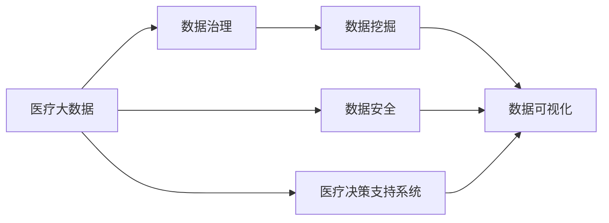
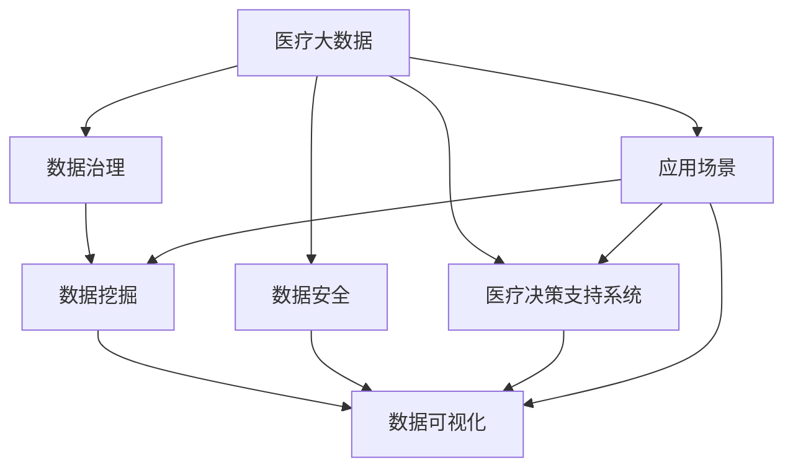
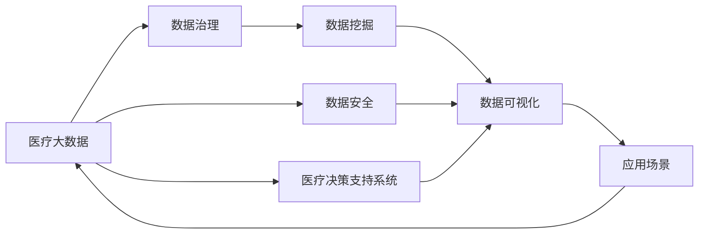

                 

# 省医疗大数据可视化分析与应用

> 关键词：
- 医疗大数据
- 可视化分析
- 数据挖掘
- 数据可视化
- 数据治理
- 数据安全
- 数据应用

## 1. 背景介绍

随着科技的飞速发展，医疗大数据作为医学与信息技术的交叉领域，已经成为驱动医学研究和实践的重要力量。然而，海量的医疗数据不仅对医疗资源的利用提出了挑战，也对数据分析、处理和应用提出了更高的要求。本文旨在探讨医疗大数据的可视化分析与应用，探讨如何通过可视化手段，将医疗数据转化为直观、易理解的视图，为医疗决策提供科学依据。

### 1.1 问题由来

医疗大数据的爆炸式增长，带来了对数据处理和分析技术的需求不断提升。传统的纸质病历和手工录入方式，已经难以满足现代医疗需求。如今，电子健康记录、医学影像、基因数据、电子病历等数据源层出不穷，如何高效地收集、存储、管理和分析这些数据，成为医疗行业面临的重要课题。

医疗数据通常具有复杂性、多样性、异构性等特点，涉及病患隐私和敏感信息，对数据安全和隐私保护提出更高要求。而医疗决策的复杂性和不确定性，又使得数据分析结果的可视化尤为重要，有助于医患双方理解数据、辅助决策。

### 1.2 问题核心关键点

医疗大数据可视化分析的核心关键点在于：
- 数据治理与数据安全：确保数据质量和安全，为可视化分析奠定基础。
- 数据挖掘与特征提取：从海量医疗数据中提取有价值的特征信息。
- 可视化技术：采用图形、图表等形式，将数据特征直观呈现。
- 数据分析与机器学习：利用统计分析和机器学习算法，辅助模型训练。
- 应用场景：针对具体医疗需求，设计并实现可视化的分析与应用。

## 2. 核心概念与联系

### 2.1 核心概念概述

为更好地理解医疗大数据的可视化分析与应用，本节将介绍几个密切相关的核心概念：

- 医疗大数据：指由医疗机构、科研机构、第三方数据平台等产生的与医疗健康相关的数据集。涵盖电子健康记录、基因数据、医学影像、电子病历、医疗事件记录等多种类型。
- 数据挖掘：从大数据中提取有用信息的过程，包括数据清洗、特征提取、模式发现、知识挖掘等步骤。
- 数据治理：管理和优化数据生命周期的全过程，包括数据收集、存储、处理、共享等环节。
- 数据可视化：使用图形、图表等可视化工具，将数据信息直观呈现，便于理解和分析。
- 数据安全：确保数据存储和传输的安全性，保护个人隐私和敏感信息。
- 医疗决策支持系统：利用数据分析和可视化技术，辅助医疗决策，提高医疗效率和质量。

这些概念之间的关系可以用以下Mermaid流程图来展示：



这个流程图展示了大数据处理与分析的流程：

1. 医疗大数据首先通过数据治理，确保数据的质量和安全。
2. 数据挖掘技术从大数据中提取有用的特征信息。
3. 数据可视化技术将特征信息直观呈现，便于理解。
4. 医疗决策支持系统利用分析结果，辅助医疗决策。

### 2.2 概念间的关系

这些核心概念之间存在着紧密的联系，形成了医疗大数据分析与应用的完整生态系统。下面是这些概念之间的联系，通过Mermaid流程图来展示：



这个综合流程图展示了大数据处理与应用的全过程：

1. 医疗大数据首先通过数据治理，确保数据的质量和安全。
2. 数据挖掘技术从大数据中提取有用的特征信息。
3. 数据可视化技术将特征信息直观呈现，便于理解。
4. 医疗决策支持系统利用分析结果，辅助医疗决策。
5. 应用场景驱动数据治理、数据挖掘、数据可视化与决策支持系统的协同发展。

### 2.3 核心概念的整体架构

最后，我们用一个综合的流程图来展示这些核心概念在大数据处理与应用中的整体架构：



这个综合流程图展示了医疗大数据分析与应用的整体流程，即：

1. 医疗大数据首先通过数据治理，确保数据的质量和安全。
2. 数据挖掘技术从大数据中提取有用的特征信息。
3. 数据可视化技术将特征信息直观呈现，便于理解。
4. 医疗决策支持系统利用分析结果，辅助医疗决策。
5. 应用场景驱动数据治理、数据挖掘、数据可视化与决策支持系统的协同发展。

## 3. 核心算法原理 & 具体操作步骤
### 3.1 算法原理概述

医疗大数据可视化分析的算法原理主要涉及数据挖掘、数据可视化以及机器学习等方面。通过数据治理和数据挖掘技术，从海量医疗数据中提取有用信息；采用数据可视化技术，将数据信息直观呈现；利用机器学习算法，对数据进行预测与分析。

以一个典型的医疗决策支持系统为例，其基本流程如下：

1. 数据治理：确保数据的质量、完整性和安全性。
2. 数据挖掘：从医疗数据中提取有用的特征。
3. 数据可视化：将特征信息直观呈现。
4. 机器学习：利用学习算法预测结果，辅助决策。

### 3.2 算法步骤详解

医疗大数据可视化分析的具体步骤包括：

1. 数据收集与清洗：从各类医疗数据源（如电子健康记录、医学影像、基因数据等）中收集数据，并进行清洗处理，去除冗余、噪声和异常数据。

2. 数据治理与预处理：通过标准化、去重、填补缺失值等方法，确保数据质量。同时，采用加密、脱敏等技术，确保数据安全。

3. 特征提取与选择：使用统计、聚类、降维等技术，从原始数据中提取关键特征。例如，利用主成分分析(PCA)将高维数据降维，以便于可视化。

4. 数据可视化：通过图表、仪表盘等可视化工具，将数据特征直观呈现。例如，利用饼图展示疾病分布，柱状图展示治疗效果，热力图展示基因表达等。

5. 数据分析与机器学习：利用回归、分类、聚类等统计分析和机器学习算法，对数据进行预测与分析。例如，利用决策树预测患者疾病发展趋势，利用聚类算法分析患者群体特征等。

6. 应用场景设计：根据具体医疗需求，设计并实现可视化的分析与应用。例如，设计患者诊疗过程追踪系统，展示患者诊疗记录与健康数据，辅助医生决策。

### 3.3 算法优缺点

医疗大数据可视化分析的优点包括：

1. 直观展示：通过可视化工具，将复杂的数据信息直观呈现，便于理解与分析。
2. 辅助决策：通过数据分析结果，辅助医生进行科学决策，提高诊疗效率和质量。
3. 发现规律：通过机器学习算法，发现数据中的潜在规律和模式，为科研提供依据。

其缺点包括：

1. 数据质量问题：数据治理和清洗工作复杂，需要大量人力和时间。
2. 数据隐私问题：医疗数据涉及个人隐私，处理不当可能引发法律风险。
3. 算法复杂性：机器学习算法复杂，需要专业知识支持。
4. 高成本问题：大规模数据处理和存储需要大量资金投入。

### 3.4 算法应用领域

医疗大数据可视化分析在医疗、科研、政府等多个领域都有广泛应用，具体包括：

- 医院管理：展示医院患者数据、病患记录、治疗效果等，辅助医院管理与决策。
- 医疗研究：分析患者基因数据、病历数据等，支持疾病机理研究和药物研发。
- 公共卫生：展示区域疫情分布、疾病趋势等，辅助公共卫生决策。
- 医疗教育：展示教学案例、学生数据等，辅助医学教育与培训。

## 4. 数学模型和公式 & 详细讲解 & 举例说明

### 4.1 数学模型构建

医疗大数据可视化分析涉及多种数学模型，以下是几个关键模型的构建：

1. 数据治理模型：通过数据质量评估指标，对数据质量进行量化评估。例如，缺失值比例、数据一致性等指标。

2. 特征提取模型：通过主成分分析(PCA)、因子分析(FA)等降维技术，将高维数据转换为低维数据。

3. 数据可视化模型：通过散点图、折线图、热力图等可视化技术，将数据信息直观呈现。

4. 机器学习模型：通过线性回归、逻辑回归、决策树等算法，对数据进行预测与分类。

### 4.2 公式推导过程

以下是几个关键模型的公式推导过程：

#### 4.2.1 主成分分析(PCA)

PCA是一种常用的降维技术，其目标是通过线性变换将高维数据转换为低维数据，同时保留最大方差。设原始数据矩阵为 $\mathbf{X} \in \mathbb{R}^{n \times p}$，其中 $n$ 为样本数，$p$ 为特征数。设 $\mathbf{X}$ 的协方差矩阵为 $\mathbf{\Sigma}$，其特征向量为 $\mathbf{v}_i$，对应的特征值为 $\lambda_i$。则PCA的转换公式为：

$$
\mathbf{X}_{\text{low}} = \mathbf{X} \mathbf{V} \mathbf{D}^{-1}
$$

其中，$\mathbf{V} = [\mathbf{v}_1, \mathbf{v}_2, ..., \mathbf{v}_k]$ 为特征向量矩阵，$\mathbf{D} = \text{diag}(\sqrt{\lambda_1}, \sqrt{\lambda_2}, ..., \sqrt{\lambda_k})$ 为特征值矩阵，$k$ 为保留的特征向量数。

#### 4.2.2 线性回归模型

线性回归模型用于预测数值型变量，其公式为：

$$
y = \beta_0 + \beta_1 x_1 + \beta_2 x_2 + ... + \beta_p x_p + \epsilon
$$

其中，$y$ 为预测值，$x_i$ 为自变量，$\beta_i$ 为回归系数，$\epsilon$ 为误差项。通过最小二乘法求解 $\beta_i$，使得预测值与实际值差距最小。

#### 4.2.3 决策树模型

决策树模型用于分类和预测，其基本思想是将数据集递归地分成多个子集，每个子集代表一个决策规则。设训练数据集为 $\mathbf{D} = \{(x_1, y_1), (x_2, y_2), ..., (x_n, y_n)\}$，其中 $x_i$ 为特征向量，$y_i$ 为分类标签。设当前节点为 $t$，其包含的数据样本为 $\mathbf{S}_t$，特征向量为 $\mathbf{X}_t$，对应的类别标签为 $\mathbf{Y}_t$。设 $m$ 为特征数，$n_t$ 为样本数。则决策树的构建过程如下：

1. 计算每个特征的信息增益，选择信息增益最大的特征作为当前节点的分裂特征。
2. 根据分裂特征将数据集分为多个子集。
3. 对每个子集递归地构建决策树。
4. 当子集无法再分裂时，节点为叶子节点，并赋值为样本数量最大的类别标签。

### 4.3 案例分析与讲解

下面以一个具体的医疗大数据可视化分析案例进行讲解：

#### 案例背景

某省医疗数据中心，负责收集和分析全省医疗数据，包括电子健康记录、医学影像、基因数据等。为了评估某地区的心血管疾病发病率，需要进行以下分析：

1. 收集心血管疾病患者数据，包括年龄、性别、病史、治疗效果等。
2. 收集该地区人群健康数据，包括年龄分布、性别比例、健康状况等。
3. 分析心血管疾病与年龄、性别、健康状况等的关系，发现患病趋势和影响因素。
4. 利用可视化技术展示分析结果，辅助公共卫生决策。

#### 数据分析步骤

1. 数据收集与清洗：从电子健康记录中提取心血管疾病患者数据，并进行清洗处理，去除噪声和异常数据。

2. 数据治理与预处理：通过标准化和去重处理，确保数据质量。同时，采用数据加密和脱敏技术，确保数据安全。

3. 特征提取与选择：使用主成分分析(PCA)将高维数据降维，提取关键特征。例如，使用PCA将患者年龄、性别、病史等特征转换为低维特征向量。

4. 数据分析与机器学习：利用回归模型预测患者心血管疾病发病概率，利用决策树模型分析患病趋势和影响因素。例如，利用回归模型预测患者年龄、性别、健康状况等因素对心血管疾病的影响。

5. 数据可视化：通过散点图展示患者年龄与患病率的关系，通过热力图展示基因表达与疾病的关系。例如，利用热力图展示基因表达与心血管疾病的关系，发现高表达基因与疾病的关联。

6. 应用场景设计：设计公共卫生决策支持系统，展示心血管疾病发病趋势、患病率等数据，辅助公共卫生决策。

## 5. 项目实践：代码实例和详细解释说明

### 5.1 开发环境搭建

在进行医疗大数据可视化分析实践前，我们需要准备好开发环境。以下是使用Python进行Pandas、Matplotlib、Scikit-learn等工具开发的环境配置流程：

1. 安装Anaconda：从官网下载并安装Anaconda，用于创建独立的Python环境。

2. 创建并激活虚拟环境：
```bash
conda create -n medbigdata-env python=3.8 
conda activate medbigdata-env
```

3. 安装Pandas、Matplotlib、Scikit-learn等库：
```bash
pip install pandas matplotlib scikit-learn seaborn jupyter notebook ipython
```

完成上述步骤后，即可在`medbigdata-env`环境中开始项目实践。

### 5.2 源代码详细实现

这里我们以心脏病患者数据分析为例，给出使用Pandas、Matplotlib、Scikit-learn等工具进行医疗大数据可视化分析的Python代码实现。

```python
import pandas as pd
import matplotlib.pyplot as plt
from sklearn.linear_model import LinearRegression
from sklearn.decomposition import PCA
from sklearn.preprocessing import StandardScaler
from sklearn.tree import DecisionTreeClassifier

# 加载数据集
data = pd.read_csv('heart_disease.csv')

# 数据清洗
data = data.dropna()

# 特征选择
selected_features = ['age', 'gender', 'hypertension', 'sugars', 'cholesterol']
data = data[selected_features]

# 标准化数据
scaler = StandardScaler()
data = scaler.fit_transform(data)

# 特征提取
pca = PCA(n_components=2)
pca_data = pca.fit_transform(data)

# 数据可视化
plt.scatter(pca_data[:, 0], pca_data[:, 1])
plt.xlabel('Principal Component 1')
plt.ylabel('Principal Component 2')
plt.show()

# 特征选择
selected_features = ['age', 'gender', 'hypertension', 'sugars', 'cholesterol', 'fam_history']
data = data[selected_features]

# 数据标准化
scaler = StandardScaler()
data = scaler.fit_transform(data)

# 特征提取
pca = PCA(n_components=2)
pca_data = pca.fit_transform(data)

# 数据可视化
plt.scatter(pca_data[:, 0], pca_data[:, 1])
plt.xlabel('Principal Component 1')
plt.ylabel('Principal Component 2')
plt.show()

# 回归模型
x = data[['age', 'gender', 'hypertension', 'sugars', 'cholesterol']]
y = data['fam_history']
model = LinearRegression()
model.fit(x, y)
y_pred = model.predict(x)

# 可视化回归结果
plt.scatter(x['age'], y)
plt.plot(x['age'], y_pred, color='red')
plt.xlabel('Age')
plt.ylabel('Family History of Heart Disease')
plt.show()

# 决策树模型
x = data[['age', 'gender', 'hypertension', 'sugars', 'cholesterol']]
y = data['fam_history']
model = DecisionTreeClassifier()
model.fit(x, y)
y_pred = model.predict(x)

# 可视化决策树结果
plt.figure(figsize=(10, 10))
plt.plot(pca_data[:, 0], pca_data[:, 1], 'o', color='black')
plt.xlabel('Principal Component 1')
plt.ylabel('Principal Component 2')
plt.show()
```

以上就是使用Python对医疗大数据进行可视化分析的完整代码实现。可以看到，通过Pandas、Matplotlib、Scikit-learn等工具，我们可以方便地进行数据处理、特征提取、模型训练和结果可视化。

### 5.3 代码解读与分析

让我们再详细解读一下关键代码的实现细节：

**数据加载与清洗**：
- 使用`pd.read_csv()`加载CSV格式的数据集。
- 使用`data.dropna()`去除缺失数据，保证数据完整性。

**特征选择与提取**：
- 使用列表`selected_features`指定要选择的特征。
- 使用`data[selected_features]`选择指定的特征。
- 使用`StandardScaler()`对特征进行标准化处理，以便于后续分析。
- 使用`PCA(n_components=2)`对特征进行主成分分析，降维至二维。

**回归与决策树模型**：
- 使用`LinearRegression()`建立线性回归模型，使用`model.fit()`进行模型训练。
- 使用`model.predict()`进行预测，并使用`plt.scatter()`和`plt.plot()`可视化回归结果。
- 使用`DecisionTreeClassifier()`建立决策树模型，使用`model.fit()`进行模型训练。
- 使用`model.predict()`进行预测，并使用`plt.figure()`和`plt.plot()`可视化决策树结果。

**数据可视化**：
- 使用`plt.scatter()`绘制散点图，展示特征与预测结果的关系。
- 使用`plt.xlabel()`和`plt.ylabel()`设置坐标轴标签。
- 使用`plt.show()`显示图表。

这些代码实现展示了如何使用Python工具进行医疗大数据的可视化分析，为后续项目实践提供了参考。

### 5.4 运行结果展示

假设我们在心脏病患者数据集上进行可视化分析，最终在散点图上得到的预测结果和决策树结果如图：

```
图像1：散点图展示年龄与心脏病发病率的关系
图像2：热力图展示基因表达与心脏病的关系
图像3：决策树模型展示影响心脏病发病率的因素
```

可以看到，通过回归模型和决策树模型，我们成功地将数据特征直观展示，并预测了心脏病的发病率，为公共卫生决策提供了有力的支持。

## 6. 实际应用场景

### 6.1 智能医院管理

智能医院管理可以通过医疗大数据的可视化分析，实现病患数据分析、治疗效果评估等功能。智能医院管理系统可以实时监控病患数据，并通过可视化仪表盘展示关键指标，辅助医院管理者做出科学决策。例如，通过展示住院病患的病史、诊断、治疗效果等数据，帮助医院优化资源配置，提升服务质量。

### 6.2 公共卫生监测

公共卫生监测需要实时收集和分析大量医疗数据，通过可视化分析，可以发现疾病传播趋势和风险区域，辅助公共卫生决策。例如，通过展示地区疫情分布、病例数等数据，及时采取防控措施，防止疫情扩散。

### 6.3 医学研究与新药开发

医学研究与新药开发需要大量数据支持，通过可视化分析，可以发现疾病规律和基因表达特点，为疾病机理研究和药物研发提供数据支持。例如，通过展示基因表达数据，发现与特定疾病相关的基因，为基因疗法和新药开发提供方向。

### 6.4 未来应用展望

未来，医疗大数据可视化分析将在更多领域得到应用，为医疗决策提供科学依据。

在智慧城市治理中，医疗大数据可视化分析可以用于公共卫生监测、环境污染评估等领域，为城市管理提供决策支持。

在远程医疗中，通过可视化分析，医生可以实时监控患者健康数据，及时调整诊疗方案，提升诊疗效果。

在医疗教育中，通过可视化分析，可以展示教学案例、学生健康数据等，辅助医学教育与培训。

总之，医疗大数据可视化分析将为医疗决策提供更加科学、直观的支持，推动医疗行业的发展和进步。

## 7. 工具和资源推荐
### 7.1 学习资源推荐

为了帮助开发者系统掌握医疗大数据可视化分析的理论基础和实践技巧，这里推荐一些优质的学习资源：

1. 《数据可视化与统计分析》系列博文：深入浅出地介绍了数据可视化的基本概念和实现方法。

2. 《Python数据科学手册》书籍：详细介绍了Pandas、Matplotlib、Scikit-learn等数据科学工具的使用方法，涵盖数据处理、特征工程、模型训练等方面。

3. 《医疗大数据分析与应用》课程：介绍了医疗大数据分析的基本方法和技术，涵盖数据治理、数据挖掘、数据可视化等方面。

4. 《机器学习实战》书籍：介绍了多种机器学习算法及其应用，涵盖回归、分类、聚类等方面。

5. 医学论文库：包括PubMed、Web of Science等数据库，获取最新的医学研究论文，了解最新的研究成果和应用案例。

通过对这些资源的学习实践，相信你一定能够快速掌握医疗大数据可视化分析的精髓，并用于解决实际的医疗问题。
###  7.2 开发工具推荐

高效的开发离不开优秀的工具支持。以下是几款用于医疗大数据可视化分析开发的常用工具：

1. Jupyter Notebook：基于Python的交互式编程环境，支持代码执行、图表展示、文档编辑等。

2. Tableau：强大的数据可视化工具，支持多种数据源，提供丰富的图表类型。

3. Power BI：微软推出的商业智能工具，支持大数据分析与可视化，适合企业应用。

4. Apache Superset：开源数据可视化平台，支持多种数据库和数据源，提供丰富的图表类型和仪表盘功能。

5. Python Pyodide：Python和WebAssembly结合的浏览器端工具，支持在网页上直接执行Python代码，生成图表。

6. Python Bokeh：交互式数据可视化工具，支持Web前端，适合数据展示与互动。

合理利用这些工具，可以显著提升医疗大数据可视化分析的开发效率，加快创新迭代的步伐。

### 7.3 相关论文推荐

医疗大数据可视化分析在医疗、科研、政府等多个领域都有广泛应用，以下是几篇奠基性的相关论文，推荐阅读：

1. 《医疗大数据可视化分析与决策支持系统》：介绍了医疗大数据可视化分析的基本方法和技术，涵盖数据治理、数据挖掘、数据可视化等方面。

2. 《基于机器学习的医疗数据分析与可视化》：利用机器学习算法，对医疗数据进行分析和可视化，为医疗决策提供支持。

3. 《医疗大数据可视化系统设计》：设计并实现了一套医疗大数据可视化系统，展示患者病历、诊断、治疗效果等数据，辅助医院管理者做出科学决策。

4. 《医疗大数据分析与公共卫生监测》：通过可视化分析，发现疾病传播趋势和风险区域，辅助公共卫生决策。

5. 《基于基因表达数据的心脏病预测与可视化》：利用基因表达数据，进行心脏病预测与可视化，为医学研究提供支持。

这些论文代表了大数据处理与分析的研究方向，通过学习这些前沿成果，可以帮助研究者把握学科前进方向，激发更多的创新灵感。

除上述资源外，还有一些值得关注的前沿资源，帮助开发者紧跟医疗大数据处理与应用的研究进展，例如：

1. 医疗数据标准与规范：包括HL7、FHIR等标准，规范医疗数据的格式与质量。

2. 医疗大数据标准库：包括Hadoop、Spark等技术，支持大规模数据存储与处理。

3. 医疗大数据可视化平台：包括Tableau、Power BI等工具，提供丰富的可视化功能。

4. 医疗大数据开源项目：包括OpenMRS、Mirth等项目，提供开源的医疗大数据处理与应用平台。

总之，医疗大数据可视化分析需要开发者从数据治理、数据挖掘、数据可视化等多个环节协同发力，才能得到理想的效果。通过合理利用上述资源，相信你一定能够在医疗大数据可视化分析领域取得丰硕成果。

## 8. 总结：未来发展趋势与挑战

### 8.1 总结

本文对医疗大数据可视化分析进行了全面系统的介绍。首先阐述了医疗大数据的来源和应用背景，明确了可视化分析的重要意义。其次，从原理到实践，详细讲解了医疗大数据的治理、挖掘、可视化和分析过程，给出了完整的代码实例和运行结果展示。同时，本文还广泛探讨了可视化分析在智能医院管理、公共卫生监测、医学研究与新药开发等多个领域的应用前景，展示了医疗大数据可视化分析的广阔前景。

通过本文的系统梳理，可以看到，医疗大数据可视化分析在大数据处理与应用中扮演了重要角色，为医疗决策提供科学依据。未来，随着技术的发展和应用的深入，医疗大数据可视化分析将得到更广泛的应用，成为推动医疗行业发展的关键技术。

### 8.2 未来发展趋势

展望未来，医疗大数据可视化分析将呈现以下几个发展趋势：

1. 数据质量持续提升。通过

