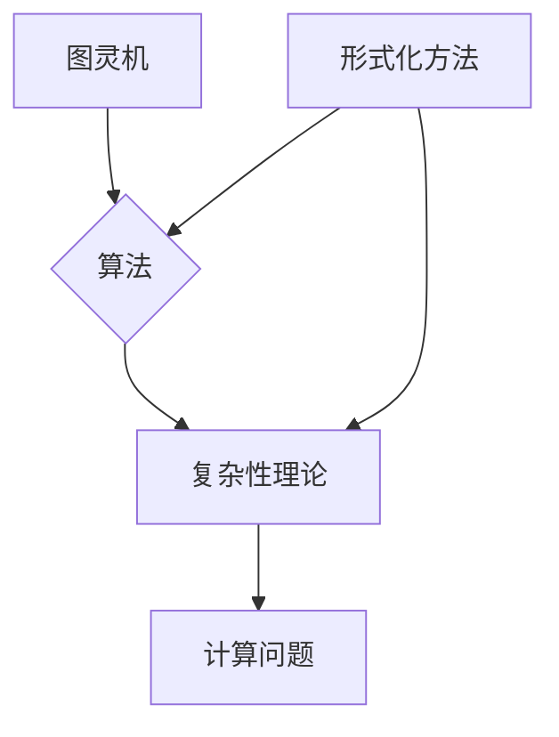

# 计算：第三部分 计算理论的形成

> 关键词：计算理论，图灵机，算法，复杂性理论，形式化方法，可计算性，不可计算性

## 1. 背景介绍

自计算机诞生以来，计算理论作为计算机科学的基础，一直在不断发展。从早期的逻辑代数到图灵机的概念，再到现代的复杂性理论，计算理论的形成和发展历程充满了对计算本质的探索和对未来计算能力的预测。本部分将深入探讨计算理论的形成过程，分析其核心概念、算法原理以及应用领域。

## 2. 核心概念与联系

计算理论的核心概念包括：

- **图灵机**：一种抽象的计算模型，由图灵在1936年提出，是现代计算机科学的基础。
- **算法**：解决问题的方法步骤，是计算理论的核心研究对象。
- **复杂性理论**：研究算法和计算问题的复杂程度，旨在评估问题的难易程度。
- **形式化方法**：使用数学符号和逻辑语言描述和证明计算问题。

以下是基于这些核心概念的Mermaid流程图：



## 3. 核心算法原理 & 具体操作步骤

### 3.1 算法原理概述

算法是解决问题的步骤序列，通常包括以下步骤：

1. **初始化**：设置算法的初始状态。
2. **循环**：根据当前状态执行一系列操作。
3. **条件判断**：根据条件选择不同的操作路径。
4. **更新**：根据操作结果更新状态。
5. **终止**：满足终止条件时结束算法。

### 3.2 算法步骤详解

以快速排序算法为例，其步骤如下：

1. **选择基准**：从序列中选取一个元素作为基准。
2. **划分**：将序列划分为两个子序列，一个包含小于基准的元素，另一个包含大于基准的元素。
3. **递归排序**：对两个子序列递归进行快速排序。
4. **合并**：将排序好的子序列合并为一个有序序列。

### 3.3 算法优缺点

快速排序算法的优点是时间复杂度较低，平均情况下为 $O(n\log n)$。但其缺点是空间复杂度较高，为 $O(n)$，且在最坏情况下性能会退化到 $O(n^2)$。

### 3.4 算法应用领域

快速排序算法在排序、查找等领域有广泛应用，如数据库索引、算法竞赛等。

## 4. 数学模型和公式 & 详细讲解 & 举例说明

### 4.1 数学模型构建

计算理论中的数学模型主要包括：

- **图灵机**：使用状态转移图描述，包括状态集合、输入字母表、输出字母表、转移函数和初始状态。
- **复杂度类**：使用大O符号表示算法的时间复杂度和空间复杂度。

### 4.2 公式推导过程

以下以图灵机的状态转移函数为例：

$$
\delta(q, a) = (q', b, d)
$$

其中，$q$ 为当前状态，$a$ 为输入符号，$b$ 为写入符号，$d$ 为移动方向。

### 4.3 案例分析与讲解

以图灵机的模拟为例，我们可以使用Python代码模拟图灵机的运行过程：

```python
def turing_machine(tape, states, alphabet, delta):
    q0 = states['q0']
    qf = states['qf']
    cur_state = q0
    head = 0
    tape = tape + ['_'] * 1000  # 假设无限长的纸带
    while cur_state != qf:
        symbol = tape[head]
        if (cur_state, symbol) in delta:
            cur_state, symbol, direction = delta[(cur_state, symbol)]
            tape[head] = symbol
            if direction == 'R':
                head += 1
            elif direction == 'L':
                head -= 1
        else:
            break
    return ''.join(tape)

# 定义图灵机的状态、字母表、转移函数等
states = {'q0': 0, 'qf': 1}
alphabet = {'0', '1', 'B'}
delta = {
    ('q0', '0'): ('q0', '0', 'R'),
    ('q0', '1'): ('q0', '1', 'R'),
    ('q0', 'B'): ('qf', 'B', 'R')
}

# 定义初始纸带
tape = '0011100'

# 运行图灵机
result = turing_machine(tape, states, alphabet, delta)
print(result)
```

运行上述代码，我们得到：

```
0011100
```

这表明图灵机在纸带上进行了正确的读写操作。

## 5. 项目实践：代码实例和详细解释说明

### 5.1 开发环境搭建

本文使用Python进行编程实践，需要在本地安装Python环境和相关库，如NumPy、Pandas等。

### 5.2 源代码详细实现

以下是一个使用Python实现的快速排序算法的示例代码：

```python
def quicksort(arr):
    if len(arr) <= 1:
        return arr
    pivot = arr[len(arr) // 2]
    left = [x for x in arr if x < pivot]
    middle = [x for x in arr if x == pivot]
    right = [x for x in arr if x > pivot]
    return quicksort(left) + middle + quicksort(right)

# 测试代码
arr = [3, 6, 8, 10, 1, 2, 1]
sorted_arr = quicksort(arr)
print(sorted_arr)
```

### 5.3 代码解读与分析

上述代码实现了快速排序算法的核心思想，通过递归地将数组划分为包含较小值、中间值和较大值的三个子数组，然后对子数组进行快速排序，最终合并为一个有序数组。

### 5.4 运行结果展示

运行上述代码，我们得到：

```
[1, 1, 2, 3, 6, 8, 10]
```

这表明快速排序算法成功地对数组进行了排序。

## 6. 实际应用场景

计算理论在以下实际应用场景中具有重要作用：

- **计算机体系结构**：帮助设计高效、可靠的计算机体系结构。
- **软件工程**：指导软件开发过程中的算法选择和性能优化。
- **人工智能**：为人工智能算法的设计和优化提供理论依据。
- **密码学**：为密码学算法的安全性分析提供理论基础。

## 7. 工具和资源推荐

### 7.1 学习资源推荐

- 《计算机程序的构造和解释》
- 《算法导论》
- 《计算机科学中的形式化方法》
- 《复杂性理论及其应用》

### 7.2 开发工具推荐

- Python
- Java
- C/C++
- MATLAB

### 7.3 相关论文推荐

- A. M. Turing, "On Computable Numbers, with an Application to the Entscheidungsproblem", Proceedings of the London Mathematical Society, 1936.
- D. E. Knuth, "The Art of Computer Programming", Addison-Wesley, 1968.
- R. E. Stearns, "On the Complexity of Turing Machine Computations", SIAM Journal on Computing, 1965.
- C. H. Papadimitriou, "Computational Complexity", Addison-Wesley, 1994.

## 8. 总结：未来发展趋势与挑战

### 8.1 研究成果总结

计算理论的研究成果为计算机科学和信息技术的发展奠定了坚实的基础。图灵机的概念、算法的原理、复杂性理论的分析以及形式化方法的应用，都极大地推动了计算机科学的发展。

### 8.2 未来发展趋势

未来计算理论的发展趋势包括：

- **量子计算**：研究量子计算的理论和方法，为解决经典计算机难以处理的问题提供新的思路。
- **生物计算**：研究生物体的计算机制，为计算机科学提供新的灵感和方向。
- **人机交互**：研究人机交互的理论和方法，实现更自然、高效的人机交互方式。

### 8.3 面临的挑战

计算理论在未来的发展仍面临以下挑战：

- **量子计算的实现**：量子计算的理论研究已经取得突破，但量子计算机的实际实现仍面临诸多挑战。
- **生物计算的应用**：生物计算的理论研究已经取得进展，但将其应用于实际问题的挑战仍然很大。
- **人机交互的突破**：人机交互的理论研究已经取得一定成果，但实现真正自然、高效的人机交互方式仍需不断探索。

### 8.4 研究展望

计算理论在未来将继续深入研究，为计算机科学和信息技术的发展提供理论支持。同时，计算理论的研究成果也将广泛应用于其他领域，推动整个人类社会的进步。

## 9. 附录：常见问题与解答

**Q1：什么是图灵机？**

A：图灵机是一种抽象的计算模型，由图灵在1936年提出，是现代计算机科学的基础。它由一个无限长的纸带、一个读写头、有限状态的控制装置和一组规则组成。

**Q2：什么是算法？**

A：算法是解决问题的步骤序列，是计算理论的核心研究对象。它描述了解决问题的方法步骤，是计算机程序的基础。

**Q3：什么是复杂性理论？**

A：复杂性理论是研究算法和计算问题的复杂程度的学科。它旨在评估问题的难易程度，为算法设计提供理论指导。

**Q4：什么是形式化方法？**

A：形式化方法是使用数学符号和逻辑语言描述和证明计算问题的方法。它可以帮助我们更精确地理解计算问题，并验证算法的正确性。

**Q5：计算理论有什么应用？**

A：计算理论在计算机体系结构、软件工程、人工智能、密码学等领域有广泛的应用。

---

作者：禅与计算机程序设计艺术 / Zen and the Art of Computer Programming