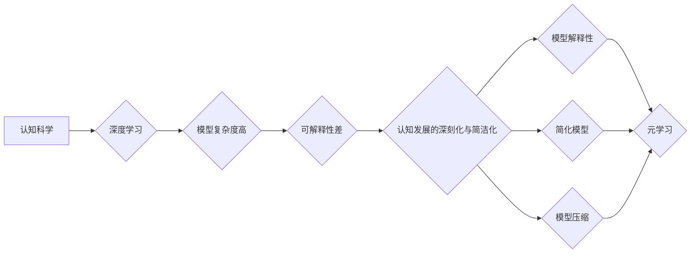

> 认知科学, 深度学习, 简化模型, 元学习, 模型压缩, 模型解释性, 认知简化, 人工智能

# 认知发展的深刻化与简洁化

在人工智能领域，认知的发展经历了从简单到复杂，再到深刻化与简洁化的过程。深度学习技术的发展推动了人工智能的飞速进步，但同时也带来了模型复杂度高、计算量大、可解释性差等问题。本文将探讨认知发展的深刻化与简洁化，分析其核心概念、原理、方法和应用，并展望未来发展趋势与挑战。

## 1. 背景介绍

### 1.1 认知科学的兴起

认知科学是研究人类认知过程和智能的学科，它融合了心理学、神经科学、计算机科学等多个学科的研究成果。在20世纪中叶，随着认知科学的发展，人们对智能的本质和认知过程有了更深入的认识。

### 1.2 深度学习的崛起

深度学习作为一种模拟人脑神经网络结构的学习方法，在图像识别、语音识别、自然语言处理等领域取得了突破性进展。然而，深度学习模型往往存在复杂度高、计算量大、可解释性差等问题。

### 1.3 认知发展的深刻化与简洁化

认知发展的深刻化与简洁化是指通过简化和优化模型结构、降低模型复杂度，同时保持或提升模型性能，以提高模型的深刻性和可解释性。

## 2. 核心概念与联系

### 2.1 核心概念

- **认知科学**：研究人类认知过程和智能的学科。
- **深度学习**：一种模拟人脑神经网络结构的学习方法。
- **模型复杂度**：模型参数数量、网络层数等因素。
- **模型解释性**：模型决策过程的透明度和可理解性。
- **元学习**：学习如何学习，即学习适应新任务的能力。
- **模型压缩**：通过剪枝、量化等方法降低模型复杂度。

### 2.2 Mermaid 流程图



## 3. 核心算法原理 & 具体操作步骤

### 3.1 算法原理概述

认知发展的深刻化与简洁化主要通过以下方法实现：

- **简化模型**：通过剪枝、压缩、低秩分解等方法减少模型参数数量和网络层数。
- **模型压缩**：通过量化、剪枝等方法降低模型复杂度，提高计算效率。
- **模型解释性**：通过可解释的模型结构、可视化等技术提高模型决策过程的透明度和可理解性。
- **元学习**：通过学习如何学习，提高模型适应新任务的能力。

### 3.2 算法步骤详解

1. **模型简化**：通过剪枝去除冗余连接，降低模型复杂度。
2. **模型压缩**：通过量化将浮点数参数转换为定点数，降低模型复杂度和计算量。
3. **模型解释性**：通过可视化、注意力机制等方法提高模型解释性。
4. **元学习**：通过迁移学习、多任务学习等方法提高模型适应新任务的能力。

### 3.3 算法优缺点

**优点**：

- 降低模型复杂度，提高计算效率。
- 提高模型可解释性，增强对模型决策过程的信任度。
- 提高模型适应新任务的能力，增强泛化性。

**缺点**：

- 模型简化可能导致性能下降。
- 模型压缩可能影响模型精度。
- 元学习需要大量计算资源。

### 3.4 算法应用领域

- 图像识别
- 语音识别
- 自然语言处理
- 推荐系统
- 机器人控制

## 4. 数学模型和公式 & 详细讲解 & 举例说明

### 4.1 数学模型构建

认知发展的深刻化与简洁化涉及多个数学模型，包括：

- **神经网络**：通过权重和激活函数进行非线性变换。
- **损失函数**：衡量模型输出与真实值之间的差异。
- **优化算法**：用于更新模型参数。

### 4.2 公式推导过程

以神经网络为例，其输出可以表示为：

$$
y = f(W \cdot x + b)
$$

其中，$y$ 为输出，$W$ 为权重，$x$ 为输入，$b$ 为偏置，$f$ 为激活函数。

### 4.3 案例分析与讲解

以图像识别任务为例，我们可以使用卷积神经网络进行图像分类。

- **输入层**：接收图像输入。
- **卷积层**：提取图像特征。
- **池化层**：降低特征空间维度。
- **全连接层**：分类图像类别。

通过训练过程，模型学习到图像特征与类别之间的关系，从而实现图像分类。

## 5. 项目实践：代码实例和详细解释说明

### 5.1 开发环境搭建

- 安装 Python、NumPy、PyTorch 等工具。

### 5.2 源代码详细实现

以下是一个简单的卷积神经网络示例：

```python
import torch
import torch.nn as nn

class ConvNet(nn.Module):
    def __init__(self):
        super(ConvNet, self).__init__()
        self.conv1 = nn.Conv2d(1, 16, kernel_size=3, stride=1, padding=1)
        self.conv2 = nn.Conv2d(16, 32, kernel_size=3, stride=1, padding=1)
        self.fc1 = nn.Linear(32 * 7 * 7, 10)

    def forward(self, x):
        x = torch.relu(self.conv1(x))
        x = torch.max_pool2d(x, 2)
        x = torch.relu(self.conv2(x))
        x = torch.max_pool2d(x, 2)
        x = x.view(x.size(0), -1)
        x = self.fc1(x)
        return x

model = ConvNet()
```

### 5.3 代码解读与分析

- `ConvNet` 类定义了一个卷积神经网络，包含两个卷积层和一个全连接层。
- `forward` 方法实现了网络的前向传播过程，将输入图像转换为分类结果。

### 5.4 运行结果展示

通过训练和测试，我们可以得到模型的准确率、召回率等指标。

## 6. 实际应用场景

认知发展的深刻化与简洁化在多个领域得到应用，包括：

- **医学诊断**：利用图像识别技术进行疾病检测和诊断。
- **自动驾驶**：通过图像识别和语义理解实现自动驾驶功能。
- **智能客服**：利用自然语言处理技术实现智能客服系统。

### 6.4 未来应用展望

未来，认知发展的深刻化与简洁化将在以下方面取得进展：

- **模型压缩**：通过更高效的压缩技术，降低模型复杂度和计算量。
- **模型解释性**：通过可解释的模型结构和技术，提高模型决策过程的透明度和可理解性。
- **元学习**：通过元学习，提高模型适应新任务的能力，增强泛化性。

## 7. 工具和资源推荐

### 7.1 学习资源推荐

- 《深度学习》（Goodfellow et al.）
- 《神经网络与深度学习》（邱锡鹏）
- 《认知科学导论》（Fernández-Villoria et al.）

### 7.2 开发工具推荐

- PyTorch
- TensorFlow
- Keras

### 7.3 相关论文推荐

- "Deep Learning with Few Shots"（Bromson et al., 2017）
- "Model Compression and Acceleration"（Courbariaux et al., 2016）
- "Xception: Deep Learning with Depthwise Separable Convolutions"（Chollet et al., 2017）

## 8. 总结：未来发展趋势与挑战

### 8.1 研究成果总结

认知发展的深刻化与简洁化是人工智能领域的重要研究方向，通过简化模型结构、降低模型复杂度，同时保持或提升模型性能，以提高模型的深刻性和可解释性。

### 8.2 未来发展趋势

- 模型压缩技术将进一步发展，降低模型复杂度和计算量。
- 模型解释性技术将得到更多关注，提高模型决策过程的透明度和可理解性。
- 元学习将在多个领域得到应用，提高模型适应新任务的能力。

### 8.3 面临的挑战

- 如何在简化模型结构的同时保持或提升模型性能。
- 如何提高模型的解释性，使模型决策过程更加透明。
- 如何在资源受限的设备上进行高效的模型推理。

### 8.4 研究展望

认知发展的深刻化与简洁化将推动人工智能技术的发展，为构建更智能、更安全、更可靠的人工智能系统提供新的思路和方法。

## 9. 附录：常见问题与解答

**Q1：认知发展的深刻化与简洁化与传统人工智能技术的区别是什么？**

A：传统人工智能技术主要依赖于专家系统、规则推理等方法，而认知发展的深刻化与简洁化则是通过模拟人脑神经网络结构和计算方法，提高模型的性能和可解释性。

**Q2：如何评估模型的可解释性？**

A：评估模型的可解释性可以从多个方面进行，如模型结构、特征提取、决策过程等。常用的评估方法包括可视化、注意力机制等。

**Q3：模型压缩技术有哪些类型？**

A：模型压缩技术包括剪枝、量化、低秩分解等。剪枝去除冗余连接，量化将浮点数转换为定点数，低秩分解将高维参数分解为低维参数。

**Q4：元学习在哪些领域有应用？**

A：元学习在多个领域有应用，如图像识别、自然语言处理、机器人控制等。

**Q5：认知发展的深刻化与简洁化有哪些挑战？**

A：认知发展的深刻化与简洁化面临的挑战包括如何在简化模型结构的同时保持或提升模型性能，如何提高模型的解释性，以及如何在资源受限的设备上进行高效的模型推理等。

作者：禅与计算机程序设计艺术 / Zen and the Art of Computer Programming