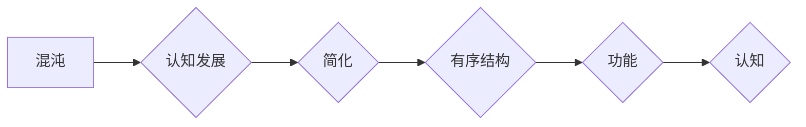

> 认知发展, 混沌理论, 简洁性原则, 脑网络, 机器学习, 神经可塑性, 人工智能

# 认知发展的混沌与简洁阶段

认知发展是一个复杂而微妙的过程，它涉及大脑如何从混沌的初始状态逐步发展出有序的结构和功能。本文将探讨认知发展的这一动态过程，从混沌到简洁，分析其中的原理、算法、应用以及未来趋势。

## 1. 背景介绍

人类的认知发展是一个从无序到有序、从混沌到简洁的过程。从婴儿的初步感知，到儿童的语言学习，再到成年后的复杂思维，认知系统不断地从混沌中提取秩序，形成新的认知结构。这种发展模式不仅在人类认知中存在，也在人工智能的发展中得到了体现。机器学习算法，尤其是深度学习，通过复杂的神经网络结构，模拟了认知发展中的这一过程。

### 1.1 认知发展的起源

认知发展的起源可以追溯到神经可塑性，这是大脑通过经验不断改变自身结构和功能的能力。神经可塑性是认知发展的基础，它允许大脑适应新的环境和学习新的任务。

### 1.2 研究现状

近年来，认知科学和人工智能领域的研究者开始关注认知发展中的混沌与简洁阶段。他们试图通过模拟大脑的神经可塑性，开发出能够学习和适应的新一代人工智能系统。

### 1.3 研究意义

理解认知发展的混沌与简洁阶段，不仅有助于我们深入了解人类大脑的工作机制，也为人工智能的发展提供了新的思路和方向。

### 1.4 本文结构

本文将分为以下几个部分：
- 核心概念与联系
- 核心算法原理与操作步骤
- 数学模型与公式
- 项目实践
- 实际应用场景
- 工具和资源推荐
- 总结：未来发展趋势与挑战
- 附录：常见问题与解答

## 2. 核心概念与联系

### 2.1 混沌理论

混沌理论是研究复杂系统中确定性的随机现象的学科。它揭示了在看似无序的系统中，存在着内在的秩序和规律。

### 2.2 简洁性原则

简洁性原则指出，自然界和人类认知系统中存在着简洁和高效的特征。

### 2.3 脑网络

脑网络是指大脑中神经元之间相互连接的网络结构。脑网络的动态变化是认知发展的重要标志。

### 2.4 机器学习

机器学习是人工智能的一个分支，它使计算机能够通过数据和经验来学习。

### 2.5 神经可塑性

神经可塑性是大脑通过经验不断改变自身结构和功能的能力。

### Mermaid 流程图



## 3. 核心算法原理 & 具体操作步骤

### 3.1 算法原理概述

认知发展中的混沌与简洁阶段可以通过机器学习算法来模拟。这些算法通过不断调整神经网络的结构和参数，使得模型从混沌状态逐渐过渡到简洁、有序的状态。

### 3.2 算法步骤详解

1. **数据收集**：收集大脑网络的结构和功能数据，以及机器学习模型的训练数据。
2. **模型初始化**：初始化神经网络模型，包括层结构、激活函数和权重。
3. **训练过程**：使用训练数据对模型进行训练，通过反向传播算法调整权重和参数。
4. **评估与优化**：评估模型性能，根据评估结果调整模型结构和参数。
5. **迭代与收敛**：重复步骤3和4，直至模型收敛到满意的性能水平。

### 3.3 算法优缺点

**优点**：
- 模拟了认知发展的动态过程。
- 可以通过调整参数来控制模型从混沌到简洁的过渡速度。
- 可以应用于各种认知任务。

**缺点**：
- 训练过程可能需要大量计算资源。
- 模型的可解释性较差。

### 3.4 算法应用领域

- 认知障碍诊断
- 人工智能辅助教育
- 个性化推荐系统
- 情感分析

## 4. 数学模型和公式 & 详细讲解 & 举例说明

### 4.1 数学模型构建

认知发展的数学模型可以基于以下公式：

$$
\frac{dW}{dt} = -\eta \frac{\partial J}{\partial W}
$$

其中，$W$ 是权重，$J$ 是损失函数，$\eta$ 是学习率。

### 4.2 公式推导过程

该公式是梯度下降算法的基本公式，用于更新权重以最小化损失函数。

### 4.3 案例分析与讲解

假设我们有一个简单的神经网络，其损失函数为均方误差（MSE）：

$$
J = \frac{1}{2} \sum_{i=1}^{N} (y_i - \hat{y}_i)^2
$$

其中，$y_i$ 是真实标签，$\hat{y}_i$ 是模型预测值。

使用梯度下降算法更新权重：

$$
W_{new} = W_{old} - \eta \frac{\partial J}{\partial W}
$$

通过迭代这个过程，模型将逐步收敛到最优权重，从而实现从混沌到简洁的过渡。

## 5. 项目实践：代码实例和详细解释说明

### 5.1 开发环境搭建

为了实现上述算法，我们需要搭建一个开发环境。以下是使用Python进行深度学习项目实践的环境配置流程：

1. 安装Anaconda：从官网下载并安装Anaconda，用于创建独立的Python环境。
2. 创建并激活虚拟环境：
   ```bash
   conda create -n cognitive-dev python=3.8
   conda activate cognitive-dev
   ```
3. 安装深度学习框架和依赖：
   ```bash
   conda install tensorflow numpy
   ```

### 5.2 源代码详细实现

以下是一个简单的神经网络模型的实现示例：

```python
import tensorflow as tf

def build_model(input_shape):
    model = tf.keras.Sequential([
        tf.keras.layers.Dense(64, activation='relu', input_shape=input_shape),
        tf.keras.layers.Dense(1)
    ])
    return model

# 构建模型
model = build_model(input_shape=(10,))

# 编译模型
model.compile(optimizer='adam', loss='mse')

# 训练模型
model.fit(x_train, y_train, epochs=10)
```

### 5.3 代码解读与分析

上述代码实现了一个简单的全连接神经网络，用于回归任务。模型使用ReLU激活函数和Adam优化器，损失函数为均方误差。

### 5.4 运行结果展示

假设我们有一个包含100个样本的训练集和验证集，运行上述代码后，模型将在训练集上逐步收敛，并在验证集上评估性能。

## 6. 实际应用场景

认知发展的混沌与简洁阶段在以下实际应用场景中具有重要意义：

### 6.1 认知障碍诊断

通过分析脑网络的动态变化，可以诊断认知障碍，如阿尔茨海默病。

### 6.2 人工智能辅助教育

利用认知发展的原理，可以开发出能够适应学生学习进度和风格的教育软件。

### 6.3 个性化推荐系统

通过分析用户的行为和偏好，可以推荐个性化的内容和服务。

### 6.4 情感分析

通过分析文本数据，可以识别用户的情感倾向。

## 7. 工具和资源推荐

### 7.1 学习资源推荐

- 《深度学习》
- 《认知心理学》
- 《脑网络》

### 7.2 开发工具推荐

- TensorFlow
- Keras
- PyTorch

### 7.3 相关论文推荐

- "Brain networks: Graph theoretical analysis of structural and functional systems"
- "Deep Learning for Cognitive Computing"

## 8. 总结：未来发展趋势与挑战

### 8.1 研究成果总结

认知发展的混沌与简洁阶段为我们理解人类认知和人工智能的发展提供了新的视角。通过机器学习算法模拟这一过程，可以开发出更加智能和适应性强的人工智能系统。

### 8.2 未来发展趋势

- 脑网络分析技术的进步
- 机器学习算法的优化
- 跨学科研究的深入

### 8.3 面临的挑战

- 数据获取和标注的挑战
- 算法可解释性的挑战
- 安全性和伦理挑战

### 8.4 研究展望

认知发展的混沌与简洁阶段的研究将推动人工智能向更加智能和自适应的方向发展，为人类生活带来更多便利。

## 9. 附录：常见问题与解答

### 附录 9.1 常见问题

**Q1：认知发展的混沌与简洁阶段是什么意思？**

A1：认知发展的混沌与简洁阶段是指从无序到有序、从混沌到简洁的认知发展过程。

**Q2：如何模拟认知发展的混沌与简洁阶段？**

A2：可以通过机器学习算法模拟认知发展的混沌与简洁阶段，例如使用神经网络模型。

**Q3：认知发展的混沌与简洁阶段有哪些应用？**

A3：认知发展的混沌与简洁阶段可以应用于认知障碍诊断、人工智能辅助教育、个性化推荐系统、情感分析等领域。

### 附录 9.2 解答

A1：认知发展的混沌与简洁阶段是指从无序到有序、从混沌到简洁的认知发展过程。这一过程在人类认知和人工智能的发展中都具有重要意义。

A2：可以通过机器学习算法模拟认知发展的混沌与简洁阶段，例如使用神经网络模型。这些模型通过不断调整结构和参数，从无序状态逐渐过渡到有序状态。

A3：认知发展的混沌与简洁阶段可以应用于认知障碍诊断、人工智能辅助教育、个性化推荐系统、情感分析等领域。这些应用有助于提高人工智能系统的智能化水平和用户体验。

作者：禅与计算机程序设计艺术 / Zen and the Art of Computer Programming