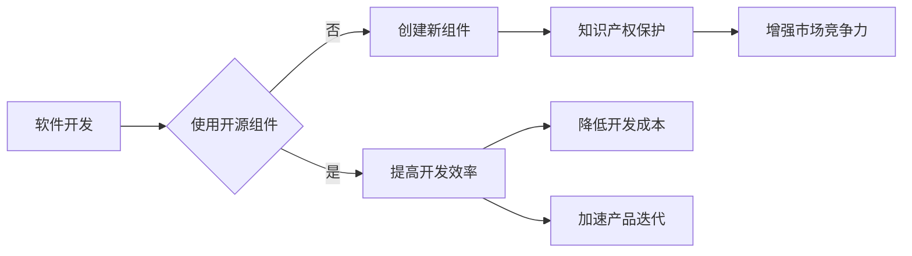

> 代码复用, 知识产权, 软件2.0, 开源, 封闭源, 模块化, 标准化, 软件资产管理, 代码审计

# 软件2.0时代的代码复用与知识产权

软件2.0时代，我们见证了软件行业的深刻变革。从传统的单体应用向微服务架构的转型，从封闭源代码的孤岛式发展向开源生态的深度融合，以及从单一软件产品向软件即服务(SaaS)模式的转变，都标志着软件行业正进入一个全新的发展阶段。在这个时代背景下，代码复用和知识产权保护成为软件企业面临的重要议题。本文将深入探讨软件2.0时代的代码复用与知识产权，分析其核心概念、原理、应用，并展望未来发展趋势与挑战。

## 1. 背景介绍

### 1.1 软件2.0时代的特征

软件2.0时代的主要特征包括：

- **开源与闭源并存**：开源软件和闭源软件并行发展，形成了一个多元化的软件生态。
- **微服务架构**：软件系统以微服务的形式构建，提高了系统的可扩展性和可维护性。
- **软件即服务(SaaS)**：软件以服务的形式提供，用户按需付费，降低了软件使用门槛。
- **数据驱动**：软件企业越来越重视数据的价值，通过数据分析来优化产品和服务。

### 1.2 代码复用与知识产权的重要性

在软件2.0时代，代码复用和知识产权保护对于软件企业具有重要意义：

- **代码复用**：可以提高开发效率，降低开发成本，加速产品迭代。
- **知识产权保护**：可以保护企业的核心技术和商业利益，增强市场竞争力。

## 2. 核心概念与联系

### 2.1 核心概念

**代码复用**：指在软件开发过程中，将已有的代码组件或模块应用于新的软件开发中，以避免重复开发。

**知识产权**：指通过智力活动创造的具有经济价值并受到法律保护的权利，包括著作权、专利权、商标权等。

### 2.2 Mermaid 流程图



### 2.3 关系联系

代码复用与知识产权保护之间存在密切的联系：

- 代码复用可以促进知识产权保护，因为复用的代码往往需要经过知识产权所有者的授权。
- 知识产权保护可以保障代码复用的正当性，防止侵权行为的发生。

## 3. 核心算法原理 & 具体操作步骤

### 3.1 算法原理概述

代码复用的算法原理主要包括：

- **组件化**：将代码分解为可复用的组件。
- **模块化**：将功能模块划分为可复用的单元。
- **标准化**：制定统一的接口规范，以便于组件之间的集成。

### 3.2 算法步骤详解

代码复用的具体操作步骤如下：

1. **需求分析**：确定需要复用的功能和组件。
2. **组件化**：将代码分解为可复用的组件。
3. **模块化**：将功能模块划分为可复用的单元。
4. **标准化**：制定统一的接口规范。
5. **集成**：将复用的组件或模块集成到新的软件系统中。

### 3.3 算法优缺点

**优点**：

- 提高开发效率
- 降低开发成本
- 加速产品迭代

**缺点**：

- 复用代码的质量难以保证
- 复用代码的兼容性可能存在问题
- 难以控制复用代码的版本和更新

### 3.4 算法应用领域

代码复用技术可以应用于以下领域：

- 软件开发
- 系统集成
- 应用部署

## 4. 数学模型和公式 & 详细讲解 & 举例说明

### 4.1 数学模型构建

代码复用的数学模型可以表示为：

$$
C = F(R, M)
$$

其中，$C$ 表示复用成本，$R$ 表示复用风险，$M$ 表示复用收益。

### 4.2 公式推导过程

复用成本 $C$ 可以表示为：

$$
C = C_{开发} + C_{维护}
$$

其中，$C_{开发}$ 表示开发新组件的成本，$C_{维护}$ 表示维护复用代码的成本。

复用风险 $R$ 可以表示为：

$$
R = R_{兼容} + R_{质量}
$$

其中，$R_{兼容}$ 表示复用代码与目标系统兼容的风险，$R_{质量}$ 表示复用代码的质量风险。

复用收益 $M$ 可以表示为：

$$
M = M_{效率} + M_{成本}
$$

其中，$M_{效率}$ 表示复用代码提高开发效率的收益，$M_{成本}$ 表示复用代码降低开发成本和加速产品迭代的收益。

### 4.3 案例分析与讲解

以下是一个代码复用的案例分析：

假设某公司开发了一个用于数据处理的组件，该组件在多个项目中得到了复用。经过一段时间的维护，该组件的功能不断完善，代码质量也得到了提高。因此，该组件的复用成本逐渐降低，而复用收益逐渐增加。

## 5. 项目实践：代码实例和详细解释说明

### 5.1 开发环境搭建

为了演示代码复用的实践，我们需要搭建一个简单的开发环境。以下是使用Python的Django框架创建的一个示例项目：

1. 安装Django：
```bash
pip install django
```

2. 创建Django项目：
```bash
django-admin startproject myproject
cd myproject
```

3. 创建Django应用：
```bash
python manage.py startapp myapp
```

### 5.2 源代码详细实现

以下是一个简单的Django应用示例，其中包含一个用于计算两个数字之和的函数：

```python
# myapp/views.py
from django.http import JsonResponse

def add(request):
    x = request.GET.get('x', 0)
    y = request.GET.get('y', 0)
    result = int(x) + int(y)
    return JsonResponse({'result': result})
```

### 5.3 代码解读与分析

这个示例中，`add` 函数接受两个查询参数 `x` 和 `y`，计算它们的和，并返回一个JSON响应。这个函数可以在多个Django应用中被复用，以提高开发效率。

### 5.4 运行结果展示

启动Django开发服务器：
```bash
python manage.py runserver
```

在浏览器中访问 `http://127.0.0.1:8000/add?x=2&y=3`，可以看到结果为 `5`。

## 6. 实际应用场景

### 6.1 开源项目

开源项目是代码复用的典型应用场景。开源项目通常具有以下特点：

- **社区驱动**：开源项目由社区成员共同维护和改进。
- **代码共享**：开源项目的代码可以自由下载和复用。
- **透明度**：开源项目的开发过程公开透明。

### 6.2 商业软件

商业软件也可以通过代码复用来提高开发效率。以下是一些常见的商业软件代码复用方式：

- **组件库**：开发通用的组件库，供内部项目复用。
- **框架**：使用流行的框架，如Django、Spring等，可以减少重复工作。
- **中间件**：开发中间件，提供通用的功能，如身份认证、日志记录等。

## 7. 工具和资源推荐

### 7.1 学习资源推荐

- 《软件架构师修炼之道》
- 《代码大全》
- 《设计模式：可复用面向对象软件的基础》

### 7.2 开发工具推荐

- **代码复用工具**：
  - **Apache Commons**：提供各种通用组件库，如日志、集合、编码转换等。
  - **Google Guava**：提供丰富的工具类，如集合操作、并发编程等。
- **版本控制系统**：
  - **Git**：分布式版本控制系统，适用于开源项目和闭源项目。
  - **Subversion**：集中式版本控制系统，适用于团队协作。

### 7.3 相关论文推荐

- **软件复用**：
  - **"Software Reuse and Component Based Software Engineering"** by David L. Parnas
  - **"Component Based Software Engineering: A Research Perspective"** by William M. T. Crook
- **知识产权**：
  - **"Intellectual Property and the Digital Economy"** by Ruth Sohn
  - **"Intellectual Property Law"** by Paul Goldstein

## 8. 总结：未来发展趋势与挑战

### 8.1 研究成果总结

本文从软件2.0时代的背景出发，探讨了代码复用与知识产权保护的核心概念、原理、应用和挑战。通过分析开源与闭源并存、微服务架构、软件即服务等特征，我们认识到代码复用和知识产权保护对于软件企业的重要性。

### 8.2 未来发展趋势

未来，代码复用与知识产权保护将呈现以下发展趋势：

- **开源生态的进一步发展**：开源项目将继续增长，开源与闭源将更加融合。
- **代码复用技术的不断成熟**：代码复用工具和框架将更加丰富，复用效率将进一步提高。
- **知识产权保护意识的增强**：软件企业将更加重视知识产权保护，以应对日益严峻的知识产权挑战。

### 8.3 面临的挑战

软件2.0时代，代码复用与知识产权保护也面临着以下挑战：

- **开源与闭源之间的冲突**：开源项目与商业软件之间的边界将更加模糊，如何平衡两者之间的关系将是一个挑战。
- **知识产权保护的成本**：随着软件技术的发展，知识产权保护的成本将不断增加。
- **代码复用的风险**：复用代码的质量和兼容性可能存在问题，需要加强代码审计和测试。

### 8.4 研究展望

未来，我们需要在以下方面加强研究：

- **开源生态的治理**：建立开源生态的治理机制，促进开源项目的健康发展。
- **代码复用技术的创新**：开发更加高效、安全的代码复用技术。
- **知识产权保护的法律和标准**：完善知识产权保护的法律和标准，保护软件企业的合法权益。

## 9. 附录：常见问题与解答

**Q1：什么是代码复用？**

A：代码复用是指将已有的代码组件或模块应用于新的软件开发中，以避免重复开发。

**Q2：代码复用有什么好处？**

A：代码复用可以提高开发效率，降低开发成本，加速产品迭代。

**Q3：代码复用有哪些风险？**

A：代码复用可能存在兼容性、质量和版本控制等方面的风险。

**Q4：如何进行代码复用？**

A：进行代码复用需要遵循以下步骤：
1. 需求分析
2. 组件化
3. 模块化
4. 标准化
5. 集成

**Q5：什么是知识产权？**

A：知识产权是指通过智力活动创造的具有经济价值并受到法律保护的权利，包括著作权、专利权、商标权等。

**Q6：知识产权保护有哪些方式？**

A：知识产权保护可以通过以下方式进行：
1. 著作权登记
2. 专利申请
3. 商标注册
4. 保密协议

**Q7：如何平衡开源与闭源的关系？**

A：平衡开源与闭源的关系需要从以下几个方面考虑：
1. 允许合理的使用和引用
2. 保护商业利益
3. 促进技术创新
4. 维护社区利益

作者：禅与计算机程序设计艺术 / Zen and the Art of Computer Programming