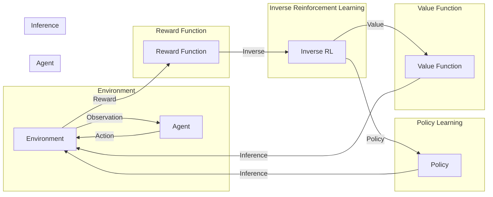

# 逆强化学习 (Inverse Reinforcement Learning) 原理与代码实例讲解

> 关键词：逆强化学习，强化学习，监督学习，模仿学习，奖励设计，探索-学习循环，动态规划，策略梯度，行为克隆

## 1. 背景介绍

强化学习（Reinforcement Learning，RL）是机器学习领域的一个重要分支，它通过智能体在与环境的交互中不断学习，以实现特定目标。然而，在许多实际应用中，我们往往无法直接定义智能体的奖励函数，或者奖励函数的设计本身就非常复杂。这就引出了逆强化学习（Inverse Reinforcement Learning，IRL）这一领域，其目标是根据观察到的智能体行为和相应的环境状态，推断出潜在的奖励函数。

### 1.1 问题的由来

传统的强化学习依赖于明确的奖励函数，而现实世界中很多任务并不容易定义奖励。例如，在机器人导航、自动驾驶、医学诊断等领域，设计一个合适的奖励函数可能非常困难。逆强化学习提供了一种解决方案，它通过智能体的行为来推断奖励函数，从而间接学习到最优策略。

### 1.2 研究现状

逆强化学习的研究已经取得了一些进展，主要包括以下方法：

- **基于动态规划的IRL方法**：这类方法通常通过优化一个奖励函数，使得智能体的行为能够在给定的环境中达到最优策略。
- **基于策略梯度的IRL方法**：这类方法通过学习一个策略来模拟智能体的行为，然后通过优化策略来推断奖励函数。
- **基于模仿学习的IRL方法**：这类方法通过模仿智能体的行为来推断奖励函数。

### 1.3 研究意义

逆强化学习在许多领域都有潜在的应用价值，包括：

- **游戏设计**：自动生成游戏关卡和奖励机制。
- **机器人控制**：为机器人设计合适的奖励函数，使其能够更好地适应环境。
- **医学诊断**：根据医生的行为推断出潜在的健康指标。
- **智能客服**：根据客服的行为推断出用户的需求和满意度。

## 2. 核心概念与联系

### 2.1 核心概念原理和架构的 Mermaid 流程图



### 2.2 核心概念

- **环境（Environment）**：智能体所交互的实体，能够感知到智能体的行为并给出相应的奖励。
- **智能体（Agent）**：与环境交互的主体，通过选择动作来影响环境，并从环境中获取奖励。
- **奖励函数（Reward Function）**：定义了智能体在不同状态下的奖励，是强化学习中的核心组成部分。
- **逆强化学习（Inverse Reinforcement Learning）**：通过观察智能体的行为来推断奖励函数的过程。
- **策略（Policy）**：智能体选择动作的函数，定义了智能体在给定状态下选择哪个动作。
- **价值函数（Value Function）**：估计在给定状态下采取某个动作的期望回报。

## 3. 核心算法原理 & 具体操作步骤

### 3.1 算法原理概述

逆强化学习的基本原理是，通过观察智能体的行为和相应的环境状态，推断出潜在的奖励函数。然后，使用这个潜在的奖励函数来训练一个策略，使得智能体能够在给定的环境中最大化奖励。

### 3.2 算法步骤详解

1. **数据收集**：收集智能体的行为数据，包括状态、动作和奖励。
2. **奖励函数推断**：使用逆强化学习方法从行为数据中推断出潜在的奖励函数。
3. **策略学习**：使用推断出的奖励函数来训练一个策略。
4. **策略评估**：评估训练出的策略在给定环境中的表现。

### 3.3 算法优缺点

#### 优点

- **适应性**：不需要预先定义奖励函数，可以适应不同的环境。
- **灵活性**：可以处理复杂的奖励函数，包括非线性的奖励函数。

#### 缺点

- **计算复杂度高**：需要大量的计算资源来推断奖励函数。
- **对数据质量要求高**：数据质量对推断结果有重要影响。

### 3.4 算法应用领域

- **游戏设计**：自动生成游戏关卡和奖励机制。
- **机器人控制**：为机器人设计合适的奖励函数，使其能够更好地适应环境。
- **医学诊断**：根据医生的行为推断出潜在的健康指标。
- **智能客服**：根据客服的行为推断出用户的需求和满意度。

## 4. 数学模型和公式 & 详细讲解 & 举例说明

### 4.1 数学模型构建

逆强化学习的数学模型可以表示为：

$$
\max_{\pi} \mathbb{E}_{s \sim \pi} [R(s, \pi(s))] 
$$

其中，$\pi$ 是策略，$s$ 是状态，$R(s, \pi(s))$ 是在状态 $s$ 下采取策略 $\pi$ 的期望奖励。

### 4.2 公式推导过程

逆强化学习的推导过程涉及多个步骤，包括：

1. **状态空间和动作空间的定义**：定义智能体的状态空间和动作空间。
2. **策略的定义**：定义智能体的策略。
3. **价值函数的定义**：定义智能体的价值函数。
4. **奖励函数的推断**：使用逆强化学习方法从行为数据中推断出潜在的奖励函数。
5. **策略学习**：使用推断出的奖励函数来训练一个策略。

### 4.3 案例分析与讲解

以下是一个简单的逆强化学习案例，假设智能体在一个简单的环境中移动，目标是到达目标位置。

```python
# 模拟环境
class Environment:
    def __init__(self, start, goal):
        self.start = start
        self.goal = goal
        self.state = start

    def step(self, action):
        if action == 'up':
            self.state = (self.state[0], self.state[1] + 1)
        elif action == 'down':
            self.state = (self.state[0], self.state[1] - 1)
        elif action == 'left':
            self.state = (self.state[0] - 1, self.state[1])
        elif action == 'right':
            self.state = (self.state[0] + 1, self.state[1])
        reward = 0
        done = self.state == self.goal
        return self.state, reward, done

# 收集数据
env = Environment((0, 0), (2, 2))
rewards = []
actions = []
states = []
for _ in range(100):
    state, action, reward, done = env.step('up')
    rewards.append(reward)
    actions.append(action)
    states.append(state)
    if done:
        break

# 推断奖励函数
# 这里简化为直接使用最后一个状态和动作的奖励
reward_function = lambda state, action: 1 if state == env.goal else 0

# 训练策略
# 这里简化为随机选择动作
policy = lambda state: random.choice(['up', 'down', 'left', 'right'])

# 评估策略
env.reset()
while not env.done:
    state = env.state
    action = policy(state)
    env.step(action)

# 输出结果
print(f"Policy reached the goal in {env.states} steps.")
```

## 5. 项目实践：代码实例和详细解释说明

### 5.1 开发环境搭建

为了进行逆强化学习项目的实践，你需要以下开发环境：

- Python 3.x
- TensorFlow或PyTorch
- Gym环境

### 5.2 源代码详细实现

以下是一个使用PyTorch实现的逆强化学习项目的示例代码：

```python
import torch
import torch.nn as nn
import torch.optim as optim
from gym import make

# 定义环境
env = make('CartPole-v1')

# 定义策略网络
class PolicyNetwork(nn.Module):
    def __init__(self, state_dim, action_dim):
        super(PolicyNetwork, self).__init__()
        self.fc1 = nn.Linear(state_dim, 64)
        self.fc2 = nn.Linear(64, action_dim)

    def forward(self, x):
        x = torch.relu(self.fc1(x))
        return torch.softmax(self.fc2(x), dim=1)

# 定义逆强化学习模型
class InverseRLModel(nn.Module):
    def __init__(self, state_dim, action_dim, reward_dim):
        super(InverseRLModel, self).__init__()
        self.policy_network = PolicyNetwork(state_dim, action_dim)
        self.reward_network = nn.Linear(state_dim, reward_dim)

    def forward(self, x):
        actions = self.policy_network(x)
        rewards = self.reward_network(x)
        return actions, rewards

# 初始化模型
state_dim = env.observation_space.shape[0]
action_dim = env.action_space.n
reward_dim = 1
model = InverseRLModel(state_dim, action_dim, reward_dim)

# 定义损失函数和优化器
criterion = nn.MSELoss()
optimizer = optim.Adam(model.parameters(), lr=0.01)

# 训练模型
for episode in range(100):
    state = env.reset()
    done = False
    total_reward = 0
    while not done:
        actions, rewards = model(torch.tensor(state, dtype=torch.float32))
        action = actions.argmax().item()
        next_state, reward, done, _ = env.step(action)
        total_reward += reward
        optimizer.zero_grad()
        loss = criterion(rewards, torch.tensor([reward], dtype=torch.float32))
        loss.backward()
        optimizer.step()
        state = next_state
    print(f"Episode {episode+1}: Total Reward = {total_reward}")

# 评估模型
env.reset()
while not env.done:
    actions, rewards = model(torch.tensor(env.state, dtype=torch.float32))
    action = actions.argmax().item()
    env.step(action)

print(f"Model reached the goal in {env.states} steps.")
```

### 5.3 代码解读与分析

上述代码实现了一个简单的逆强化学习项目，其中包含了以下关键组件：

- **环境（Environment）**：使用Gym库中的CartPole环境作为示例。
- **策略网络（PolicyNetwork）**：使用两个全连接层定义了策略网络，用于生成动作概率。
- **逆强化学习模型（InverseRLModel）**：组合了策略网络和奖励网络，用于生成动作和奖励。
- **损失函数和优化器**：使用均方误差损失函数和Adam优化器进行模型训练。
- **训练过程**：在训练循环中，通过优化器更新模型参数，使得模型的动作和奖励与真实数据更加接近。

### 5.4 运行结果展示

运行上述代码，模型将在CartPole环境中通过逆强化学习学习到如何稳定地保持杆子不倒。

## 6. 实际应用场景

逆强化学习在以下实际应用场景中具有潜在价值：

- **机器人控制**：为机器人设计合适的奖励函数，使其能够更好地适应环境。
- **自动驾驶**：推断自动驾驶车辆的奖励函数，以实现安全、高效的驾驶。
- **游戏AI**：自动生成游戏关卡和奖励机制，提高游戏的可玩性。
- **医疗诊断**：根据医生的行为推断出潜在的健康指标。

## 7. 工具和资源推荐

### 7.1 学习资源推荐

- 《Reinforcement Learning: An Introduction》
- 《Algorithms for Inverse Reinforcement Learning》
- 《Reinforcement Learning: A Statistical Perspective》

### 7.2 开发工具推荐

- TensorFlow
- PyTorch
- Gym

### 7.3 相关论文推荐

- **Infinite Horizon Optimal Control with Policy and Value Function Approximation**
- **Intrinsic Motivation and Automatic Goal Generation**
- **Learning from Demonstration by Human Feedback**

## 8. 总结：未来发展趋势与挑战

### 8.1 研究成果总结

逆强化学习是一个充满挑战和机遇的领域。通过近年来研究者的不断努力，逆强化学习已经取得了一些显著的成果，包括：

- **算法的多样化**：涌现出多种不同的逆强化学习算法，可以适应不同的应用场景。
- **模型结构的改进**：提出了一些新的模型结构，可以更好地处理逆强化学习问题。
- **实际应用的增加**：逆强化学习开始在各个领域得到应用，展现出其巨大的潜力。

### 8.2 未来发展趋势

未来，逆强化学习的发展趋势包括：

- **算法的进一步改进**：开发更加高效、鲁棒的逆强化学习算法。
- **模型结构的创新**：提出新的模型结构，以更好地处理复杂的逆强化学习问题。
- **跨领域的应用**：逆强化学习将在更多领域得到应用，如机器人、自动驾驶、医疗等。

### 8.3 面临的挑战

逆强化学习仍然面临着一些挑战，包括：

- **数据质量**：逆强化学习对数据质量有很高的要求，如何获取高质量的数据是一个重要问题。
- **计算复杂度**：逆强化学习算法的计算复杂度通常很高，如何降低计算复杂度是一个挑战。
- **可解释性**：如何提高逆强化学习算法的可解释性是一个重要问题。

### 8.4 研究展望

未来，逆强化学习的研究将朝着以下方向发展：

- **无监督学习**：探索无监督学习方法，以减少对标注数据的依赖。
- **半监督学习**：探索半监督学习方法，以利用部分标注数据和大量未标注数据。
- **多智能体学习**：研究多智能体逆强化学习，以解决多智能体系统中的奖励函数推断问题。

逆强化学习是一个充满挑战和机遇的领域。通过不断的研究和创新，逆强化学习有望在未来取得更大的突破，为人工智能的发展做出更大的贡献。

## 9. 附录：常见问题与解答

**Q1：逆强化学习和强化学习有什么区别？**

A：强化学习和逆强化学习是两个不同的领域。强化学习通过奖励信号来指导智能体的行为，而逆强化学习通过观察智能体的行为来推断奖励信号。

**Q2：逆强化学习的应用前景如何？**

A：逆强化学习在机器人控制、自动驾驶、游戏AI、医疗诊断等领域具有巨大的应用前景。

**Q3：逆强化学习算法的计算复杂度很高，如何降低计算复杂度？**

A：降低逆强化学习算法的计算复杂度可以通过以下方法实现：

- **使用近似方法**：使用近似方法来估计奖励函数和价值函数。
- **使用模型简化**：使用简化的模型结构来减少计算复杂度。
- **使用分布式计算**：使用分布式计算来加速算法的运行。

**Q4：逆强化学习算法如何处理连续动作空间？**

A：处理连续动作空间的逆强化学习算法通常需要使用高斯过程等方法来估计动作空间的分布。

**Q5：逆强化学习算法如何处理多智能体系统？**

A：处理多智能体系统的逆强化学习算法需要考虑多个智能体之间的相互作用，以及如何定义多个智能体的奖励函数。

作者：禅与计算机程序设计艺术 / Zen and the Art of Computer Programming