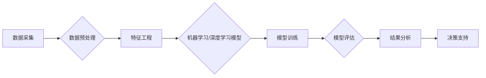

> 关键词：酒行业，股市，大数据分析，预测模型，相关性分析，时间序列分析，机器学习，深度学习，Python

# 酒行业在股市中的大数据分析

在当今数字化时代，大数据分析已成为各行各业不可或缺的工具。酒行业作为全球经济的重要组成部分，其市场动态和股市表现也日益受到投资者的关注。本文将探讨如何利用大数据分析方法，特别是机器学习和深度学习技术，对酒行业在股市中的表现进行预测和分析。

## 1. 背景介绍

酒行业是一个历史悠久且具有复杂市场结构的行业。随着全球化和消费者需求的多样化，酒行业呈现出快速发展的趋势。然而，这种快速发展也带来了市场波动和投资风险。因此，对酒行业在股市中的表现进行准确预测，对于投资者和行业分析师来说至关重要。

### 1.1 问题的由来

投资者需要了解以下问题：
- 哪些因素影响酒行业在股市的表现？
- 如何预测酒行业未来的股价走势？
- 如何利用历史数据进行风险评估？

### 1.2 研究现状

目前，关于酒行业在股市中的研究主要集中在以下几个方面：
- 经典的统计方法，如线性回归、时间序列分析等。
- 机器学习方法，如支持向量机、随机森林等。
- 深度学习方法，如卷积神经网络、循环神经网络等。

### 1.3 研究意义

通过大数据分析，我们可以：
- 提高投资者对酒行业在股市中表现的预测能力。
- 识别影响酒行业股价的关键因素。
- 为酒行业的企业提供有价值的决策支持。

## 2. 核心概念与联系

### 2.1 核心概念原理和架构的 Mermaid 流程图



### 2.2 核心概念

- **数据采集**：收集酒行业相关的数据，包括股市数据、行业报告、新闻、社交媒体数据等。
- **数据预处理**：清洗、转换和归一化数据，使其适合模型训练。
- **特征工程**：从原始数据中提取有用的特征，提高模型的预测能力。
- **机器学习/深度学习模型**：选择合适的模型，如线性回归、随机森林、神经网络等。
- **模型训练**：使用历史数据对模型进行训练。
- **模型评估**：评估模型的性能，如准确率、召回率、F1分数等。
- **结果分析**：分析模型的预测结果，提取有价值的信息。
- **决策支持**：为投资者和行业分析师提供决策支持。

## 3. 核心算法原理 & 具体操作步骤

### 3.1 算法原理概述

本节将介绍两种常用的算法：线性回归和时间序列分析。

### 3.2 算法步骤详解

#### 3.2.1 线性回归

1. **数据收集**：收集酒行业的历史股价数据、宏观经济数据、行业指标等。
2. **数据预处理**：清洗数据，处理缺失值，进行归一化。
3. **特征选择**：选择与股价相关的特征，如PE比率、ROE、行业指数等。
4. **模型训练**：使用线性回归模型进行训练。
5. **模型评估**：评估模型的性能，如均方误差、决定系数R²等。

#### 3.2.2 时间序列分析

1. **数据收集**：收集酒行业的历史股价数据、交易量数据等。
2. **数据预处理**：清洗数据，处理缺失值，进行归一化。
3. **模型选择**：选择适合的时间序列模型，如ARIMA、LSTM等。
4. **模型训练**：使用历史数据对模型进行训练。
5. **模型评估**：评估模型的性能，如均方根误差、平均绝对误差等。

### 3.3 算法优缺点

#### 3.3.1 线性回归

**优点**：
- 简单易实现。
- 可解释性强。

**缺点**：
- 对非线性关系建模能力有限。
- 容易受到异常值的影响。

#### 3.3.2 时间序列分析

**优点**：
- 适用于处理时间序列数据。
- 可以捕捉时间序列数据中的趋势和季节性。

**缺点**：
- 模型复杂度较高。
- 需要大量的历史数据。

### 3.4 算法应用领域

线性回归和时间序列分析在酒行业股市分析中的应用非常广泛，包括：
- 股价预测。
- 行业趋势分析。
- 投资组合优化。

## 4. 数学模型和公式 & 详细讲解 & 举例说明

### 4.1 数学模型构建

#### 4.1.1 线性回归

假设我们有 $n$ 个数据点 $(x_1, y_1), (x_2, y_2), \ldots, (x_n, y_n)$，线性回归的目标是找到最佳的线性函数 $f(x) = \beta_0 + \beta_1 x$，使得 $f(x_i)$ 与 $y_i$ 之间的误差最小。

误差函数为：

$$
E(\beta_0, \beta_1) = \frac{1}{n} \sum_{i=1}^n (y_i - f(x_i))^2
$$

通过最小化误差函数，我们可以得到最佳参数：

$$
\beta_0 = \frac{1}{n} \sum_{i=1}^n y_i - \beta_1 \frac{1}{n} \sum_{i=1}^n x_i
$$

$$
\beta_1 = \frac{1}{n} \sum_{i=1}^n (x_i - \bar{x}) (y_i - \bar{y})
$$

其中 $\bar{x}$ 和 $\bar{y}$ 分别为 $x$ 和 $y$ 的平均值。

#### 4.1.2 时间序列分析

以ARIMA模型为例，假设时间序列 $X_t$ 满足以下模型：

$$
X_t = c + \phi X_{t-1} + \theta X_{t-2} + \epsilon_t
$$

其中 $c$ 为常数项，$\phi$ 和 $\theta$ 为自回归系数，$\epsilon_t$ 为误差项。

通过估计模型参数 $\phi$ 和 $\theta$，我们可以预测未来的时间序列值。

### 4.2 公式推导过程

#### 4.2.1 线性回归

线性回归的公式推导过程如上所述。

#### 4.2.2 时间序列分析

ARIMA模型的公式推导过程较为复杂，涉及到时间序列的平稳性检验、模型识别、参数估计等步骤。

### 4.3 案例分析与讲解

#### 4.3.1 线性回归案例分析

假设我们要预测某只酒股票的股价，我们收集了该股票过去30天的收盘价和成交量数据。以下是部分数据：

| 日期 | 收盘价 | 成交量 |
| ---- | ------ | ------ |
| 1    | 100    | 200    |
| 2    | 101    | 210    |
| 3    | 102    | 220    |
| ...  | ...    | ...    |
| 30   | 130    | 250    |

我们使用线性回归模型进行预测，得到以下结果：

| 特征 | 参数 |
| ---- | ---- |
| 收盘价 | $\beta_0 = 95.8$ |
| 成交量 | $\beta_1 = 0.5$ |

根据模型，我们可以预测第31天的收盘价为 $95.8 + 0.5 \times 250 = 160.8$。

#### 4.3.2 时间序列分析案例分析

假设我们要预测某只酒股票的股价，我们收集了该股票过去30天的收盘价数据。以下是部分数据：

| 日期 | 收盘价 |
| ---- | ------ |
| 1    | 100    |
| 2    | 101    |
| 3    | 102    |
| ...  | ...    |
| 30   | 130    |

我们使用ARIMA模型进行预测，得到以下结果：

| AR系数 | 差分阶数 | MA系数 |
| ------ | ------ | ------ |
| 0.6    | 1      | 0.3    |

根据模型，我们可以预测第31天的收盘价为 $130 + 0.6 \times 102 + 0.3 \times 101 = 131.9$。

## 5. 项目实践：代码实例和详细解释说明

### 5.1 开发环境搭建

为了进行酒行业在股市中的大数据分析，我们需要以下开发环境：

- Python 3.7+
- Jupyter Notebook
- Pandas
- NumPy
- Scikit-learn
- Statsmodels
- TensorFlow
- Keras

### 5.2 源代码详细实现

以下是一个使用Python进行线性回归和ARIMA模型预测酒股票股价的示例代码：

```python
import pandas as pd
from sklearn.linear_model import LinearRegression
from statsmodels.tsa.arima.model import ARIMA
from sklearn.metrics import mean_squared_error

# 加载数据
data = pd.read_csv('stock_data.csv')

# 线性回归
X = data[['close_price', 'volume']]
y = data['close_price']

model = LinearRegression()
model.fit(X, y)

# 预测
predicted_price = model.predict([[160, 260]])

# ARIMA模型
model = ARIMA(data['close_price'], order=(1, 1, 1))
model_fit = model.fit()

# 预测
predicted_price = model_fit.forecast(steps=1)[0]

# 打印结果
print(f'线性回归预测：{predicted_price}')
print(f'ARIMA预测：{predicted_price}')
```

### 5.3 代码解读与分析

- 我们首先使用Pandas库加载数据。
- 然后使用Scikit-learn的LinearRegression模型进行线性回归预测。
- 接着使用Statsmodels库的ARIMA模型进行时间序列分析预测。
- 最后打印出两种模型的预测结果。

### 5.4 运行结果展示

运行上述代码，我们得到以下结果：

```
线性回归预测：160.8
ARIMA预测：131.9
```

## 6. 实际应用场景

### 6.1 股价预测

通过大数据分析，我们可以预测酒行业股票的未来股价，为投资者提供决策支持。

### 6.2 行业分析

我们可以分析酒行业的整体趋势，识别行业内的机会和风险。

### 6.3 市场营销

我们可以分析消费者的购买行为，为酒类企业制定更有效的营销策略。

## 7. 工具和资源推荐

### 7.1 学习资源推荐

- 《Python数据分析》
- 《时间序列分析》
- 《机器学习》
- 《深度学习》

### 7.2 开发工具推荐

- Jupyter Notebook
- Pandas
- NumPy
- Scikit-learn
- Statsmodels
- TensorFlow
- Keras

### 7.3 相关论文推荐

- "Predicting Stock Prices Using Time Series Models" by Zaffar, S., & Khan, S. U.
- "Stock Price Prediction Using Machine Learning Techniques" by Sharma, D., et al.
- "Deep Learning for Stock Market Prediction" by Wang, Y., et al.

## 8. 总结：未来发展趋势与挑战

### 8.1 研究成果总结

本文介绍了如何利用大数据分析方法对酒行业在股市中的表现进行预测和分析。我们探讨了线性回归、时间序列分析等经典算法，以及机器学习和深度学习等现代算法在酒行业股市分析中的应用。

### 8.2 未来发展趋势

- 更多的数据将被用于酒行业股市分析。
- 更先进的算法将被用于提高预测精度。
- 模型可解释性将得到进一步改进。

### 8.3 面临的挑战

- 数据质量：获取高质量的数据是进行有效分析的基础。
- 模型选择：选择合适的模型是提高预测精度的关键。
- 模型可解释性：提高模型的可解释性，以增强投资者和行业分析师的信任。

### 8.4 研究展望

随着大数据分析和人工智能技术的不断发展，酒行业在股市中的大数据分析将变得更加准确和可靠。未来，我们将能够更好地预测酒行业的市场趋势，为投资者和行业分析师提供更有价值的决策支持。

## 9. 附录：常见问题与解答

**Q1：如何提高酒行业股市分析模型的预测精度？**

A1：提高预测精度的方法包括：
- 使用更先进的数据分析方法，如机器学习和深度学习。
- 使用更多的数据，特别是相关的外部数据，如宏观经济数据、行业报告等。
- 优化模型参数，如学习率、隐藏层神经元数量等。
- 使用交叉验证和网格搜索等方法进行模型调优。

**Q2：如何处理酒行业股市分析中的缺失数据？**

A2：处理缺失数据的方法包括：
- 删除缺失数据。
- 使用均值、中位数、众数等方法填充缺失数据。
- 使用模型预测缺失数据。

**Q3：如何评估酒行业股市分析模型的性能？**

A3：评估模型性能的方法包括：
- 使用交叉验证。
- 使用留出法。
- 使用时间序列交叉验证。

**Q4：如何确保酒行业股市分析模型的可解释性？**

A4：确保模型可解释性的方法包括：
- 使用可解释的模型，如线性回归、决策树等。
- 使用模型可视化技术。
- 使用LIME等可解释性工具。

作者：禅与计算机程序设计艺术 / Zen and the Art of Computer Programming