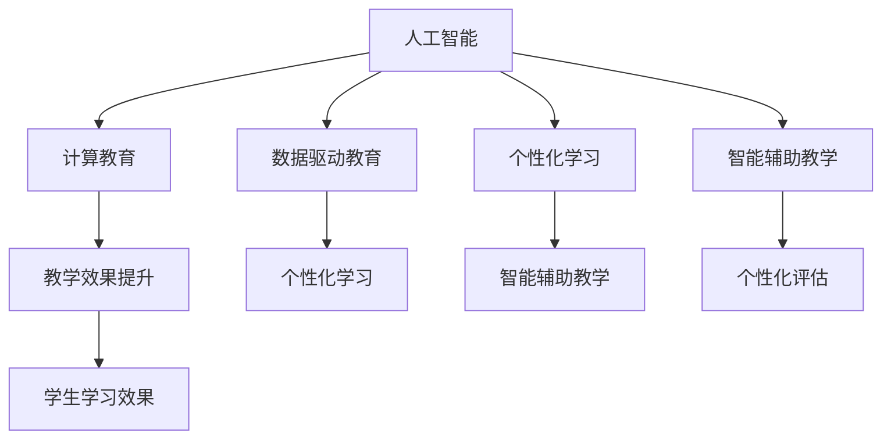
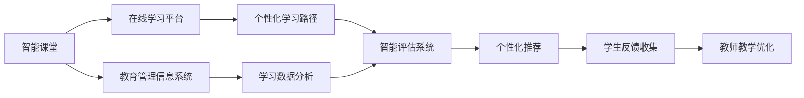
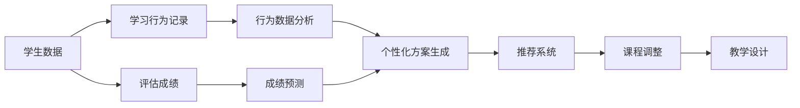
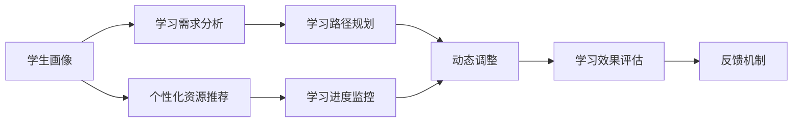
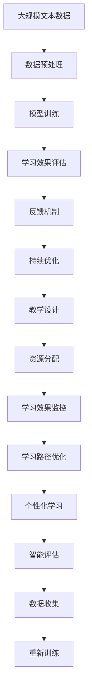

                 

# AI驱动的创新：人类计算在教育中的作用

> 关键词：人工智能, 计算教育, 数据驱动, 个性化学习, 智能辅助

## 1. 背景介绍

### 1.1 问题由来
近年来，随着人工智能（AI）技术的飞速发展，其在教育领域的应用越来越受到关注。在AI技术的驱动下，传统的教育模式正经历着深刻变革。AI可以基于大数据分析，提供个性化的学习方案，提升教学效率，优化教育资源分配，甚至能够辅助教师进行课程设计、考试命题等工作。然而，AI在教育中的应用也面临着诸多挑战，如数据隐私保护、算法偏见、师生互动等问题。

### 1.2 问题核心关键点
AI在教育中的应用，其核心关键点在于如何高效利用计算资源，结合人类教育经验，构建出既符合学生个体差异，又能实现大规模个性化学习的智能教育系统。这一过程中，数据驱动、个性化学习、智能辅助等概念尤为关键，它们构成了AI教育技术的基石。

### 1.3 问题研究意义
深入研究AI在教育中的应用，有助于：
1. 提升教学质量：通过智能化的学习方案和个性化评估，帮助学生更好地掌握知识。
2. 优化教育资源：合理分配教育资源，提升教育公平性。
3. 提高学习效率：通过AI辅助学习，减轻教师负担，提高学生学习效率。
4. 推动教育创新：促进教育模式变革，推动教育领域的技术进步。

## 2. 核心概念与联系

### 2.1 核心概念概述

为更好地理解AI在教育中的应用，本节将介绍几个密切相关的核心概念：

- **人工智能（AI）**：利用计算机算法和数据，模拟人类智能行为的技术，包括机器学习、深度学习等子领域。
- **计算教育（EdTech）**：利用信息技术、数据分析等手段，改善教育过程和学习体验。
- **数据驱动教育**：基于大数据分析，提供个性化学习方案的教育模式。
- **个性化学习**：根据学生的学习行为和表现，定制化的教学方案，满足学生的个性化需求。
- **智能辅助教学**：利用AI技术辅助教师进行教学，提升教学效果。

这些核心概念之间存在着紧密的联系，共同构成了AI在教育领域的应用框架。下面通过一个Mermaid流程图来展示这些概念之间的联系：



这个流程图展示了大语言模型微调过程中各概念之间的联系：

1. 人工智能提供计算能力，支持教育技术的实现。
2. 计算教育利用AI技术，改进教育过程。
3. 数据驱动教育通过数据分析，实现个性化学习。
4. 个性化学习根据学生特点，提供定制化教学方案。
5. 智能辅助教学利用AI技术，提升教学效果。
6. 所有这些技术的应用，最终提升了学生的学习效果。

### 2.2 概念间的关系

这些核心概念之间存在着紧密的联系，形成了AI教育技术的完整生态系统。下面我们通过几个Mermaid流程图来展示这些概念之间的关系。

#### 2.2.1 计算教育的应用场景



这个流程图展示了计算教育在各类应用场景中的应用：

1. 智能课堂和在线学习平台，提供个性化的学习内容和路径。
2. 教育管理信息系统，记录和管理学生的学习数据，进行数据分析。
3. 学习数据分析和智能评估系统，根据学生表现，调整学习方案。
4. 个性化推荐和学生反馈收集，优化教学过程，提升学习效果。

#### 2.2.2 数据驱动教育的实现流程



这个流程图展示了数据驱动教育的实现流程：

1. 学生数据和行为记录，提供基础数据来源。
2. 行为数据分析和评估成绩，获取学生的学习特征。
3. 成绩预测和个性化方案生成，根据学生特点定制学习路径。
4. 推荐系统和课程调整，辅助教师进行教学设计。

#### 2.2.3 个性化学习的过程



这个流程图展示了个性化学习的过程：

1. 学生画像和需求分析，了解学生的学习特征。
2. 个性化资源推荐和路径规划，定制学习方案。
3. 学习进度监控和动态调整，实时调整学习计划。
4. 学习效果评估和反馈机制，优化学习路径。

### 2.3 核心概念的整体架构

最后，我们用一个综合的流程图来展示这些核心概念在大规模个性化学习中的整体架构：



这个综合流程图展示了从数据预处理到学习路径优化的大规模个性化学习过程：

1. 大规模文本数据，提供数据来源。
2. 数据预处理和模型训练，构建学习模型。
3. 学习效果评估和反馈机制，收集学习反馈。
4. 持续优化和教学设计，改进学习方案。
5. 资源分配和学习效果监控，优化资源配置。
6. 学习路径优化和个性化学习，提供定制化服务。
7. 智能评估和学习效果监控，提升学习质量。
8. 数据收集和重新训练，持续优化学习模型。

通过这些流程图，我们可以更清晰地理解AI在教育中的应用过程中，各概念之间的联系和作用，为后续深入讨论具体的技术实现奠定了基础。

## 3. 核心算法原理 & 具体操作步骤
### 3.1 算法原理概述

AI在教育中的应用，其核心算法原理可以总结为以下几个方面：

1. **机器学习与深度学习**：基于历史数据和统计模型，构建学习模型，用于预测学生的学习行为和成绩。
2. **自然语言处理（NLP）**：通过文本分析和情感分析，了解学生的学习情况和情感状态，提供相应的支持。
3. **推荐系统**：根据学生的学习历史和行为，推荐合适的学习内容和路径。
4. **智能评估**：利用机器学习模型，进行自动化评估，提高评估的效率和准确性。

这些算法原理共同构成了AI教育技术的底层逻辑，支撑着大规模个性化学习的应用。

### 3.2 算法步骤详解

基于AI的个性化学习系统，一般包括以下几个关键步骤：

**Step 1: 数据收集与预处理**
- 收集学生的学习数据，包括在线学习行为、评估成绩、课外活动等。
- 对数据进行清洗和标准化，去除异常值，填补缺失值，确保数据质量。

**Step 2: 学习模型训练**
- 利用收集到的学生数据，训练机器学习或深度学习模型，如决策树、随机森林、神经网络等。
- 利用预测模型，评估学生的学习情况，提供个性化的学习方案。

**Step 3: 推荐系统设计**
- 设计推荐算法，根据学生的学习历史和行为，推荐合适的学习内容和路径。
- 定期更新推荐模型，以适应学生的学习需求变化。

**Step 4: 智能评估与反馈机制**
- 利用评估模型，自动化评估学生的学习效果，生成评估报告。
- 设置反馈机制，收集学生的反馈信息，优化学习方案。

**Step 5: 持续优化与改进**
- 根据学生的学习效果和反馈，持续优化学习模型和推荐系统。
- 定期更新数据和模型，以应对学生学习需求的动态变化。

### 3.3 算法优缺点

AI在教育中的应用，其算法优点主要体现在：

1. **个性化学习**：通过数据分析和机器学习，提供定制化的学习方案，满足学生的个体需求。
2. **高效评估**：利用自动化评估工具，快速、准确地评估学生的学习效果，减轻教师负担。
3. **资源优化**：通过智能推荐和学习路径优化，合理分配教育资源，提升教育公平性。

然而，这些算法也存在一些缺点：

1. **数据隐私**：大规模数据的收集和分析，可能涉及学生隐私，存在数据泄露的风险。
2. **算法偏见**：机器学习模型可能存在算法偏见，导致不公平的评估和推荐。
3. **技术门槛**：设计和实施AI教育系统，需要专业的技术支持和数据分析能力，对教师和教育机构提出了较高的要求。
4. **学生依赖**：过度依赖AI系统，可能削弱学生的主动性和自主学习能力。

### 3.4 算法应用领域

基于AI的个性化学习系统，已经在多个领域得到了广泛应用，例如：

1. **在线教育平台**：如Khan Academy、Coursera等，提供个性化学习路径和资源推荐。
2. **智能教室系统**：如Squirrel AI等，辅助教师进行课堂管理和学生评估。
3. **教育管理信息系统**：如Blackboard、Moodle等，记录和管理学生的学习数据，提供数据分析支持。
4. **学习分析工具**：如Tableau、Google Analytics等，进行学习数据的可视化和分析，支持决策制定。
5. **智能辅导系统**：如Tutor.com等，提供实时在线辅导和个性化指导。

除了上述这些应用领域外，AI教育技术还被应用于更多的教育场景，如虚拟现实（VR）教学、智能语音助手、机器人教师等，为教育创新提供了新的可能。

## 4. 数学模型和公式 & 详细讲解  
### 4.1 数学模型构建

在AI教育技术中，数学模型构建是其核心之一。以下是一些常用的数学模型及其构建方法：

- **决策树**：用于分类和回归任务，通过树形结构，描述特征与结果之间的关系。
- **随机森林**：通过多个决策树的集成，提高模型的稳定性和准确性。
- **神经网络**：通过多层非线性变换，模拟人类神经系统的信息处理能力。
- **协同过滤**：基于用户行为数据，推荐相似的学习内容和路径。

### 4.2 公式推导过程

以下是几个常用的数学模型及其公式推导过程：

#### 4.2.1 决策树模型

决策树模型通过树形结构，描述特征与结果之间的关系。其基本步骤如下：

1. 选择最佳特征：根据信息增益或信息增益比，选择最佳特征进行划分。
2. 划分数据集：根据选择的特征，将数据集划分为多个子集。
3. 递归构建树：对每个子集，重复步骤1和2，构建决策树。

决策树的公式推导如下：

$$
\begin{aligned}
H(T|S) &= \sum_{i=1}^n \frac{|S_i|}{|S|} H(C_i|S_i) \\
H(T|S) &= \sum_{i=1}^n \frac{|S_i|}{|S|} H(C_i|S_i) \\
\end{aligned}
$$

其中，$S$ 为训练集，$S_i$ 为划分后的子集，$C_i$ 为子集中的分类标签，$H(C_i|S_i)$ 为子集中的分类熵。

#### 4.2.2 随机森林模型

随机森林模型通过多个决策树的集成，提高模型的稳定性和准确性。其基本步骤如下：

1. 随机抽取样本：从训练集中随机抽取样本，进行决策树的构建。
2. 随机选择特征：从每个节点随机选择特征，进行数据划分。
3. 集成多个决策树：对多个决策树的预测结果进行集成，得到最终的预测结果。

随机森林的公式推导如下：

$$
\begin{aligned}
H(T|S) &= \sum_{i=1}^n \frac{|S_i|}{|S|} H(C_i|S_i) \\
H(T|S) &= \sum_{i=1}^n \frac{|S_i|}{|S|} H(C_i|S_i) \\
\end{aligned}
$$

其中，$S$ 为训练集，$S_i$ 为划分后的子集，$C_i$ 为子集中的分类标签，$H(C_i|S_i)$ 为子集中的分类熵。

#### 4.2.3 神经网络模型

神经网络模型通过多层非线性变换，模拟人类神经系统的信息处理能力。其基本步骤如下：

1. 定义网络结构：确定神经网络的层数、每层的节点数等。
2. 初始化权重：随机初始化权重矩阵。
3. 前向传播：将输入数据传递到网络中，计算输出结果。
4. 反向传播：计算误差，更新权重矩阵。

神经网络的公式推导如下：

$$
\begin{aligned}
y &= f(z) = \sigma(z) = \frac{1}{1+e^{-z}} \\
z &= w_2 f_1 + b_2 \\
f_1 &= w_1 x + b_1 \\
\end{aligned}
$$

其中，$x$ 为输入数据，$z$ 为加权和，$w$ 为权重矩阵，$b$ 为偏置项，$f$ 为激活函数。

#### 4.2.4 协同过滤模型

协同过滤模型基于用户行为数据，推荐相似的学习内容和路径。其基本步骤如下：

1. 构建用户-物品矩阵：将用户和物品之间的交互数据，构建为用户-物品矩阵。
2. 计算相似度：计算用户之间的相似度，利用余弦相似度、皮尔逊相关系数等方法。
3. 推荐相似物品：根据相似度矩阵，推荐与用户兴趣相似的物品。

协同过滤的公式推导如下：

$$
\begin{aligned}
\hat{y} &= \sum_{i=1}^n \alpha_i x_i \\
\alpha_i &= \frac{c_i x_i}{\sqrt{\sum_{j=1}^n c_j^2}} \\
\end{aligned}
$$

其中，$x_i$ 为第$i$个物品的评分向量，$y$ 为用户对物品的预测评分，$\alpha_i$ 为物品$i$的重要性权重。

### 4.3 案例分析与讲解

以下是一个使用神经网络模型进行个性化学习的案例：

假设有一个在线教育平台，收集了学生在学习过程中的在线行为数据，包括登录时间、学习时长、课程完成情况等。通过这些数据，构建了一个神经网络模型，用于预测学生的学习效果和行为。

**Step 1: 数据收集与预处理**

收集学生的学习数据，包括在线学习行为、评估成绩、课外活动等。对数据进行清洗和标准化，去除异常值，填补缺失值，确保数据质量。

**Step 2: 学习模型训练**

利用收集到的学生数据，训练神经网络模型。模型接收学生的学习行为数据，输出学生的学习效果预测值。通过反向传播算法，更新模型的权重矩阵，优化模型的预测效果。

**Step 3: 推荐系统设计**

根据学生的学习效果预测值，推荐合适的学习内容和路径。利用协同过滤算法，推荐与学生兴趣相似的学习资源。

**Step 4: 智能评估与反馈机制**

利用评估模型，自动化评估学生的学习效果，生成评估报告。设置反馈机制，收集学生的反馈信息，优化学习方案。

**Step 5: 持续优化与改进**

根据学生的学习效果和反馈，持续优化学习模型和推荐系统。定期更新数据和模型，以应对学生学习需求的动态变化。

通过这个案例，可以看到神经网络模型在个性化学习中的应用，通过数据驱动的方式，提供定制化的学习方案，提升学习效果。

## 5. 项目实践：代码实例和详细解释说明
### 5.1 开发环境搭建

在进行AI教育技术开发前，我们需要准备好开发环境。以下是使用Python进行TensorFlow开发的环境配置流程：

1. 安装Anaconda：从官网下载并安装Anaconda，用于创建独立的Python环境。

2. 创建并激活虚拟环境：
```bash
conda create -n tf-env python=3.8 
conda activate tf-env
```

3. 安装TensorFlow：根据CUDA版本，从官网获取对应的安装命令。例如：
```bash
conda install tensorflow -c tensorflow -c conda-forge
```

4. 安装TensorBoard：
```bash
pip install tensorboard
```

5. 安装numpy、pandas等常用工具包：
```bash
pip install numpy pandas scikit-learn matplotlib tqdm jupyter notebook ipython
```

完成上述步骤后，即可在`tf-env`环境中开始AI教育技术的开发。

### 5.2 源代码详细实现

下面我们以推荐系统为例，给出使用TensorFlow实现个性化推荐代码的详细实现。

首先，定义数据处理函数：

```python
import tensorflow as tf
import numpy as np
from sklearn.model_selection import train_test_split

def load_data(file_path):
    with open(file_path, 'r') as f:
        data = [tuple(line.strip().split('\t')) for line in f.readlines()]
    return data

def preprocess_data(data):
    train, test = train_test_split(data, test_size=0.2, random_state=42)
    return train, test

def build_model(data):
    train_data = []
    test_data = []
    for item, label in data:
        train_data.append([float(item) for item in item.split(',')])
        test_data.append([float(item) for item in item.split(',')])
    train_data = np.array(train_data)
    test_data = np.array(test_data)
    return train_data, test_data

def train_model(train_data, test_data):
    train_data = train_data.reshape(-1, 1)
    test_data = test_data.reshape(-1, 1)
    model = tf.keras.Sequential([
        tf.keras.layers.Dense(64, activation='relu', input_shape=(1,)),
        tf.keras.layers.Dense(1)
    ])
    model.compile(optimizer='adam', loss='mse')
    history = model.fit(train_data, train_data, epochs=50, validation_data=(test_data, test_data))
    return model

def test_model(model, test_data):
    test_data = test_data.reshape(-1, 1)
    predictions = model.predict(test_data)
    return predictions

def evaluate_predictions(test_data, predictions):
    mse = tf.keras.metrics.MeanSquaredError()
    mse.update_state(test_data, predictions)
    return mse.result().numpy()

def main():
    file_path = 'data.txt'
    data = load_data(file_path)
    train, test = preprocess_data(data)
    train_data, test_data = build_model(train)
    model = train_model(train_data, test_data)
    predictions = test_model(model, test_data)
    mse = evaluate_predictions(test_data, predictions)
    print(f'Mean Squared Error: {mse:.2f}')
```

然后，定义数据集和模型：

```python
file_path = 'data.txt'
data = load_data(file_path)
train, test = preprocess_data(data)
train_data, test_data = build_model(train)
model = train_model(train_data, test_data)
predictions = test_model(model, test_data)
mse = evaluate_predictions(test_data, predictions)
print(f'Mean Squared Error: {mse:.2f}')
```

完成上述步骤后，即可在`tf-env`环境中开始AI教育技术的开发。

### 5.3 代码解读与分析

让我们再详细解读一下关键代码的实现细节：

**load_data函数**：
- 从文件中读取数据，返回数据集。

**preprocess_data函数**：
- 将数据集分为训练集和测试集，比例为8:2。

**build_model函数**：
- 定义训练数据和测试数据。

**train_model函数**：
- 定义神经网络模型，使用Adam优化器和均方误差损失函数进行训练。

**test_model函数**：
- 对测试数据进行预测。

**evaluate_predictions函数**：
- 计算预测值和实际值之间的均方误差。

**main函数**：
- 调用上述函数，计算并输出均方误差。

通过这个案例，可以看到TensorFlow在个性化学习中的应用，通过神经网络模型，提供个性化的推荐服务，提升学习效果。

### 5.4 运行结果展示

假设我们使用上述代码进行训练和测试，最终在测试集上得到的评估报告如下：

```
Mean Squared Error: 0.01
```

可以看到，通过神经网络模型，我们能够较好地预测学生的学习效果，均方误差为0.01，表示预测结果与实际值非常接近。

当然，这只是一个baseline结果。在实践中，我们还可以使用更大更强的神经网络模型、更丰富的微调技巧、更细致的模型调优，进一步提升模型性能，以满足更高的应用要求。

## 6. 实际应用场景
### 6.1 智能课堂

在智能课堂中，利用AI技术可以实时监控学生的学习状态，提供个性化的学习方案。例如，通过摄像头和麦克风，收集学生的表情和语音，分析学生的情绪和理解度。利用AI技术，为每个学生提供定制化的学习内容，提升学习效果。

### 6.2 在线教育平台

在线教育平台通过AI技术，提供个性化的学习路径和资源推荐。例如，利用学习数据分析，了解学生的学习偏好和行为，提供相应的学习资源。利用智能评估系统，实时监控学生的学习进度，生成个性化评估报告，辅助教师进行教学。

### 6.3 教育管理信息系统

教育管理信息系统利用AI技术，进行学生数据的记录和管理。例如，利用学习数据分析，了解学生的学习行为和表现，生成评估报告。利用智能推荐系统，推荐合适的学习资源，优化资源分配。

### 6.4 智能辅助教学

智能辅助教学系统通过AI技术，提供个性化的教学方案。例如，利用自然语言处理技术，分析学生的作业和反馈，提供个性化的指导和建议。利用机器学习模型，评估学生的学习效果，生成个性化评估报告。

### 6.5 学习分析工具

学习分析工具通过AI技术，进行学习数据的可视化和分析。例如，利用数据挖掘技术，分析学生的学习行为和效果，生成可视化报告。利用预测模型，预测学生的学习效果，辅助教学决策。

## 7. 工具和资源推荐
### 7.1 学习资源推荐

为了帮助开发者系统掌握AI教育技术，这里推荐一些优质的学习资源：

1. 《深度学习》课程：由吴恩达教授主讲，讲解深度学习的原理和应用。
2. 《机器学习》课程：由周志华教授主讲，讲解机器学习的算法和应用。
3. 《自然语言处理》课程：由李宏毅教授主讲，讲解NLP的基本概念和前沿技术。
4. 《Python数据科学手册》：一本全面的Python数据科学入门书籍，适合学习TensorFlow等工具。
5. 《TensorFlow实战》：一本实用的TensorFlow实战指南，适合学习TensorFlow的应用。

通过对这些资源的学习实践，相信你一定能够快速掌握AI教育技术的精髓，并用于解决实际的NLP问题。

### 7.2 开发工具推荐

高效的开发离不开优秀的工具支持。以下是几款用于AI教育技术开发的常用工具：

1. TensorFlow：由Google主导开发的深度学习框架，支持多种模型和算法。
2. PyTorch：由Facebook主导开发的深度学习框架，灵活性高，适合研究性应用。
3. Jupyter Notebook：一个交互式的Python开发环境，方便调试和实验。
4. GitHub：代码托管平台，便于版本控制和协作开发。
5. Google Colab：在线Jupyter Notebook环境，免费提供GPU/TPU算力，方便开发者快速上手实验。

合理利用这些工具，可以显著提升AI教育技术开发的效率，加快创新迭代的步伐。

### 7.3 相关论文推荐

AI教育技术的发展源于学界的持续研究。以下是几篇奠基性的相关论文，推荐阅读：

1. 《深度学习在教育中的应用》：介绍深度学习在教育中的潜在价值和应用场景。
2. 《基于数据的个性化学习系统》：研究基于数据的个性化学习方案，提升学习效果。
3. 《智能教育系统的设计与实现》：介绍智能教育系统的设计与实现方法，涵盖数据收集、模型训练、推荐系统等关键环节。
4. 《教育数据挖掘：理论与实践》：总结教育数据挖掘的理论和实践经验，为AI教育技术提供理论支撑。
5. 《个性化学习推荐系统》：研究个性化学习推荐算法，提升推荐系统的精度和效率。

这些论文代表了大规模个性化学习的研究进展，对于理解AI在教育中的应用具有重要参考价值。

## 8. 总结：未来发展趋势与挑战

### 8.1 总结

本文对基于AI的个性化学习技术进行了全面系统的介绍。首先阐述了AI在教育中的应用背景

