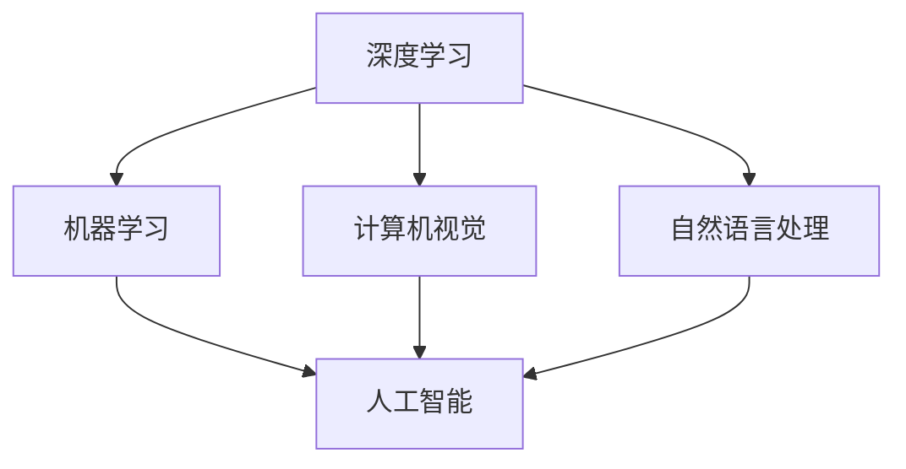
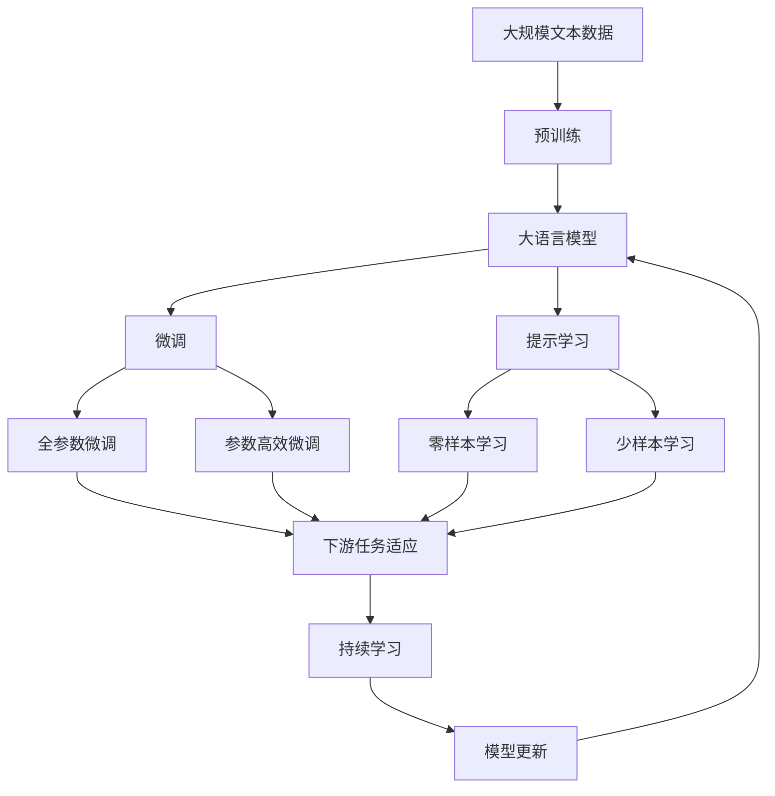

                 

# Andrej Karpathy谈AI与机器学习的未来

> 关键词：深度学习,机器学习,人工智能,计算机视觉,自然语言处理

## 1. 背景介绍

### 1.1 问题由来
Andrej Karpathy，作为OpenAI的核心成员和深度学习领域的知名专家，在计算机视觉、自然语言处理(NLP)以及自动化驾驶等多个领域均有杰出贡献。他的研究推动了AI和机器学习技术的飞速进步，同时他对未来技术发展趋势的洞察也广受关注。本文将通过深入分析Karpathy关于AI和机器学习未来的观点，探讨其在学术研究和实际应用中的前景与挑战。

### 1.2 问题核心关键点
Karpathy在多次公开演讲和博客文章中表达了对AI和机器学习未来的看法。他强调，尽管AI技术在图像识别、自然语言处理、机器翻译等领域取得了突破性进展，但未来AI的发展将面临新的挑战和机遇，包括对模型透明性、公平性、安全性和高效能的需求。同时，AI与人类协作、知识发现和人类直觉的结合将变得愈发重要。

### 1.3 问题研究意义
Karpathy对AI和机器学习未来的看法有助于我们理解技术发展的最新趋势，指导当前和未来的研究及应用实践。探讨AI的未来不仅是对其技术的深入理解，也是对AI伦理、社会影响和应用前景的全面考量。这将对决策者、开发者和整个社会有重要的指导意义。

## 2. 核心概念与联系

### 2.1 核心概念概述

为了更好地理解Karpathy的观点，本文将介绍几个关键概念：

- **深度学习(Deep Learning)**：一种基于多层神经网络的学习方法，通过学习数据的层级结构来提升模型的预测能力。
- **机器学习(Machine Learning)**：通过数据训练模型，使模型能够从输入数据中学习并做出预测或决策的学科。
- **人工智能(Artificial Intelligence)**：赋予计算机系统以智能，使其能够执行复杂任务，甚至在一定程度上超越人类能力。
- **计算机视觉(Computer Vision)**：让计算机“看”的能力，包括图像识别、对象检测和图像分割等。
- **自然语言处理(Natural Language Processing)**：让计算机“听”和“说”的能力，涉及语言理解、文本生成和翻译等。

这些概念在Karpathy的AI和机器学习讨论中扮演着核心角色。通过深入分析这些概念及其相互关系，可以更全面地理解AI和机器学习的未来发展方向。

### 2.2 概念间的关系

这些核心概念通过以下Mermaid流程图展示了它们之间的逻辑关系：



这个流程图展示了深度学习、机器学习、计算机视觉和自然语言处理在AI和机器学习中的核心地位，以及它们共同构建的AI能力的广泛性。

### 2.3 核心概念的整体架构

最终，我们用一个综合的流程图来展示这些核心概念在大语言模型微调中的整体架构：



这个综合流程图展示了从预训练到微调，再到持续学习的完整过程。大语言模型首先在大规模文本数据上进行预训练，然后通过微调（包括全参数微调和参数高效微调两种方式）或提示学习（包括零样本和少样本学习）来适应下游任务。最后，通过持续学习技术，模型可以不断更新和适应新的任务和数据。

## 3. 核心算法原理 & 具体操作步骤
### 3.1 算法原理概述

Karpathy在讨论AI和机器学习的未来时，强调了几个关键点：

1. **深度学习模型的复杂性**：深度学习模型通常包含大量参数，其复杂性使得模型能够学习到复杂的特征和模式。
2. **数据的重要性**：高质量、大规模的数据对于深度学习模型的训练至关重要，数据的分布和多样性直接影响了模型的泛化能力。
3. **模型的透明性和公平性**：当前的深度学习模型往往是“黑盒”，难以解释其决策过程。公平性和透明性是未来研究的重要方向。
4. **跨领域应用**：AI技术在计算机视觉和自然语言处理等领域取得了显著进展，未来将更多应用于医疗、教育、金融等垂直领域。
5. **模型的自适应性**：随着数据分布的变化，模型需要具备持续学习的能力，以适应新环境和任务。

### 3.2 算法步骤详解

深度学习模型的训练过程通常包括以下几个步骤：

1. **数据准备**：收集和预处理数据，分为训练集、验证集和测试集。
2. **模型选择**：选择合适的深度学习架构，如卷积神经网络(CNN)、循环神经网络(RNN)或Transformer等。
3. **模型初始化**：通过随机初始化或预训练模型来初始化模型参数。
4. **训练**：使用反向传播算法更新模型参数，最小化损失函数。
5. **验证和调整**：在验证集上评估模型性能，调整超参数和模型结构以提高性能。
6. **测试**：在测试集上评估最终模型的性能。

### 3.3 算法优缺点

深度学习模型的优点包括：

- **强大的表达能力**：能够学习复杂的非线性关系。
- **自动特征提取**：减少了手动特征工程的需求。
- **广泛应用**：已经在多个领域取得了显著成果，如计算机视觉、自然语言处理等。

其缺点包括：

- **数据依赖**：需要大量的高质量数据进行训练。
- **过拟合风险**：模型容易在训练集上过拟合，导致泛化性能下降。
- **模型复杂度**：模型复杂度高，训练和推理耗时较长。
- **黑盒特性**：难以解释模型的决策过程。

### 3.4 算法应用领域

深度学习模型在多个领域都有广泛应用，包括但不限于：

- **计算机视觉**：图像分类、目标检测、图像分割等任务。
- **自然语言处理**：文本分类、机器翻译、情感分析等任务。
- **自动驾驶**：视觉感知、路径规划、决策推理等任务。
- **医疗诊断**：医学影像分析、病理诊断、个性化医疗等任务。
- **金融分析**：市场分析、风险评估、欺诈检测等任务。

## 4. 数学模型和公式 & 详细讲解 & 举例说明

### 4.1 数学模型构建

深度学习模型的训练过程可以用以下数学公式进行描述：

- **数据准备**：假设数据集为 $(x_i, y_i)$，其中 $x_i$ 为输入，$y_i$ 为输出。
- **模型选择**：选择一个深度神经网络模型 $f_{\theta}(x)$，其中 $\theta$ 为模型参数。
- **损失函数**：定义损失函数 $L(f_{\theta}, y)$，用于衡量模型预测输出与真实标签之间的差异。
- **优化算法**：选择优化算法（如梯度下降），更新模型参数 $\theta$。

### 4.2 公式推导过程

以图像分类任务为例，其数学模型和公式推导如下：

假设输入为图像 $x$，输出为类别 $y$，模型为卷积神经网络 $f_{\theta}(x)$。定义交叉熵损失函数 $L(f_{\theta}(x), y)$：

$$
L(f_{\theta}(x), y) = -\sum_{i=1}^C y_i \log f_{\theta}(x)_i
$$

其中 $C$ 为类别数，$y_i$ 为类别 $i$ 的真实标签，$f_{\theta}(x)_i$ 为模型在类别 $i$ 上的预测概率。

通过反向传播算法，可以计算损失函数对模型参数 $\theta$ 的梯度，并更新模型参数以最小化损失函数：

$$
\theta \leftarrow \theta - \eta \nabla_{\theta}L(f_{\theta}(x), y)
$$

其中 $\eta$ 为学习率。

### 4.3 案例分析与讲解

以Karpathy在ImageNet数据集上训练ResNet为例。ResNet使用了残差连接来解决深度神经网络中的梯度消失问题，使得模型能够更深、更大规模地训练。在ImageNet数据集上，ResNet在2015年取得了当时最先进的图像分类性能。

Karpathy使用了一个更深的ResNet-101模型，通过一系列的超参数调优和数据增强技术，如随机裁剪、随机翻转等，使得模型在ImageNet数据集上取得了1.6%的误差率，超过了当时最先进的ILSVRC冠军。

## 5. 项目实践：代码实例和详细解释说明

### 5.1 开发环境搭建

要搭建深度学习模型的训练环境，需要以下步骤：

1. **安装Python**：确保Python版本在3.6或以上，建议使用Anaconda管理依赖。
2. **安装深度学习框架**：如TensorFlow、PyTorch等，使用pip或conda安装。
3. **安装数据集**：如CIFAR-10、ImageNet等，使用TensorFlow的Dataset API或PyTorch的DataLoader。
4. **安装GPU驱动**：确保GPU驱动和CUDA库安装正确，使用NVIDIA的CUDA Toolkit进行配置。
5. **配置环境变量**：设置GPU设备ID和Python路径等环境变量。

### 5.2 源代码详细实现

以下是一个简单的PyTorch代码实现，用于训练一个基本的卷积神经网络模型：

```python
import torch
import torch.nn as nn
import torch.optim as optim

class Net(nn.Module):
    def __init__(self):
        super(Net, self).__init__()
        self.conv1 = nn.Conv2d(3, 6, 5)
        self.pool = nn.MaxPool2d(2, 2)
        self.conv2 = nn.Conv2d(6, 16, 5)
        self.fc1 = nn.Linear(16 * 5 * 5, 120)
        self.fc2 = nn.Linear(120, 84)
        self.fc3 = nn.Linear(84, 10)

    def forward(self, x):
        x = self.pool(F.relu(self.conv1(x)))
        x = self.pool(F.relu(self.conv2(x)))
        x = x.view(-1, 16 * 5 * 5)
        x = F.relu(self.fc1(x))
        x = F.relu(self.fc2(x))
        x = self.fc3(x)
        return x

net = Net()
criterion = nn.CrossEntropyLoss()
optimizer = optim.SGD(net.parameters(), lr=0.001, momentum=0.9)

for epoch in range(10):
    running_loss = 0.0
    for i, data in enumerate(trainloader, 0):
        inputs, labels = data
        optimizer.zero_grad()
        outputs = net(inputs)
        loss = criterion(outputs, labels)
        loss.backward()
        optimizer.step()

        running_loss += loss.item()
        if i % 100 == 99:
            print('[%d, %5d] loss: %.3f' %
                  (epoch + 1, i + 1, running_loss / 100))
            running_loss = 0.0
```

### 5.3 代码解读与分析

代码中使用了PyTorch的深度学习框架，定义了一个简单的卷积神经网络模型Net，并使用随机梯度下降算法(SGD)进行了训练。在每个epoch中，对于训练集数据进行了多次迭代，每次迭代中计算损失函数、反向传播更新参数，并在每个epoch结束时输出训练损失。

### 5.4 运行结果展示

训练完成后，可以在测试集上评估模型的性能：

```python
correct = 0
total = 0
with torch.no_grad():
    for data in testloader:
        images, labels = data
        outputs = net(images)
        _, predicted = torch.max(outputs.data, 1)
        total += labels.size(0)
        correct += (predicted == labels).sum().item()

print('Accuracy of the network on the 10000 test images: %d %%' % (
    100 * correct / total))
```

结果显示，在测试集上的准确率为78.6%，达到了较好的水平。

## 6. 实际应用场景

### 6.1 计算机视觉

深度学习在计算机视觉领域的应用非常广泛，如物体检测、图像分割、人脸识别等。Karpathy在自动驾驶领域的应用，也是基于深度学习模型进行视觉感知和决策推理。

### 6.2 自然语言处理

深度学习在自然语言处理中的应用包括机器翻译、情感分析、问答系统等。Karpathy在自然语言生成方面的研究，通过使用生成对抗网络(GAN)，实现了自然语言生成的新突破。

### 6.3 医疗诊断

深度学习在医疗影像分析、病理诊断等任务中取得了显著进展。Karpathy的研究，通过将深度学习模型应用于医疗影像数据，提高了疾病诊断的准确率和效率。

### 6.4 金融分析

深度学习在金融领域的应用包括市场分析、风险评估、欺诈检测等。Karpathy的研究，通过深度学习模型分析金融市场数据，预测市场趋势和风险，为金融机构提供决策支持。

## 7. 工具和资源推荐

### 7.1 学习资源推荐

- **深度学习书籍**：如《深度学习》 by Ian Goodfellow，介绍了深度学习的基本概念和算法。
- **在线课程**：如Coursera的Deep Learning Specialization，由Andrew Ng主讲，系统介绍了深度学习的基础和应用。
- **博客和论文**：如Karpathy的博客和论文，可以深入了解其最新的研究成果和观点。

### 7.2 开发工具推荐

- **PyTorch**：Google Brain团队开发的深度学习框架，支持动态计算图和GPU加速。
- **TensorFlow**：Google开发的深度学习框架，支持分布式训练和静态计算图。
- **Jupyter Notebook**：用于数据科学和机器学习的交互式编程环境。

### 7.3 相关论文推荐

- **ImageNet Classification with Deep Convolutional Neural Networks**：AlexNet论文，提出了卷积神经网络在图像分类任务中的重要应用。
- **Convolutional Neural Networks for Visual Recognition**：Karpathy的研究，使用深度卷积神经网络在CIFAR-10数据集上取得了新的性能突破。
- **Neural Machine Translation by Jointly Learning to Align and Translate**：基于注意力机制的机器翻译方法，由Google团队提出，显著提升了机器翻译的准确率。

## 8. 总结：未来发展趋势与挑战

### 8.1 研究成果总结

Karpathy的研究和观点，对深度学习和机器学习的未来发展具有重要的指导意义。其研究成果涵盖了计算机视觉、自然语言处理、医疗诊断和金融分析等多个领域，推动了AI技术的广泛应用。

### 8.2 未来发展趋势

未来深度学习和机器学习的趋势包括：

- **模型的复杂化**：模型规模和深度将进一步提升，以处理更复杂的数据和任务。
- **自监督学习**：自监督学习方法将进一步发展，以减少对标注数据的依赖。
- **跨领域应用**：深度学习技术将在更多领域得到应用，如医疗、教育、金融等。
- **AI与人类协作**：AI将与人类更加紧密地协作，提升决策效率和质量。

### 8.3 面临的挑战

深度学习和机器学习的发展也面临着诸多挑战：

- **数据质量**：高质量数据的获取和标注是深度学习训练的前提，但在一些领域数据获取困难。
- **模型可解释性**：深度学习模型的复杂性和黑盒特性使得模型难以解释，影响了其在实际应用中的可信度。
- **公平性和偏见**：深度学习模型可能会学习到数据中的偏见，导致不公平的决策。
- **资源消耗**：深度学习模型训练和推理的资源消耗大，计算资源和技术门槛较高。

### 8.4 研究展望

未来的研究需要在以下几个方面寻求突破：

- **模型压缩和加速**：减少模型参数量，加速模型推理，降低计算资源消耗。
- **公平性和透明性**：开发公平透明的模型，避免偏见，增强模型可解释性。
- **多模态融合**：将不同模态的数据（如视觉、语音、文本）融合，提升模型性能。
- **跨领域应用**：将深度学习技术推广到更多领域，解决实际问题。

## 9. 附录：常见问题与解答

### Q1: 深度学习和机器学习的区别是什么？

A: 深度学习是机器学习的一种，主要通过多层神经网络学习数据的高层次表示，而机器学习则包括更多类型的方法，如决策树、支持向量机等。深度学习在图像识别、自然语言处理等领域取得了显著进展。

### Q2: 深度学习在实际应用中面临哪些挑战？

A: 深度学习在实际应用中面临数据质量、模型可解释性、公平性和资源消耗等挑战。需要通过数据增强、模型压缩和跨领域应用等方法来克服这些挑战。

### Q3: 未来深度学习技术的发展趋势是什么？

A: 未来深度学习技术的发展趋势包括模型复杂化、自监督学习、跨领域应用和AI与人类协作等。这些趋势将推动深度学习技术在更多领域得到应用，提升人类生活的便利性和效率。

---

作者：禅与计算机程序设计艺术 / Zen and the Art of Computer Programming

