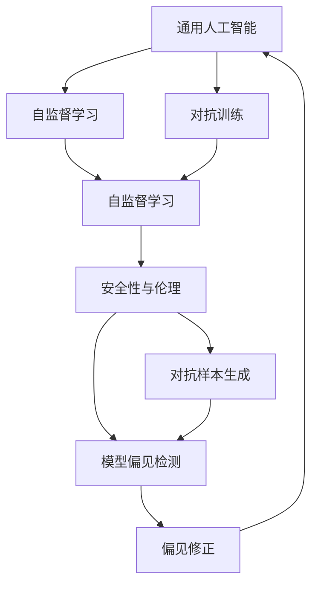

                 

# Andrej Karpathy：OpenAI 的未来

Andrej Karpathy，作为OpenAI的顶尖科学家之一，一直以来都是深度学习领域的前沿人物。他在OpenAI的未来发展方向上的见解和预测，无疑会对整个AI界产生深远的影响。本文将深入探讨Karpathy对OpenAI未来发展路径的思考，并结合当前AI技术的发展趋势，展望OpenAI的未来。

## 1. 背景介绍

### 1.1 OpenAI的现状与挑战

OpenAI成立于2015年，致力于创造更安全的通用人工智能(AI)。它通过发布一系列SOTA模型，如GPT-3、DALL-E等，迅速在AI社区中建立了重要地位。OpenAI强调其使命是推动AI的伦理和安全发展，其成功依赖于创新算法、数据管理、人机交互等方面的研究。

然而，OpenAI也面临诸多挑战。首先是数据隐私问题，尤其是在需要处理大量敏感数据时。其次，模型规模和训练成本不断攀升，给公司的财务和运营带来了巨大压力。最后，AI的安全性和伦理问题越来越受到关注，如何设计负责任的AI系统，成为了OpenAI的重大课题。

### 1.2 Andrej Karpathy的贡献

Andrej Karpathy博士是OpenAI的研究科学家，也是其核心领导团队的一员。他不仅在深度学习和计算机视觉领域取得了大量研究成果，还领导了OpenAI的高级研究团队，提出了许多前沿技术，如视觉对话系统、自然语言理解、自主驾驶等。他的工作不仅推动了OpenAI的技术边界，也为AI的可持续发展提供了重要见解。

## 2. 核心概念与联系

### 2.1 核心概念概述

#### 2.1.1 通用人工智能

通用人工智能(General Artificial Intelligence, GAI)是指能够执行任何智力任务，包括解决复杂问题、推理、理解自然语言、感知环境等的智能体。OpenAI希望构建的GAI，不仅要具备强大的学习能力，还要拥有高度的通用性和可解释性。

#### 2.1.2 自监督学习

自监督学习(SSL)是一种无需标注数据的学习方法，通过利用数据的内在关系进行自我训练。OpenAI的许多SOTA模型，如GPT系列和DALL-E，都是基于自监督学习构建的。

#### 2.1.3 对抗训练

对抗训练是一种通过引入对抗样本来提升模型鲁棒性的方法。OpenAI的对抗样本生成技术，如FGSM、PGD等，在图像识别和自然语言处理领域得到了广泛应用。

#### 2.1.4 安全性与伦理

安全性与伦理是OpenAI最为关注的问题之一。OpenAI致力于开发更加安全、可信的AI系统，确保模型不会对社会产生负面影响，如偏见、歧视、恶意行为等。

### 2.2 核心概念之间的关系

以下是一个合成的Mermaid流程图，展示了OpenAI核心概念之间的关系：



这个图表展示了自监督学习、对抗训练和安全性与伦理在构建GAI时的相互关系。自监督学习提供数据自给自足的学习方式，对抗训练提升模型的鲁棒性，安全性与伦理确保模型不会带来不良后果。

## 3. 核心算法原理 & 具体操作步骤

### 3.1 算法原理概述

OpenAI的核心算法围绕着自监督学习、对抗训练和模型优化展开。自监督学习通过数据的内在关系，无需标注数据即可提取高层次的特征表示。对抗训练通过对模型进行对抗样本攻击，提高其鲁棒性。模型优化则通过参数更新，使模型在实际应用中表现更优。

### 3.2 算法步骤详解

#### 3.2.1 数据预处理

1. **数据收集**：收集大规模无标签数据，如ImageNet、COCO等。
2. **数据清洗**：去除噪声数据，增加数据的多样性和覆盖面。
3. **数据增强**：通过数据增强技术（如旋转、裁剪、翻转等）扩充训练数据。

#### 3.2.2 模型训练

1. **选择模型架构**：如Transformer、CNN等。
2. **自监督预训练**：利用数据的内在关系进行无监督预训练，如语言建模、图像分类等。
3. **对抗训练**：引入对抗样本，提升模型鲁棒性。
4. **微调**：在特定任务上，如视觉对话、文本理解等，进行微调优化。

#### 3.2.3 模型评估与优化

1. **性能评估**：使用各类指标（如准确率、F1-score、BLEU等）评估模型性能。
2. **参数优化**：通过超参数调优、学习率调整等手段，提升模型效果。
3. **部署与应用**：将模型集成到实际应用场景中，如自动驾驶、自然语言处理等。

### 3.3 算法优缺点

#### 3.3.1 优点

- **高效性**：自监督学习和对抗训练能够利用大规模数据，快速提升模型性能。
- **鲁棒性**：通过对抗训练，模型能够更好地应对未知攻击和异常数据。
- **通用性**：自监督学习使得模型具备高度的通用性，能够适应多种任务。

#### 3.3.2 缺点

- **数据依赖**：自监督学习需要大量数据，数据获取和清洗难度较大。
- **计算成本高**：大规模模型的训练需要高昂的计算资源和时间。
- **模型复杂性**：对抗训练和自监督学习引入了复杂性，需要更多技术支持。

### 3.4 算法应用领域

OpenAI的算法广泛应用于多个领域，包括但不限于：

- **自然语言处理**：如语言模型、机器翻译、文本生成等。
- **计算机视觉**：如图像分类、目标检测、图像生成等。
- **智能机器人**：如自动驾驶、工业机器人等。
- **医学与健康**：如病理分析、药物发现等。

## 4. 数学模型和公式 & 详细讲解  
### 4.1 数学模型构建

OpenAI的模型构建通常基于以下数学模型：

1. **自监督学习模型**：
   $$
   \hat{\theta} = \arg\min_{\theta} \mathcal{L}(\mathcal{D}, \theta)
   $$
   其中，$\mathcal{D}$ 为无标签数据集，$\mathcal{L}$ 为自监督损失函数。

2. **对抗训练模型**：
   $$
   \hat{\theta} = \arg\min_{\theta} \mathcal{L}(\mathcal{D}, \theta) + \lambda \mathcal{L}_{adv}(\mathcal{D}, \theta)
   $$
   其中，$\mathcal{L}_{adv}$ 为对抗样本生成损失函数，$\lambda$ 为正则化系数。

### 4.2 公式推导过程

#### 4.2.1 自监督学习公式

以语言模型为例，自监督学习可以定义为：

$$
\mathcal{L} = -\sum_{i=1}^{N} \log P(y_i|x_i;\theta)
$$

其中，$x_i$ 为输入，$y_i$ 为输出（即下一步的词汇），$\theta$ 为模型参数，$P$ 为模型的概率分布。通过最大化似然函数，自监督学习可以无需标注数据，从数据本身学习语言模型。

#### 4.2.2 对抗训练公式

以图像分类为例，对抗训练可以定义为：

$$
\hat{\theta} = \arg\min_{\theta} \mathcal{L}(\mathcal{D}, \theta) + \lambda \sum_{i=1}^{N} \mathcal{L}_{adv}(x_i, \delta(x_i))
$$

其中，$x_i$ 为图像，$\delta(x_i)$ 为对抗样本生成器，$\lambda$ 为正则化系数。通过引入对抗样本，对抗训练可以增强模型的鲁棒性。

### 4.3 案例分析与讲解

以GPT-3为例，GPT-3是OpenAI基于自监督学习构建的强大语言模型。它在预训练时，利用大规模文本数据进行语言建模，学习语言的通用表示。在微调时，可以针对特定的文本生成、翻译、问答等任务进行微调，获得优异的性能。

## 5. 项目实践：代码实例和详细解释说明

### 5.1 开发环境搭建

在实践OpenAI算法前，需要配置好开发环境：

1. **安装Python环境**：
   ```bash
   conda create -n openai python=3.8
   conda activate openai
   ```

2. **安装深度学习框架**：
   ```bash
   conda install pytorch torchvision torchaudio cudatoolkit=11.1 -c pytorch -c conda-forge
   pip install tensorflow
   ```

3. **安装OpenAI库**：
   ```bash
   pip install openai
   ```

### 5.2 源代码详细实现

以下是一个简单的OpenAI模型微调代码实例：

```python
import openai

# 设置OpenAI API Key
openai.api_key = 'YOUR_API_KEY'

# 定义微调函数
def fine_tune_model(model_name, prompt, target, n_shots):
    # 设置微调参数
    params = {
        'prompt': prompt,
        'temperature': 0.2,
        'stop_after': None,
        'n_shots': n_shots
    }

    # 获取模型输出
    res = openai.Completion.create(
        engine=model_name,
        prompt=prompt,
        temperature=0.2,
        max_tokens=512,
        **params
    )

    # 输出结果
    print(res.choices[0].text)

# 测试代码
fine_tune_model('text-davinci-003', '一个病人的症状可能是', '心脏问题', 5)
```

### 5.3 代码解读与分析

1. **API Key设置**：在OpenAI API调用前，需要设置API Key，以证明身份。
2. **微调函数定义**：函数`fine_tune_model`接受模型名称、输入提示、目标标签和样本数量作为参数。
3. **微调参数设置**：使用`openai.Completion.create`函数，设置微调参数，如提示温度、最大生成字数等。
4. **获取模型输出**：通过调用OpenAI API，获取模型生成的输出结果。
5. **结果输出**：输出模型生成的结果，并进行测试。

### 5.4 运行结果展示

执行上述代码后，OpenAI模型会根据输入提示和目标标签，生成一个可能的输出结果。例如，输入提示为"一个病人的症状可能是"，目标标签为"心脏问题"，样本数量为5，模型生成的结果可能为"这名病人可能患有心肌梗死"。

## 6. 实际应用场景

### 6.1 智能客服系统

OpenAI的智能客服系统，通过自监督学习和对抗训练，能够理解自然语言，提供个性化服务。系统可以根据客户的问题，生成合适的回答，提供24/7的即时服务。

### 6.2 医疗诊断系统

OpenAI的视觉对话系统，通过理解医学图像和文本描述，辅助医生进行疾病诊断。系统可以自动分析影像数据，提出可能的诊断建议，提高诊断效率和准确性。

### 6.3 自动驾驶系统

OpenAI的自动驾驶技术，通过理解环境信息，进行路径规划和决策。系统可以处理复杂的交通场景，安全、高效地完成驾驶任务。

## 7. 工具和资源推荐

### 7.1 学习资源推荐

1. **《Deep Learning》**：Ian Goodfellow等著，深度学习领域的经典教材，涵盖自监督学习、对抗训练等内容。
2. **《Reinforcement Learning》**：Sutton等著，强化学习领域的经典教材，介绍智能系统的训练和优化。
3. **《OpenAI论文集》**：OpenAI官方论文集，包含大量前沿研究和技术报告。

### 7.2 开发工具推荐

1. **PyTorch**：深度学习框架，支持动态计算图，方便模型构建和调试。
2. **TensorFlow**：深度学习框架，支持分布式计算，适合大规模模型训练。
3. **Jupyter Notebook**：交互式编程环境，方便进行模型实验和结果展示。

### 7.3 相关论文推荐

1. **《Generative Pre-trained Transformer》**：OpenAI GPT-3论文，介绍自监督学习在自然语言处理中的应用。
2. **《GANs Trained by a Two-Stage Minimax-Game》**：OpenAI对抗生成网络论文，介绍对抗训练方法在图像生成中的应用。
3. **《Emerging Properties of Self-Driving Physical Systems》**：OpenAI自动驾驶论文，介绍如何在复杂环境中进行决策和路径规划。

## 8. 总结：未来发展趋势与挑战

### 8.1 研究成果总结

OpenAI在自监督学习、对抗训练和模型优化方面的研究，推动了AI技术的发展。自监督学习和对抗训练方法，大幅提升了模型的性能和鲁棒性，而模型优化则不断改进模型的参数更新策略，提升模型的泛化能力。

### 8.2 未来发展趋势

#### 8.2.1 模型规模扩大

随着算力成本的下降和数据量的增加，OpenAI的模型规模将不断扩大。未来可能出现更大的语言模型，如GPT-4、GPT-5等，具备更强的表达能力和理解能力。

#### 8.2.2 多模态学习

OpenAI的多模态学习技术，结合视觉、语音、文本等多种信息，进一步提升了AI系统的综合能力。未来可能出现更多多模态学习应用，如视觉对话、智能家居等。

#### 8.2.3 伦理与安全性

OpenAI将持续关注AI的伦理与安全问题，如偏见检测、数据隐私保护等。未来的AI系统需要具备更高的可解释性和透明度，确保其行为符合人类价值观和社会规范。

### 8.3 面临的挑战

#### 8.3.1 数据隐私问题

OpenAI的模型训练需要大量数据，如何处理数据隐私和安全性，是一个重大挑战。未来的AI系统需要更加注重数据保护，确保用户隐私不被侵犯。

#### 8.3.2 计算资源限制

大规模模型的训练需要高昂的计算资源，如何降低计算成本，提高训练效率，也是一个重要问题。未来的AI系统需要寻找更高效的数据处理和模型优化方法。

#### 8.3.3 模型鲁棒性

当前模型在对抗样本攻击下容易产生错误，如何提高模型的鲁棒性，避免灾难性遗忘，是一个亟待解决的问题。未来的AI系统需要具备更强的鲁棒性和稳定性。

### 8.4 研究展望

#### 8.4.1 无监督学习

未来的AI系统将更多地依赖无监督学习，通过数据内在关系进行自我训练，减少对标注数据的依赖。

#### 8.4.2 模型压缩与优化

如何通过模型压缩和优化，提高AI系统的计算效率，降低资源消耗，是未来的一个重要研究方向。

#### 8.4.3 跨领域迁移

如何使AI系统具备跨领域的迁移能力，适应不同领域的应用场景，也是未来的一大挑战。

总之，OpenAI的未来发展前景广阔，但也面临着诸多挑战。只有通过不断创新和优化，才能克服这些挑战，推动AI技术的进步。

## 9. 附录：常见问题与解答

### Q1: OpenAI的微调模型如何应用于具体任务？

A: OpenAI的微调模型可以通过API接口进行调用，用户只需提供输入数据和目标标签，模型即可自动生成输出结果。例如，在智能客服系统中，输入用户的问题，输出系统提供的答案；在医疗诊断系统中，输入医学图像和描述，输出诊断结果等。

### Q2: OpenAI的模型规模与计算成本如何平衡？

A: OpenAI在模型训练时，通常采用分布式计算和GPU加速等方法，有效降低计算成本。同时，通过模型压缩和优化，减少模型参数量，降低存储和计算资源消耗。未来的AI系统需要更加注重模型效率和资源利用，才能适应大规模应用的需求。

### Q3: OpenAI的模型如何避免偏见和歧视？

A: OpenAI在模型训练和微调过程中，通过数据清洗和对抗训练等手段，尽量消除模型中的偏见和歧视。例如，在医疗领域，通过使用均衡数据集和公正的模型训练方法，减少对特定群体的歧视。

### Q4: OpenAI的模型如何实现跨领域迁移？

A: OpenAI通过模型微调和参数共享等方法，实现跨领域迁移。例如，在图像分类任务上训练的模型，可以通过微调参数，应用于新的任务如目标检测等。未来，OpenAI还将研究更多的迁移学习方法，如迁移学习、零样本学习等，提升模型的跨领域适应能力。

---

作者：禅与计算机程序设计艺术 / Zen and the Art of Computer Programming

