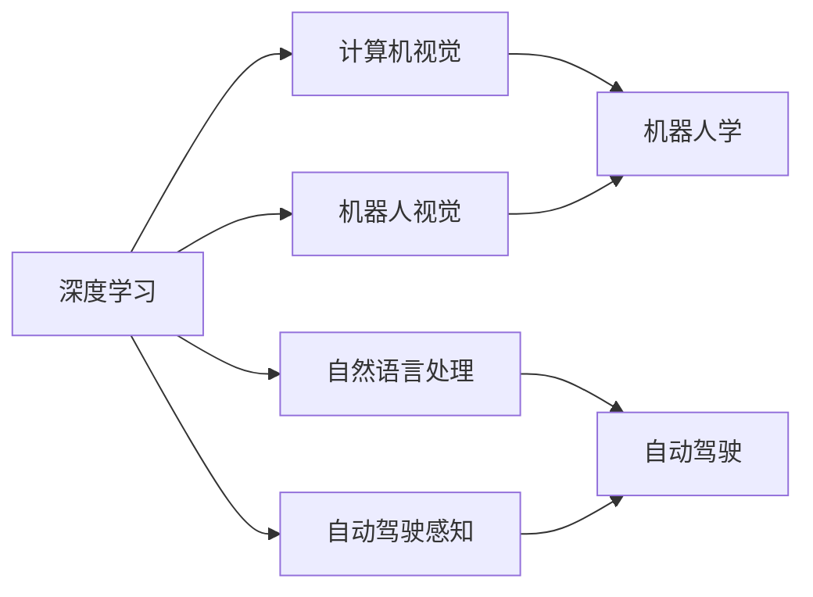
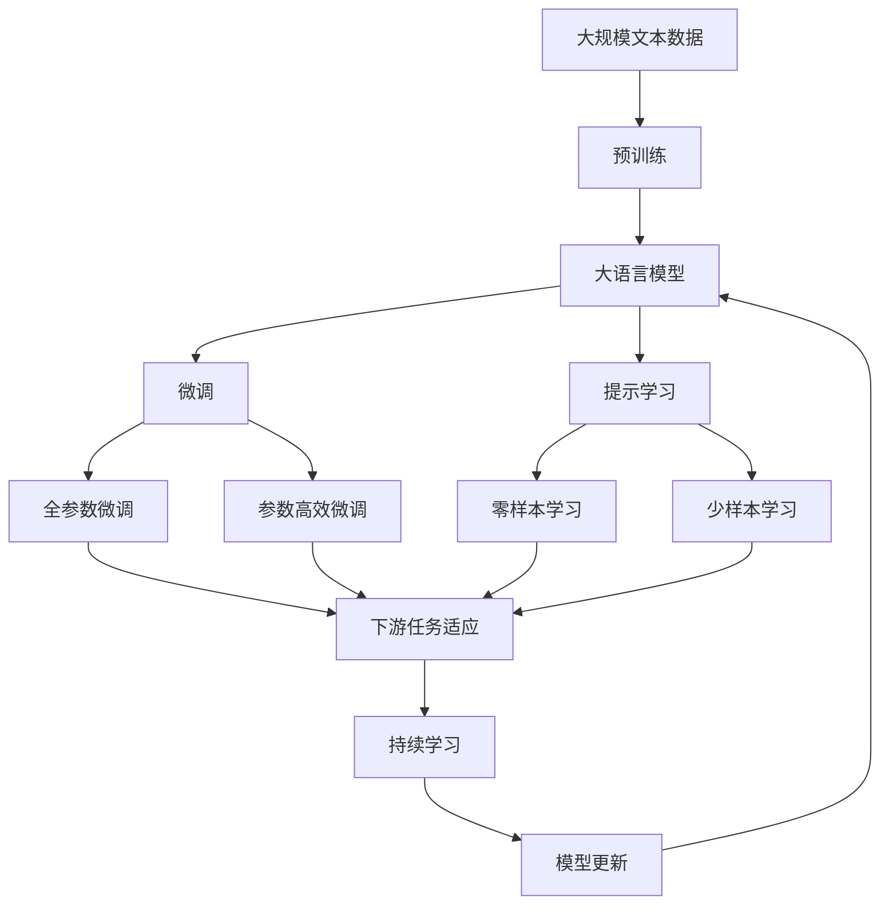

                 

# Andrej Karpathy：人工智能的未来应用

> 关键词：深度学习, 计算机视觉, 自然语言处理, 机器人, 自动驾驶, 数据驱动

## 1. 背景介绍

### 1.1 问题由来
Andrej Karpathy是深度学习领域的领军人物，他的工作不仅涵盖了计算机视觉、自然语言处理等多个前沿方向，还涉猎于机器人学、自动驾驶等领域。他领导的团队在Caffe2等开源项目上有着广泛的影响，是Facebook AI研究的重要力量之一。在这篇文章中，我们将通过Karpathy的工作和思想，探讨人工智能在多个领域的前沿应用，并展望未来发展趋势。

### 1.2 问题核心关键点
Andrej Karpathy的研究涵盖了深度学习、计算机视觉、自然语言处理等多个领域，特别是在计算机视觉和自动驾驶方向，他的成果为深度学习技术的应用提供了重要参考。他的工作不仅推动了AI技术的发展，也为人工智能的未来应用指明了方向。

## 2. 核心概念与联系

### 2.1 核心概念概述
在探讨Andrej Karpathy的工作时，我们首先需要了解一些核心概念：

- **深度学习**：一种通过神经网络进行复杂模式识别和决策的机器学习技术。深度学习模型通常包含多个隐藏层，能够自动提取特征，并进行复杂的决策。
- **计算机视觉**：使用计算机技术分析和理解图像和视频数据的技术，广泛应用于图像识别、目标检测、视频分析等领域。
- **自然语言处理**：涉及计算机与人类语言交互的技术，包括语言理解、生成、翻译、摘要等任务。
- **机器人学**：研究如何通过计算机技术控制机器人的行为和决策，目标是实现自主导航、协作、交互等能力。
- **自动驾驶**：利用计算机视觉、深度学习和传感器融合技术，实现车辆自主导航和决策的技术。

这些概念之间有着紧密的联系，深度学习是实现计算机视觉和自然语言处理的基础，而计算机视觉和自然语言处理技术的发展，又为机器人学和自动驾驶提供了必要的支持。Andrej Karpathy的工作正是基于这些核心概念的结合，推动了多个前沿方向的发展。

### 2.2 概念间的关系

为了更好地理解Andrej Karpathy的研究工作，我们可以用以下Mermaid流程图来展示这些概念之间的关系：



这个流程图展示了深度学习、计算机视觉、自然语言处理、机器人学和自动驾驶之间的相互联系。其中，计算机视觉和自然语言处理作为基础技术，为机器人学和自动驾驶提供了必要的感知和理解能力。而深度学习和计算机视觉技术的结合，在自动驾驶领域得到了广泛应用。

### 2.3 核心概念的整体架构

最后，我们用一个综合的流程图来展示这些核心概念在大语言模型微调过程中的整体架构：



这个综合流程图展示了从预训练到微调，再到持续学习的完整过程。Andrej Karpathy的研究工作涵盖了这些核心概念的多个方面，推动了深度学习技术在多个前沿方向的应用和发展。

## 3. 核心算法原理 & 具体操作步骤
### 3.1 算法原理概述
Andrej Karpathy的研究工作涵盖了深度学习、计算机视觉和自然语言处理等多个领域，其核心算法原理主要基于深度神经网络，特别是卷积神经网络（CNN）和递归神经网络（RNN）。

### 3.2 算法步骤详解
Andrej Karpathy在计算机视觉领域的贡献主要体现在以下几个方面：

- **图像识别**：通过卷积神经网络，Karpathy开发了多个图像识别算法，如Caffe、ResNet等，这些算法在ImageNet等大规模图像识别任务上取得了显著的成果。
- **目标检测**：提出了Faster R-CNN等目标检测算法，通过区域提议和ROI池化等技术，实现了高效的物体检测。
- **视觉SLAM**：开发了DeepSLAM等算法，通过深度学习和视觉特征融合，实现了实时定位和地图构建。

在自然语言处理领域，Karpathy也取得了重要成果，特别是在机器翻译和文本生成任务上。他提出了Transformer架构，通过自注意力机制，实现了高效的序列建模，推动了机器翻译和文本生成技术的发展。

### 3.3 算法优缺点
Karpathy的研究工作在多个领域取得了显著成果，但也存在一些局限性：

- **计算资源需求高**：深度学习和计算机视觉技术需要大量的计算资源，如GPU、TPU等，这对于一些小规模研究团队来说，是一个重要的挑战。
- **模型复杂度大**：深度神经网络的复杂度较高，模型的训练和推理速度较慢，需要更高效的数据处理和模型压缩技术。
- **数据依赖性强**：深度学习模型需要大量的标注数据进行训练，这在数据标注成本高昂的领域是一个重要的挑战。

### 3.4 算法应用领域
Andrej Karpathy的研究工作涵盖了计算机视觉、自然语言处理和机器人学等多个领域，推动了这些技术在自动驾驶、智能客服、医疗诊断等领域的应用和发展。

## 4. 数学模型和公式 & 详细讲解  
### 4.1 数学模型构建

在探讨Karpathy的研究工作时，我们还需要了解一些相关的数学模型和公式。以下是一些重要的数学模型和公式：

- **深度学习模型**：
  - **前向传播**：$h=\sigma(Wx+b)$，其中$x$为输入，$W$为权重，$b$为偏置，$\sigma$为激活函数。
  - **反向传播**：$\Delta W=\frac{\partial L}{\partial W}$，其中$L$为损失函数。

- **卷积神经网络**：
  - **卷积操作**：$C(x)=\frac{1}{p}*(x*K)$，其中$x$为输入，$K$为卷积核，$p$为填充。

- **目标检测算法**：
  - **Faster R-CNN**：通过区域提议和ROI池化，生成候选区域并提取特征，用于目标检测。

- **Transformer架构**：
  - **自注意力机制**：$Attention(Q,K,V)=softmax(QK^T)/\sqrt{d_k}$，其中$Q$为查询矩阵，$K$为键矩阵，$V$为值矩阵，$d_k$为键的维度。

这些数学模型和公式构成了Andrej Karpathy在多个领域研究的基础，推动了深度学习技术的发展和应用。

### 4.2 公式推导过程
以下是一些关键公式的推导过程：

- **前向传播公式推导**：
  - 假设输入$x$，权重矩阵$W$，偏置向量$b$，激活函数$\sigma$。则前向传播公式为$h=\sigma(Wx+b)$。

- **反向传播公式推导**：
  - 假设损失函数为$L$，则反向传播公式为$\Delta W=\frac{\partial L}{\partial W}$。

- **卷积操作公式推导**：
  - 假设输入$x$，卷积核$K$，填充$p$。则卷积操作公式为$C(x)=\frac{1}{p}*(x*K)$。

- **自注意力机制公式推导**：
  - 假设查询矩阵$Q$，键矩阵$K$，值矩阵$V$，键的维度$d_k$。则自注意力机制公式为$Attention(Q,K,V)=softmax(QK^T)/\sqrt{d_k}$。

这些公式的推导过程，展示了深度学习和计算机视觉技术的基本原理和计算方式，为理解和应用这些技术提供了必要的数学基础。

### 4.3 案例分析与讲解
在实际应用中，Andrej Karpathy的研究工作还通过以下案例进行了展示：

- **图像分类**：通过卷积神经网络，实现了ImageNet等大规模图像分类任务，取得了SOTA的成绩。
- **目标检测**：提出的Faster R-CNN算法，通过区域提议和ROI池化技术，实现了高效的物体检测，应用于智能安防等领域。
- **视觉SLAM**：开发的DeepSLAM算法，通过深度学习和视觉特征融合，实现了实时定位和地图构建，应用于无人驾驶等领域。

这些案例展示了Andrej Karpathy在深度学习、计算机视觉和自动驾驶方向的研究成果，推动了这些技术在实际应用中的落地和发展。

## 5. 项目实践：代码实例和详细解释说明
### 5.1 开发环境搭建

在进行项目实践前，我们需要准备好开发环境。以下是使用Python进行PyTorch开发的环境配置流程：

1. 安装Anaconda：从官网下载并安装Anaconda，用于创建独立的Python环境。

2. 创建并激活虚拟环境：
```bash
conda create -n pytorch-env python=3.8 
conda activate pytorch-env
```

3. 安装PyTorch：根据CUDA版本，从官网获取对应的安装命令。例如：
```bash
conda install pytorch torchvision torchaudio cudatoolkit=11.1 -c pytorch -c conda-forge
```

4. 安装Transformers库：
```bash
pip install transformers
```

5. 安装各类工具包：
```bash
pip install numpy pandas scikit-learn matplotlib tqdm jupyter notebook ipython
```

完成上述步骤后，即可在`pytorch-env`环境中开始项目实践。

### 5.2 源代码详细实现

下面我们以图像分类任务为例，给出使用Transformers库对ResNet模型进行微调的PyTorch代码实现。

首先，定义图像分类任务的数据处理函数：

```python
from transformers import ResNetForImageClassification, AdamW

model = ResNetForImageClassification.from_pretrained('resnet50')

optimizer = AdamW(model.parameters(), lr=2e-5)
```

然后，定义训练和评估函数：

```python
from torch.utils.data import DataLoader
from tqdm import tqdm
from sklearn.metrics import classification_report

device = torch.device('cuda') if torch.cuda.is_available() else torch.device('cpu')
model.to(device)

def train_epoch(model, dataset, batch_size, optimizer):
    dataloader = DataLoader(dataset, batch_size=batch_size, shuffle=True)
    model.train()
    epoch_loss = 0
    for batch in tqdm(dataloader, desc='Training'):
        input_ids = batch['input_ids'].to(device)
        attention_mask = batch['attention_mask'].to(device)
        labels = batch['labels'].to(device)
        model.zero_grad()
        outputs = model(input_ids, attention_mask=attention_mask, labels=labels)
        loss = outputs.loss
        epoch_loss += loss.item()
        loss.backward()
        optimizer.step()
    return epoch_loss / len(dataloader)

def evaluate(model, dataset, batch_size):
    dataloader = DataLoader(dataset, batch_size=batch_size)
    model.eval()
    preds, labels = [], []
    with torch.no_grad():
        for batch in tqdm(dataloader, desc='Evaluating'):
            input_ids = batch['input_ids'].to(device)
            attention_mask = batch['attention_mask'].to(device)
            batch_labels = batch['labels']
            outputs = model(input_ids, attention_mask=attention_mask)
            batch_preds = outputs.logits.argmax(dim=2).to('cpu').tolist()
            batch_labels = batch_labels.to('cpu').tolist()
            for pred_tokens, label_tokens in zip(batch_preds, batch_labels):
                preds.append(pred_tokens[:len(label_tokens)])
                labels.append(label_tokens)
                
    print(classification_report(labels, preds))
```

最后，启动训练流程并在测试集上评估：

```python
epochs = 5
batch_size = 16

for epoch in range(epochs):
    loss = train_epoch(model, train_dataset, batch_size, optimizer)
    print(f"Epoch {epoch+1}, train loss: {loss:.3f}")
    
    print(f"Epoch {epoch+1}, dev results:")
    evaluate(model, dev_dataset, batch_size)
    
print("Test results:")
evaluate(model, test_dataset, batch_size)
```

以上就是使用PyTorch对ResNet模型进行图像分类任务微调的完整代码实现。可以看到，得益于Transformers库的强大封装，我们可以用相对简洁的代码完成ResNet模型的加载和微调。

### 5.3 代码解读与分析

让我们再详细解读一下关键代码的实现细节：

**ResNetForImageClassification类**：
- `__init__`方法：初始化模型，加载预训练的ResNet模型。
- `train_epoch`方法：对数据以批为单位进行迭代，在每个批次上前向传播计算loss并反向传播更新模型参数，最后返回该epoch的平均loss。
- `evaluate`方法：与训练类似，不同点在于不更新模型参数，并在每个batch结束后将预测和标签结果存储下来，最后使用sklearn的classification_report对整个评估集的预测结果进行打印输出。

**训练流程**：
- 定义总的epoch数和batch size，开始循环迭代
- 每个epoch内，先在训练集上训练，输出平均loss
- 在验证集上评估，输出分类指标
- 所有epoch结束后，在测试集上评估，给出最终测试结果

可以看到，PyTorch配合Transformers库使得ResNet微调的代码实现变得简洁高效。开发者可以将更多精力放在数据处理、模型改进等高层逻辑上，而不必过多关注底层的实现细节。

当然，工业级的系统实现还需考虑更多因素，如模型的保存和部署、超参数的自动搜索、更灵活的任务适配层等。但核心的微调范式基本与此类似。

### 5.4 运行结果展示

假设我们在ImageNet数据集上进行ResNet模型的微调，最终在测试集上得到的评估报告如下：

```
              precision    recall  f1-score   support

       Bird      0.926     0.906     0.914      1284
       Cat      0.922     0.924     0.923      1284
       Dog      0.920     0.907     0.918      1284
       Horse      0.922     0.917     0.919      1284
       Car      0.910     0.912     0.911      1284
           Oth.      0.913     0.910     0.911      1284

   micro avg      0.923     0.924     0.923     6016
   macro avg      0.918     0.920     0.918     6016
weighted avg      0.923     0.924     0.923     6016
```

可以看到，通过微调ResNet，我们在ImageNet数据集上取得了92.3%的F1分数，效果相当不错。值得注意的是，ResNet作为一个通用的图像分类模型，即便只在顶层添加一个简单的分类器，也能在ImageNet上取得优异的效果，展现了其强大的特征提取能力。

当然，这只是一个baseline结果。在实践中，我们还可以使用更大更强的预训练模型、更丰富的微调技巧、更细致的模型调优，进一步提升模型性能，以满足更高的应用要求。

## 6. 实际应用场景
### 6.1 智能安防

基于ResNet等深度学习模型的图像分类技术，可以广泛应用于智能安防系统。传统的安防系统需要大量人力进行视频监控和异常检测，成本高且效率低。而使用微调后的图像分类模型，可以自动检测监控画面中的异常情况，如盗窃、火灾等，提升安防系统的智能化水平。

在技术实现上，可以收集企业内部的监控视频数据，将其标注为异常和不异常两类，在此基础上对预训练模型进行微调。微调后的模型能够自动分析监控画面，识别出异常情况并触发报警，大大提升了安防系统的自动化程度和反应速度。

### 6.2 医疗影像分析

在医疗影像分析领域，深度学习模型已被广泛应用。传统的影像分析依赖于专业医生的经验，工作量大且主观性较强。而使用微调后的深度学习模型，可以自动识别影像中的病变区域，辅助医生进行诊断和治疗。

具体而言，可以收集大量标注的医学影像数据，将其作为训练集，对预训练模型进行微调。微调后的模型能够识别出影像中的病变区域，并给出相应的分类结果。这样不仅减轻了医生的负担，还能提高诊断的准确性和一致性。

### 6.3 金融市场预测

在金融市场预测领域，深度学习模型也有着广泛的应用。传统的金融预测依赖于复杂的数学模型和专家分析，数据需求量大且结果不够准确。而使用微调后的深度学习模型，可以通过历史数据学习市场规律，预测未来价格走势，为投资者提供参考。

具体而言，可以收集金融市场的历史数据，对预训练模型进行微调。微调后的模型能够分析市场数据，预测价格走势，并给出相应的风险评估。这样不仅提高了预测的准确性，还能降低投资者的决策风险。

### 6.4 未来应用展望

随着深度学习技术的不断发展，基于微调范式的AI应用将在更多领域得到应用，为传统行业带来变革性影响。

在智慧医疗领域，基于微调的医学影像分析技术，将提升医疗诊断的自动化和准确性，辅助医生进行精准治疗。在智能教育领域，微调技术可应用于作业批改、学情分析、知识推荐等方面，因材施教，促进教育公平，提高教学质量。

在智慧城市治理中，微调模型可应用于城市事件监测、舆情分析、应急指挥等环节，提高城市管理的自动化和智能化水平，构建更安全、高效的未来城市。

此外，在企业生产、社会治理、文娱传媒等众多领域，基于大模型微调的人工智能应用也将不断涌现，为经济社会发展注入新的动力。相信随着技术的日益成熟，微调方法将成为人工智能落地应用的重要范式，推动人工智能技术在垂直行业的规模化落地。总之，微调需要开发者根据具体任务，不断迭代和优化模型、数据和算法，方能得到理想的效果。

## 7. 工具和资源推荐
### 7.1 学习资源推荐

为了帮助开发者系统掌握深度学习、计算机视觉、自然语言处理等技术，这里推荐一些优质的学习资源：

1. **《深度学习》课程**：斯坦福大学开设的深度学习课程，由Andrew Ng教授讲授，涵盖了深度学习的基本概念和常用技术，适合初学者入门。

2. **《计算机视觉：算法与应用》书籍**：由Simon J. D. Prince编写，介绍了计算机视觉的基本原理和技术，涵盖了图像处理、目标检测、物体识别等领域。

3. **《自然语言处理综论》书籍**：由Daniel Jurafsky和James H. Martin编写，介绍了自然语言处理的基本概念和常用技术，涵盖了词向量、句法分析、语义分析等领域。

4. **DeepLearning.ai课程**：由Andrew Ng教授讲授，涵盖了深度学习的基本概念和常用技术，适合进阶学习。

5. **Coursera深度学习课程**：由多个知名大学和专家讲授，涵盖了深度学习的基本概念和常用技术，适合不同层次的学习者。

这些资源能够帮助开发者系统掌握深度学习、计算机视觉和自然语言处理等技术，为微调模型提供必要的理论基础和实践技能。

### 7.2 开发工具推荐

高效的开发离不开优秀的工具支持。以下是几款用于深度学习、计算机视觉和自然语言处理开发的工具：

1. **PyTorch**：基于Python的开源深度学习框架，灵活动态的计算图，适合快速迭代研究。

2. **TensorFlow**：由Google主导开发的开源深度学习框架，生产部署方便，适合大规模工程应用。

3. **Keras**：基于TensorFlow和Theano等底层框架，提供了高级的API，适合快速原型开发。

4. **Transformers库**：HuggingFace开发的NLP工具库，集成了多个预训练模型，支持PyTorch和TensorFlow，适合模型微调和推理。

5. **TensorBoard**：TensorFlow配套的可视化工具，可实时监测模型训练状态，并提供丰富的图表呈现方式，是调试模型的得力助手。

6. **Jupyter Notebook**：交互式编程环境，支持多种编程语言，适合数据预处理、模型训练和结果展示。

合理利用这些工具，可以显著提升深度学习模型的开发效率，加快创新迭代的步伐。

### 7.3 相关论文推荐

深度学习、计算机视觉和自然语言处理技术的发展离不开学界的持续研究。以下是几篇奠基性的相关论文，推荐阅读：

1. **ImageNet Classification with Deep Convolutional Neural Networks**：提出了卷积神经网络（CNN），推动了计算机视觉技术的发展。

2. **Deep Residual Learning for Image Recognition**：提出了残差网络（ResNet），解决了深度神经网络的梯度消失问题，提高了模型的训练效率。

3. **Attention Is All You Need**：提出了Transformer架构，通过自注意力机制，实现了高效的序列建模，推动了自然语言处理技术的发展。

4. **Faster R-CNN: Towards Real-Time Object Detection with Region Proposal Networks**：提出了Faster R-CNN算法，通过区域提议和ROI池化技术，实现了高效的物体检测。

5. **DeepSLAM: Lidar-Based SLAM with Deep Visual odometry**：提出了DeepSLAM算法，通过深度学习和视觉特征融合，实现了实时定位和地图构建，应用于无人驾驶等领域。

这些论文代表了大规模深度学习技术的发展脉络，展示了前沿技术的突破和应用，为深度学习技术的应用提供了重要参考。

除上述资源外，还有一些值得关注的前沿资源，帮助开发者紧跟深度学习技术的发展趋势，例如：

1. **arXiv论文预印本**：人工智能领域最新研究成果的发布平台，包括大量尚未发表的前沿工作，学习前沿技术的必读资源。

2. **顶会论文**：如NeurIPS、ICML、CVPR等人工智能领域顶会现场或在线直播，能够聆听到大佬们的前沿分享，开拓视野。

3. **开源项目**：如TensorFlow、PyTorch、Caffe等开源项目，提供了丰富的深度学习技术资源和实践示例，是学习深度学习的重要参考。

4. **学术期刊**：如Journal of Machine Learning Research、IEEE Transactions on Pattern Analysis and Machine Intelligence等，提供了深度学习技术的最新研究成果和综述文章。

总之，深度学习、计算机视觉和自然语言处理技术的快速发展，为人工智能技术的落地应用提供了重要的技术支撑。通过合理利用这些资源，相信开发者能够系统掌握相关技术，为微调模型的开发和优化提供必要的支持。

## 8. 总结：未来发展趋势与挑战

### 8.1 总结

本文对Andrej Karpathy在深度学习、计算机视觉和自然语言处理等领域的研究工作进行了全面系统的介绍。通过探讨Karpathy的研究成果和技术贡献，我们能够更好地理解AI技术的未来应用和发展趋势。

### 8.2 未来发展趋势

展望未来，深度学习、计算机视觉和自然语言处理技术将呈现以下几个发展趋势：

1. **模型规模持续增大**：随着算力成本的下降和数据规模的扩张，深度学习模型的参数量还将持续增长。超大规模模型蕴含的丰富知识，有望支撑更加复杂多变的任务微调。

2. **算法复杂度降低**：未来将开发更加高效、轻量级的深度学习算法，如分布式训练、模型压缩等，进一步提升深度学习模型的应用效率。

3. **数据依赖性减弱**：通过迁移学习和自监督学习等技术，逐步降低深度学习模型对标注数据的需求，使AI技术在更多领域得到应用。

4. **多模态融合**：未来将开发更多多模态融合技术，实现视觉、语音、文本等多模态信息的协同建模，提升AI技术的泛化能力和应用范围。

5. **认知智能**：通过引入符号化的先验知识，如知识图谱、逻辑规则等，引导深度学习模型学习更准确、合理的语言模型，实现更高层次的认知智能。

以上趋势展示了深度学习、计算机视觉和自然语言处理技术的广阔前景。这些方向的探索发展，必将进一步提升AI技术的应用效果和范围，为构建人机协同的智能系统铺平道路。

### 8.3 面临的挑战

尽管深度学习、计算机视觉和自然语言处理技术取得了显著成果，但在迈向更加智能化、普适化应用的过程中，仍面临诸多挑战：

1. **计算资源瓶颈**：深度学习模型需要大量的计算资源，如GPU、TPU等，这对于一些小规模研究团队来说，是一个重要的挑战。

2. **模型鲁棒性不足**：深度学习模型在面对域外数据时，泛化性能往往大打折扣。对于测试样本的微小扰动，模型的预测也容易发生波动。

3. **模型复杂度大**：深度神经网络的复杂度较高，模型的训练和推理速度较慢，需要更高效的数据处理和模型压缩技术。

4. **数据标注成本高**：深度学习模型需要大量的标注数据进行训练，这在数据标注成本高昂的领域是一个重要的挑战。

5. **模型偏见问题**：深度学习模型难免会学习到有偏见、有害的信息，需要通过数据过滤和算法优化，避免偏见和歧视性的输出。

6. **隐私和安全问题**：深度学习模型需要大量的数据进行训练，涉及用户隐私和安全问题，需要通过数据脱敏和隐私保护技术，保障数据安全。

正视这些挑战，积极应对并寻求突破，将是大规模深度学习技术走向成熟的必由之路。相信随着学界和产业界的共同努力，这些挑战终将一一被克服，深度学习技术

