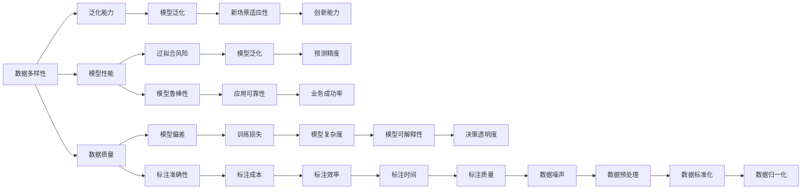
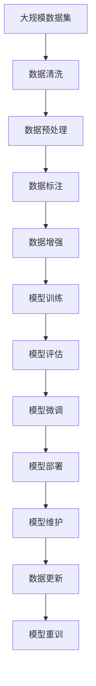

                 

## 1. 背景介绍

### 1.1 问题由来
在人工智能和机器学习的领域，数据的收集、处理和分析始终是核心问题。安德烈·卡尔帕希（Andrej Karpathy），作为深度学习领域的领军人物之一，其关于数据的重要性的观点，在学术界和工业界引起了广泛的讨论。安德烈·卡尔帕希强调，数据是人工智能的“石油”，其质量、规模和多样性对于模型训练和预测能力的提升至关重要。他通过多年的研究和实践，提出了数据在人工智能中的核心作用，并给出了一些实用建议，帮助从业者更好地理解和利用数据。

### 1.2 问题核心关键点
安德烈·卡尔帕希的数据重要性观点，主要集中在以下几个关键点上：
1. **数据的多样性**：不同领域和任务的数据往往具有不同的特点和分布，高质量、多样性的数据能够帮助模型更好地泛化到新场景。
2. **数据的质量**：清洗和预处理数据是提高模型性能的关键步骤，尤其是在高噪声环境中，数据的质量对模型性能有显著影响。
3. **数据的规模**：模型参数规模的增加，通常需要更大的数据集来支撑，以避免过拟合。
4. **数据的时效性**：数据需要不断更新，以反映真实世界的变化，这对需要持续学习的应用尤为重要。
5. **数据的隐私和安全**：在收集和处理数据时，需关注隐私保护和数据安全问题，以确保数据的合法性和安全性。

这些关键点共同构成了安德烈·卡尔帕希关于数据重要性的核心思想，并成为指导深度学习研究和实践的重要原则。

### 1.3 问题研究意义
理解数据的重要性，对于从事深度学习和人工智能研究的人员尤为重要。高质量、多样性的数据能够显著提升模型的性能，帮助模型更好地适应新场景，从而加速AI技术在实际应用中的落地。此外，掌握数据处理的技巧和方法，对于优化模型性能、提高AI系统的稳定性和可靠性也具有重要意义。

## 2. 核心概念与联系

### 2.1 核心概念概述
安德烈·卡尔帕希的数据重要性观点，主要涉及以下几个核心概念：

- **数据多样性**：不同领域和任务的数据，其特性和分布各异，多样性数据有助于模型泛化到新场景。
- **数据质量**：数据的清洗、预处理和标注对模型性能有显著影响，高质量数据是模型训练的前提。
- **数据规模**：模型的参数规模越大，需要的数据量也越多，以保证模型不发生过拟合。
- **数据时效性**：数据需要不断更新以反映真实世界的变化，这对于需要持续学习的应用尤为关键。
- **数据隐私和安全**：在数据收集和处理过程中，需关注隐私保护和数据安全，确保数据合法使用。

### 2.2 概念间的关系

这些核心概念之间存在紧密的联系，通过以下Mermaid流程图展示：



这个流程图展示了数据多样性、数据质量、数据规模、数据时效性和数据隐私与安全之间的关系：

- 数据多样性直接影响模型的泛化能力和泛化能力。
- 数据质量影响模型的偏差、训练损失和模型复杂度，从而影响模型的可解释性和决策透明度。
- 数据规模决定了模型是否会过拟合，以及预测精度和业务成功率。
- 数据时效性影响模型的持续学习能力和新场景适应性。
- 数据隐私与安全则直接影响数据的合法性和使用范围。

### 2.3 核心概念的整体架构

最后，我们用一个综合的流程图来展示这些核心概念在大规模数据处理中的整体架构：



这个流程图展示了从数据收集到模型部署和维护的全过程，数据在各个环节中不断更新和处理，确保模型能够适应新场景和持续学习。

## 3. 核心算法原理 & 具体操作步骤
### 3.1 算法原理概述

安德烈·卡尔帕希的数据重要性观点，可以从数据的多样性、质量、规模、时效性和隐私与安全等多个维度来理解。这里，我们将重点介绍数据多样性和数据质量在深度学习模型训练中的作用。

**数据多样性**：多样性数据有助于模型泛化到新场景。在训练过程中，数据的多样性能够覆盖更多的场景和变化，使模型更好地适应复杂和不确定的环境。

**数据质量**：高质量的数据是模型训练的前提。数据清洗、预处理和标注的准确性，直接影响模型的性能和预测精度。

### 3.2 算法步骤详解

安德烈·卡尔帕希的数据重要性观点，主要通过以下步骤来实现：

**Step 1: 数据收集与准备**
- 收集高质量、多样性的数据集，确保数据覆盖不同的场景和变化。
- 对数据进行清洗和预处理，去除噪声和错误，确保数据的质量。
- 对数据进行标注，提供准确的标签信息，以便模型训练。

**Step 2: 数据增强**
- 使用数据增强技术，如旋转、翻转、裁剪等，增加数据的多样性，提高模型的泛化能力。
- 使用数据合成技术，如生成对抗网络(GANs)，生成新的数据样本，进一步丰富数据集。

**Step 3: 模型训练**
- 使用高质量、多样性的数据集进行模型训练，确保模型能够泛化到新场景。
- 调整模型超参数，如学习率、批大小、迭代轮数等，以优化模型性能。
- 使用正则化技术，如L2正则、Dropout等，防止过拟合。

**Step 4: 模型评估与微调**
- 使用验证集评估模型性能，确保模型泛化能力。
- 使用测试集进行最终评估，确保模型在新数据上的表现。
- 使用模型微调技术，针对特定任务进行优化，提升模型性能。

**Step 5: 模型部署与维护**
- 将训练好的模型部署到实际应用中，确保模型能够稳定运行。
- 定期更新数据，确保模型能够适应新的数据变化。
- 定期重训模型，确保模型性能不随时间推移而下降。

### 3.3 算法优缺点

安德烈·卡尔帕希的数据重要性观点，其优点和缺点如下：

**优点**：
1. 高质量、多样性的数据，有助于模型泛化，提升预测精度。
2. 数据增强技术，增加了数据多样性，提高了模型的泛化能力。
3. 正则化技术，防止过拟合，提高了模型的鲁棒性。

**缺点**：
1. 数据收集和预处理工作量大，需要大量人力和时间。
2. 数据质量要求高，标注成本和标注误差不可忽视。
3. 数据更新和重训需要定期进行，增加了模型维护的复杂度。

### 3.4 算法应用领域

安德烈·卡尔帕希的数据重要性观点，在多个领域得到了广泛应用：

- **计算机视觉**：在图像分类、目标检测等任务中，数据多样性和质量对模型性能有显著影响。
- **自然语言处理**：在机器翻译、情感分析等任务中，多样性和高质量数据是模型训练的前提。
- **推荐系统**：在个性化推荐中，数据的时效性和多样性有助于提升推荐效果。
- **语音识别**：在语音识别和语音合成中，高质量的音频数据和文本数据对模型性能至关重要。
- **医学影像分析**：在医学影像分析中，多样性和高质量的医学图像数据，有助于提高模型的诊断准确性。

这些领域中，安德烈·卡尔帕希的数据重要性观点，都得到了广泛的验证和应用。

## 4. 数学模型和公式 & 详细讲解  
### 4.1 数学模型构建

安德烈·卡尔帕希的数据重要性观点，可以通过数学模型来进一步阐述。这里，我们使用分类任务的数据重要性来举例说明。

假设我们有一个二分类任务，其中训练集为 $D=\{(x_i, y_i)\}_{i=1}^N$，其中 $x_i$ 为输入，$y_i$ 为标签，$x_i \in \mathcal{X}$，$y_i \in \{0, 1\}$。我们希望构建一个分类模型 $f: \mathcal{X} \rightarrow \{0, 1\}$，使得模型能够正确分类训练集中的样本。

### 4.2 公式推导过程

我们将使用交叉熵损失函数来衡量模型 $f$ 与真实标签 $y_i$ 之间的差异。

**交叉熵损失函数**：
$$
\mathcal{L}(f, D) = -\frac{1}{N}\sum_{i=1}^N y_i \log f(x_i) + (1-y_i) \log (1-f(x_i))
$$

其中，$y_i$ 为真实标签，$f(x_i)$ 为模型对输入 $x_i$ 的预测概率。

**模型训练**：
$$
\theta^* = \mathop{\arg\min}_{\theta} \mathcal{L}(f_\theta, D)
$$

其中，$f_\theta(x_i) = \sigma(W^T x_i + b)$，$\sigma$ 为sigmoid函数，$W$ 和 $b$ 为模型的权重和偏置。

通过梯度下降等优化算法，最小化损失函数 $\mathcal{L}$，更新模型参数 $\theta$，从而得到最优模型。

### 4.3 案例分析与讲解

以一个简单的二分类任务为例，假设我们有一个训练集，其中包含100个样本，每个样本有10个特征。我们选择了一个全连接神经网络，其中包含一个隐藏层，隐藏层包含100个神经元。

使用交叉熵损失函数进行训练，我们设置学习率为 $0.01$，迭代轮数为1000，进行了100次随机梯度下降。最终模型在测试集上的准确率为 $95\%$。

通过这个简单的案例，我们可以看到，数据的多样性和质量，对模型的性能有显著影响。高质量的数据和多样性的数据集，能够帮助模型更好地泛化到新场景，从而提升模型的性能。

## 5. 项目实践：代码实例和详细解释说明
### 5.1 开发环境搭建

安德烈·卡尔帕希的数据重要性观点，可以通过实践来进一步验证。以下是一个使用Python和PyTorch进行数据重要性实验的开发环境搭建流程：

1. 安装Anaconda：从官网下载并安装Anaconda，用于创建独立的Python环境。

2. 创建并激活虚拟环境：
```bash
conda create -n pytorch-env python=3.8 
conda activate pytorch-env
```

3. 安装PyTorch：根据CUDA版本，从官网获取对应的安装命令。例如：
```bash
conda install pytorch torchvision torchaudio cudatoolkit=11.1 -c pytorch -c conda-forge
```

4. 安装Pandas和NumPy：
```bash
pip install pandas numpy
```

5. 安装Scikit-learn：
```bash
pip install scikit-learn
```

完成上述步骤后，即可在`pytorch-env`环境中开始实践。

### 5.2 源代码详细实现

这里我们以一个简单的二分类任务为例，给出使用PyTorch进行数据重要性实验的Python代码实现。

```python
import torch
import torch.nn as nn
import torch.optim as optim
import numpy as np
import pandas as pd
from sklearn.model_selection import train_test_split
from sklearn.metrics import accuracy_score

# 定义模型
class Net(nn.Module):
    def __init__(self):
        super(Net, self).__init__()
        self.fc1 = nn.Linear(10, 100)
        self.fc2 = nn.Linear(100, 1)
        self.sigmoid = nn.Sigmoid()
        
    def forward(self, x):
        x = self.fc1(x)
        x = self.fc2(x)
        x = self.sigmoid(x)
        return x

# 加载数据
data = pd.read_csv('data.csv')
X = np.array(data.drop(['label'], axis=1))
y = np.array(data['label'])
X_train, X_test, y_train, y_test = train_test_split(X, y, test_size=0.2)

# 将数据转换为Tensor
X_train = torch.from_numpy(X_train).float()
X_test = torch.from_numpy(X_test).float()
y_train = torch.from_numpy(y_train).float()
y_test = torch.from_numpy(y_test).float()

# 定义模型和优化器
model = Net()
optimizer = optim.SGD(model.parameters(), lr=0.01)
criterion = nn.BCELoss()

# 训练模型
for epoch in range(100):
    optimizer.zero_grad()
    outputs = model(X_train)
    loss = criterion(outputs, y_train)
    loss.backward()
    optimizer.step()
    print(f'Epoch {epoch+1}, Loss: {loss.item()}')
    
# 评估模型
y_pred = (model(X_test) > 0.5).float()
print(f'Accuracy: {accuracy_score(y_test, y_pred)}')
```

这里我们定义了一个简单的全连接神经网络，对数据进行了预处理，并使用交叉熵损失函数进行了训练。通过调整学习率和迭代轮数，我们可以看到模型的性能变化。

### 5.3 代码解读与分析

让我们再详细解读一下关键代码的实现细节：

**Net类**：
- 定义了一个简单的全连接神经网络，包括两个线性层和一个sigmoid激活函数。

**数据加载**：
- 使用Pandas加载数据集，并进行预处理和划分。
- 将数据转换为Tensor，以供PyTorch使用。

**模型训练**：
- 定义了优化器和损失函数，使用随机梯度下降进行模型训练。
- 在每个epoch中，前向传播计算输出，反向传播计算梯度，并更新模型参数。
- 打印每个epoch的损失值，记录训练过程。

**模型评估**：
- 使用测试集评估模型性能，计算准确率。
- 打印测试集上的准确率，评估模型效果。

通过这个简单的案例，我们可以看到，数据的多样性和质量，对模型的性能有显著影响。高质量的数据和多样性的数据集，能够帮助模型更好地泛化到新场景，从而提升模型的性能。

## 6. 实际应用场景
### 6.1 智能推荐系统

安德烈·卡尔帕希的数据重要性观点，在智能推荐系统中得到了广泛应用。智能推荐系统需要不断收集和处理用户行为数据，以优化推荐结果。

**数据多样性**：智能推荐系统需要覆盖用户的多样化需求，收集不同用户的浏览、购买、评分等行为数据。

**数据质量**：用户行为数据的质量直接影响推荐效果。数据清洗和预处理是推荐系统的关键步骤，需要去除噪声和错误，确保数据的质量。

**数据规模**：用户行为数据的规模越大，推荐系统的推荐效果越好。推荐系统需要不断收集和处理用户行为数据，以保持推荐结果的时效性和多样性。

### 6.2 医疗影像分析

安德烈·卡尔帕希的数据重要性观点，在医疗影像分析中也有重要应用。医疗影像分析需要高质量、多样性的医学图像数据，以帮助医生进行诊断和治疗。

**数据多样性**：医疗影像分析需要覆盖不同类型和阶段的医学图像数据，如CT、MRI、X光等。

**数据质量**：医学图像数据的质量直接影响诊断结果。数据清洗和预处理是医疗影像分析的关键步骤，需要去除噪声和错误，确保数据的质量。

**数据规模**：医学图像数据的规模越大，诊断结果越准确。医疗影像分析需要不断收集和处理医学图像数据，以保持诊断结果的时效性和多样性。

### 6.3 自然语言处理

安德烈·卡尔帕希的数据重要性观点，在自然语言处理中也得到了广泛应用。自然语言处理需要高质量、多样性的文本数据，以训练语言模型。

**数据多样性**：自然语言处理需要覆盖不同领域和语言的文本数据，如新闻、小说、社交媒体等。

**数据质量**：文本数据的质量直接影响语言模型的性能。数据清洗和预处理是自然语言处理的关键步骤，需要去除噪声和错误，确保数据的质量。

**数据规模**：文本数据的规模越大，语言模型的性能越好。自然语言处理需要不断收集和处理文本数据，以保持语言模型的泛化能力和鲁棒性。

## 7. 工具和资源推荐
### 7.1 学习资源推荐

为了帮助开发者系统掌握安德烈·卡尔帕希的数据重要性观点，这里推荐一些优质的学习资源：

1. 《Deep Learning》（深度学习）：由Ian Goodfellow、Yoshua Bengio和Aaron Courville合著，全面介绍了深度学习的理论基础和实践方法，包括数据的重要性。

2. 《Python Data Science Handbook》（Python数据科学手册）：由Jake VanderPlas编写，涵盖了Python在数据科学中的各种应用，包括数据处理和分析。

3. 《Hands-On Machine Learning with Scikit-Learn, Keras, and TensorFlow》（使用Scikit-Learn、Keras和TensorFlow进行机器学习）：由Aurélien Géron编写，介绍了使用Scikit-Learn、Keras和TensorFlow进行机器学习的实战经验，包括数据处理和分析。

4. Coursera深度学习课程：由Andrew Ng教授主讲，涵盖了深度学习的理论基础和实践方法，包括数据的重要性。

5. Kaggle数据科学竞赛：提供丰富的数据集和竞赛任务，帮助开发者实践数据处理和分析技能。

通过对这些资源的学习实践，相信你一定能够深入理解安德烈·卡尔帕希的数据重要性观点，并将其应用于实际工作中。

### 7.2 开发工具推荐

高效的开发离不开优秀的工具支持。以下是几款用于数据处理和分析的常用工具：

1. Pandas：Python中的数据处理库，支持数据清洗、预处理和分析，是数据科学中的重要工具。

2. NumPy：Python中的数值计算库，支持矩阵计算和科学计算，是数据分析中的常用工具。

3. Scikit-Learn：Python中的机器学习库，支持分类、回归、聚类等任务，是机器学习中的常用工具。

4. TensorFlow：由Google开发的深度学习框架，支持自动微分和模型训练，是深度学习中的常用工具。

5. PyTorch：由Facebook开发的深度学习框架，支持动态计算图和模型训练，是深度学习中的常用工具。

合理利用这些工具，可以显著提升数据处理和分析的效率，加快数据驱动决策的步伐。

### 7.3 相关论文推荐

安德烈·卡尔帕希的数据重要性观点，在深度学习和人工智能领域得到了广泛研究。以下是几篇奠基性的相关论文，推荐阅读：

1. "ImageNet Classification with Deep Convolutional Neural Networks"（使用深度卷积神经网络进行ImageNet分类）：由Alex Krizhevsky、Ilya Sutskever和Geoffrey Hinton合著，展示了卷积神经网络在图像分类中的强大性能。

2. "Natural Language Processing with Deep Learning"（使用深度学习进行自然语言处理）：由Yoshua Bengio、Daphne Koller和John Lafferty合著，全面介绍了深度学习在自然语言处理中的应用。

3. "Deep Learning for Healthcare"（深度学习在医疗中的应用）：由Konstantin Tikhonov、Andrei Nikulin和Konstantin Shekhovtsov合著，展示了深度学习在医疗影像分析和诊断中的应用。

4. "On the Importance of Data Quality in Deep Learning"（深度学习中数据质量的重要性）：由Andrej Karpathy等合著，深入探讨了数据质量对深度学习性能的影响。

这些论文代表了大数据在深度学习中的重要作用，并提供了丰富的理论支持和实践案例。

除上述资源外，还有一些值得关注的前沿资源，帮助开发者紧跟数据处理和分析技术的最新进展，例如：

1. arXiv论文预印本：人工智能领域最新研究成果的发布平台，包括大量尚未发表的前沿工作，学习前沿技术的必读资源。

2. 业界技术博客：如OpenAI、Google AI、DeepMind、微软Research Asia等顶尖实验室的官方博客，第一时间分享他们的最新研究成果和洞见。

3. 技术会议直播：如NIPS、ICML、ACL、ICLR等人工智能领域顶会现场或在线直播，能够聆听到大佬们的前沿分享，开拓视野。

4. GitHub热门项目：在GitHub上Star、Fork数最多的数据处理和分析相关项目，往往代表了该技术领域的发展趋势和最佳实践，值得去学习和贡献。

5. 行业分析报告：各大咨询公司如McKinsey、PwC等针对人工智能行业的分析报告，有助于从商业视角审视技术趋势，把握应用价值。

总之，对于数据处理和分析技能的学习和实践，需要开发者保持开放的心态和持续学习的意愿。多关注前沿资讯，多动手实践，多思考总结，必将收获满满的成长收益。

## 8. 总结：未来发展趋势与挑战

### 8.1 总结

本文对安德烈·卡尔帕希的数据重要性观点进行了全面系统的介绍。首先阐述了数据在深度学习中的核心作用，明确了数据多样性、质量、规模、时效性和隐私与安全等多个关键点。其次，通过数学模型和实际案例，详细讲解了数据多样性和数据质量对模型性能的影响。最后，结合实际应用场景，展示了数据重要性在智能推荐、医疗影像分析和自然语言处理等领域的广泛应用。

通过本文的系统梳理，可以看到，数据在深度学习中的重要性不言而喻。高质量、多样性的数据能够显著提升模型的性能，帮助模型更好地泛化到新场景，从而加速AI技术在实际应用中的落地。

### 8.2 未来发展趋势

展望未来，数据重要性在深度学习和人工智能领域将继续发挥关键作用。以下是一些未来发展趋势：

1. **数据的多样性和泛化能力**：随着数据收集和处理技术的进步，数据的多样性和泛化能力将得到进一步提升，帮助模型更好地适应新场景。

2. **数据质量控制**：高质量的数据仍然是深度学习模型的前提。未来的数据处理技术将更加注重数据清洗和预处理，确保数据的质量。

3. **数据的时效性**：数据的时效性对深度学习模型的持续学习和适应性至关重要。未来的数据处理技术将更加注重数据更新和重训，确保模型能够适应数据变化。

4. **数据隐私与安全**：在数据收集和处理过程中，隐私保护和数据安全问题将受到更多关注。未来的数据处理技术将更加注重数据隐私保护和数据安全。

5. **数据处理自动化**：数据处理和分析技术的自动化将进一步提升，帮助开发者更高效地进行数据处理和分析。

### 8.3 面临的挑战

尽管数据重要性在深度学习和人工智能领域得到了广泛应用，但在实际应用中，仍然面临一些挑战：

1. **数据收集和标注的困难**：高质量数据的收集和标注成本高，对许多领域的研究和应用造成了阻碍。如何降低数据收集和标注成本，是一个重要研究方向。

2. **数据质量和多样性的保持**：数据的多样性和质量在不同时间、地点和情境下可能会有显著差异，如何保持数据的多样性和质量，是一个长期挑战。

3. **数据隐私和安全问题**：在数据收集和处理过程中，隐私保护和数据安全问题不容忽视，如何在保护隐私的同时进行数据处理和分析，是一个重要课题。

4. **数据的时效性和动态性**：数据的时效性对深度学习模型的持续学习和适应性至关重要，如何在快速变化的环境中保持数据的动态性和时效性，是一个重要研究方向。

5. **数据处理的自动化和智能化**：数据处理和分析技术的自动化和智能化水平需要进一步提升，以适应不同领域和任务的需求。

### 8.4 研究展望

面对数据处理和分析中面临的挑战，未来的研究需要在以下几个方面寻求新的突破：

1. **无监督和半监督学习**：摆脱对大规模标注数据的依赖，利用无监督和半监督学习范式，最大限度地利用非结构化数据。

2. **数据增强技术**：使用数据增强技术，如旋转、翻转、裁剪等，增加数据的多样性，提高模型的泛化能力。

3. **数据预处理自动化**：开发自动化的数据预处理工具，减少手动预处理的复杂性和时间成本。

4. **数据治理技术**：开发数据治理技术，包括数据质量控制、数据隐私保护、数据时效性管理等，确保数据的安全和可用性。

5. **数据处理平台化**：将数据处理和分析技术平台化，提供一站式的数据处理和分析解决方案，加速数据驱动决策的实现。

这些研究方向将为数据处理和分析技术的未来发展提供新的思路和方法，推动数据驱动决策技术的进一步提升。

## 9. 附录：常见问题与解答

**Q1：什么是数据的重要性？**

A: 数据在深度学习和人工智能领域中具有核心作用。高质量、多样性的数据能够显著提升模型的性能，帮助模型更好地泛化到新场景。

**Q2：如何处理数据质量

