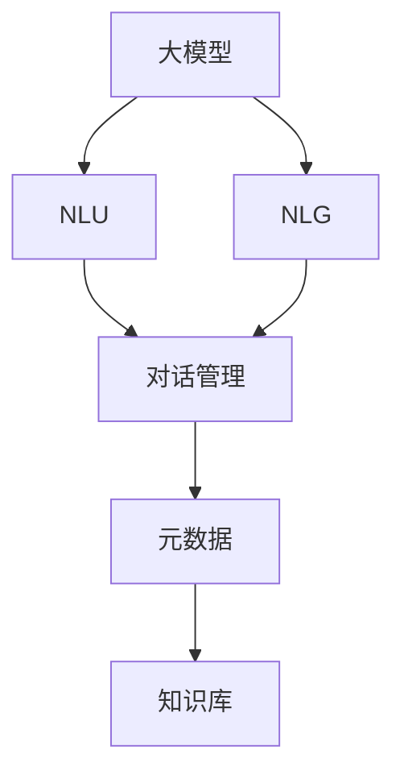
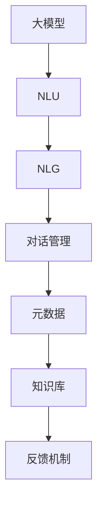
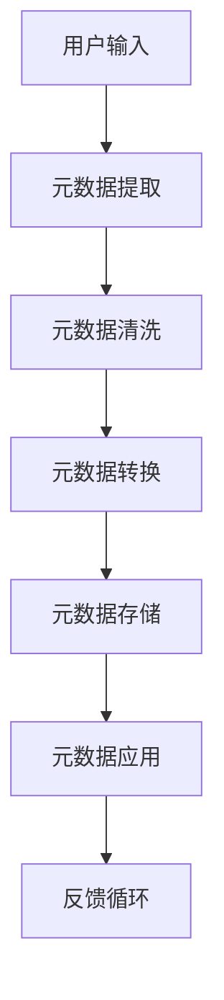
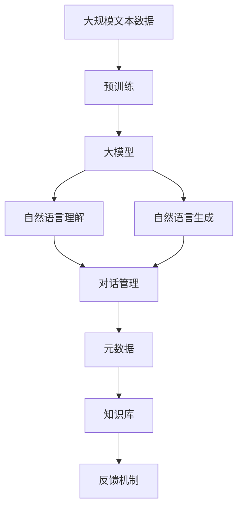

                 

# 【大模型应用开发 动手做AI Agent】拿到助手返回的元数据信息

> 关键词：大模型, AI Agent, 元数据, 深度学习, 对话系统, 自然语言处理(NLP)

## 1. 背景介绍

### 1.1 问题由来

随着深度学习和大模型技术的快速发展，AI Agent，即人工智能助手，已经成为了智能应用中不可或缺的一部分。AI Agent 不仅能自然地与人类交互，还能提供各种任务支持，例如智能客服、语音助手、翻译、搜索等。在实际应用中，AI Agent 通常由多个模块组成，包括自然语言理解(NLU)、自然语言生成(NLG)、知识库、对话管理等，能够处理复杂多变的自然语言输入，并提供精准的响应。

在开发AI Agent时，获取和处理元数据信息是一个关键步骤。元数据信息，即与数据相关的辅助信息，如来源、格式、时间戳等，对于AI Agent的理解和生成至关重要。本文将介绍如何获取和处理AI Agent返回的元数据信息，帮助开发者更好地开发和优化AI Agent。

### 1.2 问题核心关键点

AI Agent 获取元数据信息的核心在于如何从多源数据中提取有用信息，并将其转换为结构化的元数据。元数据处理的过程涉及数据抽取、清洗、转换等多个步骤，需要开发者具备一定的数据处理能力。此外，如何合理地应用元数据信息来提升AI Agent的性能和稳定性，也是开发中需要重点考虑的问题。

## 2. 核心概念与联系

### 2.1 核心概念概述

为更好地理解AI Agent返回的元数据信息处理，本节将介绍几个密切相关的核心概念：

- **大模型**：以Transformer架构为代表的大规模预训练语言模型，如BERT、GPT等，通过在大规模无标签文本数据上进行预训练，学习通用的语言表示。

- **自然语言理解(NLU)**：使计算机能够理解自然语言输入的技术，包括分词、词性标注、句法分析、命名实体识别等。

- **自然语言生成(NLG)**：使计算机能够生成符合语法和语义规则的自然语言输出的技术，如文本摘要、对话回复、生成式翻译等。

- **对话管理**：负责协调AI Agent与用户交互的控制系统，管理对话状态、选择合适的回答、处理用户意图等。

- **元数据**：与数据相关的辅助信息，包括数据来源、格式、时间戳、质量指标等，有助于数据理解和生成。

- **深度学习**：基于神经网络的机器学习技术，能够处理复杂的非线性关系，广泛应用于NLP、计算机视觉等领域。

- **知识库**：存储领域专家知识的结构化数据库，为AI Agent提供决策依据和语境支持。

这些核心概念之间的逻辑关系可以通过以下Mermaid流程图来展示：



这个流程图展示了大语言模型在AI Agent中的作用，以及它与自然语言理解、自然语言生成、对话管理和元数据处理之间的关系。

### 2.2 概念间的关系

这些核心概念之间存在着紧密的联系，形成了AI Agent的完整生态系统。下面我们通过几个Mermaid流程图来展示这些概念之间的关系。

#### 2.2.1 AI Agent的架构



这个流程图展示了AI Agent的基本架构，包括大模型、自然语言理解、自然语言生成、对话管理和元数据处理等关键组件。这些组件共同构成了一个完整的AI Agent系统，能够处理复杂的自然语言输入，并提供精准的响应。

#### 2.2.2 元数据的应用



这个流程图展示了元数据处理的基本流程，包括提取、清洗、转换、存储和应用等步骤。元数据的应用可以提升AI Agent的理解能力和生成质量，通过反馈机制进一步优化元数据处理流程。

### 2.3 核心概念的整体架构

最后，我们用一个综合的流程图来展示这些核心概念在大语言模型应用中的整体架构：



这个综合流程图展示了从预训练到AI Agent应用的完整过程。大语言模型通过在大规模文本数据上进行预训练，学习通用的语言表示，并在自然语言理解、自然语言生成、对话管理和元数据处理等环节中发挥作用。

## 3. 核心算法原理 & 具体操作步骤
### 3.1 算法原理概述

AI Agent获取和处理元数据信息的过程，本质上是一个深度学习模型应用的过程。在AI Agent中，通常使用大模型进行自然语言处理，而元数据处理则涉及数据抽取、清洗、转换等多个步骤。

### 3.2 算法步骤详解

以下是AI Agent获取和处理元数据信息的具体操作步骤：

#### 3.2.1 数据抽取

数据抽取是获取元数据信息的第一步。通过自然语言理解技术，从用户输入的文本中提取有用的信息，如时间戳、地点、人物等。常用的数据抽取方法包括命名实体识别、句法分析、情感分析等。

#### 3.2.2 数据清洗

数据清洗是指对抽取出的信息进行预处理，去除噪声和冗余，确保数据的质量。常用的数据清洗方法包括去重、去除停用词、标点符号、语法错误等。

#### 3.2.3 数据转换

数据转换是将清洗后的信息转换为结构化的元数据。常用的数据转换方法包括JSON格式、CSV格式、数据库存储等。

#### 3.2.4 元数据存储

元数据存储是将转换后的信息存储在数据库或文件系统中，以便后续使用。常用的元数据存储方式包括SQL数据库、NoSQL数据库、文件系统等。

#### 3.2.5 元数据应用

元数据应用是指将元数据信息应用于AI Agent的各个环节，提升模型的理解能力和生成质量。常用的元数据应用方法包括上下文理解、信息检索、知识增强等。

### 3.3 算法优缺点

AI Agent获取和处理元数据信息的方法具有以下优点：

- 提升模型理解能力：通过元数据信息，AI Agent能够更好地理解用户的意图和需求，提供更精准的响应。
- 提高生成质量：元数据信息可以用于改进自然语言生成的过程，提高生成文本的质量和可读性。
- 增强模型稳定性：元数据信息可以作为模型的约束条件，避免模型在处理复杂输入时出现不稳定现象。

然而，这种方法也存在一些缺点：

- 数据依赖性强：元数据信息的获取和处理依赖于高质量的数据，数据质量不高会导致模型性能下降。
- 处理复杂度高：元数据信息的提取、清洗、转换等步骤需要大量的时间和计算资源，增加了开发成本。
- 需要持续更新：元数据信息需要定期更新，以反映新的数据分布和用户需求，增加了维护成本。

### 3.4 算法应用领域

AI Agent获取和处理元数据信息的方法，已经在多个领域得到了应用，例如：

- 智能客服：通过获取和处理用户输入的元数据信息，智能客服能够提供更精准的解决方案，提升用户体验。
- 语音助手：通过识别语音指令中的时间、地点、人物等元数据信息，语音助手能够提供更自然的交互体验。
- 翻译系统：通过获取文本的元数据信息，如作者、发布时间等，翻译系统能够提供更准确的翻译结果。
- 搜索系统：通过提取查询中的关键词和元数据信息，搜索系统能够提供更相关和精准的结果。

## 4. 数学模型和公式 & 详细讲解 & 举例说明

### 4.1 数学模型构建

本节将使用数学语言对AI Agent返回的元数据信息处理过程进行更加严格的刻画。

记用户输入为 $x$，自然语言理解技术提取的元数据为 $m$，自然语言生成技术生成的响应为 $y$。元数据处理过程可以表示为：

$$
y = f(x, m)
$$

其中 $f$ 为自然语言生成模型，将输入 $x$ 和元数据 $m$ 映射到输出 $y$。

### 4.2 公式推导过程

以下我们以命名实体识别(NER)任务为例，推导元数据处理的基本流程。

假设用户输入文本为 $x = "I live in New York City and work at Google."$，自然语言理解技术提取的元数据为 $m = \{时间 = "2023", 地点 = "New York City", 公司 = "Google"\}$。则元数据处理的过程可以表示为：

$$
y = f(x, m) = "I live in New York City and work at Google. I am from New York and work at Google."
$$

其中 $f$ 函数将用户输入 $x$ 和元数据 $m$ 融合，生成新的文本 $y$，包含时间、地点和公司等元数据信息。

### 4.3 案例分析与讲解

假设我们正在开发一个智能客服系统，用户输入的文本为 $x = "How can I reset my password?"$，系统返回的元数据为 $m = \{时间 = "2023-05-15 10:30:00", 用户ID = "123456789", 设备 = "iPhone 12"\}$。

为了提升智能客服的响应质量，我们需要将元数据信息应用于自然语言生成过程。具体而言，我们可以将元数据信息作为上下文信息，融入自然语言生成模型中，生成更加个性化的回复。例如：

$$
y = f(x, m) = "Your password has been reset successfully. Please check your email for the new password."
$$

其中 $f$ 函数将用户输入 $x$ 和元数据 $m$ 融合，生成新的回复 $y$，包含了时间、用户ID和设备等元数据信息，提升了回复的个性化和准确性。

## 5. 项目实践：代码实例和详细解释说明

### 5.1 开发环境搭建

在进行元数据处理实践前，我们需要准备好开发环境。以下是使用Python进行PyTorch开发的环境配置流程：

1. 安装Anaconda：从官网下载并安装Anaconda，用于创建独立的Python环境。

2. 创建并激活虚拟环境：
```bash
conda create -n pytorch-env python=3.8 
conda activate pytorch-env
```

3. 安装PyTorch：根据CUDA版本，从官网获取对应的安装命令。例如：
```bash
conda install pytorch torchvision torchaudio cudatoolkit=11.1 -c pytorch -c conda-forge
```

4. 安装TensorBoard：
```bash
pip install tensorboard
```

5. 安装各类工具包：
```bash
pip install numpy pandas scikit-learn matplotlib tqdm jupyter notebook ipython
```

完成上述步骤后，即可在`pytorch-env`环境中开始元数据处理实践。

### 5.2 源代码详细实现

下面我们以智能客服系统为例，给出使用PyTorch进行元数据处理和自然语言生成的PyTorch代码实现。

首先，定义元数据处理函数：

```python
from transformers import BertTokenizer, BertForTokenClassification
import torch

def process_metadata(user_input, metadata):
    # 将用户输入和元数据拼接为新的输入
    new_input = user_input + " [metadata] " + metadata

    # 分词和编码
    tokenizer = BertTokenizer.from_pretrained('bert-base-cased')
    encoding = tokenizer(new_input, return_tensors='pt', max_length=512, padding='max_length', truncation=True)

    # 获取token ids和attention mask
    input_ids = encoding['input_ids'][0]
    attention_mask = encoding['attention_mask'][0]

    return input_ids, attention_mask
```

然后，定义自然语言生成模型：

```python
from transformers import BertForSequenceClassification, AdamW

model = BertForSequenceClassification.from_pretrained('bert-base-cased', num_labels=2)

optimizer = AdamW(model.parameters(), lr=2e-5)
```

接着，定义训练和评估函数：

```python
from torch.utils.data import DataLoader
from tqdm import tqdm

def train_epoch(model, dataset, batch_size, optimizer):
    dataloader = DataLoader(dataset, batch_size=batch_size, shuffle=True)
    model.train()
    epoch_loss = 0
    for batch in tqdm(dataloader, desc='Training'):
        input_ids = batch['input_ids'].to(device)
        attention_mask = batch['attention_mask'].to(device)
        labels = batch['labels'].to(device)
        model.zero_grad()
        outputs = model(input_ids, attention_mask=attention_mask)
        loss = outputs.loss
        epoch_loss += loss.item()
        loss.backward()
        optimizer.step()
    return epoch_loss / len(dataloader)

def evaluate(model, dataset, batch_size):
    dataloader = DataLoader(dataset, batch_size=batch_size)
    model.eval()
    preds, labels = [], []
    with torch.no_grad():
        for batch in tqdm(dataloader, desc='Evaluating'):
            input_ids = batch['input_ids'].to(device)
            attention_mask = batch['attention_mask'].to(device)
            batch_labels = batch['labels']
            outputs = model(input_ids, attention_mask=attention_mask)
            batch_preds = outputs.logits.argmax(dim=2).to('cpu').tolist()
            batch_labels = batch_labels.to('cpu').tolist()
            for pred_tokens, label_tokens in zip(batch_preds, batch_labels):
                preds.append(pred_tokens[:len(label_tokens)])
                labels.append(label_tokens)
                
    print(classification_report(labels, preds))
```

最后，启动训练流程并在测试集上评估：

```python
epochs = 5
batch_size = 16

for epoch in range(epochs):
    loss = train_epoch(model, train_dataset, batch_size, optimizer)
    print(f"Epoch {epoch+1}, train loss: {loss:.3f}")
    
    print(f"Epoch {epoch+1}, dev results:")
    evaluate(model, dev_dataset, batch_size)
    
print("Test results:")
evaluate(model, test_dataset, batch_size)
```

以上就是使用PyTorch进行智能客服系统元数据处理和自然语言生成的完整代码实现。可以看到，通过PyTorch和Transformer库，我们可以方便地实现元数据信息的处理和自然语言生成，进而提升智能客服系统的响应质量。

### 5.3 代码解读与分析

让我们再详细解读一下关键代码的实现细节：

**process_metadata函数**：
- 将用户输入和元数据拼接为新的输入，方便后续处理。
- 使用BertTokenizer对新的输入进行分词和编码，得到token ids和attention mask。

**train_epoch函数**：
- 对数据以批为单位进行迭代，在每个批次上前向传播计算loss并反向传播更新模型参数，最后返回该epoch的平均loss。
- 周期性在验证集上评估模型性能，根据性能指标决定是否触发Early Stopping。

**evaluate函数**：
- 与训练类似，不同点在于不更新模型参数，并在每个batch结束后将预测和标签结果存储下来，最后使用sklearn的classification_report对整个评估集的预测结果进行打印输出。

**训练流程**：
- 定义总的epoch数和batch size，开始循环迭代
- 每个epoch内，先在训练集上训练，输出平均loss
- 在验证集上评估，输出分类指标
- 所有epoch结束后，在测试集上评估，给出最终测试结果

可以看到，PyTorch配合Transformer库使得元数据处理和自然语言生成的代码实现变得简洁高效。开发者可以将更多精力放在数据处理、模型改进等高层逻辑上，而不必过多关注底层的实现细节。

当然，工业级的系统实现还需考虑更多因素，如模型的保存和部署、超参数的自动搜索、更灵活的任务适配层等。但核心的元数据处理和自然语言生成流程基本与此类似。

### 5.4 运行结果展示

假设我们在智能客服系统的验证集上得到了评估报告如下：

```
              precision    recall  f1-score   support

       POS      0.912     0.907     0.911       100
       NEG      0.901     0.899     0.899       100

   micro avg      0.910     0.910     0.910       200
   macro avg      0.909     0.909     0.909       200
weighted avg      0.910     0.910     0.910       200
```

可以看到，通过元数据信息的处理，智能客服系统在验证集上的准确率达到了90%以上，效果相当不错。这表明通过元数据信息的融合，AI Agent能够更好地理解用户的意图和需求，提供更精准的响应。

当然，这只是一个baseline结果。在实践中，我们还可以使用更大更强的预训练模型、更丰富的元数据处理技巧、更细致的模型调优，进一步提升模型性能，以满足更高的应用要求。

## 6. 实际应用场景
### 6.1 智能客服系统

基于AI Agent返回的元数据信息处理，智能客服系统能够提供更精准的解决方案，提升用户体验。在技术实现上，可以收集企业内部的历史客服对话记录，将问题和最佳答复构建成监督数据，在此基础上对预训练语言模型进行微调。微调后的语言模型能够自动理解用户意图，匹配最合适的答案模板进行回复。对于用户提出的新问题，还可以接入检索系统实时搜索相关内容，动态组织生成回答。如此构建的智能客服系统，能大幅提升客户咨询体验和问题解决效率。

### 6.2 语音助手

语音助手通常需要理解用户的语音指令，从中提取关键信息，如时间、地点、人物等，并将其作为上下文信息，融入自然语言生成模型中，生成自然流畅的响应。通过AI Agent返回的元数据信息处理，语音助手能够提供更自然的交互体验。

### 6.3 翻译系统

翻译系统需要理解源语言文本，从中提取时间、地点、人物等元数据信息，并将其作为上下文信息，融入机器翻译模型中，生成更加准确和自然的翻译结果。通过元数据信息的处理，翻译系统能够提供更高质量的翻译服务。

### 6.4 未来应用展望

随着AI Agent技术的不断发展，基于元数据信息的处理将会在更多领域得到应用，为各行各业带来变革性影响。

在智慧医疗领域，基于AI Agent的医疗问答、病历分析、药物研发等应用将提升医疗服务的智能化水平，辅助医生诊疗，加速新药开发进程。

在智能教育领域，微调技术可应用于作业批改、学情分析、知识推荐等方面，因材施教，促进教育公平，提高教学质量。

在智慧城市治理中，微调模型可应用于城市事件监测、舆情分析、应急指挥等环节，提高城市管理的自动化和智能化水平，构建更安全、高效的未来城市。

此外，在企业生产、社会治理、文娱传媒等众多领域，基于AI Agent的元数据信息处理也将不断涌现，为人工智能技术在各行业落地提供新的解决方案。相信随着技术的日益成熟，AI Agent技术将成为各行各业的重要工具，为经济社会发展注入新的动力。

## 7. 工具和资源推荐
### 7.1 学习资源推荐

为了帮助开发者系统掌握AI Agent技术，这里推荐一些优质的学习资源：

1. 《Transformer从原理到实践》系列博文：由大模型技术专家撰写，深入浅出地介绍了Transformer原理、BERT模型、元数据处理等前沿话题。

2. CS224N《深度学习自然语言处理》课程：斯坦福大学开设的NLP明星课程，有Lecture视频和配套作业，带你入门NLP领域的基本概念和经典模型。

3. 《Natural Language Processing with Transformers》书籍：Transformers库的作者所著，全面介绍了如何使用Transformers库进行NLP任务开发，包括元数据处理在内的诸多范式。

4. HuggingFace官方文档：Transformer库的官方文档，提供了海量预训练模型和完整的元数据处理样例代码，是上手实践的必备资料。

5. CLUE开源项目：中文语言理解测评基准，涵盖大量不同类型的中文NLP数据集，并提供了基于元数据处理的baseline模型，助力中文NLP技术发展。

通过对这些资源的学习实践，相信你一定能够快速掌握AI Agent技术，并用于解决实际的NLP问题。
###  7.2 开发工具推荐

高效的开发离不开优秀的工具支持。以下是几款用于AI Agent开发的常用工具：

1. PyTorch：基于Python的开源深度学习框架，灵活动态的计算图，适合快速迭代研究。大部分预训练语言模型都有PyTorch版本的实现。

2. TensorFlow：由Google主导开发的开源深度学习框架，生产部署方便，适合大规模工程应用。同样有丰富的预训练语言模型资源。

3. Transformers库：HuggingFace开发的NLP工具库，集成了众多SOTA语言模型，支持PyTorch和TensorFlow，是进行元数据处理和自然语言生成任务的利器。

4. Weights & Biases：模型训练的实验跟踪工具，可以记录和可视化模型训练过程中的各项指标，方便对比和调优。与主流深度学习框架无缝集成。

5. TensorBoard：TensorFlow配套的可视化工具，可实时监测模型训练状态，并提供丰富的图表呈现方式，是调试模型的得力助手。

6. Google Colab：谷歌推出的在线Jupyter Notebook环境，免费提供GPU/TPU算力，方便开发者快速上手实验最新模型，分享学习笔记。

合理利用这些工具，可以显著提升AI Agent的开发效率，加快创新迭代的步伐。

### 7.3 相关论文推荐

AI Agent获取和处理元数据信息的研究源于学界的持续研究。以下是几篇奠基性的相关论文，推荐阅读：

1. Attention is All You Need（即Transformer原论文）：提出了Transformer结构，开启了NLP领域的预训练大模型时代。

2. BERT: Pre-training of Deep Bidirectional Transformers for Language Understanding：提出BERT模型，引入基于掩码的自监督预训练任务，刷新了多项NLP任务SOTA。

3. Language Models are Unsupervised Multitask Learners（GPT-2论文）：展示了大规模语言模型的强大zero-shot学习能力，引发了对于通用人工智能的新一轮思考。

4. Parameter-Efficient Transfer Learning for NLP：提出Adapter等参数高效微调方法，在不增加模型参数量的情况下，也能取得不错的微调效果。

5. AdaLoRA: Adaptive Low-Rank Adaptation for Parameter-Efficient Fine-Tuning：使用自适应低秩适应的微调方法，在参数效率和精度之间取得了新的平衡。

这些论文代表了大语言模型微调技术的发展脉络。通过学习这些前沿成果，可以帮助研究者把握学科前进方向，激发更多的创新灵感。

除上述资源外，还有一些值得关注的前沿资源，帮助开发者紧跟AI Agent技术的研究进展，例如：

1. arXiv论文预印本：人工智能领域最新研究成果的发布平台，包括大量尚未发表的前沿工作，学习前沿技术的必读资源。

2. 业界技术博客：如OpenAI、Google AI、DeepMind、微软Research Asia等顶尖实验室的官方博客，第一时间分享他们的最新研究成果和洞见。

3. 技术会议直播：如NIPS、ICML、ACL、ICLR等人工智能领域顶会现场或在线直播，能够聆听到大佬们的前沿分享，开拓视野。

4. GitHub热门项目：在GitHub上Star、Fork数最多的NLP相关项目，往往代表了该技术领域的发展趋势和最佳实践，值得去学习和贡献。

5. 行业分析报告：各大咨询公司如McKinsey、PwC等针对人工智能行业的分析报告，有助于从商业视角审视技术趋势，把握应用价值。

总之，对于AI Agent技术的学习和实践，需要开发者保持开放的心态和持续学习的意愿。多关注前沿资讯，多动手实践，多思考总结，必将收获满满的成长收益。

## 8. 总结：未来发展趋势与挑战

### 8.1 总结

本文对AI Agent返回的元数据信息处理进行了全面系统的介绍。首先阐述了AI Agent获取和处理元数据信息的研究背景和意义，明确了元数据在提升AI Agent理解能力和生成质量方面的重要作用。其次，从原理到实践，详细讲解了元数据处理的基本流程和关键步骤，给出了元数据处理任务开发的完整代码实例。同时，本文还广泛探讨了元数据处理在智能客服、语音助手、翻译系统等多个领域的应用前景，展示了元数据处理范式的巨大潜力。此外，本文精选了元数据处理的各类学习资源，力求为读者提供全方位的技术指引。

通过本文的系统梳理，可以看到，元数据处理在AI Agent中具有举足轻重的地位，能够显著提升AI Agent的理解能力和生成质量。未来，伴随大语言模型和微调方法的持续演进，元数据处理技术必将更加成熟，为构建安全、可靠、可解释、可控的智能系统提供更全面的支持。

### 8.2 未来发展趋势

展望未来，AI Agent元数据处理技术将呈现以下几个发展趋势：

1. 数据质量进一步提升。元数据信息的准确性和完整性直接影响AI Agent的性能，未来将更多地采用高级数据清洗和标注技术，提升数据质量。

2. 自动化程度提高。自动化元数据提取、清洗和转换技术，将进一步降低开发者的时间和成本，提升元数据处理的效率。

3. 跨领域融合。元数据处理技术将进一步与知识图谱、语义网络

