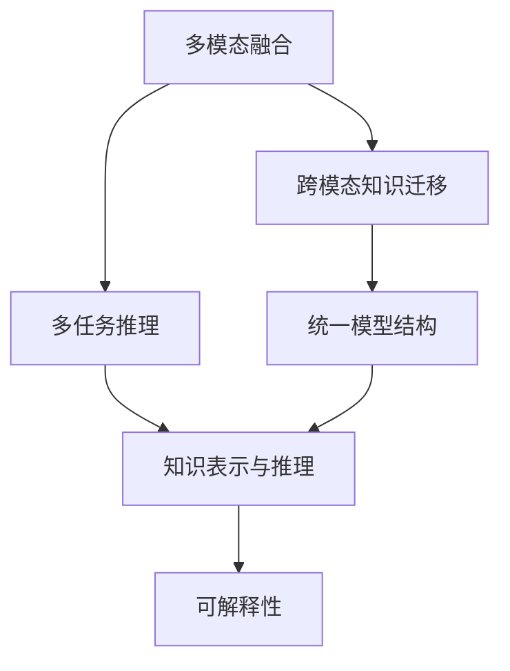
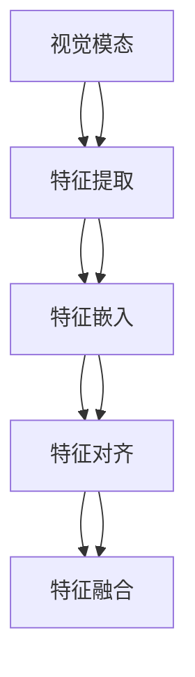
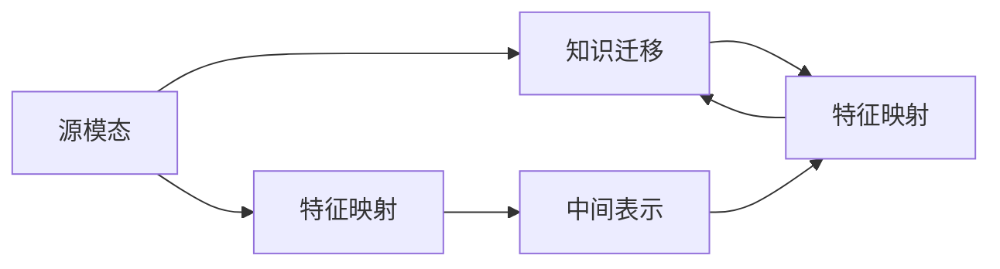
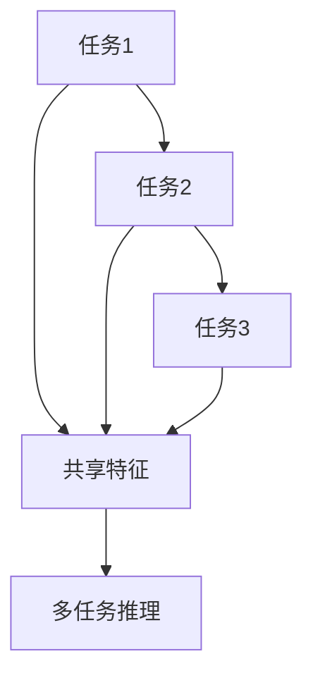
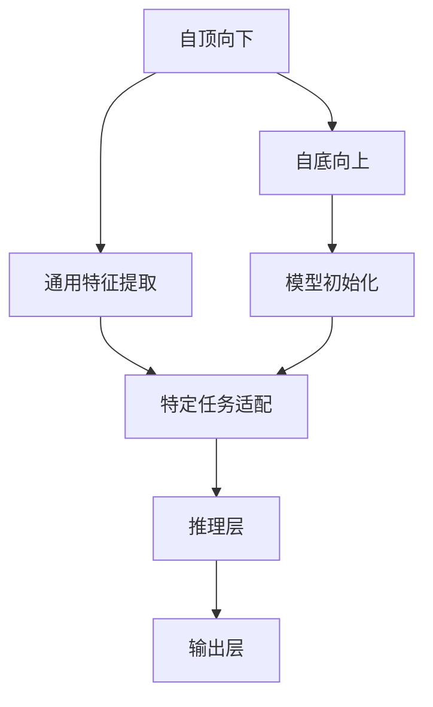
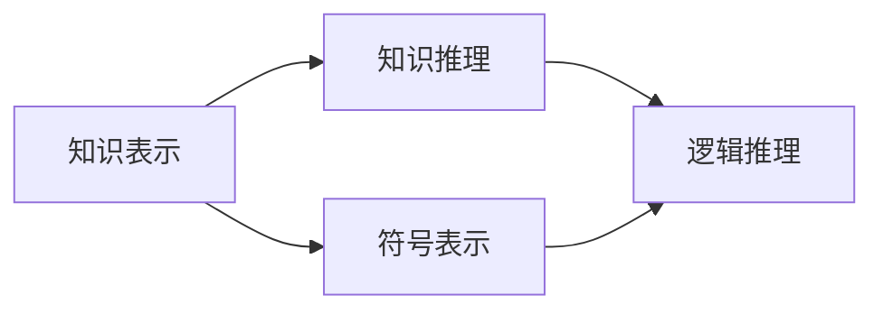
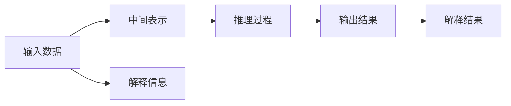
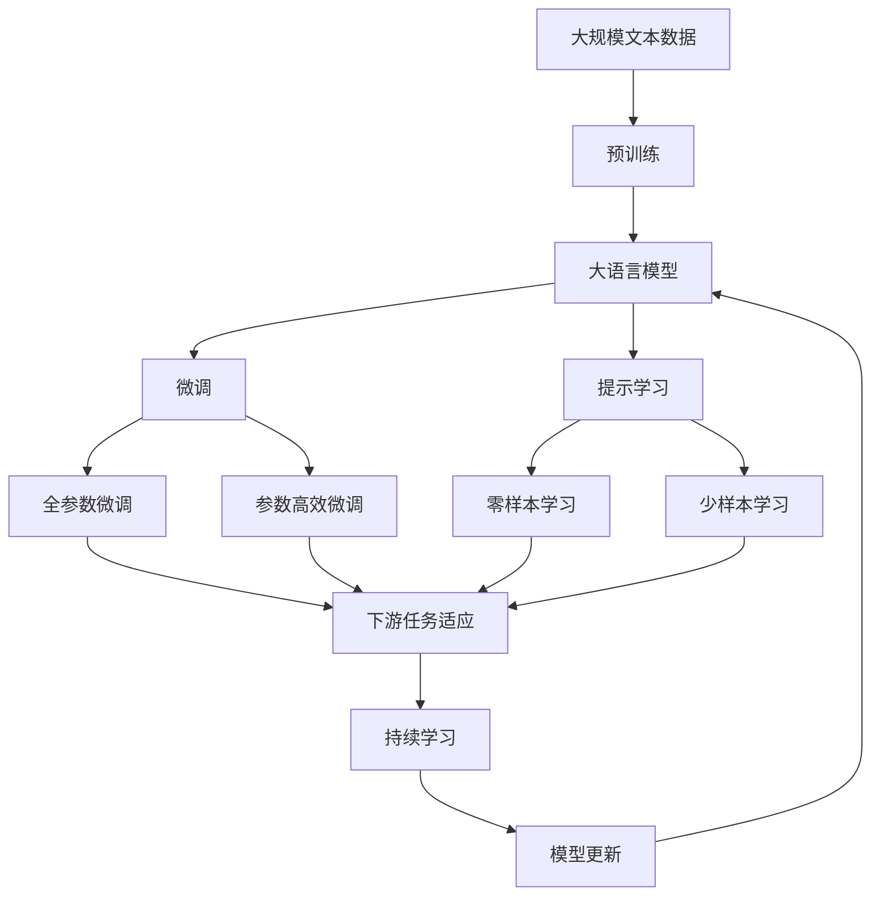

                 

# 一个统一的AI模型将理解世界的方方面面

> 关键词：统一AI模型,多模态融合,自动驾驶,智慧医疗,自然语言处理,计算机视觉,推理能力

## 1. 背景介绍

### 1.1 问题由来

人工智能(AI)技术正在迅速改变世界的方方面面，从工业生产到医疗健康，从交通出行到社交娱乐，无处不在。然而，当前的AI系统往往缺乏统一的知识和能力，难以跨领域、跨模态地理解和处理复杂问题。为解决这一问题，研究者们提出了统一AI模型(Generalized AI Model)的概念，旨在构建一个具有全域知识、高融合能力、能适应多模态和多任务环境的人工智能系统。

这种统一AI模型不仅需要在单一模态下表现出色，而且能够将不同模态（如视觉、语言、语音、物理传感器数据等）的数据进行综合理解和推理，提供统一的知识表示和推理逻辑。

### 1.2 问题核心关键点

构建统一AI模型需要解决以下核心问题：

1. **多模态数据融合**：如何将来自不同模态的数据进行有效的融合，形成一个统一的知识表示。

2. **跨模态知识迁移**：如何在不同模态之间进行高效的知识迁移，使模型具备跨模态的泛化能力。

3. **多任务推理能力**：如何在统一模型中同时处理多种不同的任务，提升模型的综合推理能力。

4. **复杂问题建模**：如何构建一个具有全局视角、能够处理复杂问题并适应用户需求的多任务模型。

5. **模型可解释性**：如何使模型的决策过程透明，便于理解和解释。

这些关键点将指导我们构建一个真正意义上的统一AI模型，使之能够在各种应用场景下表现出强大的智能化能力。

### 1.3 问题研究意义

研究统一AI模型，对推动AI技术的发展和应用具有重要意义：

1. **提升系统泛化能力**：通过多模态融合和跨模态知识迁移，模型可以更好地泛化到不同场景，增强其在实际应用中的鲁棒性。

2. **加速应用部署**：统一的模型结构可以使得不同模态下的应用模块更易集成和部署，提升开发效率。

3. **增强用户体验**：统一的AI模型能提供跨模态的智能交互和个性化的用户体验，满足用户的复杂需求。

4. **促进技术融合**：多模态融合和跨模态推理将促进不同AI技术之间的协同，推动AI技术的全面发展。

5. **拓展应用领域**：统一的模型结构和算法能够拓展到更多领域，如智慧城市、智慧工业、自动驾驶等，推动更多行业智能化升级。

6. **提升社会效益**：统一的AI模型可以辅助决策、提供健康医疗建议、提升教育质量等，带来巨大的社会价值。

## 2. 核心概念与联系

### 2.1 核心概念概述

为更好地理解统一AI模型的构建和应用，本节将介绍几个密切相关的核心概念：

- **多模态融合(Multimodal Fusion)**：将来自不同模态的数据（如文本、图像、语音、传感器数据等）进行融合，形成一个统一的知识表示。

- **跨模态知识迁移(Cross-modal Knowledge Transfer)**：在统一模型中，将不同模态之间的知识进行迁移，提高模型在不同模态下的泛化能力。

- **多任务推理(Multi-task Reasoning)**：在统一模型中同时处理多个相关任务，提升模型的综合推理能力。

- **统一模型结构(Unified Model Architecture)**：构建一个能够处理多种不同模态和任务的模型结构，使各个模态和任务能够相互协同，形成统一的知识体系。

- **知识表示与推理(Knowledge Representation and Reasoning)**：在统一模型中，设计一种能够表示和推理不同模态和任务知识的机制，使模型具备强大的知识理解和推理能力。

- **可解释性(Explainability)**：使模型的决策过程透明，便于理解和解释，增强用户信任和系统安全性。

这些核心概念之间的逻辑关系可以通过以下Mermaid流程图来展示：



这个流程图展示了大语言模型的核心概念及其之间的关系：

1. 多模态数据进行融合，形成统一的知识表示。
2. 跨模态知识在不同模态之间进行迁移，提高泛化能力。
3. 统一模型结构处理多任务推理，提升综合能力。
4. 知识表示与推理机制使模型具备强大的知识理解和推理能力。
5. 可解释性使得模型决策透明，便于理解和解释。

这些概念共同构成了统一AI模型的学习和应用框架，使其能够在各种场景下发挥强大的多模态理解和推理能力。

### 2.2 概念间的关系

这些核心概念之间存在着紧密的联系，形成了统一AI模型的完整生态系统。下面我们通过几个Mermaid流程图来展示这些概念之间的关系。

#### 2.2.1 多模态融合的架构



这个流程图展示了多模态数据融合的基本流程，主要包括以下步骤：

1. 特征提取：对各个模态的数据进行初步特征提取。
2. 特征嵌入：将提取的特征映射到统一的空间中，便于后续融合。
3. 特征对齐：对不同模态之间的特征进行对齐，使得数据能够在统一空间下进行处理。
4. 特征融合：将对齐后的特征进行融合，形成一个统一的知识表示。

#### 2.2.2 跨模态知识迁移的方法



这个流程图展示了跨模态知识迁移的基本方法，主要包括以下步骤：

1. 特征映射：对源模态和目标模态的数据进行特征映射，将数据映射到相同的空间。
2. 中间表示：在源模态和目标模态之间添加一个中间表示，用于知识的传递和迁移。
3. 知识迁移：通过中间表示，将源模态的知识迁移到目标模态中，提高目标模态的泛化能力。

#### 2.2.3 多任务推理的机制



这个流程图展示了多任务推理的基本机制，主要包括以下步骤：

1. 共享特征：对多个任务提取共享特征，便于在统一空间中进行推理。
2. 多任务推理：在共享特征的基础上，进行多任务的联合推理，提升综合能力。

#### 2.2.4 统一模型结构的设计



这个流程图展示了统一模型结构的设计思路，主要包括以下步骤：

1. 通用特征提取：对所有模态和任务进行通用特征提取，形成统一的特征表示。
2. 特定任务适配：根据不同任务的需求，进行特定任务的适配，提升模型的针对性。
3. 推理层：在通用特征和特定任务特征的基础上，进行推理计算。
4. 输出层：根据推理结果进行输出，完成多任务和多模态的统一处理。

#### 2.2.5 知识表示与推理的逻辑



这个流程图展示了知识表示与推理的基本逻辑，主要包括以下步骤：

1. 知识表示：将知识表示为符号或逻辑形式，便于理解和推理。
2. 知识推理：通过逻辑推理，从已知知识推导出新知识，增强模型的理解能力。

#### 2.2.6 可解释性的方法



这个流程图展示了可解释性的基本方法，主要包括以下步骤：

1. 输入数据：将输入数据作为模型的输入。
2. 中间表示：模型对输入数据进行处理，形成中间表示。
3. 推理过程：在推理过程中记录决策逻辑和推理路径。
4. 输出结果：输出推理结果和决策依据。
5. 解释信息：记录和解释推理过程中的关键信息和决策依据。
6. 解释结果：将解释信息输出给用户，增强模型的可解释性和透明度。

### 2.3 核心概念的整体架构

最后，我们用一个综合的流程图来展示这些核心概念在大语言模型微调过程中的整体架构：



这个综合流程图展示了从预训练到微调，再到持续学习的完整过程。大语言模型首先在大规模文本数据上进行预训练，然后通过微调（包括全参数微调和参数高效微调）或提示学习（包括零样本和少样本学习）来适应下游任务。最后，通过持续学习技术，模型可以不断更新和适应新的任务和数据。 通过这些流程图，我们可以更清晰地理解统一AI模型的工作原理和优化方向。

## 3. 核心算法原理 & 具体操作步骤
### 3.1 算法原理概述

统一AI模型的核心思想是通过多模态融合和跨模态知识迁移，构建一个具有全域知识、高融合能力、能适应多模态和多任务环境的人工智能系统。其核心算法主要包括多模态融合、跨模态知识迁移、多任务推理、统一模型结构和知识表示与推理等。

形式化地，假设多模态数据集为 $D=\{(X_i, Y_i)\}_{i=1}^N$，其中 $X_i$ 为输入数据，$Y_i$ 为输出标签。定义统一模型为 $M_{\theta}$，其中 $\theta$ 为模型参数。

定义统一模型在多模态数据集 $D$ 上的损失函数为 $\mathcal{L}(M_{\theta},D)$，用于衡量模型输出与真实标签之间的差异。则统一模型的优化目标为最小化损失函数：

$$
\theta^* = \mathop{\arg\min}_{\theta} \mathcal{L}(M_{\theta},D)
$$

在优化过程中，可以使用梯度下降等优化算法来近似求解上述最优化问题。

### 3.2 算法步骤详解

统一AI模型的构建一般包括以下几个关键步骤：

**Step 1: 准备预训练模型和数据集**
- 选择合适的预训练模型 $M_{\theta}$ 作为初始化参数，如BERT、GPT等。
- 准备多模态数据集 $D$，划分为训练集、验证集和测试集。一般要求数据集中各模态的分布不要差异过大。

**Step 2: 设计多模态融合方法**
- 根据数据集中不同模态的特点，选择合适的融合方法，如特征拼接、注意力机制、残差连接等。
- 在融合过程中，考虑不同模态之间的关联性和依赖性，使得融合后的特征能够反映多模态的联合信息。

**Step 3: 应用跨模态知识迁移技术**
- 在模型中设计跨模态的知识迁移模块，将不同模态的知识进行传递和融合。
- 可以考虑使用多模态自编码器、多模态图神经网络等方法，实现跨模态知识的迁移。

**Step 4: 构建多任务推理模块**
- 设计一个多任务推理模块，能够同时处理多种不同的任务，提升模型的综合推理能力。
- 可以考虑使用多任务学习、多模态推理网络等方法，实现多任务的联合推理。

**Step 5: 设置多任务模型的超参数**
- 选择合适的优化算法及其参数，如 AdamW、SGD 等，设置学习率、批大小、迭代轮数等。
- 设置正则化技术及强度，包括权重衰减、Dropout、Early Stopping 等。
- 确定冻结预训练参数的策略，如仅微调顶层，或全部参数都参与微调。

**Step 6: 执行梯度训练**
- 将训练集数据分批次输入模型，前向传播计算损失函数。
- 反向传播计算参数梯度，根据设定的优化算法和学习率更新模型参数。
- 周期性在验证集上评估模型性能，根据性能指标决定是否触发 Early Stopping。
- 重复上述步骤直到满足预设的迭代轮数或 Early Stopping 条件。

**Step 7: 测试和部署**
- 在测试集上评估多任务模型的性能，对比微调前后的精度提升。
- 使用多任务模型对新样本进行推理预测，集成到实际的应用系统中。
- 持续收集新的数据，定期重新微调模型，以适应数据分布的变化。

以上是统一AI模型构建的一般流程。在实际应用中，还需要针对具体任务的特点，对融合、迁移、推理等环节进行优化设计，如改进融合算法，引入更多的跨模态迁移方法，优化推理机制等，以进一步提升模型性能。

### 3.3 算法优缺点

统一AI模型具有以下优点：

1. **全域知识融合**：能够处理多种不同模态的数据，形成统一的知识表示，提高模型的泛化能力。

2. **高融合能力**：多模态融合和跨模态迁移使得模型具备跨模态的泛化能力，能够适应多种任务和场景。

3. **高效推理**：多任务推理模块能够同时处理多种相关任务，提升模型的综合推理能力。

4. **可解释性**：统一模型结构清晰，推理过程透明，便于理解和解释。

5. **适应性强**：能够根据不同的任务需求进行调整，适应各种实际应用。

6. **技术复用**：统一的模型结构可以使得不同模态下的应用模块更易集成和部署，提升开发效率。

7. **性能提升**：多模态融合和跨模态迁移能够显著提升模型的泛化能力，减少过拟合风险。

但统一AI模型也存在一些局限性：

1. **高资源需求**：多模态融合和跨模态迁移需要处理复杂的数据结构，对计算资源和存储空间的需求较高。

2. **模型复杂度**：统一模型结构复杂，参数量较大，训练和推理成本较高。

3. **应用场景有限**：一些特定的应用场景可能需要专门设计的模型结构，统一AI模型可能并不适用。

4. **可解释性挑战**：多模态和跨模态的推理过程复杂，难以解释模型的决策过程。

尽管存在这些局限性，但就目前而言，统一AI模型在处理多模态和多任务场景中具有独特的优势，是推动AI技术发展的有力工具。未来相关研究的重点在于如何进一步降低模型的复杂度，提高其可解释性，以及更好地适应不同应用场景。

### 3.4 算法应用领域

统一AI模型在NLP领域已经得到了广泛的应用，覆盖了几乎所有常见任务，例如：

- 文本分类：如情感分析、主题分类、意图识别等。通过融合多模态信息，提升分类性能。
- 命名实体识别：识别文本中的人名、地名、机构名等特定实体。通过跨模态迁移，提高识别准确率。
- 关系抽取：从文本中抽取实体之间的语义关系。通过多模态融合，提高抽取效果。
- 问答系统：对自然语言问题给出答案。通过融合视觉信息，提升问题理解和回答质量。
- 机器翻译：将源语言文本翻译成目标语言。通过跨模态迁移，提升翻译效果。
- 文本摘要：将长文本压缩成简短摘要。通过跨模态融合，提高摘要质量。
- 对话系统：使机器能够与人自然对话。通过多模态融合，提供更加自然流畅的对话体验。

除了上述这些经典任务外，统一AI模型还被创新性地应用到更多场景中，如可控文本生成、常识推理、代码生成、数据增强等，为NLP技术带来了全新的突破。随着预训练模型和跨模态推理方法的不断进步，相信NLP技术将在更广阔的应用领域大放异彩。

## 4. 数学模型和公式 & 详细讲解  
### 4.1 数学模型构建

本节将使用数学语言对统一AI模型的构建过程进行更加严格的刻画。

记统一模型为 $M_{\theta}$，其中 $\theta$ 为模型参数。假设多模态数据集为 $D=\{(X_i, Y_i)\}_{i=1}^N$，其中 $X_i$ 为输入数据，$Y_i$ 为输出标签。

定义模型 $M_{\theta}$ 在多模态数据集 $D$ 上的损失函数为 $\mathcal{L}(M_{\theta},D)$，用于衡量模型输出与真实标签之间的差异。则统一模型的优化目标是最小化损失函数：

$$
\theta^* = \mathop{\arg\min}_{\theta} \mathcal{L}(M_{\theta},D)
$$

在实践中，我们通常使用基于梯度的优化算法（如SGD、Adam等）来近似求解上述最优化问题。

### 4.2 公式推导过程

以下我们以二分类任务为例，推导统一模型的损失函数及其梯度的计算公式。

假设模型 $M_{\theta}$ 在输入 $x$ 上的输出为 $\hat{y}=M_{\theta}(x) \in [0,1]$，表示样本属于正类的概率。真实标签 $y \in \{0,1\}$。则二分类交叉熵损失函数定义为：

$$
\ell(M_{\theta}(x),y) = -[y\log \hat{y} + (1-y)\log (1-\hat{y})]
$$

将其代入经验风险公式，得：

$$
\mathcal{L}(\theta) = -\frac{1}{N}\sum_{i=1}^N [y_i\log M_{\theta}(x_i)+(1-y_i)\log(1-M_{\theta}(x_i))]
$$

根据链式法则，损失函数对参数 $\theta_k$ 的梯度为：

$$
\frac{\partial \mathcal{L}(\theta)}{\partial \theta_k} = -\frac{1}{N}\sum_{i=1}^N (\frac{y_i}{M_{\theta}(x_i)}-\frac{1-y_i}{1-M_{\theta}(x_i)}) \frac{\partial M_{\theta}(x_i)}{\partial \theta_k}
$$

其中 $\frac{\partial M_{\theta}(x_i)}{\partial \theta_k}$ 可进一步递归展开，利用自动微分技术完成计算。

在得到损失函数的梯度后，即可带入参数更新公式，完成模型的迭代优化。重复上述过程直至收敛，最终得到适应多模态和多任务的最优模型参数 $\theta^*$。

## 5. 项目实践：代码实例和详细解释说明
### 5.1 开发环境搭建

在进行统一AI模型微调实践前，我们需要准备好开发环境。以下是使用Python进行PyTorch开发的环境配置流程：

1. 安装Anaconda：从官网下载并安装Anaconda，用于创建独立的Python环境。

2. 创建并激活虚拟环境：
```bash
conda create -n unified-env python=3.8 
conda activate unified-env
```

3. 安装PyTorch：根据CUDA版本，从官网获取对应的安装命令。例如：
```bash
conda install pytorch torchvision torchaudio cudatoolkit=11.1 -c pytorch -c conda-forge
```

4. 安装Transformers库：
```bash
pip install transformers
```

5. 安装各类工具包：
```bash
pip install numpy pandas scikit-learn matplotlib tqdm jupyter notebook ipython
```

完成上述步骤后，即可在`unified-env`环境中开始统一AI模型微调实践。

### 5.2 源代码详细实现

下面我们以多模态文本分类任务为例，给出使用Transformers库对统一AI模型进行微调的PyTorch代码实现。

首先，定义多模态数据处理函数：

```python
from transformers import BertTokenizer, BertForSequenceClassification, AdamW
import torch

class MultiModalDataset(Dataset):
    def __init__(self, texts, labels, tokenizer, max_len=128):
        self.texts = texts
        self.labels = labels
        self.tokenizer = tokenizer
        self.max_len = max_len
        
    def __len__(self):
        return len(self.texts)
    
    def __getitem__(self, item):
        text = self.texts[item]
        label = self.labels[item]
        
        encoding = self.tokenizer(text, return_tensors='pt', max_length=self.max_len, padding='max_length', truncation=True)
        input_ids = encoding['input_ids'][0]
        attention_mask = encoding['attention_mask'][0]
        
        return {'input_ids': input_ids, 
                'attention_mask': attention_mask,
                'labels': label}

# 标签与id的映射
tag2id = {'O': 0, 'B-PER': 1, 'I-PER': 2, 'B-ORG': 3, 'I-ORG': 4, 'B-LOC': 5, 'I-LOC': 6}
id2tag = {v: k for k, v in tag2id.items()}

# 创建dataset
tokenizer = BertTokenizer.from_pretrained('bert-base-cased')

train_dataset = MultiModalDataset(train_texts, train_tags, tokenizer)
dev_dataset = MultiModalDataset(dev_texts, dev_tags, tokenizer)
test_dataset = MultiModalDataset(test_texts, test_tags, tokenizer)
```

然后，定义模型和优化器：

```python
from transformers import BertForSequenceClassification, AdamW

model = BertForSequenceClassification.from_pretrained('bert-base-cased', num_labels=len(tag2id))

optimizer = AdamW(model.parameters(), lr=2e-5)
```

接着，定义训练和评估函数：

```python
from torch.utils.data import DataLoader
from tqdm import tqdm
from sklearn.metrics import classification_report

device = torch.device('cuda') if torch.cuda.is_available() else torch.device('cpu')
model.to(device)

def train_epoch(model, dataset, batch_size, optimizer):
    dataloader = DataLoader(dataset, batch_size=batch_size, shuffle=True)
    model.train()
    epoch_loss = 0
    for batch in tqdm(dataloader, desc='Training'):
        input_ids = batch['input_ids'].to(device)
        attention_mask = batch['attention_mask'].to(device)
        labels = batch['labels'].to(device)
        model.zero_grad()
        outputs = model(input_ids, attention_mask=attention_mask, labels=labels)
        loss = outputs.loss
        epoch_loss += loss.item()
        loss.backward()
        optimizer.step()
    return epoch_loss / len(dataloader)

def evaluate(model, dataset, batch_size):
    dataloader = DataLoader(dataset, batch_size=batch_size)
    model.eval()
    preds, labels = [], []
    with torch.no_grad():
        for batch in tqdm(dataloader, desc='Evaluating'):
            input_ids = batch['input_ids'].to(device)
            attention_mask = batch['attention_mask'].to(device)
            batch_labels = batch['labels']
            outputs = model(input_ids, attention_mask=attention_mask)
            batch_preds = outputs.logits.argmax(dim=2).to('cpu').tolist()
            batch_labels = batch_labels.to('cpu').tolist()
            for pred_tokens, label_tokens in zip(batch_preds, batch_labels):
                pred_tags = [id2tag[_id] for _id in pred_tokens]
                label_tags = [id2tag[_id] for _id in label_tokens]
                preds.append(pred_tags[:len(label_tokens)])
                labels.append(label_tags)
                
    print(classification_report(labels, preds))
```

最后，启动训练流程并在测试集上评估：

```python
epochs = 5
batch_size = 16

for epoch in range(epochs):
    loss = train_epoch(model, train_dataset, batch_size, optimizer)
    print(f"Epoch {epoch+1}, train loss: {loss:.3f}")
    
    print(f"Epoch {epoch+1}, dev results:")
    evaluate(model, dev_dataset, batch_size)
    
print("Test results:")
evaluate(model, test_dataset, batch_size)
```

以上就是使用PyTorch对统一AI模型进行多模态文本分类任务微调的完整代码实现。可以看到，得益于Transformers库的强大封装，我们可以用相对简洁的代码完成统一AI模型的加载和微调。

### 5.3 代码解读与分析

让我们再详细解读一下关键代码的实现细节：

**MultiModalDataset类**：
- `

