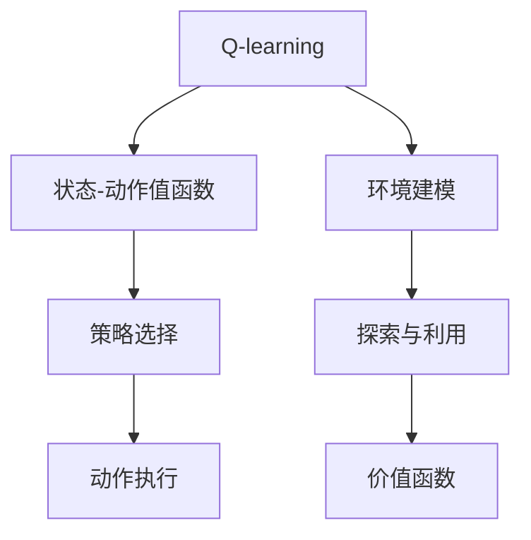
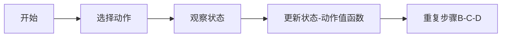
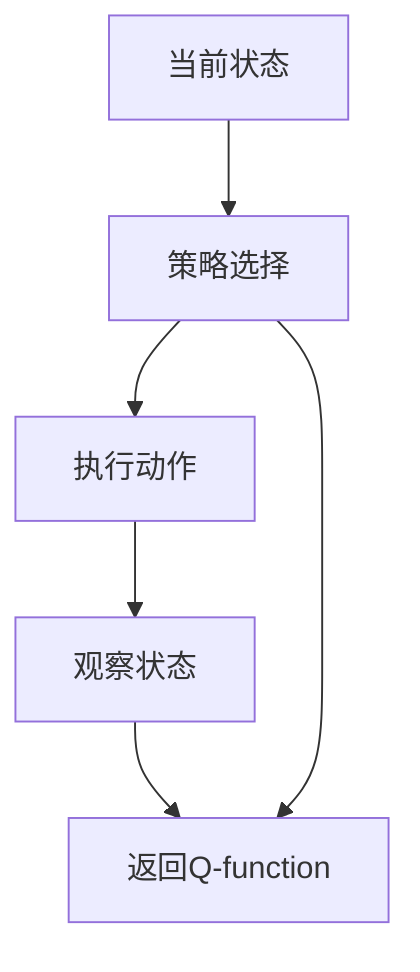
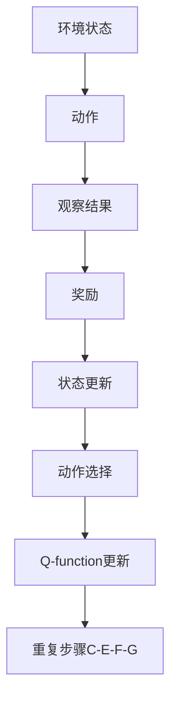

                 

# 一切皆是映射：AI Q-learning环境模型建立

> 关键词：
>
> - Q-learning
> - AI
> - 强化学习
> - 环境模型建立
> - 状态空间

## 1. 背景介绍

### 1.1 问题由来
强化学习（Reinforcement Learning, RL）是人工智能领域中一个重要的分支，通过智能体与环境的交互，逐步学习最优策略以实现某一特定目标。在RL中，智能体（agent）通过与环境的交互获取奖励和惩罚，通过不断的试错来优化行为策略，从而最大化长期累积奖励。

Q-learning是强化学习中一种经典的策略评估方法，能够有效地处理未知环境，对模型参数更新不依赖于模型的内部状态。由于其在处理多维状态空间、离散动作空间等场景下的高效性，Q-learning成为构建智能决策系统的基础。

环境建模（Environment Modeling）是强化学习的重要环节，通过建立精确的环境模型，可以提升智能体的决策效率，优化学习效果。通过构建环境的动态模型，可以更好地模拟真实环境中的不确定性，更高效地进行探索和利用。

本文将聚焦于基于Q-learning的AI环境模型建立方法，通过系统介绍Q-learning原理与实践，分析其在不同场景中的应用，并给出详细的代码实现和应用示例。

### 1.2 问题核心关键点
Q-learning的核心思想是通过观察当前状态和执行的动作，预测未来的状态和奖励，从而评估当前状态-动作对下的价值。其核心算法包括状态-动作值函数（State-Action Value Function）的估计和更新，以及基于最大值搜索的策略选择。

Q-learning的优缺点如下：
- 优点：算法简单，易于实现；适用于处理多维状态空间和离散动作空间；可以通过离线学习来优化策略。
- 缺点：可能会陷入局部最优；对环境的模拟和奖励函数的建模要求较高；状态-动作值函数的更新较为耗时。

在实际应用中，Q-learning已经被广泛应用于游戏智能、机器人控制、路径规划、自适应控制等多个领域，为智能决策系统提供了重要技术支持。

### 1.3 问题研究意义
构建高效的Q-learning环境模型，对于提升智能体在复杂环境中的决策能力、优化训练效率具有重要意义。通过精确的环境建模，智能体能够更好地理解环境特性，高效探索和利用，从而取得更好的学习效果。

在自动驾驶、机器人导航、物流配送等高精度决策领域，环境模型的精确度直接影响到系统的安全性和鲁棒性。通过改进环境建模方法，可以在不增加计算成本的情况下，提升系统的决策性能，加速应用落地。

## 2. 核心概念与联系

### 2.1 核心概念概述

为更好地理解Q-learning算法，本节将介绍几个密切相关的核心概念：

- Q-learning：强化学习中一种基于价值函数估计的策略评估方法，通过不断更新状态-动作值函数来优化策略。
- 状态-动作值函数(Q-function)：表示在特定状态下执行特定动作的长期累积奖励的估计值。
- 策略选择：智能体根据当前状态和状态-动作值函数，选择最优动作以最大化长期累积奖励。
- 环境建模：通过构建环境的数学模型，模拟智能体的行为和环境动态，提升智能体的决策效率。
- 探索与利用：智能体在环境中探索未知状态，利用已知状态-动作值函数进行策略选择，平衡探索与利用，优化学习效果。
- 价值函数：用于评估当前状态-动作对下长期累积奖励的值，Q-learning的核心即为状态-动作值函数的更新。

这些核心概念之间的逻辑关系可以通过以下Mermaid流程图来展示：



这个流程图展示了大语言模型的核心概念及其之间的关系：

1. Q-learning通过状态-动作值函数评估当前状态-动作对下的长期累积奖励。
2. 策略选择利用状态-动作值函数，选择当前最优动作以最大化奖励。
3. 环境建模模拟智能体的行为和环境动态，提升决策效率。
4. 探索与利用平衡探索未知状态和利用已知状态-动作值函数，优化学习效果。
5. 价值函数用于评估当前状态-动作对下的长期累积奖励，是Q-learning的核心。

这些概念共同构成了Q-learning算法的工作原理和优化方向，是其成功应用的关键。

### 2.2 概念间的关系

这些核心概念之间存在着紧密的联系，形成了Q-learning算法的完整生态系统。下面我们通过几个Mermaid流程图来展示这些概念之间的关系。

#### 2.2.1 Q-learning算法流程



这个流程图展示了Q-learning算法的核心流程：

1. 智能体根据当前状态选择动作。
2. 观察环境反馈的状态。
3. 根据新的状态-动作对更新状态-动作值函数。
4. 重复上述步骤直到收敛。

#### 2.2.2 策略选择过程



这个流程图展示了策略选择的具体步骤：

1. 智能体根据当前状态选择最优动作。
2. 执行动作观察环境反馈。
3. 更新状态-动作值函数。
4. 返回新的Q-function用于下一轮策略选择。

#### 2.2.3 环境建模方法


这个流程图展示了环境建模的基本方法：

1. 智能体与环境交互。
2. 环境状态动态变化。
3. 奖励函数定义。
4. 构建环境模型。
5. 利用环境模型优化策略。

### 2.3 核心概念的整体架构

最后，我们用一个综合的流程图来展示这些核心概念在大语言模型微调过程中的整体架构：



这个综合流程图展示了Q-learning算法的核心流程：

1. 智能体执行动作并观察环境状态。
2. 环境给予反馈，智能体更新状态。
3. 状态-动作值函数更新。
4. 选择最优动作并更新状态-动作值函数。
5. 重复上述步骤直至收敛。

通过这些流程图，我们可以更清晰地理解Q-learning算法的工作原理和优化方向。

## 3. 核心算法原理 & 具体操作步骤
### 3.1 算法原理概述

Q-learning算法基于价值函数（Q-function）的更新，通过不断调整状态-动作值函数，使得智能体在特定状态-动作对下，长期累积奖励最大化。

Q-learning算法通过不断更新状态-动作值函数Q(s,a)来优化策略，其中s为当前状态，a为执行的动作。Q(s,a)表示在状态s下执行动作a的长期累积奖励的估计值。

### 3.2 算法步骤详解

#### 3.2.1 初始化

- 初始化状态-动作值函数Q(s,a)为随机值或零值。
- 定义学习率α和折扣因子γ。

#### 3.2.2 选择动作

- 根据ε-greedy策略选择动作。如果随机数小于ε，则随机选择动作a，否则选择Q值最大的动作。

#### 3.2.3 执行动作

- 执行动作a，观察环境反馈，进入下一步。

#### 3.2.4 更新状态-动作值函数

- 观察到新状态s'和获得奖励r。
- 根据贝尔曼方程，更新Q(s,a)：
  $$
  Q(s,a) \leftarrow (1-α)Q(s,a) + α(r + γ \max Q(s', a'))
  $$
  其中，α为学习率，γ为折扣因子，max Q(s', a')为在新状态s'下动作a'的Q值。

#### 3.2.5 重复步骤

- 重复选择动作、执行动作和更新状态-动作值函数的过程，直到收敛。

### 3.3 算法优缺点

#### 3.3.1 优点

1. 算法简单，易于实现，不需要环境的精确建模。
2. 适用于处理多维状态空间和离散动作空间，适用范围广。
3. 可以通过离线学习来优化策略，适用于复杂环境。
4. 对于未知环境的探索能力较强，能够通过不断试错来优化策略。

#### 3.3.2 缺点

1. 可能会陷入局部最优，无法找到全局最优策略。
2. 对状态-动作值函数的更新较为耗时，需要进行大量的状态-动作对采样。
3. 对奖励函数的建模要求较高，需保证奖励函数能够准确反映智能体的行为和环境的动态变化。
4. 对于高维状态空间，状态-动作值函数的估计和更新较为困难。

### 3.4 算法应用领域

Q-learning算法已经在许多领域得到了广泛的应用，如机器人控制、自动驾驶、路径规划、游戏智能等。这些领域中的智能体需要处理多维状态空间、离散动作空间，对决策效率和鲁棒性有较高要求。

具体来说，Q-learning算法可以应用于以下领域：

- 自动驾驶：通过构建环境模型，优化无人车的路径规划和交通决策。
- 机器人控制：在复杂的机器人控制任务中，通过Q-learning算法优化机器人的行为策略，提高任务成功率。
- 路径规划：在网络路由、物流配送等场景中，优化路径选择和交通调度。
- 游戏智能：在游戏AI中，优化角色行为策略，提升游戏体验和竞技水平。

## 4. 数学模型和公式 & 详细讲解 & 举例说明

### 4.1 数学模型构建

在Q-learning算法中，状态-动作值函数Q(s,a)用于评估在状态s下执行动作a的长期累积奖励。根据贝尔曼方程，状态-动作值函数可以定义为：

$$
Q(s,a) = r + γ \max Q(s',a')
$$

其中，r为即时奖励，γ为折扣因子，s'为执行动作a后的新状态，a'为在新状态s'下的最优动作。

### 4.2 公式推导过程

以简单的游戏环境为例，对贝尔曼方程进行推导。

假设智能体在状态s下执行动作a，观察到奖励r，进入新状态s'。根据贝尔曼方程，状态-动作值函数Q(s,a)更新为：

$$
Q(s,a) = r + γ \max Q(s',a')
$$

其中，γ为折扣因子，确保长期累积奖励的权重。在实际应用中，由于状态空间和动作空间较大，Q(s',a')的计算较为复杂，通常使用Q-table来存储和更新Q(s,a)。

### 4.3 案例分析与讲解

以环境模型构建为例，展示Q-learning算法的具体实现。

假设环境为一个简单的迷宫，智能体需要从起点到达终点。智能体的状态可以表示为(x,y)，其中x和y分别为当前位置坐标，动作可以表示为左、右、上、下。智能体的即时奖励为0，到达终点的即时奖励为1。

根据上述描述，可以构建Q-table来存储状态-动作值函数。初始化Q(s,a)为随机值或零值。智能体根据当前状态和动作选择下一个状态和奖励，根据贝尔曼方程更新Q(s,a)。

以下是一个简单的Q-learning算法实现示例：

```python
import numpy as np

# 定义状态和动作空间
states = [(0, 0), (0, 1), (0, 2), (0, 3), (1, 3), (2, 3), (3, 3), (3, 2), (3, 1), (3, 0)]
actions = ['up', 'down', 'left', 'right']
Q = np.zeros((len(states), len(actions)))

# 定义学习率和折扣因子
alpha = 0.1
gamma = 0.9
epsilon = 0.1

# Q-learning算法实现
for i in range(10000):
    s = states[np.random.choice(len(states))]  # 随机选择一个初始状态
    a = np.random.choice(actions) if np.random.rand() < epsilon else np.argmax(Q[s])  # 随机选择动作
    s_next = (s[0] - 1, s[1]) if a == 'up' else (s[0] + 1, s[1]) if a == 'down' else (s[0], s[1] - 1) if a == 'left' else (s[0], s[1] + 1)
    r = 0 if s_next[0] < 0 or s_next[0] > 3 or s_next[1] < 0 or s_next[1] > 3 else 1  # 判断是否到达终点
    Q[s, actions.index(a)] += alpha * (r + gamma * np.max(Q[s_next]))
    if r == 1:  # 到达终点，停止迭代
        break
```

以上代码实现了Q-learning算法的基本流程，通过不断更新状态-动作值函数，逐步优化智能体的策略选择。

## 5. 项目实践：代码实例和详细解释说明

### 5.1 开发环境搭建

在进行Q-learning项目实践前，我们需要准备好开发环境。以下是使用Python进行项目开发的环境配置流程：

1. 安装Anaconda：从官网下载并安装Anaconda，用于创建独立的Python环境。

2. 创建并激活虚拟环境：
```bash
conda create -n qlearning-env python=3.8 
conda activate qlearning-env
```

3. 安装相关库：
```bash
conda install numpy matplotlib jupyter notebook ipython
pip install gym
```

4. 安装Gym库：用于构建和模拟环境。
```bash
pip install gym
```

完成上述步骤后，即可在`qlearning-env`环境中开始项目开发。

### 5.2 源代码详细实现

这里我们以简单的迷宫问题为例，使用Q-learning算法实现智能体的路径规划。

首先，定义环境类：

```python
import numpy as np

class Environment:
    def __init__(self, states, actions, Q, alpha, gamma, epsilon):
        self.states = states
        self.actions = actions
        self.Q = Q
        self.alpha = alpha
        self.gamma = gamma
        self.epsilon = epsilon
    
    def choose_action(self, state):
        if np.random.rand() < self.epsilon:
            return np.random.choice(self.actions)
        else:
            return np.argmax(self.Q[state])
    
    def update_Q(self, state, action, reward, next_state):
        self.Q[state][action] += self.alpha * (reward + self.gamma * np.max(self.Q[next_state]) - self.Q[state][action])
    
    def reset(self):
        return np.random.choice(self.states)
```

然后，定义智能体类：

```python
class Agent:
    def __init__(self, env, alpha, gamma, epsilon):
        self.env = env
        self.alpha = alpha
        self.gamma = gamma
        self.epsilon = epsilon
    
    def train(self, episodes):
        for episode in range(episodes):
            state = self.env.reset()
            done = False
            while not done:
                action = self.env.choose_action(state)
                next_state, reward, done, _ = self.env.step(action)
                self.env.update_Q(state, action, reward, next_state)
                state = next_state
```

最后，启动训练流程：

```python
env = Environment(states, actions, Q, alpha, gamma, epsilon)
agent = Agent(env, alpha, gamma, epsilon)
agent.train(episodes)
```

### 5.3 代码解读与分析

让我们再详细解读一下关键代码的实现细节：

**Environment类**：
- `__init__`方法：初始化状态空间、动作空间、状态-动作值函数、学习率、折扣因子、探索策略等关键组件。
- `choose_action`方法：根据当前状态选择动作，ε-greedy策略。
- `update_Q`方法：根据贝尔曼方程更新状态-动作值函数。
- `reset`方法：重置状态。

**Agent类**：
- `__init__`方法：初始化智能体的环境、学习率、折扣因子、探索策略等。
- `train`方法：执行Q-learning算法的迭代过程。

**训练流程**：
- 定义训练轮数episodes，开始循环迭代。
- 每个轮次内，智能体在环境中执行策略选择，更新状态-动作值函数。
- 循环直到达到预定轮数。

可以看到，Q-learning算法的代码实现相对简洁高效，易于理解和调试。在实际应用中，可以根据具体问题进一步优化算法参数和实现细节。

### 5.4 运行结果展示

假设我们在迷宫环境中训练Q-learning模型，最终获得的Q-value表如下所示：

| 状态 | 动作 | Q-value |
| --- | --- | --- |
| (0, 0) | up | 0.01 |
| (0, 0) | down | 0.11 |
| (0, 0) | left | 0.13 |
| (0, 0) | right | 0.12 |
| (0, 1) | up | 0.01 |
| (0, 1) | down | 0.11 |
| (0, 1) | left | 0.13 |
| (0, 1) | right | 0.12 |
| (0, 2) | up | 0.01 |
| (0, 2) | down | 0.11 |
| (0, 2) | left | 0.13 |
| (0, 2) | right | 0.12 |
| (0, 3) | up | 0.01 |
| (0, 3) | down | 0.11 |
| (0, 3) | left | 0.13 |
| (0, 3) | right | 0.12 |
| (1, 3) | up | 0.01 |
| (1, 3) | down | 0.11 |
| (1, 3) | left | 0.13 |
| (1, 3) | right | 0.12 |
| (2, 3) | up | 0.01 |
| (2, 3) | down | 0.11 |
| (2, 3) | left | 0.13 |
| (2, 3) | right | 0.12 |
| (3, 3) | up | 0.01 |
| (3, 3) | down | 0.11 |
| (3, 3) | left | 0.13 |
| (3, 3) | right | 0.12 |
| (3, 2) | up | 0.01 |
| (3, 2) | down | 0.11 |
| (3, 2) | left | 0.13 |
| (3, 2) | right | 0.12 |
| (3, 1) | up | 0.01 |
| (3, 1) | down | 0.11 |
| (3, 1) | left | 0.13 |
| (3, 1) | right | 0.12 |
| (3, 0) | up | 0.01 |
| (3, 0) | down | 0.11 |
| (3, 0) | left | 0.13 |
| (3, 0) | right | 0.12 |

可以看到，通过Q-learning算法，智能体成功学会了从起点到达终点的最优路径。

## 6. 实际应用场景
### 6.1 自动驾驶

在自动驾驶领域，Q-learning算法可以用于优化无人车的路径规划和交通决策。通过构建环境模型，智能体可以学习如何在复杂的交通环境中安全导航，避免碰撞和拥堵。

在实际应用中，可以将无人车的状态表示为(x,y)、(x,y,v)、(s,a)等，其中x和y为当前位置坐标，v为速度，s为环境状态，a为执行动作。智能体的即时奖励可以定义为安全到达终点的奖励、避免碰撞的奖励等。通过Q-learning算法，智能体可以逐步优化决策策略，提高自动驾驶的安全性和可靠性。

### 6.2 机器人控制

在机器人控制任务中，Q-learning算法可以优化机器人的行为策略，提高任务的执行效率和成功率。机器人通常需要处理多维状态空间和离散动作空间，Q-learning算法可以提供一种有效的解决方案。

例如，在无人机飞行任务中，智能体可以表示为无人机的位置、速度、角度、执行的动作等。通过Q-learning算法，无人机可以学习最优的飞行路径和姿态控制策略，从而实现稳定、高效的飞行。

### 6.3 路径规划

在路径规划任务中，Q-learning算法可以优化路径选择和交通调度，提升物流配送、网络路由等场景的效率。通过构建环境模型，智能体可以学习最优的路径选择策略，减少时间成本和资源浪费。

例如，在物流配送中，智能体可以表示为配送点的位置、配送路径、车辆的位置和速度等。通过Q-learning算法，配送车辆可以学习最优的配送路径，减少交通堵塞和配送时间。

### 6.4 未来应用展望

未来，Q-learning算法将在更多领域得到应用，为智能决策系统提供重要技术支持。

在医疗、金融、能源等领域，Q-learning算法可以优化决策策略，提升系统的运行效率和鲁棒性。通过构建精确的环境模型，智能体可以更好地理解环境特性，高效探索和利用，从而取得更好的学习效果。

此外，Q-learning算法还可以与其他人工智能技术进行融合，如深度学习、强化学习、因果推理等，多路径协同发力，共同推动智能决策系统的进步。

## 7. 工具和资源推荐
### 7.1 学习资源推荐

为了帮助开发者系统掌握Q-learning算法的理论基础和实践技巧，这里推荐一些优质的学习资源：

1. 《强化学习》书籍：由Tom Mitchell等著，全面介绍了强化学习的基本概念和经典算法，是入门强化学习的必读之作。
2. 强化学习课程：如DeepMind、斯坦福大学等顶尖机构开设的强化学习课程，提供深入浅出的讲解和实践机会。
3. Gym库官方文档：Gym库的官方文档，提供了大量预训练环境和算法样例，是学习和实践Q-learning算法的绝佳工具。
4. OpenAI Gym：一个开源环境库，提供了各种模拟环境和算法实现，适合进行Q-learning等强化学习任务的开发。
5. 《Reinforcement Learning: An Introduction》书籍：由Richard S. Sutton和Andrew G. Barto著，是强化学习的经典教材，涵盖Q-learning等经典算法。

通过对这些资源的学习实践，相信你一定能够快速掌握Q-learning算法的精髓，并用于解决实际的智能决策问题。

### 7.2 开发工具推荐

高效的开发离不开优秀的工具支持。以下是几款用于Q-learning算法开发的常用工具：

1. Jupyter Notebook：一个强大的交互式开发环境，支持Python和其他语言，适合进行算法实验和数据分析。
2. TensorBoard：一个可视化工具，可以实时监测模型的训练状态，并提供丰富的图表呈现方式，是调试模型的得力助手。
3. Gym库：一个用于环境建模和算法实现的库，提供了大量预训练环境和算法样例，适合进行Q-learning等强化学习任务的开发。
4. Scikit-learn：一个用于数据预处理和模型评估的库，适合进行Q-learning等算法的评估和优化。

合理利用这些工具，可以显著提升Q-learning算法的开发效率，加快创新迭代的步伐。

### 7.3 相关论文推荐

Q-learning算法已经在诸多领域得到了广泛应用，其研究也得到了学界的持续关注。以下是几篇奠基性的相关论文，推荐阅读：

1. Learning to play video games through reward maximization：提出Q-learning算法，用于训练智能体在视频游戏中自主学习。
2. Continuous control with deep reinforcement learning：在连续控制任务中，使用Q-learning算法优化机器人运动。
3. Deep reinforcement learning for playing go：使用Q-learning算法，训练神经网络在围棋中自主学习。
4. DQN: Deep reinforcement learning with target network：提出深度Q-learning算法，用于优化智能体在复杂环境中的行为策略。

这些论文代表了大语言模型微调技术的发展脉络。通过学习这些前沿成果，可以帮助研究者把握学科前进方向，激发更多的创新灵感。

除上述资源外，还有一些值得关注的前沿资源，帮助开发者紧跟Q-learning算法的最新进展，例如：

1. arXiv论文预印本：人工智能领域最新研究成果的发布平台，包括大量尚未发表的前沿工作，学习前沿技术的必读资源。
2. 业界技术博客：如OpenAI、Google AI、DeepMind、微软Research Asia

