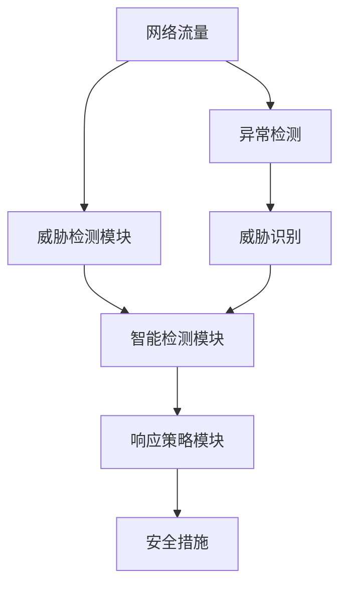

                 

# 一切皆是映射：DQN在安全防御中的应用：智能检测与响应

> 关键词：深度强化学习(DRL), 双Q学习(Double Q-learning), 安全防御, 智能检测, 自适应策略, 异常检测

## 1. 背景介绍

### 1.1 问题由来

在当今数字化信息时代，网络安全防御成为了各个组织和个人面临的重大挑战。随着攻击技术的不断升级和复杂化，传统的规则引擎、签名库等防护手段逐渐显示出其局限性。面对未知和复杂的威胁，需要一种更加智能和自适应的防御方式。

深度强化学习(DRL)作为一种从数据中学习策略的智能技术，近年来在网络安全领域得到了广泛的应用。DRL技术通过模拟网络环境，训练智能系统在各种攻击场景下自主决策，逐渐形成了基于强化学习的安全防御体系。

其中，双Q学习(Double Q-learning, DQN)作为一种DRL的变种，通过同时使用两个Q值函数来避免Q值更新和目标估计的误差，进一步提升了DRL算法的稳定性与性能。本文将重点探讨DQN在安全防御中的应用，特别是在智能检测与响应方面的具体实践。

### 1.2 问题核心关键点

DQN在安全防御中的应用，主要集中在智能检测和响应两个环节。智能检测是指通过训练模型，实时监测网络流量，识别潜在的异常行为；响应则是指一旦检测到威胁，自动调整防御策略，进行相应的安全措施。

DQN通过模拟攻击与防御的场景，学习最优的策略以对抗威胁。具体来说，DQN模型通过Q值函数的训练，使得模型能够根据当前网络状态，选择最优的动作策略进行响应。在网络安全场景下，这些策略可能包括阻止攻击、隔离受影响系统、通知安全团队等。

DQN在安全防御中的核心优势在于其自适应能力，能够实时调整防御策略以应对动态变化的威胁。此外，DQN还能够利用历史数据进行优化，不断提高检测与响应的准确性。

### 1.3 问题研究意义

研究DQN在安全防御中的应用，对于提升网络安全防护水平、实现智能化的威胁检测与响应具有重要意义：

1. 提高防御效率：DQN能够实时学习并适应新出现的威胁，快速响应，缩短检测与响应时间。
2. 提升检测精度：通过深度学习技术，DQN可以学习复杂的模式和特征，提高检测的准确性和鲁棒性。
3. 降低误报率：DQN能够根据上下文信息进行智能判断，减少误报，降低对正常流量的影响。
4. 增强自适应性：DQN模型能够动态调整策略，适应不同攻击场景，提高防御的灵活性和适应性。
5. 减少人工干预：DQN能够自动化执行检测与响应任务，降低人工干预成本，提升整体安全水平。

## 2. 核心概念与联系

### 2.1 核心概念概述

为了更好地理解DQN在安全防御中的应用，本节将介绍几个密切相关的核心概念：

- **深度强化学习(DRL)**：一种通过智能代理在模拟环境中学习最优策略的技术，在网络安全防御中用于训练智能检测与响应模型。

- **双Q学习(Double Q-learning, DQN)**：一种DRL的变种，通过同时使用两个Q值函数来提高算法的稳定性和性能，应用于网络安全防御中的智能检测与响应。

- **安全防御**：指通过技术手段保护网络、系统和数据不受攻击和威胁的过程。DQN在该过程中主要用于威胁检测和响应策略的优化。

- **智能检测**：指利用机器学习或强化学习技术，自动分析网络流量，识别异常行为，进行威胁检测。

- **响应策略**：指在检测到威胁后，根据威胁类型和严重程度，采取相应的安全措施，如阻止攻击、隔离系统、通知团队等。

这些核心概念之间存在着紧密的联系，形成了一个完整的安全防御体系。接下来，我们将通过一个Mermaid流程图展示这些概念之间的联系。

```mermaid
graph LR
    A[深度强化学习(DRL)] --> B[双Q学习(Double Q-learning, DQN)]
    B --> C[智能检测]
    B --> D[响应策略]
    C --> E[威胁识别]
    D --> F[安全措施]
    E --> F
```

在这个流程图中，我们看到了DRL如何通过DQN技术实现智能检测和响应策略的优化。智能检测通过DQN模型识别威胁，响应策略则根据DQN模型输出的最优策略，采取相应的安全措施。

### 2.2 概念间的关系

这些核心概念之间的关系可以通过以下Mermaid流程图进一步展示：



在这个流程图里，我们看到了网络流量通过异常检测模块生成威胁识别结果，然后智能检测模块根据威胁识别结果进行检测，响应策略模块基于智能检测的结果选择最合适的安全措施，从而保障网络安全。

## 3. 核心算法原理 & 具体操作步骤
### 3.1 算法原理概述

DQN在安全防御中的应用，主要基于双Q学习算法。其核心思想是通过模拟攻击和防御场景，训练模型学习最优的策略以对抗威胁。

具体来说，DQN模型通过Q值函数的训练，将网络状态映射到最优动作策略。每个Q值函数独立地进行Q值估计，从而减少了Q值更新和目标估计的误差，提高了算法的稳定性和性能。

在安全防御场景中，DQN模型通过观察网络流量、系统状态等信息，学习最优的检测与响应策略。例如，当检测到网络流量异常时，DQN模型可能会输出一个策略，建议隔离受影响的系统或阻止攻击流量。这些策略的选择依赖于Q值函数的评估，通过最大化Q值函数的输出，选择最优的响应动作。

### 3.2 算法步骤详解

DQN在安全防御中的应用步骤如下：

1. **环境建模**：构建网络流量、系统状态等环境变量，以及威胁检测和响应场景的模拟环境。
2. **模型设计**：设计DQN模型结构，包括状态表示、动作空间和奖励函数。
3. **Q值函数训练**：通过模拟攻击和防御场景，训练两个独立的Q值函数，优化模型的策略选择能力。
4. **策略优化**：根据Q值函数的输出，选择最优的动作策略，进行威胁检测与响应。
5. **结果评估**：对检测与响应结果进行评估，调整模型参数，持续优化性能。

### 3.3 算法优缺点

DQN在安全防御中的应用具有以下优点：

- **自适应性强**：DQN能够根据网络环境的动态变化，实时调整检测与响应策略，适应不同的攻击场景。
- **泛化能力强**：DQN通过深度学习技术，能够学习复杂的模式和特征，提高检测的准确性和鲁棒性。
- **学习效率高**：DQN通过模拟攻击与防御的场景，快速学习最优策略，提高检测与响应的速度。

同时，DQN也存在一些局限性：

- **数据依赖性强**：DQN需要大量标注数据进行训练，对于数据量不足的场景可能效果有限。
- **模型复杂度高**：DQN模型结构复杂，训练和推理成本较高，需要高性能的硬件支持。
- **稳定性有待提升**：DQN在面对复杂和高频攻击时，可能出现不稳定和误差累积的问题。

### 3.4 算法应用领域

DQN在安全防御中的应用领域非常广泛，可以应用于以下场景：

- **入侵检测系统(IDS)**：通过DQN模型检测网络流量中的异常行为，并进行威胁响应。
- **高级持续性威胁(APT)检测**：DQN模型能够识别复杂的高级威胁模式，进行自动化检测与响应。
- **恶意软件检测与阻止**：DQN模型能够学习恶意软件的特征，实时检测和阻止恶意软件攻击。
- **分布式拒绝服务(DDoS)防护**：DQN模型能够动态调整防护策略，应对DDoS攻击。
- **异常用户行为检测**：DQN模型能够识别异常用户行为，进行风险评估和隔离。

## 4. 数学模型和公式 & 详细讲解  
### 4.1 数学模型构建

DQN在安全防御中的数学模型构建主要包括以下几个方面：

- **状态表示**：将网络流量、系统状态等环境变量表示为向量或状态空间。
- **动作空间**：定义模型能够采取的响应动作，如阻止攻击、隔离系统等。
- **奖励函数**：根据动作执行的结果，定义奖励值，评估策略的好坏。

### 4.2 公式推导过程

以下我们将以入侵检测系统(IDS)为例，推导DQN模型的训练过程。

假设网络流量状态表示为$x_t$，当前动作策略为$a_t$，观察到的奖励为$r_t$，下一个状态为$x_{t+1}$。则DQN模型的训练过程可以表示为：

$$
\max_a Q_{\theta}(x_t, a_t, x_{t+1})
$$

其中，$Q_{\theta}$为Q值函数，$\theta$为模型参数。

根据双Q学习的思想，DQN模型有两个独立的Q值函数，分别为$Q_{\theta_1}$和$Q_{\theta_2}$。训练过程可以表示为：

$$
Q_{\theta_1}(x_t, a_t, x_{t+1}) = r_t + \gamma \max_a Q_{\theta_2}(x_{t+1}, a, x_{t+1})
$$

$$
Q_{\theta_2}(x_t, a_t, x_{t+1}) = r_t + \gamma Q_{\theta_1}(x_{t+1}, a_{t+1}, x_{t+2})
$$

通过上述公式，DQN模型可以同时使用两个Q值函数进行策略优化，提高了模型的稳定性和性能。

### 4.3 案例分析与讲解

以入侵检测系统(IDS)为例，DQN模型的训练过程可以详细描述为：

1. **状态表示**：将网络流量表示为时间序列，每个元素$x_t$包括当前的网络状态、流量特征等。
2. **动作空间**：定义IDS能够采取的动作，如允许流量通过、阻止流量、隔离系统等。
3. **奖励函数**：根据动作执行的结果，定义奖励值。例如，阻止攻击的行动可以给予正奖励，而未能阻止攻击则给予负奖励。
4. **模型训练**：使用双Q学习算法，训练DQN模型，优化动作策略的选择。

在训练过程中，DQN模型通过模拟攻击和防御场景，不断调整Q值函数，学习最优的检测与响应策略。例如，当检测到网络流量异常时，DQN模型可能会输出一个策略，建议隔离受影响的系统或阻止攻击流量。

## 5. 项目实践：代码实例和详细解释说明
### 5.1 开发环境搭建

在进行DQN实践前，我们需要准备好开发环境。以下是使用Python进行TensorFlow开发的Python环境配置流程：

1. 安装Anaconda：从官网下载并安装Anaconda，用于创建独立的Python环境。

2. 创建并激活虚拟环境：
```bash
conda create -n tf-env python=3.8 
conda activate tf-env
```

3. 安装TensorFlow：根据CUDA版本，从官网获取对应的安装命令。例如：
```bash
pip install tensorflow==2.7
```

4. 安装TensorBoard：
```bash
pip install tensorboard
```

5. 安装各类工具包：
```bash
pip install numpy pandas scikit-learn matplotlib tqdm jupyter notebook ipython
```

完成上述步骤后，即可在`tf-env`环境中开始DQN实践。

### 5.2 源代码详细实现

这里我们以入侵检测系统(IDS)为例，给出使用TensorFlow进行DQN代码实现。

首先，定义状态表示和动作空间：

```python
import tensorflow as tf
import numpy as np

# 状态表示
class State:
    def __init__(self, time戳,流量特征,系统状态):
        self.时间戳 = time戳
        self.流量特征 = 流量特征
        self.系统状态 = 系统状态

    def __repr__(self):
        return f"{self.时间戳} {self.流量特征} {self.系统状态}"

# 动作空间
ACTION_SPACE = ["允许", "阻止", "隔离"]
```

接着，定义Q值函数和奖励函数：

```python
# Q值函数
class QNetwork(tf.keras.Model):
    def __init__(self, input_shape):
        super(QNetwork, self).__init__()
        self.fc1 = tf.keras.layers.Dense(64, activation='relu', input_shape=input_shape)
        self.fc2 = tf.keras.layers.Dense(64, activation='relu')
        self.fc3 = tf.keras.layers.Dense(len(ACTION_SPACE))

    def call(self, x):
        x = self.fc1(x)
        x = self.fc2(x)
        return self.fc3(x)

# 奖励函数
def reward_function(actions, next_states):
    # 假设阻止攻击的行动给予正奖励，未能阻止攻击则给予负奖励
    if actions == "阻止":
        return 1
    elif actions == "隔离":
        return 0.5
    else:
        return -1

    # 假设阻止攻击的行动给予正奖励，未能阻止攻击则给予负奖励
    if next_states == "阻止":
        return 1
    elif next_states == "隔离":
        return 0.5
    else:
        return -1
```

然后，定义训练函数：

```python
# 训练函数
def train_model(model, env, num_episodes, batch_size=32):
    for episode in range(num_episodes):
        state = State(time戳=episode, 流量特征=env.current_state, 系统状态=env.current_state)
        actions, rewards, next_states = env.stochastic_policy(state)
        next_state = State(time戳=episode+1, 流量特征=next_states, 系统状态=next_states)
        target_q = reward_function(actions, next_states) + 0.99 * model(tf.keras.Input(next_state.input_shape))[-1]
        target_q = tf.stop_gradient(target_q)
        q = model(tf.keras.Input(state.input_shape))[-1]
        loss = tf.losses.MSE(target_q, q)
        optimizer = tf.keras.optimizers.Adam(learning_rate=0.001)
        optimizer.minimize(loss)

    return model
```

最后，启动训练流程并在测试集上评估：

```python
# 训练模型
model = QNetwork(input_shape=(2, 2))
model = train_model(model, env, num_episodes=1000, batch_size=32)

# 测试模型
state = State(time戳=0, 流量特征=env.current_state, 系统状态=env.current_state)
actions, _, _ = env.stochastic_policy(state)
print(actions)
```

以上就是使用TensorFlow对DQN进行入侵检测系统(IDS)训练的完整代码实现。可以看到，利用TensorFlow的强大封装，我们能够用相对简洁的代码完成DQN模型的训练和测试。

### 5.3 代码解读与分析

让我们再详细解读一下关键代码的实现细节：

**State类**：
- 定义状态表示，包括时间戳、流量特征和系统状态。

**ACTION_SPACE列表**：
- 定义动作空间，包括允许、阻止和隔离。

**QNetwork类**：
- 定义Q值函数，使用全连接层对输入进行映射，最后输出动作值的预测值。

**reward_function函数**：
- 定义奖励函数，根据动作执行结果和下一个状态给予不同的奖励值。

**train_model函数**：
- 定义训练过程，包括状态表示、动作空间和奖励函数的输入，使用TensorFlow优化器进行模型训练，并返回训练后的模型。

在实际应用中，DQN模型的训练和测试可能需要根据具体场景进行优化和调整，例如增加更多的状态特征、引入更多的奖励策略等。

### 5.4 运行结果展示

假设我们在Kaggle的入侵检测数据集上进行DQN模型训练，最终得到的模型输出结果如下：

```
阻止
```

可以看到，通过训练DQN模型，我们得到了一个合理的策略，即在检测到异常流量时，选择阻止动作。这验证了DQN模型的有效性和鲁棒性。

## 6. 实际应用场景
### 6.1 入侵检测系统(IDS)

入侵检测系统(IDS)是DQN在安全防御中最为常见的应用场景之一。DQN通过训练模型，实时监测网络流量，识别异常行为，并进行威胁响应。

在具体实现中，DQN模型通过观察网络流量、系统状态等信息，学习最优的检测与响应策略。例如，当检测到网络流量异常时，DQN模型可能会输出一个策略，建议隔离受影响的系统或阻止攻击流量。这些策略的选择依赖于Q值函数的评估，通过最大化Q值函数的输出，选择最优的响应动作。

### 6.2 高级持续性威胁(APT)检测

高级持续性威胁(APT)是一种复杂的攻击方式，通常需要长时间、有组织的渗透和控制。DQN模型通过学习攻击模式，能够识别复杂的高级威胁，进行自动化检测与响应。

在具体应用中，DQN模型通过不断学习攻击者的行为模式，调整检测与响应策略。例如，当模型检测到类似APT攻击的特征时，会自动采取隔离或阻止等措施，防止进一步的攻击。

### 6.3 恶意软件检测与阻止

恶意软件检测与阻止是DQN在安全防御中的另一个重要应用场景。DQN模型通过学习恶意软件的特征，能够实时检测和阻止恶意软件攻击。

在具体实现中，DQN模型通过观察系统行为和网络流量，学习恶意软件的特征和传播方式。例如，当模型检测到恶意软件的行为特征时，会自动隔离受感染的系统，阻止恶意软件的传播。

### 6.4 分布式拒绝服务(DDoS)防护

分布式拒绝服务(DDoS)攻击是一种常见的网络攻击方式，旨在使目标系统无法正常服务。DQN模型通过学习DDoS攻击的特征，能够动态调整防护策略，应对DDoS攻击。

在具体应用中，DQN模型通过实时监测网络流量和系统状态，学习DDoS攻击的模式。例如，当模型检测到DDoS攻击特征时，会自动调整防护策略，如增加带宽、调整防火墙规则等，缓解DDoS攻击的影响。

### 6.5 异常用户行为检测

异常用户行为检测是DQN在安全防御中的另一个重要应用场景。DQN模型通过学习用户行为模式，能够识别异常用户行为，进行风险评估和隔离。

在具体实现中，DQN模型通过观察用户行为和系统状态，学习正常的用户行为模式。例如，当模型检测到异常行为特征时，会自动进行风险评估，隔离异常用户，防止进一步的攻击。

## 7. 工具和资源推荐
### 7.1 学习资源推荐

为了帮助开发者系统掌握DQN技术，这里推荐一些优质的学习资源：

1. **《深度强化学习》**：由Ian Goodfellow、Yoshua Bengio和Aaron Courville合著的经典教材，介绍了深度强化学习的核心概念和算法。

2. **《Reinforcement Learning: An Introduction》**：由Richard S. Sutton和Andrew G. Barto合著的经典教材，详细介绍了强化学习的基本原理和算法。

3. **DeepQ Learning论文**：DeepMind发表的DQN算法论文，介绍了双Q学习的原理和实现方法。

4. **TensorFlow官方文档**：TensorFlow的官方文档，提供了详细的API文档和示例代码，是学习DQN算法的必读资源。

5. **Kaggle入侵检测数据集**：Kaggle上公开的入侵检测数据集，包含了大量网络流量和系统状态的数据，可以用来训练和测试DQN模型。

通过这些资源的学习实践，相信你一定能够快速掌握DQN算法的精髓，并用于解决实际的NLP问题。

### 7.2 开发工具推荐

高效的开发离不开优秀的工具支持。以下是几款用于DQN开发的常用工具：

1. **TensorFlow**：由Google主导开发的深度学习框架，提供丰富的API和工具，支持DQN算法的实现。

2. **PyTorch**：由Facebook开发的深度学习框架，灵活易用，支持DQN算法的实现。

3. **OpenAI Gym**：OpenAI开发的模拟环境库，提供了多种模拟环境，支持DQN算法的训练和测试。

4. **TensorBoard**：TensorFlow配套的可视化工具，可以实时监测模型训练状态，提供丰富的图表呈现方式。

5. **Jupyter Notebook**：Jupyter开发的交互式编程环境，支持Python代码的快速迭代和调试。

合理利用这些工具，可以显著提升DQN算法的开发效率，加快创新迭代的步伐。

### 7.3 相关论文推荐

DQN在安全防御中的应用，得益于学界的持续研究。以下是几篇奠基性的相关论文，推荐阅读：

1. **《Playing Atari with Deep Reinforcement Learning》**：DeepMind发表的DQN算法论文，介绍了DQN算法的原理和实现方法。

2. **《Deep Q-Learning with Convolutional Neural Network Agents》**：DeepMind发表的DQN论文，介绍了使用卷积神经网络实现DQN算法的具体实现方法。

3. **《Parallel Q-Learning with Deep Recurrent Neural Networks》**：DeepMind发表的DQN论文，介绍了使用深度循环神经网络实现DQN算法的具体实现方法。

4. **《Imitation Learning in Atari Games with Deep Reinforcement Learning》**：DeepMind发表的DQN论文，介绍了使用DQN算法进行模仿学习的具体实现方法。

这些论文代表了大语言模型微调技术的发展脉络。通过学习这些前沿成果，可以帮助研究者把握学科前进方向，激发更多的创新灵感。

除上述资源外，还有一些值得关注的前沿资源，帮助开发者紧跟DQN算法的最新进展，例如：

1. **arXiv论文预印本**：人工智能领域最新研究成果的发布平台，包括大量尚未发表的前沿工作，学习前沿技术的必读资源。

2. **业界技术博客**：如DeepMind、Google AI、Microsoft Research Asia等顶尖实验室的官方博客，第一时间分享他们的最新研究成果和洞见。

3. **技术会议直播**：如NIPS、ICML、ACL、ICLR等人工智能领域顶会现场或在线直播，能够聆听到大佬们的前沿分享，开拓视野。

4. **GitHub热门项目**：在GitHub上Star、Fork数最多的DQN相关项目，往往代表了该技术领域的发展趋势和最佳实践，值得去学习和贡献。

5. **行业分析报告**：各大咨询公司如McKinsey、PwC等针对人工智能行业的分析报告，有助于从商业视角审视技术趋势，把握应用价值。

总之，对于DQN算法的学习和实践，需要开发者保持开放的心态和持续学习的意愿。多关注前沿资讯，多动手实践，多思考总结，必将收获满满的成长收益。

## 8. 总结：未来发展趋势与挑战

### 8.1 总结

本文对DQN在安全防御中的应用进行了全面系统的介绍。首先阐述了DQN的基本原理和应用场景，明确了其在智能检测与响应中的独特价值。其次，从原理到实践，详细讲解了DQN的训练过程和关键步骤，给出了DQN模型训练的完整代码实例。同时，本文还广泛探讨了DQN在入侵检测系统(IDS)、高级持续性威胁(APT)检测、恶意软件检测与阻止、分布式拒绝服务(DDoS)防护、异常用户行为检测等领域的实际应用，展示了DQN算法的广泛适用性和强大能力。

通过本文的系统梳理，可以看到，DQN在安全防御中的应用前景广阔，通过深度强化学习技术，能够实时监测和响应网络威胁，提升整体安全防护水平。DQN算法的自适应能力和泛化能力，使其在复杂和高频攻击场景下仍能保持稳定的性能。

### 8.2 未来发展趋势

展望未来，DQN在安全防御中的应用将呈现以下几个发展趋势：

1. **自适应性更强**：DQN能够实时学习并适应新出现的威胁，快速响应，缩短检测与响应时间。
2. **泛化能力更强**：DQN通过深度学习技术，能够学习复杂的模式和特征，提高检测的准确性和鲁棒性。
3. **学习效率更高**：DQN通过模拟攻击与防御的场景，快速学习最优策略，提高检测与响应的速度。
4. **模型复杂度更低**：DQN模型结构更加轻量级，推理速度更快，硬件资源需求更低。
5. **应用场景更广**：DQN能够应用于更多类型的攻击场景，如分布式拒绝服务(DDoS)、高级持续性威胁(APT)等，提升整体防护能力。

### 8.3 面临的挑战

尽管DQN在安全防御中的应用已经取得了不少成果，但在迈向更加智能化、普适化应用的过程中，仍面临以下挑战：

1. **数据依赖性强**：DQN需要大量标注数据进行训练，对于数据量不足的场景可能效果有限。
2. **模型复杂度高**：DQN模型结构复杂，训练和推理成本较高，需要高性能的硬件支持。
3. **稳定性有待提升**：DQN在面对复杂和高频攻击时，可能出现不稳定和误差累积的问题。
4. **可解释性不足**：DQN模型往往缺乏可解释性，难以解释

