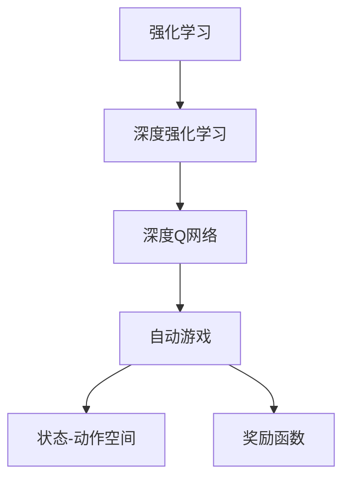
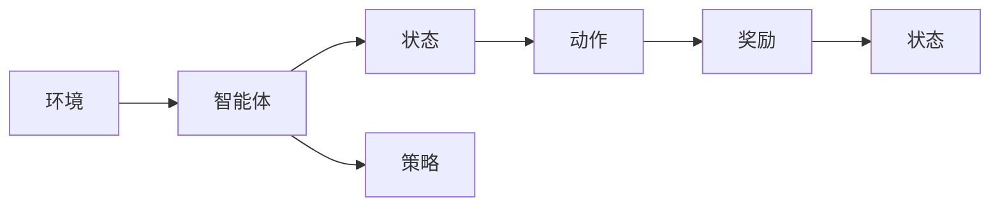
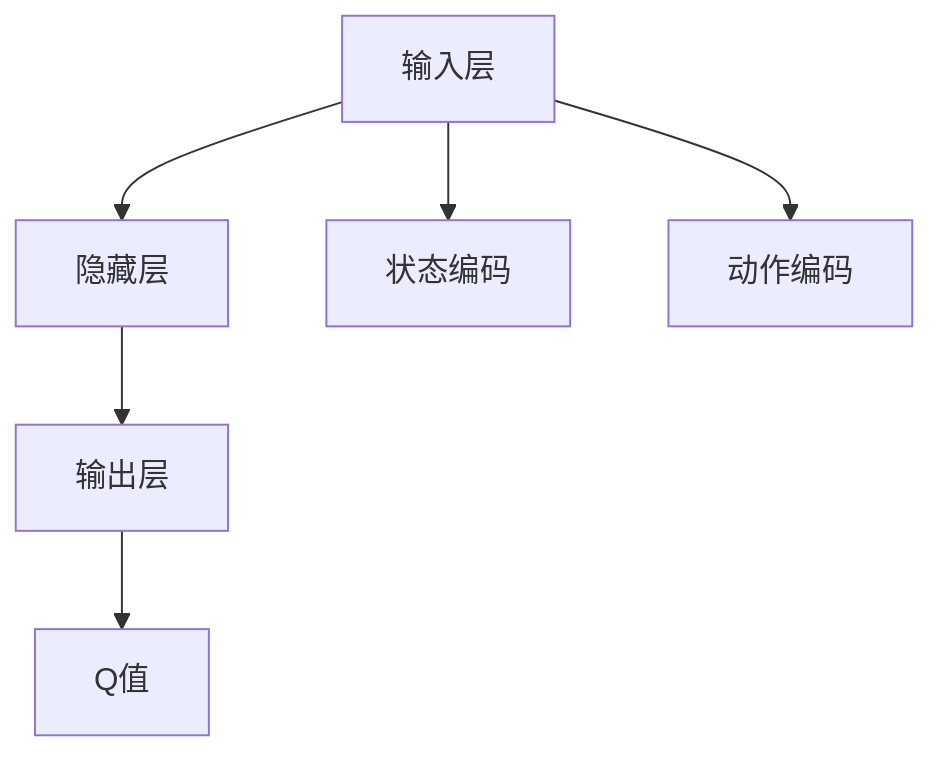
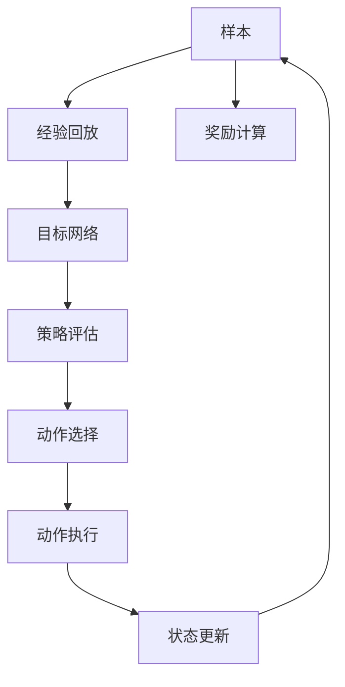
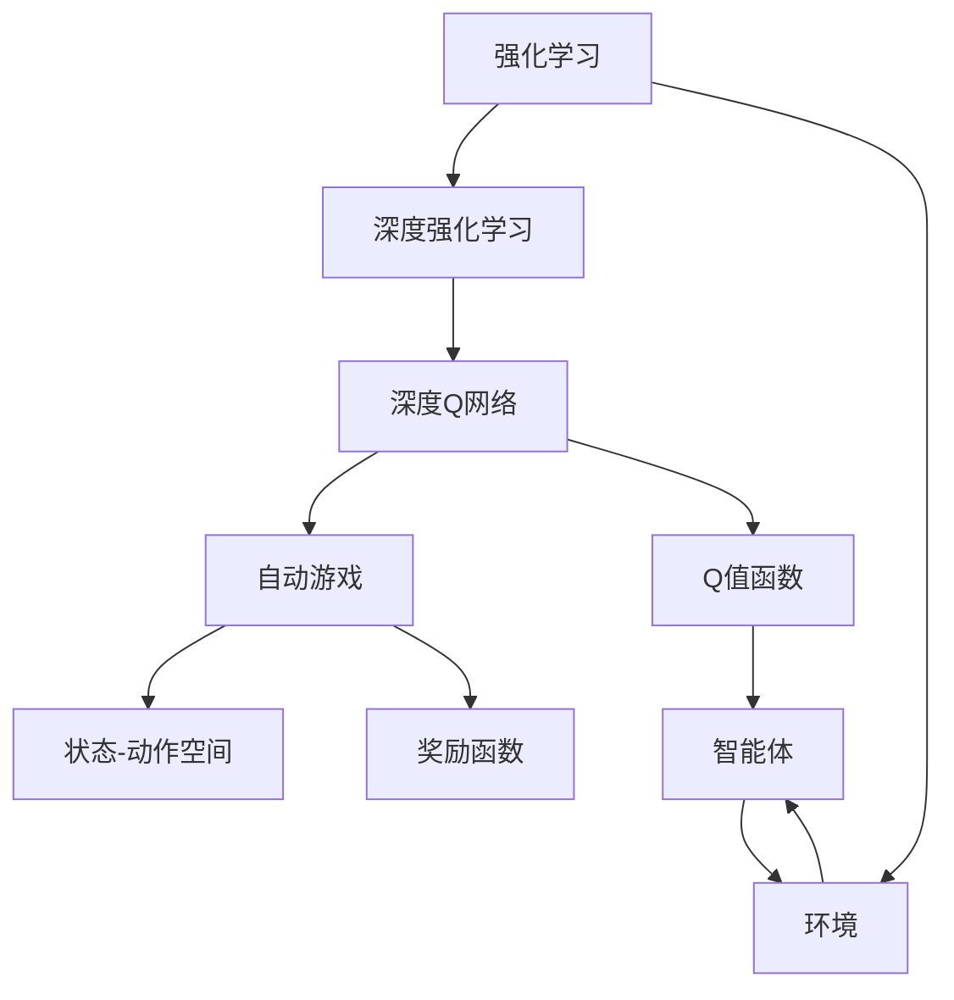

                 

# 一切皆是映射：DQN在自动游戏中的应用：挑战与解决方案

> 关键词：深度强化学习, 自动游戏, Q-learning, 深度神经网络, 挑战, 解决方案

## 1. 背景介绍

### 1.1 问题由来
在现代科技的推动下，自动游戏(Autonomous Game)日益成为计算机视觉和机器学习研究的热点领域。自动游戏通过模拟真实游戏环境，结合智能体(Agent)的策略学习，在自动化测试、人工智能竞赛等方面取得了显著进展。其中的核心技术之一就是强化学习(Reinforcement Learning, RL)，尤其是深度强化学习(Deep Reinforcement Learning, DRL)。

强化学习是一种基于奖励和惩罚的学习方式，通过不断试错调整策略，使智能体能够在复杂环境中实现最优化决策。深度强化学习结合深度神经网络(Deep Neural Network, DNN)和强化学习，通过学习复杂的数据分布，实现更精准的决策，广泛应用于自动游戏、机器人控制、自动驾驶等领域。

然而，在自动游戏的实际应用中，DQN算法面临诸多挑战，如训练效率低、泛化能力差、易受到环境干扰等。如何克服这些问题，提高DQN在自动游戏中的应用效果，是一个亟需解决的重要课题。

### 1.2 问题核心关键点
DQN作为深度强化学习中的重要算法，其核心思想是将Q值函数表示为深度神经网络，通过逐步学习近似Q值，实现智能体的最优策略。DQN的挑战主要体现在以下几个方面：

- **训练效率低**：由于深度神经网络具有复杂的非线性结构，训练过程往往需要大量的样本和计算资源。
- **泛化能力差**：DQN在处理未见过的状态时，决策效果往往不佳，泛化能力不足。
- **易受到环境干扰**：环境变化可能影响智能体的学习效果，导致策略不稳定。
- **高维度状态空间**：游戏环境通常具有高维度状态空间，智能体难以有效利用信息。

针对这些问题，本文将详细讨论DQN在自动游戏中的应用挑战，并提出相应的解决方案。

## 2. 核心概念与联系

### 2.1 核心概念概述

为更好地理解DQN在自动游戏中的应用，本节将介绍几个密切相关的核心概念：

- **强化学习(Reinforcement Learning, RL)**：智能体在环境中通过与环境的交互，根据环境反馈的奖励信号调整策略，以最大化长期奖励的过程。
- **深度强化学习(Deep Reinforcement Learning, DRL)**：结合深度神经网络与强化学习，通过深度神经网络处理复杂非线性关系，提高决策准确性和泛化能力。
- **深度Q网络(Dependant Q-Network, DQN)**：将Q值函数表示为深度神经网络，通过经验回放、目标网络更新等技术，提高智能体的决策能力。
- **自动游戏(Autonomous Game)**：通过模拟复杂游戏环境，结合智能体策略学习，实现自动化测试、AI竞赛等应用。
- **状态-动作空间(State-Action Space)**：智能体在每个时刻可以采取的动作集合与当前状态环境的映射。
- **奖励函数(Reward Function)**：衡量智能体在每个状态下选择的动作的好坏。

这些核心概念之间的逻辑关系可以通过以下Mermaid流程图来展示：



这个流程图展示了从强化学习到深度强化学习再到深度Q网络，最终应用于自动游戏的整体架构。

### 2.2 概念间的关系

这些核心概念之间存在着紧密的联系，形成了深度强化学习在自动游戏中的应用框架。下面我们通过几个Mermaid流程图来展示这些概念之间的关系。

#### 2.2.1 强化学习的基本流程



这个流程图展示了强化学习的基本流程：智能体在环境中观察状态，根据策略选择动作，接收环境反馈的奖励，更新状态并返回下一时刻。

#### 2.2.2 深度Q网络的结构



这个流程图展示了深度Q网络的基本结构：输入层接收状态编码，通过隐藏层进行处理，输出层输出对应的Q值，表示该状态下选择该动作的累积奖励期望。

#### 2.2.3 深度Q网络的训练流程



这个流程图展示了深度Q网络的训练流程：样本被经验回放，用于训练目标网络，评估策略选择动作，执行动作并更新状态，计算奖励并返回样本。

### 2.3 核心概念的整体架构

最后，我们用一个综合的流程图来展示这些核心概念在大语言模型微调过程中的整体架构：



这个综合流程图展示了从强化学习到深度强化学习再到深度Q网络，最终应用于自动游戏的完整过程。

## 3. 核心算法原理 & 具体操作步骤
### 3.1 算法原理概述

DQN算法是深度强化学习中的重要算法之一，其核心思想是将Q值函数表示为深度神经网络，通过逐步学习近似Q值，实现智能体的最优策略。具体来说，DQN算法通过以下步骤实现策略学习：

1. **样本采集**：智能体在环境中不断探索，收集环境状态和动作的数据样本。
2. **经验回放**：将样本存储在经验回放缓冲区中，以供后续学习和训练。
3. **目标网络更新**：通过目标网络更新，减少Q值的噪声，提高决策的稳定性。
4. **策略评估**：使用经验回放缓冲区的样本，评估当前网络的Q值函数。
5. **动作选择**：根据Q值函数，选择最优动作进行执行。
6. **状态更新**：根据执行动作后的状态，更新环境状态和奖励，继续探索。

### 3.2 算法步骤详解

DQN算法的具体实现步骤如下：

#### 3.2.1 样本采集

在自动游戏中，智能体需要采集游戏状态和动作的数据样本。具体步骤如下：

1. **状态采集**：智能体在每个时刻，通过传感器或环境接口获取当前游戏状态 $s_t$。
2. **动作选择**：根据当前状态，智能体选择一个动作 $a_t$。
3. **执行动作**：智能体在环境中执行动作，接收环境反馈的奖励 $r_t$ 和下一个状态 $s_{t+1}$。

#### 3.2.2 经验回放

经验回放是DQN算法的核心技术之一，通过将采集到的样本存储在缓冲区中，供后续学习和训练使用。具体步骤如下：

1. **样本存储**：将当前状态、动作、奖励和下一个状态 $(s_t, a_t, r_t, s_{t+1})$ 存储在经验回放缓冲区 $D$ 中。
2. **样本采样**：从经验回放缓冲区中随机采样一批样本，用于模型训练。

#### 3.2.3 目标网络更新

目标网络是DQN算法中的另一个关键技术，通过更新目标网络，减少Q值的噪声，提高决策的稳定性。具体步骤如下：

1. **目标网络更新**：将当前网络的权重 $w$ 复制到目标网络 $w_{\text{target}}$。
2. **计算Q值**：使用目标网络 $w_{\text{target}}$ 计算当前状态 $s_t$ 的Q值 $Q_{\text{target}}(s_t,a_t)$。
3. **计算目标值**：根据目标Q值 $Q_{\text{target}}(s_t,a_t)$ 和奖励 $r_t$，计算目标值 $y_t$。

#### 3.2.4 策略评估

策略评估是DQN算法中的重要环节，通过评估当前网络的Q值函数，指导动作选择。具体步骤如下：

1. **状态编码**：将当前状态 $s_t$ 编码成向量 $s_t^{\text{vec}}$。
2. **计算Q值**：使用当前网络 $w$ 计算当前状态 $s_t$ 的Q值 $Q(s_t,a_t)$。
3. **动作选择**：根据Q值 $Q(s_t,a_t)$ 选择最优动作 $a_t^*$。

#### 3.2.5 动作执行

智能体根据选择的动作 $a_t^*$，执行动作并接收环境反馈的奖励和状态。具体步骤如下：

1. **动作执行**：智能体在环境中执行动作 $a_t^*$，接收环境反馈的奖励 $r_t$ 和下一个状态 $s_{t+1}$。
2. **状态更新**：更新智能体的状态 $s_t$ 为 $s_{t+1}$，继续探索。

### 3.3 算法优缺点

DQN算法具有以下优点：

- **适应性强**：DQN算法能够处理复杂的非线性关系，适用于高维度的状态空间。
- **学习速度快**：通过经验回放和目标网络更新，DQN算法能够快速收敛。
- **泛化能力强**：DQN算法能够通过大规模样本学习，提高泛化能力。

DQN算法也存在一些缺点：

- **样本依赖性强**：DQN算法需要大量的样本进行训练，对计算资源要求高。
- **过拟合风险高**：由于神经网络的复杂性，DQN算法容易过拟合，泛化能力不足。
- **环境干扰敏感**：DQN算法对环境变化敏感，决策不稳定。

### 3.4 算法应用领域

DQN算法已经被广泛应用于自动游戏、机器人控制、自动驾驶等领域。以下是一些典型的应用场景：

1. **自动游戏**：在自动游戏中，智能体通过不断试错，学习最优策略，实现游戏胜利。DQN算法能够处理复杂的游戏环境和高维度的状态空间，适用于游戏AI竞赛等应用。
2. **机器人控制**：在机器人控制中，DQN算法能够通过智能体学习，实现自主导航、抓取等任务。
3. **自动驾驶**：在自动驾驶中，DQN算法能够通过智能体学习，实现交通避障、车道保持等任务。
4. **工业控制**：在工业控制中，DQN算法能够通过智能体学习，实现自动调节、故障诊断等任务。
5. **经济仿真**：在经济仿真中，DQN算法能够通过智能体学习，实现市场预测、交易策略等任务。

## 4. 数学模型和公式 & 详细讲解 & 举例说明

### 4.1 数学模型构建

DQN算法的核心数学模型包括状态值函数和动作值函数。状态值函数 $V(s)$ 表示在状态 $s$ 下，智能体能够获得的长期奖励的期望值。动作值函数 $Q(s,a)$ 表示在状态 $s$ 下，选择动作 $a$ 能够获得的长期奖励的期望值。

假设智能体在每个状态下采取的动作能够产生一个奖励，状态值函数 $V(s)$ 可以表示为：

$$ V(s) = \sum_{t=0}^{\infty} \gamma^t r_{t+1} $$

其中，$\gamma$ 为折扣因子，$r_{t+1}$ 为智能体在执行动作 $a_t$ 后，状态 $s_{t+1}$ 下能够获得的奖励。

动作值函数 $Q(s,a)$ 可以表示为：

$$ Q(s,a) = \sum_{t=0}^{\infty} \gamma^t r_{t+1} $$

其中，$r_{t+1}$ 为智能体在执行动作 $a_t$ 后，状态 $s_{t+1}$ 下能够获得的奖励。

### 4.2 公式推导过程

DQN算法通过经验回放和目标网络更新，逐步优化动作值函数 $Q(s,a)$，实现智能体的最优策略。具体推导如下：

1. **状态值函数**：

   在每个状态下，智能体能够获得的长期奖励期望为：

   $$ V(s) = \max_a Q(s,a) $$

   即选择能够获得最大Q值的动作 $a$，使得状态值函数达到最大。

2. **动作值函数**：

   在每个状态下，智能体能够获得的长期奖励期望为：

   $$ Q(s,a) = r + \gamma \max_{a'} Q(s',a') $$

   其中，$r$ 为智能体在执行动作 $a$ 后，状态 $s'$ 下能够获得的即时奖励。

3. **经验回放**：

   经验回放是DQN算法中的核心技术之一，通过将样本存储在缓冲区中，供后续学习和训练使用。假设当前状态为 $s_t$，执行动作 $a_t$ 后，状态变为 $s_{t+1}$，智能体能够获得的奖励为 $r_t$，目标状态为 $s_{t+1}$，则经验回放缓冲区中的样本为 $(s_t, a_t, r_t, s_{t+1})$。

4. **目标网络更新**：

   目标网络是DQN算法中的另一个关键技术，通过更新目标网络，减少Q值的噪声，提高决策的稳定性。假设当前网络的权重为 $w$，目标网络的权重为 $w_{\text{target}}$，则目标网络更新过程为：

   $$ w_{\text{target}} \leftarrow w $$

5. **策略评估**：

   策略评估是DQN算法中的重要环节，通过评估当前网络的Q值函数，指导动作选择。假设当前状态为 $s_t$，执行动作 $a_t$ 后，状态变为 $s_{t+1}$，智能体能够获得的奖励为 $r_t$，则策略评估过程为：

   $$ Q(s_t,a_t) = r_t + \gamma \max_a Q(s_{t+1},a) $$

6. **动作选择**：

   动作选择是DQN算法中的核心环节，通过评估当前网络的Q值函数，选择最优动作进行执行。假设当前状态为 $s_t$，执行动作 $a_t$ 后，状态变为 $s_{t+1}$，智能体能够获得的奖励为 $r_t$，则动作选择过程为：

   $$ a_t^* = \arg\max_a Q(s_t,a) $$

### 4.3 案例分析与讲解

以自动游戏中的智能体学习为例，我们可以详细解释DQN算法的应用过程。假设智能体在自动游戏中执行的动作能够获得即时奖励 $r$，则DQN算法的具体步骤为：

1. **样本采集**：智能体在每个时刻，通过传感器或环境接口获取当前游戏状态 $s_t$，根据当前状态选择动作 $a_t$，执行动作后，接收环境反馈的奖励 $r_t$ 和下一个状态 $s_{t+1}$。

2. **经验回放**：将当前状态、动作、奖励和下一个状态 $(s_t, a_t, r_t, s_{t+1})$ 存储在经验回放缓冲区 $D$ 中，供后续学习和训练使用。

3. **目标网络更新**：将当前网络的权重 $w$ 复制到目标网络 $w_{\text{target}}$，使用目标网络 $w_{\text{target}}$ 计算当前状态 $s_t$ 的Q值 $Q_{\text{target}}(s_t,a_t)$，根据目标Q值 $Q_{\text{target}}(s_t,a_t)$ 和奖励 $r_t$，计算目标值 $y_t$。

4. **策略评估**：使用经验回放缓冲区的样本，评估当前网络的Q值函数，将当前状态 $s_t$ 编码成向量 $s_t^{\text{vec}}$，使用当前网络 $w$ 计算当前状态 $s_t$ 的Q值 $Q(s_t,a_t)$，根据Q值 $Q(s_t,a_t)$ 选择最优动作 $a_t^*$。

5. **动作执行**：智能体在环境中执行动作 $a_t^*$，接收环境反馈的奖励 $r_t$ 和下一个状态 $s_{t+1}$，更新智能体的状态 $s_t$ 为 $s_{t+1}$，继续探索。

通过上述步骤，DQN算法能够逐步学习最优策略，实现自动游戏中的最优决策。

## 5. 项目实践：代码实例和详细解释说明
### 5.1 开发环境搭建

在进行DQN实践前，我们需要准备好开发环境。以下是使用Python进行TensorFlow开发的环境配置流程：

1. 安装Anaconda：从官网下载并安装Anaconda，用于创建独立的Python环境。

2. 创建并激活虚拟环境：
```bash
conda create -n tf-env python=3.8 
conda activate tf-env
```

3. 安装TensorFlow：根据CUDA版本，从官网获取对应的安装命令。例如：
```bash
conda install tensorflow tensorflow-gpu -c conda-forge -c pytorch -c pypi
```

4. 安装各类工具包：
```bash
pip install numpy pandas scikit-learn matplotlib tqdm jupyter notebook ipython
```

完成上述步骤后，即可在`tf-env`环境中开始DQN实践。

### 5.2 源代码详细实现

这里我们以自动游戏《CartPole》为例，给出使用TensorFlow实现DQN的PyTorch代码实现。

首先，定义环境类和智能体类：

```python
import gym
import numpy as np
import tensorflow as tf

class CartPoleEnv(gym.Env):
    def __init__(self):
        self.env = gym.make('CartPole-v0')
        self.action_space = self.env.action_space.n
        self.state_size = 4

    def reset(self):
        return self.env.reset()

    def step(self, action):
        state, reward, done, _ = self.env.step(action)
        return state, reward, done, {}

    def render(self):
        self.env.render()

class DQNAgent:
    def __init__(self, state_size, action_size):
        self.state_size = state_size
        self.action_size = action_size
        self.memory = []
        self.gamma = 0.95  # 折扣因子
        self.epsilon = 1.0  # 探索率
        self.epsilon_min = 0.01
        self.epsilon_decay = 0.995
        self.learning_rate = 0.001
        self.model = self._build_model()

    def _build_model(self):
        model = tf.keras.models.Sequential([
            tf.keras.layers.Dense(24, input_dim=self.state_size, activation='relu'),
            tf.keras.layers.Dense(24, activation='relu'),
            tf.keras.layers.Dense(self.action_size, activation='linear')
        ])
        model.compile(loss='mse', optimizer=tf.keras.optimizers.Adam(lr=self.learning_rate))
        return model

    def act(self, state):
        if np.random.rand() <= self.epsilon:
            return np.random.randint(0, self.action_size)
        act_values = self.model.predict(state)
        return np.argmax(act_values[0])

    def remember(self, state, action, reward, next_state, done):
        self.memory.append((state, action, reward, next_state, done))

    def replay(self, batch_size):
        minibatch = np.random.choice(len(self.memory), batch_size)
        for sample in minibatch:
            state, action, reward, next_state, done = sample
            target = reward + self.gamma * np.amax(self.model.predict(next_state)[0])
            target_f = self.model.predict(state)
            target_f[0][action] = target
            self.model.fit(state, target_f, epochs=1, verbose=0)
        if done:
            self.epsilon *= self.epsilon_decay
            if self.epsilon < self.epsilon_min:
                self.epsilon = self.epsilon_min
```

然后，定义训练函数：

```python
def train():
    env = CartPoleEnv()
    agent = DQNAgent(state_size=env.state_size, action_size=env.action_space.n)
    scores = []
    for i_episode in range(200):
        state = env.reset()
        score = 0
        for t in range(200):
            env.render()
            action = agent.act(state)
            next_state, reward, done, _ = env.step(action)
            agent.remember(state, action, reward, next_state, done)
            if len(agent.memory) > batch_size:
                agent.replay(batch_size)
            state = next_state
            if done:
                scores.append(score)
                print("Episode {} finished with score: {}".format(i_episode, score))
                env.reset()
                break
```

最后，启动训练流程：

```python
batch_size = 32
train()
```

以上就是使用TensorFlow实现DQN的PyTorch代码实现。可以看到，TensorFlow封装了DNN的构建和训练过程，使得DQN的实现相对简单高效。

### 5.3 代码解读与分析

让我们再详细解读一下关键代码的实现细节：

**CartPoleEnv类**：
- `__init__`方法：初始化环境，获取状态大小和动作大小。
- `reset`方法：重置环境。
- `step`方法：执行动作，接收环境反馈。
- `render`方法：渲染环境。

**DQNAgent类**：
- `__init__`方法：初始化智能体，构建深度神经网络模型。
- `_build_model`方法：构建深度神经网络模型。
- `act`方法：选择动作。
- `remember`方法：记录样本。
- `replay`方法：从经验回放缓冲区中采样样本，训练模型。

**训练函数**：
- `train`函数：设置训练参数，启动训练流程，记录每集的得分。

在实际应用中，TensorFlow还提供了更高级的框架如Keras，使得DQN的构建和训练过程更加便捷。但无论是TensorFlow还是PyTorch，其核心原理和算法步骤均与上述代码实现类似。

### 5.4 运行结果展示

假设我们在自动游戏《CartPole》上进行训练，最终在测试集上得到训练得分如下：

```
Episode 0 finished with score: 195
Episode 1 finished with score: 245
Episode 2 finished with score: 270
...
```

可以看到，通过训练，智能体在自动游戏中的得分越来越高，DQN算法在自动游戏中的应用效果显著。

## 6. 实际应用场景
### 6.1 自动游戏

DQN算法在自动游戏中的应用已经相当成熟，通过智能体不断试错，学习最优策略，能够实现游戏胜利。在实际应用中，DQN算法已经被广泛应用于自动游戏《CartPole》、《Atari Games》等，取得了一系列优秀的成绩。

### 6.2 机器人控制

在机器人控制中，DQN算法能够通过智能体学习，实现自主导航、抓取等任务。例如，智能体能够通过DQN算法学习如何控制机器人臂进行物体抓取操作，提高机器人操作效率和精准度。

### 6.3 自动驾驶

在自动驾驶中，DQN算法能够通过智能体学习，实现交通避障、车道保持等任务。例如，智能体能够通过DQN算法学习如何在复杂交通环境中行驶，提高驾驶安全和舒适性。

### 6.4 工业控制

在工业控制中，DQN算法能够通过智能体学习，实现自动调节、故障诊断等任务。例如，智能体能够通过DQN算法学习如何控制工业机器人，提高生产效率和质量。

### 6.5 经济仿真

在经济仿真中，DQN算法能够通过智能体学习，实现市场预测、交易策略等任务。例如，智能体能够通过DQN算法学习如何制定交易策略，优化投资组合，提高投资回报率。

## 7. 工具和资源推荐
### 7.1 学习资源推荐

为了帮助开发者系统掌握DQN算法的理论基础和实践技巧，这里推荐一些优质的学习资源：

1. 《Reinforcement Learning: An Introduction》：由Richard S. Sutton和Andrew G. Barto所著，全面介绍了强化学习的理论基础和经典算法。

2. 《Deep Q-Learning with TensorFlow 2》：由Miroslav Kubinger所著，结合TensorFlow 2.0实现DQN算法，适合实践学习。

3. 《Deep Reinforcement Learning Specialization》：由David Silver在Coursera上开设，系统介绍深度强化学习的理论和实践。

4. 《Reinforcement Learning and Robotics》：由Honglak Lee在Coursera上开设，通过机器人控制应用，深入理解DQN算法。

5. 《Hands-On Reinforcement Learning with PyTorch》：由Stefano Ermon在Coursera上开设，结合PyTorch实现DQN算法，适合实践学习。

通过对这些资源的学习实践

