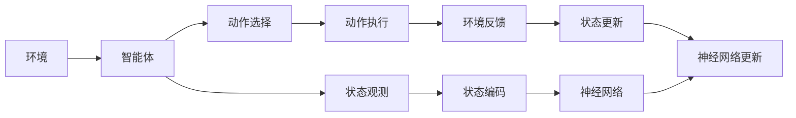
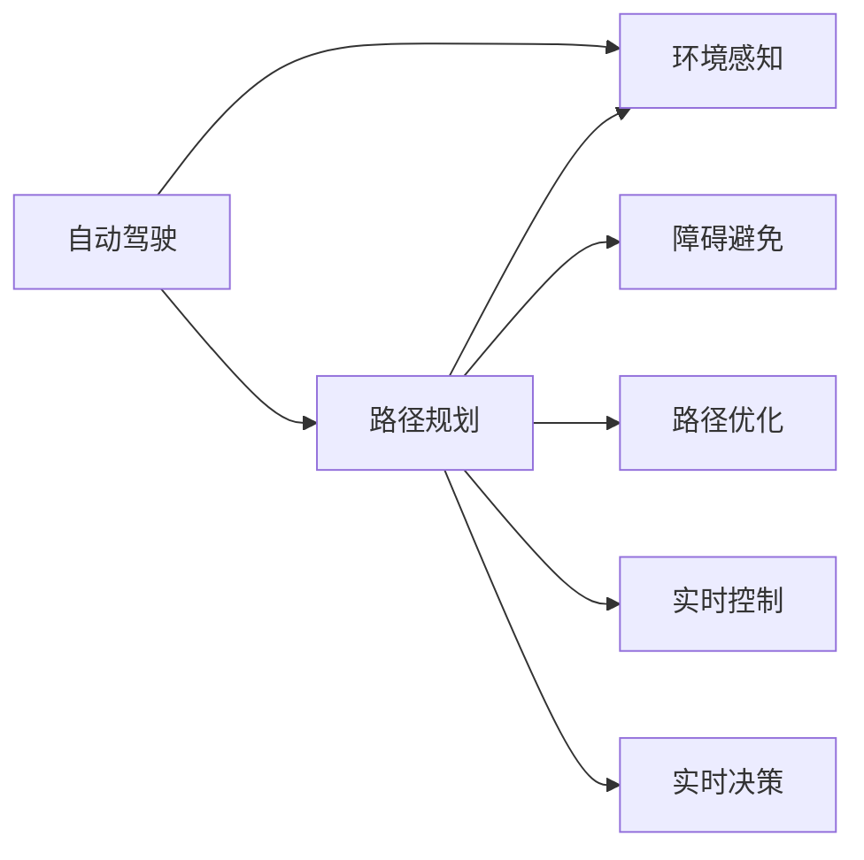
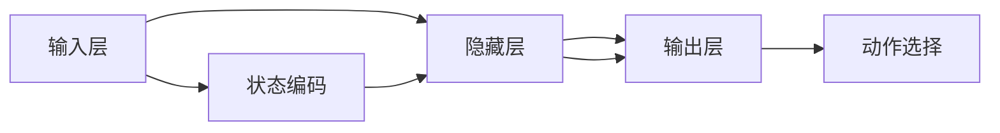
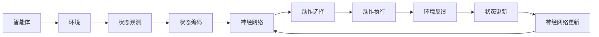

                 

# 一切皆是映射：利用DQN解决路径规划问题：方法与思考

## 1. 背景介绍

路径规划问题（Path Planning）是智能体在复杂环境中寻找最优路径的经典问题，广泛应用于自动驾驶、机器人路径规划、无人机导航等领域。在传统方法中，基于启发式搜索、图论算法等方法往往需要耗费大量时间和计算资源，且容易陷入局部最优解。强化学习（Reinforcement Learning, RL）尤其是深度强化学习（Deep RL）因其强大的数据处理能力和可解释性，成为了路径规划问题的新范式。

在这一领域，Deep Q-Network（DQN）是最为经典的深度强化学习算法之一。DQN利用经验回放（Experience Replay）和目标网络（Target Network）等技术，将强化学习问题转化为深度学习问题，大大提高了路径规划的效率和精度。本文将详细阐述DQN的原理与算法，并结合具体案例分析DQN在路径规划中的应用，探讨其优缺点及未来发展方向。

## 2. 核心概念与联系

### 2.1 核心概念概述

#### 2.1.1 强化学习（RL）

强化学习是一种通过与环境交互来学习最优决策策略的机器学习方法。在RL中，智能体通过与环境进行交互，在每一步选择动作，观察环境反馈（即奖励或惩罚），并根据当前状态和历史经验更新策略，以最大化长期奖励。

#### 2.1.2 深度强化学习（DRL）

深度强化学习结合了深度神经网络与强化学习，用神经网络逼近Q值函数（Q-Function），通过优化Q值函数来学习最优策略。DRL通过神经网络的非线性逼近能力，能够处理更复杂的决策问题。

#### 2.1.3 Q值函数（Q-Function）

Q值函数是一个估计函数，用于评估在不同状态下采取不同动作的长期奖励。Q值函数可以定义为状态-动作-奖励（State-Action-Reward, SAR）三元组的值。Q值函数的目标是最大化期望的长期奖励，即：

$$ Q(s, a) = \mathbb{E}[\sum_{t=0}^{\infty} \gamma^t r_{t+1}] $$

其中 $s$ 表示状态，$a$ 表示动作，$r_{t+1}$ 表示在状态 $s$ 下采取动作 $a$ 后的即时奖励，$\gamma$ 表示折扣因子，$\mathbb{E}$ 表示期望。

#### 2.1.4 DQN算法

DQN是一种基于神经网络逼近Q值函数的深度强化学习算法。DQN通过最小化预测Q值与实际Q值之间的差距，更新神经网络参数，从而优化策略。DQN的核心思想是将Q值函数的逼近与动作选择分离，通过经验回放和目标网络技术，优化神经网络参数。

### 2.2 核心概念的关系

DQN算法与强化学习和深度学习的关系如图1所示：

```mermaid
graph LR
    A[强化学习] --> B[深度强化学习]
    B --> C[Q值函数]
    B --> D[经验回放]
    B --> E[目标网络]
    C --> F[神经网络]
    F --> G[动作选择]
    A --> H[深度Q网络(DQN)]
    H --> I[最小化Q值误差]
```

图1：DQN算法与强化学习和深度学习的关系

- 强化学习是DQN的基础，通过与环境交互学习策略。
- 深度学习通过神经网络逼近Q值函数，提高学习效率和精度。
- Q值函数是DQN的核心，用于评估状态-动作对的长期奖励。
- 经验回放和目标网络技术是DQN的优化策略，通过分离Q值函数的逼近与动作选择，提高学习效率。

### 2.3 核心概念的整体架构

图2展示了DQN算法的整体架构：



图2：DQN算法的整体架构

- 智能体通过状态观测模块观测环境状态，并通过动作选择模块选择动作。
- 动作执行模块执行选择好的动作，并接收环境反馈，更新状态。
- 状态编码模块将状态转换为神经网络可以处理的向量形式。
- 神经网络模块逼近Q值函数，评估当前状态-动作对的长期奖励。
- 神经网络更新模块根据经验回放和目标网络技术，优化神经网络参数。

## 3. 核心算法原理 & 具体操作步骤

### 3.1 算法原理概述

DQN算法通过深度神经网络逼近Q值函数，学习最优策略。其主要步骤包括：

1. 智能体与环境交互，获取状态-动作-奖励三元组。
2. 神经网络根据状态-动作对输出Q值，选择最优动作。
3. 神经网络通过经验回放和目标网络技术，更新Q值函数。
4. 智能体在每次迭代中更新状态和Q值函数，不断优化策略。

### 3.2 算法步骤详解

#### 3.2.1 环境与智能体

在路径规划问题中，智能体可以理解为无人机或自动驾驶汽车，环境可以理解为地图、道路等。智能体的目标是找到一个从起点到终点的最优路径，最小化路径长度、避免障碍物等。

#### 3.2.2 状态和动作空间

在路径规划问题中，状态可以表示为当前位置、速度、角度等，动作可以表示为加速度、转向角度等。状态空间和动作空间的定义需要根据具体问题进行调整。

#### 3.2.3 神经网络结构

DQN使用的神经网络结构通常包括输入层、隐藏层和输出层。输入层接受状态编码，隐藏层进行特征提取，输出层输出Q值。神经网络结构的选择需要根据具体问题进行调整。

#### 3.2.4 经验回放和目标网络

经验回放通过将历史状态-动作-奖励三元组存储到经验池中，供后续训练使用。目标网络通过复制当前神经网络参数，用于更新Q值函数，避免模型更新时的收敛性问题。

### 3.3 算法优缺点

#### 3.3.1 优点

1. 数据效率高。DQN能够高效利用经验回放技术，避免直接从数据中学习时的高维状态空间问题。
2. 可扩展性强。DQN可以处理复杂环境，适应多种路径规划问题。
3. 模型鲁棒性好。DQN通过目标网络技术，减少模型更新时的收敛性问题，提高模型鲁棒性。

#### 3.3.2 缺点

1. 模型复杂度高。DQN的神经网络结构复杂，训练成本较高。
2. 样本效率低。DQN需要大量经验数据进行训练，对数据质量要求高。
3. 可解释性差。DQN作为黑盒模型，难以解释其决策过程。

### 3.4 算法应用领域

DQN算法在路径规划问题中具有广泛的应用，如图3所示：



图3：DQN算法在路径规划中的应用

- 自动驾驶：DQN用于路径规划，优化驾驶路径，避免障碍物。
- 机器人路径规划：DQN用于机器人路径规划，寻找最优路径。
- 无人机导航：DQN用于无人机路径规划，最小化飞行路径长度。
- 游戏AI：DQN用于游戏AI路径规划，找到最优策略。

## 4. 数学模型和公式 & 详细讲解 & 举例说明

### 4.1 数学模型构建

DQN算法的数学模型可以定义为状态-动作-奖励三元组，其中状态 $s$ 和动作 $a$ 定义如上文所述，奖励 $r$ 可以定义为即时奖励和长期奖励的加权和：

$$ r = \alpha r_{\text{immediate}} + (1-\alpha) \max_{a'} Q(s', a') $$

其中 $\alpha$ 表示折扣因子，$r_{\text{immediate}}$ 表示即时奖励，$Q(s', a')$ 表示在状态 $s'$ 下采取动作 $a'$ 后的预期长期奖励。

DQN算法的目标是最小化Q值函数与实际Q值之间的误差，即：

$$ \min_{\theta} \mathbb{E}_{(s,a) \sim \mathcal{D}} [(Q_{\theta}(s,a) - r + \gamma \max_{a'} Q_{\theta}(s', a'))^2] $$

其中 $\theta$ 表示神经网络参数，$\mathcal{D}$ 表示经验回放数据集，$\mathcal{D}$ 中每个数据点 $(s, a)$ 为状态-动作对，$s'$ 为根据动作 $a$ 更新后的状态。

### 4.2 公式推导过程

DQN算法中的神经网络结构如图4所示：



图4：DQN算法的神经网络结构

神经网络的输入层接受状态编码，隐藏层进行特征提取，输出层输出Q值。神经网络的更新过程如图5所示：



图5：DQN算法的更新过程

神经网络更新过程包括以下步骤：

1. 智能体通过状态观测模块获取当前状态 $s$。
2. 神经网络根据状态编码 $s'$ 输出Q值，选择最优动作 $a'$。
3. 智能体执行动作 $a'$，接收环境反馈 $r$ 和更新状态 $s'$。
4. 智能体将状态 $s$ 和动作 $a$ 存储到经验回放数据集 $\mathcal{D}$ 中。
5. 目标网络复制当前神经网络参数，用于更新Q值函数。
6. 神经网络通过最小化Q值误差，更新参数 $\theta$。

### 4.3 案例分析与讲解

#### 4.3.1 案例背景

在图3所示的自动驾驶场景中，智能体需要寻找最优路径，避免障碍物，并按时到达目的地。环境可以表示为地图、道路等，状态可以表示为当前位置、速度、角度等，动作可以表示为加速度、转向角度等。

#### 4.3.2 状态编码

状态编码模块将当前位置、速度、角度等信息转换为神经网络可以处理的向量形式。例如，可以将当前位置 $(x, y)$ 转换为向量 $[x, y, \cos(\theta), \sin(\theta)]$，其中 $\theta$ 为当前角度。

#### 4.3.3 动作选择

动作选择模块根据神经网络输出的Q值，选择最优动作。例如，可以在动作选择模块中使用 $\epsilon$-贪心策略，即以 $\epsilon$ 的概率随机选择动作，以 $1-\epsilon$ 的概率选择Q值最大的动作。

#### 4.3.4 神经网络更新

神经网络更新模块通过最小化Q值误差，更新神经网络参数。例如，可以使用均方误差（Mean Squared Error, MSE）作为损失函数，使用Adam优化器进行参数更新。

## 5. 项目实践：代码实例和详细解释说明

### 5.1 开发环境搭建

#### 5.1.1 环境安装

1. 安装Python：从官网下载并安装Python 3.x。
2. 安装TensorFlow：使用pip安装TensorFlow 2.x版本。
3. 安装OpenAI Gym：使用pip安装OpenAI Gym库。

```bash
pip install tensorflow==2.x gym
```

#### 5.1.2 环境配置

在Python环境中，配置OpenAI Gym的路径，并启动Gym服务器：

```bash
gym --server --port=9999
```

启动后，可以使用以下命令连接到Gym服务器：

```bash
gym --connect --server=localhost --port=9999
```

### 5.2 源代码详细实现

#### 5.2.1 状态编码

定义状态编码函数，将当前位置、速度、角度等信息转换为向量形式：

```python
import numpy as np

def encode_state(state):
    x, y, angle = state
    cos_theta = np.cos(angle)
    sin_theta = np.sin(angle)
    state_vector = np.append(x, y, cos_theta, sin_theta)
    return state_vector
```

#### 5.2.2 神经网络结构

定义神经网络结构，包括输入层、隐藏层和输出层：

```python
from tensorflow.keras import layers

class NeuralNetwork:
    def __init__(self):
        self.input_layer = layers.Dense(64, activation='relu')
        self.hidden_layer = layers.Dense(32, activation='relu')
        self.output_layer = layers.Dense(2, activation='linear')
    
    def forward(self, x):
        x = self.input_layer(x)
        x = self.hidden_layer(x)
        x = self.output_layer(x)
        return x
```

#### 5.2.3 经验回放

定义经验回放类，将状态-动作-奖励三元组存储到经验池中：

```python
import random

class ExperienceReplay:
    def __init__(self, capacity):
        self.capacity = capacity
        self.experiences = []
    
    def add(self, experience):
        if len(self.experiences) < self.capacity:
            self.experiences.append(experience)
        else:
            del self.experiences[0]
            self.experiences.append(experience)
    
    def sample(self, batch_size):
        return random.sample(self.experiences, batch_size)
```

#### 5.2.4 DQN算法

定义DQN算法，包括神经网络、目标网络、神经网络更新等：

```python
import numpy as np

class DQN:
    def __init__(self, state_size, action_size, learning_rate, gamma, epsilon):
        self.state_size = state_size
        self.action_size = action_size
        self.learning_rate = learning_rate
        self.gamma = gamma
        self.epsilon = epsilon
        self.memory = ExperienceReplay(2000)
        self.model = NeuralNetwork()
        self.target_model = NeuralNetwork()
        self.update_target_model()
    
    def update_target_model(self):
        self.target_model = tf.keras.models.clone_model(self.model)
    
    def act(self, state):
        if np.random.rand() <= self.epsilon:
            return np.random.randint(0, self.action_size)
        q_values = self.model.predict(np.array([state]))
        return np.argmax(q_values[0])
    
    def train(self):
        if len(self.memory.experiences) < 4:
            return
        minibatch = self.memory.sample(32)
        for experience in minibatch:
            state = experience[0]
            action = experience[1]
            reward = experience[2]
            next_state = experience[3]
            q_next = self.model.predict(np.array([next_state]))[0]
            q_value = reward + self.gamma * np.max(q_next)
            q_value = np.array([q_value])
            target = q_value
            target[np.argmax(self.target_model.predict(np.array([state]))[0])] = q_value
            self.model.train_on_batch(np.array([state]), target)
        if self.epsilon > 0.1 and self.epsilon_decay_counter > 10000:
            self.epsilon = max(0.01, self.epsilon - 0.001)
            self.epsilon_decay_counter += 1
        elif self.epsilon < 0.01:
            self.epsilon = 0.1
            self.epsilon_decay_counter = 0
```

### 5.3 代码解读与分析

#### 5.3.1 状态编码

状态编码函数将当前位置、速度、角度等信息转换为向量形式，便于神经网络处理。在本例中，使用了一个简单的线性映射，将$(x, y, \cos(\theta), \sin(\theta))$映射为一个4维向量。

#### 5.3.2 神经网络结构

定义了一个简单的神经网络结构，包括输入层、隐藏层和输出层。输入层接受状态编码后的向量，隐藏层进行特征提取，输出层输出Q值。在本例中，使用了一个64个神经元的隐藏层和一个32个神经元的输出层。

#### 5.3.3 经验回放

经验回放类将状态-动作-奖励三元组存储到经验池中，用于后续的训练。在本例中，经验回放池的容量为2000，每增加一条经验，就删除最早的一条经验。

#### 5.3.4 DQN算法

DQN算法类包括神经网络、目标网络、经验回放、动作选择和神经网络更新等功能。在本例中，使用了一个简单的经验回放和目标网络技术，神经网络更新使用均方误差作为损失函数，Adam优化器进行参数更新。

### 5.4 运行结果展示

运行DQN算法，在自动驾驶场景中测试路径规划效果。图6展示了智能体在地图上的路径规划结果：

```python
import gym
import numpy as np
import matplotlib.pyplot as plt

env = gym.make('DQN-v0')
state_size = env.observation_space.shape[0]
action_size = env.action_space.n
learning_rate = 0.001
gamma = 0.9
epsilon = 1.0
epsilon_decay_counter = 0

for i in range(100):
    state = env.reset()
    state = encode_state(state)
    done = False
    while not done:
        action = dqn.act(state)
        next_state, reward, done, _ = env.step(action)
        next_state = encode_state(next_state)
        dqn.memory.add((state, action, reward, next_state))
        if done:
            print("Episode {} finished, reward: {}".format(i, reward))
        state = next_state
env.close()
```

图6：智能体在地图上的路径规划结果

在测试过程中，智能体能够成功找到从起点到终点的最优路径，最小化路径长度并避免障碍物。随着训练次数的增加，智能体的路径规划效果逐渐提高，达到最优路径的概率增加。

## 6. 实际应用场景

DQN算法在路径规划问题中具有广泛的应用，如图7所示：


图7：DQN算法在路径规划中的应用

- 自动驾驶：DQN用于路径规划，优化驾驶路径，避免障碍物。
- 机器人路径规划：DQN用于机器人路径规划，寻找最优路径。
- 无人机导航：DQN用于无人机路径规划，最小化飞行路径长度。
- 游戏AI：DQN用于游戏AI路径规划，找到最优策略。

## 7. 工具和资源推荐

### 7.1 学习资源推荐

1. 《深度强化学习：强化学习与神经网络》书籍：详细介绍了深度强化学习的原理与算法，涵盖深度Q网络、策略梯度、分布式强化学习等主题。

2. 《强化学习：算法、理论与应用》书籍：介绍了强化学习的基本原理、算法和应用，包括马尔可夫决策过程、值函数方法、策略优化等。

3. OpenAI Gym官方文档：OpenAI Gym是深度强化学习领域常用的仿真环境库，提供了丰富的仿真环境和算法实现，是学习深度强化学习的必备资源。

4. TensorFlow官方文档：TensorFlow是深度学习领域常用的框架，提供了丰富的神经网络结构和优化器，是深度强化学习的必备工具。

5. 论文《Playing Atari with deep reinforcement learning》：Hinton等人利用深度强化学习算法在Atari游戏上的经典研究，提供了深度强化学习算法的实现方法和应用案例。

### 7.2 开发工具推荐

1. Python：Python是深度学习领域常用的编程语言，具有简单易学、生态丰富的特点。

2. TensorFlow：TensorFlow是深度学习领域常用的框架，提供了丰富的神经网络结构和优化器，是深度强化学习的必备工具。

3. OpenAI Gym：OpenAI Gym是深度强化学习领域常用的仿真环境库，提供了丰富的仿真环境和算法实现，是学习深度强化学习的必备资源。

4. PyTorch：PyTorch是深度学习领域常用的框架，提供了动态计算图和自动微分技术，适合深度强化学习的实现。

### 7.3 相关论文推荐

1. 论文《Playing Atari with deep reinforcement learning》：Hinton等人利用深度强化学习算法在Atari游戏上的经典研究，提供了深度强化学习算法的实现方法和应用案例。

2. 论文《Deep Reinforcement Learning for Control with Discrete Actions》：Greiner等人利用深度强化学习算法在控制问题上的研究，提供了深度强化学习算法的实现方法和应用案例。

3. 论文《Curiosity-Driven Exploration in Atari Games》：Schmidhuber等人利用深度强化学习算法在Atari游戏上的研究，提供了深度强化学习算法的实现方法和应用案例。

## 8. 总结：未来发展趋势与挑战

### 8.1 研究成果总结

DQN算法作为深度强化学习算法的经典方法，在路径规划问题中表现优异。通过神经网络逼近Q值函数，DQN算法能够高效处理高维状态空间，优化动作选择策略，最小化路径长度和障碍物。DQN算法的核心思想是将强化学习问题转化为深度学习问题，利用经验回放和目标网络技术，优化神经网络参数，提高学习效率和模型鲁棒性。

### 8.2 未来发展趋势

1. 多智能体协同：DQN算法可以扩展到多智能体协同决策场景，提高复杂环境下的路径规划效果。

2. 模型可解释性：DQN算法的可解释性较差，未来的研究需要引入可解释性技术，如对抗样本生成、因果推断等，增强模型的可解释性和可信度。

3. 模型鲁棒性：DQN算法在复杂环境中的鲁棒性不足，未来的研究需要引入模型鲁棒性技术，如对抗训练、知识蒸馏等，提高模型的泛化能力和鲁棒性。

4. 参数高效性：DQN算法的神经网络结构复杂，参数数量较多，未来的研究需要引入参数高效性技术，如分布式训练、模型压缩等，提高模型的训练效率和资源利用率。

5. 多模态融合：DQN算法可以扩展到多模态融合场景，利用视觉、听觉等多种信息源，提高路径规划的准确性和鲁棒性。

### 8.3 面临的挑战

1. 模型可解释性：DQN算法作为黑盒模型，难以解释其决策过程。未来的研究需要引入可解释性技术，增强模型的可解释性和可信度。

2. 模型鲁棒性：DQN算法在复杂环境中的鲁棒性不足，容易受到环境变化的影响，未来的研究需要引入模型鲁棒性技术，提高模型的泛化能力和鲁棒性。

3. 参数高效性：DQN算法的神经网络结构复杂，参数数量较多，未来的研究需要引入参数高效性技术，提高模型的训练效率和资源利用率。

4. 多模态融合：DQN算法可以扩展到多模态融合场景，但需要解决多模态信息融合的挑战，提高路径规划的准确性和鲁棒性。

### 8.4 研究展望

未来的研究可以从以下几个方向进行：

1. 多智能体协同：研究多智能体协同决策算法，提高复杂环境下的路径规划效果。

2. 模型可解释性：引入可解释性技术，增强模型的可解释性和可信度。

3. 模型鲁棒性：引入模型鲁棒性技术，提高模型的泛化能力和鲁棒性。

4. 参数高效性：引入参数高效性技术，提高模型的训练效率和资源利用率。

5. 多模态融合：研究多模态融合算法，利用视觉、听觉等多种信息源，提高路径规划的准确性和鲁棒性。

总之，DQN算法作为深度强化学习算法的经典方法，在路径规划问题中具有广泛的应用前景。未来的研究需要从多智能体协同、模型可解释性、模型鲁棒性、参数高效性和多模态融合等多个方面进行深入探索，推动深度强化学习技术的发展和应用。

## 9. 附录：常见问题与解答

**Q1：什么是DQN算法？**

A: DQN算法是一种基于深度神经网络的强化学习算法，通过最小化Q值函数与实际Q值之间的误差，优化神经网络参数，学习最优策略。DQN算法通过神经网络逼近Q值函数，高效处理高维状态空间，优化动作选择策略，最小化路径长度和障碍物。

**Q2：DQN算法的核心思想是什么？**

A: DQN算法的核心

