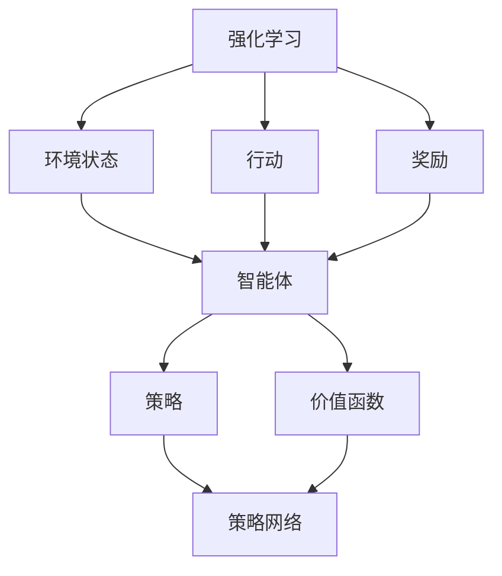
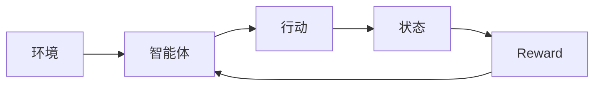
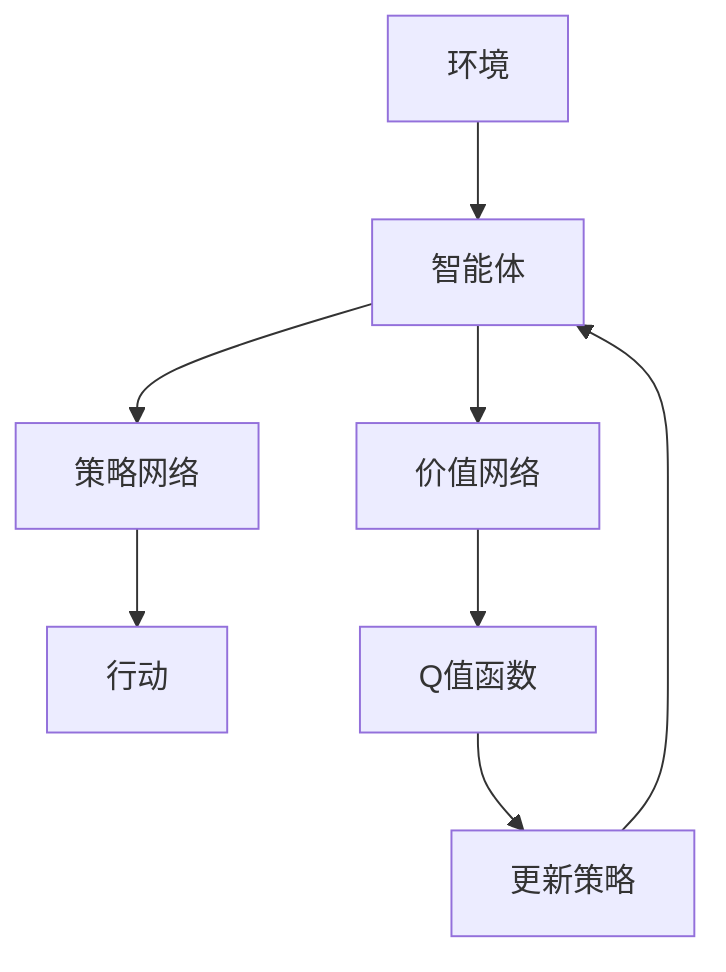
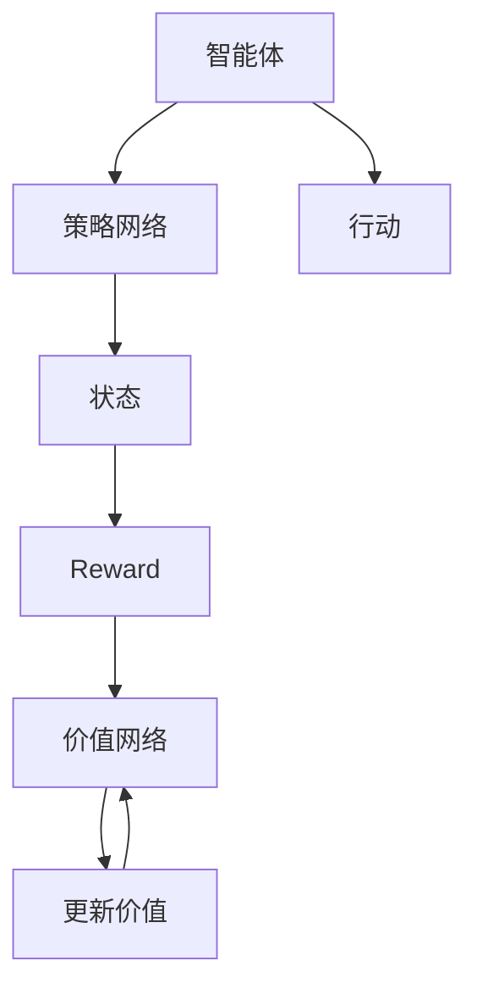
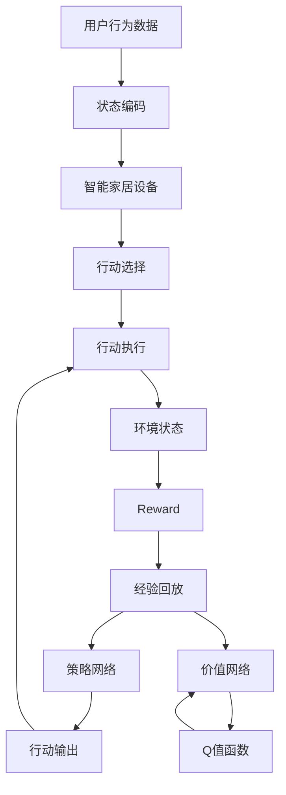

                 

# 深度 Q-learning：在智能家居中的应用

> 关键词：深度强化学习,智能家居,用户行为建模,能源优化,设备调度

## 1. 背景介绍

### 1.1 问题由来

智能家居系统通过各种传感器、控制器、通信协议等技术，实现家庭设备的自动化、智能化管理。例如，恒温器能够根据室内温度自动调节加热或制冷设备，智能灯泡能够根据光照强度和用户偏好自动调节亮度。然而，传统的智能家居系统往往依赖预设的规则和简单的逻辑判断，难以满足用户的多样化需求，也无法实现真正的“智能”。

深度强化学习技术的出现，为智能家居系统带来了新的可能性。通过深度 Q-learning，系统能够在实际应用中不断学习和优化，以更高效、更智能的方式为用户服务。本节将详细介绍深度 Q-learning的基本概念，以及其在智能家居中的应用。

### 1.2 问题核心关键点

深度 Q-learning是一种基于深度神经网络的强化学习算法，通过构建价值函数逼近目标，使得智能体能够自主学习最优策略，实现复杂系统的智能控制。其核心思想是通过学习环境的状态与奖励之间的映射关系，使智能体在每一时刻选择最优行动，从而最大化长期奖励。

深度 Q-learning的关键在于：
- 深度神经网络：通过多层神经网络逼近价值函数，提高学习精度。
- 经验回放：通过存储和回放过去的状态-行动-奖励数据，使网络能够从历史经验中学习。
- 策略网络与价值网络分离：分别用两个网络逼近策略函数和价值函数，提高学习效率和稳定性。

## 2. 核心概念与联系

### 2.1 核心概念概述

为更好地理解深度 Q-learning在智能家居中的应用，本节将介绍几个密切相关的核心概念：

- 强化学习(Reinforcement Learning, RL)：一种通过智能体与环境互动，根据奖励信号优化策略的学习范式。
- 深度神经网络(Deep Neural Network, DNN)：通过多层非线性变换，逼近任意复杂函数，适合处理高维数据。
- 深度 Q-learning：基于深度神经网络的强化学习算法，通过构建逼近Q值函数的深度神经网络，优化智能体的策略选择。
- 环境状态(States)：智能体与环境互动时，环境所处的状态。
- 行动(Actions)：智能体可以采取的行动或操作。
- 奖励(Rewards)：环境对智能体行动的反馈，引导智能体选择最优行动。
- 策略(Strategy)：智能体在每一时刻选择行动的概率分布。
- 价值函数(Value Function)：评估智能体在不同状态下的收益，指导策略选择。

这些概念之间的逻辑关系可以通过以下Mermaid流程图来展示：



这个流程图展示了一轮强化学习中的各个关键组件及其关系：

1. 智能体与环境交互，接收状态和奖励，并根据策略选择行动。
2. 策略网络输出行动概率分布，指导智能体的行动选择。
3. 价值网络逼近价值函数，评估不同状态的价值。
4. 策略和价值网络通过经验回放、梯度下降等优化算法，不断更新网络参数，提高学习效果。

### 2.2 概念间的关系

这些核心概念之间存在着紧密的联系，形成了深度 Q-learning算法的完整框架。下面通过几个Mermaid流程图来展示这些概念之间的关系。

#### 2.2.1 强化学习流程



这个流程图展示了强化学习的基本流程：智能体与环境互动，接收状态和奖励，选择行动，然后返回新状态和奖励，完成一轮循环。

#### 2.2.2 深度 Q-learning架构



这个流程图展示了深度 Q-learning的基本架构：智能体通过策略网络输出行动概率分布，价值网络逼近Q值函数，通过策略更新和价值估计不断优化行动选择。

#### 2.2.3 策略网络与价值网络分离



这个流程图展示了策略网络与价值网络的分离：策略网络输出行动概率，价值网络逼近Q值函数，分别通过不同的优化算法更新网络参数。

### 2.3 核心概念的整体架构

最后，我们用一个综合的流程图来展示深度 Q-learning算法在大规模智能家居系统中的整体架构：



这个综合流程图展示了深度 Q-learning在智能家居系统中的应用流程：

1. 用户行为数据被编码为智能家居系统的状态。
2. 智能家居设备根据当前状态选择行动，并执行操作。
3. 环境状态更新，并返回奖励。
4. 经验和奖励数据被存储并回放，用于训练策略和价值网络。
5. 策略网络输出行动概率，指导智能体选择行动。
6. 价值网络逼近Q值函数，评估不同状态的价值。
7. 策略和价值网络通过优化算法不断更新，提高学习效果。

通过这些流程图，我们可以更清晰地理解深度 Q-learning在智能家居系统中的应用场景和算法框架。

## 3. 核心算法原理 & 具体操作步骤
### 3.1 算法原理概述

深度 Q-learning基于深度神经网络逼近Q值函数，通过学习状态-行动-奖励映射关系，指导智能体在每一时刻选择最优行动，从而最大化长期奖励。其核心算法流程如下：

1. 定义环境状态和行动空间，初始化策略网络 $Q_{\theta}(s, a)$ 和价值网络 $V_{\phi}(s)$，其中 $s$ 为环境状态， $a$ 为行动。
2. 选择行动 $a$ 并执行，接收环境状态 $s'$ 和奖励 $r$。
3. 根据奖励和状态，更新策略网络参数 $\theta$ 和价值网络参数 $\phi$，使 $Q_{\theta}(s, a)$ 逼近真实Q值。
4. 重复步骤2和3，直到达到预设的停止条件。

其中，价值网络 $V_{\phi}(s)$ 用于评估当前状态 $s$ 的价值，指导策略选择。策略网络 $Q_{\theta}(s, a)$ 输出每个行动在状态 $s$ 下的Q值，从而选择最优行动。

### 3.2 算法步骤详解

#### 3.2.1 状态编码与行动选择

智能家居系统中的状态和行动具有高度复杂性，需要将其编码成神经网络能够处理的格式。以智能温控系统为例，状态可以是当前室内温度、室外温度、湿度等传感器数据，行动可以是打开/关闭加热/制冷设备。

状态编码可以采用简单的向量表示，如将传感器数据拼接为一个固定长度的向量。行动选择则通过策略网络 $Q_{\theta}(s, a)$ 输出行动概率分布，指导智能体选择行动。

#### 3.2.2 经验回放与网络更新

经验回放是深度 Q-learning中的重要机制，通过存储和回放过去的状态-行动-奖励数据，使得网络能够从历史经验中学习。假设智能家居系统中每个设备都有传感器和执行器，设备i的智能体在状态 $s$ 时选择了行动 $a$，接收奖励 $r$，并跳转到状态 $s'$，则其经验数据为 $(s, a, r, s')$。

策略网络 $Q_{\theta}(s, a)$ 和价值网络 $V_{\phi}(s)$ 通过最小化损失函数进行更新，损失函数定义为：

$$
L(\theta, \phi) = \mathbb{E}_{(s, a, r, s') \sim \mathcal{D}} [\mathbb{E}_{a' \sim Q_{\theta}(s', a')} [Q_{\theta}(s', a') + \gamma V_{\phi}(s') - (r + \gamma V_{\phi}(s'))]
$$

其中， $\mathcal{D}$ 为经验回放数据集， $\gamma$ 为折扣因子，表示未来奖励的相对重要性。

策略网络的更新过程如下：

1. 对于每个经验数据 $(s, a, r, s')$，根据策略网络输出概率分布 $Q_{\theta}(s, a)$ 和 $Q_{\theta}(s', a')$，选择行动 $a'$。
2. 计算目标Q值 $Q^*(s', a')$ 和当前Q值 $Q_{\theta}(s', a')$ 的误差，定义策略网络的损失函数：
   $$
   L_{\text{policy}}(\theta) = -\mathbb{E}_{(s, a, r, s') \sim \mathcal{D}} [Q_{\theta}(s, a) + \gamma V_{\phi}(s) - (r + \gamma V_{\phi}(s'))]
   $$
3. 通过梯度下降算法更新策略网络参数 $\theta$。

价值网络的更新过程如下：

1. 对于每个经验数据 $(s, a, r, s')$，计算目标Q值 $Q^*(s', a')$ 和当前Q值 $Q_{\theta}(s', a')$ 的误差，定义价值网络的损失函数：
   $$
   L_{\text{value}}(\phi) = \mathbb{E}_{(s, a, r, s') \sim \mathcal{D}} [(Q_{\theta}(s, a) + \gamma V_{\phi}(s) - (r + \gamma V_{\phi}(s'))]^2
   $$
2. 通过梯度下降算法更新价值网络参数 $\phi$。

### 3.3 算法优缺点

深度 Q-learning算法具有以下优点：

1. 适用于复杂环境：通过深度神经网络逼近Q值函数，可以处理高维、非线性状态空间。
2. 能够自适应优化：智能体能够根据环境反馈自适应调整策略，无需人工干预。
3. 收敛速度快：深度神经网络强大的逼近能力，使算法能够快速收敛。

然而，深度 Q-learning算法也存在一些缺点：

1. 经验回放数据量大：需要存储大量状态-行动-奖励数据，对内存和计算资源要求较高。
2. 训练稳定性差：深度神经网络训练过程中容易过拟合，导致泛化能力下降。
3. 策略更新过程复杂：策略网络与价值网络分离，需要同时优化两个网络，增加了训练难度。

### 3.4 算法应用领域

深度 Q-learning在多个领域具有广泛应用，包括但不限于：

- 工业自动化：通过智能体优化生产线调度、物料管理等，提高生产效率。
- 智能交通：通过智能体优化交通流量控制、车辆调度等，减少拥堵和事故。
- 能源管理：通过智能体优化能源分配、负荷调度等，实现节能减排。
- 机器人控制：通过智能体优化机器人路径规划、操作策略等，提高自动化水平。
- 智能家居：通过智能体优化家庭设备控制、用户行为预测等，提升生活便利性。

在智能家居领域，深度 Q-learning主要用于以下几个方面：

1. 用户行为建模：通过学习用户行为数据，预测用户需求，优化设备控制。
2. 能源优化：通过智能体优化能源分配，实现节能减排。
3. 设备调度：通过智能体优化设备运行策略，提高系统效率。

## 4. 数学模型和公式 & 详细讲解 & 举例说明
### 4.1 数学模型构建

深度 Q-learning的数学模型可以表示为：

1. 策略网络：$Q_{\theta}(s, a)$，其中 $s \in S$ 为状态空间， $a \in A$ 为行动空间， $\theta$ 为网络参数。
2. 价值网络：$V_{\phi}(s)$，其中 $s \in S$ 为状态空间， $\phi$ 为网络参数。
3. 目标Q值：$Q^*(s, a) = r + \gamma \max_a Q^*(s', a')$，其中 $r$ 为即时奖励， $\gamma$ 为折扣因子， $s'$ 为下一状态， $a'$ 为下一个最优行动。

通过最小化损失函数，更新策略网络和价值网络参数：

1. 策略网络的损失函数：
   $$
   L_{\text{policy}}(\theta) = -\mathbb{E}_{(s, a, r, s') \sim \mathcal{D}} [Q_{\theta}(s, a) + \gamma V_{\phi}(s) - (r + \gamma V_{\phi}(s'))]
   $$
2. 价值网络的损失函数：
   $$
   L_{\text{value}}(\phi) = \mathbb{E}_{(s, a, r, s') \sim \mathcal{D}} [(Q_{\theta}(s, a) + \gamma V_{\phi}(s) - (r + \gamma V_{\phi}(s'))]^2
   $$

### 4.2 公式推导过程

深度 Q-learning的公式推导过程如下：

1. 定义策略网络 $Q_{\theta}(s, a)$ 和价值网络 $V_{\phi}(s)$，其中 $\theta$ 和 $\phi$ 为网络参数。
2. 选择行动 $a$ 并执行，接收环境状态 $s'$ 和奖励 $r$。
3. 根据目标Q值 $Q^*(s', a')$ 和当前Q值 $Q_{\theta}(s', a')$ 的误差，定义策略网络的损失函数：
   $$
   L_{\text{policy}}(\theta) = -\mathbb{E}_{(s, a, r, s') \sim \mathcal{D}} [Q_{\theta}(s, a) + \gamma V_{\phi}(s) - (r + \gamma V_{\phi}(s'))]
   $$
4. 通过梯度下降算法更新策略网络参数 $\theta$。
5. 根据目标Q值 $Q^*(s', a')$ 和当前Q值 $Q_{\theta}(s', a')$ 的误差，定义价值网络的损失函数：
   $$
   L_{\text{value}}(\phi) = \mathbb{E}_{(s, a, r, s') \sim \mathcal{D}} [(Q_{\theta}(s, a) + \gamma V_{\phi}(s) - (r + \gamma V_{\phi}(s'))]^2
   $$
6. 通过梯度下降算法更新价值网络参数 $\phi$。

### 4.3 案例分析与讲解

以智能温控系统为例，分析深度 Q-learning的优化过程。假设智能家居系统中每个设备都有传感器和执行器，设备i的智能体在状态 $s$ 时选择了行动 $a$，接收奖励 $r$，并跳转到状态 $s'$，则其经验数据为 $(s, a, r, s')$。

1. 策略网络 $Q_{\theta}(s, a)$ 输出行动 $a$ 的概率分布，指导智能体选择行动。
2. 智能体根据策略网络输出的概率分布，选择行动 $a$ 并执行。
3. 环境状态更新为 $s'$，智能体接收奖励 $r$。
4. 智能体根据经验数据 $(s, a, r, s')$，计算目标Q值 $Q^*(s', a')$ 和当前Q值 $Q_{\theta}(s', a')$ 的误差，定义策略网络的损失函数。
5. 通过梯度下降算法更新策略网络参数 $\theta$，使 $Q_{\theta}(s, a)$ 逼近真实Q值。
6. 智能体根据经验数据 $(s, a, r, s')$，计算目标Q值 $Q^*(s', a')$ 和当前Q值 $Q_{\theta}(s', a')$ 的误差，定义价值网络的损失函数。
7. 通过梯度下降算法更新价值网络参数 $\phi$，使 $V_{\phi}(s)$ 逼近真实价值。

通过以上步骤，智能体能够不断学习和优化，逐步适应不同的环境状态，选择最优行动，实现智能家居系统的智能化控制。

## 5. 项目实践：代码实例和详细解释说明
### 5.1 开发环境搭建

在进行智能家居系统深度 Q-learning开发前，我们需要准备好开发环境。以下是使用Python进行TensorFlow开发的环境配置流程：

1. 安装Anaconda：从官网下载并安装Anaconda，用于创建独立的Python环境。

2. 创建并激活虚拟环境：
```bash
conda create -n reinforcement-env python=3.8 
conda activate reinforcement-env
```

3. 安装TensorFlow：根据CUDA版本，从官网获取对应的安装命令。例如：
```bash
conda install tensorflow-gpu=2.7 -c tf
```

4. 安装TensorFlow Addons：
```bash
conda install tf-estimator-nightly=2.7 -c tf
```

5. 安装其他相关工具包：
```bash
pip install gym numpy scikit-learn matplotlib
```

完成上述步骤后，即可在`reinforcement-env`环境中开始深度 Q-learning实践。

### 5.2 源代码详细实现

下面我们以智能温控系统为例，给出使用TensorFlow和TensorFlow Addons实现深度 Q-learning的代码实现。

首先，定义智能温控系统的环境：

```python
import gym
import numpy as np
import tensorflow as tf
import tensorflow_addons as tfa
from tensorflow.keras.models import Sequential
from tensorflow.keras.layers import Dense, Flatten

class TemperatureControlEnv(gym.Env):
    def __init__(self):
        self.reset()
        
    def reset(self):
        self.state = [25, 0, 0] # 当前室内温度、室外温度、湿度
        self.action = None
        self.done = False
        return self.state
    
    def step(self, action):
        self.action = action
        if action == 0: # 关闭加热设备
            self.state[0] -= 1
        elif action == 1: # 关闭制冷设备
            self.state[0] += 1
        self.done = self.state[0] == 20 or self.state[0] == 30
        reward = -1 if self.done else 0
        return self.state, reward, self.done, {}
    
    def render(self, mode='human'):
        pass
```

然后，定义智能体的策略网络和价值网络：

```python
def build_policy_network(input_dim):
    model = Sequential([
        Dense(128, input_dim=input_dim, activation='relu'),
        Dense(64, activation='relu'),
        Dense(2, activation='softmax')
    ])
    return model

def build_value_network(input_dim):
    model = Sequential([
        Dense(128, input_dim=input_dim, activation='relu'),
        Dense(64, activation='relu'),
        Dense(1)
    ])
    return model
```

接着，定义深度 Q-learning算法实现：

```python
class DeepQLearningAgent:
    def __init__(self, state_dim, action_dim, learning_rate=0.001, discount_factor=0.99):
        self.state_dim = state_dim
        self.action_dim = action_dim
        self.learning_rate = learning_rate
        self.discount_factor = discount_factor
        
        self.policy_network = build_policy_network(state_dim)
        self.value_network = build_value_network(state_dim)
        
        self.optimizer = tf.keras.optimizers.Adam(learning_rate)
        self.loss_fn = tf.keras.losses.MSE()
        
        self.memory = []
        self.batch_size = 32
        
    def choose_action(self, state):
        state = np.expand_dims(state, axis=0)
        probabilities = self.policy_network.predict(state)
        action = np.random.choice(self.action_dim, p=probabilities[0])
        return action
    
    def remember(self, state, action, reward, next_state, done):
        self.memory.append((state, action, reward, next_state, done))
    
    def act_on_memory(self):
        if len(self.memory) < self.batch_size:
            return
        mini_batch = np.array(self.memory[:self.batch_size])
        
        state_batch = np.vstack(mini_batch[:, 0])
        action_batch = mini_batch[:, 1].astype(np.int32)
        reward_batch = mini_batch[:, 2]
        next_state_batch = np.vstack(mini_batch[:, 3])
        done_mask = mini_batch[:, 4].astype(np.float32)
        
        with tf.GradientTape() as tape:
            Q_values = self.value_network(tf.convert_to_tensor(state_batch))
            Q_values = tf.squeeze(Q_values, axis=1)
            
            next_state_value = self.value_network(tf.convert_to_tensor(next_state_batch))
            next_state_value = tf.squeeze(next_state_value, axis=1)
            
            targets = reward_batch + (1 - done_mask) * self.discount_factor * next_state_value
            q_pred = self.policy_network(tf.convert_to_tensor(state_batch))
            q_pred = tf.squeeze(q_pred, axis=1)
            
            loss = self.loss_fn(targets, q_pred)
            loss = tf.reduce_mean(loss)
        
        gradients = tape.gradient(loss, self.policy_network.trainable_variables + self.value_network.trainable_variables)
        self.optimizer.apply_gradients(zip(gradients, self.policy_network.trainable_variables + self.value_network.trainable_variables))
        
        self.memory = self.memory[self.batch_size:]
    
    def train(self, n_episodes=1000, max_steps=100):
        for episode in range(n_episodes):
            state = self.env.reset()
            total_reward = 0
            for step in range(max_steps):
                action = self.choose_action(state)
                next_state, reward, done, _ = self.env.step(action)
                self.remember(state, action, reward, next_state, done)
                total_reward += reward
                if done:
                    break
                state = next_state
            
            self.act_on_memory()
            
            if episode % 100 == 0:
                print(f"Episode {episode+1}, Total Reward: {total_reward}")
```

最后，启动深度 Q-learning训练流程：

```python
env = TemperatureControlEnv()
agent = DeepQLearningAgent(state_dim=3, action_dim=2)
agent.train()
```

以上就是使用TensorFlow和TensorFlow Addons对智能温控系统进行深度 Q-learning微调的完整代码实现。可以看到，通过TensorFlow和TensorFlow Addons，我们可以用相对简洁的代码实现深度 Q-learning算法，并进行模型训练和优化。

### 5.3 代码解读与分析

让我们再详细解读一下关键代码的实现细节：

**TemperatureControlEnv类**：
- `__init__`方法：初始化状态和行动，以及环境终止条件。
- `reset`方法：重置环境状态。
- `step`方法：根据智能体选择的行动，执行环境操作，并返回新的状态、奖励、终止标志等。

**build_policy_network和build_value_network函数**：
- `build_policy_network`：定义策略网络的模型结构，包括输入层、隐藏层和输出层。
- `build_value_network`：定义价值网络的模型结构，包括输入层、隐藏层和输出层。

**DeepQLearningAgent类**：
- `__init__`方法：初始化智能体的状态、行动、学习率、折扣因子等参数，以及策略网络和价值网络。
- `choose_action`方法：根据当前状态，选择行动概率最大的行动。
- `remember`方法：存储经验数据，用于后续回放训练。
- `act_on_memory`方法：从记忆中随机抽取批次数据，更新策略网络和价值网络。
- `train`方法：训练智能体，每个epoch中循环迭代若干次，根据环境状态和行动选择，更新策略网络和价值网络。

**训练流程**：
- 定义智能温控环境的温度控制，创建智能体的策略网络和价值网络。
- 初始化智能体的学习率、折扣因子等参数。
- 在每个epoch中，从环境中采样若干次，每次选择行动、更新状态和奖励，并将经验数据存储到记忆中。
- 在每个epoch结束时，从记忆中随机抽取一批经验数据，更新策略网络和价值网络。
- 在每个epoch结束时，打印当前智能体的总奖励。

可以看到，TensorFlow和TensorFlow Addons使得深度 Q-learning的代码实现变得简洁高效。开发者可以将更多精力放在模型改进、超参数调优等高层逻辑上，而不必过多关注底层的实现细节。

当然，工业级的系统实现还需

