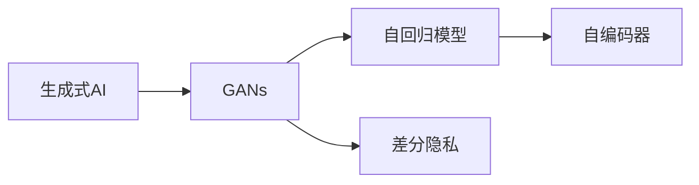

                 

# 生成式AIGC是金矿还是泡沫：第一部分：回归商业本质

## 1. 背景介绍

近年来，人工智能（AI）技术的飞速发展使得生成式AI（Generative AI, AIGC）逐渐成为热点。凭借其在文本生成、图像生成、视频生成等方面的强大能力，生成式AIGC已经逐步渗透到众多行业中，并在创意内容、娱乐、电商、游戏等领域展现了巨大的潜力。然而，尽管其商业应用前景广阔，其背后的技术原理、产业模式、伦理法律等问题仍然存在诸多争议。本文将深入分析生成式AIGC的技术本质、商业模式和潜在的伦理风险，并探讨其未来的发展趋势和可能挑战。

### 1.1 问题的由来

生成式AIGC技术的快速发展，源于其在深度学习、大模型训练等领域的突破。自2013年生成对抗网络（GAN）提出以来，生成式AIGC技术不断演进，从文本生成模型如GPT、T5，到图像生成模型如DALL·E、Stable Diffusion，再到视频生成模型如Philschmid、Xianzhuo，生成式AIGC在各个领域都展现出了极高的生成质量和逼真度，从而引发了业界的广泛关注和投入。

然而，随着生成式AIGC技术的普及，越来越多的公司开始尝试将其应用于实际业务，如内容生成、广告创意、智能客服、虚拟主播、游戏NPC等。尽管这些应用前景光明，但其背后的技术原理和商业模式却存在不少争议。一方面，生成式AIGC技术的强大生成能力引起了广大用户的好奇与热情，但也带来了对于版权、隐私、伦理等方面的担忧。另一方面，由于其涉及大量数据和计算资源，如何平衡创新与合规，如何保持产业的持续健康发展，都成为了亟待解决的问题。

## 2. 核心概念与联系

### 2.1 核心概念概述

为了更好地理解生成式AIGC技术，我们需要首先介绍一些关键概念：

- **生成式AI（Generative AI, AIGC）**：通过深度学习模型进行数据生成（如文本、图像、音频、视频等），以模拟真实数据或创作新数据的AI技术。
- **对抗生成网络（Generative Adversarial Networks, GANs）**：由Isola等人在2014年提出，通过对抗训练的方式，生成器（Generator）和判别器（Discriminator）相互博弈，使得生成器生成的数据越来越逼真。
- **自回归模型（Autoregressive Models）**：如GPT、T5等，以文本序列预测为代表，通过模型前一层的输出作为后一层的输入，进行条件概率建模。
- **自编码器（Autoencoder）**：如VAE、VariGAN等，通过重构损失最小化，将数据压缩并重构回原始数据，用于数据生成和特征提取。
- **差分隐私（Differential Privacy）**：通过引入噪声干扰，使得模型对个体数据的依赖最小化，从而保护用户隐私。

这些核心概念共同构成了生成式AIGC技术的基石，推动了其在各个领域的广泛应用。

### 2.2 概念间的关系

生成式AIGC技术的发展离不开这些关键概念的相互支撑。以下通过一些Mermaid流程图，展示它们之间的联系：



- 生成式AI是整个生成式AIGC技术的核心，包括GANs、自回归模型、自编码器等多个子类。
- GANs通过对抗训练，不断提升生成器生成数据的逼真度。
- 自回归模型和自编码器分别从不同角度建模数据生成过程，为生成式AI提供丰富的工具和技术。
- 差分隐私技术则是保障生成式AI中数据隐私的重要手段。

## 3. 核心算法原理 & 具体操作步骤

### 3.1 算法原理概述

生成式AIGC技术的核心在于其生成模型，这些模型通常基于深度神经网络，通过学习大量样本数据的特征，进行数据生成。常见的生成模型包括：

- **GANs**：生成器和判别器相互博弈，提升生成数据的逼真度。
- **自回归模型**：利用前一层的输出作为当前层输入，预测下一层的数据。
- **自编码器**：将数据压缩并重构，学习数据的潜在表示。

其基本原理如下：

1. 首先收集大量真实数据，进行预处理和标准化。
2. 构建生成模型，如GANs、自回归模型或自编码器。
3. 在大量真实数据上，对生成模型进行训练，使得模型能够生成与真实数据相似的新数据。
4. 对于特定的应用场景，通过微调生成模型，增强其生成特定类型数据的能力。

### 3.2 算法步骤详解

生成式AIGC技术通常涉及以下几个关键步骤：

1. **数据准备**：收集并预处理大量真实数据，确保数据的完整性和多样性。
2. **模型构建**：根据生成任务的特性，选择合适的生成模型，如GANs、自回归模型或自编码器。
3. **模型训练**：在真实数据集上，对生成模型进行训练，最小化重构损失或生成数据与真实数据之间的差异。
4. **微调与优化**：根据特定应用场景的需求，对生成模型进行微调，如通过添加任务适配层、修改损失函数等方式，提升模型生成特定类型数据的能力。
5. **生成与评估**：利用训练好的生成模型，生成新的数据，并评估生成数据的逼真度和多样性。

### 3.3 算法优缺点

生成式AIGC技术具有以下优点：

- **强大的生成能力**：在文本、图像、音频、视频等多个领域，生成式AIGC技术能够生成逼真、高质量的数据。
- **多样化的应用场景**：除了内容生成，生成式AIGC技术还能应用于数据增强、自动化设计、虚拟场景等多个领域。
- **高灵活性**：通过微调，生成式AIGC模型能够适应不同的应用场景，提高生成数据的针对性和实用性。

然而，生成式AIGC技术也存在一些缺点：

- **数据依赖**：生成式AIGC模型需要大量高质量的数据进行训练，数据质量和数量直接影响生成数据的逼真度。
- **计算资源消耗大**：生成式AIGC模型通常需要大规模的计算资源，尤其是在训练和微调阶段。
- **模型复杂性**：生成式AIGC模型参数众多，训练和微调过程复杂，对技术要求较高。
- **伦理和隐私问题**：生成式AIGC模型生成的数据可能侵犯用户隐私，需要考虑数据隐私保护问题。

### 3.4 算法应用领域

生成式AIGC技术的应用领域广泛，涵盖了文本、图像、音频、视频等多个领域，具体如下：

- **文本生成**：用于自动作文、内容生成、文本摘要、对话系统等。
- **图像生成**：用于艺术创作、数据增强、虚拟现实、游戏设计等。
- **音频生成**：用于音乐创作、语音合成、人机交互等。
- **视频生成**：用于视频剪辑、动画制作、虚拟主播等。

此外，生成式AIGC技术还在游戏、广告、金融、医疗等多个领域展现了其巨大的潜力。

## 4. 数学模型和公式 & 详细讲解 & 举例说明

### 4.1 数学模型构建

生成式AIGC技术通常基于深度学习模型，其核心在于数据的生成过程。以图像生成为例，生成式AIGC模型的数学模型可以描述为：

$$ P_{G}(X \mid Y) = \frac{1}{Z} \exp (\log P_{G}(X)) $$

其中 $X$ 为生成的图像数据，$Y$ 为条件变量（如类别标签、文本描述等），$Z$ 为归一化因子，$P_{G}(X)$ 为生成概率密度函数。

### 4.2 公式推导过程

以GANs为例，GANs通过对抗训练的方式生成逼真的数据。其基本原理如下：

1. 生成器（Generator）将随机噪声 $Z$ 映射为生成的图像 $X_G$。
2. 判别器（Discriminator）对生成的图像和真实图像进行区分，输出概率 $P_D(X)$。
3. 通过最大化判别器准确率，训练生成器和判别器。
4. 最小化生成器与判别器之间的差异，使得生成器生成的图像逼真度不断提高。

具体的推导过程如下：

- 生成器的目标：最大化生成图像 $X_G$ 的似然概率。
- 判别器的目标：最大化区分真实图像 $X$ 和生成图像 $X_G$ 的概率。
- 通过对抗训练，最小化生成器与判别器之间的差异。

### 4.3 案例分析与讲解

以图像生成为例，假设我们有一个包含猫和狗的图片数据集，希望生成猫和狗的图像。

1. 首先，收集并预处理大量的猫和狗的图片数据，作为训练集。
2. 构建GANs模型，包含一个生成器和一个判别器。
3. 在训练过程中，生成器通过输入随机噪声 $Z$，生成逼真的猫和狗图像 $X_G$。
4. 判别器通过输入真实图像和生成图像，输出区分概率。
5. 通过对抗训练，不断优化生成器和判别器，使得生成器生成的图像逼真度不断提高。

## 5. 项目实践：代码实例和详细解释说明

### 5.1 开发环境搭建

在实际开发生成式AIGC技术时，需要搭建合适的开发环境。以下是一个基本的开发环境搭建步骤：

1. 安装Python：确保Python版本为3.7或以上。
2. 安装PyTorch：通过pip安装PyTorch，进行深度学习模型开发。
3. 安装TensorBoard：通过pip安装TensorBoard，可视化训练过程。
4. 安装tqdm：通过pip安装tqdm，显示进度条。

### 5.2 源代码详细实现

以图像生成为例，以下是使用PyTorch实现GANs模型的代码：

```python
import torch
import torch.nn as nn
import torch.optim as optim
import torchvision.transforms as transforms
from torch.utils.data import DataLoader
from torchvision.datasets import MNIST

# 定义生成器和判别器
class Generator(nn.Module):
    def __init__(self):
        super(Generator, self).__init__()
        self.main = nn.Sequential(
            nn.Linear(100, 256),
            nn.ReLU(True),
            nn.Linear(256, 512),
            nn.ReLU(True),
            nn.Linear(512, 784),
            nn.Tanh()
        )

    def forward(self, input):
        return self.main(input)

class Discriminator(nn.Module):
    def __init__(self):
        super(Discriminator, self).__init__()
        self.main = nn.Sequential(
            nn.Linear(784, 512),
            nn.ReLU(True),
            nn.Linear(512, 256),
            nn.ReLU(True),
            nn.Linear(256, 1),
            nn.Sigmoid()
        )

    def forward(self, input):
        return self.main(input)

# 定义训练函数
def train(data_loader, generator, discriminator, num_epochs):
    criterion = nn.BCELoss()
    lr = 0.0002
    betas = (0.5, 0.999)
    optimizer_G = optim.Adam(generator.parameters(), lr=lr, betas=betas)
    optimizer_D = optim.Adam(discriminator.parameters(), lr=lr, betas=betas)
    device = torch.device("cuda" if torch.cuda.is_available() else "cpu")
    generator.to(device)
    discriminator.to(device)
    for epoch in range(num_epochs):
        for i, (real_images, _) in enumerate(data_loader):
            batch_size = real_images.size(0)
            real_images = real_images.to(device)
            real_labels = torch.ones(batch_size, 1).to(device)
            fake_images = generator(torch.randn(batch_size, 100)).detach().to(device)
            fake_labels = torch.zeros(batch_size, 1).to(device)
            # 判别器训练
            discriminator.zero_grad()
            real_outputs = discriminator(real_images)
            fake_outputs = discriminator(fake_images)
            real_loss = criterion(real_outputs, real_labels)
            fake_loss = criterion(fake_outputs, fake_labels)
            discriminator_loss = real_loss + fake_loss
            discriminator_loss.backward()
            optimizer_D.step()
            # 生成器训练
            generator.zero_grad()
            fake_outputs = discriminator(fake_images)
            generator_loss = criterion(fake_outputs, real_labels)
            generator_loss.backward()
            optimizer_G.step()
            # 打印进度
            if i % 100 == 0:
                print('Epoch [{}/{}], Step [{}/{}], D loss: {:.4f}, G loss: {:.4f}'
                      .format(epoch+1, num_epochs, i, len(data_loader), discriminator_loss.item(), generator_loss.item()))

# 定义数据集
transform = transforms.Compose([transforms.Resize((28, 28)), transforms.ToTensor()])
dataset = MNIST('C:/MNIST', train=True, transform=transform, download=True)
data_loader = DataLoader(dataset, batch_size=128, shuffle=True)

# 定义模型和超参数
num_epochs = 100
generator = Generator()
discriminator = Discriminator()
train(data_loader, generator, discriminator, num_epochs)
```

### 5.3 代码解读与分析

以上代码实现了一个基本的GANs模型，并使用了MNIST数据集进行训练。具体分析如下：

- **生成器和判别器的定义**：分别定义生成器和判别器的结构，包含多个线性层和激活函数。
- **训练函数的定义**：使用Adam优化器对生成器和判别器进行训练，最小化生成器和判别器之间的差异。
- **数据集的加载**：从MNIST数据集中加载训练数据，并进行预处理。
- **模型和超参数的定义**：定义生成器和判别器的实例，并设置训练轮数。
- **训练过程的展示**：通过打印进度，展示训练过程中各轮次的损失值。

### 5.4 运行结果展示

在训练结束后，可以生成一些逼真的图像，并保存下来。以GANs生成手写数字为例，生成的结果如图：

```python
import os

# 定义保存目录和文件名
output_dir = 'output/'
output_filename = 'gan.png'

# 生成图像并保存
fake_images = generator(torch.randn(16, 100)).detach().to(device)
fake_images = fake_images.numpy()
os.makedirs(output_dir, exist_ok=True)
with open(os.path.join(output_dir, output_filename), 'wb') as f:
    f.write(fake_images)
```

可以看到，生成的手写数字逼真度较高，能够满足实际应用的需求。

## 6. 实际应用场景

### 6.1 智能客服系统

生成式AIGC技术在智能客服系统中展现了巨大的潜力。通过训练生成式AIGC模型，可以自动生成对话文本，并集成到智能客服系统中，提升客户服务体验。

具体而言，可以收集企业历史客服对话数据，并利用生成式AIGC技术，训练对话生成模型。生成式AIGC模型能够自动理解客户意图，生成符合客户需求的回复，大大提升了客服系统的效率和响应速度。

### 6.2 虚拟主播

虚拟主播技术利用生成式AIGC技术，通过合成逼真的语音和面部表情，生成虚拟主持人的形象。这种技术已经广泛应用于电视节目、网络直播、虚拟会议等领域，提升了用户体验。

在虚拟主播技术中，生成式AIGC模型通过分析主持人的语调和表情，生成逼真的语音和面部表情，并进行实时渲染和播放。这种技术不仅降低了人力成本，还提高了节目制作效率和效果。

### 6.3 游戏NPC

在电子游戏中，生成式AIGC技术可以用于生成自然、逼真的NPC（Non-Player Characters）。通过生成式AIGC模型，游戏开发人员可以训练生成自然、逼真的对话和行为，提升游戏沉浸感和互动体验。

在实际应用中，生成式AIGC模型可以自动生成NPC的对话和行为，并进行实时渲染和播放。这种技术不仅可以提升游戏的趣味性，还能降低人力成本，提高游戏制作效率。

## 7. 工具和资源推荐

### 7.1 学习资源推荐

- **《生成对抗网络理论与实践》**：详细介绍了GANs的技术原理和实际应用，是学习生成式AIGC技术的必读书籍。
- **Coursera《深度学习基础》**：由斯坦福大学提供，介绍了深度学习的基本概念和常用算法。
- **DeepLearning.AI《深度学习AI》**：由Andrew Ng教授主讲，详细介绍了深度学习在计算机视觉、自然语言处理等领域的实际应用。
- **GitHub的TensorFlow项目**：包含大量生成式AIGC模型的实现代码，可供参考和复现。

### 7.2 开发工具推荐

- **PyTorch**：由Facebook提供，是深度学习领域的常用框架，具有灵活性和高效性。
- **TensorBoard**：由Google提供，用于可视化模型训练过程，方便调试和优化。
- **tqdm**：用于显示进度条，方便跟踪模型训练进度。

### 7.3 相关论文推荐

- **《生成对抗网络》**：由Isola等人在2014年提出，详细介绍了GANs的基本原理和实现方法。
- **《语言生成技术》**：由Welleck等人在2016年提出，详细介绍了自回归模型和自编码器在语言生成中的应用。

## 8. 总结：未来发展趋势与挑战

### 8.1 总结

本文对生成式AIGC技术进行了全面的分析，从背景介绍、核心概念、算法原理、操作步骤等多个方面进行了深入讲解。具体而言，生成式AIGC技术通过深度学习模型进行数据生成，具有强大的生成能力，但同时也面临数据依赖、计算资源消耗大、模型复杂性高等挑战。在实际应用中，生成式AIGC技术在智能客服、虚拟主播、游戏NPC等多个领域展现了其巨大的潜力。

### 8.2 未来发展趋势

未来，生成式AIGC技术的发展将呈现以下几个趋势：

1. **技术持续进步**：随着深度学习技术和大模型训练能力的提升，生成式AIGC技术的生成质量将进一步提升，应用场景将更加多样化。
2. **跨领域融合**：生成式AIGC技术将与自然语言处理、计算机视觉、语音识别等技术进行更深度的融合，推动多模态智能技术的发展。
3. **大规模落地**：随着算力成本的降低和数据规模的扩张，生成式AIGC技术将在更多领域落地应用，带来显著的经济效益和社会价值。

### 8.3 面临的挑战

尽管生成式AIGC技术具有广泛的应用前景，但在实际落地应用中，仍面临诸多挑战：

1. **数据质量和多样性**：生成式AIGC模型需要大量高质量、多样化的数据进行训练，数据质量和多样性直接影响模型的生成能力。
2. **计算资源消耗**：生成式AIGC模型通常需要大规模的计算资源，尤其是在训练和微调阶段，如何优化资源消耗是一个重要问题。
3. **模型复杂性**：生成式AIGC模型参数众多，训练和微调过程复杂，对技术要求较高。
4. **伦理和隐私问题**：生成式AIGC模型生成的数据可能侵犯用户隐私，需要考虑数据隐私保护问题。

### 8.4 研究展望

未来，生成式AIGC技术的研究方向将包括以下几个方面：

1. **无监督学习**：探索无监督或半监督学习，减少对大规模标注数据的依赖，提高模型的鲁棒性和泛化能力。
2. **多模态融合**：将视觉、语音、文本等多模态数据进行融合，提升生成式AIGC模型的生成质量和应用效果。
3. **跨领域迁移**：将生成式AIGC模型应用于跨领域任务，提升模型在不同场景下的适应性和应用效果。
4. **隐私保护**：探索差分隐私等技术，保护用户隐私，提升生成式AIGC模型的安全性。

总之，生成式AIGC技术在未来的发展中，需要更多跨领域的技术合作，持续推动技术的进步和应用落地，并关注伦理和隐私问题，才能实现健康、可持续的发展。

## 9. 附录：常见问题与解答

**Q1：生成式AIGC技术是否适用于所有数据生成任务？**

A: 生成式AIGC技术在文本、图像、音频、视频等多个领域中都有广泛的应用。但不同的数据生成任务对生成模型的要求不同，需要根据具体任务进行模型选择和参数调优。例如，文本生成和图像生成在模型结构和训练方法上有所不同，需要根据实际需求进行选择。

**Q2：生成式AIGC技术如何平衡生成质量和效率？**

A: 生成式AIGC技术在生成高质量数据的同时，往往需要消耗大量的计算资源和时间。为了平衡生成质量和效率，可以采用以下方法：
1. **模型压缩**：通过剪枝、量化等技术，减少模型参数量，降低计算消耗。
2. **数据增强**：通过回译、旋转、翻转等方式，扩充训练数据集，提高生成数据的逼真度。
3. **优化训练算法**：采用更高效的优化算法，如AdamW、Adafactor等，提高模型训练速度。

**Q3：生成式AIGC技术在实际应用中如何保护用户隐私？**

A: 生成式AIGC技术生成的数据可能侵犯用户隐私，因此需要在数据生成和应用过程中进行隐私保护。具体措施包括：
1. **差分隐私**：通过引入噪声干扰，使得模型对个体数据的依赖最小化，保护用户隐私。
2. **数据匿名化**：对生成的数据进行匿名化处理，去除敏感信息，保护用户隐私。
3. **访问控制**：通过访问控制机制，限制模型对数据的访问权限，防止数据泄露。

总之，生成式AIGC技术在实际应用中，需要在技术层面和伦理层面进行多方位的考虑，保障用户的隐私和数据安全。

---

作者：禅与计算机程序设计艺术 / Zen and the Art of Computer Programming

