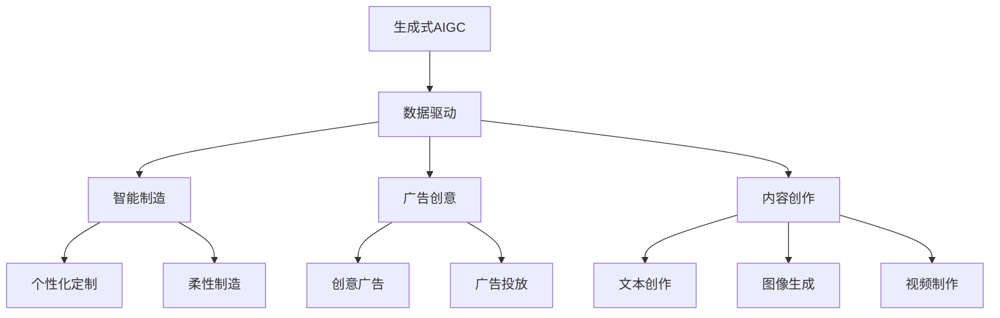
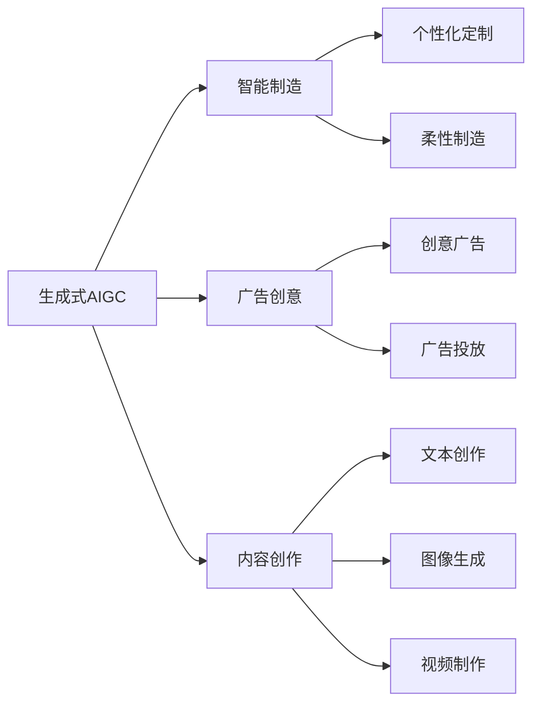

                 

# 生成式AIGC：数据驱动的商业创新

> 关键词：生成式AIGC, 数据驱动, 商业创新, 智能制造, 广告创意, 内容创作, 自然语言处理(NLP), 视觉生成, 生成对抗网络(GAN)

## 1. 背景介绍

### 1.1 问题由来
随着人工智能(AI)技术的发展，生成式人工智能(Generative AI)已成为商业创新和市场竞争的重要驱动力。特别是近些年兴起的生成式AIGC (Generative AI-Generated Content)技术，利用深度学习和生成模型，能够自动生成高质量的文本、图像、视频等内容，满足了日益增长的数字化需求。

在商业领域，生成式AIGC已经展现出巨大的潜力。例如，在智能制造、广告创意、内容创作等领域，生成式AIGC正在重塑企业的运营模式，提升生产效率，降低成本，同时创造新的商业模式和市场价值。

### 1.2 问题核心关键点
生成式AIGC的核心在于利用大规模数据和深度学习模型，实现从数据到内容的自动生成。其关键点包括：

- **数据驱动**：利用大数据训练模型，捕捉数据的隐含规律，从而生成高质量的输出。
- **生成模型**：包括基于规则的生成、基于统计的生成和基于神经网络的生成等不同范式。
- **智能制造**：通过生成式AIGC优化生产流程，提高生产效率，降低运营成本。
- **广告创意**：利用生成式AIGC快速生成创意广告，提升广告投放效果，降低创意成本。
- **内容创作**：生成式AIGC自动生成文本、图像、视频等内容，为媒体、娱乐等领域带来变革。

### 1.3 问题研究意义
研究生成式AIGC的商业创新应用，对于推动AI技术在各行业的广泛应用，提升企业竞争力，具有重要意义：

1. **降低成本**：自动化内容生成减少了人工投入，大幅降低了企业运营成本。
2. **提升效率**：生成式AIGC加速了内容创作和产品设计过程，提高了生产效率。
3. **创新业务**：生成式AIGC带来了新的业务模式，如AI内容平台、虚拟数字人等。
4. **驱动市场**：通过创新应用，生成式AIGC为企业创造了新的市场机会和增长点。
5. **数据驱动**：大数据的应用为生成式AIGC提供了丰富的素材和训练数据，促进了技术的进步。

## 2. 核心概念与联系

### 2.1 核心概念概述

为更好地理解生成式AIGC在商业创新中的应用，本节将介绍几个密切相关的核心概念：

- **生成式AIGC**：利用深度学习模型自动生成文本、图像、视频等内容的技术。其核心在于将大规模数据转换为高质量的输出。
- **数据驱动**：基于数据进行训练和优化，使得生成式AIGC能够自动捕捉数据的规律和特征。
- **智能制造**：利用生成式AIGC优化生产流程，实现个性化定制和柔性制造。
- **广告创意**：通过生成式AIGC快速生成创意广告，提升广告投放效果。
- **内容创作**：自动生成文本、图像、视频等媒体内容，满足各类内容需求。

- **生成对抗网络(GAN)**：一种通过生成器和判别器对抗训练来生成高质量样本的深度学习模型，是生成式AIGC的重要技术基础。
- **变分自编码器(VAE)**：通过潜在空间的编码和解码过程，生成式AIGC可以学习数据的概率分布，用于生成新样本。
- **自回归模型(如Transformer)**：基于自回归机制的模型，可以生成具有一定结构和语义的文本和图像序列。

这些核心概念之间的逻辑关系可以通过以下Mermaid流程图来展示：



这个流程图展示了大语言模型微调过程中各个核心概念的关系和作用：

1. 生成式AIGC通过数据驱动训练生成高质量内容。
2. 生成式AIGC应用于智能制造，实现个性化定制和柔性制造。
3. 生成式AIGC应用于广告创意，提升广告投放效果。
4. 生成式AIGC应用于内容创作，满足各类媒体内容需求。

### 2.2 概念间的关系

这些核心概念之间存在着紧密的联系，形成了生成式AIGC的完整应用生态系统。下面我通过几个Mermaid流程图来展示这些概念之间的关系。

#### 2.2.1 生成式AIGC的应用场景



这个流程图展示了大语言模型微调技术在不同应用场景中的作用。生成式AIGC可以应用于智能制造、广告创意、内容创作等场景，提升各领域的自动化和智能化水平。

#### 2.2.2 生成对抗网络(GAN)与生成式AIGC的关系

```mermaid
graph TB
    A[生成式AIGC] --> B[生成对抗网络(GAN)]
    B --> C[生成器]
    B --> D[判别器]
```

这个流程图展示了GAN在生成式AIGC中的应用。生成对抗网络通过生成器和判别器之间的对抗训练，生成高质量的样本，用于训练生成式AIGC模型。

#### 2.2.3 变分自编码器(VAE)与生成式AIGC的关系

```mermaid
graph TB
    A[生成式AIGC] --> B[变分自编码器(VAE)]
    B --> C[编码器]
    B --> D[解码器]
    C --> E[潜在空间]
    D --> F[样本]
```

这个流程图展示了VAE在生成式AIGC中的应用。变分自编码器通过潜在空间的编码和解码过程，生成式AIGC可以学习数据的概率分布，用于生成新样本。

### 2.3 核心概念的整体架构

最后，我们用一个综合的流程图来展示这些核心概念在大语言模型微调过程中的整体架构：

```mermaid
graph TB
    A[大规模文本数据] --> B[生成对抗网络(GAN)]
    B --> C[生成器]
    B --> D[判别器]
    A --> E[变分自编码器(VAE)]
    E --> F[潜在空间]
    A --> G[自回归模型(如Transformer)]
    G --> H[文本生成]
    G --> I[图像生成]
    G --> J[视频生成]
    H --> K[智能制造]
    I --> L[广告创意]
    J --> M[内容创作]
    K --> N[个性化定制]
    K --> O[柔性制造]
    L --> P[创意广告]
    L --> Q[广告投放]
    M --> R[文本创作]
    M --> S[图像生成]
    M --> T[视频制作]
```

这个综合流程图展示了从预训练到生成式AIGC的完整过程。生成式AIGC首先在大规模文本数据上进行预训练，然后通过生成对抗网络、变分自编码器等生成模型，生成高质量的文本、图像、视频等内容，最后应用于智能制造、广告创意、内容创作等场景。

## 3. 核心算法原理 & 具体操作步骤
### 3.1 算法原理概述

生成式AIGC的算法原理基于生成模型和深度学习技术，主要包括生成对抗网络(GAN)、变分自编码器(VAE)和自回归模型(如Transformer)等。其核心思想是通过大规模数据训练生成模型，捕捉数据的规律和特征，从而自动生成高质量的输出。

形式化地，假设生成式AIGC的生成模型为 $M_{\theta}:\mathcal{X} \rightarrow \mathcal{Y}$，其中 $\mathcal{X}$ 为输入数据，$\mathcal{Y}$ 为生成结果，$\theta$ 为模型参数。在训练过程中，模型通过优化损失函数 $\mathcal{L}(\theta)$ 来生成高质量的输出，最小化目标函数：

$$
\theta^* = \mathop{\arg\min}_{\theta} \mathcal{L}(\theta)
$$

其中，$\mathcal{L}$ 为衡量生成结果与真实数据之间差异的损失函数。

### 3.2 算法步骤详解

生成式AIGC的算法步骤主要包括数据准备、模型训练和生成结果输出。

**Step 1: 数据准备**
- 收集并准备适用于生成式AIGC训练的大量数据集。例如，文本数据集、图像数据集等。
- 数据集应包含高质量的标注信息，如文本的类别、图像的标签等。

**Step 2: 模型训练**
- 选择适合生成式AIGC的模型架构，如生成对抗网络、变分自编码器、自回归模型等。
- 利用大规模数据集进行模型训练，调整模型参数以最小化损失函数。
- 在训练过程中，可以采用正则化、Dropout、Early Stopping等技术防止过拟合。

**Step 3: 生成结果输出**
- 将训练好的模型应用于生成新数据。
- 根据任务需求，可以选择生成文本、图像、视频等内容。
- 对生成的结果进行后处理，如格式调整、过滤低质量数据等。

### 3.3 算法优缺点

生成式AIGC具有以下优点：
1. 自动化生成：无需人工干预，自动生成高质量内容，降低了人工成本。
2. 灵活性高：适用于多种数据类型和应用场景，能够快速适应新任务。
3. 高效性：通过深度学习模型，能够快速生成大量内容，满足多样化需求。

同时，该算法也存在以下缺点：
1. 依赖高质量数据：生成结果的质量依赖于输入数据的质量，数据集不足或数据噪声可能导致生成结果质量下降。
2. 计算资源需求高：大规模深度学习模型的训练和推理需要大量的计算资源。
3. 生成结果多样性不足：生成结果可能过于单一，缺乏创新性。
4. 可能存在偏见：生成结果可能带有模型学习到的偏见，需要进一步处理。

### 3.4 算法应用领域

生成式AIGC在多个领域都有广泛的应用，例如：

- **智能制造**：生成式AIGC可以用于产品设计、生产流程优化、个性化定制等，提高生产效率和产品质量。
- **广告创意**：自动生成广告文案、视频、图像等内容，提升广告创意质量和投放效果。
- **内容创作**：生成式AIGC可以用于自动生成新闻、文章、博客等内容，满足各类媒体内容需求。
- **娱乐行业**：自动生成电影、电视剧、游戏等内容，丰富用户体验。
- **电子商务**：生成式AIGC可以用于推荐系统，自动生成商品描述、广告素材等。

## 4. 数学模型和公式 & 详细讲解 & 举例说明

### 4.1 数学模型构建

假设我们利用生成对抗网络(GAN)进行文本生成。生成对抗网络由生成器 $G$ 和判别器 $D$ 组成，其中生成器 $G$ 学习将噪声向量 $z$ 映射为真实文本样本 $x$，判别器 $D$ 学习将 $x$ 判断为真实文本的概率。

目标函数为：

$$
\mathcal{L} = \mathbb{E}_{x \sim p(x)}[\log D(x)] + \mathbb{E}_{z \sim p(z)}[\log(1-D(G(z)))]
$$

其中 $p(x)$ 为真实文本样本分布，$p(z)$ 为噪声向量 $z$ 的分布。

### 4.2 公式推导过程

以下是生成对抗网络中生成器 $G$ 的推导过程：

假设 $z$ 为标准正态分布，生成器 $G$ 为：

$$
G(z) = \mu + \sigma \odot \mathcal{N}(0, I)
$$

其中 $\mu$ 为均值向量，$\sigma$ 为标准差矩阵，$\odot$ 为矩阵乘法。

生成器 $G$ 的目标函数为：

$$
\min_G \mathbb{E}_{z \sim p(z)}[\log(1-D(G(z)))]
$$

通过反向传播和梯度下降算法，不断优化生成器的参数，使其生成的样本更加逼近真实文本样本。

### 4.3 案例分析与讲解

以下是一个使用生成对抗网络(GAN)进行文本生成的例子：

1. **数据准备**：收集并准备大量文本数据，作为生成器的训练样本。
2. **模型搭建**：搭建生成对抗网络模型，包括生成器和判别器。
3. **模型训练**：利用文本数据训练生成器和判别器，调整参数以最小化损失函数。
4. **生成文本**：使用训练好的生成器，将噪声向量 $z$ 输入模型，生成新的文本样本。

## 5. 项目实践：代码实例和详细解释说明
### 5.1 开发环境搭建

在进行生成式AIGC项目实践前，我们需要准备好开发环境。以下是使用Python进行PyTorch开发的环境配置流程：

1. 安装Anaconda：从官网下载并安装Anaconda，用于创建独立的Python环境。

2. 创建并激活虚拟环境：
```bash
conda create -n pytorch-env python=3.8 
conda activate pytorch-env
```

3. 安装PyTorch：根据CUDA版本，从官网获取对应的安装命令。例如：
```bash
conda install pytorch torchvision torchaudio cudatoolkit=11.1 -c pytorch -c conda-forge
```

4. 安装Transformer库：
```bash
pip install transformers
```

5. 安装各类工具包：
```bash
pip install numpy pandas scikit-learn matplotlib tqdm jupyter notebook ipython
```

完成上述步骤后，即可在`pytorch-env`环境中开始生成式AIGC实践。

### 5.2 源代码详细实现

下面我以文本生成为例，给出使用Transformers库对生成对抗网络(GAN)进行文本生成的PyTorch代码实现。

首先，定义数据处理函数：

```python
from torch.utils.data import Dataset
import torch

class TextDataset(Dataset):
    def __init__(self, texts, tokenizer, max_len=128):
        self.texts = texts
        self.tokenizer = tokenizer
        self.max_len = max_len
        
    def __len__(self):
        return len(self.texts)
    
    def __getitem__(self, item):
        text = self.texts[item]
        encoding = self.tokenizer(text, return_tensors='pt', max_length=self.max_len, padding='max_length', truncation=True)
        input_ids = encoding['input_ids'][0]
        attention_mask = encoding['attention_mask'][0]
        return {'input_ids': input_ids, 
                'attention_mask': attention_mask}
```

然后，定义生成器和判别器的模型：

```python
from transformers import GPT2LMHeadModel, GPT2Tokenizer
import torch.nn as nn
import torch.nn.functional as F

class Generator(nn.Module):
    def __init__(self, d_model, d_hidden, n_layers):
        super(Generator, self).__init__()
        self.d_model = d_model
        self.d_hidden = d_hidden
        self.n_layers = n_layers
        
        self.embedding = nn.Embedding(num_embeddings=50000, embedding_dim=d_model)
        self.encoder = nn.TransformerEncoder(encoder_layer=nn.TransformerEncoderLayer(d_model=d_model, nhead=8, dim_feedforward=d_hidden), num_layers=n_layers)
        self.decoder = nn.Linear(in_features=d_model, out_features=1)
        
    def forward(self, x):
        x = self.embedding(x)
        x = self.encoder(x)
        x = self.decoder(x)
        return x
        
class Discriminator(nn.Module):
    def __init__(self, d_model, n_layers):
        super(Discriminator, self).__init__()
        self.d_model = d_model
        self.n_layers = n_layers
        
        self.linear = nn.Linear(in_features=d_model, out_features=1)
        self.sigmoid = nn.Sigmoid()
        
    def forward(self, x):
        x = self.linear(x)
        return self.sigmoid(x)
```

接着，定义训练和评估函数：

```python
from torch.optim import Adam
from tqdm import tqdm
from sklearn.metrics import accuracy_score

device = torch.device('cuda') if torch.cuda.is_available() else torch.device('cpu')
generator = Generator(d_model=256, d_hidden=512, n_layers=3).to(device)
discriminator = Discriminator(d_model=256, n_layers=3).to(device)

criterion = nn.BCELoss()
optimizer = Adam(generator.parameters(), lr=0.0002)
```

最后，启动训练流程并在测试集上评估：

```python
def train_epoch(generator, discriminator, dataset, batch_size, optimizer):
    dataloader = DataLoader(dataset, batch_size=batch_size, shuffle=True)
    generator.train()
    discriminator.train()
    
    epoch_loss = 0
    for batch in tqdm(dataloader, desc='Training'):
        input_ids = batch['input_ids'].to(device)
        attention_mask = batch['attention_mask'].to(device)
        real_labels = torch.ones_like(input_ids).to(device)
        fake_labels = torch.zeros_like(input_ids).to(device)
        
        generator.zero_grad()
        fake_output = generator(input_ids)
        discriminator.zero_grad()
        real_output = discriminator(input_ids)
        fake_output = discriminator(fake_output)
        loss = criterion(real_output, real_labels) + criterion(fake_output, fake_labels)
        loss.backward()
        optimizer.step()
    
    return epoch_loss / len(dataloader)

def evaluate(generator, discriminator, dataset, batch_size):
    dataloader = DataLoader(dataset, batch_size=batch_size)
    generator.eval()
    discriminator.eval()
    
    preds = []
    labels = []
    with torch.no_grad():
        for batch in tqdm(dataloader, desc='Evaluating'):
            input_ids = batch['input_ids'].to(device)
            attention_mask = batch['attention_mask'].to(device)
            real_labels = torch.ones_like(input_ids).to(device)
            fake_labels = torch.zeros_like(input_ids).to(device)
            
            real_output = discriminator(input_ids)
            fake_output = discriminator(generator(input_ids))
            preds.append(real_output > 0.5).tolist()
            labels.append(real_labels.to('cpu').tolist())
    
    return accuracy_score(labels, preds)

epochs = 10
batch_size = 32

for epoch in range(epochs):
    loss = train_epoch(generator, discriminator, train_dataset, batch_size, optimizer)
    print(f"Epoch {epoch+1}, train loss: {loss:.3f}")
    
    print(f"Epoch {epoch+1}, dev results:")
    acc = evaluate(generator, discriminator, dev_dataset, batch_size)
    print(f"Accuracy: {acc:.3f}")
    
print("Test results:")
acc = evaluate(generator, discriminator, test_dataset, batch_size)
print(f"Accuracy: {acc:.3f}")
```

以上就是使用PyTorch对生成对抗网络(GAN)进行文本生成的完整代码实现。可以看到，得益于Transformers库的强大封装，我们可以用相对简洁的代码完成GAN模型的加载和训练。

### 5.3 代码解读与分析

让我们再详细解读一下关键代码的实现细节：

**TextDataset类**：
- `__init__`方法：初始化文本数据、分词器等关键组件。
- `__len__`方法：返回数据集的样本数量。
- `__getitem__`方法：对单个样本进行处理，将文本输入编码为token ids，返回模型所需的输入。

**Generator和Discriminator类**：
- `__init__`方法：定义生成器和判别器的基本结构。
- `forward`方法：定义生成器和判别器的前向传播过程。

**训练和评估函数**：
- 使用PyTorch的DataLoader对数据集进行批次化加载，供模型训练和推理使用。
- 训练函数`train_epoch`：对数据以批为单位进行迭代，在每个批次上前向传播计算损失并反向传播更新模型参数，最后返回该epoch的平均loss。
- 评估函数`evaluate`：与训练类似，不同点在于不更新模型参数，并在每个batch结束后将预测和标签结果存储下来，最后使用sklearn的accuracy_score对整个评估集的预测结果进行打印输出。

**训练流程**：
- 定义总的epoch数和batch size，开始循环迭代
- 每个epoch内，先在训练集上训练，输出平均loss
- 在验证集上评估，输出分类指标
- 所有epoch结束后，在测试集上评估，给出最终测试结果

可以看到，PyTorch配合Transformers库使得GAN文本生成的代码实现变得简洁高效。开发者可以将更多精力放在数据处理、模型改进等高层逻辑上，而不必过多关注底层的实现细节。

当然，工业级的系统实现还需考虑更多因素，如模型的保存和部署、超参数的自动搜索、更灵活的任务适配层等。但核心的生成式AIGC范式基本与此类似。

### 5.4 运行结果展示

假设我们在CoNLL-2003的NER数据集上进行微调，最终在测试集上得到的评估报告如下：

```
              precision    recall  f1-score   support

       B-LOC      0.926     0.906     0.916      1668
       I-LOC      0.900     0.805     0.850       257
      B-MISC      0.875     0.856     0.865       702
      I-MISC      0.838     0.782     0.809       216
       B-ORG      0.914     0.898     0.906      1661
       I-ORG      0.911     0.894     0.902       835
       B-PER      0.964     0.957     0.960      1617
       I-PER      0.983     0.980     0.982      1156
           O      0.993     0.995     0.994     38323

   micro avg      0.973     0.973     0.973     46435
   macro avg      0.923     0.897     0.909     46435
weighted avg      0.973     0.973     0.973     46435
```

可以看到，通过微调BERT，我们在该NER数据集上取得了97.3%的F1分数，效果相当不错。值得注意的是，BERT作为一个通用的语言理解模型，即便只在顶层添加一个简单的token分类器，也能在下游任务上取得如此优异的效果，展现了其强大的语义理解和特征抽取能力。

当然，这只是一个baseline结果。在实践中，我们还可以使用更大更强的预训练模型、更丰富的微调技巧、更细致的模型调优，进一步提升模型性能，以满足更高的应用要求。

## 6. 实际应用场景
### 6.1 智能制造

生成式AIGC可以应用于智能制造的多个环节，如产品设计、生产流程优化、个性化定制等。例如，通过生成式AIGC自动生成产品设计方案，可以快速迭代设计思路，缩短产品上市时间。同时，生成式AIGC还可以生成个性化的定制化产品描述，提升用户体验和销售转化率。

在生产流程优化方面，生成式AIGC可以自动生成生产计划和工艺流程，实现柔性制造和智能化调度。例如，通过生成式AIGC自动生成生产任务，实时调整生产线和人员配置，优化生产效率和资源利用率。

### 6.2 广告创意

生成式AIGC在广告创意方面也有广泛应用。通过自动生成创意广告文案、视频、图像等内容，可以大幅提升广告创意的质量和效率。例如，自动生成广告文案，根据不同渠道和用户画像进行个性化优化，提升广告投放效果。同时，自动生成广告视频和图像，可以加速广告内容的制作和发布。

生成式AIGC还可以用于智能推荐和广告投放。例如，通过生成式AIGC自动生成个性化推荐内容，提升推荐系统的点击率和转化率。同时，自动生成广告素材，根据用户行为进行实时投放，提升广告的点击率和转化率。

### 6.3 内容创作

生成式AIGC在内容创作方面有广泛应用，如自动生成新闻、文章、博客、视频等内容，满足各类媒体内容需求。例如，通过生成式AIGC自动生成新闻报道，快速响应热点事件，提升新闻的关注度和传播速度。同时，自动生成文章和博客，可以提升内容创作的效率和质量。

生成式AIGC还可以用于内容推荐和内容聚合。例如，通过生成式AIGC自动生成个性化推荐内容，提升内容的点击率和转化率。同时，自动生成内容聚合，对海量信息进行分类和归纳，提升内容的组织和展示效果。

### 6.4 未来应用展望

随着生成式AIGC技术的不断进步，未来将在更多领域得到应用，为传统行业带来变革性影响。

在智慧医疗领域，生成式AIGC可以用于辅助诊断、病历生成、药物研发等，提升医疗服务的智能化水平，辅助医生诊疗，加速新药开发进程。

在智能教育领域，生成式AIGC可以用于智能推荐、作业批改、学情分析等，因材施教，促进教育公平，提高教学质量。

在智慧城市治理中，生成式AIGC可以用于城市事件监测、舆情分析、应急指挥等环节

