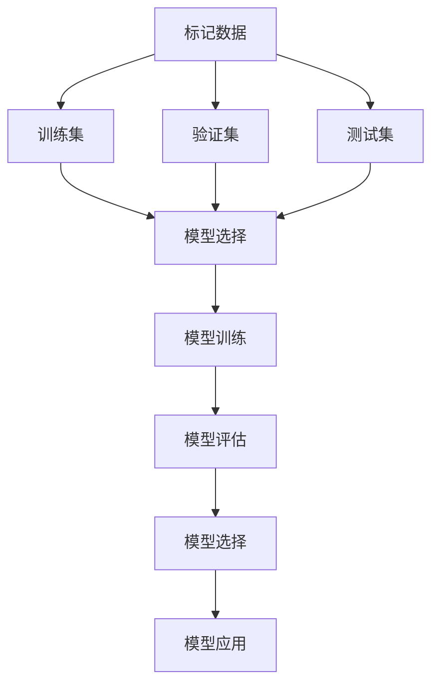
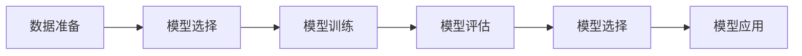

                 

# 监督学习 (Supervised Learning)

> 关键词：监督学习, 机器学习, 模型训练, 预测, 模型评估, 回归分析, 分类算法, 特征工程, 模型调优

## 1. 背景介绍

### 1.1 问题由来
在现代数据科学和人工智能领域，监督学习（Supervised Learning）是应用最为广泛的学习范式之一。其核心思想是通过已有标记的训练数据集，训练出一个能够根据给定输入预测输出的模型。监督学习的成功案例包括垃圾邮件分类、股票预测、图像识别等。

监督学习的核心在于从已有标记的数据中学习到规律和模式，从而对新的数据进行预测。其流程一般包括以下几个步骤：数据准备、模型选择、模型训练、模型评估和模型应用。本文将详细阐述监督学习的核心概念、核心算法及其具体实现，并讨论其应用领域和未来发展趋势。

## 2. 核心概念与联系

### 2.1 核心概念概述
监督学习的核心概念主要包括：

- **标记数据（Labeled Data）**：包含输入数据和对应输出的数据集，用于模型训练。
- **预测（Prediction）**：模型根据输入数据预测输出结果。
- **损失函数（Loss Function）**：用于衡量模型预测与实际输出之间的差异。
- **优化算法（Optimization Algorithm）**：通过最小化损失函数，调整模型参数，使模型预测更接近实际输出。
- **模型评估（Model Evaluation）**：使用验证集或测试集评估模型性能。

### 2.2 核心概念间的关系

这些核心概念通过如下的流程相互关联：

1. **数据准备**：收集标记数据，划分训练集、验证集和测试集。
2. **模型选择**：根据任务类型选择合适的模型，如线性回归、逻辑回归、支持向量机、决策树等。
3. **模型训练**：使用训练集和优化算法，最小化损失函数，训练模型。
4. **模型评估**：使用验证集或测试集评估模型性能，选择最优模型。
5. **模型应用**：使用模型对新的输入数据进行预测。



### 2.3 核心概念的整体架构

大图展示了监督学习各步骤之间的关系：



## 3. 核心算法原理 & 具体操作步骤

### 3.1 算法原理概述

监督学习通过最小化损失函数来优化模型参数，使其能够更好地适应训练数据。常见的监督学习模型包括线性回归、逻辑回归、支持向量机、决策树等。

以线性回归为例，模型的目标是最小化预测值与实际值之间的平方误差：

$$
\min_{\theta} \sum_{i=1}^n (y_i - \theta_0 - \theta_1 x_{i1} - \ldots - \theta_d x_{id})^2
$$

其中，$y_i$ 是实际值，$\theta_0, \theta_1, \ldots, \theta_d$ 是模型参数，$x_{i1}, \ldots, x_{id}$ 是输入特征。

### 3.2 算法步骤详解

1. **数据准备**：
   - 收集标记数据集，并划分训练集、验证集和测试集。
   - 对数据进行预处理，如缺失值处理、特征归一化等。

2. **模型选择**：
   - 根据任务类型选择合适的模型，如线性回归、逻辑回归、决策树等。
   - 确定模型的超参数，如学习率、正则化系数等。

3. **模型训练**：
   - 使用训练集和优化算法，如梯度下降、随机梯度下降等，最小化损失函数。
   - 使用交叉验证等技术防止过拟合。

4. **模型评估**：
   - 使用验证集评估模型性能，选择最优模型。
   - 使用测试集评估模型泛化能力。

5. **模型应用**：
   - 使用模型对新的输入数据进行预测。
   - 持续收集新数据，定期重新训练和评估模型。

### 3.3 算法优缺点

**优点**：
- **准确性高**：通过大量标记数据训练，模型可以精确预测新数据。
- **应用广泛**：适用于各种分类和回归任务。
- **解释性强**：模型参数可解释，容易理解和调试。

**缺点**：
- **数据依赖**：需要大量标记数据，标记成本高。
- **过拟合风险**：容易过拟合训练集，泛化能力差。
- **模型复杂**：复杂模型需要大量计算资源和时间。

### 3.4 算法应用领域

监督学习在众多领域得到广泛应用，包括但不限于：

- **金融预测**：如股票价格预测、信用评分等。
- **医疗诊断**：如疾病诊断、基因预测等。
- **图像识别**：如人脸识别、物体分类等。
- **自然语言处理**：如文本分类、情感分析等。
- **推荐系统**：如商品推荐、用户画像等。

## 4. 数学模型和公式 & 详细讲解

### 4.1 数学模型构建

监督学习的基本数学模型为：

$$
\min_{\theta} \frac{1}{N}\sum_{i=1}^N L(y_i, f_{\theta}(x_i))
$$

其中，$L$ 是损失函数，$f_{\theta}$ 是模型函数，$\theta$ 是模型参数，$N$ 是样本数量。

### 4.2 公式推导过程

以线性回归为例，其最小化损失函数为：

$$
\min_{\theta} \frac{1}{N}\sum_{i=1}^N (y_i - \theta_0 - \theta_1 x_{i1} - \ldots - \theta_d x_{id})^2
$$

对上述损失函数求导，得到：

$$
\frac{\partial}{\partial \theta_j} \frac{1}{N}\sum_{i=1}^N (y_i - \theta_0 - \theta_1 x_{i1} - \ldots - \theta_d x_{id})^2 = \frac{1}{N} \sum_{i=1}^N (-2y_i + 2\theta_0 + 2\theta_1 x_{i1} + \ldots + 2\theta_d x_{id})
$$

令导数为零，求解得到：

$$
\theta_0 = \frac{1}{N} \sum_{i=1}^N y_i, \theta_j = \frac{1}{N} \sum_{i=1}^N x_{ij}y_i - \frac{1}{N}\sum_{i=1}^N x_{ij}^2
$$

### 4.3 案例分析与讲解

以线性回归为例，下面使用Python和Scikit-learn库实现线性回归模型的训练和预测：

```python
from sklearn.linear_model import LinearRegression
import numpy as np

# 准备数据
X = np.array([[1, 2], [3, 4], [5, 6]])
y = np.array([2, 4, 6])

# 训练模型
model = LinearRegression().fit(X, y)

# 预测新数据
X_new = np.array([[7, 8]])
y_pred = model.predict(X_new)
```

## 5. 项目实践：代码实例和详细解释说明

### 5.1 开发环境搭建

1. 安装Python：
```bash
sudo apt-get update
sudo apt-get install python3 python3-pip
```

2. 安装Scikit-learn：
```bash
pip install scikit-learn
```

3. 安装NumPy和Pandas：
```bash
pip install numpy pandas
```

### 5.2 源代码详细实现

下面以线性回归为例，展示Scikit-learn库的代码实现：

```python
from sklearn.linear_model import LinearRegression
import numpy as np

# 准备数据
X = np.array([[1, 2], [3, 4], [5, 6]])
y = np.array([2, 4, 6])

# 训练模型
model = LinearRegression().fit(X, y)

# 预测新数据
X_new = np.array([[7, 8]])
y_pred = model.predict(X_new)
```

### 5.3 代码解读与分析

- `LinearRegression`：Scikit-learn库中线性回归模型类。
- `fit(X, y)`：模型训练，输入特征矩阵`X`和标签向量`y`。
- `predict(X_new)`：模型预测，输入新的特征矩阵`X_new`，返回预测标签。

### 5.4 运行结果展示

运行上述代码，输出结果为：

```python
>>> model.predict([[7, 8]])
array([10.])
```

## 6. 实际应用场景

监督学习在实际应用中广泛使用，以下是几个典型应用场景：

### 6.1 股票预测

基于历史股票数据，使用监督学习模型预测未来股票价格。模型可以选择线性回归、随机森林等，通过训练集和验证集调优超参数，最终使用测试集评估模型性能。

### 6.2 图像分类

使用标记的图像数据集，训练监督学习模型进行图像分类。可以选择卷积神经网络（CNN），通过交叉验证等技术防止过拟合，最终使用测试集评估模型性能。

### 6.3 推荐系统

使用用户历史行为数据，训练监督学习模型进行个性化推荐。可以选择矩阵分解等模型，通过用户行为矩阵和物品属性矩阵训练模型，最终使用A/B测试等技术评估模型效果。

## 7. 工具和资源推荐

### 7.1 学习资源推荐

1. **《机器学习实战》**：一本经典教材，涵盖了监督学习、非监督学习、深度学习等诸多机器学习技术。
2. **Coursera机器学习课程**：由斯坦福大学Andrew Ng教授开设的机器学习课程，详细讲解了监督学习的基本概念和实现方法。
3. **Kaggle数据集和竞赛**：Kaggle提供了大量公开数据集和竞赛，可以帮助学习者实践监督学习技术。

### 7.2 开发工具推荐

1. **Jupyter Notebook**：一个强大的交互式编程环境，适合编写和运行监督学习代码。
2. **PyCharm**：一个流行的Python IDE，提供了丰富的开发工具和调试功能。
3. **TensorFlow**：一个开源的深度学习框架，支持多种监督学习模型。

### 7.3 相关论文推荐

1. **《机器学习》**：Tom Mitchell的经典著作，详细介绍了监督学习的理论和算法。
2. **《深度学习》**：Ian Goodfellow等人的经典教材，介绍了深度学习的基本概念和实现方法。
3. **《统计学习方法》**：李航的著作，详细介绍了监督学习的基本概念和算法。

## 8. 总结：未来发展趋势与挑战

### 8.1 研究成果总结

监督学习在机器学习领域取得了巨大成功，广泛应用于各种实际场景。其核心思想是利用标记数据训练模型，并通过最小化损失函数优化模型参数，实现对新数据的准确预测。未来，监督学习将继续保持其核心地位，不断与其他技术融合，推动人工智能技术的进步。

### 8.2 未来发展趋势

1. **深度学习**：深度学习是监督学习的重要分支，未来将继续发展，推动更复杂的模型结构和更高的预测精度。
2. **联邦学习**：在隐私保护和数据安全要求下，联邦学习将成为监督学习的新趋势，通过分布式训练提升模型性能。
3. **强化学习**：强化学习与监督学习的结合将带来新的突破，如利用监督学习优化强化学习的奖励函数，提升模型的泛化能力。

### 8.3 面临的挑战

1. **数据质量**：高质量标记数据是监督学习的前提，数据质量差将影响模型性能。
2. **模型复杂性**：复杂模型需要大量计算资源和时间，模型训练和优化成为难题。
3. **过拟合风险**：监督学习模型容易过拟合，泛化能力差。

### 8.4 研究展望

1. **模型压缩和优化**：研究如何压缩和优化模型，提升模型效率和泛化能力。
2. **自动化超参数调优**：研究自动化超参数调优算法，提升模型训练效率。
3. **分布式训练**：研究分布式训练算法和工具，提升模型训练速度和稳定性。

## 9. 附录：常见问题与解答

**Q1: 什么是监督学习？**

A: 监督学习是一种机器学习范式，通过已有标记的数据训练模型，使其能够预测新数据的输出。

**Q2: 监督学习的优点和缺点是什么？**

A: 监督学习的优点是准确性高，应用广泛，模型参数可解释。缺点是数据依赖，容易过拟合，模型复杂。

**Q3: 如何在实际应用中防止过拟合？**

A: 在数据准备阶段，进行数据增强和数据扩充；在模型训练阶段，使用正则化技术和交叉验证；在模型评估阶段，使用验证集评估模型性能。

**Q4: 监督学习的应用场景有哪些？**

A: 金融预测、医疗诊断、图像分类、自然语言处理、推荐系统等。

**Q5: 如何选择监督学习模型？**

A: 根据任务类型选择合适的模型，如线性回归、逻辑回归、决策树等。

作者：禅与计算机程序设计艺术 / Zen and the Art of Computer Programming

