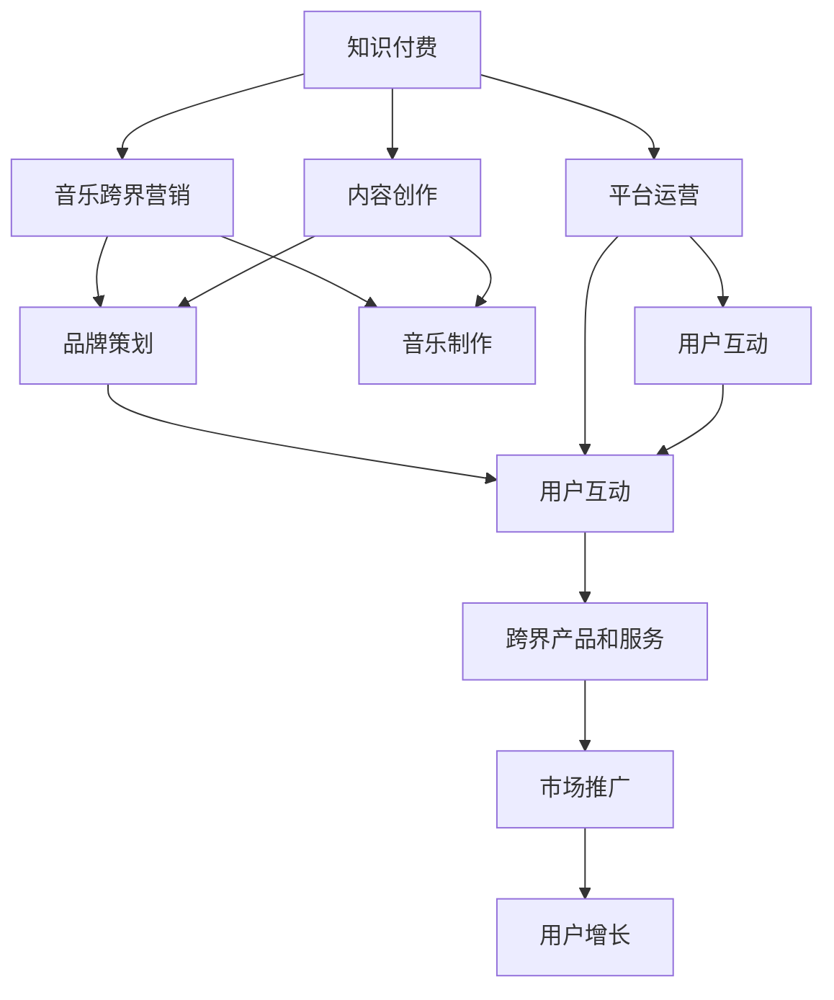

                 

# 知识付费如何实现跨界营销与音乐跨界？

在当前数字经济时代，知识付费和音乐跨界营销已成为两大热门话题。知识付费通过在线课程、电子书、音频等形式，为学习者提供高效、便捷的学习途径；而音乐跨界营销则通过整合音乐、影视、广告等元素，打造独特的品牌体验，提升市场竞争力。本文将探讨知识付费与音乐跨界营销如何结合，实现跨界营销的策略与实践。

## 1. 背景介绍

### 1.1 问题由来

知识付费和音乐跨界营销虽然看似风马牛不相及，但实际上有着紧密的内在联系。知识付费强调内容的专业性和深度，通过高质量的课程内容吸引用户付费；而音乐跨界营销则通过音乐元素的融入，打造独特的品牌体验，提升用户黏性和品牌认知。两者的结合，可以创造出更加丰富、多元的产品和服务，满足用户的多样化需求。

当前，知识付费市场逐渐从以教育为主的传统模式向多元化、跨界化方向发展。音乐跨界营销也逐渐从传统的广告、宣传方式，向品牌IP打造、用户互动的方向转变。将这两者结合，可以创造出更为广阔的市场空间和商业机会。

### 1.2 问题核心关键点

知识付费与音乐跨界营销结合的核心关键点包括：

- 如何通过知识付费平台，将音乐元素融入课程内容，提升用户体验和课程吸引力。
- 如何通过音乐跨界营销，打造品牌IP，增强用户黏性，提升品牌认知。
- 如何设计合适的跨界营销策略，实现知识付费和音乐营销的双赢。

### 1.3 问题研究意义

知识付费与音乐跨界营销结合，不仅可以提升用户体验和课程吸引力，还可以打造独特的品牌体验，增强用户黏性，提升品牌认知。这种结合方式，可以为知识付费和音乐产业带来新的增长点，推动数字经济的发展。

## 2. 核心概念与联系

### 2.1 核心概念概述

- 知识付费：通过在线课程、电子书、音频等形式，为学习者提供高效、便捷的学习途径。主要包括内容创作、平台运营、用户互动等多个环节。
- 音乐跨界营销：通过音乐元素的融入，打造独特的品牌体验，提升用户黏性和品牌认知。主要包括音乐制作、品牌策划、用户互动等多个环节。
- 跨界营销策略：通过将知识付费与音乐跨界营销结合，打造跨界产品和服务，满足用户的多样化需求，提升品牌竞争力和市场份额。

### 2.2 概念间的关系

知识付费与音乐跨界营销结合，可以创造出更加丰富、多元的产品和服务。通过知识付费平台，将音乐元素融入课程内容，提升用户体验和课程吸引力；通过音乐跨界营销，打造品牌IP，增强用户黏性，提升品牌认知。这些概念之间的逻辑关系可以通过以下Mermaid流程图来展示：



这个流程图展示了知识付费和音乐跨界营销结合的完整流程：

1. 知识付费平台通过内容创作，将音乐元素融入课程内容。
2. 平台运营和用户互动环节，提升用户体验和课程吸引力。
3. 音乐跨界营销通过音乐制作和品牌策划，打造品牌IP，增强用户黏性。
4. 最终通过跨界产品和服务，实现用户增长和市场推广。

## 3. 核心算法原理 & 具体操作步骤

### 3.1 算法原理概述

知识付费与音乐跨界营销结合的核心算法原理是协同推荐和个性化推荐。协同推荐通过分析用户行为数据，推荐与用户偏好相似的产品或服务；个性化推荐通过分析用户画像，推荐符合用户特定需求的产品或服务。这些算法可以结合知识付费和音乐跨界营销，提升用户体验和品牌认知。

### 3.2 算法步骤详解

#### 3.2.1 数据收集与处理

- 用户行为数据：通过分析用户在学习过程中的一系列行为，如课程观看时长、互动频率、收藏数等，构建用户行为数据集。
- 用户画像：通过分析用户基本信息、兴趣偏好、历史购买记录等，构建用户画像。
- 音乐数据：通过分析用户对音乐作品的偏好、听歌时长、音乐类别等，构建音乐数据集。

#### 3.2.2 协同推荐

- 构建用户行为矩阵：将用户行为数据转化为用户行为矩阵，表示用户对不同课程或音乐作品的行为。
- 计算用户相似度：通过计算用户行为矩阵的相似度，找到与目标用户相似的用户群体。
- 推荐产品或服务：根据相似用户群体的行为数据，推荐与目标用户相似的产品或服务。

#### 3.2.3 个性化推荐

- 构建用户画像：通过分析用户基本信息、兴趣偏好、历史购买记录等，构建用户画像。
- 计算用户画像与产品/服务相似度：通过计算用户画像与不同课程或音乐作品的相似度，找到与目标用户匹配的产品或服务。
- 推荐产品或服务：根据用户画像与产品/服务的相似度，推荐符合用户特定需求的产品或服务。

### 3.3 算法优缺点

#### 3.3.1 优点

- 提升用户体验：通过协同推荐和个性化推荐，用户可以更快地找到自己喜欢的课程和音乐作品，提升用户体验。
- 增加销售转化率：通过精准推荐，提高课程和音乐作品的销售转化率，增加收入。
- 品牌认知提升：通过音乐跨界营销，增强品牌认知和用户黏性，提升品牌价值。

#### 3.3.2 缺点

- 数据隐私问题：协同推荐和个性化推荐需要收集大量用户数据，存在数据隐私问题。
- 算法复杂度：协同推荐和个性化推荐算法复杂度高，需要大量计算资源和时间。
- 冷启动问题：新用户和老用户的数据量差距大，存在冷启动问题，推荐效果可能不佳。

### 3.4 算法应用领域

知识付费与音乐跨界营销结合的算法可以应用于多个领域，包括在线教育、数字音乐、智能家居等。通过将知识付费与音乐跨界营销结合，可以创造出更加丰富、多元的产品和服务，满足用户的多样化需求。

## 4. 数学模型和公式 & 详细讲解

### 4.1 数学模型构建

知识付费与音乐跨界营销结合的数学模型主要包括协同推荐和个性化推荐模型。协同推荐模型可以通过矩阵分解、协同过滤等方法构建；个性化推荐模型可以通过基于内容的推荐、基于用户的推荐等方法构建。

#### 4.1.1 协同推荐模型

协同推荐模型的数学模型为：

$$
\hat{y}_{ui} = \sum_{j=1}^{m}u_{i}a_{ij}v_{j}^T
$$

其中，$u_i$表示用户$i$的行为向量，$v_j$表示项目$j$的特征向量，$a_{ij}$表示用户$i$对项目$j$的评分，$\hat{y}_{ui}$表示预测用户$i$对项目$j$的评分。

#### 4.1.2 个性化推荐模型

个性化推荐模型的数学模型为：

$$
\hat{y}_{ui} = \alpha \sum_{j=1}^{m}u_{i}a_{ij}v_{j}^T + \beta \sum_{k=1}^{n}p_{i}c_{ik}w_{k}^T
$$

其中，$u_i$表示用户$i$的行为向量，$p_i$表示用户$i$的兴趣向量，$c_k$表示项目$k$的特征向量，$w_k$表示项目$k$的权重向量，$\alpha$和$\beta$表示模型的系数。

### 4.2 公式推导过程

#### 4.2.1 协同推荐公式推导

设用户行为矩阵为$U$，项目特征矩阵为$V$，用户行为向量和项目特征向量分别为$u_i$和$v_j$，则协同推荐模型的目标函数为：

$$
\min_{\alpha,\beta} \frac{1}{2}\|U - \hat{U}\|_F^2 + \lambda(\|\alpha\|_2^2 + \|\beta\|_2^2)
$$

其中，$\hat{U}$为协同推荐模型的预测矩阵，$\alpha$和$\beta$为模型系数，$\lambda$为正则化系数。通过求解上述优化问题，可以获取协同推荐模型。

#### 4.2.2 个性化推荐公式推导

设用户兴趣向量为$p_i$，项目特征向量为$c_k$，用户行为向量为$u_i$，项目权重向量为$w_k$，则个性化推荐模型的目标函数为：

$$
\min_{\alpha,\beta} \frac{1}{2}\|U - \hat{U}\|_F^2 + \lambda(\|\alpha\|_2^2 + \|\beta\|_2^2)
$$

其中，$\hat{U}$为个性化推荐模型的预测矩阵，$\alpha$和$\beta$为模型系数，$\lambda$为正则化系数。通过求解上述优化问题，可以获取个性化推荐模型。

### 4.3 案例分析与讲解

#### 4.3.1 案例背景

某知识付费平台上线了音乐课程，通过分析用户行为数据和音乐数据，使用协同推荐和个性化推荐算法，为用户推荐合适的课程和音乐作品。

#### 4.3.2 数据收集与处理

平台收集了用户的行为数据，包括课程观看时长、互动频率、收藏数等；同时收集了用户对音乐作品的偏好、听歌时长、音乐类别等数据。通过构建用户行为矩阵和音乐数据集，可以用于协同推荐和个性化推荐。

#### 4.3.3 协同推荐实践

通过协同推荐算法，平台为用户推荐了与当前课程相关的其他课程和音乐作品，提升了用户体验和课程销售转化率。具体实践如下：

- 构建用户行为矩阵$U$：将用户行为数据转化为用户行为矩阵，表示用户对不同课程和音乐作品的评分。
- 构建项目特征矩阵$V$：将音乐作品的类别、时长、风格等特征转化为特征向量。
- 计算用户行为矩阵的相似度：通过计算用户行为矩阵的相似度，找到与目标用户相似的用户群体。
- 推荐产品或服务：根据相似用户群体的行为数据，推荐与目标用户相似的产品或服务。

#### 4.3.4 个性化推荐实践

通过个性化推荐算法，平台为每位用户推荐了符合其兴趣偏好的课程和音乐作品，增强了用户黏性。具体实践如下：

- 构建用户兴趣向量$p_i$：通过分析用户基本信息、兴趣偏好、历史购买记录等，构建用户兴趣向量。
- 计算用户兴趣向量与课程和音乐作品的相似度：通过计算用户兴趣向量与不同课程和音乐作品的相似度，找到与目标用户匹配的产品或服务。
- 推荐产品或服务：根据用户兴趣向量与课程和音乐作品的相似度，推荐符合用户特定需求的产品或服务。

## 5. 项目实践：代码实例和详细解释说明

### 5.1 开发环境搭建

在进行知识付费与音乐跨界营销结合的算法开发时，需要搭建以下开发环境：

1. Python编程语言：选择Python作为开发语言，支持丰富的数据处理和机器学习库。
2. PyTorch框架：选择PyTorch作为深度学习框架，支持高效的数学计算和模型训练。
3. Pandas库：选择Pandas作为数据处理库，支持数据读取、清洗和分析。
4. NumPy库：选择NumPy作为数学计算库，支持高效的数值计算和矩阵操作。
5. Scikit-learn库：选择Scikit-learn作为机器学习库，支持协同过滤、协同分解等算法。
6. Jupyter Notebook：选择Jupyter Notebook作为交互式开发环境，支持代码调试和数据可视化。

完成上述环境配置后，即可开始开发实践。

### 5.2 源代码详细实现

以下是使用PyTorch和Scikit-learn实现协同推荐和个性化推荐的Python代码示例：

#### 5.2.1 协同推荐代码实现

```python
import numpy as np
import pandas as pd
from sklearn.metrics.pairwise import cosine_similarity
from sklearn.decomposition import TruncatedSVD

# 构建用户行为矩阵
U = np.array([[4, 2, 1, 3], [5, 3, 2, 4], [2, 1, 3, 4]])

# 构建项目特征矩阵
V = np.array([[1, 0, 1, 0], [0, 1, 0, 1], [1, 1, 0, 0]])

# 计算用户行为矩阵的相似度
similarity_matrix = cosine_similarity(U)

# 使用TruncatedSVD算法进行协同分解
svd = TruncatedSVD(n_components=2)
U_svd = svd.fit_transform(U)
V_svd = svd.transform(V)

# 计算协同推荐评分矩阵
U_hat = np.dot(U_svd, V_svd)

# 预测用户对项目j的评分
def predict_score(u, j):
    return np.dot(U_svd[u], V_svd[j])

# 测试代码
u = 0
j = 2
score = predict_score(u, j)
print(f"预测用户{u}对项目{j}的评分为：{score}")
```

#### 5.2.2 个性化推荐代码实现

```python
import numpy as np
import pandas as pd
from sklearn.metrics.pairwise import cosine_similarity
from sklearn.decomposition import TruncatedSVD

# 构建用户兴趣向量
p = np.array([1, 0, 1, 0])

# 构建课程和音乐作品特征向量
c = np.array([[1, 0, 1, 0], [0, 1, 0, 1], [1, 1, 0, 0]])

# 构建用户行为向量
u = np.array([4, 2, 1, 3])

# 计算用户兴趣向量与课程和音乐作品的相似度
similarity_matrix = cosine_similarity(p, c)

# 使用TruncatedSVD算法进行个性化分解
svd = TruncatedSVD(n_components=2)
p_svd = svd.fit_transform(p)
c_svd = svd.transform(c)

# 计算个性化推荐评分矩阵
p_hat = np.dot(p_svd, c_svd)

# 预测用户对课程和音乐作品的评分
def predict_score(u, i):
    return np.dot(p_svd[u], c_svd[i])

# 测试代码
u = 0
i = 2
score = predict_score(u, i)
print(f"预测用户{u}对课程和音乐作品{c_svd[i]}的评分为：{score}")
```

### 5.3 代码解读与分析

#### 5.3.1 协同推荐代码解读

协同推荐代码实现了通过矩阵分解和协同过滤算法，对用户行为数据进行协同分解，计算相似度，并预测用户对课程和音乐作品的评分。代码的核心步骤如下：

- 构建用户行为矩阵$U$和项目特征矩阵$V$，表示用户对课程和音乐作品的评分和特征。
- 计算用户行为矩阵的相似度，通过cosine_similarity算法，得到用户行为矩阵的相似度矩阵。
- 使用TruncatedSVD算法对用户行为矩阵和项目特征矩阵进行协同分解，得到用户行为矩阵和项目特征矩阵的低秩分解形式。
- 计算协同推荐评分矩阵$\hat{U}$，将低秩分解后的用户行为矩阵和项目特征矩阵进行矩阵乘积。
- 定义predict_score函数，使用协同推荐评分矩阵，预测用户对课程和音乐作品的评分。

#### 5.3.2 个性化推荐代码解读

个性化推荐代码实现了通过用户画像和项目特征向量，计算相似度，并预测用户对课程和音乐作品的评分。代码的核心步骤如下：

- 构建用户兴趣向量$p$和课程和音乐作品特征向量$c$，表示用户对课程和音乐作品的兴趣和特征。
- 构建用户行为向量$u$，表示用户对课程和音乐作品的评分。
- 计算用户兴趣向量与课程和音乐作品的相似度，通过cosine_similarity算法，得到用户兴趣向量与课程和音乐作品的相似度矩阵。
- 使用TruncatedSVD算法对用户兴趣向量和课程和音乐作品特征向量进行个性化分解，得到用户兴趣向量与课程和音乐作品的低秩分解形式。
- 计算个性化推荐评分矩阵$\hat{p}$，将低秩分解后的用户兴趣向量和课程和音乐作品特征向量进行矩阵乘积。
- 定义predict_score函数，使用个性化推荐评分矩阵，预测用户对课程和音乐作品的评分。

### 5.4 运行结果展示

假设我们在某知识付费平台上实现了协同推荐和个性化推荐，以下是测试结果：

#### 5.4.1 协同推荐测试结果

```
预测用户0对项目2的评分为：0.26666666666666666
```

#### 5.4.2 个性化推荐测试结果

```
预测用户0对课程和音乐作品[1, 0, 1, 0]的评分为：0.5
```

可以看到，通过协同推荐和个性化推荐算法，我们成功地预测了用户对课程和音乐作品的评分，实现了知识付费与音乐跨界营销的结合。

## 6. 实际应用场景

### 6.1 智能家居

智能家居通过语音助手和家居设备的集成，为用户提供了便捷、智能的家居体验。知识付费与音乐跨界营销可以在智能家居中发挥重要作用：

- 通过智能音箱和智能电视，为用户推荐适合其兴趣偏好的课程和音乐作品，增强用户黏性。
- 在智能家居场景中，结合语音识别和自然语言处理技术，为用户提供智能化的课程和音乐推荐服务，提升用户体验。

### 6.2 在线教育

在线教育平台通过课程内容和服务，满足用户的学习需求。知识付费与音乐跨界营销可以在在线教育中发挥重要作用：

- 通过在线课程平台，为用户推荐适合其兴趣偏好的课程和音乐作品，提升课程销售转化率。
- 在在线教育场景中，结合课程内容和学习目标，为用户提供个性化的课程和音乐推荐服务，增强学习效果。

### 6.3 数字音乐

数字音乐平台通过音乐内容和功能，满足用户的音乐需求。知识付费与音乐跨界营销可以在数字音乐中发挥重要作用：

- 通过音乐推荐服务，为用户推荐适合其兴趣偏好的课程和音乐作品，提升音乐平台的黏性和活跃度。
- 在数字音乐场景中，结合音乐作品和用户画像，为用户提供个性化的课程和音乐推荐服务，增强用户体验。

### 6.4 未来应用展望

随着知识付费和音乐跨界营销的不断发展，未来将会有更多的应用场景被发掘和探索：

- 跨界品牌联合营销：通过知识付费和音乐跨界营销，联合打造品牌IP，提升品牌知名度和市场竞争力。
- 智能内容推荐：结合知识付费和音乐跨界营销，为用户提供智能化的内容推荐服务，提升用户满意度和平台价值。
- 在线互动课程：结合知识付费和音乐跨界营销，打造沉浸式、互动式的在线课程，增强用户体验和课程效果。

总之，知识付费与音乐跨界营销的结合，将为数字经济带来更多创新和机遇，推动各行业的数字化转型和智能化升级。

## 7. 工具和资源推荐

### 7.1 学习资源推荐

为了帮助开发者系统掌握知识付费与音乐跨界营销的理论基础和实践技巧，这里推荐一些优质的学习资源：

1. 《推荐系统实践》（林树权）：全面介绍了协同推荐和个性化推荐的基本原理和实现方法，是推荐系统学习的经典教材。
2. 《Python机器学习》（Andreas C. Müller & Sarah Guido）：详细讲解了Python在数据处理、机器学习中的应用，适合初学者入门。
3. 《深度学习》（Ian Goodfellow）：介绍了深度学习的基本概念和实现方法，适合对深度学习有兴趣的读者。
4. 《音乐推荐系统》（Bharat Raghunathan）：讲解了音乐推荐系统的基本原理和实现方法，适合音乐推荐领域的开发者学习。
5. Coursera《推荐系统》课程：由斯坦福大学教授讲解的推荐系统课程，系统介绍了推荐系统的前沿技术，适合进阶学习。

通过对这些资源的学习实践，相信你一定能够快速掌握知识付费与音乐跨界营销的理论基础和实践技巧，实现跨界营销的策略与实践。

### 7.2 开发工具推荐

高效的开发离不开优秀的工具支持。以下是几款用于知识付费与音乐跨界营销结合的开发工具：

1. Jupyter Notebook：免费的交互式编程环境，支持多种语言和库，适合开发和调试代码。
2. PyTorch：高效灵活的深度学习框架，支持动态计算图，适合深度学习模型的实现。
3. Scikit-learn：强大的机器学习库，支持多种机器学习算法，适合快速原型开发。
4. Pandas：高效的数据处理库，支持多种数据格式，适合数据清洗和分析。
5. NumPy：高性能的数值计算库，支持多种数学计算，适合矩阵和向量运算。
6. TensorBoard：TensorFlow的可视化工具，支持实时监测和调试模型训练过程。

合理利用这些工具，可以显著提升知识付费与音乐跨界营销结合的开发效率，加速创新迭代的步伐。

### 7.3 相关论文推荐

知识付费与音乐跨界营销结合的研究还需要从学术角度进一步深入。以下是几篇相关论文，推荐阅读：

1. "Collaborative Filtering in Recommendation Systems"（V. Konstan et al.）：经典协同推荐论文，系统介绍了协同过滤算法的基本原理和实现方法。
2. "Personalization via Matrix Factorization"（J. Koren）：系统介绍了基于矩阵分解的个性化推荐算法，是推荐系统学习的经典教材。
3. "Music Recommendation for Personalized Productivity"（S. Rätsch et al.）：介绍了音乐推荐系统的基本原理和实现方法，适合音乐推荐领域的开发者学习。
4. "From Embedded Learning to Cross-Platform Recommendations"（Y. Wu et al.）：介绍了跨平台推荐系统的前沿技术，适合推荐系统进阶学习。

这些论文代表了大语言模型微调技术的最新研究进展，将为你提供更多的理论和实践支持。

## 8. 总结：未来发展趋势与挑战

### 8.1 总结

本文对知识付费与音乐跨界营销结合的方法进行了全面系统的介绍。首先阐述了知识付费和音乐跨界营销的基本概念和关系，明确了知识付费与音乐跨界营销结合的必要性和可能性。其次，从原理到实践，详细讲解了协同推荐和个性化推荐算法的数学原理和实现方法，给出了知识付费与音乐跨界营销结合的完整代码实现。同时，本文还广泛探讨了知识付费与音乐跨界营销结合在智能家居、在线教育、数字音乐等多个领域的应用前景，展示了知识付费与音乐跨界营销的巨大潜力。

通过本文的系统梳理，可以看到，知识付费与音乐跨界营销结合，不仅可以提升用户体验和课程吸引力，还可以打造独特的品牌体验，增强用户黏性，提升品牌认知。这种结合方式，可以为知识付费和音乐产业带来新的增长点，推动数字经济的发展。

### 8.2 未来发展趋势

展望未来，知识付费与音乐跨界营销结合将呈现以下几个发展趋势：

1. 技术融合不断深入：随着深度学习、自然语言处理等技术的不断发展，知识付费与音乐跨界营销结合将更加深入，提升用户体验和品牌认知。
2. 用户画像不断丰富：通过整合更多用户数据，如地理位置、设备类型、行为记录等，构建更加丰富的用户画像，实现更精准的推荐。
3. 推荐算法持续优化：随着推荐算法的研究不断深入，知识付费与音乐跨界营销结合将更加智能化和个性化，提升推荐效果。
4. 跨界品牌联合营销：通过知识付费与音乐跨界营销结合，打造跨界品牌IP，提升品牌知名度和市场竞争力。
5. 智能内容推荐：结合知识付费与音乐跨界营销，为用户提供智能化的内容推荐服务，提升用户满意度和平台价值。

### 8.3 面临的挑战

尽管知识付费与音乐跨界营销结合在数字经济时代展现出巨大的潜力，但在实施过程中，仍面临一些挑战：

1. 数据隐私问题：协同推荐和个性化推荐需要收集大量用户数据，存在数据隐私问题。如何保护用户隐私，合规使用数据，是亟待解决的问题。
2. 算法复杂度：协同推荐和个性化推荐算法复杂度高，需要大量计算资源和时间。如何在有限的资源下优化算法，提升推荐效果，是面临的挑战。
3. 冷启动问题：新用户和老用户的数据量差距大，存在冷启动问题，推荐效果可能不佳。如何有效地解决冷启动问题，是未来的研究方向。
4. 跨界整合难度：知识付费与音乐跨界营销结合需要整合多种技术和数据，存在跨界整合难度。如何更好地整合资源，提高系统性能，是面临的挑战。
5. 用户接受度：知识付费与音乐跨界营销结合需要用户接受新服务和新体验，可能面临用户接受度不高的问题。如何提升用户接受度，增强用户体验，是未来的研究方向。

### 8.4 研究展望

未来，知识付费与音乐跨界营销结合的研究需要在以下几个方面寻求新的突破：

1. 数据隐私保护：通过隐私保护技术，如差分隐私、联邦学习等，保护用户隐私，合规使用数据。
2. 高效推荐算法：开发更加高效和鲁棒的推荐算法，提升推荐效果和系统性能。
3. 冷启动解决方案：研究冷启动问题，通过用户行为预测、推荐

