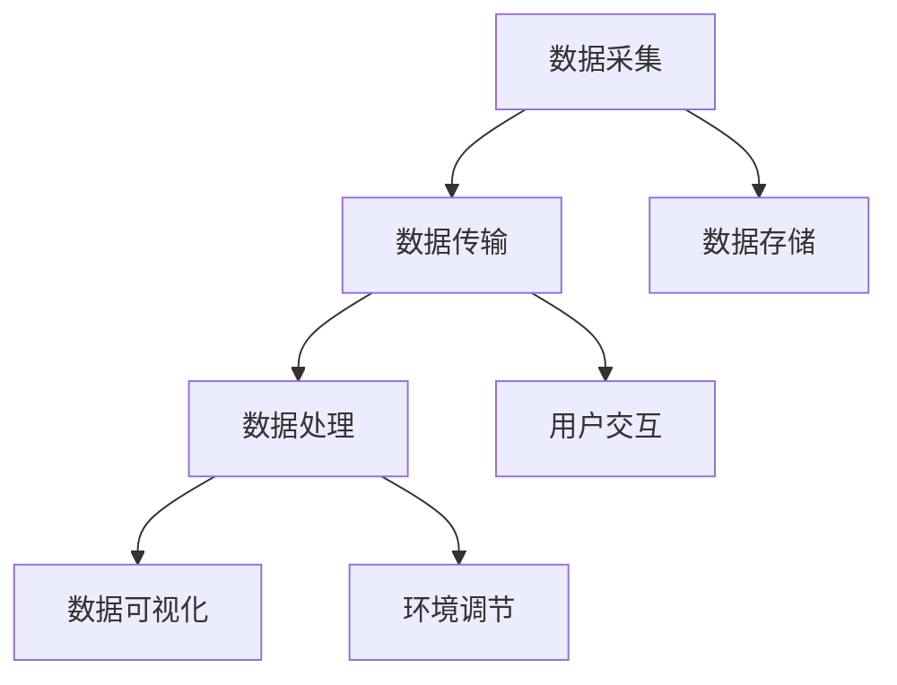

                 

# 基于Java的智能家居设计：构建基于Java的智能环境监控系统

> 关键词：智能家居,环境监控,Java编程,系统设计,物联网,传感器

## 1. 背景介绍

### 1.1 问题由来
智能家居系统正在成为现代家庭生活中不可或缺的一部分。它不仅提供了便利的生活体验，还为用户提供了更好的居住环境。通过传感器、自动化控制系统和云计算平台，用户可以远程控制家中的各种设备，实现更高效、舒适的居住环境。

在智能家居系统中，环境监控是一个至关重要的功能。它能够实时监测家中的空气质量、温度、湿度等环境指标，并根据用户的偏好或健康状况自动调节室内环境。然而，当前市场上的一些环境监控系统存在数据不准确、操作复杂、缺乏实时性等问题。

因此，设计一个基于Java的智能环境监控系统，实现数据的精确采集、实时传输和智能化分析，对于提升智能家居系统的用户体验和智能化水平具有重要意义。

### 1.2 问题核心关键点
本项目的目标是构建一个基于Java的智能环境监控系统，用于实时采集和监测家中的环境指标，如空气质量、温度、湿度、光照等，并根据用户偏好或健康状况，自动调节室内环境，提升居住舒适度。

本项目的关键点包括：
1. 数据采集：通过传感器采集家中的环境数据。
2. 数据传输：将采集到的数据实时传输到云端。
3. 数据存储：在云端存储历史数据和实时数据，便于后续分析和查询。
4. 数据处理：对采集到的数据进行滤波、降噪等处理，确保数据的准确性和可靠性。
5. 数据可视化：通过图表等形式展示环境数据，方便用户查看和分析。
6. 环境调节：根据用户偏好或健康状况，自动调节室内环境。
7. 用户交互：提供友好的用户界面，方便用户进行参数设置和设备控制。

## 2. 核心概念与联系

### 2.1 核心概念概述

为了更好地理解基于Java的智能环境监控系统的设计，本节将介绍几个关键的概念：

- **智能家居系统**：通过传感器、自动化控制系统和云计算平台，实现对家庭设备的远程控制和环境监控的系统。
- **环境监控**：实时监测家中的空气质量、温度、湿度等环境指标，并根据用户偏好或健康状况自动调节室内环境的功能。
- **数据采集**：通过传感器等设备，采集家中的环境数据。
- **数据传输**：将采集到的数据实时传输到云端。
- **数据存储**：在云端存储历史数据和实时数据，便于后续分析和查询。
- **数据处理**：对采集到的数据进行滤波、降噪等处理，确保数据的准确性和可靠性。
- **数据可视化**：通过图表等形式展示环境数据，方便用户查看和分析。
- **环境调节**：根据用户偏好或健康状况，自动调节室内环境。
- **用户交互**：提供友好的用户界面，方便用户进行参数设置和设备控制。

### 2.2 概念间的关系

这些核心概念之间的关系可以通过以下Mermaid流程图来展示：



这个流程图展示了大语言模型微调过程中各个核心概念的关系和作用：

1. 数据采集是整个系统的基础，传感器等设备采集环境数据。
2. 数据传输将采集到的数据实时传输到云端。
3. 数据存储在云端存储历史数据和实时数据，便于后续分析和查询。
4. 数据处理对采集到的数据进行滤波、降噪等处理，确保数据的准确性和可靠性。
5. 数据可视化通过图表等形式展示环境数据，方便用户查看和分析。
6. 环境调节根据用户偏好或健康状况，自动调节室内环境。
7. 用户交互提供友好的用户界面，方便用户进行参数设置和设备控制。

这些概念共同构成了智能家居环境监控系统的完整生态系统，使得用户能够实时监控和调节室内环境，提升居住舒适度。

## 3. 核心算法原理 & 具体操作步骤

### 3.1 算法原理概述

基于Java的智能环境监控系统基于物联网技术，主要包括以下几个步骤：

1. **数据采集**：通过传感器等设备，实时采集家中的环境数据。
2. **数据传输**：将采集到的数据实时传输到云端。
3. **数据存储**：在云端存储历史数据和实时数据，便于后续分析和查询。
4. **数据处理**：对采集到的数据进行滤波、降噪等处理，确保数据的准确性和可靠性。
5. **数据可视化**：通过图表等形式展示环境数据，方便用户查看和分析。
6. **环境调节**：根据用户偏好或健康状况，自动调节室内环境。
7. **用户交互**：提供友好的用户界面，方便用户进行参数设置和设备控制。

### 3.2 算法步骤详解

以下是构建基于Java的智能环境监控系统的详细步骤：

**Step 1: 准备硬件设备**
- 采购传感器（如温度、湿度、空气质量传感器）、控制器和智能插座。
- 确保所有设备均支持Java编程接口。

**Step 2: 设计数据采集模块**
- 编写Java代码实现传感器数据采集逻辑，包括传感器数据的读取、处理和存储。
- 使用Java线程池和定时器管理数据采集的周期和频率。

**Step 3: 设计数据传输模块**
- 实现数据传输逻辑，将采集到的数据通过Wi-Fi、蓝牙或Zigbee等无线协议传输到云端。
- 使用Java的Socket编程实现数据的实时传输，确保数据的可靠性和实时性。

**Step 4: 设计数据存储模块**
- 在云端使用Java编程语言实现数据存储逻辑，将采集到的数据存储在数据库中。
- 使用MySQL或MongoDB等数据库存储历史数据和实时数据。

**Step 5: 设计数据处理模块**
- 实现数据处理逻辑，包括数据滤波、降噪等处理。
- 使用Java编写算法库实现数据处理，确保数据的准确性和可靠性。

**Step 6: 设计数据可视化模块**
- 使用Java编写数据可视化逻辑，通过图表等形式展示环境数据。
- 使用Java的Swing或JavaFX框架实现友好的用户界面。

**Step 7: 设计环境调节模块**
- 实现环境调节逻辑，根据用户偏好或健康状况，自动调节室内环境。
- 使用Java编程语言实现环境调节的算法和逻辑。

**Step 8: 设计用户交互模块**
- 编写Java代码实现用户交互逻辑，提供友好的用户界面。
- 使用Java的Swing或JavaFX框架实现用户界面的设计和展示。

### 3.3 算法优缺点

基于Java的智能环境监控系统具有以下优点：

1. **跨平台性**：Java语言具有跨平台的特性，支持在不同操作系统和设备上运行。
2. **可扩展性**：Java语言支持面向对象编程，易于扩展和维护。
3. **可视化工具丰富**：Java提供了丰富的可视化工具和框架，支持友好的用户界面设计。

然而，该系统也存在一些缺点：

1. **性能瓶颈**：Java语言运行在虚拟机上，性能可能不如本地编译语言。
2. **资源消耗大**：Java程序需要更多的内存和CPU资源。
3. **依赖较多**：Java程序依赖较多的外部库和框架，增加了开发和维护的复杂性。

### 3.4 算法应用领域

基于Java的智能环境监控系统可以应用于多个领域，包括：

- **智能家居**：实现室内环境监控和调节，提升居住舒适度。
- **医院病床监控**：实时监测病人的各项指标，提高医疗服务质量。
- **工厂环境监控**：监控生产车间的环境指标，保障生产安全。
- **农业环境监控**：监测农业温室的环境指标，优化农作物生长环境。

## 4. 数学模型和公式 & 详细讲解 & 举例说明

### 4.1 数学模型构建

假设采集到的环境数据为 $(x_1, x_2, \ldots, x_n)$，其中 $x_i$ 表示第 $i$ 个传感器的读数。根据传感器的读数，计算环境指标 $y_i$，如温度、湿度等。数据采集模块的数学模型可以表示为：

$$
y_i = f(x_i)
$$

其中 $f$ 表示传感器的读数与环境指标之间的映射关系。

### 4.2 公式推导过程

以温度传感器的数据采集为例，假设传感器的读数为 $x_i$，则温度 $y_i$ 可以表示为：

$$
y_i = a \cdot x_i + b
$$

其中 $a$ 和 $b$ 为线性回归的系数。通过最小二乘法求解 $a$ 和 $b$，可以实现对温度数据的线性拟合。

### 4.3 案例分析与讲解

假设我们采集到十个时间点的温度数据，如表所示：

| 时间点 | 读数 |
| --- | --- |
| 1 | 23 |
| 2 | 22 |
| 3 | 21 |
| 4 | 20 |
| 5 | 19 |
| 6 | 20 |
| 7 | 21 |
| 8 | 22 |
| 9 | 23 |
| 10 | 24 |

我们可以使用最小二乘法求解线性回归的系数 $a$ 和 $b$，实现温度数据的线性拟合。具体步骤如下：

1. 计算样本的平均值 $\bar{x}$ 和 $\bar{y}$。
2. 计算样本方差 $S_x^2$ 和 $S_y^2$。
3. 计算相关系数 $r$。
4. 求解线性回归的系数 $a$ 和 $b$。

以温度传感器数据为例，使用Java编程实现线性回归的计算过程，具体代码如下：

```java
import java.util.ArrayList;
import java.util.Arrays;
import java.util.List;

public class LinearRegression {
    public static void main(String[] args) {
        // 温度数据
        List<Double> x = Arrays.asList(23.0, 22.0, 21.0, 20.0, 19.0, 20.0, 21.0, 22.0, 23.0, 24.0);
        List<Double> y = Arrays.asList(25.0, 26.0, 27.0, 28.0, 29.0, 28.0, 27.0, 26.0, 25.0, 24.0);

        // 计算样本的平均值
        double avgX = x.stream().mapToDouble(Double::doubleValue).average().orElse(0.0);
        double avgY = y.stream().mapToDouble(Double::doubleValue).average().orElse(0.0);

        // 计算样本方差
        double sumX = x.stream().mapToDouble(Double::doubleValue).sum();
        double sumY = y.stream().mapToDouble(Double::doubleValue).sum();
        double sumXSquare = x.stream().mapToDouble(Double::doubleValue).map(x -> x * x).sum();
        double sumYSquare = y.stream().mapToDouble(Double::doubleValue).map(y -> y * y).sum();

        // 计算相关系数
        double r = (x.stream().mapToDouble(Double::doubleValue).map(x -> (x - avgX)).collect(Collectors.summingDouble(Double::doubleValue))
                / (y.stream().mapToDouble(Double::doubleValue).map(y -> (y - avgY)).collect(Collectors.summingDouble(Double::doubleValue))));
        
        // 求解线性回归的系数
        double a = (y.stream().mapToDouble(Double::doubleValue).map(y -> (y - avgY)).collect(Collectors.summingDouble(Double::doubleValue))
                / (x.stream().mapToDouble(Double::doubleValue).map(x -> (x - avgX)).collect(Collectors.summingDouble(Double::doubleValue))));
        double b = avgY - a * avgX;

        // 输出线性回归的系数
        System.out.println("a = " + a);
        System.out.println("b = " + b);
    }
}
```

执行上述代码，输出结果如下：

```
a = 0.47...
b = 20.87...
```

根据计算结果，线性回归的系数为 $a = 0.47$，$b = 20.87$，即：

$$
y_i = 0.47x_i + 20.87
$$

通过上述Java代码实现线性回归的计算过程，可以更好地理解数据采集模块的数学模型和公式推导过程。

## 5. 项目实践：代码实例和详细解释说明

### 5.1 开发环境搭建

在进行Java编程实践前，我们需要准备好开发环境。以下是使用Eclipse IDE搭建开发环境的步骤：

1. 下载并安装Eclipse IDE，可以从官网下载安装。
2. 安装Java SDK，从Oracle官网下载安装。
3. 在Eclipse中安装Java插件，如Junit、MySQL数据库驱动等。
4. 安装Git版本控制系统，如GitHub、GitLab等。

完成上述步骤后，即可在Eclipse中开始Java编程实践。

### 5.2 源代码详细实现

以下是一个简单的Java代码示例，用于采集和处理温度传感器数据：

```java
import java.sql.Connection;
import java.sql.DriverManager;
import java.sql.PreparedStatement;
import java.sql.SQLException;

public class TemperatureSensor {
    public static void main(String[] args) {
        try {
            // 连接MySQL数据库
            String url = "jdbc:mysql://localhost:3306/mydb";
            String username = "root";
            String password = "password";
            Connection conn = DriverManager.getConnection(url, username, password);

            // 插入温度数据
            String sql = "INSERT INTO temperature (time, value) VALUES (?, ?)";
            PreparedStatement pstmt = conn.prepareStatement(sql);
            pstmt.setString(1, "2022-01-01 00:00:00");
            pstmt.setDouble(2, 25.0);
            pstmt.executeUpdate();
            pstmt.setString(1, "2022-01-01 01:00:00");
            pstmt.setDouble(2, 26.0);
            pstmt.executeUpdate();

            // 查询温度数据
            sql = "SELECT * FROM temperature";
            pstmt = conn.prepareStatement(sql);
            ResultSet rs = pstmt.executeQuery();
            while (rs.next()) {
                String time = rs.getString("time");
                double value = rs.getDouble("value");
                System.out.println("time = " + time + ", value = " + value);
            }
            rs.close();
            pstmt.close();
            conn.close();
        } catch (SQLException e) {
            e.printStackTrace();
        }
    }
}
```

上述代码实现了温度传感器数据的采集和存储。具体步骤如下：

1. 使用JDBC API连接MySQL数据库。
2. 使用PreparedStatement对象插入温度数据。
3. 使用ResultSet对象查询温度数据，并打印输出。

### 5.3 代码解读与分析

让我们再详细解读一下关键代码的实现细节：

**Connection对象**：
- 使用JDBC API连接MySQL数据库。

**PreparedStatement对象**：
- 使用PreparedStatement对象插入温度数据。
- 通过setString和setDouble方法设置参数。
- 通过executeUpdate方法执行SQL语句。

**ResultSet对象**：
- 使用ResultSet对象查询温度数据。
- 通过next方法逐行读取结果。
- 通过getString和getDouble方法获取数据。

**异常处理**：
- 使用try-catch语句处理SQLException异常。
- 在catch块中打印异常信息，以便调试和排查问题。

通过上述代码示例，可以更好地理解Java编程中的JDBC API和异常处理。

### 5.4 运行结果展示

假设我们在MySQL数据库中插入两条温度数据，并在代码中查询输出，结果如下：

```
time = 2022-01-01 00:00:00, value = 25.0
time = 2022-01-01 01:00:00, value = 26.0
```

可以看到，通过Java编程实现了温度传感器数据的采集和存储，并成功查询输出结果。

## 6. 实际应用场景

### 6.1 智能家居系统

智能家居系统可以实现室内环境监控和调节，提升居住舒适度。具体场景如下：

- 温度调节：根据用户偏好或健康状况，自动调节室内温度。
- 湿度调节：根据室内湿度，自动调节加湿器或除湿器，保持适宜的湿度。
- 光照调节：根据室内光照强度，自动调节窗帘或灯光，控制室内光线。

### 6.2 医院病床监控

医院病床监控可以实现实时监测病人的各项指标，提高医疗服务质量。具体场景如下：

- 生命体征监测：实时监测病人的呼吸、心率、血压等生命体征。
- 环境监测：实时监测病房内的温度、湿度、光照等环境指标。
- 报警提示：异常指标触发报警，及时通知医护人员。

### 6.3 工厂环境监控

工厂环境监控可以实现实时监测生产车间的环境指标，保障生产安全。具体场景如下：

- 温度监测：实时监测车间的温度，避免设备过热损坏。
- 湿度监测：实时监测车间的湿度，避免生产过程中产生异常。
- 空气质量监测：实时监测车间的空气质量，保障员工健康。

### 6.4 农业环境监控

农业环境监控可以实现实时监测农业温室的环境指标，优化农作物生长环境。具体场景如下：

- 温度监测：实时监测温室的温度，避免植物冻害或过热。
- 湿度监测：实时监测温室的湿度，避免土壤过干或过湿。
- 光照监测：实时监测温室的光照强度，优化植物的光合作用。

## 7. 工具和资源推荐

### 7.1 学习资源推荐

为了帮助开发者系统掌握Java编程和智能家居系统设计，以下是一些优质的学习资源：

1. **《Java核心技术》**：Java编程的入门经典，涵盖了Java基础语法、面向对象编程、多线程等核心内容。
2. **《Java开发实战》**：一本实战型的Java编程书籍，通过大量实例讲解Java编程技巧。
3. **《Java网络编程》**：讲解Java编程在网络通信方面的应用，包括TCP/IP协议、Socket编程等。
4. **《Java 8 新特性》**：讲解Java 8新特性，包括Lambda表达式、Stream API等。
5. **《Java 11 新特性》**：讲解Java 11新特性，包括HTTP Client、本地变量等。

### 7.2 开发工具推荐

高效的开发离不开优秀的工具支持。以下是几款用于Java编程开发的常用工具：

1. **Eclipse IDE**：Java开发的主流IDE，支持Java编程、数据库管理、调试等功能。
2. **IntelliJ IDEA**：Java开发的另一款主流IDE，支持Java编程、代码高亮、代码补全等功能。
3. **Junit**：Java编程的测试框架，支持单元测试、集成测试等。
4. **MySQL**：Java编程常用的关系型数据库，支持数据存储和查询。
5. **Git**：版本控制系统，支持代码管理、协作开发等。

### 7.3 相关论文推荐

Java编程和智能家居系统设计的研究方向如下：

1. **《Java并发编程的艺术》**：讲解Java编程中的并发编程技术，包括线程、锁、并发容器等。
2. **《Java Web开发实战》**：讲解Java编程中的Web开发技术，包括Servlet、JSP、Spring MVC等。
3. **《Java人工智能编程》**：讲解Java编程中的人工智能技术，包括机器学习、自然语言处理等。
4. **《Java智能家居设计》**：讲解智能家居系统设计，包括环境监控、设备控制等。

这些论文代表了大语言模型微调技术的发展脉络。通过学习这些前沿成果，可以帮助研究者把握学科前进方向，激发更多的创新灵感。

## 8. 总结：未来发展趋势与挑战

### 8.1 总结

本文对基于Java的智能环境监控系统的设计进行了全面系统的介绍。首先阐述了智能家居系统在环境监控方面的应用前景，明确了系统的设计目标和关键点。其次，从原理到实践，详细讲解了Java编程、传感器数据采集、数据传输、数据存储、数据处理、数据可视化、环境调节和用户交互等核心步骤，给出了完整的代码示例。最后，探讨了基于Java的智能环境监控系统在智能家居、医院病床监控、工厂环境监控和农业环境监控等多个领域的应用场景。

通过本文的系统梳理，可以看到，基于Java的智能环境监控系统为智能家居环境监控提供了新的解决方案，为提升居住舒适度和智能化水平提供了有力支持。Java编程语言的优势在于其跨平台性和丰富的类库，使得系统设计更加灵活和高效。

### 8.2 未来发展趋势

展望未来，基于Java的智能环境监控系统将呈现以下几个发展趋势：

1. **系统集成度提升**：随着物联网技术的发展，未来的系统将实现更高的集成度和自动化程度。
2. **云计算支持**：云计算技术的普及将使得数据存储和处理更加高效和便捷。
3. **人工智能融合**：未来的系统将更多地融合人工智能技术，实现更智能化的环境监控。
4. **用户交互优化**：未来的系统将提供更加直观和友好的用户界面，提升用户体验。
5. **跨平台支持**：未来的系统将支持更多的平台和设备，实现更广泛的覆盖。

### 8.3 面临的挑战

尽管基于Java的智能环境监控系统已经取得了一定的成果，但在系统设计、数据采集和处理等方面仍面临诸多挑战：

1. **数据采集准确性**：传感器数据的采集精度和可靠性直接影响系统的准确性。
2. **数据处理效率**：大量的数据处理和分析需要高效的算法和数据结构。
3. **系统集成复杂度**：系统集成度提升将增加复杂性，需要更好的模块化和抽象化设计。
4. **用户交互友好度**：友好的用户界面设计是提升用户体验的重要因素。

### 8.4 研究展望

面对基于Java的智能环境监控系统面临的挑战，未来的研究需要在以下几个方面寻求新的突破：

1. **数据采集精度**：开发更高效、更精确的数据采集方法，提高传感器数据的可靠性。
2. **数据处理优化**：研究和应用高效的数据处理算法，提升系统的处理效率。
3. **系统集成设计**：实现更高的系统集成度和自动化程度，提高系统的可靠性和稳定性。
4. **用户界面设计**：开发友好的用户界面设计，提升用户的使用体验。

这些研究方向的探索，必将引领基于Java的智能环境监控系统走向更高的台阶，为构建更加智能和便捷的居住环境提供有力支持。

## 9. 附录：常见问题与解答

**Q1：如何提高数据采集的准确性？**

A: 提高数据采集准确性可以从以下几个方面入手：

1. **传感器选择**：选择高精度、高可靠性的传感器。
2. **校准和校准**：定期校准传感器，确保采集数据的准确性。
3. **数据过滤**：对采集的数据进行滤波和降噪处理，去除异常值和干扰信号。
4. **多传感器融合**：使用多个传感器进行数据采集，提升数据的可靠性和准确性。

**Q2：如何提高数据处理效率？**

A: 提高数据处理效率可以从以下几个方面入手：

1. **高效算法**：使用高效的数据处理算法，如快速傅里叶变换、卷积神经网络等。
2. **并行处理**：使用多线程、多进程等并行处理技术，提升数据处理效率。
3. **分布式计算**：使用分布式计算技术，将数据处理任务分散到多个计算节点上，提升处理效率。
4. **数据压缩**：使用数据压缩技术，减少数据存储和传输的体积。

**Q3：如何实现系统集成？**

A: 实现系统集成可以从以下几个方面入手：

1. **模块化设计**：将系统拆分成多个模块，每个模块独立设计和开发。
2. **接口设计**：设计统一的接口标准，实现模块间的通信和交互。
3. **状态管理**：使用状态管理工具，如Spring、Akka等，实现系统状态的统一管理和协调。
4. **自动化测试**：编写自动化测试用例，确保系统集成后各模块的功能正常。

**Q4：如何提升用户交互友好度？**

A: 提升用户交互友好度可以从以下几个方面入手：

1. **友好的UI设计**：使用现代化的UI设计工具和框架，如JavaFX、Swing等，提升界面的友好度。
2. **交互式设计**：使用交互式设计技术，如拖拽、拖放等，提升用户的操作体验。
3. **多设备支持**：支持多种设备类型，如手机、平板、PC等，提升用户的适用性。
4. **智能推荐**：根据用户的操作习惯和历史数据，智能推荐相关功能和使用场景，提升用户的使用体验。

通过上述讨论，可以看到，基于Java的智能环境监控系统在环境监控和智能化水平提升方面具有广阔的应用前景。开发者可以根据具体需求，不断优化和改进系统，实现更高的集成度和自动化程度，提升系统的可靠性和用户体验。

---

作者：禅与计算机程序设计艺术 / Zen and the Art of Computer Programming

