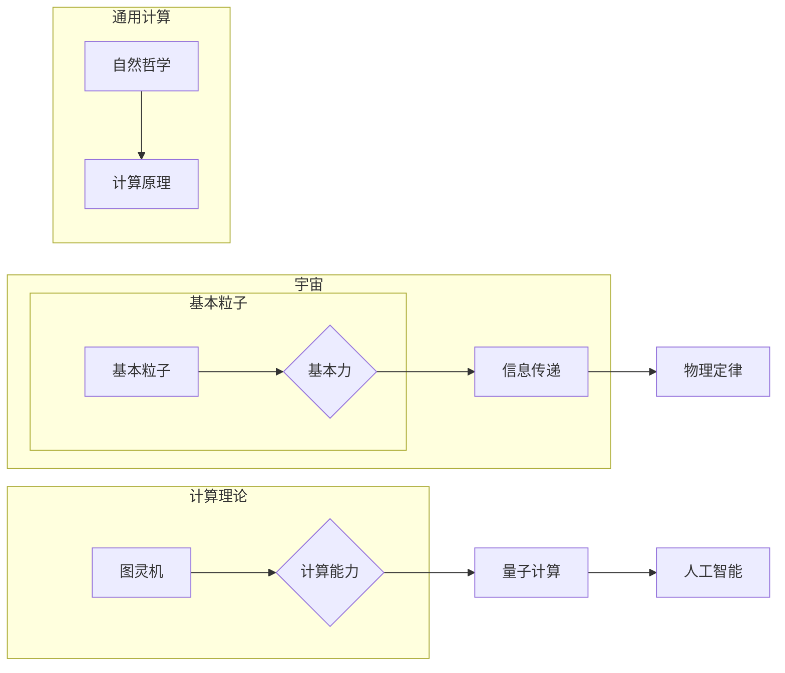

# 计算：第四部分 计算的极限 第 13 章 自然哲学的计算原理 宇宙是一台计算机吗

> 关键词：自然哲学，计算原理，宇宙模拟，量子计算，人工智能，通用计算，图灵机

## 1. 背景介绍

从古希腊的亚里士多德到现代的霍金，人类始终在探索宇宙的本质。随着科技的进步，我们开始将宇宙与计算的概念联系起来，思考是否宇宙本身就是一个巨大的计算系统。本章将探讨自然哲学的计算原理，并探讨宇宙是否可以被视为一台计算机。

### 1.1 宇宙与计算的相似性

宇宙的复杂性、可预测性和规律性，使得许多人开始将宇宙视为一个计算系统。以下是宇宙与计算的一些相似之处：

- **无限可分**：宇宙由无数的基本粒子组成，每个粒子都可以被视为计算的基本单元。
- **信息传递**：宇宙中的粒子通过引力、电磁力等基本力进行相互作用，这些相互作用可以被视为信息的传递。
- **规律性**：宇宙遵循一定的物理定律，这些定律可以被视为计算过程中的规则。

### 1.2 自然哲学的计算原理

自然哲学的计算原理探讨宇宙中的计算过程及其背后的哲学意义。以下是一些关键概念：

- **图灵机**：图灵机是现代计算理论的基础，它定义了一切可计算问题。
- **量子计算**：量子计算利用量子位进行计算，具有超越经典计算的潜力。
- **人工智能**：人工智能模拟人类智能行为，可以被视为一种高级计算形式。

## 2. 核心概念与联系

### 2.1 核心概念原理和架构的 Mermaid 流程图



### 2.2 核心概念与联系

- **宇宙**：由基本粒子组成，通过基本力进行信息传递，遵循物理定律。
- **计算理论**：图灵机定义了一切可计算问题，量子计算和人工智能扩展了计算能力。
- **自然哲学**：研究宇宙中的计算原理，探索宇宙是否可以被视为一台计算机。

## 3. 核心算法原理 & 具体操作步骤

### 3.1 算法原理概述

宇宙的计算原理可以概括为以下步骤：

1. 基本粒子通过基本力进行相互作用，传递信息。
2. 这些信息遵循物理定律，形成规律性。
3. 通过模拟这些物理过程，可以构建宇宙的计算模型。

### 3.2 算法步骤详解

1. **定义基本粒子**：宇宙中的基本粒子是构成宇宙的基础单元，它们具有特定的属性和相互作用规则。
2. **定义基本力**：基本力包括引力、电磁力、强相互作用和弱相互作用，它们是宇宙中粒子之间相互作用的方式。
3. **信息传递**：粒子通过基本力传递信息，这些信息可以被视为计算过程中的数据。
4. **遵循物理定律**：宇宙中的信息传递遵循物理定律，如牛顿定律、麦克斯韦方程等。
5. **构建计算模型**：通过模拟基本粒子、基本力和物理定律，可以构建宇宙的计算模型。

### 3.3 算法优缺点

**优点**：

- **解释宇宙现象**：宇宙的计算原理可以解释宇宙中的各种现象，如行星运动、星系演化等。
- **预测未来**：通过计算模型，可以预测宇宙的未来发展。

**缺点**：

- **复杂性**：宇宙的计算模型非常复杂，难以理解和实现。
- **计算资源**：构建宇宙的计算模型需要庞大的计算资源。

### 3.4 算法应用领域

宇宙的计算原理在以下领域具有应用价值：

- **天体物理学**：通过计算模型，可以研究宇宙的起源、演化等。
- **量子计算**：宇宙的计算原理可以启发量子计算的发展。
- **人工智能**：宇宙的计算原理可以启发人工智能的发展。

## 4. 数学模型和公式 & 详细讲解 & 举例说明

### 4.1 数学模型构建

宇宙的计算模型可以构建为一个图灵机模型，其中基本粒子是图灵机的状态，基本力是图灵机的转移函数。

### 4.2 公式推导过程

宇宙的计算模型可以通过以下公式推导：

$$
\text{状态转换} = \text{当前状态} \xrightarrow{\text{转移函数}} \text{新状态}
$$

### 4.3 案例分析与讲解

以下是一个简单的宇宙计算模型示例：

- **基本粒子**：原子核、质子、中子
- **基本力**：电磁力
- **物理定律**：库仑定律

在这个模型中，原子核、质子和中子通过电磁力相互作用，形成稳定的原子结构。

## 5. 项目实践：代码实例和详细解释说明

### 5.1 开发环境搭建

由于宇宙计算模型的复杂性，我们无法在这里提供一个具体的代码实例。但是，我们可以使用Python编写一个简单的图灵机模拟器，以展示计算原理的基本概念。

### 5.2 源代码详细实现

以下是一个简单的图灵机模拟器代码：

```python
class TuringMachine:
    def __init__(self, tape, state):
        self.tape = tape
        self.state = state
        self.head = 0

    def step(self, transition_table):
        current_symbol = self.tape[self.head]
        next_state, move, write_symbol = transition_table[self.state][current_symbol]
        self.state = next_state
        self.tape[self.head] = write_symbol
        self.head += move

# 定义转移函数
transition_table = {
    'q0': {'0': ('q1', 'R', '1'), '1': ('q1', 'R', '0')},
    'q1': {'0': ('q2', 'R', '0'), '1': ('q2', 'R', '1')},
    'q2': {'0': ('q0', 'R', '1'), '1': ('q0', 'R', '0')}
}

# 初始化图灵机
tape = ['0', '1', '0', '1']
state = 'q0'
machine = TuringMachine(tape, state)

# 执行计算过程
while machine.state != 'q2':
    machine.step(transition_table)

print(f"Final tape: {machine.tape}")
```

### 5.3 代码解读与分析

这个简单的图灵机模拟器包含以下几个部分：

- `TuringMachine` 类：定义了图灵机的状态、带子、头指针等属性，以及执行计算步骤的 `step` 方法。
- `transition_table`：定义了图灵机的转移函数，包括状态、符号和移动方向。
- 初始化图灵机：设置初始带子和状态。
- 执行计算过程：通过循环调用 `step` 方法，直到达到终止状态。

这个示例演示了图灵机的基本原理，以及如何使用Python实现简单的计算过程。

## 6. 实际应用场景

宇宙的计算原理在以下实际应用场景中具有价值：

- **量子计算**：宇宙的计算原理可以启发量子计算的发展，帮助科学家理解量子位的工作原理。
- **人工智能**：宇宙的计算原理可以启发人工智能的发展，帮助开发者设计更智能的算法。
- **天体物理学**：宇宙的计算原理可以帮助科学家研究宇宙的起源、演化和未来。

### 6.4 未来应用展望

随着计算技术的不断发展，宇宙的计算原理将在以下方面发挥重要作用：

- **构建更强大的计算模型**：宇宙的计算原理可以帮助科学家构建更强大的计算模型，以研究更复杂的科学问题。
- **推动人工智能发展**：宇宙的计算原理可以帮助开发者设计更智能的算法，推动人工智能的发展。
- **探索宇宙奥秘**：宇宙的计算原理可以帮助科学家更好地理解宇宙的本质，探索宇宙的奥秘。

## 7. 工具和资源推荐

### 7.1 学习资源推荐

- 《计算机科学的本质》：这本书深入探讨了计算机科学的基本原理，包括计算理论、算法和复杂性理论。
- 《自然哲学的数学基础》：这本书介绍了自然哲学中的数学基础，包括数学逻辑、集合论和概率论。
- 《量子计算》：这本书介绍了量子计算的基本原理和应用。

### 7.2 开发工具推荐

- **Python**：Python是一种易于学习和使用的编程语言，适合进行计算模型开发和模拟。
- **NumPy**：NumPy是一个强大的科学计算库，提供了丰富的数学函数和数据分析工具。
- **SciPy**：SciPy是一个开源的科学计算库，提供了丰富的科学计算功能，如数值积分、优化和线性代数。

### 7.3 相关论文推荐

- **"The Physical Limits of Computation" by Stephen Hawking**：这篇论文探讨了宇宙的物理极限，包括计算和信息的概念。
- **"Quantum Computation and Quantum Information" by Michael A. Nielsen and Isaac L. Chuang**：这本书介绍了量子计算的基本原理和应用。
- **"The Nature of Computation" by Christos H. Papadimitriou**：这本书探讨了计算的本质，包括图灵机和可计算性问题。

## 8. 总结：未来发展趋势与挑战

### 8.1 研究成果总结

本章探讨了自然哲学的计算原理，并探讨了宇宙是否可以被视为一台计算机。我们介绍了宇宙与计算的相似性、自然哲学的计算原理、核心算法原理、数学模型和公式、项目实践以及实际应用场景。

### 8.2 未来发展趋势

随着计算技术的不断发展，宇宙的计算原理将在以下方面发挥重要作用：

- **构建更强大的计算模型**：宇宙的计算原理可以帮助科学家构建更强大的计算模型，以研究更复杂的科学问题。
- **推动人工智能发展**：宇宙的计算原理可以帮助开发者设计更智能的算法，推动人工智能的发展。
- **探索宇宙奥秘**：宇宙的计算原理可以帮助科学家更好地理解宇宙的本质，探索宇宙的奥秘。

### 8.3 面临的挑战

在探索宇宙的计算原理的过程中，我们面临着以下挑战：

- **复杂性**：宇宙的计算模型非常复杂，难以理解和实现。
- **计算资源**：构建宇宙的计算模型需要庞大的计算资源。
- **理论基础**：宇宙的计算原理需要进一步的理论基础支持。

### 8.4 研究展望

未来，我们将继续探索宇宙的计算原理，并努力克服面临的挑战。我们相信，随着计算技术的不断进步，宇宙的计算原理将为人类带来更多惊喜。

## 9. 附录：常见问题与解答

**Q1：宇宙的计算原理是什么？**

A：宇宙的计算原理探讨宇宙中的计算过程及其背后的哲学意义，包括基本粒子、基本力、信息传递、物理定律等。

**Q2：宇宙是否可以被视为一台计算机？**

A：目前，我们无法完全确定宇宙是否可以被视为一台计算机。但是，宇宙与计算具有一些相似之处，如无限可分、信息传递和规律性等。

**Q3：宇宙的计算原理有哪些应用价值？**

A：宇宙的计算原理在量子计算、人工智能和天体物理学等领域具有应用价值。

**Q4：如何克服探索宇宙计算原理面临的挑战？**

A：我们需要继续发展计算技术，深入研究理论基础，并克服计算资源等挑战。

作者：禅与计算机程序设计艺术 / Zen and the Art of Computer Programming