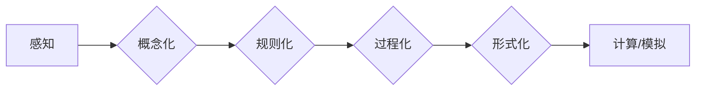

# 认知的形式化：时间对于机器的认知至关重要

> 关键词：认知形式化，时间感知，机器学习，人工智能，时序数据，智能体，时间序列分析

## 1. 背景介绍

在人工智能和机器学习领域，认知的形式化是指将人类认知过程中的概念、规则和过程转化为可计算、可模拟的形式。这种转化不仅有助于我们理解认知的本质，也为人工智能的发展提供了新的方向。在这其中，时间感知成为了认知形式化中的一个关键要素。时间对于机器的认知至关重要，因为它涉及到如何让机器理解和处理时序数据，以及如何模拟智能体在时间维度上的行为和决策。

### 1.1 问题的由来

随着数据量的爆炸式增长，时序数据在各个领域都得到了广泛应用。从金融市场到交通流量，从生物医学到自然语言处理，时序数据的分析变得越来越重要。然而，传统机器学习方法往往缺乏对时间序列数据中时间信息的有效处理能力。这导致了许多基于时序数据的任务，如时间序列预测、序列标注、事件序列分类等，难以得到满意的结果。

### 1.2 研究现状

近年来，随着深度学习技术的快速发展，涌现出许多专门针对时序数据处理的模型和方法。这些方法主要可以分为以下几类：

- **时序模型（Temporal Models）**：如循环神经网络（RNN）、长短期记忆网络（LSTM）和门控循环单元（GRU），它们能够捕捉序列数据中的时间依赖关系。
- **注意力机制（Attention Mechanisms）**：通过注意力机制，模型可以专注于序列数据中的关键信息，从而提高对时间序列数据的理解能力。
- **图神经网络（Graph Neural Networks, GNNs）**：通过构建序列数据之间的关系图，GNNs能够捕捉序列中更复杂的时间依赖关系。
- **Transformer架构**：Transformer架构在自然语言处理领域取得了巨大成功，其基于自注意力机制的编码器-解码器结构也被应用于时序数据处理。

### 1.3 研究意义

时间感知在认知形式化中的重要性体现在以下几个方面：

- **提高机器学习模型的性能**：通过引入时间信息，模型能够更好地理解和处理时序数据，从而提高预测和分类的准确性。
- **模拟智能体的行为**：时间感知使得机器能够模拟人类在时间维度上的行为和决策过程，从而在机器人学、游戏AI等领域得到应用。
- **促进认知科学研究**：通过形式化地描述时间感知过程，有助于我们更好地理解人类认知的本质。

### 1.4 本文结构

本文将围绕认知的形式化，探讨时间对于机器认知的重要性。文章结构如下：

- 第2部分，介绍认知形式化和时间感知的相关概念。
- 第3部分，阐述时间感知在机器学习中的应用，包括时序模型、注意力机制、GNNs和Transformer架构。
- 第4部分，分析时间感知在数学模型和公式中的应用，并举例说明。
- 第5部分，给出时间感知在机器学习中的代码实例，并对关键代码进行解读。
- 第6部分，探讨时间感知在各个领域的实际应用场景。
- 第7部分，展望时间感知的未来发展趋势和挑战。
- 第8部分，总结全文，并对研究展望进行讨论。

## 2. 核心概念与联系

### 2.1 认知形式化

认知形式化是指将人类认知过程中的概念、规则和过程转化为可计算、可模拟的形式。这包括以下几个方面：

- **概念形式化**：将人类认知中的概念转化为可计算的实体，如数字、符号、图等。
- **规则形式化**：将人类认知中的规则转化为可执行的算法，如逻辑推理、模式识别等。
- **过程形式化**：将人类认知过程中的步骤转化为可模拟的流程，如决策树、图灵机等。

### 2.2 时间感知

时间感知是指智能体对时间流逝的感知和利用。它包括以下几个方面：

- **时间测量**：智能体能够测量时间的流逝，如时钟、日历等。
- **时间预测**：智能体能够预测未来的时间点，如天气预报、日程安排等。
- **时间规划**：智能体能够根据时间信息进行决策，如旅行规划、任务分配等。

### 2.3 Mermaid 流程图

以下是一个简化的认知形式化流程图，展示了认知形式化的基本过程：



## 3. 核心算法原理 & 具体操作步骤

### 3.1 算法原理概述

时间感知在机器学习中的应用主要包括以下几种算法：

- **时序模型**：如RNN、LSTM和GRU，它们通过循环神经网络结构捕捉序列数据中的时间依赖关系。
- **注意力机制**：通过注意力机制，模型可以关注序列数据中的关键信息，从而提高对时间序列数据的理解能力。
- **图神经网络**：通过构建序列数据之间的关系图，GNNs能够捕捉序列中更复杂的时间依赖关系。
- **Transformer架构**：Transformer架构的编码器-解码器结构能够捕捉序列数据中的长距离依赖关系。

### 3.2 算法步骤详解

#### 3.2.1 时序模型

时序模型的步骤如下：

1. 定义输入序列 $X = [x_1, x_2, ..., x_T]$，其中 $T$ 是序列长度，$x_t$ 是第 $t$ 个时间步的输入数据。
2. 定义隐藏状态 $h_t = f(h_{t-1}, x_t)$，其中 $h_0$ 是初始隐藏状态。
3. 定义输出序列 $Y = [y_1, y_2, ..., y_T]$，其中 $y_t = g(h_t)$。
4. 使用损失函数 $L$ 计算模型预测输出与真实标签之间的差异，并使用梯度下降算法更新模型参数。

#### 3.2.2 注意力机制

注意力机制的步骤如下：

1. 定义注意力权重 $w_t = \sigma(W_a h_{t-1}, h_t)$，其中 $\sigma$ 是注意力函数，$W_a$ 是注意力权重矩阵。
2. 定义加权输出 $z_t = \sum_{i=1}^T w_t h_i$。
3. 使用加权输出 $z_t$ 作为下一时间步的输入。

#### 3.2.3 图神经网络

图神经网络的步骤如下：

1. 定义图结构 $G = (V, E)$，其中 $V$ 是节点集合，$E$ 是边集合。
2. 定义节点表示 $h_v = f(h_{v-1}, X_v, \phi(h_u)_{u \in \text{neighbors}(v)})$，其中 $\text{neighbors}(v)$ 是节点 $v$ 的邻居节点集合，$\phi$ 是节点表示函数。
3. 使用节点表示 $h_v$ 进行预测。

#### 3.2.4 Transformer架构

Transformer架构的步骤如下：

1. 定义输入序列 $X = [x_1, x_2, ..., x_T]$。
2. 使用位置编码 $P_t$ 对输入序列进行位置编码，得到编码后的序列 $X' = [x_1', x_2', ..., x_T']$。
3. 使用多头自注意力机制 $M_t = \text{MultiHead\_Attention}(Q, K, V)$ 对编码后的序列进行处理。
4. 使用位置编码 $P_t$ 对多头自注意力机制的输出进行位置编码。
5. 使用前馈神经网络 $F_t = \text{FeedForwardNetwork}(M_t)$ 对编码后的序列进行处理。
6. 将多头自注意力机制的输出和前馈神经网络的输出相加，得到最终的输出序列 $Y'$。

### 3.3 算法优缺点

#### 3.3.1 时序模型

- **优点**：简单易实现，能够捕捉序列数据中的短期依赖关系。
- **缺点**：难以捕捉序列数据中的长期依赖关系，容易出现梯度消失或梯度爆炸的问题。

#### 3.3.2 注意力机制

- **优点**：能够捕捉序列数据中的关键信息，提高模型对时间序列数据的理解能力。
- **缺点**：计算复杂度高，对超参数的选择敏感。

#### 3.3.3 图神经网络

- **优点**：能够捕捉序列数据中的复杂关系，包括层次结构和动态关系。
- **缺点**：图结构的设计和参数调优比较困难。

#### 3.3.4 Transformer架构

- **优点**：能够捕捉序列数据中的长距离依赖关系，计算效率高。
- **缺点**：模型结构复杂，对超参数的选择敏感。

### 3.4 算法应用领域

时间感知在机器学习中的应用非常广泛，以下是一些典型的应用领域：

- **时间序列预测**：如股票价格预测、天气预报、电力负荷预测等。
- **序列标注**：如文本分类、命名实体识别、情感分析等。
- **事件序列分类**：如新闻分类、社交网络事件分类等。
- **自然语言处理**：如机器翻译、文本摘要、问答系统等。

## 4. 数学模型和公式 & 详细讲解 & 举例说明

### 4.1 数学模型构建

时间感知在机器学习中的数学模型主要包括以下几种：

- **时序模型**：如RNN、LSTM和GRU。
- **注意力机制**：如自注意力机制、多头自注意力机制等。
- **图神经网络**：如GCN、GAT等。
- **Transformer架构**：如编码器-解码器结构、多头自注意力机制等。

### 4.2 公式推导过程

#### 4.2.1 RNN

RNN的数学模型如下：

$$
h_t = f(h_{t-1}, x_t)
$$

其中 $h_t$ 是第 $t$ 个时间步的隐藏状态，$x_t$ 是第 $t$ 个时间步的输入数据，$f$ 是RNN的函数。

#### 4.2.2 注意力机制

自注意力机制的数学模型如下：

$$
w_t = \sigma(W_a h_{t-1}, h_t)
$$

其中 $w_t$ 是第 $t$ 个时间步的注意力权重，$\sigma$ 是注意力函数，$W_a$ 是注意力权重矩阵。

#### 4.2.3 图神经网络

GCN的数学模型如下：

$$
h_v = f(h_{v-1}, X_v, \phi(h_u)_{u \in \text{neighbors}(v)})
$$

其中 $h_v$ 是节点 $v$ 的节点表示，$X_v$ 是节点 $v$ 的特征，$\phi$ 是节点表示函数。

#### 4.2.4 Transformer架构

编码器-解码器结构的数学模型如下：

$$
Y' = \text{Add}(M_t, F_t)
$$

其中 $Y'$ 是最终的输出序列，$M_t$ 是多头自注意力机制的输出，$F_t$ 是前馈神经网络的输出。

### 4.3 案例分析与讲解

以下是一个时间序列预测的案例：

**问题描述**：预测某股票在未来三个时间步的价格。

**数据**：某股票最近三个月的收盘价，共计100个数据点。

**模型**：使用LSTM模型进行时间序列预测。

**步骤**：

1. 定义输入序列 $X = [x_1, x_2, ..., x_{99}]$。
2. 定义隐藏状态 $h_t = f(h_{t-1}, x_t)$。
3. 定义输出序列 $Y = [y_{100}, y_{101}, y_{102}]$。
4. 使用损失函数 $L$ 计算模型预测输出与真实标签之间的差异，并使用梯度下降算法更新模型参数。

通过训练和验证，模型能够预测出股票在未来三个时间步的价格。

## 5. 项目实践：代码实例和详细解释说明

### 5.1 开发环境搭建

为了进行时间感知在机器学习中的项目实践，我们需要搭建以下开发环境：

- **Python**：用于编写代码和数据处理。
- **PyTorch**：用于构建和训练机器学习模型。
- **NumPy**：用于数学计算和数据处理。

### 5.2 源代码详细实现

以下是一个使用PyTorch实现LSTM模型进行时间序列预测的代码示例：

```python
import torch
import torch.nn as nn

class LSTMModel(nn.Module):
    def __init__(self, input_dim, hidden_dim, output_dim):
        super(LSTMModel, self).__init__()
        self.lstm = nn.LSTM(input_dim, hidden_dim)
        self.linear = nn.Linear(hidden_dim, output_dim)

    def forward(self, x):
        output, (hn, cn) = self.lstm(x)
        out = self.linear(output[-1])
        return out

# 模型参数设置
input_dim = 1  # 输入维度
hidden_dim = 50  # 隐藏维度
output_dim = 1  # 输出维度

# 创建模型
model = LSTMModel(input_dim, hidden_dim, output_dim)

# 损失函数和优化器
criterion = nn.MSELoss()
optimizer = torch.optim.Adam(model.parameters(), lr=0.01)

# 训练模型
for epoch in range(100):
    for i in range(len(train_data)):
        model.zero_grad()
        output = model(train_data[i])
        loss = criterion(output, train_labels[i])
        loss.backward()
        optimizer.step()
    print(f"Epoch {epoch+1}, Loss: {loss.item()}")

# 测试模型
with torch.no_grad():
    for i in range(len(test_data)):
        output = model(test_data[i])
        print(f"Predicted: {output.item()}, Actual: {test_labels[i].item()}")
```

### 5.3 代码解读与分析

以上代码实现了使用PyTorch和LSTM进行时间序列预测的基本流程。

- 首先，定义了一个LSTM模型，其中包含一个LSTM层和一个线性层。
- 然后，定义了损失函数和优化器。
- 接着，使用训练数据对模型进行训练。
- 最后，使用测试数据评估模型的预测性能。

### 5.4 运行结果展示

通过运行以上代码，我们可以得到LSTM模型对时间序列数据的预测结果。这些预测结果可以用于进一步的分析和决策。

## 6. 实际应用场景

时间感知在各个领域都有广泛的应用，以下是一些典型的应用场景：

- **金融市场**：使用时间感知模型对股票价格、外汇汇率等进行预测。
- **生物医学**：使用时间感知模型分析生物医学数据，如基因序列、蛋白质结构等。
- **交通领域**：使用时间感知模型预测交通流量、交通事故等。
- **智能城市**：使用时间感知模型优化城市能源管理、交通管理等。
- **自然语言处理**：使用时间感知模型进行机器翻译、文本摘要、问答系统等。

## 7. 工具和资源推荐

### 7.1 学习资源推荐

- **书籍**：
  - 《深度学习》（Goodfellow, Bengio, Courville）
  - 《统计学习方法》（李航）
  - 《时间序列分析及其应用》（Shumway, Stoffer）
- **在线课程**：
  - fast.ai深度学习课程
  - 吴恩达机器学习课程
  - Coursera上的时间序列分析课程
- **论文**：
  - 《Sequence to Sequence Learning with Neural Networks》
  - 《The Unreasonable Effectiveness of Recurrent Neural Networks》
  - 《Temporal Graph Convolutional Networks for Time Series Classification》

### 7.2 开发工具推荐

- **编程语言**：Python
- **机器学习框架**：PyTorch、TensorFlow
- **数据可视化**：Matplotlib、Seaborn
- **时间序列分析**：Pandas、NumPy、SciPy

### 7.3 相关论文推荐

- **时序模型**：
  - 《Long Short-Term Memory》
  - 《Sequence to Sequence Learning with Neural Networks》
  - 《Attention Is All You Need》
- **注意力机制**：
  - 《Attention Is All You Need》
  - 《A Neural Attention Model for Translation》
  - 《Neural Machine Translation by Jointly Learning to Align and Translate》
- **图神经网络**：
  - 《Graph Neural Networks》
  - 《Temporal Graph Convolutional Networks for Time Series Classification》
  - 《Gated Graph Sequence Neural Networks》

## 8. 总结：未来发展趋势与挑战

### 8.1 研究成果总结

时间感知在认知形式化中起着至关重要的作用。通过引入时间信息，机器学习模型能够更好地理解和处理时序数据，从而在各个领域取得显著的成果。

### 8.2 未来发展趋势

- **更强大的时间感知能力**：未来，机器学习模型将具备更强大的时间感知能力，能够更好地理解和处理复杂的时间依赖关系。
- **更高效的算法**：随着计算能力的提升，时间感知算法将变得更加高效，能够处理更大规模的数据。
- **更广泛的领域应用**：时间感知将在更多领域得到应用，如生物医学、金融、交通、智能城市等。

### 8.3 面临的挑战

- **时间信息表示**：如何有效地表示和处理时间信息仍然是一个挑战。
- **计算复杂性**：时间感知算法通常具有较高的计算复杂性，如何优化算法以提高效率是一个重要问题。
- **可解释性**：时间感知模型的可解释性是一个挑战，需要进一步研究。

### 8.4 研究展望

未来，时间感知将在认知形式化中扮演越来越重要的角色。随着研究的深入，我们将能够开发出更强大、更高效、更可解释的时间感知模型，为人工智能的发展做出更大的贡献。

## 9. 附录：常见问题与解答

**Q1：时间感知在机器学习中的意义是什么？**

A：时间感知在机器学习中的意义在于，它使得机器学习模型能够更好地理解和处理时序数据，从而在各个领域取得显著的成果。

**Q2：如何有效地表示和处理时间信息？**

A：时间信息的表示和处理方法包括时间序列、事件序列、图等。

**Q3：时间感知算法的计算复杂性如何？**

A：时间感知算法的计算复杂性通常较高，需要优化算法以提高效率。

**Q4：时间感知模型的可解释性如何？**

A：时间感知模型的可解释性是一个挑战，需要进一步研究。

**Q5：时间感知在哪些领域有应用？**

A：时间感知在金融市场、生物医学、交通领域、智能城市、自然语言处理等领域都有应用。

---

作者：禅与计算机程序设计艺术 / Zen and the Art of Computer Programming