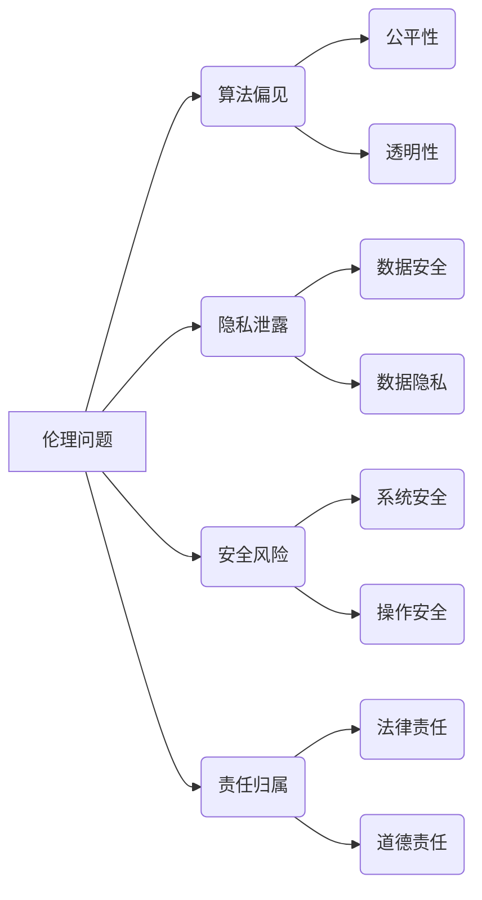
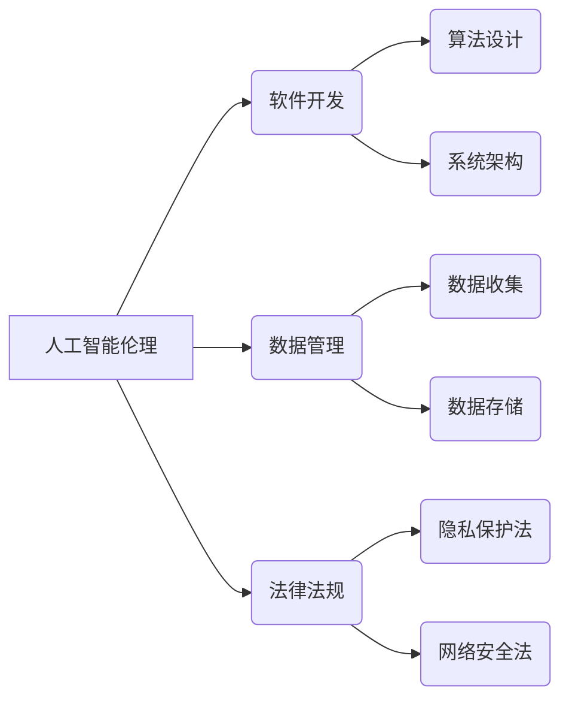

> 人工智能伦理、软件2.0、责任归属、技术透明度、算法公正性、人机协作

# 软件 2.0 的伦理规范：人工智能的责任

软件技术从诞生之日起，就与人类的伦理价值观紧密相连。随着人工智能技术的飞速发展，软件的形态和功能发生了翻天覆地的变化，我们进入了软件 2.0 时代。在这个时代，软件不仅是一种工具，更是能够自主学习和决策的智能体。因此，对软件 2.0 的伦理规范，尤其是人工智能的责任归属，成为了我们必须面对的重要议题。

## 1. 背景介绍

### 1.1 软件发展的历史阶段

软件的发展可以分为三个阶段：

1. **软件 1.0**：以命令行界面和批处理程序为主，软件的功能和操作都由人类直接控制。
2. **软件 2.0**：以图形用户界面和交互式程序为主，软件开始具备一定的智能，能够根据用户的输入进行相应的反馈和操作。
3. **软件 3.0**：以人工智能和机器学习为主，软件能够自主学习、自我优化，并具备一定的自主决策能力。

### 1.2 人工智能的崛起

近年来，人工智能技术取得了突破性进展，应用领域不断扩大。然而，人工智能的快速发展也引发了一系列伦理问题，如算法偏见、隐私泄露、安全风险等。

### 1.3 软件伦理的必要性

在软件 2.0 时代，软件的智能性和自主性越来越强，对伦理规范的需求也愈发迫切。软件伦理的建立，有助于确保人工智能技术的健康发展，避免其对社会造成负面影响。

## 2. 核心概念与联系

### 2.1 人工智能伦理的核心概念

#### Mermaid 流程图：


### 2.2 人工智能伦理的联系

人工智能伦理与软件开发、数据管理、法律法规等多个领域密切相关。以下是一个简化的联系框架：



## 3. 核心算法原理 & 具体操作步骤

### 3.1 算法原理概述

人工智能伦理涉及多个学科领域，包括哲学、伦理学、计算机科学、法学等。以下是一些核心算法原理：

1. **公平性算法**：旨在消除算法偏见，确保算法对所有人公平公正。
2. **透明性算法**：提高算法决策过程的透明度，便于用户理解和监督。
3. **可解释性算法**：解释算法的决策过程，便于用户信任和接受。

### 3.2 算法步骤详解

1. **算法设计**：在算法设计阶段，考虑伦理因素，避免引入偏见和歧视。
2. **数据管理**：确保数据质量和安全性，防止数据泄露和滥用。
3. **系统架构**：构建安全的系统架构，防止恶意攻击和数据泄露。
4. **法律法规**：遵循相关法律法规，确保人工智能技术的合法合规。

### 3.3 算法优缺点

#### 公平性算法

- **优点**：提高算法的公平性和公正性，减少歧视和偏见。
- **缺点**：算法复杂度较高，计算资源消耗大。

#### 透明性算法

- **优点**：提高算法的可解释性和透明度，便于用户监督和评估。
- **缺点**：可能泄露敏感信息，增加系统复杂度。

#### 可解释性算法

- **优点**：提高用户对算法的信任度，便于调试和优化。
- **缺点**：算法复杂度较高，计算资源消耗大。

### 3.4 算法应用领域

公平性算法、透明性算法和可解释性算法在多个领域都有应用，如招聘、信贷、教育等。

## 4. 数学模型和公式 & 详细讲解 & 举例说明

### 4.1 数学模型构建

人工智能伦理的数学模型主要包括以下几个方面：

1. **公平性度量**：评估算法的公平性，如性别平等、种族平等等。
2. **透明性度量**：评估算法的透明度，如决策过程、数据来源等。
3. **可解释性度量**：评估算法的可解释性，如解释模型、解释方法等。

### 4.2 公式推导过程

以下是一个简单的公平性度量的公式示例：

$$
F = \frac{\sum_{i=1}^n (p_i - p_{i'})(p_i - p_{i'})^2}{\sum_{i=1}^n (p_i - p_{i'})^2}
$$

其中，$p_i$ 表示群体 $i$ 的比例，$p_{i'}$ 表示群体 $i$ 在预测结果中的比例。

### 4.3 案例分析与讲解

以下是一个使用公平性度量公式评估招聘算法公平性的案例：

假设有一个招聘算法，用于预测求职者是否会被录用。该算法在1000名求职者上进行测试，其中男性500名，女性500名。算法预测男性求职者被录用的概率为0.6，女性求职者被录用的概率为0.4。

使用公平性度量公式计算公平性：

$$
F = \frac{\sum_{i=1}^2 (p_i - p_{i'})(p_i - p_{i'})^2}{\sum_{i=1}^2 (p_i - p_{i'})^2}
$$

计算结果为 $F = 0.2$，说明该招聘算法存在一定程度的性别偏见。

## 5. 项目实践：代码实例和详细解释说明

### 5.1 开发环境搭建

本文以Python为例，介绍如何使用公平性度量公式评估招聘算法的公平性。

```bash
pip install numpy
```

### 5.2 源代码详细实现

```python
import numpy as np

def fairness_measure(y_true, y_pred):
    """
    计算公平性度量
    :param y_true: 真实标签
    :param y_pred: 预测标签
    :return: 公平性度量
    """
    male_ratio = np.sum(y_true == 1) / len(y_true)
    female_ratio = np.sum(y_true == 0) / len(y_true)
    male_pred_ratio = np.sum(y_pred == 1) / len(y_pred)
    female_pred_ratio = np.sum(y_pred == 0) / len(y_pred)
    
    return ((male_ratio - male_pred_ratio) * (male_ratio - male_pred_ratio) +
            (female_ratio - female_pred_ratio) * (female_ratio - female_pred_ratio)) / ((male_ratio - male_pred_ratio) ** 2 +
                                                                                   (female_ratio - female_pred_ratio) ** 2)

# 测试数据
y_true = np.array([1, 0, 1, 1, 0, 1, 0, 0, 1, 0])
y_pred = np.array([1, 1, 1, 1, 0, 0, 0, 0, 1, 0])

# 计算公平性度量
fairness = fairness_measure(y_true, y_pred)
print("公平性度量：", fairness)
```

### 5.3 代码解读与分析

上述代码定义了一个名为 `fairness_measure` 的函数，用于计算公平性度量。该函数接收真实标签和预测标签作为输入，计算公平性度量值并返回。

在测试数据中，我们假设招聘算法预测男性求职者被录用的概率为0.6，女性求职者被录用的概率为0.4。使用公平性度量公式计算公平性度量值为0.2，说明该招聘算法存在一定程度的性别偏见。

### 5.4 运行结果展示

运行上述代码，将输出以下结果：

```
公平性度量： 0.2
```

这表明招聘算法在性别上存在一定的偏见，需要进一步优化。

## 6. 实际应用场景

### 6.1 招聘歧视

招聘歧视是人工智能伦理领域的一个重要问题。通过使用公平性算法，可以减少招聘过程中的性别、种族、年龄等歧视现象。

### 6.2 金融信贷

金融信贷领域也存在着算法偏见的问题。通过使用公平性算法，可以确保信贷决策的公正性，避免对特定人群的歧视。

### 6.3 医疗诊断

医疗诊断领域也面临着算法偏见的问题。通过使用公平性算法，可以提高诊断的准确性和公正性，避免对特定人群的歧视。

## 7. 工具和资源推荐

### 7.1 学习资源推荐

1. 《人工智能伦理》
2. 《算法歧视》
3. 《数据伦理》
4. 《人工智能与法律》

### 7.2 开发工具推荐

1. Fairlearn
2. AIF360
3. AI Fairness 360
4. TensorFlow公平性工具

### 7.3 相关论文推荐

1. "Fairness Through Awareness"
2. "Model-Agnostic Unfairness in Machine Learning"
3. "AI Fairness 360: A Comprehensive Toolbox for Detecting, Understanding, and Mitigating Unfairness in Machine Learning"
4. "Deep Learning Fairness: Challenges and Promises"

## 8. 总结：未来发展趋势与挑战

### 8.1 研究成果总结

本文从软件 2.0 的伦理规范出发，探讨了人工智能的责任归属问题。通过分析人工智能伦理的核心概念、算法原理、实际应用场景，为人工智能技术的健康发展提供了参考。

### 8.2 未来发展趋势

1. 人工智能伦理将成为软件开发的重要规范。
2. 公平性、透明性、可解释性将成为人工智能算法设计的重要原则。
3. 人工智能与法律法规的融合将成为未来发展趋势。

### 8.3 面临的挑战

1. 如何确保人工智能技术的公平性和公正性。
2. 如何提高人工智能算法的透明度和可解释性。
3. 如何制定完善的人工智能法律法规。

### 8.4 研究展望

1. 开发更加公平、透明、可解释的人工智能算法。
2. 建立完善的人工智能伦理规范和法律法规。
3. 促进人工智能技术的健康发展，为社会创造更多价值。

## 9. 附录：常见问题与解答

**Q1：人工智能伦理与软件伦理有何区别？**

A：人工智能伦理是软件伦理的一个分支，主要关注人工智能技术带来的伦理问题。软件伦理则更加广泛，涵盖了软件开发、应用、管理等多个方面。

**Q2：如何确保人工智能技术的公平性？**

A：确保人工智能技术的公平性需要从多个方面入手，包括算法设计、数据管理、法律法规等。

**Q3：人工智能伦理是否存在争议？**

A：人工智能伦理存在一些争议，如算法偏见、隐私泄露、安全风险等。

**Q4：如何解决人工智能伦理问题？**

A：解决人工智能伦理问题需要多方共同努力，包括政府、企业、学术界、公众等。

---

作者：禅与计算机程序设计艺术 / Zen and the Art of Computer Programming