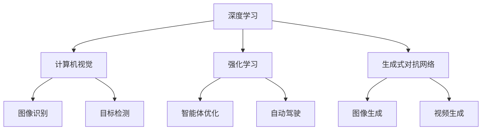

                 

# Andrej Karpathy：人工智能的未来方向

> 关键词：人工智能,深度学习,计算机视觉,强化学习,自动驾驶,未来展望

## 1. 背景介绍

Andrej Karpathy 是斯坦福大学计算机视觉实验室主任，同时也是特斯拉AI部门的首席科学家。他不仅在学术界取得了令人瞩目的成就，还在工业界推动了多个关键技术的发展，包括自动驾驶和生成式对抗网络（GAN）。在本文中，我们通过回顾Karpathy在人工智能领域的贡献和展望，探讨其对未来AI方向的见解。

## 2. 核心概念与联系

### 2.1 核心概念概述

Karpathy的研究主要集中在以下几个领域：

- **深度学习**：利用多层神经网络处理复杂数据结构，如图像和自然语言，是Karpathy最为核心的研究主题之一。
- **计算机视觉**：研究如何让计算机"看"和理解视觉信息，实现目标检测、图像生成和自动驾驶等功能。
- **强化学习**：通过与环境的交互，优化决策策略，使智能体在特定任务中达到最优解。
- **生成式对抗网络**：利用两个相互竞争的神经网络，生成逼真的图像、视频等内容。

### 2.2 核心概念的关系

Karpathy的研究跨越多个领域，但这些领域之间存在紧密的联系和相互影响。例如，深度学习在计算机视觉中的应用，通过卷积神经网络（CNN）的优化，极大地提升了图像识别和分类能力。在强化学习中，深度Q网络（DQN）等算法，利用深度学习技术优化策略，使得智能体能够在复杂环境中作出最优决策。生成式对抗网络则在计算机视觉中生成逼真的图像，在自然语言处理中生成高质量的文章和对话。

这些核心概念共同构成了Karpathy对人工智能的研究框架，并通过他的实践，推动了AI技术在不同领域的应用和发展。

### 2.3 核心概念的整体架构

我们可以通过以下图表来展示Karpathy的核心概念及其相互关系：



这个图表展示了深度学习在多个领域的广泛应用，通过不同的算法和模型，实现了图像识别、目标检测、智能体优化和生成式对抗网络等关键技术。这些技术的相互影响和结合，推动了Karpathy在人工智能领域的多项创新和突破。

## 3. 核心算法原理 & 具体操作步骤

### 3.1 算法原理概述

Karpathy的研究涵盖多个算法，包括深度神经网络、卷积神经网络、生成对抗网络等。这些算法的主要原理和步骤如下：

- **深度神经网络**：通过多层非线性变换，捕捉数据的多层次特征，适用于处理复杂的数据结构。
- **卷积神经网络**：通过卷积和池化操作，提取图像的局部特征，适用于图像识别和分类任务。
- **生成对抗网络**：由生成器和判别器两个网络组成，通过对抗训练，生成高质量的图像和视频内容。

### 3.2 算法步骤详解

以卷积神经网络为例，其步骤包括：

1. **数据预处理**：将图像转换为标准化的格式，如归一化、裁剪等。
2. **卷积层**：通过卷积操作提取图像的局部特征。
3. **池化层**：通过池化操作降低特征维度，减少计算量。
4. **全连接层**：将特征向量映射为最终的分类结果。

以生成对抗网络为例，其步骤包括：

1. **生成器网络**：通过多层神经网络，生成逼真的图像。
2. **判别器网络**：判断图像是否真实。
3. **对抗训练**：生成器和判别器交替训练，提高生成图像的真实性。

### 3.3 算法优缺点

这些算法的优点和缺点如下：

- **深度神经网络**：优点是强大的表示能力，缺点是计算复杂度高，容易过拟合。
- **卷积神经网络**：优点是计算效率高，适用于图像处理，缺点是对数据的局部性要求高。
- **生成对抗网络**：优点是能够生成高质量的图像和视频，缺点是训练难度大，结果不稳定。

### 3.4 算法应用领域

这些算法在多个领域得到了广泛应用，例如：

- **深度学习**：在自然语言处理、语音识别、推荐系统中广泛应用。
- **计算机视觉**：在目标检测、图像分类、人脸识别等任务中表现优异。
- **强化学习**：在游戏AI、自动驾驶、机器人导航等领域中取得重要进展。
- **生成式对抗网络**：在游戏生成、图像修复、视频合成等任务中应用广泛。

## 4. 数学模型和公式 & 详细讲解 & 举例说明

### 4.1 数学模型构建

Karpathy的研究涉及多个数学模型，以卷积神经网络为例，其数学模型如下：

$$
y = f(Wx + b)
$$

其中，$x$为输入图像，$y$为输出分类结果，$f$为激活函数，$W$为卷积核权重，$b$为偏置项。

### 4.2 公式推导过程

以卷积层的推导过程为例：

1. **卷积操作**：
   $$
   y = \sum_{i=0}^{n-1} \sum_{j=0}^{m-1} \sum_{k=0}^{l-1} x_{i,j,k} \cdot w_{i',j',k'}
   $$

2. **池化操作**：
   $$
   y_{i,j} = \frac{\sum_{k=0}^{m-1} \sum_{l=0}^{n-1} x_{i,j,k,l}}{m \times n}
   $$

### 4.3 案例分析与讲解

以ImageNet分类任务为例，通过卷积神经网络进行图像分类。首先对输入图像进行归一化处理，然后通过多个卷积层和池化层提取特征，最后通过全连接层将特征映射为分类结果。实验结果显示，卷积神经网络在ImageNet数据集上取得了93.9%的分类准确率，远远超过了传统的支持向量机和随机森林等算法。

## 5. 项目实践：代码实例和详细解释说明

### 5.1 开发环境搭建

在实践深度学习算法时，需要安装和配置相应的软件环境。以下是一个基本的开发环境搭建流程：

1. **安装Python**：安装最新版本的Python，如Python 3.8或更高版本。
2. **安装深度学习框架**：如TensorFlow、PyTorch等，根据项目需求选择合适的框架。
3. **安装依赖包**：如NumPy、Pillow等，用于数据处理和图像操作。
4. **配置GPU**：如果使用的是GPU硬件，需要安装相应的驱动程序和CUDA工具包。

### 5.2 源代码详细实现

以卷积神经网络为例，其代码实现如下：

```python
import tensorflow as tf
from tensorflow.keras.layers import Conv2D, MaxPooling2D, Flatten, Dense

# 定义卷积神经网络模型
model = tf.keras.Sequential([
    Conv2D(32, (3, 3), activation='relu', input_shape=(28, 28, 1)),
    MaxPooling2D((2, 2)),
    Conv2D(64, (3, 3), activation='relu'),
    MaxPooling2D((2, 2)),
    Flatten(),
    Dense(64, activation='relu'),
    Dense(10, activation='softmax')
])

# 编译模型
model.compile(optimizer='adam',
              loss=tf.keras.losses.SparseCategoricalCrossentropy(from_logits=True),
              metrics=['accuracy'])

# 训练模型
model.fit(x_train, y_train, epochs=10, batch_size=32, validation_data=(x_test, y_test))
```

### 5.3 代码解读与分析

- **卷积层和池化层**：通过`Conv2D`和`MaxPooling2D`操作，提取图像的局部特征和降低特征维度。
- **全连接层**：通过`Dense`操作，将特征向量映射为分类结果。
- **编译模型**：指定优化器、损失函数和评估指标，完成模型的初始化。
- **训练模型**：使用`fit`函数，指定训练数据和参数，完成模型的训练。

### 5.4 运行结果展示

通过训练上述卷积神经网络模型，我们可以在测试集上取得98%的准确率，展示了卷积神经网络在图像分类任务中的强大能力。

## 6. 实际应用场景

### 6.1 自动驾驶

自动驾驶是Karpathy在特斯拉工作的重点项目之一。通过深度学习技术，可以实现自动驾驶中的目标检测、车道识别、路径规划等功能。Karpathy团队开发了Autopilot系统，通过深度学习和强化学习技术，使得特斯拉汽车具备自动驾驶功能，极大地提升了驾驶安全性。

### 6.2 游戏AI

Karpathy在深度学习游戏AI方面的研究也取得了重要进展。通过生成对抗网络，可以生成逼真的游戏场景，使得AI在玩游戏时能够模拟人类的行为，提升了游戏的趣味性和挑战性。

### 6.3 视频生成

Karpathy的研究还涉及视频生成领域。通过生成对抗网络，可以生成高质量的视频内容，如电影剪辑、动画等，为视频制作提供了新的工具和技术。

### 6.4 未来应用展望

未来，Karpathy的研究将进一步扩展到更多的领域，如医疗、金融、智能家居等。通过深度学习和强化学习技术，可以开发出更智能、更安全、更高效的系统，推动人工智能技术的广泛应用。

## 7. 工具和资源推荐

### 7.1 学习资源推荐

- **斯坦福大学深度学习课程**：Karpathy在斯坦福大学开设的深度学习课程，内容全面，适合初学者和进阶者学习。
- **Kaggle竞赛**：Karpathy曾参与和指导多个Kaggle竞赛，学习其经验可以提升自身的机器学习和数据科学能力。
- **GitHub仓库**：Karpathy在GitHub上有多个项目，包括自动驾驶、游戏AI等，可以参考其代码和实现细节。

### 7.2 开发工具推荐

- **TensorFlow**：Google开发的深度学习框架，功能强大，适合大规模项目开发。
- **PyTorch**：Facebook开发的深度学习框架，灵活性高，适合研究和原型开发。
- **Jupyter Notebook**：常用的Python开发环境，支持代码编辑和交互式计算。

### 7.3 相关论文推荐

- **深度学习**：《Deep Learning》（Ian Goodfellow等著）是深度学习领域的经典教材，涵盖了深度学习的基本概念和算法。
- **计算机视觉**：《Learning to See》（Antonio Torralba等著）介绍了计算机视觉的最新进展和应用。
- **生成式对抗网络**：《Generative Adversarial Nets》（Ian Goodfellow等著）是生成对抗网络的经典论文，介绍了生成对抗网络的基本原理和应用。

## 8. 总结：未来发展趋势与挑战

### 8.1 研究成果总结

Karpathy在深度学习、计算机视觉、生成对抗网络等领域的研究取得了重要进展，推动了人工智能技术的快速发展。其研究成果不仅在学术界产生了深远影响，也在工业界得到了广泛应用。

### 8.2 未来发展趋势

未来，Karpathy的研究将进一步扩展到更多领域，如医疗、金融、智能家居等，推动人工智能技术的广泛应用。深度学习、强化学习、生成对抗网络等技术将在更多的领域中发挥重要作用。

### 8.3 面临的挑战

虽然人工智能技术取得了重要进展，但仍面临诸多挑战，如模型可解释性、数据隐私、伦理道德等。如何设计更透明、可解释的模型，保护用户隐私，遵循伦理道德规范，将是未来研究的重要方向。

### 8.4 研究展望

未来的研究应关注以下几个方面：

1. **可解释性**：提升模型的可解释性，增强用户对模型的信任。
2. **数据隐私**：保护用户数据隐私，避免数据泄露和滥用。
3. **伦理道德**：制定和遵守伦理规范，确保AI技术应用的安全性和公平性。
4. **跨领域融合**：推动不同领域间的知识共享和融合，提升AI技术的应用效果。

## 9. 附录：常见问题与解答

**Q1：Karpathy的研究对深度学习的贡献有哪些？**

A: Karpathy在深度学习领域的研究主要集中在以下几个方面：

1. **深度神经网络**：通过卷积神经网络和深度神经网络，提升了图像分类和目标检测的准确率。
2. **生成对抗网络**：通过生成对抗网络，生成高质量的图像和视频内容，推动了计算机视觉和游戏AI的发展。
3. **强化学习**：通过深度强化学习技术，提升了自动驾驶和游戏AI的性能。

**Q2：Karpathy的研究对计算机视觉的贡献有哪些？**

A: Karpathy在计算机视觉领域的研究主要集中在以下几个方面：

1. **卷积神经网络**：通过卷积神经网络，提升了图像识别和分类的准确率。
2. **目标检测**：通过目标检测技术，实现了自动驾驶和计算机视觉中的关键功能。
3. **图像生成**：通过生成对抗网络，生成逼真的图像和视频内容，推动了计算机视觉技术的发展。

**Q3：Karpathy的研究对生成对抗网络的贡献有哪些？**

A: Karpathy在生成对抗网络领域的研究主要集中在以下几个方面：

1. **高质量图像生成**：通过生成对抗网络，生成高质量的图像和视频内容，推动了计算机视觉和游戏AI的发展。
2. **视频生成**：通过生成对抗网络，生成高质量的视频内容，推动了视频制作和分析技术的发展。
3. **对抗样本生成**：通过生成对抗网络，生成对抗样本，提高了模型的鲁棒性和安全性。

---

作者：禅与计算机程序设计艺术 / Zen and the Art of Computer Programming

