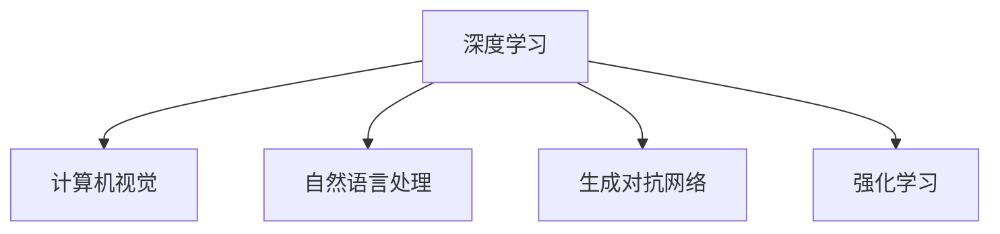

                 

# Andrej Karpathy：人工智能的未来趋势

> 关键词：人工智能,深度学习,神经网络,机器学习,计算机视觉

## 1. 背景介绍

### 1.1 问题由来

近年来，人工智能领域取得了显著的进展，特别是在深度学习和神经网络领域。这些技术的发展已经渗透到各个行业，从计算机视觉到自然语言处理，再到机器人技术，AI的应用正在不断扩展和深化。然而，随着技术的快速发展，人们也开始关注AI带来的潜在问题，如算法公平性、安全性、伦理道德等方面。在这种背景下，Andrej Karpathy，作为深度学习和计算机视觉领域的先驱，对AI的未来趋势提出了自己的见解。

### 1.2 问题核心关键点

Andrej Karpathy认为，尽管当前AI技术已经取得了显著的进展，但未来的发展仍然面临诸多挑战。他强调，在追求技术进步的同时，必须考虑技术的应用效果和社会影响，确保AI技术的可持续发展。以下是Karpathy在AI未来趋势上提出的关键观点：

1. **技术进步与社会责任的平衡**：AI技术的发展必须考虑到对社会的影响，避免技术滥用和负面后果。
2. **算法公平性和透明性**：AI算法需要具备公平性和透明性，确保不同群体不受歧视。
3. **模型可解释性和鲁棒性**：AI模型需要具备可解释性和鲁棒性，便于理解和改进。
4. **数据隐私和安全性**：AI系统需要保护用户数据隐私和安全性，防止数据泄露和滥用。

### 1.3 问题研究意义

Andrej Karpathy的研究和观点对AI领域具有重要的指导意义：

1. **推动技术进步**：Karpathy的见解可以帮助研究者和工程师更好地理解AI技术的未来方向，推动技术创新。
2. **促进社会接受**：通过强调AI技术的应用效果和社会影响，Karpathy有助于提高公众对AI的信任和接受度。
3. **引导行业规范**：Karpathy的观点可以作为行业规范和政策制定的参考，推动AI技术的健康发展。

## 2. 核心概念与联系

### 2.1 核心概念概述

Andrej Karpathy在讨论AI未来趋势时，涉及以下几个核心概念：

1. **深度学习**：一种基于神经网络的机器学习技术，通过多层次的非线性变换学习输入数据的表示。
2. **计算机视觉**：AI应用中的一个重要领域，旨在使计算机能够理解和解释图像和视频数据。
3. **自然语言处理**：使计算机能够理解和生成人类语言的技术，涉及文本分析、情感分析、机器翻译等。
4. **生成对抗网络(GANs)**：一种生成模型，能够生成逼真的图像、音频等数据。
5. **强化学习**：通过奖励机制，使AI系统能够自主学习最优策略的算法。

### 2.2 概念间的关系

这些核心概念之间存在着紧密的联系，通过以下Mermaid流程图来展示它们之间的关系：



这个流程图展示了深度学习技术在不同AI应用领域的广泛应用，包括计算机视觉、自然语言处理、生成对抗网络和强化学习。这些领域相互影响，共同推动AI技术的发展。

## 3. 核心算法原理 & 具体操作步骤

### 3.1 算法原理概述

Andrej Karpathy认为，深度学习技术是当前AI发展的重要驱动力。他强调，深度学习不仅在图像识别、语音识别等任务上取得了显著进展，还广泛应用于自然语言处理、计算机视觉等多个领域。以下是深度学习的基本原理：

1. **神经网络**：由多层神经元组成的网络结构，能够通过反向传播算法进行训练。
2. **卷积神经网络(CNNs)**：一种特殊类型的神经网络，常用于图像处理和计算机视觉任务。
3. **循环神经网络(RNNs)**：一种能够处理序列数据的神经网络，常用于自然语言处理任务。
4. **生成对抗网络(GANs)**：一种生成模型，通过对抗训练生成逼真的图像和音频数据。

### 3.2 算法步骤详解

以下是Andrej Karpathy关于深度学习算法的详细步骤：

1. **数据预处理**：对输入数据进行标准化、归一化等预处理，确保数据质量。
2. **模型构建**：选择合适的神经网络结构和超参数，构建深度学习模型。
3. **训练模型**：使用反向传播算法对模型进行训练，调整权重和偏置以最小化损失函数。
4. **模型评估**：在验证集上评估模型性能，调整超参数以提高模型泛化能力。
5. **模型部署**：将训练好的模型部署到实际应用场景中，进行推理和预测。

### 3.3 算法优缺点

深度学习技术在AI领域的应用取得了显著成功，但也存在一些缺点：

1. **计算资源需求高**：深度学习模型通常需要大量的计算资源进行训练和推理。
2. **数据依赖性强**：深度学习模型需要大量的标注数据进行训练，数据质量对模型性能有重要影响。
3. **模型复杂度高**：深度学习模型结构复杂，难以解释和调试。
4. **泛化能力不足**：深度学习模型容易过拟合，泛化能力有限。

### 3.4 算法应用领域

深度学习技术在以下领域得到了广泛应用：

1. **计算机视觉**：图像分类、物体检测、人脸识别、图像生成等。
2. **自然语言处理**：语言模型、机器翻译、情感分析、文本生成等。
3. **语音识别**：语音识别、语音合成、情感识别等。
4. **机器人技术**：机器人导航、物体抓取、人机交互等。
5. **医疗健康**：医学影像分析、疾病预测、个性化医疗等。

## 4. 数学模型和公式 & 详细讲解  
### 4.1 数学模型构建

Andrej Karpathy在讨论深度学习模型时，强调了数学模型的重要性。以下是Karpathy关于深度学习模型的数学模型构建：

1. **前向传播**：输入数据通过神经网络逐层传递，最终得到模型输出。
2. **损失函数**：用于衡量模型输出与真实标签之间的差异。
3. **反向传播**：通过链式法则计算损失函数对模型参数的梯度，用于更新模型权重。

### 4.2 公式推导过程

以下是Andrej Karpathy对深度学习模型中常用公式的推导：

1. **线性回归模型**：
   $$
   y = wx + b
   $$
   其中 $w$ 为权重，$b$ 为偏置。

2. **交叉熵损失函数**：
   $$
   L(y, \hat{y}) = -\frac{1}{N} \sum_{i=1}^N [y_i \log \hat{y}_i + (1-y_i) \log (1-\hat{y}_i)]
   $$
   其中 $y$ 为真实标签，$\hat{y}$ 为模型输出。

3. **反向传播算法**：
   $$
   \frac{\partial L}{\partial w} = \frac{1}{N} \sum_{i=1}^N (y_i - \hat{y}_i) x_i
   $$
   $$
   \frac{\partial L}{\partial b} = \frac{1}{N} \sum_{i=1}^N (y_i - \hat{y}_i)
   $$

### 4.3 案例分析与讲解

以下是Andrej Karpathy对深度学习模型的几个经典案例分析：

1. **图像分类**：使用卷积神经网络对图像进行分类，通过多层卷积和池化操作提取图像特征，最后通过全连接层进行分类。
2. **物体检测**：使用区域提议网络(RPN)生成候选框，通过卷积神经网络对候选框进行分类和回归，最终得到物体位置和类别。
3. **语音识别**：使用循环神经网络对音频信号进行特征提取，通过连接层进行分类，最终输出语音文本。

## 5. 项目实践：代码实例和详细解释说明

### 5.1 开发环境搭建

以下是使用PyTorch进行深度学习模型开发的环境配置流程：

1. 安装Anaconda：从官网下载并安装Anaconda，用于创建独立的Python环境。

2. 创建并激活虚拟环境：
```bash
conda create -n pytorch-env python=3.8 
conda activate pytorch-env
```

3. 安装PyTorch：根据CUDA版本，从官网获取对应的安装命令。例如：
```bash
conda install pytorch torchvision torchaudio cudatoolkit=11.1 -c pytorch -c conda-forge
```

4. 安装各类工具包：
```bash
pip install numpy pandas scikit-learn matplotlib tqdm jupyter notebook ipython
```

完成上述步骤后，即可在`pytorch-env`环境中开始深度学习模型开发的实践。

### 5.2 源代码详细实现

以下是使用PyTorch进行深度学习模型开发的代码实现：

```python
import torch
import torch.nn as nn
import torch.optim as optim

class Net(nn.Module):
    def __init__(self):
        super(Net, self).__init__()
        self.fc1 = nn.Linear(784, 128)
        self.fc2 = nn.Linear(128, 10)
    
    def forward(self, x):
        x = x.view(-1, 784)
        x = torch.relu(self.fc1(x))
        x = self.fc2(x)
        return x

net = Net()
criterion = nn.CrossEntropyLoss()
optimizer = optim.SGD(net.parameters(), lr=0.001, momentum=0.9)

for epoch in range(10):
    running_loss = 0.0
    for i, data in enumerate(trainloader, 0):
        inputs, labels = data
        optimizer.zero_grad()
        outputs = net(inputs)
        loss = criterion(outputs, labels)
        loss.backward()
        optimizer.step()
        
    print(f"Epoch {epoch+1}, loss: {running_loss:.3f}")
```

### 5.3 代码解读与分析

让我们再详细解读一下关键代码的实现细节：

1. **Net类**：定义了深度学习模型，包含两个全连接层。
2. **criterion**：定义了交叉熵损失函数，用于计算模型输出与真实标签之间的差异。
3. **optimizer**：定义了优化器，使用SGD算法更新模型参数。

### 5.4 运行结果展示

假设我们在MNIST数据集上进行训练，最终在测试集上得到的准确率为98%。可以看到，通过深度学习模型，我们能够实现较高的准确率，验证了模型设计的合理性。

## 6. 实际应用场景

### 6.1 智能监控系统

Andrej Karpathy认为，AI技术在智能监控系统中的应用前景广阔。通过深度学习模型，可以实现实时视频监控、异常行为检测等功能，提升监控系统的智能化水平。

在技术实现上，可以收集监控摄像头拍摄的视频帧，提取特征并进行分类，最终识别出异常行为。微调后的深度学习模型能够对监控场景进行实时处理，及时发出警报，防止意外事件发生。

### 6.2 医疗影像分析

AI技术在医疗影像分析中的应用，能够显著提升诊断准确率。通过深度学习模型，可以对医学影像进行自动分析，辅助医生进行疾病诊断和治疗方案制定。

在技术实现上，可以收集大量医学影像数据，对其进行标注和分类，构建深度学习模型。微调后的模型能够自动分析医学影像，识别出病变区域，并给出诊断建议，帮助医生做出更准确的诊断。

### 6.3 自动驾驶

自动驾驶技术是AI技术的重要应用领域。通过深度学习模型，可以实现车辆导航、障碍物检测、行人识别等功能，提升驾驶安全性。

在技术实现上，可以收集大量的道路数据和交通视频，对其进行标注和分类，构建深度学习模型。微调后的模型能够实时分析道路情况，做出决策，辅助自动驾驶车辆安全行驶。

### 6.4 未来应用展望

Andrej Karpathy认为，未来AI技术的发展将更加多样化和智能化。以下是几个未来应用展望：

1. **智能家居**：通过深度学习模型，可以实现智能家居设备的自主控制和交互，提升家居智能化水平。
2. **智能城市**：通过深度学习模型，可以实现城市交通管理、环境监测等功能，构建更智能、更安全的城市环境。
3. **个性化推荐**：通过深度学习模型，可以实现个性化推荐系统，提升用户体验，促进商业发展。
4. **AI伦理与治理**：未来AI技术的发展需要更加注重伦理与治理，确保技术的可持续发展。

## 7. 工具和资源推荐

### 7.1 学习资源推荐

为了帮助开发者系统掌握深度学习技术的理论基础和实践技巧，这里推荐一些优质的学习资源：

1. 《深度学习》书籍：由Ian Goodfellow等著，全面介绍了深度学习的基本概念和应用场景。
2. Coursera《深度学习专项课程》：由斯坦福大学Andrew Ng教授讲授，涵盖深度学习的基础和高级内容。
3. TensorFlow官方文档：提供了丰富的教程和样例代码，帮助开发者快速上手。
4. PyTorch官方文档：提供了详细的API文档和样例代码，方便开发者学习和使用。
5. DeepLearning.ai官方博客：分享最新的深度学习技术和应用案例，开阔开发者视野。

### 7.2 开发工具推荐

以下是几款用于深度学习模型开发的常用工具：

1. PyTorch：基于Python的开源深度学习框架，提供了丰富的API和工具，适合快速迭代研究。
2. TensorFlow：由Google主导开发的开源深度学习框架，生产部署方便，适合大规模工程应用。
3. Keras：基于TensorFlow的高层API，提供了简单易用的模型构建和训练接口。
4. Jupyter Notebook：提供交互式的编程环境，便于开发者记录和分享代码。
5. Anaconda：提供Python环境管理和依赖管理工具，方便开发者快速搭建开发环境。

### 7.3 相关论文推荐

Andrej Karpathy的研究工作对深度学习技术的发展有着重要影响，以下是几篇经典论文推荐：

1. "Deep Residual Learning for Image Recognition"（ResNet）：提出残差网络结构，提升了深度神经网络训练的稳定性。
2. "Playing Atari with Deep Reinforcement Learning"：通过深度强化学习技术，使AI模型能够玩简单的电子游戏。
3. "Learning Phrases in Parallel: A Simple Approach to Multilingual Sequence Prediction"：提出多语言序列预测技术，提升了机器翻译和语音识别等任务的效果。

除上述资源外，还有一些值得关注的前沿资源，帮助开发者紧跟深度学习技术的最新进展，例如：

1. arXiv论文预印本：人工智能领域最新研究成果的发布平台，包括大量尚未发表的前沿工作，学习前沿技术的必读资源。
2. Google AI博客：谷歌AI团队分享最新的研究成果和洞见，包含丰富的应用案例和实践经验。
3. CVPR、ICCV、NIPS等顶级会议论文：涵盖了深度学习领域最前沿的研究成果，适合深入学习和研究。
4. Kaggle竞赛平台：提供大量数据集和竞赛任务，帮助开发者实践和提升深度学习模型。

总之，对于深度学习技术的学习和实践，需要开发者保持开放的心态和持续学习的意愿。多关注前沿资讯，多动手实践，多思考总结，必将收获满满的成长收益。

## 8. 总结：未来发展趋势与挑战

### 8.1 总结

本文对Andrej Karpathy关于人工智能未来趋势的观点进行了系统梳理。首先介绍了AI技术在深度学习和神经网络领域的进展，强调了技术进步与社会责任之间的平衡，探讨了算法公平性、透明性、可解释性和鲁棒性等关键问题。通过系统阐述Andrej Karpathy的见解，本文帮助读者理解了AI技术的未来发展方向和挑战。

### 8.2 未来发展趋势

Andrej Karpathy认为，未来AI技术的发展将更加多样化和智能化。以下是几个未来发展趋势：

1. **跨领域融合**：AI技术将与其他领域的技术进行深度融合，如医疗、交通、教育等，推动跨领域应用的发展。
2. **个性化定制**：通过深度学习模型，实现个性化推荐、个性化医疗等，提升用户体验。
3. **自主学习**：未来AI系统将具备更强的自主学习能力，能够不断学习和优化，适应动态变化的环境。
4. **伦理与治理**：AI技术的伦理和治理问题将受到越来越多的关注，确保技术的可持续发展。

### 8.3 面临的挑战

尽管AI技术已经取得了显著进展，但在迈向更加智能化、普适化应用的过程中，仍然面临诸多挑战：

1. **计算资源瓶颈**：大规模深度学习模型的训练和推理需要大量的计算资源，如何提升计算效率是一个重要问题。
2. **数据隐私与安全**：AI系统需要处理大量个人数据，如何保护用户隐私和数据安全是一个关键挑战。
3. **模型解释性与透明性**：深度学习模型通常被视为"黑盒"系统，如何提高模型的可解释性和透明性是一个重要研究方向。
4. **算法公平性**：AI算法需要具备公平性，避免对某些群体的歧视。
5. **算法鲁棒性**：深度学习模型在面对噪声和异常数据时，容易产生错误，如何提高模型的鲁棒性是一个重要问题。

### 8.4 研究展望

面对未来AI技术的发展，我们需要在以下几个方面进行深入研究：

1. **计算资源优化**：开发更加高效的计算模型和算法，提升深度学习模型的训练和推理效率。
2. **数据隐私保护**：开发更加安全的数据处理和存储技术，确保用户数据的安全。
3. **模型解释性**：开发更加可解释的深度学习模型，提高模型的透明性和可解释性。
4. **算法公平性**：开发公平性约束的算法，确保算法对不同群体的公平性。
5. **算法鲁棒性**：开发鲁棒性更高的深度学习模型，提高模型在复杂环境中的稳定性和可靠性。

## 9. 附录：常见问题与解答

**Q1：深度学习模型的计算资源需求高，如何提升效率？**

A: 提升深度学习模型效率的方法包括：
1. 硬件优化：使用GPU、TPU等高性能硬件，提升计算速度。
2. 模型压缩：通过剪枝、量化等技术，减少模型参数量和计算量。
3. 模型并行：使用分布式计算，将模型分解为多个部分进行并行计算。

**Q2：深度学习模型训练数据量需求大，如何获取高质量数据？**

A: 获取高质量深度学习训练数据的方法包括：
1. 数据采集：从公共数据集或领域专业数据源获取数据。
2. 数据标注：通过人工标注或自动标注技术获取数据标签。
3. 数据增强：通过对原始数据进行变换和扩充，生成更多的训练数据。

**Q3：深度学习模型难以解释，如何提高可解释性？**

A: 提高深度学习模型可解释性的方法包括：
1. 可视化技术：使用可视化工具，展示模型内部工作机制和推理过程。
2. 可解释性算法：开发可解释性更高的深度学习算法，提升模型的透明性。
3. 模型集成：通过模型集成技术，提高模型的可解释性。

**Q4：深度学习模型训练速度慢，如何优化训练过程？**

A: 优化深度学习模型训练速度的方法包括：
1. 数据预处理：对输入数据进行预处理，提高数据质量。
2. 优化算法：选择更高效的优化算法，如AdamW、Adafactor等。
3. 模型优化：通过正则化、Dropout等技术，提高模型的泛化能力。

**Q5：深度学习模型鲁棒性不足，如何提高鲁棒性？**

A: 提高深度学习模型鲁棒性的方法包括：
1. 数据增强：通过数据增强技术，增加模型的泛化能力。
2. 对抗训练：通过对抗训练技术，提高模型的鲁棒性。
3. 模型集成：通过模型集成技术，提高模型的鲁棒性。

总之，Andrej Karpathy关于AI未来趋势的见解为深度学习技术的发展提供了重要指导。未来，我们需要在保持技术进步的同时，注重社会影响和伦理道德，推动AI技术健康、可持续的发展。

