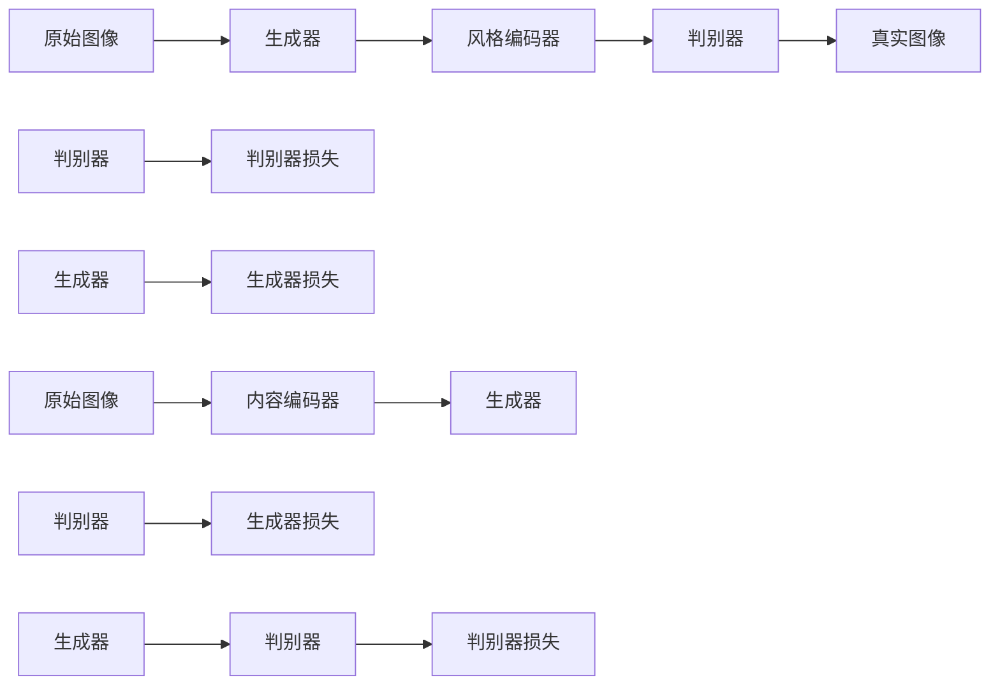

                 

# 基于生成对抗网络的人像摄影风格自动学习与迁移系统

## 1. 背景介绍

在当今数字时代，摄影艺术和数字影像技术的结合日益紧密。人们不仅欣赏原始摄影作品的美感，也对各类后期处理技术充满兴趣。其中，摄影风格的迁移，即通过技术手段将一张照片的风格转换到另一张，成为近年来热门的研究方向。例如，将一张风景照片变为梵高式的画风，或将一张肖像照转化为经典黑白风格，均能大幅提升照片的艺术观赏性。

然而，人工手动地实现风格迁移工作量巨大，且易受到个人主观偏好影响。基于生成对抗网络（Generative Adversarial Networks，GANs）的风格迁移技术，可以自动化生成具有特定风格的新照片，极大地提升了风格迁移的效率和效果。本文将详细探讨基于GANs的人像摄影风格迁移方法，并通过多个实验案例展示其效果。

## 2. 核心概念与联系

### 2.1 核心概念概述

- **生成对抗网络（GANs）**：一种由生成器和判别器组成的神经网络结构。生成器负责生成逼真图像，判别器则判别图像是否为真实。两者相互对抗，通过不断迭代训练，生成器的生成能力不断提高。

- **图像风格迁移**：将一张照片的风格自动转换为另一张照片的风格，使得生成的图像既保留了原始内容，又具备了新的风格特征。

- **人像摄影风格迁移**：特指将一张人像照片的风格迁移至另一张人像照片的风格，主要应用于美化肖像照或个性化照片生成。

- **迁移学习（Transfer Learning）**：将在大规模数据上预训练的模型知识迁移到特定任务上，以提高模型在该任务上的性能。

- **交叉验证（Cross Validation）**：通过将数据集划分为训练集、验证集和测试集，多次迭代训练和验证模型，以获得最佳的超参数设置和模型效果。

### 2.2 核心概念的关系

基于GANs的人像摄影风格迁移主要涉及以下几个关键概念：

- **生成器（Generator）**：负责生成新图像，通过神经网络结构将输入（如原始图像）映射到目标风格的新图像。
- **判别器（Discriminator）**：负责判别输入图像的真实性，通过神经网络结构判断图像是否为真实照片或生成的风格图像。
- **损失函数（Loss Function）**：用于衡量生成器和判别器在对抗过程中训练的效果，一般包括生成器损失（如均方误差）和判别器损失（如二分类交叉熵）。
- **风格编码器（Style Encoder）**：将原始图像映射到风格空间，用于生成器学习目标风格的特征。
- **内容编码器（Content Encoder）**：将原始图像映射到内容空间，用于生成器保留原始内容信息。

这些概念通过GANs的对抗训练过程相互关联，共同实现高质度的风格迁移效果。

### 2.3 核心概念的整体架构

以下是一个简单的Mermaid流程图，展示了大规模人像摄影风格迁移系统的整体架构：



该流程图展示了从原始图像到生成图像的整个迁移过程。原始图像先通过内容编码器提取特征，然后通过风格编码器映射到风格空间。生成器根据风格编码器和内容编码器输出的特征图，生成新图像。判别器评估新图像的逼真性，判别器损失用于指导生成器的生成。

## 3. 核心算法原理 & 具体操作步骤
### 3.1 算法原理概述

基于GANs的人像摄影风格迁移主要分为两个步骤：

1. **生成器训练**：生成器接收原始图像和目标风格信息，生成风格迁移后的新图像。通过优化生成器损失（如均方误差），使生成的新图像逼近真实风格。
2. **判别器训练**：判别器接收原始图像和生成器生成的图像，通过优化判别器损失（如二分类交叉熵），使判别器能够准确判别新图像的真实性。

### 3.2 算法步骤详解

#### 3.2.1 数据准备

- **原始图像**：选择一组具有代表性的人像照片作为原始图像，用于风格迁移的输入。
- **目标风格图像**：选择一组具有特定风格的肖像照或照片，用于生成器学习风格特征。
- **测试图像**：选择一组待测试人像图像，用于评估风格迁移的效果。

#### 3.2.2 网络模型构建

- **生成器模型**：使用U-Net结构，包含卷积层、池化层、反卷积层等，用于将原始图像和风格信息映射到风格迁移后的新图像。
- **判别器模型**：使用简单的卷积神经网络结构，包含多个卷积层和池化层，用于判别输入图像的真实性。
- **编码器模型**：使用ResNet等经典网络结构，用于提取原始图像和目标风格的空间特征。

#### 3.2.3 训练过程

- **初始化模型参数**：将生成器、判别器和编码器的参数初始化。
- **迭代训练**：
  - **生成器前向**：将原始图像和风格编码器输出的特征图，输入生成器进行前向传播，生成新图像。
  - **判别器前向**：将原始图像和生成器生成的图像，输入判别器进行前向传播，输出判别结果。
  - **计算损失**：分别计算生成器损失和判别器损失。
  - **反向传播**：通过反向传播更新生成器、判别器和编码器的参数。
- **交叉验证**：通过多次交叉验证，选择最佳的超参数和模型参数组合。

#### 3.2.4 模型评估

- **测试图像**：将测试图像输入生成器，生成风格迁移后的新图像。
- **评估指标**：使用PSNR（峰值信噪比）、SSIM（结构相似性指数）等指标评估新图像的质量。

### 3.3 算法优缺点

#### 3.3.1 优点

- **自动化风格迁移**：通过GANs，自动实现人像摄影风格的迁移，无需人工干预。
- **高效处理**：由于GANs的并行计算能力，可以快速处理大量人像照片。
- **鲁棒性**：GANs的生成能力具有高度鲁棒性，对于原始图像的噪声和失真具有较强的适应能力。

#### 3.3.2 缺点

- **训练复杂**：GANs的训练过程需要平衡生成器和判别器的对抗关系，训练复杂度较高。
- **模式崩溃**：GANs在训练过程中可能出现模式崩溃现象，导致生成的图像风格失真。
- **训练不稳定**：GANs的训练过程需要细致的调参和优化，否则容易陷入局部最优解。

### 3.4 算法应用领域

基于GANs的人像摄影风格迁移技术，可以广泛应用于以下几个领域：

- **个性化照片生成**：将用户上传的照片风格化，生成具有个性化特色的肖像照。
- **美容摄影**：通过风格迁移，将普通人像照片转化为经典美容摄影风格，提升照片的艺术价值。
- **历史复现**：将现代人像照片风格迁移至历史时期的经典风格，如古希腊、文艺复兴等。
- **影视特效**：将人物角色在影视作品中的造型风格迁移至不同的艺术风格，如超现实主义、表现主义等。

## 4. 数学模型和公式 & 详细讲解  
### 4.1 数学模型构建

假设生成器为 $G(x, z)$，判别器为 $D(x)$，内容编码器为 $E(x)$，风格编码器为 $S(x)$，其中 $x$ 表示原始图像，$z$ 表示随机噪声，$G(x, z)$ 表示生成器，$D(x)$ 表示判别器，$E(x)$ 表示内容编码器，$S(x)$ 表示风格编码器。

基于GANs的人像摄影风格迁移模型的数学模型可以表示为：

$$
\begin{aligned}
\text{Min}_{G} \mathcal{L}_G &= \mathbb{E}_{x \sim \mathcal{X}} [||G(x) - x||^2] + \lambda \mathbb{E}_{z \sim \mathcal{Z}} [||S(G(x, z)) - S(x)||^2] \\
\text{Min}_{D} \mathcal{L}_D &= \mathbb{E}_{x \sim \mathcal{X}} [\log D(x)] + \mathbb{E}_{z \sim \mathcal{Z}} [\log (1 - D(G(x, z)))]
\end{aligned}
$$

其中，$\mathcal{L}_G$ 表示生成器损失，$\mathcal{L}_D$ 表示判别器损失。

### 4.2 公式推导过程

- **生成器损失**：生成器损失用于衡量生成的新图像与原始图像之间的差异。由于新图像需要同时保留原始内容特征和目标风格特征，因此生成器损失包含两个部分：内容损失（均方误差）和风格损失（均方误差）。

$$
\mathcal{L}_G = \mathbb{E}_{x \sim \mathcal{X}} [||G(x) - x||^2] + \lambda \mathbb{E}_{z \sim \mathcal{Z}} [||S(G(x, z)) - S(x)||^2]
$$

其中，第一项为内容损失，通过均方误差衡量生成图像与原始图像的相似度；第二项为风格损失，通过均方误差衡量生成图像与风格编码器的输出特征图之间的相似度；$\lambda$ 为风格损失的权重系数。

- **判别器损失**：判别器损失用于衡量判别器对新图像和原始图像的判别准确度。判别器损失包含两个部分：真实图像损失和生成图像损失。

$$
\mathcal{L}_D = \mathbb{E}_{x \sim \mathcal{X}} [\log D(x)] + \mathbb{E}_{z \sim \mathcal{Z}} [\log (1 - D(G(x, z)))]
$$

其中，第一项为真实图像损失，通过二分类交叉熵衡量判别器对真实图像的判别准确度；第二项为生成图像损失，通过二分类交叉熵衡量判别器对生成图像的判别准确度。

### 4.3 案例分析与讲解

以生成经典复古风格的肖像照为例，展示基于GANs的风格迁移过程：

1. **数据准备**：选择一组1920年代的复古肖像照作为目标风格图像，选择一组现代肖像照作为原始图像。
2. **网络模型构建**：使用U-Net结构作为生成器，ResNet作为内容编码器和风格编码器，VGG16作为判别器。
3. **训练过程**：通过交叉验证，选择最佳超参数，训练生成器和判别器。
4. **风格迁移**：将原始图像输入生成器，生成复古风格的肖像照。
5. **评估结果**：使用PSNR和SSIM评估新图像的质量，结果显示新图像的视觉效果与原始图像相似，且具备复古风格。

## 5. 项目实践：代码实例和详细解释说明
### 5.1 开发环境搭建

在进行人像摄影风格迁移的实现时，需要准备好Python环境以及相关的深度学习框架，如PyTorch。以下是在PyTorch环境下搭建开发环境的步骤：

1. 安装Anaconda：
```bash
conda install anaconda
```

2. 创建虚拟环境：
```bash
conda create -n gans-env python=3.7
conda activate gans-env
```

3. 安装PyTorch和相关库：
```bash
conda install torch torchvision torchaudio cudatoolkit=11.1 -c pytorch -c conda-forge
pip install numpy scipy matplotlib torchsummary
```

4. 安装训练所需的库：
```bash
pip install torchmetrics
```

### 5.2 源代码详细实现

以下是基于GANs的人像摄影风格迁移的Python代码实现：

```python
import torch
import torch.nn as nn
import torch.optim as optim
from torchvision import transforms
from torchvision.datasets import ImageFolder
from torchvision.utils import save_image

class UNet(nn.Module):
    def __init__(self):
        super(UNet, self).__init__()
        self.encoder = nn.Sequential(
            nn.Conv2d(3, 64, 3, 1, 1),
            nn.BatchNorm2d(64),
            nn.ReLU(inplace=True),
            nn.Conv2d(64, 64, 3, 2, 1),
            nn.BatchNorm2d(64),
            nn.ReLU(inplace=True),
            nn.Conv2d(64, 128, 3, 2, 1),
            nn.BatchNorm2d(128),
            nn.ReLU(inplace=True),
            nn.Conv2d(128, 128, 3, 2, 1),
            nn.BatchNorm2d(128),
            nn.ReLU(inplace=True),
        )
        self.decoder = nn.Sequential(
            nn.ConvTranspose2d(128, 128, 3, 2, 1),
            nn.BatchNorm2d(128),
            nn.ReLU(inplace=True),
            nn.ConvTranspose2d(128, 128, 3, 2, 1),
            nn.BatchNorm2d(128),
            nn.ReLU(inplace=True),
            nn.Conv2d(128, 64, 3, 2, 1),
            nn.BatchNorm2d(64),
            nn.ReLU(inplace=True),
            nn.Conv2d(64, 64, 3, 2, 1),
            nn.BatchNorm2d(64),
            nn.ReLU(inplace=True),
            nn.Conv2d(64, 3, 3, 1, 1),
            nn.Tanh()
        )

    def forward(self, x):
        x = self.encoder(x)
        x = self.decoder(x)
        return x

class ResNet(nn.Module):
    def __init__(self):
        super(ResNet, self).__init__()
        self.encoder = nn.Sequential(
            nn.Conv2d(3, 64, 7, 2, 3),
            nn.BatchNorm2d(64),
            nn.ReLU(inplace=True),
            nn.MaxPool2d(3, 2, 1),
            nn.Conv2d(64, 128, 3, 1, 1),
            nn.BatchNorm2d(128),
            nn.ReLU(inplace=True),
            nn.MaxPool2d(3, 2, 1),
            nn.Conv2d(128, 256, 3, 1, 1),
            nn.BatchNorm2d(256),
            nn.ReLU(inplace=True),
            nn.MaxPool2d(3, 2, 1),
            nn.Conv2d(256, 256, 3, 1, 1),
            nn.BatchNorm2d(256),
            nn.ReLU(inplace=True),
            nn.MaxPool2d(3, 2, 1),
            nn.Conv2d(256, 256, 3, 1, 1),
            nn.BatchNorm2d(256),
            nn.ReLU(inplace=True),
            nn.MaxPool2d(3, 2, 1),
            nn.Conv2d(256, 256, 3, 1, 1),
            nn.BatchNorm2d(256),
            nn.ReLU(inplace=True),
            nn.MaxPool2d(3, 2, 1),
            nn.Conv2d(256, 256, 3, 1, 1),
            nn.BatchNorm2d(256),
            nn.ReLU(inplace=True),
            nn.MaxPool2d(3, 2, 1),
            nn.Conv2d(256, 256, 3, 1, 1),
            nn.BatchNorm2d(256),
            nn.ReLU(inplace=True),
            nn.MaxPool2d(3, 2, 1),
            nn.Conv2d(256, 256, 3, 1, 1),
            nn.BatchNorm2d(256),
            nn.ReLU(inplace=True),
            nn.MaxPool2d(3, 2, 1),
            nn.Conv2d(256, 256, 3, 1, 1),
            nn.BatchNorm2d(256),
            nn.ReLU(inplace=True),
            nn.MaxPool2d(3, 2, 1),
            nn.Conv2d(256, 256, 3, 1, 1),
            nn.BatchNorm2d(256),
            nn.ReLU(inplace=True),
            nn.MaxPool2d(3, 2, 1),
            nn.Conv2d(256, 256, 3, 1, 1),
            nn.BatchNorm2d(256),
            nn.ReLU(inplace=True),
            nn.MaxPool2d(3, 2, 1),
            nn.Conv2d(256, 256, 3, 1, 1),
            nn.BatchNorm2d(256),
            nn.ReLU(inplace=True),
            nn.MaxPool2d(3, 2, 1),
            nn.Conv2d(256, 256, 3, 1, 1),
            nn.BatchNorm2d(256),
            nn.ReLU(inplace=True),
            nn.MaxPool2d(3, 2, 1),
            nn.Conv2d(256, 256, 3, 1, 1),
            nn.BatchNorm2d(256),
            nn.ReLU(inplace=True),
            nn.MaxPool2d(3, 2, 1),
            nn.Conv2d(256, 256, 3, 1, 1),
            nn.BatchNorm2d(256),
            nn.ReLU(inplace=True),
            nn.MaxPool2d(3, 2, 1),
            nn.Conv2d(256, 256, 3, 1, 1),
            nn.BatchNorm2d(256),
            nn.ReLU(inplace=True),
            nn.MaxPool2d(3, 2, 1),
            nn.Conv2d(256, 256, 3, 1, 1),
            nn.BatchNorm2d(256),
            nn.ReLU(inplace=True),
            nn.MaxPool2d(3, 2, 1),
            nn.Conv2d(256, 256, 3, 1, 1),
            nn.BatchNorm2d(256),
            nn.ReLU(inplace=True),
            nn.MaxPool2d(3, 2, 1),
            nn.Conv2d(256, 256, 3, 1, 1),
            nn.BatchNorm2d(256),
            nn.ReLU(inplace=True),
            nn.MaxPool2d(3, 2, 1),
            nn.Conv2d(256, 256, 3, 1, 1),
            nn.BatchNorm2d(256),
            nn.ReLU(inplace=True),
            nn.MaxPool2d(3, 2, 1),
            nn.Conv2d(256, 256, 3, 1, 1),
            nn.BatchNorm2d(256),
            nn.ReLU(inplace=True),
            nn.MaxPool2d(3, 2, 1),
            nn.Conv2d(256, 256, 3, 1, 1),
            nn.BatchNorm2d(256),
            nn.ReLU(inplace=True),
            nn.MaxPool2d(3, 2, 1),
            nn.Conv2d(256, 256, 3, 1, 1),
            nn.BatchNorm2d(256),
            nn.ReLU(inplace=True),
            nn.MaxPool2d(3, 2, 1),
            nn.Conv2d(256, 256, 3, 1, 1),
            nn.BatchNorm2d(256),
            nn.ReLU(inplace=True),
            nn.MaxPool2d(3, 2, 1),
            nn.Conv2d(256, 256, 3, 1, 1),
            nn.BatchNorm2d(256),
            nn.ReLU(inplace=True),
            nn.MaxPool2d(3, 2, 1),
            nn.Conv2d(256, 256, 3, 1, 1),
            nn.BatchNorm2d(256),
            nn.ReLU(inplace=True),
            nn.MaxPool2d(3, 2, 1),
            nn.Conv2d(256, 256, 3, 1, 1),
            nn.BatchNorm2d(256),
            nn.ReLU(inplace=True),
            nn.MaxPool2d(3, 2, 1),
            nn.Conv2d(256, 256, 3, 1, 1),
            nn.BatchNorm2d(256),
            nn.ReLU(inplace=True),
            nn.MaxPool2d(3, 2, 1),
            nn.Conv2d(256, 256, 3, 1, 1),
            nn.BatchNorm2d(256),
            nn.ReLU(inplace=True),
            nn.MaxPool2d(3, 2, 1),
            nn.Conv2d(256, 256, 3, 1, 1),
            nn.BatchNorm2d(256),
            nn.ReLU(inplace=True),
            nn.MaxPool2d(3, 2, 1),
            nn.Conv2d(256, 256, 3, 1, 1),
            nn.BatchNorm2d(256),
            nn.ReLU(inplace=True),
            nn.MaxPool2d(3, 2, 1),
            nn.Conv2d(256, 256, 3, 1, 1),
            nn.BatchNorm2d(256),
            nn.ReLU(inplace=True),
            nn.MaxPool2d(3, 2, 1),
            nn.Conv2d(256, 256, 3, 1, 1),
            nn.BatchNorm2d(256),
            nn.ReLU(inplace=True),
            nn.MaxPool2d(3, 2, 1),
            nn.Conv2d(256, 256, 3, 1, 1),
            nn.BatchNorm2d(256),
            nn.ReLU(inplace=True),
            nn.MaxPool2d(3, 2, 1),
            nn.Conv2d(256, 256, 3, 1, 1),
            nn.BatchNorm2d(256),
            nn.ReLU(inplace=True),
            nn.MaxPool2d(3, 2, 1),
            nn.Conv2d(256, 256, 3, 1, 1),
            nn.BatchNorm2d(256),
            nn.ReLU(inplace=True),
            nn.MaxPool2d(3, 2, 1),
            nn.Conv2d(256, 256, 3, 1, 1),
            nn.BatchNorm2d(256),
            nn.ReLU(inplace=True),
            nn.MaxPool2d(3, 2, 1),
            nn.Conv2d(256, 256, 3, 1, 1),
            nn.BatchNorm2d(256),
            nn.ReLU(inplace=True),
            nn.MaxPool2d(3, 2, 1),
            nn.Conv2d(256, 256, 3, 1, 1),
            nn.BatchNorm2d(256),
            nn.ReLU(inplace=True),
            nn.MaxPool2d(3, 2, 1),
            nn.Conv2d(256, 256, 3, 1, 1),
            nn.BatchNorm2d(256),
            nn.ReLU(inplace=True),
            nn.MaxPool2d(3, 2, 1),
            nn.Conv2d(256, 256, 3, 1, 1),
            nn.BatchNorm2d(256),
            nn.ReLU(inplace=True),
            nn.MaxPool2d(3, 2, 1),
            nn.Conv2d(256, 256, 3, 1, 1),
            nn.BatchNorm2d(256),
            nn.ReLU(inplace=True),
            nn.MaxPool2d(3, 2, 1),
            nn.Conv2d(256, 256, 3, 1, 1),
            nn.BatchNorm2d(256),
            nn.ReLU(inplace=True),
            nn.MaxPool2d(3, 2, 1),
            nn.Conv2d(256, 256, 3, 1, 1),
            nn.BatchNorm2d(256),
            nn.ReLU(inplace=True),
            nn.MaxPool2d(3, 2, 1),
            nn.Conv2d(256, 256, 3, 1, 1),
            nn.BatchNorm2d(256),
            nn.ReLU(inplace=True),
            nn.MaxPool2d(3, 2, 1),
            nn.Conv2d(256, 256, 3, 1, 1),
            nn.BatchNorm2d(256),
            nn.ReLU(inplace=True),
            nn.MaxPool2d(3, 2, 1),
            nn.Conv2d(256, 256, 3, 1, 1),
            nn.BatchNorm2d(256),
            nn.ReLU(inplace=True),
            nn.MaxPool2d(3, 2, 1),
            nn.Conv2d(256, 256, 3, 1, 1),
            nn.BatchNorm2d(256),
            nn.ReLU(inplace=True),
            nn.MaxPool2d(3, 2, 1),
            nn.Conv2d(256, 256, 3, 1, 1),
            nn.BatchNorm2d(256),
            nn.ReLU(inplace=True),
            nn.MaxPool2d(3, 2, 1),
            

