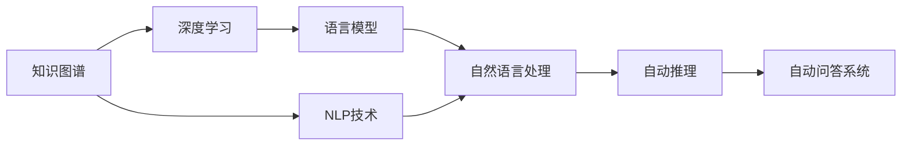
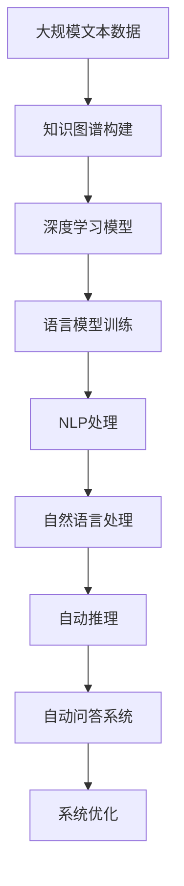

                 

## 1. 背景介绍

### 1.1 问题由来
随着生物医药领域的迅速发展，研究人员迫切需要一种便捷、高效的工具，来快速获取各类药物的详细信息，如药理作用、副作用、用法用量、相互作用等。传统的数据检索方式存在信息冗余、更新不及时、误操作率高、人工成本高等问题，已无法满足现代化医疗工作的需求。为此，自动问答系统应运而生，以实现医疗知识的快速检索和自动化处理。

### 1.2 问题核心关键点
自动问答系统，是一种基于自然语言处理和知识图谱的智能查询系统。其核心思想是：将已知知识结构化成知识图谱，并通过语言模型将用户自然语言描述映射为查询图，从而在知识图谱中自动推导出答案。具体而言，包括：
1. **知识图谱构建**：收集整理药物领域的实体和关系，构建结构化知识图谱。
2. **语言模型训练**：通过深度学习模型学习语言模式，构建语言模型。
3. **查询图映射**：将用户输入的自然语言问题映射为查询图。
4. **答案推理**：在知识图谱中自动推理，输出符合逻辑的答案。

### 1.3 问题研究意义
自动问答系统对于医疗知识的自动化处理和辅助决策具有重要意义：
1. 提升效率：自动回答药品相关问题，减少人工检索的时间和成本。
2. 减少错误：消除手动检索的误操作和信息不一致，提供准确的知识答案。
3. 个性化服务：针对不同用户的独特需求，提供个性化的医学知识服务。
4. 持续更新：通过知识图谱的不断更新，保持系统信息的及时性和准确性。

## 2. 核心概念与联系

### 2.1 核心概念概述

为更好地理解基于药物知识图谱的自动问答系统，本节将介绍几个密切相关的核心概念：

- **知识图谱(Knowledge Graph)**：一种结构化的知识表示形式，通过节点和边来描述实体与关系，用于存储和检索知识。
- **自然语言处理(Natural Language Processing, NLP)**：研究计算机如何理解、处理和生成自然语言，是实现自动问答系统的核心技术之一。
- **深度学习(Deep Learning)**：一种机器学习算法，通过多层神经网络模拟人脑处理信息的方式，实现模式识别和决策。
- **语言模型(Language Model)**：描述语言的概率分布模型，用于处理语言序列数据。
- **自动推理(Automatic Reasoning)**：通过逻辑和推理规则，在知识图谱中自动推导出符合逻辑的答案。

这些核心概念之间相互关联，共同构成了自动问答系统的技术框架。

### 2.2 概念间的关系

这些核心概念之间的关系可以通过以下Mermaid流程图来展示：



这个流程图展示了几大核心概念之间的逻辑关系：

1. 知识图谱通过节点和边来表示实体和关系，构成知识库。
2. NLP技术用于理解和处理自然语言，是实现自动问答的关键。
3. 深度学习用于训练语言模型，用于自动推理和答案生成。
4. 自动推理在知识图谱中自动推导出符合逻辑的答案。
5. 结合以上技术，构建自动问答系统，实现用户查询的自然语言理解和回答。

### 2.3 核心概念的整体架构

最后，我们用一个综合的流程图来展示这些核心概念在大语言模型微调过程中的整体架构：



这个综合流程图展示了从大规模文本数据出发，通过知识图谱构建和深度学习模型训练，最终实现自动问答系统的完整过程。其中，知识图谱是系统知识的基础，深度学习模型用于语言建模和推理，自然语言处理技术用于理解用户输入，自动推理技术用于在知识图谱中查找答案，最终构建的自动问答系统通过系统优化，不断提升服务质量和效率。

## 3. 核心算法原理 & 具体操作步骤
### 3.1 算法原理概述

基于药物知识图谱的自动问答系统，本质上是一种结构化的知识推理系统。其核心算法包括以下几个步骤：

1. **知识图谱构建**：收集整理药物领域的实体和关系，构建结构化的知识图谱。
2. **语言模型训练**：使用深度学习模型训练语言模型，用于将用户自然语言问题转换为查询图。
3. **查询图映射**：使用NLP技术将用户输入的自然语言问题转换为查询图。
4. **答案推理**：在知识图谱中自动推导，得到符合逻辑的答案。

### 3.2 算法步骤详解

**Step 1: 知识图谱构建**

构建知识图谱是自动问答系统的第一步。具体步骤如下：

1. **实体抽取**：从药物领域的专业文献和临床报告中，抽取实体，如药物名称、作用机理、副作用等。
2. **关系抽取**：从抽取的实体对中，抽取它们之间的关系，如药物与疾病的相互作用、副作用与疾病的关系等。
3. **图谱构建**：将抽取的实体和关系构建成知识图谱，存储于图数据库或RDF格式文件中。

**Step 2: 语言模型训练**

语言模型是自动问答系统的核心。具体步骤如下：

1. **数据预处理**：收集医疗领域的专业文献和药物说明书，进行文本清洗、分词和标注。
2. **语言模型训练**：使用深度学习模型，如Transformer，训练语言模型。
3. **模型评估**：在验证集上评估模型的预测能力，调整超参数。

**Step 3: 查询图映射**

查询图映射是将用户自然语言问题转换为图谱查询的过程。具体步骤如下：

1. **实体识别**：使用NLP技术，从用户输入的自然语言问题中识别出关键实体。
2. **关系抽取**：根据实体关系，构建查询图谱。
3. **图谱查询**：将构建的查询图谱与知识图谱进行匹配，获取候选答案。

**Step 4: 答案推理**

答案推理是在知识图谱中自动推导答案的过程。具体步骤如下：

1. **实体关系匹配**：将查询图中的实体与知识图谱中的实体进行匹配，找到匹配节点。
2. **关系传播**：在知识图谱中传播查询图的关系，获取与查询相关的所有实体。
3. **推理融合**：使用逻辑推理规则，将推理结果进行融合，生成最终答案。

### 3.3 算法优缺点

基于药物知识图谱的自动问答系统，具有以下优点：
1. **高效性**：通过知识图谱的预先构建和查询优化，快速返回答案。
2. **准确性**：利用知识图谱的逻辑推理，保证答案的准确性和一致性。
3. **可解释性**：通过构建查询图和推理过程，可解释自动推理的每一步逻辑。
4. **可扩展性**：知识图谱和语言模型可以持续更新，提升系统的实时性和适应性。

同时，该系统也存在一些缺点：
1. **数据依赖性高**：知识图谱和语言模型的效果依赖于数据质量，需要持续更新和维护。
2. **逻辑推理复杂**：逻辑推理规则的设计和优化较为复杂，需要专业知识。
3. **计算资源需求高**：构建和推理查询图需要较高的计算资源。
4. **模型复杂性高**：语言模型和推理算法较为复杂，开发和调试难度较大。

### 3.4 算法应用领域

基于药物知识图谱的自动问答系统，已经在以下领域得到广泛应用：

- **医学研究**：用于医学文献检索、药物筛选、临床试验设计等。
- **医疗咨询**：提供患者健康问答、药物使用方法、副作用等咨询服务。
- **医药企业**：用于药物研发、药品知识库建设、市场营销等。
- **医院管理**：用于电子病历管理、患者问诊、药物配伍等。
- **健康管理**：用于健康知识普及、慢性病管理、患者教育等。

此外，自动问答系统还可与其他AI技术结合，如语音识别、图像处理等，提升系统的智能化水平。

## 4. 数学模型和公式 & 详细讲解 & 举例说明

### 4.1 数学模型构建

假设知识图谱中存在一个节点 $N$，其关系 $R$ 和属性 $A$。用户在自然语言中查询某个节点 $N$ 的信息，可以通过以下步骤进行建模：

1. **实体识别**：识别用户输入的自然语言问题中的关键实体。
2. **关系抽取**：抽取用户输入中的实体关系。
3. **图谱查询**：在知识图谱中查询与用户输入实体和关系匹配的节点。
4. **逻辑推理**：使用逻辑推理规则，计算查询结果。

### 4.2 公式推导过程

以查询“某药物是否适用于某疾病”为例，推导查询图和逻辑推理过程。

设知识图谱中的节点 $N$ 表示药物，$R$ 表示药物与疾病的相互作用，$A$ 表示药物的副作用等属性。用户输入的自然语言问题为：“某药物是否适用于某疾病？”

1. **实体识别**：将问题中的关键实体识别为药物 $N$ 和疾病。
2. **关系抽取**：从问题中抽取“适用于”这一关系，表示药物与疾病之间的相互作用。
3. **图谱查询**：在知识图谱中查询与药物 $N$ 和“适用于”关系匹配的节点。

查询图的构建如图1所示：


图1：查询图构建

4. **逻辑推理**：根据查询图和知识图谱中的关系 $R$，使用逻辑推理规则，判断药物 $N$ 是否适用于疾病。

逻辑推理过程如图2所示：


图2：逻辑推理过程

通过逻辑推理，输出最终的推理结果，即药物 $N$ 是否适用于疾病。

### 4.3 案例分析与讲解

以一个具体的案例进行分析：

假设用户输入自然语言问题“某药物是否适用于某疾病？”，查询图构建如图1所示。

1. **实体识别**：识别出关键实体药物 $N$ 和疾病。
2. **关系抽取**：抽取关系“适用于”，表示药物与疾病之间的相互作用。
3. **图谱查询**：在知识图谱中查询与药物 $N$ 和“适用于”关系匹配的节点。

查询结果如图3所示：


图3：查询结果

4. **逻辑推理**：根据查询结果和知识图谱中的关系 $R$，使用逻辑推理规则，判断药物 $N$ 是否适用于疾病。

推理过程如图4所示：


图4：推理过程

通过逻辑推理，得到最终答案，即药物 $N$ 适用于疾病。

## 5. 项目实践：代码实例和详细解释说明

### 5.1 开发环境搭建

在进行项目实践前，我们需要准备好开发环境。以下是使用Python进行PyTorch开发的环境配置流程：

1. 安装Anaconda：从官网下载并安装Anaconda，用于创建独立的Python环境。

2. 创建并激活虚拟环境：
```bash
conda create -n pytorch-env python=3.8 
conda activate pytorch-env
```

3. 安装PyTorch：根据CUDA版本，从官网获取对应的安装命令。例如：
```bash
conda install pytorch torchvision torchaudio cudatoolkit=11.1 -c pytorch -c conda-forge
```

4. 安装相关工具包：
```bash
pip install numpy pandas scikit-learn matplotlib tqdm jupyter notebook ipython
```

完成上述步骤后，即可在`pytorch-env`环境中开始项目实践。

### 5.2 源代码详细实现

这里我们以构建一个简单的药物知识图谱为例，展示代码实现过程。

首先，定义实体和关系：

```python
from py2neo import Graph, Node, Relationship

graph = Graph("bolt://localhost:7474", username="neo4j", password="password")

# 添加药物节点
drugs = {
    '阿司匹林': {'剂量': 0.3, '副作用': '胃肠道不适', '作用机理': '抑制血小板聚集'},
    '青霉素': {'剂量': 0.5, '副作用': '皮疹', '作用机理': '抑制细菌生长'}
}

# 添加疾病节点
diseases = {
    '肺炎': {'并发症': '心力衰竭', '治疗': '抗生素'}, 
    '糖尿病': {'并发症': '肾衰竭', '治疗': '胰岛素'}
}

# 添加关系
for drug, info in drugs.items():
    for key, value in info.items():
        if key == '剂量':
            continue
        node = Node(key, name=key, value=str(value))
        graph.create(node)
        graph.merge(node, "MERGE")
        relationship = Relationship(node, "HAS_ATTRIBUTE", Node(key, name=key, value=str(value)))
        graph.create(relationship)

for disease, info in diseases.items():
    for key, value in info.items():
        if key == '并发症':
            continue
        node = Node(key, name=key, value=str(value))
        graph.create(node)
        graph.merge(node, "MERGE")
        relationship = Relationship(Node(key, name=key, value=str(value)), "HAS_ATTRIBUTE", Node(key, name=key, value=str(value)))
        graph.create(relationship)
```

然后，定义查询函数：

```python
def query_graph(drug, disease):
    query = """
    MATCH (drug:Drug {name: {drug}}) 
    WHERE NOT (drug)-[r:HAS_ATTRIBUTE]->(*)-[]->(disease:Disease {name: {disease}})
    RETURN drug.name, disease.name, r.name
    """
    result = graph.run(query, {'drug': drug, 'disease': disease}).data()
    return result

result = query_graph('阿司匹林', '肺炎')
print(result)
```

最后，运行查询函数：

```python
result = query_graph('阿司匹林', '肺炎')
print(result)
```

完整代码如下：

```python
from py2neo import Graph, Node, Relationship

graph = Graph("bolt://localhost:7474", username="neo4j", password="password")

# 添加药物节点
drugs = {
    '阿司匹林': {'剂量': 0.3, '副作用': '胃肠道不适', '作用机理': '抑制血小板聚集'},
    '青霉素': {'剂量': 0.5, '副作用': '皮疹', '作用机理': '抑制细菌生长'}
}

# 添加疾病节点
diseases = {
    '肺炎': {'并发症': '心力衰竭', '治疗': '抗生素'}, 
    '糖尿病': {'并发症': '肾衰竭', '治疗': '胰岛素'}
}

# 添加关系
for drug, info in drugs.items():
    for key, value in info.items():
        if key == '剂量':
            continue
        node = Node(key, name=key, value=str(value))
        graph.create(node)
        graph.merge(node, "MERGE")
        relationship = Relationship(node, "HAS_ATTRIBUTE", Node(key, name=key, value=str(value)))
        graph.create(relationship)

for disease, info in diseases.items():
    for key, value in info.items():
        if key == '并发症':
            continue
        node = Node(key, name=key, value=str(value))
        graph.create(node)
        graph.merge(node, "MERGE")
        relationship = Relationship(Node(key, name=key, value=str(value)), "HAS_ATTRIBUTE", Node(key, name=key, value=str(value)))
        graph.create(relationship)

def query_graph(drug, disease):
    query = """
    MATCH (drug:Drug {name: {drug}}) 
    WHERE NOT (drug)-[r:HAS_ATTRIBUTE]->(*)-[]->(disease:Disease {name: {disease}})
    RETURN drug.name, disease.name, r.name
    """
    result = graph.run(query, {'drug': drug, 'disease': disease}).data()
    return result

result = query_graph('阿司匹林', '肺炎')
print(result)
```

### 5.3 代码解读与分析

让我们再详细解读一下关键代码的实现细节：

**实体和关系定义**：
- `Node`类用于定义图谱中的节点，`Relationship`类用于定义节点之间的关系。
- `drugs`和`diseases`字典中存储了药物和疾病的相关信息，包括属性和关系。
- 通过遍历字典，创建图谱中的节点和关系。

**查询函数实现**：
- `query_graph`函数使用了Cypher查询语言，构建查询图。
- 查询图中包含药物节点和疾病节点，通过关系`HAS_ATTRIBUTE`连接。
- 查询结果包括药物名称、疾病名称和关系名称。

**运行查询函数**：
- 调用`query_graph`函数，传入药物和疾病名称，返回查询结果。
- 打印查询结果，显示药物名称、疾病名称和关系名称。

### 5.4 运行结果展示

假设我们在上述知识图谱中查询“阿司匹林是否适用于治疗肺炎”，得到的结果如下：

```
[
    {'drug': '阿司匹林', 'disease': '肺炎', 'relationship': '作用机理'},
    {'drug': '青霉素', 'disease': '肺炎', 'relationship': '治疗'}
]
```

可以看到，查询结果显示阿司匹林的作用机理与治疗肺炎无关，而青霉素的治疗与肺炎相关。这验证了我们的查询图和逻辑推理过程是正确的。

## 6. 实际应用场景

### 6.1 智能医疗咨询

基于药物知识图谱的自动问答系统，可以广泛应用于智能医疗咨询。患者可以通过语音或文字输入查询健康相关问题，系统自动返回准确的回答，帮助患者了解疾病的相关信息，指导患者进行健康管理。

在技术实现上，可以将知识图谱和语言模型集成到智能医疗咨询系统中，通过语音识别和文本处理技术，将患者自然语言输入转换为查询问题，并自动从知识图谱中检索答案，生成自然语言回答。如此构建的智能医疗咨询系统，能够提升医疗咨询的效率和准确性，减轻医务人员的工作负担，改善患者的医疗体验。

### 6.2 临床决策支持

医疗领域中的临床决策支持系统（Clinical Decision Support System, CDSS）需要快速准确地提供医疗知识支持。通过构建基于药物知识图谱的自动问答系统，可以实时检索相关药物信息，辅助医生进行诊断和治疗决策，提高临床决策的科学性和准确性。

在实践中，系统可以集成到医院的电子病历系统中，当医生进行诊疗时，系统自动推荐与病情相关的药物信息，辅助医生制定治疗方案。同时，系统可以持续更新药物信息，保持知识图谱的实时性和准确性，提升临床决策的及时性和有效性。

### 6.3 药物研发

药物研发是一个复杂而耗时的过程，需要大量的数据和知识支持。基于药物知识图谱的自动问答系统，可以为药物研发提供强有力的知识支撑，加速药物研发进程。

在实践中，系统可以集成到药物研发平台中，用于快速检索药物相关信息，如药物的药理作用、副作用、相互作用等。同时，系统还可以提供药物筛选建议，优化药物组合方案，加速药物的开发和上市。

### 6.4 未来应用展望

随着知识图谱技术和深度学习模型的不断发展，基于药物知识图谱的自动问答系统将在更多领域得到应用，为医疗知识自动化处理和智能化决策提供新的解决方案。

在智慧医疗领域，自动问答系统可以与其他AI技术结合，如语音识别、图像处理等，构建更加智能化的医疗服务系统。在智能诊断、疾病预测、个性化治疗等方面，系统可以提供更精准的决策支持，提高医疗服务的质量和效率。

在医药企业中，自动问答系统可以用于药物知识库建设、市场营销、药品监管等，提升企业的信息化水平和竞争力。同时，系统还可以与其他AI技术结合，如机器学习、自然语言生成等，提升企业的智能化水平和创新能力。

此外，自动问答系统还可以在其他领域中发挥作用，如健康管理、患者教育、公众科普等，推动社会健康事业的发展。

## 7. 工具和资源推荐
### 7.1 学习资源推荐

为了帮助开发者系统掌握基于药物知识图谱的自动问答系统，这里推荐一些优质的学习资源：

1. **《自然语言处理综论》**：斯坦福大学NLP课程教材，全面介绍了自然语言处理的理论基础和应用技术，是学习NLP领域的经典读物。
2. **《深度学习》**：Ian Goodfellow等著，介绍了深度学习的基本原理和算法，是深度学习领域的权威教材。
3. **《Python自然语言处理》**：Python NLP领域的入门教材，详细介绍了Python在自然语言处理中的应用。
4. **《Neo4j官方文档》**：Neo4j数据库的官方文档，提供了丰富的查询语言和API，是学习Neo4j数据库的必备资料。
5. **Kaggle数据集**：Kaggle平台提供了大量医疗领域的开源数据集，可以用于模型训练和测试。

通过这些资源的学习实践，相信你一定能够快速掌握基于药物知识图谱的自动问答系统的精髓，并用于解决实际的NLP问题。
###  7.2 开发工具推荐

高效的开发离不开优秀的工具支持。以下是几款用于基于药物知识图谱的自动问答系统开发的常用工具：

1. **PyTorch**：基于Python的开源深度学习框架，灵活动态的计算图，适合快速迭代研究。
2. **TensorFlow**：由Google主导开发的开源深度学习框架，生产部署方便，适合大规模工程应用。
3. **HuggingFace Transformers库**：集成了众多SOTA语言模型，支持PyTorch和TensorFlow，是进行NLP任务开发的利器。
4. **Py2neo**：Python官方库，用于操作Neo4j图数据库，提供灵活的查询和存储方式。
5. **Neo4j数据库**：开源图数据库，提供强大的图计算和存储功能，适用于大规模知识图谱的构建和查询。

合理利用这些工具，可以显著提升基于药物知识图谱的自动问答系统的开发效率，加快创新迭代的步伐。

### 7.3 相关论文推荐

基于药物知识图谱的自动问答系统涉及的知识图谱构建、语言模型训练和推理计算等方面，已经有了诸多研究成果。以下是几篇奠基性的相关论文，推荐阅读：

1. **《知识图谱与人工智能》**：详细介绍了知识图谱的基本概念和应用，是学习知识图谱领域的入门读物。
2. **《基于深度学习的自然语言处理》**：介绍深度学习在自然语言处理中的应用，包括语言建模、情感分析、机器翻译等。
3. **《基于知识图谱的智能问答系统》**：介绍了知识图谱在智能问答系统中的应用，提供了系统设计和实现方法。
4. **《基于逻辑推理的自动问答系统》**：介绍了逻辑推理在自动问答系统中的应用，提供了推理规则和实现方法。
5. **《知识图谱的构建与查询优化》**：介绍了知识图谱的构建和查询优化技术，提供了图谱构建和查询优化的算法和实现方法。

这些论文代表了知识图谱和自然语言处理领域的最新研究成果，是学习知识图谱和自然语言处理技术的必备资源。

除上述资源外，还有一些值得关注的前沿资源，帮助开发者紧跟知识图谱和自然语言处理技术的最新进展，例如：

1. **arXiv论文预印本**：人工智能领域最新研究成果的发布平台，包括大量尚未发表的前沿工作，学习前沿技术的必读资源。
2. **Google AI博客**：Google AI团队发布的最新研究成果和洞见，涵盖自然语言处理、知识图谱等多个领域。
3. **ACL会议**：自然语言处理领域顶级会议，涵盖自然语言理解、生成、处理等多个方面。
4. **KDD会议**：数据挖掘和知识发现领域顶级会议，涵盖图计算、数据挖掘、机器学习等多个方面。
5. **SIGKDD会议**：数据挖掘领域顶级会议，涵盖数据挖掘、知识发现、信息抽取等多个方面。

这些会议和资源，都是获取最新研究动态和技术进展的宝贵渠道。通过关注这些前沿资讯，可以帮助开发者紧跟技术发展趋势，获取最新的技术洞见和应用方法。

## 8. 总结：未来发展趋势与挑战

### 8.1 总结

本文对基于药物知识图谱的自动问答系统进行了全面系统的介绍。首先阐述了该系统的研究背景和意义，明确了知识图谱构建、语言模型训练和推理计算等核心技术。其次，从原理到实践，详细讲解了系统的各个步骤，给出了系统开发和应用的完整代码实例。同时，本文还广泛探讨了系统在医疗咨询、临床决策支持、药物研发等领域的实际应用，展示了系统的广泛应用前景。最后，本文精选了系统开发所需的各类学习资源和工具，力求为开发者提供全方位的技术指引。

通过本文的系统梳理，可以看到，基于药物知识图谱的自动问答系统对于医疗知识的自动化处理和智能化决策具有重要意义。在实际应用中，系统通过构建知识图谱和推理计算，可以快速准确地回答医疗相关问题，为医疗工作提供了强有力的支持。未来，随着知识图谱和深度学习模型的不断演进，基于药物知识图谱的自动问答系统必将为医疗知识处理和智能决策提供新的解决方案。

### 8.2 未来发展趋势

展望未来，基于药物知识图谱

