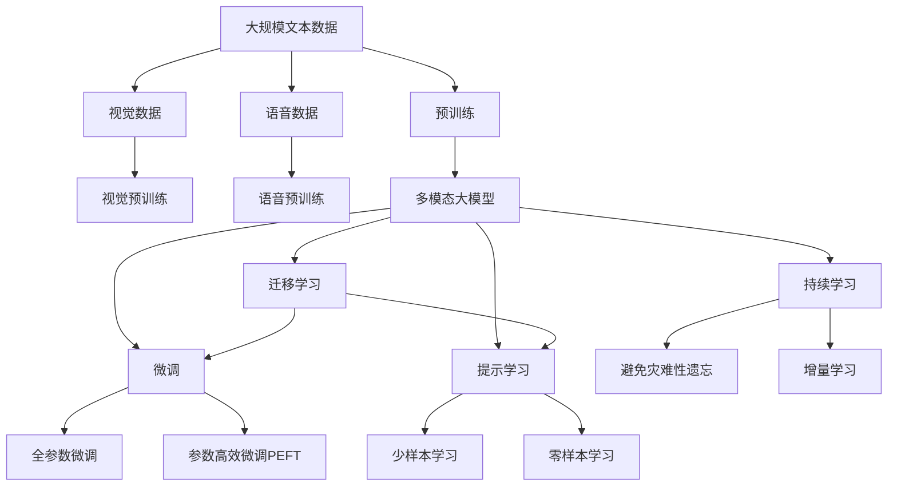
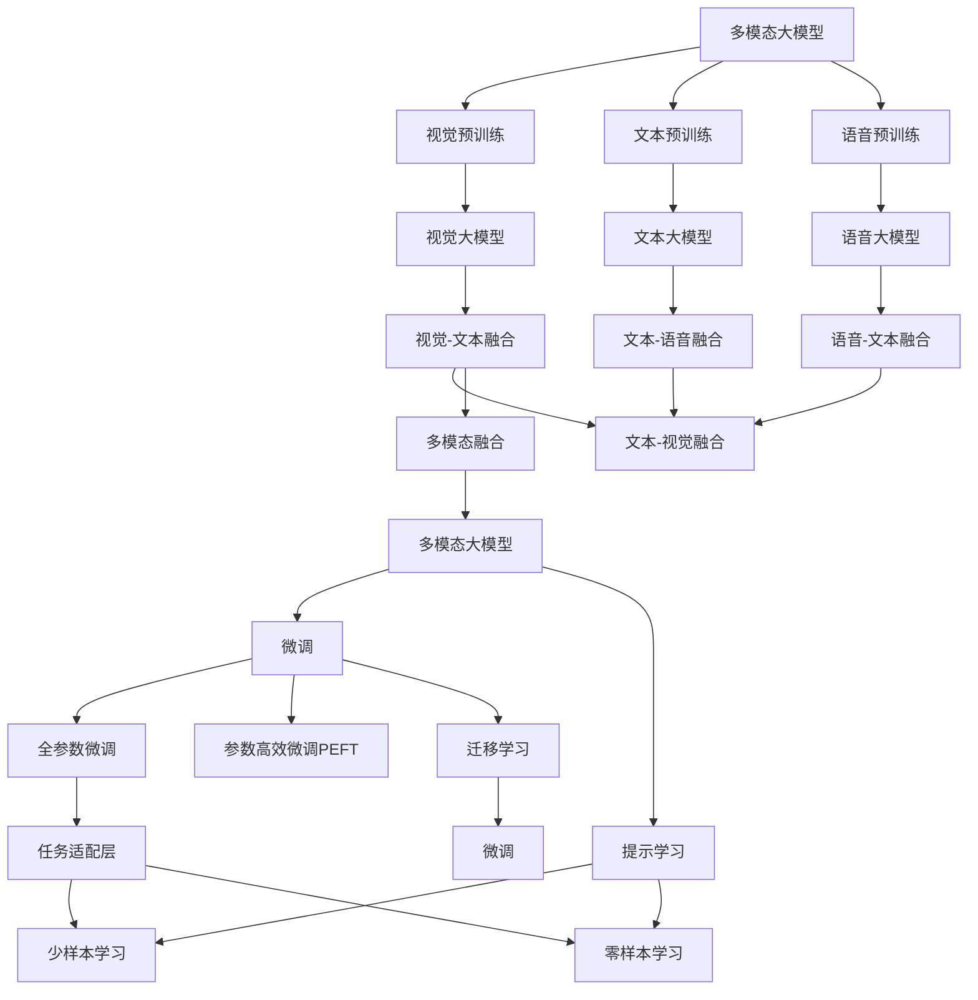
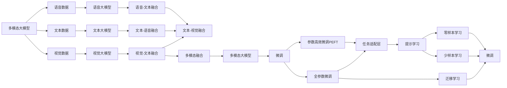
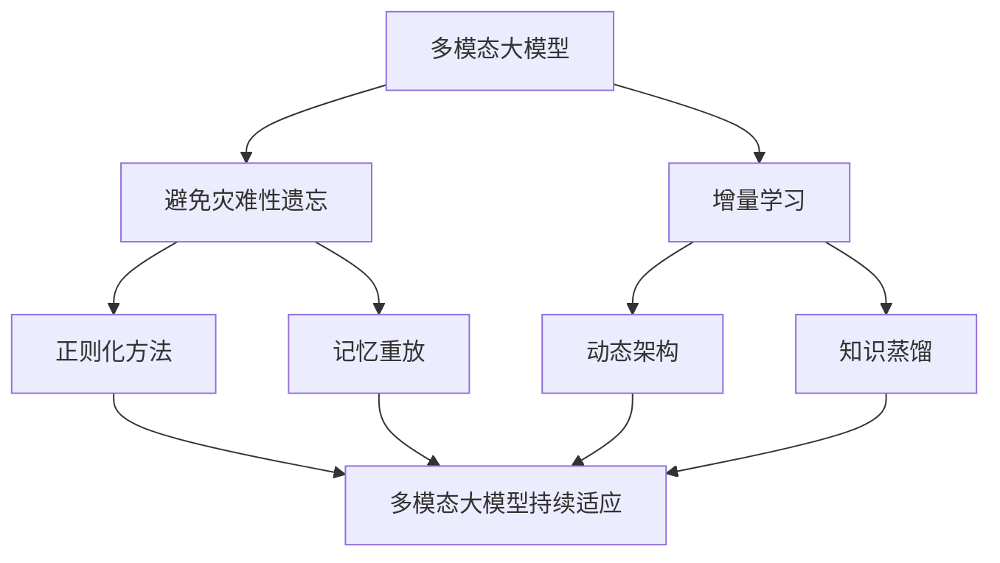
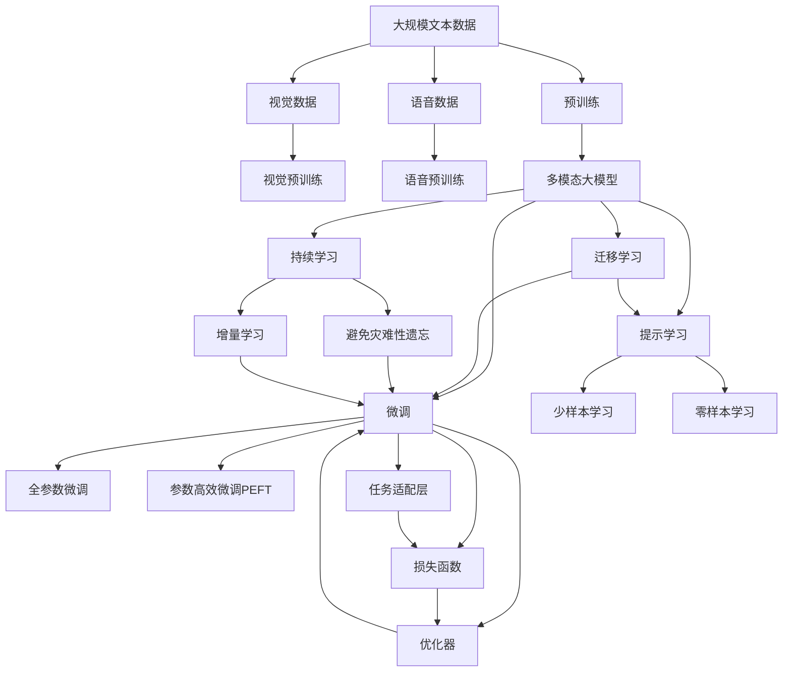

                 

# 多模态大模型：技术原理与实战 微调技术介绍

## 1. 背景介绍

### 1.1 问题由来

近年来，人工智能在各个领域的应用不断深入，特别是深度学习技术的大放异彩。然而，由于深度学习模型对数据量和计算资源的要求较高，传统的单一模态（如文本、图像）的模型已经难以满足复杂多变的应用需求。多模态大模型应运而生，结合了文本、图像、语音等多种模态信息，能够更好地理解和处理现实世界中的复杂问题。

多模态大模型主要分为视觉、文本、语音三大类，其中视觉大模型（如GPT、BERT）、文本大模型（如Vision Transformer）、语音大模型（如wav2vec 2.0）在自然语言处理、计算机视觉、语音识别等领域均取得了显著成效。然而，由于不同模态数据在语义空间中的分布差异较大，如何将多种模态信息融合在一起，构建多模态大模型，并针对特定任务进行微调，成为了一个亟待解决的问题。

### 1.2 问题核心关键点

多模态大模型微调的核心在于如何将不同模态的数据进行有效的融合，并针对特定任务进行优化。具体来说，包括以下几个关键点：

1. **数据融合**：将不同模态的数据（如文本、图像、语音）进行有效的融合，构建统一的多模态表示。
2. **任务适配层**：设计合适的任务适配层，使得模型能够适应特定任务。
3. **模型优化**：通过梯度下降等优化算法，最小化模型在特定任务上的损失函数，从而提升模型的性能。
4. **模型评估**：使用适当的评估指标，如精确率、召回率、F1分数等，评估微调后模型的性能。
5. **持续学习**：通过增量学习等技术，使得模型能够持续更新和适应新的数据。

### 1.3 问题研究意义

研究多模态大模型微调技术，对于拓展大模型的应用范围，提升下游任务的性能，加速人工智能技术的产业化进程，具有重要意义：

1. **降低应用开发成本**：基于成熟的大模型进行微调，可以显著减少从头开发所需的数据、计算和人力等成本投入。
2. **提升模型效果**：微调使得通用大模型更好地适应特定任务，在应用场景中取得更优表现。
3. **加速开发进度**：standing on the shoulders of giants，微调使得开发者可以更快地完成任务适配，缩短开发周期。
4. **带来技术创新**：微调范式促进了对预训练-微调的深入研究，催生了提示学习、少样本学习等新的研究方向。
5. **赋能产业升级**：微调使得AI技术更容易被各行各业所采用，为传统行业数字化转型升级提供新的技术路径。

## 2. 核心概念与联系

### 2.1 核心概念概述

为更好地理解多模态大模型微调方法，本节将介绍几个密切相关的核心概念：

- **大语言模型(Large Language Model, LLM)**：以自回归(如GPT)或自编码(如BERT)模型为代表的大规模预训练语言模型。通过在大规模无标签文本语料上进行预训练，学习通用的语言表示，具备强大的语言理解和生成能力。
- **视觉大模型(Visual Transformer)**：结合了图像信息的预训练语言模型，如Deformable DETR，通过在大规模图像数据上进行预训练，学习图像特征和语言表示的联合分布。
- **语音大模型(Wav2Vec 2.0)**：以自编码模型为代表，通过在大规模语音数据上进行预训练，学习语音特征和语言表示的联合分布。
- **多模态大模型(Multimodal Large Model, MLMM)**：结合了视觉、文本、语音等多种模态信息的预训练模型，如DALL-E、CLIP，能够同时理解不同模态的信息，构建统一的多模态表示。
- **预训练(Pre-training)**：指在大规模无标签文本或图像等数据上进行自监督学习任务训练通用语言模型的过程。常见的预训练任务包括掩码语言模型、掩码图像模型等。
- **微调(Fine-tuning)**：指在预训练模型的基础上，使用下游任务的少量标注数据，通过有监督学习优化模型在特定任务上的性能。通常只需要调整顶层分类器或解码器，并以较小的学习率更新全部或部分的模型参数。
- **迁移学习(Transfer Learning)**：指将一个领域学习到的知识，迁移应用到另一个不同但相关的领域的学习范式。多模态大模型的预训练-微调过程即是一种典型的迁移学习方式。
- **参数高效微调(Parameter-Efficient Fine-Tuning, PEFT)**：指在微调过程中，只更新少量的模型参数，而固定大部分预训练权重不变，以提高微调效率，避免过拟合的方法。
- **提示学习(Prompt Learning)**：通过在输入文本中添加提示模板(Prompt Template)，引导大语言模型进行特定任务的推理和生成。可以在不更新模型参数的情况下，实现零样本或少样本学习。
- **少样本学习(Few-shot Learning)**：指在只有少量标注样本的情况下，模型能够快速适应新任务的学习方法。在大语言模型中，通常通过在输入中提供少量示例来实现，无需更新模型参数。
- **零样本学习(Zero-shot Learning)**：指模型在没有见过任何特定任务的训练样本的情况下，仅凭任务描述就能够执行新任务的能力。大语言模型通过预训练获得的广泛知识，使其能够理解任务指令并生成相应输出。
- **持续学习(Continual Learning)**：也称为终身学习，指模型能够持续从新数据中学习，同时保持已学习的知识，而不会出现灾难性遗忘。这对于保持多模态大模型的时效性和适应性至关重要。

这些核心概念之间的逻辑关系可以通过以下Mermaid流程图来展示：



这个流程图展示了大语言模型、视觉大模型、语音大模型、多模态大模型的预训练-微调过程，以及提示学习、少样本学习、零样本学习、持续学习等技术之间的逻辑关系。

### 2.2 概念间的关系

这些核心概念之间存在着紧密的联系，形成了多模态大模型微调的完整生态系统。下面我们通过几个Mermaid流程图来展示这些概念之间的关系。

#### 2.2.1 多模态大模型的学习范式



这个流程图展示了多模态大模型的预训练-微调过程，以及提示学习、少样本学习、零样本学习、持续学习等技术之间的逻辑关系。

#### 2.2.2 多模态大模型的微调方法



这个流程图展示了多模态大模型微调的基本流程，以及全参数微调、参数高效微调、任务适配层、提示学习、少样本学习、零样本学习、迁移学习等技术之间的逻辑关系。

#### 2.2.3 多模态大模型的持续学习



这个流程图展示了多模态大模型持续学习的基本原理，以及正则化方法、记忆重放、动态架构、知识蒸馏等技术如何帮助模型持续适应新的数据。

### 2.3 核心概念的整体架构

最后，我们用一个综合的流程图来展示这些核心概念在大模型微调过程中的整体架构：



这个综合流程图展示了从预训练到微调，再到持续学习的完整过程。多模态大模型首先在大规模文本、视觉、语音数据上进行预训练，然后通过微调（包括全参数微调和参数高效微调）或提示学习（包括少样本学习和零样本学习）来适应下游任务。最后，通过持续学习技术，模型可以不断更新和适应新的数据。 通过这些流程图，我们可以更清晰地理解多模态大模型微调过程中各个核心概念的关系和作用，为后续深入讨论具体的微调方法和技术奠定基础。

## 3. 核心算法原理 & 具体操作步骤
### 3.1 算法原理概述

基于监督学习的多模态大模型微调，本质上是一个有监督的细粒度迁移学习过程。其核心思想是：将预训练的多模态大模型视作一个强大的"特征提取器"，通过在特定任务上标注数据上进行有监督的训练，优化模型在该任务上的性能。

形式化地，假设预训练的多模态大模型为 $M_{\theta}$，其中 $\theta$ 为预训练得到的模型参数。给定下游任务 $T$ 的标注数据集 $D=\{(x_i, y_i)\}_{i=1}^N$，微调的目标是找到新的模型参数 $\hat{\theta}$，使得：

$$
\hat{\theta}=\mathop{\arg\min}_{\theta} \mathcal{L}(M_{\theta},D)
$$

其中 $\mathcal{L}$ 为针对任务 $T$ 设计的损失函数，用于衡量模型预测输出与真实标签之间的差异。常见的损失函数包括交叉熵损失、均方误差损失等。

通过梯度下降等优化算法，微调过程不断更新模型参数 $\theta$，最小化损失函数 $\mathcal{L}$，使得模型输出逼近真实标签。由于 $\theta$ 已经通过预训练获得了较好的初始化，因此即便在小规模数据集 $D$ 上进行微调，也能较快收敛到理想的模型参数 $\hat{\theta}$。

### 3.2 算法步骤详解

基于监督学习的多模态大模型微调一般包括以下几个关键步骤：

**Step 1: 准备预训练模型和数据集**
- 选择合适的预训练多模态大模型 $M_{\theta}$ 作为初始化参数，如 Deformable DETR、CLIP、Vision Transformer 等。
- 准备下游任务 $T$ 的标注数据集 $D$，划分为训练集、验证集和测试集。一般要求标注数据与预训练数据的分布不要差异过大。

**Step 2: 添加任务适配层**
- 根据任务类型，在预训练多模态大模型的顶层设计合适的输出层和损失函数。
- 对于分类任务，通常在顶层添加线性分类器和交叉熵损失函数。
- 对于生成任务，通常使用语言模型的解码器输出概率分布，并以负对数似然为损失函数。

**Step 3: 设置微调超参数**
- 选择合适的优化算法及其参数，如 AdamW、SGD 等，设置学习率、批大小、迭代轮数等。
- 设置正则化技术及强度，包括权重衰减、Dropout、Early Stopping 等。
- 确定冻结预训练参数的策略，如仅微调顶层，或全部参数都参与微调。

**Step 4: 执行梯度训练**
- 将训练集数据分批次输入模型，前向传播计算损失函数。
- 反向传播计算参数梯度，根据设定的优化算法和学习率更新模型参数。
- 周期性在验证集上评估模型性能，根据性能指标决定是否触发 Early Stopping。
- 重复上述步骤直到满足预设的迭代轮数或 Early Stopping 条件。

**Step 5: 测试和部署**
- 在测试集上评估微调后模型 $M_{\hat{\theta}}$ 的性能，对比微调前后的精度提升。
- 使用微调后的模型对新样本进行推理预测，集成到实际的应用系统中。
- 持续收集新的数据，定期重新微调模型，以适应数据分布的变化。

以上是基于监督学习微调多模态大模型的一般流程。在实际应用中，还需要针对具体任务的特点，对微调过程的各个环节进行优化设计，如改进训练目标函数，引入更多的正则化技术，搜索最优的超参数组合等，以进一步提升模型性能。

### 3.3 算法优缺点

基于监督学习的多模态大模型微调方法具有以下优点：

1. 简单高效。只需准备少量标注数据，即可对预训练模型进行快速适配，获得较大的性能提升。
2. 通用适用。适用于各种多模态NLP任务，包括分类、匹配、生成等，设计简单的任务适配层即可实现微调。
3. 参数高效。利用参数高效微调技术，在固定大部分预训练参数的情况下，仍可取得不错的提升。
4. 效果显著。在学术界和工业界的诸多任务上，基于微调的方法已经刷新了最先进的性能指标。

同时，该方法也存在一定的局限性：

1. 依赖标注数据。微调的效果很大程度上取决于标注数据的质量和数量，获取高质量标注数据的成本较高。
2. 迁移能力有限。当目标任务与预训练数据的分布差异较大时，微调的性能提升有限。
3. 负面效果传递。预训练模型的固有偏见、有害信息等，可能通过微调传递到下游任务，造成负面影响。
4. 可解释性不足。微调模型的决策过程通常缺乏可解释性，难以对其推理逻辑进行分析和调试。

尽管存在这些局限性，但就目前而言，基于监督学习的微调方法仍是大模型应用的最主流范式。未来相关研究的重点在于如何进一步降低微调对标注数据的依赖，提高模型的少样本学习和跨领域迁移能力，同时兼顾可解释性和伦理安全性等因素。

### 3.4 算法应用领域

基于多模态大模型微调的监督学习方法，在NLP领域已经得到了广泛的应用，覆盖了几乎所有常见任务，例如：

- 文本分类：如情感分析、主题分类、意图识别等。通过微调使模型学习文本-标签映射。
- 命名实体识别：识别文本中的人名、地名、机构名等特定实体。通过微调使模型掌握实体边界和类型。
- 关系抽取：从文本中抽取实体之间的语义关系。通过微调使模型学习实体-关系三元组。
- 问答系统：对自然语言问题给出答案。将问题-答案对作为微调数据，训练模型学习匹配答案。
- 机器翻译：将源语言文本翻译成目标语言。通过微调使模型学习语言-语言映射。
- 文本摘要：将长文本压缩成简短摘要。将文章-摘要对作为微调数据，使模型学习抓取要点。
- 对话系统：使机器能够与人自然对话。将多轮对话历史作为上下文，微调模型进行回复生成。

除了上述这些经典任务外，多模态大模型微调也被创新性地应用到更多场景中，如可控文本生成、常识推理、代码生成、数据增强等，为NLP技术带来了全新的突破。随着预训练模型和微调方法的不断进步，相信NLP技术将在更广阔的应用领域大放异彩。

## 4. 数学模型和公式 & 详细讲解
### 4.1 数学模型构建

本节将使用数学语言对基于监督学习的多模态大模型微调过程进行更加严格的刻画。

记预训练多模态大模型为 $M_{\theta}:\mathcal{X} \rightarrow \mathcal{Y}$，其中 $\mathcal{X}$ 为输入空间，$\mathcal{Y}$ 为输出空间，$\theta \in \mathbb{R}^d$ 为模型参数。假设微调任务的训练集为 $D=\{(x_i,y_i)\}_{i=1}^N, x_i \in \mathcal{X}, y_i \in \mathcal{Y}$。

定义模型 $M_{\theta}$ 在数据样本 $(x,y)$ 上的损失函数为 $\ell(M_{\theta}(x),y)$，则在数据集 $D$ 上的经验风险为：

$$
\mathcal{L}(\theta) = \frac{1}{N} \sum_{i=1}^N \ell(M_{\theta}(x_i),y_i)
$$

其中 $\ell$ 为针对任务 $T$ 设计的损失函数，用于衡量模型预测输出与真实标签之间的差异。常见的损失函数包括交叉熵损失、均方误差损失等。

微调的优化目标是最小化经验风险，即找到最优参数：

$$
\theta^* = \mathop{\arg\min}_{\theta} \mathcal{L}(\theta)
$$

在实践中，我们通常使用基于梯度的优化算法（如SGD、Adam等）来近似求解上述最优化问题。设 $\eta$ 为学习率，$\lambda$ 为正则化系数，则参数的更新公式为：

$$
\theta \leftarrow \theta - \eta \nabla_{\theta}\mathcal{L}(\theta) - \eta\lambda\theta
$$

其中 $\nabla_{\theta}\mathcal{L}(\theta)$ 为损失函数对参数 $\theta$ 的梯度，可通过反向传播算法高效计算。

### 4.2 公式推导过程

以下我们以二分类任务为例，推导交叉熵损失函数及其梯度的计算公式。

假设模型 $M_{\theta}$ 在输入 $x$ 上的输出为 $\hat{y}=M_{\theta}(x) \in [0,1]$，表示样本属于正类的概率。真实标签 $y \in \{0,1\}$。则二分类交叉熵损失函数定义为：

$$
\ell(M_{\theta}(x),y) = -[y\log \hat{y} + (1-y)\log (1-\hat{y})]
$$

将其代入经验风险公式，得：

$$
\mathcal{L}(\theta) = -\frac{1}{N}\sum_{i=1}^N [y_i\log M_{\theta}(x_i)+(1-y_i)\log(1-M_{\theta}(x_i))]
$$

根据链式法则，损失函数对参数 $\theta_k$ 的梯度为：

$$
\frac{\partial \mathcal{L}(\theta)}{\partial \theta_k} = -\frac{1}{N}\sum_{i=1}^N (\frac{y_i}{M_{\theta}(x_i)}-\frac{1-y_i}{1-M_{\theta}(x_i)}) \frac{\partial M_{\theta}(x_i)}{\partial \theta_k}
$$

其中 $\frac{\partial M_{\theta}(x_i)}{\partial \theta_k}$ 可进一步递归展开，利用自动微分技术完成计算。

在得到损失函数的梯度后，即可带入参数更新公式，完成模型的迭代优化。重复上述过程直至收敛，最终得到适应下游任务的最优模型参数 $\theta^*$。

## 5. 项目实践：代码实例和详细解释说明
### 5.1 开发环境搭建

在进行多模态大模型微调实践前，我们需要准备好开发环境。以下是使用Python进行PyTorch开发的环境配置流程：

1. 安装Anaconda：从官网下载并安装Anaconda，用于创建独立的Python环境。

2. 创建并激活虚拟环境：
```bash
conda create -n pytorch-env python=3.8 
conda activate pytorch-env
```

3. 安装PyTorch：根据CUDA版本，从官网获取对应的安装命令。例如：
```bash
conda install pytorch torchvision torchaudio cudatoolkit=11.1 -c pytorch -c conda-forge
```

4. 安装Transformers库：
```bash
pip install transformers
```

5. 安装各类工具包：
```bash
pip install numpy pandas scikit-learn matplotlib tqdm jupyter notebook ipython
```

完成上述步骤后，即可在`pytorch-env`环境中开始多模态大模型的微调实践。

### 5.2 源代码详细实现

下面我们以视觉分类任务为例，给出使用Transformers库对Deformable DETR模型进行微调的PyTorch代码实现。

首先，定义视觉分类任务的数据处理函数：

```python
from transformers import Deformable DETRTokenizer, Deformable DETRForImageClassification
from torch.utils.data import Dataset, DataLoader
import torch
import matplotlib.pyplot as plt
import numpy as np

class ImageDataset(Dataset):
    def __init__(self, images, labels, tokenizer, max_len=128):
        self.images = images
        self.labels = labels
        self.tokenizer = tokenizer
        self.max_len = max_len
        
    def __len__(self):
        return len(self.images)
    
    def __getitem__(self, item):
        image = self.images[item]
        label = self.labels[item]
        
        encoding = self.tokenizer(image, return_tensors='pt', max_length=self.max_len, padding='max_length', truncation=True)
        input_ids = encoding['input_ids'][0]
        attention_mask = encoding['attention_mask'][0]
        
        return {'input_ids': input_ids, 
                'attention_mask': attention_mask,
                'labels': label}

# 标签与id的映射
label2id = {'cat': 0, 'dog': 1, 'bird': 2, 'fish': 3}
id2label = {v: k for k, v in label2id.items()}

# 创建dataset
tokenizer = Deformable DETRTokenizer.from_pretrained('deformable_detr_pretrained_model')
train_dataset = ImageDataset(train_images, train_labels, tokenizer)
dev_dataset = ImageDataset(dev_images, dev_labels, tokenizer)
test_dataset = ImageDataset(test_images, test_labels, tokenizer)
```

然后，定义模型和优化器：

```python
from transformers import AdamW

model = Deformable DETRForImageClassification.from_pretrained('deformable_detr_pretrained_model', num_labels=len(label2id))

optimizer = AdamW(model.parameters(), lr=2e-5)
```

接着，定义训练和评估函数：

```python
device = torch.device('cuda') if torch.cuda.is_available() else torch.device('cpu')
model.to(device)

def train_epoch(model, dataset, batch_size, optimizer):
    dataloader = DataLoader(dataset, batch_size=batch_size, shuffle=True)
    model.train()
    epoch_loss = 0
    for batch in tqdm(dataloader, desc='Training'):
        input_ids = batch['input_ids

