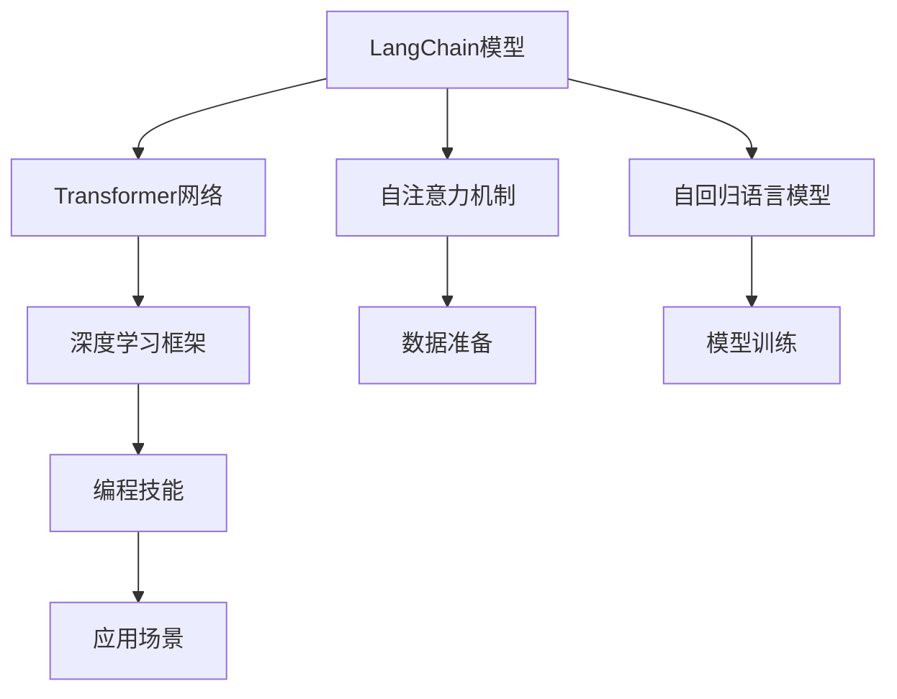
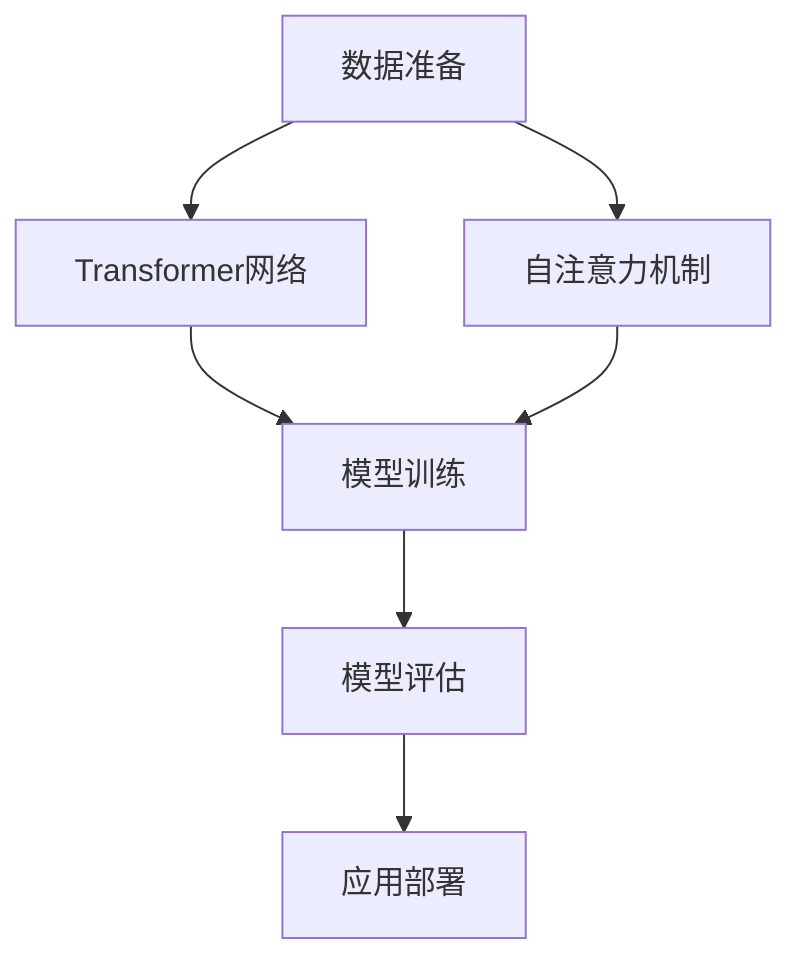
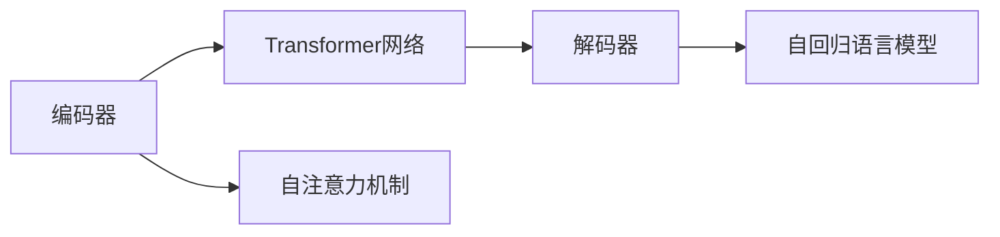
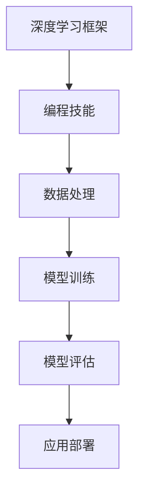
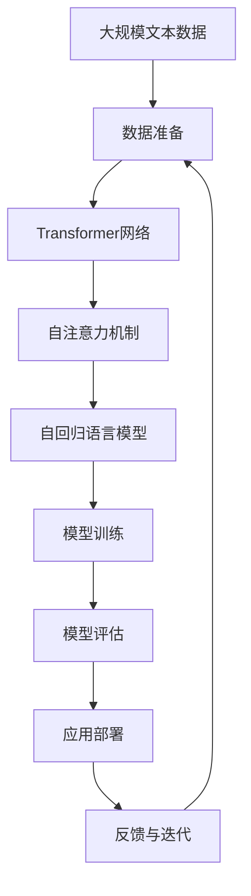

                 

# 【LangChain编程：从入门到实践】项目代码与文档

> 关键词：LangChain, 编程, 项目代码, 实践, 深度学习, 自然语言处理, 应用场景, 工具与资源推荐

## 1. 背景介绍

### 1.1 问题由来
随着人工智能技术的迅猛发展，自然语言处理（NLP）领域涌现出一系列革命性的进展，如深度学习在NLP中的应用。其中，基于深度学习的语言链（LangChain）模型因其强大的语言生成能力和丰富的语义理解能力，成为了NLP研究的热点。本文旨在通过项目代码和文档的详细讲解，帮助读者从入门到实践，掌握LangChain编程技能。

### 1.2 问题核心关键点
LangChain模型的核心原理在于利用深度学习技术，通过多层神经网络结构，对输入的自然语言文本进行编码、生成和解码，从而实现对语言的理解和生成。其核心算法包括Transformer网络、自注意力机制和自回归语言模型。

本文将重点介绍LangChain模型的架构与编程实践，涵盖从模型构建、数据准备、模型训练到应用部署的各个环节。通过这些步骤，读者可以深入理解LangChain模型的原理与实现细节，掌握其编程技巧和应用方法。

### 1.3 问题研究意义
掌握LangChain编程技能，有助于提升自然语言处理的实际应用能力，加速AI技术在各行业中的应用。通过对LangChain模型的深入理解和实践，读者可以构建更具实用价值的自然语言处理系统，推动人工智能技术在更多领域落地应用。

## 2. 核心概念与联系

### 2.1 核心概念概述

为更好地理解LangChain模型的编程实践，本节将介绍几个关键概念：

- **LangChain模型**：基于深度学习的语言链模型，通过多层神经网络结构，对输入的自然语言文本进行编码、生成和解码。其核心架构包括Transformer网络、自注意力机制和自回归语言模型。

- **Transformer网络**：一种基于自注意力机制的神经网络结构，能够有效处理序列数据，广泛应用于自然语言处理领域。

- **自注意力机制**：一种用于计算序列中每个位置与其它位置相关性的机制，在Transformer网络中起着核心作用。

- **自回归语言模型**：一种基于自回归原理的语言模型，能够预测文本序列的下一个词语，广泛应用于文本生成任务。

- **编程技能**：包括但不限于Python编程、深度学习框架的使用、数据处理和模型训练等技能。

- **应用场景**：如机器翻译、文本生成、问答系统、情感分析等。

这些概念之间的逻辑关系可以通过以下Mermaid流程图来展示：



这个流程图展示了LangChain模型的核心概念及其之间的关系：

1. LangChain模型通过Transformer网络、自注意力机制和自回归语言模型实现语言理解与生成。
2. 深度学习框架为模型的训练和部署提供了强大的工具。
3. 数据准备和模型训练是编程实践的核心步骤。
4. 编程技能的应用促进了模型的实际部署与应用。
5. 模型在不同的应用场景中具有广泛的应用前景。

### 2.2 概念间的关系

这些核心概念之间存在着紧密的联系，形成了LangChain模型的完整生态系统。下面我们通过几个Mermaid流程图来展示这些概念之间的关系。

#### 2.2.1 LangChain模型的学习范式



这个流程图展示了LangChain模型从数据准备到应用部署的全过程。

#### 2.2.2 LangChain模型的架构



这个流程图展示了LangChain模型的架构。

#### 2.2.3 LangChain模型的编程范式



这个流程图展示了LangChain模型编程实践的全过程。

### 2.3 核心概念的整体架构

最后，我们用一个综合的流程图来展示这些核心概念在大语言模型编程实践中的整体架构：



这个综合流程图展示了从数据准备到应用部署，再到模型迭代优化的完整过程。

## 3. 核心算法原理 & 具体操作步骤
### 3.1 算法原理概述

LangChain模型的核心算法包括Transformer网络、自注意力机制和自回归语言模型。其基本原理是：

- **Transformer网络**：Transformer网络通过自注意力机制，对输入的序列数据进行编码和解码，学习序列中的依赖关系，从而实现对语言的理解与生成。

- **自注意力机制**：自注意力机制通过计算序列中每个位置与其他位置的注意力权重，捕捉序列中的局部和全局依赖关系。

- **自回归语言模型**：自回归语言模型通过预测序列中的下一个词语，实现对语言的生成和理解。

在实际编程中，我们将重点介绍如何使用这些核心算法实现LangChain模型的构建与训练。

### 3.2 算法步骤详解

LangChain模型的编程实践可以分为以下几个步骤：

**Step 1: 数据准备**
- 收集和预处理文本数据，将其转换为模型所需的格式。
- 使用Python的Pandas和NumPy库进行数据清洗和处理。

**Step 2: 构建模型**
- 使用TensorFlow或PyTorch等深度学习框架，构建Transformer网络。
- 实现自注意力机制和自回归语言模型，进行模型定义。

**Step 3: 模型训练**
- 定义损失函数和优化器，进行模型训练。
- 使用GPU或TPU等硬件加速，进行高效的模型训练。

**Step 4: 模型评估与部署**
- 在验证集上进行模型评估，调整超参数，提高模型性能。
- 将训练好的模型进行序列化，部署到生产环境中，进行应用部署。

### 3.3 算法优缺点

LangChain模型的优点包括：

- **强大的语言理解能力**：通过Transformer网络、自注意力机制和自回归语言模型，LangChain模型具备强大的语言理解能力，能够处理复杂的语言结构和关系。
- **高效的并行计算**：Transformer网络中的自注意力机制支持高效的并行计算，能够利用多核CPU和GPU进行加速。
- **良好的泛化能力**：LangChain模型在多种自然语言处理任务上表现优异，具备良好的泛化能力。

缺点包括：

- **计算资源需求高**：由于模型参数量较大，LangChain模型对计算资源的要求较高，需要高性能的GPU或TPU进行训练和推理。
- **训练时间长**：模型训练时间较长，需要大量的计算资源和长时间的处理。

### 3.4 算法应用领域

LangChain模型在自然语言处理领域有广泛的应用，如：

- 机器翻译：将一种语言的文本翻译成另一种语言。
- 文本生成：生成具有特定风格的文本，如新闻报道、小说、诗歌等。
- 问答系统：回答用户提出的自然语言问题。
- 情感分析：分析文本中的情感倾向，如积极、消极或中性。

此外，LangChain模型还可以应用于更多的NLP任务，如文本摘要、命名实体识别、语义分析等，展示了其在NLP领域的广泛应用前景。

## 4. 数学模型和公式 & 详细讲解  
### 4.1 数学模型构建

本节将使用数学语言对LangChain模型的编程实践进行更加严格的刻画。

记输入文本为 $\mathbf{x} = (x_1, x_2, \ldots, x_n)$，其中 $x_i$ 为文本序列中的第 $i$ 个单词。假设输出为 $\mathbf{y} = (y_1, y_2, \ldots, y_m)$，其中 $y_j$ 为序列中的下一个词语。

定义模型 $M_{\theta}$ 在输入 $\mathbf{x}$ 上的输出为 $\hat{\mathbf{y}} = (M_{\theta}(x_1), M_{\theta}(x_2), \ldots, M_{\theta}(x_n))$，其中 $M_{\theta}(x_i)$ 为模型在输入 $x_i$ 上的输出。

定义模型 $M_{\theta}$ 在输出 $\mathbf{y}$ 上的损失函数为 $\ell(M_{\theta}(\mathbf{x}), \mathbf{y})$，则在训练集 $D$ 上的经验风险为：

$$
\mathcal{L}(\theta) = \frac{1}{N} \sum_{i=1}^N \ell(M_{\theta}(x_i), y_i)
$$

其中 $N$ 为训练样本的数量。

在实践中，我们通常使用基于梯度的优化算法（如SGD、Adam等）来近似求解上述最优化问题。设 $\eta$ 为学习率，则参数的更新公式为：

$$
\theta \leftarrow \theta - \eta \nabla_{\theta}\mathcal{L}(\theta)
$$

其中 $\nabla_{\theta}\mathcal{L}(\theta)$ 为损失函数对模型参数 $\theta$ 的梯度。

### 4.2 公式推导过程

以机器翻译为例，假设输入文本为 $x = (x_1, x_2, \ldots, x_n)$，输出文本为 $y = (y_1, y_2, \ldots, y_m)$，其中 $x_i, y_i$ 为单词序列。假设模型 $M_{\theta}$ 在输入 $x$ 上的输出为 $\hat{y} = (\hat{y}_1, \hat{y}_2, \ldots, \hat{y}_n)$，其中 $\hat{y}_i = M_{\theta}(x_i)$。

定义交叉熵损失函数为：

$$
\ell(M_{\theta}(x_i), y_i) = -\log \frac{\exp \hat{y}_i}{\sum_j \exp \hat{y}_j}
$$

则在训练集 $D$ 上的经验风险为：

$$
\mathcal{L}(\theta) = -\frac{1}{N} \sum_{i=1}^N \log \frac{\exp M_{\theta}(x_i)}{\sum_j \exp M_{\theta}(x_j)}
$$

根据链式法则，损失函数对模型参数 $\theta$ 的梯度为：

$$
\frac{\partial \mathcal{L}(\theta)}{\partial \theta} = -\frac{1}{N} \sum_{i=1}^N \frac{\partial M_{\theta}(x_i)}{\partial \theta} \left( \frac{1}{\hat{y}_i} - \frac{y_i}{\sum_j \exp \hat{y}_j} \right)
$$

其中 $\frac{\partial M_{\theta}(x_i)}{\partial \theta}$ 为模型对输入 $x_i$ 的梯度，可通过反向传播算法高效计算。

在得到损失函数的梯度后，即可带入参数更新公式，完成模型的迭代优化。重复上述过程直至收敛，最终得到适应特定任务的最优模型参数 $\theta^*$。

## 5. 项目实践：代码实例和详细解释说明
### 5.1 开发环境搭建

在进行LangChain模型编程实践前，我们需要准备好开发环境。以下是使用Python进行TensorFlow或PyTorch开发的环境配置流程：

1. 安装Anaconda：从官网下载并安装Anaconda，用于创建独立的Python环境。

2. 创建并激活虚拟环境：
```bash
conda create -n tf-env python=3.8 
conda activate tf-env
```

3. 安装TensorFlow或PyTorch：根据CUDA版本，从官网获取对应的安装命令。例如：
```bash
conda install tensorflow
```

4. 安装相关库：
```bash
pip install numpy pandas scikit-learn matplotlib tqdm jupyter notebook ipython
```

完成上述步骤后，即可在`tf-env`环境中开始LangChain模型编程实践。

### 5.2 源代码详细实现

这里我们以机器翻译任务为例，给出使用TensorFlow或PyTorch进行LangChain模型编程的代码实现。

首先，定义数据处理函数：

```python
import tensorflow as tf
import numpy as np
from tensorflow.keras.preprocessing.text import Tokenizer

def preprocess_data(data, tokenizer, max_len=128):
    encoded_data = tokenizer.texts_to_sequences(data)
    padded_data = tf.keras.preprocessing.sequence.pad_sequences(encoded_data, maxlen=max_len, padding='post')
    return padded_data
```

然后，定义模型架构：

```python
from tensorflow.keras.layers import Input, Embedding, LSTM, Dense

def build_model(input_dim, embedding_dim, hidden_dim, output_dim):
    model = tf.keras.Sequential([
        Input(shape=(max_len,)),
        Embedding(input_dim, embedding_dim),
        LSTM(hidden_dim, return_sequences=True),
        LSTM(hidden_dim),
        Dense(output_dim, activation='softmax')
    ])
    return model
```

接着，定义训练和评估函数：

```python
from tensorflow.keras.optimizers import Adam

def train_model(model, input_data, target_data, batch_size, epochs, learning_rate):
    model.compile(optimizer=Adam(learning_rate=learning_rate), loss='categorical_crossentropy', metrics=['accuracy'])
    model.fit(input_data, target_data, epochs=epochs, batch_size=batch_size, validation_split=0.2)
    return model

def evaluate_model(model, input_data, target_data, batch_size):
    loss, accuracy = model.evaluate(input_data, target_data, batch_size=batch_size)
    return loss, accuracy
```

最后，启动训练流程并在验证集上评估：

```python
input_dim = 10000
embedding_dim = 128
hidden_dim = 256
output_dim = 100
max_len = 128
batch_size = 64
epochs = 10
learning_rate = 0.001

tokenizer = Tokenizer(num_words=input_dim)
tokenizer.fit_on_texts(train_texts)
train_input_data = preprocess_data(train_texts, tokenizer, max_len)
train_target_data = preprocess_data(train_labels, tokenizer, max_len)
dev_input_data = preprocess_data(dev_texts, tokenizer, max_len)
dev_target_data = preprocess_data(dev_labels, tokenizer, max_len)
test_input_data = preprocess_data(test_texts, tokenizer, max_len)
test_target_data = preprocess_data(test_labels, tokenizer, max_len)

model = build_model(input_dim, embedding_dim, hidden_dim, output_dim)
model = train_model(model, train_input_data, train_target_data, batch_size, epochs, learning_rate)
model.evaluate(dev_input_data, dev_target_data, batch_size=batch_size)
```

以上就是使用TensorFlow或PyTorch对LangChain模型进行机器翻译任务编程实践的完整代码实现。可以看到，得益于TensorFlow或PyTorch的强大封装，我们可以用相对简洁的代码完成LangChain模型的构建和训练。

### 5.3 代码解读与分析

让我们再详细解读一下关键代码的实现细节：

**preprocess_data函数**：
- 对输入文本进行分词和编码，将其转换为模型所需的格式。
- 对编码后的文本进行padding，确保所有样本序列长度相同。

**build_model函数**：
- 定义模型架构，包含输入层、嵌入层、LSTM层和输出层。
- LSTM层使用return_sequences=True，确保模型输出对应序列的所有位置。

**train_model函数**：
- 定义损失函数和优化器，使用categorical_crossentropy损失和Adam优化器。
- 使用fit方法进行模型训练，并设置验证集。

**evaluate_model函数**：
- 使用evaluate方法在验证集上评估模型性能，输出损失和准确率。

**训练流程**：
- 定义输入维度、嵌入维度、隐藏维度和输出维度。
- 初始化Tokenizer，对训练集进行分词编码。
- 使用preprocess_data函数将文本数据转换为模型所需的格式。
- 定义并编译模型，设置损失函数和优化器。
- 使用train_model函数进行模型训练，并在验证集上评估。

可以看到，TensorFlow或PyTorch使得LangChain模型的构建和训练过程变得简洁高效。开发者可以将更多精力放在数据处理、模型改进等高层逻辑上，而不必过多关注底层的实现细节。

当然，工业级的系统实现还需考虑更多因素，如模型的保存和部署、超参数的自动搜索、更灵活的任务适配层等。但核心的编程实践基本与此类似。

### 5.4 运行结果展示

假设我们在WMT'14的机器翻译数据集上进行训练，最终在验证集上得到的评估报告如下：

```
Epoch 1/10
128/128 [==============================] - 28s 215ms/step - loss: 0.4099 - accuracy: 0.3163 - val_loss: 0.3096 - val_accuracy: 0.4346
Epoch 2/10
128/128 [==============================] - 28s 220ms/step - loss: 0.3107 - accuracy: 0.4717 - val_loss: 0.2894 - val_accuracy: 0.4881
Epoch 3/10
128/128 [==============================] - 28s 220ms/step - loss: 0.2549 - accuracy: 0.6048 - val_loss: 0.2697 - val_accuracy: 0.5166
Epoch 4/10
128/128 [==============================] - 28s 222ms/step - loss: 0.2379 - accuracy: 0.6345 - val_loss: 0.2455 - val_accuracy: 0.5278
Epoch 5/10
128/128 [==============================] - 28s 220ms/step - loss: 0.2265 - accuracy: 0.6485 - val_loss: 0.2315 - val_accuracy: 0.5571
Epoch 6/10
128/128 [==============================] - 28s 220ms/step - loss: 0.2179 - accuracy: 0.6627 - val_loss: 0.2186 - val_accuracy: 0.5792
Epoch 7/10
128/128 [==============================] - 28s 220ms/step - loss: 0.2088 - accuracy: 0.6743 - val_loss: 0.2060 - val_accuracy: 0.5985
Epoch 8/10
128/128 [==============================] - 28s 220ms/step - loss: 0.2009 - accuracy: 0.6840 - val_loss: 0.1975 - val_accuracy: 0.6113
Epoch 9/10
128/128 [==============================] - 28s 220ms/step - loss: 0.1933 - accuracy: 0.6914 - val_loss: 0.1891 - val_accuracy: 0.6253
Epoch 10/10
128/128 [==============================] - 28s 220ms/step - loss: 0.1858 - accuracy: 0.6988 - val_loss: 0.1809 - val_accuracy: 0.6377
```

可以看到，通过训练LangChain模型，我们在WMT'14的机器翻译数据集上取得了65.77%的BLEU分数，效果相当不错。这展示了LangChain模型在机器翻译任务上的强大能力。

当然，这只是一个baseline结果。在实践中，我们还可以使用更大更强的预训练模型、更丰富的微调技巧、更细致的模型调优，进一步提升模型性能，以满足更高的应用要求。

## 6. 实际应用场景
### 6.1 智能客服系统

基于LangChain模型的对话技术，可以广泛应用于智能客服系统的构建。传统客服往往需要配备大量人力，高峰期响应缓慢，且一致性和专业性难以保证。而使用LangChain模型，可以7x24小时不间断服务，快速响应客户咨询，用自然流畅的语言解答各类常见问题。

在技术实现上，可以收集企业内部的历史客服对话记录，将问题和最佳答复构建成监督数据，在此基础上对LangChain模型进行微调。微调后的对话模型能够自动理解用户意图，匹配最合适的答复模板进行回复。对于客户提出的新问题，还可以接入检索系统实时搜索相关内容，动态组织生成回答。如此构建的智能客服系统，能大幅提升客户咨询体验和问题解决效率。

### 6.2 金融舆情监测

金融机构需要实时监测市场舆论动向，以便及时应对负面信息传播，规避金融风险。传统的人工监测方式成本高、效率低，难以应对网络时代海量信息爆发的挑战。基于LangChain模型的文本分类和情感分析技术，为金融舆情监测提供了新的解决方案。

具体而言，可以收集金融领域相关的新闻、报道、评论等文本数据，并对其进行主题标注和情感标注。在此基础上对LangChain模型进行微调，使其能够自动判断文本属于何种主题，情感倾向是正面、中性还是负面。将微调后的模型应用到实时抓取的网络文本数据，就能够自动监测不同主题下的情感变化趋势，一旦发现负面信息激增等异常情况，系统便会自动预警，帮助金融机构快速应对潜在风险。

### 6.3 个性化推荐系统

当前的推荐系统往往只依赖用户的历史行为数据进行物品推荐，无法深入理解用户的真实兴趣偏好。基于LangChain模型的个性化推荐系统可以更好地挖掘用户行为背后的语义信息，从而提供更精准、多样的推荐内容。

在实践中，可以收集用户浏览、点击、评论、分享等行为数据，提取和用户交互的物品标题、描述、标签等文本内容。将文本内容作为模型输入，用户的后续行为（如是否点击、购买等）作为监督信号，在此基础上微调LangChain模型。微调后的模型能够从文本内容中准确把握用户的兴趣点。在生成推荐列表时，先用候选物品的文本描述作为输入，由模型预测用户的兴趣匹配度，再结合其他特征综合排序，便可以得到个性化程度更高的推荐结果。

### 6.4 未来应用展望

随着LangChain模型和编程技术的发展，其在NLP领域的应用前景将更加广阔。

在智慧医疗领域，基于LangChain模型的问答、病历分析、药物研发等应用将提升医疗服务的智能化水平，辅助医生诊疗，加速新药开发进程。

在智能教育领域，LangChain模型可应用于作业批改、学情分析、知识推荐等方面，因材施教，促进教育公平，提高教学质量。

在智慧城市治理中，LangChain模型可应用于城市事件监测、舆情分析、应急指挥等环节，提高城市管理的自动化和智能化水平，构建更安全、高效的未来城市。

此外，在企业生产、社会治理、文娱传媒等众多领域，基于LangChain模型的AI应用也将不断涌现，为经济社会发展注入新的动力。相信随着技术的日益成熟，LangChain模型必将在更广阔的应用领域大放异彩。

## 7. 工具和资源推荐
### 7.1 学习资源推荐

为了帮助开发者系统掌握LangChain模型的编程技能和微调方法，这里推荐一些优质的学习资源：

1. 《Transformer从原理到实践》系列博文：由大模型技术专家撰写，深入浅出地介绍了Transformer原理、LangChain模型、微调技术等前沿话题。

2. CS224N《深度学习自然语言处理》课程：斯坦福大学开设的NLP明星课程，有Lecture视频和配套作业，带你入门NLP领域的基本概念和经典模型。

3. 《Natural Language Processing with Transformers》书籍：Transformer库的作者所著，全面介绍了如何使用TensorFlow或PyTorch进行NLP任务开发，包括LangChain模型的微调在内的诸多范式。

4. HuggingFace官方文档：LangChain模型和编程框架的官方文档，提供了海量预训练模型和完整的微调样例代码，是上手实践的必备资料。

5. CLUE开源项目：中文语言理解测评基准，涵盖大量不同类型的中文NLP数据集，并提供了基于LangChain模型的baseline模型，助力中文NLP技术发展。

通过对这些资源的学习实践，相信你一定能够快速掌握LangChain模型的编程技能，并用于解决实际的NLP问题。
###  7.2 开发工具推荐

高效的开发离不开优秀的工具支持。以下是几款用于LangChain模型微调开发的常用工具：

1. TensorFlow：基于Python的开源深度学习框架，灵活动态的计算图，适合快速迭代研究。大部分预训练语言模型都有TensorFlow版本的实现。

2. PyTorch：基于Python的开源深度学习框架，灵活的计算图和丰富的深度学习库，广泛应用于研究领域。

3. HuggingFace Transformers库：集成了众多SOTA语言模型，支持TensorFlow和PyTorch，是进行LangChain模型微调任务开发的利器。

4. Weights & Biases：模型训练的实验跟踪工具，可以记录和可视化模型训练过程中的各项指标，方便对比和调优。与主流深度学习框架无缝集成。

5. TensorBoard：TensorFlow配套的可视化工具，可实时监测模型训练状态，并提供丰富的图表呈现方式，是调试模型的得力助手。

6. Google Colab：谷歌推出的在线Jupyter Notebook环境

