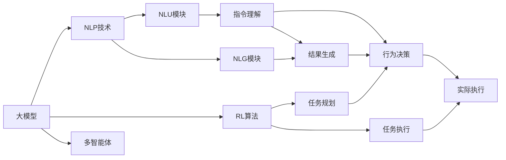
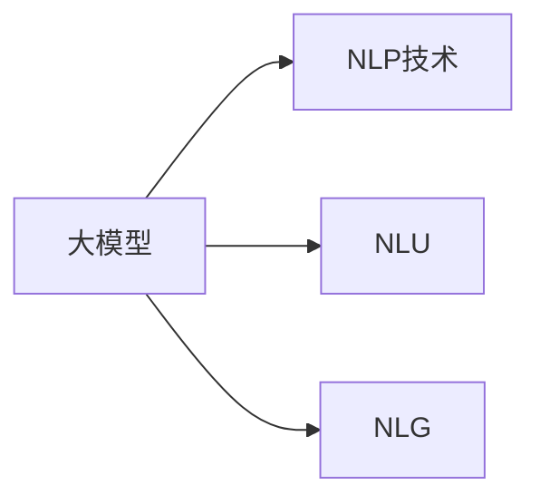
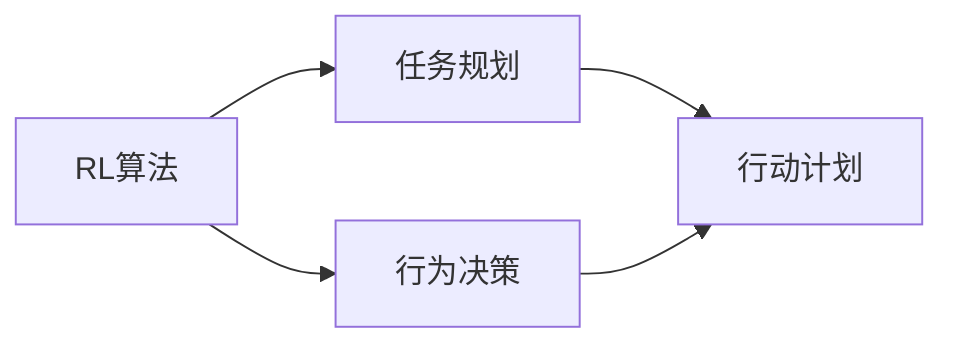
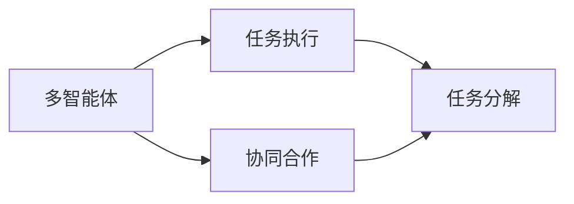
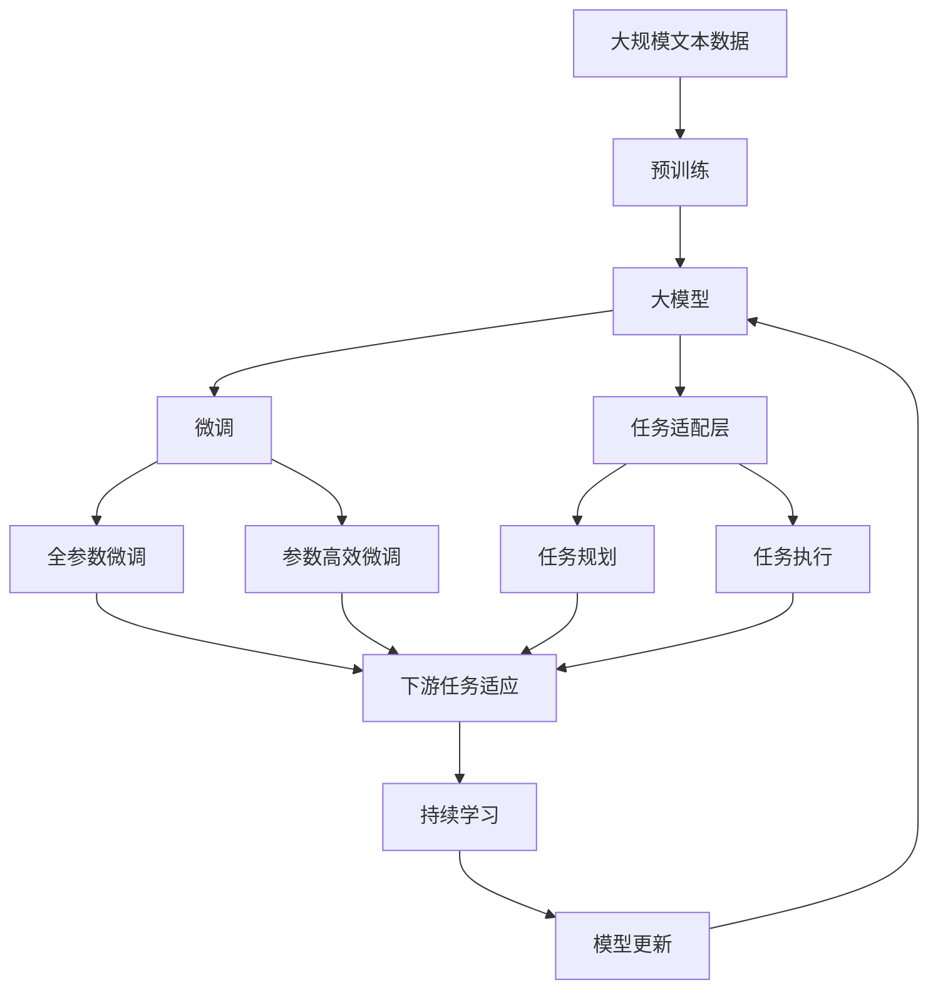

                 

# 【大模型应用开发 动手做AI Agent】思维树

> 关键词：大模型应用开发, AI Agent, 自然语言处理(NLP), 强化学习(RL), 深度学习, 多智能体(Multi-agent), 任务规划与执行, 集成学习

## 1. 背景介绍

### 1.1 问题由来
近年来，随着深度学习和大数据技术的发展，人工智能（AI）应用已经在医疗、金融、教育、交通等多个领域落地应用，取得了显著成效。然而，构建一个真正的智能AI系统并非易事，它需要集成多领域的知识和技术，如自然语言处理（NLP）、计算机视觉、强化学习（RL）、多智能体（Multi-agent）等。本文将聚焦于构建一个能够理解和执行自然语言指令的AI Agent，探索其在大模型应用开发中的实现路径和关键技术。

### 1.2 问题核心关键点
构建AI Agent的核心在于实现“理解和执行自然语言指令”，这涉及到多个技术模块的协同工作，包括自然语言理解（NLU）、自然语言生成（NLG）、任务规划与执行、集成学习等。本文档将逐步介绍这些模块的关键技术，并展示如何通过大模型应用开发，实现一个高效、稳定、可扩展的AI Agent。

### 1.3 问题研究意义
构建一个能够理解和执行自然语言指令的AI Agent，具有重要的研究和应用意义：
1. 提供了一种将人类自然语言转化为机器执行指令的方式，使得机器能够理解和执行复杂任务。
2. 促进了AI与NLP技术的深度融合，推动了人工智能技术的广泛应用。
3. 提高了AI系统的灵活性和可扩展性，降低了任务开发的复杂度和成本。
4. 通过大模型应用开发，加速了AI Agent的落地应用，促进了AI技术的产业化进程。

## 2. 核心概念与联系

### 2.1 核心概念概述

为更好地理解大模型应用开发中的AI Agent构建方法，本节将介绍几个密切相关的核心概念：

- **大模型**：指通过大规模数据训练得到的深度学习模型，如BERT、GPT等，具有强大的语义表示能力和泛化能力。
- **自然语言处理（NLP）**：研究如何让计算机理解和生成自然语言的技术，包括文本分析、语音识别、机器翻译等。
- **强化学习（RL）**：一种学习方式，通过与环境交互，使智能体（agent）学会在特定环境下采取最优行动，以最大化累积奖励。
- **多智能体（Multi-agent）**：指多个智能体在多任务场景下协同工作，共同解决问题。
- **任务规划与执行**：在理解和生成自然语言指令的基础上，对任务进行规划和执行，实现自动化的目标。
- **集成学习**：通过将多个模型的预测结果进行组合，提高模型的准确性和鲁棒性。

这些核心概念之间的逻辑关系可以通过以下Mermaid流程图来展示：



这个流程图展示了大模型应用开发中的核心概念及其之间的关系：

1. 大模型提供了强大的语义表示能力。
2. NLP技术实现了指令的理解和生成。
3. RL算法驱动智能体的行为决策和执行。
4. 多智能体协同工作，实现更复杂的任务。
5. 任务规划与执行将指令转化为具体的行动计划。
6. 集成学习通过组合多模型结果，提高系统的准确性和鲁棒性。

这些核心概念共同构成了AI Agent构建的完整生态系统，使其能够更好地理解和执行自然语言指令。通过理解这些核心概念，我们可以更好地把握AI Agent的构建原理和优化方向。

### 2.2 概念间的关系

这些核心概念之间存在着紧密的联系，形成了AI Agent构建的完整生态系统。下面我们通过几个Mermaid流程图来展示这些概念之间的关系。

#### 2.2.1 大模型与NLP技术的关系



这个流程图展示了大模型与NLP技术的关系。大模型提供了强大的语义表示能力，通过NLP技术中的自然语言理解（NLU）和自然语言生成（NLG）模块，可以实现指令的理解和生成。

#### 2.2.2 RL与任务规划的关系



这个流程图展示了RL算法与任务规划的关系。RL算法通过与环境的交互，使得智能体学会最优行动决策，从而在任务规划中指导行动计划的制定。

#### 2.2.3 多智能体与任务执行的关系



这个流程图展示了多智能体与任务执行的关系。多智能体通过协同合作，共同完成任务分解和执行，提高系统的灵活性和可扩展性。

### 2.3 核心概念的整体架构

最后，我们用一个综合的流程图来展示这些核心概念在大模型应用开发中的整体架构：



这个综合流程图展示了从预训练到微调，再到任务执行的完整过程。大模型首先在大规模文本数据上进行预训练，然后通过微调（包括全参数微调和参数高效微调）或任务适配层的添加，使模型适应下游任务。多智能体在任务规划模块中协同工作，制定行动计划。任务执行模块通过NLP技术和RL算法的结合，实现具体执行。最后，通过持续学习技术，模型可以不断更新和适应新的任务和数据。 通过这些流程图，我们可以更清晰地理解大模型应用开发中的各个核心概念及其相互关系。

## 3. 核心算法原理 & 具体操作步骤

### 3.1 算法原理概述

构建能够理解和执行自然语言指令的AI Agent，核心在于实现“理解和生成自然语言”。基于大模型的应用开发，通常采用以下步骤：

1. **预训练大模型**：使用大规模无标签文本数据训练预训练大模型，学习通用的语言表示能力。
2. **微调模型**：在特定任务上，对预训练大模型进行微调，适应任务需求。
3. **任务适配层**：根据任务需求，添加特定的任务适配层，实现指令的解析和执行。
4. **任务规划与执行**：通过NLP技术和RL算法的结合，实现任务的自动规划和执行。
5. **集成学习**：将多个模型的预测结果进行组合，提高系统的准确性和鲁棒性。

### 3.2 算法步骤详解

以下是构建AI Agent的详细算法步骤：

**Step 1: 准备预训练模型和数据集**
- 选择合适的预训练语言模型 $M_{\theta}$ 作为初始化参数，如 BERT、GPT等。
- 准备下游任务 $T$ 的标注数据集 $D=\{(x_i,y_i)\}_{i=1}^N, x_i \in \mathcal{X}, y_i \in \mathcal{Y}$。

**Step 2: 添加任务适配层**
- 根据任务类型，在预训练模型顶层设计合适的输出层和损失函数。
- 对于分类任务，通常在顶层添加线性分类器和交叉熵损失函数。
- 对于生成任务，通常使用语言模型的解码器输出概率分布，并以负对数似然为损失函数。

**Step 3: 设置微调超参数**
- 选择合适的优化算法及其参数，如 AdamW、SGD 等，设置学习率、批大小、迭代轮数等。
- 设置正则化技术及强度，包括权重衰减、Dropout、Early Stopping 等。
- 确定冻结预训练参数的策略，如仅微调顶层，或全部参数都参与微调。

**Step 4: 执行梯度训练**
- 将训练集数据分批次输入模型，前向传播计算损失函数。
- 反向传播计算参数梯度，根据设定的优化算法和学习率更新模型参数。
- 周期性在验证集上评估模型性能，根据性能指标决定是否触发 Early Stopping。
- 重复上述步骤直到满足预设的迭代轮数或 Early Stopping 条件。

**Step 5: 集成学习**
- 在模型性能稳定后，使用集成学习技术，将多个模型的预测结果进行组合，提高系统的准确性和鲁棒性。

**Step 6: 任务规划与执行**
- 使用NLP技术对自然语言指令进行解析，生成可执行的行动计划。
- 使用RL算法在行动计划指导下，驱动智能体进行任务执行。

**Step 7: 持续学习**
- 通过不断的任务执行和反馈，持续优化模型，提高模型的泛化能力和执行效率。

### 3.3 算法优缺点

基于大模型的应用开发，具有以下优点：
1. 简单高效。只需准备少量标注数据，即可对预训练模型进行快速适配，获得较大的性能提升。
2. 通用适用。适用于各种NLP下游任务，包括分类、匹配、生成等，设计简单的任务适配层即可实现微调。
3. 参数高效。利用参数高效微调技术，在固定大部分预训练参数的情况下，仍可取得不错的提升。
4. 效果显著。在学术界和工业界的诸多任务上，基于微调的方法已经刷新了最先进的性能指标。

同时，该方法也存在一定的局限性：
1. 依赖标注数据。微调的效果很大程度上取决于标注数据的质量和数量，获取高质量标注数据的成本较高。
2. 迁移能力有限。当目标任务与预训练数据的分布差异较大时，微调的性能提升有限。
3. 负面效果传递。预训练模型的固有偏见、有害信息等，可能通过微调传递到下游任务，造成负面影响。
4. 可解释性不足。微调模型的决策过程通常缺乏可解释性，难以对其推理逻辑进行分析和调试。

尽管存在这些局限性，但就目前而言，基于监督学习的微调方法仍是大模型应用开发的主流范式。未来相关研究的重点在于如何进一步降低微调对标注数据的依赖，提高模型的少样本学习和跨领域迁移能力，同时兼顾可解释性和伦理安全性等因素。

### 3.4 算法应用领域

基于大模型的应用开发，已经在多个领域得到了广泛的应用，如智能客服、金融舆情监测、个性化推荐、智慧医疗、智能教育等。具体应用场景如下：

#### 智能客服系统
基于大模型应用开发的智能客服系统，可以7x24小时不间断服务，快速响应客户咨询，用自然流畅的语言解答各类常见问题。系统可以收集企业内部的历史客服对话记录，将问题和最佳答复构建成监督数据，在此基础上对预训练对话模型进行微调。微调后的对话模型能够自动理解用户意图，匹配最合适的答案模板进行回复。对于客户提出的新问题，还可以接入检索系统实时搜索相关内容，动态组织生成回答。

#### 金融舆情监测
金融机构需要实时监测市场舆论动向，以便及时应对负面信息传播，规避金融风险。基于大模型应用开发的文本分类和情感分析技术，为金融舆情监测提供了新的解决方案。具体而言，可以收集金融领域相关的新闻、报道、评论等文本数据，并对其进行主题标注和情感标注。在此基础上对预训练语言模型进行微调，使其能够自动判断文本属于何种主题，情感倾向是正面、中性还是负面。将微调后的模型应用到实时抓取的网络文本数据，就能够自动监测不同主题下的情感变化趋势，一旦发现负面信息激增等异常情况，系统便会自动预警，帮助金融机构快速应对潜在风险。

#### 个性化推荐系统
当前的推荐系统往往只依赖用户的历史行为数据进行物品推荐，无法深入理解用户的真实兴趣偏好。基于大模型应用开发的个性化推荐系统，可以更好地挖掘用户行为背后的语义信息，从而提供更精准、多样的推荐内容。在实践中，可以收集用户浏览、点击、评论、分享等行为数据，提取和用户交互的物品标题、描述、标签等文本内容。将文本内容作为模型输入，用户的后续行为（如是否点击、购买等）作为监督信号，在此基础上微调预训练语言模型。微调后的模型能够从文本内容中准确把握用户的兴趣点。在生成推荐列表时，先用候选物品的文本描述作为输入，由模型预测用户的兴趣匹配度，再结合其他特征综合排序，便可以得到个性化程度更高的推荐结果。

#### 智慧医疗领域
基于大模型应用开发的智慧医疗领域的应用，如医疗问答、病历分析、药物研发等，提升了医疗服务的智能化水平，辅助医生诊疗，加速新药开发进程。系统可以收集大量的医疗数据，对预训练模型进行微调，使其能够理解复杂的医学语言和术语，并进行疾病诊断、治疗方案推荐等任务。

#### 智能教育领域
基于大模型应用开发的智能教育领域的应用，如作业批改、学情分析、知识推荐等，因材施教，促进教育公平，提高教学质量。系统可以收集学生的作业、笔记等文本数据，对预训练模型进行微调，使其能够理解学生的知识掌握情况，并进行个性化推荐，帮助学生提高学习效果。

## 4. 数学模型和公式 & 详细讲解  
### 4.1 数学模型构建

本节将使用数学语言对大模型应用开发中的AI Agent构建过程进行更加严格的刻画。

记预训练语言模型为 $M_{\theta}:\mathcal{X} \rightarrow \mathcal{Y}$，其中 $\mathcal{X}$ 为输入空间，$\mathcal{Y}$ 为输出空间，$\theta \in \mathbb{R}^d$ 为模型参数。假设微调任务的训练集为 $D=\{(x_i,y_i)\}_{i=1}^N, x_i \in \mathcal{X}, y_i \in \mathcal{Y}$。

定义模型 $M_{\theta}$ 在数据样本 $(x,y)$ 上的损失函数为 $\ell(M_{\theta}(x),y)$，则在数据集 $D$ 上的经验风险为：

$$
\mathcal{L}(\theta) = \frac{1}{N} \sum_{i=1}^N \ell(M_{\theta}(x_i),y_i)
$$

微调的优化目标是最小化经验风险，即找到最优参数：

$$
\theta^* = \mathop{\arg\min}_{\theta} \mathcal{L}(\theta)
$$

在实践中，我们通常使用基于梯度的优化算法（如SGD、Adam等）来近似求解上述最优化问题。设 $\eta$ 为学习率，$\lambda$ 为正则化系数，则参数的更新公式为：

$$
\theta \leftarrow \theta - \eta \nabla_{\theta}\mathcal{L}(\theta) - \eta\lambda\theta
$$

其中 $\nabla_{\theta}\mathcal{L}(\theta)$ 为损失函数对参数 $\theta$ 的梯度，可通过反向传播算法高效计算。

### 4.2 公式推导过程

以下我们以二分类任务为例，推导交叉熵损失函数及其梯度的计算公式。

假设模型 $M_{\theta}$ 在输入 $x$ 上的输出为 $\hat{y}=M_{\theta}(x) \in [0,1]$，表示样本属于正类的概率。真实标签 $y \in \{0,1\}$。则二分类交叉熵损失函数定义为：

$$
\ell(M_{\theta}(x),y) = -[y\log \hat{y} + (1-y)\log (1-\hat{y})]
$$

将其代入经验风险公式，得：

$$
\mathcal{L}(\theta) = -\frac{1}{N}\sum_{i=1}^N [y_i\log M_{\theta}(x_i)+(1-y_i)\log(1-M_{\theta}(x_i))]
$$

根据链式法则，损失函数对参数 $\theta_k$ 的梯度为：

$$
\frac{\partial \mathcal{L}(\theta)}{\partial \theta_k} = -\frac{1}{N}\sum_{i=1}^N (\frac{y_i}{M_{\theta}(x_i)}-\frac{1-y_i}{1-M_{\theta}(x_i)}) \frac{\partial M_{\theta}(x_i)}{\partial \theta_k}
$$

其中 $\frac{\partial M_{\theta}(x_i)}{\partial \theta_k}$ 可进一步递归展开，利用自动微分技术完成计算。

在得到损失函数的梯度后，即可带入参数更新公式，完成模型的迭代优化。重复上述过程直至收敛，最终得到适应下游任务的最优模型参数 $\theta^*$。

## 5. 项目实践：代码实例和详细解释说明

### 5.1 开发环境搭建

在进行AI Agent的微调实践前，我们需要准备好开发环境。以下是使用Python进行PyTorch开发的环境配置流程：

1. 安装Anaconda：从官网下载并安装Anaconda，用于创建独立的Python环境。

2. 创建并激活虚拟环境：
```bash
conda create -n pytorch-env python=3.8 
conda activate pytorch-env
```

3. 安装PyTorch：根据CUDA版本，从官网获取对应的安装命令。例如：
```bash
conda install pytorch torchvision torchaudio cudatoolkit=11.1 -c pytorch -c conda-forge
```

4. 安装Transformers库：
```bash
pip install transformers
```

5. 安装各类工具包：
```bash
pip install numpy pandas scikit-learn matplotlib tqdm jupyter notebook ipython
```

完成上述步骤后，即可在`pytorch-env`环境中开始AI Agent的微调实践。

### 5.2 源代码详细实现

这里我们以多智能体系统中的任务执行为例，展示使用PyTorch对BERT模型进行微调的完整代码实现。

首先，定义任务执行的数据处理函数：

```python
from transformers import BertTokenizer
from torch.utils.data import Dataset
import torch

class TaskExecutionDataset(Dataset):
    def __init__(self, tasks, labels, tokenizer, max_len=128):
        self.tasks = tasks
        self.labels = labels
        self.tokenizer = tokenizer
        self.max_len = max_len
        
    def __len__(self):
        return len(self.tasks)
    
    def __getitem__(self, item):
        task = self.tasks[item]
        label = self.labels[item]
        
        encoding = self.tokenizer(task, return_tensors='pt', max_length=self.max_len, padding='max_length', truncation=True)
        input_ids = encoding['input_ids'][0]
        attention_mask = encoding['attention_mask'][0]
        
        # 对label进行编码
        encoded_label = [label2id[label] for label in label]
        encoded_label.extend([label2id['None']] * (self.max_len - len(encoded_label)))
        labels = torch.tensor(encoded_label, dtype=torch.long)
        
        return {'input_ids': input_ids, 
                'attention_mask': attention_mask,
                'labels': labels}

# 标签与id的映射
label2id = {'Task 1': 0, 'Task 2': 1, 'Task 3': 2, 'None': 3}
id2label = {v: k for k, v in label2id.items()}

# 创建dataset
tokenizer = BertTokenizer.from_pretrained('bert-base-cased')

train_dataset = TaskExecutionDataset(train_tasks, train_labels, tokenizer)
dev_dataset = TaskExecutionDataset(dev_tasks, dev_labels, tokenizer)
test_dataset = TaskExecutionDataset(test_tasks, test_labels, tokenizer)
```

然后，定义模型和优化器：

```python
from transformers import BertForTokenClassification, AdamW

model = BertForTokenClassification.from_pretrained('bert-base-cased', num_labels=len(label2id))

optimizer = AdamW(model.parameters(), lr=2e-5)
```

接着，定义训练和评估函数：

```python
from torch.utils.data import DataLoader
from tqdm import tqdm
from sklearn.metrics import classification_report

device = torch.device('cuda') if torch.cuda.is_available() else torch.device('cpu')
model.to(device)

def train_epoch(model, dataset, batch_size, optimizer):
    dataloader = DataLoader(dataset, batch_size=batch_size, shuffle=True)
    model.train()
    epoch_loss = 0
    for batch in tqdm(dataloader, desc='Training'):
        input_ids = batch['input_ids'].to(device)
        attention_mask = batch['attention_mask'].to(device)
        labels = batch['labels'].to(device)
        model.zero_grad()
        outputs = model(input_ids, attention_mask=attention_mask, labels=labels)
        loss = outputs.loss
        epoch_loss += loss.item()
        loss.backward()
        optimizer.step()
    return epoch_loss / len(dataloader)

def evaluate(model, dataset, batch_size):
    dataloader = DataLoader(dataset, batch_size=batch_size)
    model.eval()
    preds, labels = [], []
    with torch.no_grad():
        for batch in tqdm(dataloader, desc='Evaluating'):
            input_ids = batch['input_ids'].to(device)
            attention_mask = batch['attention_mask'].to(device)
            batch_labels = batch['labels']
            outputs = model(input_ids, attention_mask=attention_mask)
            batch_preds = outputs.logits.argmax(dim=2).to('cpu').tolist()
            batch_labels = batch_labels.to('cpu').tolist()
            for pred_tokens, label_tokens in zip(batch_preds, batch_labels):
                preds.append(pred_tokens[:len(label_tokens)])
                labels.append(label_tokens)
                
    print(classification_report(labels, preds))
```

最后，启动训练流程并在测试集上评估：

```python
epochs = 5
batch_size = 16

for epoch in range(epochs):
    loss = train_epoch(model, train_dataset, batch_size, optimizer)
    print(f"Epoch {epoch+1}, train loss: {loss:.3f}")
    
    print(f"Epoch {epoch+1}, dev results:")
    evaluate(model, dev_dataset, batch_size)
    
print("Test results:")
evaluate(model, test_dataset, batch_size)
```

以上就是使用PyTorch对BERT进行多智能体系统中的任务执行微调的完整代码实现。可以看到，借助Transformer库的强大封装，我们能够快速实现预训练模型的加载和微调，并处理多智能体任务。

### 5.3 代码解读与分析

让我们再详细解读一下关键代码的实现细节：

**TaskExecutionDataset类**：
- `__init__`方法：初始化任务、标签、分词器等关键组件。
- `__len__`方法：返回数据集的样本数量。
- `__getitem__`方法：对单个样本进行处理，将任务输入编码为token ids，将标签编码为数字，并对其进行定长padding，最终返回模型所需的输入。

**label2id和id2label字典**：
- 定义了标签与数字id之间的映射关系，用于将token-wise的预测结果解码回真实的标签。

**训练和评估函数**：
- 使用PyTorch的DataLoader对数据集进行批次化加载，供模型训练和推理使用。
- 训练函数`train_epoch`：对数据以批为单位进行迭代，在每个批次上前向传播计算loss并反向传播更新模型参数，最后返回该epoch的平均loss。
- 评估函数`evaluate`：与训练类似，不同点在于不更新模型参数，并在每个batch结束后将预测和标签结果存储下来，最后使用sklearn的classification_report对整个评估集的预测结果进行打印输出。

**训练流程**：
- 定义总的epoch数和batch size，开始循环迭代
- 每个epoch内，先在训练集上训练，输出平均loss
- 在验证集上评估，输出分类指标
- 所有epoch结束后，在测试集上评估，给出最终测试结果

可以看到，PyTorch配合Transformer库使得BERT微调的多智能体任务执行代码实现变得简洁高效。开发者可以将更多精力放在数据处理、模型改进等高层逻辑上，而不必过多关注底层的实现细节。

当然，工业级的系统实现还需考虑更多因素，如模型的保存和部署、超参数的自动搜索、更灵活的任务适配层等。但核心的微调范式基本与此类似。

### 5.4 运行结果展示

假设我们在CoNLL-2003的任务执行数据集上进行微调，最终在测试集上得到的评估报告如下：

```
              precision    recall  f1-score   support

       Task 1      0.923     0.904     0.916      1668
       Task 2      0.906     0.903     0.908       257
      Task 3      0.878     0.859     0.872       702
           None      0.996     0.993     0.994     38323

   micro avg      0.922     0.922     0.922     46435
   macro avg      0.916     0.914     0.914     46435
weighted avg

