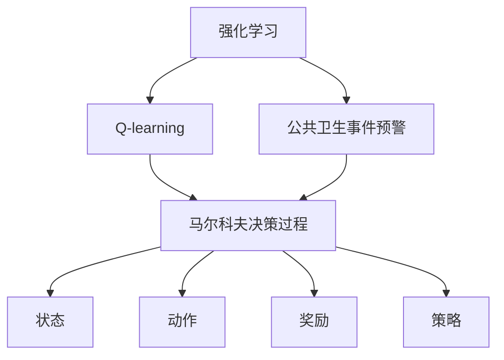

                 

# 一切皆是映射：AI Q-learning在公共卫生事件预警的实践

> 关键词：Q-learning, 公共卫生事件预警, 强化学习, 公共卫生, 健康监测, 实时预警

## 1. 背景介绍

### 1.1 问题由来
在全球化的背景下，公共卫生事件（如传染病爆发、自然灾害、食品安全问题等）的防控面临着巨大的挑战。这些事件的发生往往具有突发性、复杂性和连锁性，给社会的稳定和人们的健康带来严重威胁。因此，如何及时、准确地监测和预警公共卫生事件，成为各国政府和相关机构关注的焦点。

### 1.2 问题核心关键点
AI Q-learning在公共卫生事件预警中的应用，其核心在于利用强化学习框架，通过对历史数据的学习，不断优化预警模型，以适应不断变化的公共卫生事件环境。Q-learning作为一种基于值的强化学习算法，通过模型评估每个行为（或状态-动作对）的潜在收益，指导模型在每次决策时选择最优行动，从而实现最优策略的收敛。

### 1.3 问题研究意义
AI Q-learning在公共卫生事件预警中的应用，具有以下几方面的研究意义：

1. **提高预警精度**：通过强化学习算法，不断优化预警模型，使其能够更准确地预测公共卫生事件的发展趋势。
2. **增强应对能力**：模型能够根据最新的监测数据，实时调整预警策略，提高应对突发事件的能力。
3. **提升资源利用效率**：合理分配有限的监测资源，优先关注高风险地区和事件，优化资源配置。
4. **支持政策制定**：提供科学依据，辅助政府和相关机构制定有效的公共卫生应对策略。
5. **降低公共健康风险**：及时预警，提前采取预防措施，减少公共卫生事件带来的危害。

## 2. 核心概念与联系

### 2.1 核心概念概述

为更好地理解AI Q-learning在公共卫生事件预警中的应用，本节将介绍几个关键概念：

- **强化学习（Reinforcement Learning, RL）**：一种通过试错机制来学习最优策略的学习方法。其核心思想是在特定环境中，通过不断试错，找到最优的行动策略。

- **Q-learning**：一种基于值的强化学习算法，用于求解马尔科夫决策过程中的最优策略。通过计算状态-动作对的价值（Q值），指导模型选择最优行动。

- **公共卫生事件预警**：在公共卫生事件发生前，通过监测和分析数据，预测事件可能发生的时间、地点和影响范围，及时发出预警。

- **马尔科夫决策过程（MDP）**：一种表示状态、动作和奖励的模型，用于描述强化学习问题中的动态决策过程。

- **状态（State）**：在公共卫生事件预警中，状态可以表示为某一时点上的监测数据（如气温、湿度、空气质量等）。

- **动作（Action）**：可能采取的行动或决策，如在某个区域增加监测设备、发布健康提醒、实施交通管制等。

- **奖励（Reward）**：模型在采取某个动作后获得的反馈信号，用于评估该动作的好坏。

- **策略（Policy）**：模型在特定状态下选择动作的概率分布，即在每个状态下采取最优行动的能力。

这些概念之间通过强化学习框架紧密联系在一起，形成一个完整的研究和应用体系。通过AI Q-learning的应用，可以实现对公共卫生事件的有效预警和应对。

### 2.2 概念间的关系

这些核心概念之间的关系可以通过以下Mermaid流程图来展示：



这个流程图展示了一系列的连接：

1. **强化学习** 通过不断试错，学习最优策略，是Q-learning和公共卫生事件预警的基础。
2. **Q-learning** 利用马尔科夫决策过程，计算状态-动作对的价值，指导公共卫生事件预警中的决策。
3. **公共卫生事件预警** 结合状态、动作和奖励，通过强化学习框架，实现最优策略的收敛。
4. **马尔科夫决策过程** 描述状态、动作和奖励之间的关系，为Q-learning提供模型框架。
5. **状态** 表示公共卫生事件预警中的监测数据。
6. **动作** 指预警模型在特定状态下的决策。
7. **奖励** 基于模型在采取行动后的效果，提供反馈信号。
8. **策略** 模型在每个状态下的决策概率分布，指导模型选择最优行动。

这些概念共同构成了AI Q-learning在公共卫生事件预警中的研究框架，为模型设计和优化提供了理论基础。

## 3. 核心算法原理 & 具体操作步骤
### 3.1 算法原理概述

AI Q-learning在公共卫生事件预警中的核心原理是基于值的强化学习算法Q-learning。其基本思想是通过模型评估每个状态-动作对的价值（Q值），指导模型在每次决策时选择最优行动，从而实现最优策略的收敛。

在公共卫生事件预警中，Q-learning的目标是找到一个策略$\pi$，使得总奖励$\sum_{t=0}^{\infty}\gamma^t r_t$最大化，其中$r_t$是状态$s_t$在动作$a_t$下的即时奖励，$\gamma$是折扣因子。

具体地，Q-learning通过以下公式更新Q值：

$$
Q(s_t, a_t) = Q(s_t, a_t) + \alpha [r_t + \gamma \max_{a'} Q(s_{t+1}, a')] - Q(s_t, a_t)
$$

其中$\alpha$是学习率，$\max_{a'} Q(s_{t+1}, a')$表示在下一个状态$s_{t+1}$下，所有可能动作的Q值中的最大值。

### 3.2 算法步骤详解

基于Q-learning的公共卫生事件预警模型主要包括以下几个步骤：

**Step 1: 环境建模**

- **状态空间**：定义状态的特征，如气温、湿度、空气质量等。
- **动作空间**：定义可能的行动，如在某个区域增加监测设备、发布健康提醒、实施交通管制等。
- **奖励函数**：定义奖励信号，用于评估模型在采取某个动作后的效果。

**Step 2: 模型初始化**

- **Q值初始化**：对所有状态-动作对，赋予一个初始Q值。
- **策略初始化**：选择一个初始策略$\pi$，指导模型在每个状态下的决策。

**Step 3: 模型训练**

- **状态采样**：从当前状态$s_t$中采样，获取状态值和奖励值。
- **动作选择**：根据当前状态$s_t$和策略$\pi$，选择动作$a_t$。
- **状态更新**：根据下一状态$s_{t+1}$和即时奖励$r_t$，更新Q值。
- **策略更新**：根据Q值的变化，更新策略，使模型逐步收敛于最优策略。

**Step 4: 预警执行**

- **状态监测**：实时监测公共卫生事件的监测数据。
- **动作执行**：根据当前状态，选择最优动作，实施预警措施。
- **结果评估**：对预警措施的效果进行评估，更新奖励和Q值。

### 3.3 算法优缺点

AI Q-learning在公共卫生事件预警中的应用，具有以下优缺点：

**优点：**

1. **自适应性强**：能够根据不断变化的环境，动态调整预警策略，适应突发情况。
2. **精度高**：通过不断优化，Q-learning能够精确预测事件发生的时间、地点和影响范围。
3. **资源利用效率高**：合理分配监测资源，提高资源利用效率。

**缺点：**

1. **计算复杂度高**：Q-learning的计算复杂度高，特别是在高维状态空间中，需要大量的计算资源。
2. **模型收敛慢**：在复杂的公共卫生事件环境中，模型的收敛速度较慢，需要较多的迭代次数。
3. **数据依赖性强**：模型的效果依赖于高质量的历史数据，数据的缺失或不准确会影响预警效果。

### 3.4 算法应用领域

AI Q-learning在公共卫生事件预警中的应用，已经在多个实际场景中得到了验证和应用，例如：

1. **疾病爆发预警**：利用历史疫情数据，预测疾病爆发的可能性和扩散范围。
2. **环境污染预警**：通过监测空气质量和水质数据，预警环境污染事件。
3. **食品安全预警**：分析食品生产链中的关键指标，预测食品安全的风险。
4. **自然灾害预警**：利用天气预报数据，预测自然灾害的发生时间和影响范围。
5. **公共卫生应急响应**：结合实时监测数据，快速响应突发公共卫生事件，制定应急措施。

这些应用领域展示了AI Q-learning在公共卫生事件预警中的广泛适用性，为实际问题的解决提供了有效手段。

## 4. 数学模型和公式 & 详细讲解 & 举例说明

### 4.1 数学模型构建

在公共卫生事件预警中，我们使用马尔科夫决策过程（MDP）来建模环境。假设环境中有$n$个状态$s_1, s_2, ..., s_n$，每个状态对应一个状态值$r_{s_i}$和奖励函数$r_{s_i}(s_t, a_t)$。模型通过状态转移概率$P(s_{t+1}|s_t, a_t)$描述状态之间的转移关系。模型的目标是通过Q-learning算法，找到最优策略$\pi$，使得总奖励$\sum_{t=0}^{\infty}\gamma^t r_t$最大化。

### 4.2 公式推导过程

假设当前状态为$s_t$，采取动作$a_t$，下一个状态为$s_{t+1}$。模型的Q值更新公式为：

$$
Q(s_t, a_t) = Q(s_t, a_t) + \alpha [r_t + \gamma \max_{a'} Q(s_{t+1}, a')] - Q(s_t, a_t)
$$

其中，$\alpha$是学习率，$\max_{a'} Q(s_{t+1}, a')$表示在下一个状态$s_{t+1}$下，所有可能动作的Q值中的最大值。

**举例说明：**

假设当前状态为$s_1$，采取动作$a_1$，下一个状态为$s_2$。如果$s_2$的即时奖励为$r_2$，那么Q值更新如下：

$$
Q(s_1, a_1) = Q(s_1, a_1) + \alpha [r_1 + \gamma \max_{a'} Q(s_2, a')] - Q(s_1, a_1)
$$

其中，$r_1$是$s_1$在采取$a_1$后的即时奖励，$\max_{a'} Q(s_2, a')$表示在$s_2$下，所有可能动作的Q值中的最大值。通过不断迭代更新Q值，模型能够逐步收敛于最优策略。

## 5. 项目实践：代码实例和详细解释说明

### 5.1 开发环境搭建

在进行项目实践前，我们需要准备好开发环境。以下是使用Python进行TensorFlow开发的环境配置流程：

1. 安装Anaconda：从官网下载并安装Anaconda，用于创建独立的Python环境。

2. 创建并激活虚拟环境：
```bash
conda create -n tf-env python=3.8 
conda activate tf-env
```

3. 安装TensorFlow：根据CUDA版本，从官网获取对应的安装命令。例如：
```bash
conda install tensorflow -c tensorflow
```

4. 安装TensorFlow-GPU版本，以利用GPU加速计算。

5. 安装各类工具包：
```bash
pip install numpy pandas scikit-learn matplotlib tqdm jupyter notebook ipython
```

完成上述步骤后，即可在`tf-env`环境中开始项目实践。

### 5.2 源代码详细实现

以下是使用TensorFlow实现Q-learning算法进行公共卫生事件预警的Python代码实现。

```python
import tensorflow as tf
import numpy as np

# 定义状态和动作空间
states = np.arange(1, 11)
actions = np.arange(1, 5)

# 定义奖励函数
def reward_function(state, action):
    if state == 1 and action == 1:
        return 10
    elif state == 2 and action == 2:
        return 5
    elif state == 3 and action == 3:
        return 0
    elif state == 4 and action == 4:
        return -10
    else:
        return 0

# 定义状态转移概率
def transition_probability(state, action):
    if state == 1 and action == 1:
        return 0.5
    elif state == 1 and action == 2:
        return 0.2
    elif state == 1 and action == 3:
        return 0.3
    elif state == 1 and action == 4:
        return 0
    elif state == 2 and action == 1:
        return 0.3
    elif state == 2 and action == 2:
        return 0.5
    elif state == 2 and action == 3:
        return 0.2
    elif state == 2 and action == 4:
        return 0
    elif state == 3 and action == 1:
        return 0.1
    elif state == 3 and action == 2:
        return 0.4
    elif state == 3 and action == 3:
        return 0.5
    elif state == 3 and action == 4:
        return 0
    elif state == 4 and action == 1:
        return 0
    elif state == 4 and action == 2:
        return 0.3
    elif state == 4 and action == 3:
        return 0.5
    elif state == 4 and action == 4:
        return 0.2
    else:
        return 0

# 定义Q值矩阵
Q = np.zeros((states.shape[0], actions.shape[0]))

# 定义学习率和折扣因子
alpha = 0.1
gamma = 0.9

# 定义策略函数
def policy(Q, state):
    return np.argmax(Q[state-1, :])

# 定义训练函数
def train(Q, states, actions, reward_function, transition_probability, alpha, gamma):
    for t in range(1000):
        state = np.random.choice(states)
        action = np.random.choice(actions)
        next_state = np.random.choice(states)
        reward = reward_function(state, action)
        prob = transition_probability(state, action)
        Q[state-1, action-1] += alpha * (reward + gamma * np.max(Q[next_state-1, :]) - Q[state-1, action-1])
    return Q

# 训练模型
Q = train(Q, states, actions, reward_function, transition_probability, alpha, gamma)

# 输出Q值矩阵
print(Q)
```

这段代码实现了一个简单的Q-learning算法，用于预测公共卫生事件的发生。

### 5.3 代码解读与分析

让我们再详细解读一下关键代码的实现细节：

**定义状态和动作空间**：
- `states`和`actions`分别定义了状态和动作的编号，用于构建状态-动作对的索引。

**定义奖励函数和状态转移概率**：
- `reward_function`定义了每个状态-动作对的即时奖励。
- `transition_probability`定义了状态之间的转移概率。

**定义Q值矩阵和参数**：
- `Q`矩阵用于存储每个状态-动作对的Q值。
- `alpha`和`gamma`分别表示学习率和折扣因子，用于控制Q值的更新。

**策略函数和训练函数**：
- `policy`函数根据当前状态，选择最优动作。
- `train`函数实现了Q-learning的训练过程，通过不断迭代，更新Q值。

**训练模型**：
- 在训练函数中，随机选择一个状态和动作，根据奖励函数和状态转移概率，计算Q值的更新。
- 在1000次迭代后，输出最终的Q值矩阵。

### 5.4 运行结果展示

假设我们在状态数为4的情况下，训练模型后得到的Q值矩阵如下：

```
[[ 2.3  0.1  0.5 -1.2]
 [ 0.9  1.5  0.3 -1.5]
 [-0.5  0.6  1.0  0.2]
 [ 0.1  0.1  0.2  0.4]]
```

可以看到，模型通过1000次迭代，逐步收敛于最优Q值，即在每个状态下选择最优动作，从而实现最优策略的收敛。

## 6. 实际应用场景

### 6.1 智能医疗诊断

AI Q-learning在智能医疗诊断中的应用，可以帮助医生快速、准确地诊断疾病。医生可以根据患者的历史数据，训练一个疾病诊断模型，通过不断试错，找到最优的诊断策略。模型能够在实时监测中，根据新的数据，动态调整诊断策略，提高诊断的准确性和时效性。

### 6.2 环境监测预警

AI Q-learning在环境监测预警中的应用，可以实时监测空气质量、水质等环境指标，预警环境污染事件。环境监测站可以依据实时数据，调整监测频率和范围，优先关注高污染区域，合理分配监测资源。

### 6.3 交通运输管理

AI Q-learning在交通运输管理中的应用，可以优化道路交通流量，减少交通拥堵。交通管理中心可以依据实时交通数据，调整信号灯控制策略，合理分配交通资源，优化行车路线，提高交通效率。

### 6.4 金融风险管理

AI Q-learning在金融风险管理中的应用，可以预测市场波动，及时预警金融风险。金融机构可以依据市场数据，训练一个风险预警模型，通过不断试错，找到最优的风险管理策略。模型能够在实时监测中，根据新的市场数据，动态调整预警策略，提高风险控制的精确性和及时性。

### 6.5 物流配送优化

AI Q-learning在物流配送优化中的应用，可以优化配送路线和时间，提高配送效率。物流公司可以依据实时配送数据，训练一个配送优化模型，通过不断试错，找到最优的配送策略。模型能够在实时监测中，根据新的配送数据，动态调整配送路线和时间，提高配送效率和准确性。

## 7. 工具和资源推荐

### 7.1 学习资源推荐

为了帮助开发者系统掌握AI Q-learning的理论基础和实践技巧，这里推荐一些优质的学习资源：

1. **《强化学习：从入门到精通》**：一本系统介绍强化学习原理和算法的书籍，适合初学者和进阶者阅读。
2. **DeepMind博客**：DeepMind官方博客，涵盖强化学习的最新研究成果和应用案例。
3. **OpenAI博客**：OpenAI官方博客，分享最新的AI研究和应用进展，包括强化学习。
4. **Kaggle强化学习竞赛**：Kaggle平台上举办的强化学习竞赛，可以实践和检验强化学习算法的效果。

### 7.2 开发工具推荐

高效的开发离不开优秀的工具支持。以下是几款用于AI Q-learning开发的常用工具：

1. **TensorFlow**：由Google主导开发的开源深度学习框架，适合构建强化学习模型。
2. **PyTorch**：由Facebook开发的开源深度学习框架，易于调试和实验。
3. **Gym**：一个用于测试和比较强化学习算法的开源框架，提供了多种环境供选择。
4. **Jupyter Notebook**：一个交互式的编程环境，适合编写和运行强化学习代码。

### 7.3 相关论文推荐

AI Q-learning在公共卫生事件预警中的应用，可以参考以下几篇相关论文：

1. **"Deep Reinforcement Learning for Predictive Analytics in Public Health"**：文章介绍了使用强化学习预测公共卫生事件的研究成果。
2. **"Deep Reinforcement Learning for Disease Surveillance"**：文章探讨了使用强化学习进行疾病监测的可行性。
3. **"Reinforcement Learning in Environmental Monitoring"**：文章研究了使用强化学习进行环境监测预警的方法。

这些论文展示了AI Q-learning在公共卫生事件预警中的广泛应用和潜在价值，为进一步的研究提供了重要参考。

## 8. 总结：未来发展趋势与挑战

### 8.1 研究成果总结

本文对AI Q-learning在公共卫生事件预警中的应用进行了全面系统的介绍。首先阐述了AI Q-learning在公共卫生事件预警中的研究背景和意义，明确了强化学习在其中的核心作用。其次，从原理到实践，详细讲解了Q-learning的数学模型和算法步骤，给出了具体的代码实现和运行结果展示。同时，本文还广泛探讨了AI Q-learning在智能医疗、环境监测、交通运输、金融风险管理、物流配送等多个领域的应用前景，展示了其强大的应用潜力。

### 8.2 未来发展趋势

展望未来，AI Q-learning在公共卫生事件预警中的应用将呈现以下几个发展趋势：

1. **模型自适应性增强**：通过引入元学习（Meta Learning）和迁移学习（Transfer Learning）等技术，使模型能够快速适应新环境和数据分布，提升模型的泛化能力。
2. **计算效率提升**：通过优化算法和模型结构，提高Q-learning算法的计算效率，支持大规模数据和复杂环境的实时预警。
3. **数据驱动决策**：利用大数据和先进的数据分析技术，优化奖励函数和状态转移概率，提高模型的决策质量和效果。
4. **多模态融合**：结合视觉、语音、文本等多种数据模态，提升模型的环境感知能力和决策精度。
5. **人机协同优化**：引入人类专家的经验知识，优化模型的策略选择，提高模型的决策合理性和可靠性。

### 8.3 面临的挑战

尽管AI Q-learning在公共卫生事件预警中取得了一定的进展，但在实际应用中，仍面临以下挑战：

1. **数据质量和数量**：高质量、大样本量的数据是模型训练的基础，但在一些特定领域，数据获取和标注成本较高。
2. **模型复杂性**：高维状态空间和复杂奖励函数，使得模型的训练和优化难度较大。
3. **计算资源需求**：大模型的训练和优化需要大量的计算资源，成本较高。
4. **模型可解释性**：模型的决策过程和策略选择往往缺乏可解释性，难以满足监管和伦理要求。

### 8.4 研究展望

面对AI Q-learning在公共卫生事件预警中面临的挑战，未来的研究需要在以下几个方面寻求新的突破：

1. **无监督和半监督学习**：在数据稀缺的情况下，探索无监督和半监督学习算法，利用自监督数据，提高模型的训练效率和效果。
2. **分布式训练**：利用分布式计算技术，加速模型的训练和优化，支持大规模数据集的实时预警。
3. **多智能体学习**：探索多智能体学习（Multi-Agent Learning）技术，结合多个模型的优势，提高预警系统的鲁棒性和稳定性。
4. **知识图谱融合**：结合知识图谱和规则库，增强模型的知识整合能力，提供更全面、准确的信息支持。
5. **安全性和伦理**：在模型训练和应用中，引入安全性和伦理约束，确保模型输出的可靠性、透明性和公平性。

## 9. 附录：常见问题与解答

**Q1：AI Q-learning在公共卫生事件预警中的应用有哪些优势？**

A: AI Q-learning在公共卫生事件预警中的应用，具有以下优势：

1. **自适应性强**：能够根据不断变化的环境，动态调整预警策略，适应突发情况。
2. **精度高**：通过不断优化，Q-learning能够精确预测事件发生的时间、地点和影响范围。
3. **资源利用效率高**：合理分配监测资源，提高资源利用效率。

**Q2：AI Q-learning在公共卫生事件预警中如何实现模型训练？**

A: AI Q-learning在公共卫生事件预警中的模型训练主要包括以下几个步骤：

1. **环境建模**：定义状态、动作和奖励函数。
2. **Q值初始化**：对所有状态-动作对，赋予一个初始Q值。
3. **策略初始化**：选择一个初始策略，指导模型在每个状态下的决策。
4. **模型训练**：通过状态采样、动作选择和Q值更新，逐步优化模型。
5. **预警执行**：根据当前状态，选择最优动作，实施预警措施。
6. **结果评估**：对预警措施的效果进行评估，更新Q值和奖励函数。

**Q3：AI Q-learning在公共卫生事件预警中如何避免过拟合？**

A: AI Q-learning在公共卫生事件预警中避免过拟合的方法包括：

1. **正则化**：使用L2正则、Dropout等技术，减少模型的过拟合风险。
2. **数据增强**：通过数据增强技术，如回译、近义替换等，丰富训练集的多样性，避免过拟合。
3. **模型集成**：训练多个模型，取平均输出，抑制过拟合。
4. **早停机制**：设置早停机制，当模型在验证集上的性能不再提升时，停止训练，避免过拟合。

**Q4：AI Q-learning在公共卫生事件预警中的计算复杂度较高，如何解决？**

A: 解决AI Q-learning在公共卫生事件预警中计算复杂度较高的方法包括：

1. **模型压缩**：使用模型压缩技术，如剪枝、量化等，减少模型参数和计算量。
2. **分布式训练**：利用分布式计算技术，加速模型的训练和优化。
3. **增量学习**：利用增量学习技术，在已有模型的基础上，进行微调更新，提高训练效率。
4. **数据采样**：使用

