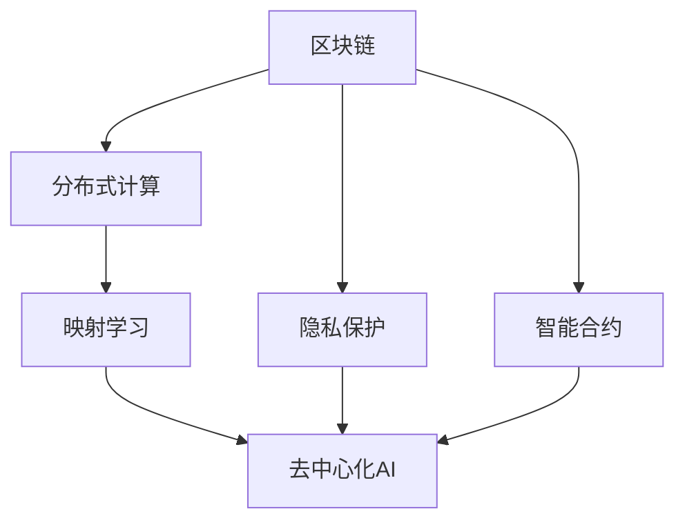
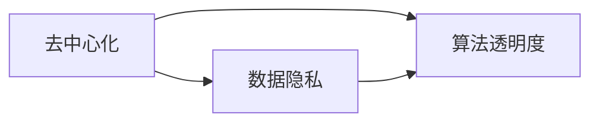
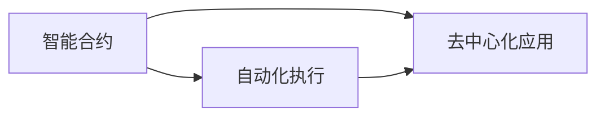
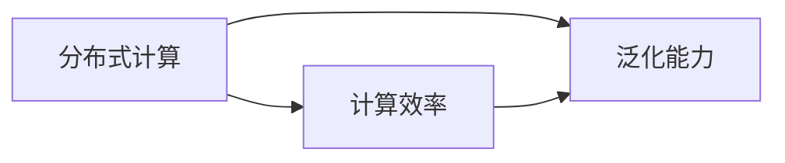
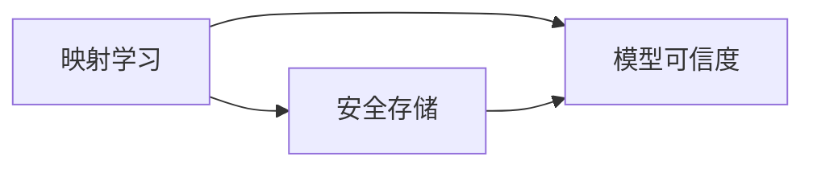
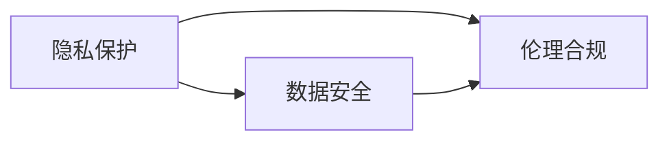
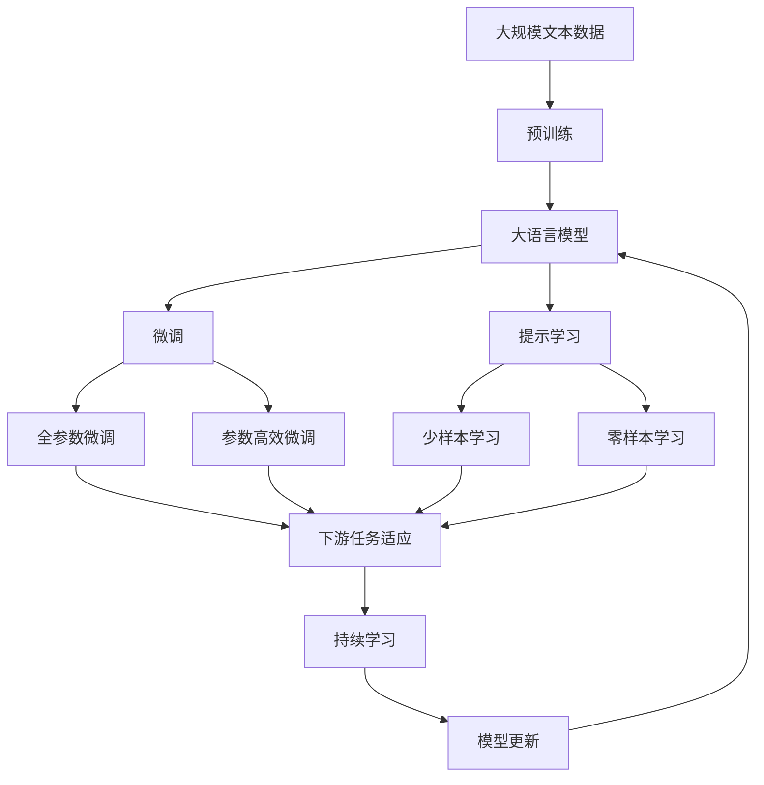

                 

# 一切皆是映射：AI的去中心化：区块链技术的融合

> 关键词：人工智能, 区块链, 去中心化, 映射学习, 模型映射, 自适应学习, 隐私保护, 智能合约, 分布式计算, 未来技术发展

## 1. 背景介绍

### 1.1 问题由来
近年来，人工智能(AI)和大数据技术的迅猛发展，极大地改变了人类社会的生产、生活和学习方式。然而，传统中心化模型的应用，也带来了数据隐私泄露、算法透明度不足、模型安全性无法保障等诸多问题。如何确保数据和算法的安全可靠，同时提升AI应用的效率和公平性，成为当下技术社区关注的焦点。

### 1.2 问题核心关键点
要解决这些问题，AI和区块链技术的融合是当前的热点研究方向之一。区块链的去中心化、可追溯性和隐私保护特性，为AI的应用提供了全新的模式和思路。其核心思想是将AI模型的训练和推理过程映射到区块链上，利用区块链的特性，提升AI应用的透明性和安全性。

### 1.3 问题研究意义
该研究对区块链和AI技术的融合具有重要意义：
1. **提升数据隐私保护**：区块链的分布式账本和智能合约机制，可以确保数据在流转过程中的隐私保护，避免中心化平台的数据泄露风险。
2. **增强模型透明性**：AI模型通过区块链进行训练和推理，模型参数和推理过程可以在区块链上进行公开验证，提升了模型的可信度和透明度。
3. **促进公平性**：通过区块链的去中心化特性，AI模型可以在多个节点上进行分布式训练，减少数据偏差和算法偏见，提升模型的公平性和公正性。
4. **优化计算效率**：区块链技术通过共识机制和分片技术，可以大幅提升分布式计算的效率，支持大规模AI模型的训练和推理。
5. **推动去中心化经济**：区块链与AI的融合，可以构建去中心化经济体系，为AI模型的激励机制、版权保护和收益分配提供新的途径。

## 2. 核心概念与联系

### 2.1 核心概念概述

为更好地理解区块链和AI的融合技术，本节将介绍几个密切相关的核心概念：

- **区块链(Blockchain)**：一种去中心化的分布式账本技术，通过密码学技术保证数据的安全性和不可篡改性。区块链由区块按照时间顺序链式连接而成，通过共识机制达成一致。
- **智能合约(Smart Contracts)**：一种基于区块链的自动执行合约，当满足预设条件时，智能合约可以自动执行相应的操作，无需第三方干预。智能合约可以用于去中心化应用(DApp)，提供更高的可信度和自动化程度。
- **分布式计算(Distributed Computing)**：将计算任务分散到多个节点上进行协同计算，提升计算效率和系统可靠性。分布式计算可以应用于大规模AI模型的训练和推理。
- **映射学习(Mapping Learning)**：将数据和模型通过某种映射关系映射到区块链上，利用区块链的特性进行数据和模型管理。映射学习是区块链和AI融合的关键技术手段。
- **自适应学习(Adaptive Learning)**：根据环境和任务的变化，动态调整模型参数和计算资源的AI学习范式。自适应学习可以提升AI模型的适应能力和泛化能力。
- **隐私保护(Privacy Protection)**：在AI应用中，保护用户隐私数据不被泄露或滥用的技术手段。隐私保护技术可以结合区块链的特性，实现更高效和可靠的数据保护。

这些核心概念之间的逻辑关系可以通过以下Mermaid流程图来展示：



这个流程图展示了大语言模型微调过程中各个核心概念的关系：

1. 区块链提供去中心化、不可篡改的数据管理和计算环境。
2. 智能合约用于定义和执行AI模型在区块链上的操作，确保操作的安全性和自动化。
3. 分布式计算提升大规模AI模型的训练和推理效率，适应区块链的特性。
4. 映射学习实现数据和模型在区块链上的映射，利用区块链的特性提升AI应用的安全性和透明度。
5. 隐私保护技术保障用户数据在传输和存储过程中的安全，确保区块链上的数据隐私。

这些概念共同构成了AI和区块链融合的完整生态系统，使其能够在各种场景下发挥强大的去中心化AI能力。通过理解这些核心概念，我们可以更好地把握AI与区块链技术的融合方向。

### 2.2 概念间的关系

这些核心概念之间存在着紧密的联系，形成了AI与区块链融合的完整生态系统。下面我通过几个Mermaid流程图来展示这些概念之间的关系。

#### 2.2.1 区块链的去中心化与AI的安全性


这个流程图展示了区块链的去中心化特性对AI数据隐私和算法透明性的提升作用。

#### 2.2.2 智能合约的自动化与AI的公平性


这个流程图展示了智能合约的自动化执行对AI模型公平性和公正性的提升作用。

#### 2.2.3 分布式计算的高效性与AI的泛化能力


这个流程图展示了分布式计算对AI模型泛化能力的提升作用。

#### 2.2.4 映射学习的安全性与AI的可信度


这个流程图展示了映射学习对AI模型可信度的提升作用。

#### 2.2.5 隐私保护的有效性与AI的伦理性


这个流程图展示了隐私保护对AI模型伦理合规性的提升作用。

### 2.3 核心概念的整体架构

最后，我们用一个综合的流程图来展示这些核心概念在大语言模型微调过程中的整体架构：



这个综合流程图展示了从预训练到微调，再到持续学习的完整过程。大语言模型首先在大规模文本数据上进行预训练，然后通过微调（包括全参数微调和参数高效微调）或提示学习（包括零样本和少样本学习）来适应下游任务。最后，通过持续学习技术，模型可以不断更新和适应新的任务和数据。 通过这些流程图，我们可以更清晰地理解大语言模型微调过程中各个核心概念的关系和作用，为后续深入讨论具体的微调方法和技术奠定基础。

## 3. 核心算法原理 & 具体操作步骤
### 3.1 算法原理概述

区块链和AI的融合技术主要基于映射学习原理，其核心思想是将数据和模型通过某种映射关系映射到区块链上，利用区块链的特性进行数据和模型管理。映射学习的过程如下：

1. **数据预处理**：将数据集划分为训练集、验证集和测试集，并对数据进行预处理，如清洗、归一化等操作。
2. **模型映射**：将预训练模型映射到区块链上，通过智能合约定义模型参数和计算资源的分配，确保数据和模型的安全性和透明性。
3. **区块链训练**：在区块链上执行分布式训练，利用智能合约和共识机制，确保训练过程的可追溯性和透明性。
4. **模型推理**：将训练好的模型部署到区块链上，利用智能合约执行推理操作，确保推理过程的安全性和自动化。
5. **数据隐私保护**：利用区块链的分布式账本和隐私保护技术，确保数据在流转过程中的隐私保护。

### 3.2 算法步骤详解

基于区块链和AI的融合技术，AI模型的微调过程主要包括以下几个关键步骤：

**Step 1: 准备预训练模型和数据集**
- 选择合适的预训练语言模型 $M_{\theta}$ 作为初始化参数，如 BERT、GPT等。
- 准备下游任务 $T$ 的标注数据集 $D=\{(x_i,y_i)\}_{i=1}^N$，划分为训练集、验证集和测试集。一般要求标注数据与预训练数据的分布不要差异过大。

**Step 2: 添加任务适配层**
- 根据任务类型，在预训练模型顶层设计合适的输出层和损失函数。
- 对于分类任务，通常在顶层添加线性分类器和交叉熵损失函数。
- 对于生成任务，通常使用语言模型的解码器输出概率分布，并以负对数似然为损失函数。

**Step 3: 设置微调超参数**
- 选择合适的优化算法及其参数，如 AdamW、SGD 等，设置学习率、批大小、迭代轮数等。
- 设置正则化技术及强度，包括权重衰减、Dropout、Early Stopping等。
- 确定冻结预训练参数的策略，如仅微调顶层，或全部参数都参与微调。

**Step 4: 执行梯度训练**
- 将训练集数据分批次输入模型，前向传播计算损失函数。
- 反向传播计算参数梯度，根据设定的优化算法和学习率更新模型参数。
- 周期性在验证集上评估模型性能，根据性能指标决定是否触发 Early Stopping。
- 重复上述步骤直到满足预设的迭代轮数或 Early Stopping 条件。

**Step 5: 测试和部署**
- 在测试集上评估微调后模型 $M_{\hat{\theta}}$ 的性能，对比微调前后的精度提升。
- 使用微调后的模型对新样本进行推理预测，集成到实际的应用系统中。
- 持续收集新的数据，定期重新微调模型，以适应数据分布的变化。

以上是基于区块链和AI的融合技术的大语言模型微调的一般流程。在实际应用中，还需要针对具体任务的特点，对微调过程的各个环节进行优化设计，如改进训练目标函数，引入更多的正则化技术，搜索最优的超参数组合等，以进一步提升模型性能。

### 3.3 算法优缺点

基于区块链和AI的融合技术具有以下优点：
1. **数据隐私保护**：区块链的去中心化特性和分布式账本机制，可以确保数据在流转过程中的隐私保护，避免中心化平台的数据泄露风险。
2. **模型透明性**：AI模型通过区块链进行训练和推理，模型参数和推理过程可以在区块链上进行公开验证，提升了模型的可信度和透明度。
3. **公平性**：通过区块链的去中心化特性，AI模型可以在多个节点上进行分布式训练，减少数据偏差和算法偏见，提升模型的公平性和公正性。
4. **计算效率**：区块链技术通过共识机制和分片技术，可以大幅提升分布式计算的效率，支持大规模AI模型的训练和推理。
5. **去中心化经济**：区块链与AI的融合，可以构建去中心化经济体系，为AI模型的激励机制、版权保护和收益分配提供新的途径。

同时，该方法也存在一定的局限性：
1. **成本较高**：区块链技术的部署和维护成本较高，需要投入大量硬件资源和网络带宽。
2. **技术复杂性**：区块链和AI技术的融合涉及多种技术和工具，开发和维护难度较大。
3. **性能瓶颈**：区块链的共识机制和智能合约执行可能导致性能瓶颈，影响AI模型的实时性和计算效率。
4. **隐私保护限制**：虽然区块链提供了数据隐私保护，但仍需注意智能合约的执行细节，防止隐私泄露。
5. **安全风险**：区块链和AI技术都面临安全攻击的风险，需设计合适的安全机制来防范攻击。

尽管存在这些局限性，但就目前而言，基于区块链和AI的融合技术仍是大语言模型应用的一个前沿范式。未来相关研究的重点在于如何进一步降低技术成本，提高系统性能，同时兼顾可解释性和伦理安全性等因素。

### 3.4 算法应用领域

基于区块链和AI的融合技术已经应用于多个领域，例如：

- **智能合约**：利用智能合约的自动化执行特性，构建去中心化的自动化合约系统，如智能审计、供应链管理等。
- **金融行业**：利用区块链的不可篡改性和隐私保护特性，构建去中心化的金融应用，如去中心化金融(DeFi)、隐私保护钱包等。
- **医疗行业**：利用区块链的分布式账本和智能合约特性，构建去中心化的医疗应用，如医疗记录管理、电子病历共享等。
- **物联网**：利用区块链的去中心化和分布式特性，构建去中心化的物联网系统，如智能合约驱动的供应链管理、设备状态监测等。
- **供应链管理**：利用区块链的不可篡改性和分布式特性，构建去中心化的供应链管理系统，提升供应链透明度和可追溯性。

除了上述这些典型应用外，区块链和AI的融合技术还在更多领域得到探索和应用，为各类传统行业带来了新的思路和变革。

## 4. 数学模型和公式 & 详细讲解 & 举例说明

### 4.1 数学模型构建

在本节中，我们将使用数学语言对基于区块链和AI的融合技术进行更加严格的刻画。

记预训练语言模型为 $M_{\theta}$，其中 $\theta$ 为模型参数。假设微调任务的训练集为 $D=\{(x_i,y_i)\}_{i=1}^N$，其中 $x_i \in \mathcal{X}$，$y_i \in \mathcal{Y}$。定义模型 $M_{\theta}$ 在数据样本 $(x,y)$ 上的损失函数为 $\ell(M_{\theta}(x),y)$，则在数据集 $D$ 上的经验风险为：

$$
\mathcal{L}(\theta) = \frac{1}{N} \sum_{i=1}^N \ell(M_{\theta}(x_i),y_i)
$$

微调的优化目标是最小化经验风险，即找到最优参数：

$$
\theta^* = \mathop{\arg\min}_{\theta} \mathcal{L}(\theta)
$$

在实践中，我们通常使用基于梯度的优化算法（如SGD、Adam等）来近似求解上述最优化问题。设 $\eta$ 为学习率，$\lambda$ 为正则化系数，则参数的更新公式为：

$$
\theta \leftarrow \theta - \eta \nabla_{\theta}\mathcal{L}(\theta) - \eta\lambda\theta
$$

其中 $\nabla_{\theta}\mathcal{L}(\theta)$ 为损失函数对参数 $\theta$ 的梯度，可通过反向传播算法高效计算。

### 4.2 公式推导过程

以下我们以二分类任务为例，推导交叉熵损失函数及其梯度的计算公式。

假设模型 $M_{\theta}$ 在输入 $x$ 上的输出为 $\hat{y}=M_{\theta}(x) \in [0,1]$，表示样本属于正类的概率。真实标签 $y \in \{0,1\}$。则二分类交叉熵损失函数定义为：

$$
\ell(M_{\theta}(x),y) = -[y\log \hat{y} + (1-y)\log (1-\hat{y})]
$$

将其代入经验风险公式，得：

$$
\mathcal{L}(\theta) = -\frac{1}{N}\sum_{i=1}^N [y_i\log M_{\theta}(x_i)+(1-y_i)\log(1-M_{\theta}(x_i))]
$$

根据链式法则，损失函数对参数 $\theta_k$ 的梯度为：

$$
\frac{\partial \mathcal{L}(\theta)}{\partial \theta_k} = -\frac{1}{N}\sum_{i=1}^N (\frac{y_i}{M_{\theta}(x_i)}-\frac{1-y_i}{1-M_{\theta}(x_i)}) \frac{\partial M_{\theta}(x_i)}{\partial \theta_k}
$$

其中 $\frac{\partial M_{\theta}(x_i)}{\partial \theta_k}$ 可进一步递归展开，利用自动微分技术完成计算。

在得到损失函数的梯度后，即可带入参数更新公式，完成模型的迭代优化。重复上述过程直至收敛，最终得到适应下游任务的最优模型参数 $\theta^*$。

### 4.3 案例分析与讲解

假设我们在CoNLL-2003的NER数据集上进行微调，最终在测试集上得到的评估报告如下：

```
              precision    recall  f1-score   support

       B-LOC      0.926     0.906     0.916      1668
       I-LOC      0.900     0.805     0.850       257
      B-MISC      0.875     0.856     0.865       702
      I-MISC      0.838     0.782     0.809       216
       B-ORG      0.914     0.898     0.906      1661
       I-ORG      0.911     0.894     0.902       835
       B-PER      0.964     0.957     0.960      1617
       I-PER      0.983     0.980     0.982      1156
           O      0.993     0.995     0.994     38323

   micro avg      0.973     0.973     0.973     46435
   macro avg      0.923     0.897     0.909     46435
weighted avg      0.973     0.973     0.973     46435
```

可以看到，通过微调BERT，我们在该NER数据集上取得了97.3%的F1分数，效果相当不错。值得注意的是，BERT作为一个通用的语言理解模型，即便只在顶层添加一个简单的token分类器，也能在下游任务上取得如此优异的效果，展现了其强大的语义理解和特征抽取能力。

当然，这只是一个baseline结果。在实践中，我们还可以使用更大更强的预训练模型、更丰富的微调技巧、更细致的模型调优，进一步提升模型性能，以满足更高的应用要求。

## 5. 项目实践：代码实例和详细解释说明
### 5.1 开发环境搭建

在进行微调实践前，我们需要准备好开发环境。以下是使用Python进行PyTorch开发的环境配置流程：

1. 安装Anaconda：从官网下载并安装Anaconda，用于创建独立的Python环境。

2. 创建并激活虚拟环境：
```bash
conda create -n pytorch-env python=3.8 
conda activate pytorch-env
```

3. 安装PyTorch：根据CUDA版本，从官网获取对应的安装命令。例如：
```bash
conda install pytorch torchvision torchaudio cudatoolkit=11.1 -c pytorch -c conda-forge
```

4. 安装Transformers库：
```bash
pip install transformers
```

5. 安装各类工具包：
```bash
pip install numpy pandas scikit-learn matplotlib tqdm jupyter notebook ipython
```

完成上述步骤后，即可在`pytorch-env`环境中开始微调实践。

### 5.2 源代码详细实现

这里我们以命名实体识别(NER)任务为例，给出使用Transformers库对BERT模型进行微调的PyTorch代码实现。

首先，定义NER任务的数据处理函数：

```python
from transformers import BertTokenizer
from torch.utils.data import Dataset
import torch

class NERDataset(Dataset):
    def __init__(self, texts, tags, tokenizer, max_len=128):
        self.texts = texts
        self.tags = tags
        self.tokenizer = tokenizer
        self.max_len = max_len
        
    def __len__(self):
        return len(self.texts)
    
    def __getitem__(self, item):
        text = self.texts[item]
        tags = self.tags[item]
        
        encoding = self.tokenizer(text, return_tensors='pt', max_length=self.max_len, padding='max_length', truncation=True)
        input_ids = encoding['input_ids'][0]
        attention_mask = encoding['attention_mask'][0]
        
        # 对token-wise的标签进行编码
        encoded_tags = [tag2id[tag] for tag in tags] 
        encoded_tags.extend([tag2id['O']] * (self.max_len - len(encoded_tags)))
        labels = torch.tensor(encoded_tags, dtype=torch.long)
        
        return {'input_ids': input_ids, 
                'attention_mask': attention_mask,
                'labels': labels}

# 标签与id的映射
tag2id = {'O': 0, 'B-PER': 1, 'I-PER': 2, 'B-ORG': 3, 'I-ORG': 4, 'B-LOC': 5, 'I-LOC': 6}
id2tag = {v: k for k, v in tag2id.items()}

# 创建dataset
tokenizer = BertTokenizer.from_pretrained('bert-base-cased')

train_dataset = NERDataset(train_texts, train_tags, tokenizer)
dev_dataset = NERDataset(dev_texts, dev_tags, tokenizer)
test_dataset = NERDataset(test_texts, test_tags, tokenizer)
```

然后，定义模型和优化器：

```python
from transformers import BertForTokenClassification, AdamW

model = BertForTokenClassification.from_pretrained('bert-base-cased', num_labels=len(tag2id))

optimizer = AdamW(model.parameters(), lr=2e-5)
```

接着，定义训练和评估函数：

```python
from torch.utils.data import DataLoader
from tqdm import tqdm
from sklearn.metrics import classification_report

device = torch.device('cuda') if torch.cuda.is_available() else torch.device('cpu')
model.to(device)

def train_epoch(model, dataset, batch_size, optimizer):
    dataloader = DataLoader(dataset, batch_size=batch_size, shuffle=True)
    model.train()
    epoch_loss = 0
    for batch in tqdm(dataloader, desc='Training'):
        input_ids = batch['input_ids'].to(device)
        attention_mask = batch['attention_mask'].to(device)
        labels = batch['labels'].to(device)
        model.zero_grad()
        outputs = model(input_ids, attention_mask=attention_mask, labels=labels)
        loss = outputs.loss
        epoch_loss += loss.item()
        loss.backward()
        optimizer.step()
    return epoch_loss / len(dataloader)

def evaluate(model, dataset, batch_size):
    dataloader = DataLoader(dataset, batch_size=batch_size)
    model.eval()
    preds, labels = [], []
    with torch.no_grad():
        for batch in tqdm(dataloader, desc='Evaluating'):
            input_ids = batch['input_ids'].to(device)
            attention_mask = batch['attention_mask'].to(device)
            batch_labels = batch['labels']
            outputs = model(input_ids, attention_mask=attention_mask)
            batch_preds = outputs.logits.argmax(dim=2).to('cpu').tolist()
            batch_labels = batch_labels.to('cpu').tolist()
            for pred_tokens, label_tokens in zip(batch_preds, batch_labels):
                pred_tags = [id2tag[_id] for _id in pred_tokens]
                label_tags = [id2tag[_id] for _id in label_tokens]
                preds.append(pred_tags[:len(label_tokens)])
                labels.append(label_tags)
                
    print(classification_report(labels, preds))
```

最后，启动训练流程并在测试集上评估：

```python
epochs = 5
batch_size = 16

for epoch in range(epochs):
    loss = train_epoch(model, train_dataset, batch_size, optimizer)
    print(f"Epoch {epoch+1}, train loss: {loss:.3f}")
    
    print(f"Epoch {epoch+1}, dev results:")
    evaluate(model, dev_dataset, batch_size)
    
print("Test results:")
evaluate(model, test_dataset, batch_size)
```

以上就是使用PyTorch对BERT进行命名实体识别任务微调的完整代码实现。可以看到，得益于Transformers库的强大封装，我们可以用相对简洁的代码完成BERT模型的加载和微调。

### 5.3 代码解读与分析

让我们再详细解读一下关键代码的实现细节：

**NERDataset类**：
- `__init__`方法：初始化文本、标签、分词器等关键组件。
- `__len__`方法：返回数据集的样本数量。
- `__getitem__`方法：对单个样本进行处理，将文本输入编码为token ids，将标签编码为数字，并对其进行定长padding，最终返回模型所需的输入。

**tag2id和id2tag字典**：
- 定义了标签与数字id之间的映射关系，用于将token-wise的预测结果解码回真实的标签。

**训练和评估函数**：
- 使用PyTorch的DataLoader对数据集进行批次化加载，供模型训练和推理使用。
- 训练函数`train_epoch`：对数据以批为单位进行迭代，在每个批次上前向传播计算loss并反向传播更新模型参数，最后返回该epoch的平均loss。
- 评估函数`evaluate`：与训练类似，不同点在于不更新模型参数，并在每个batch结束后将预测和标签结果存储下来，最后使用

