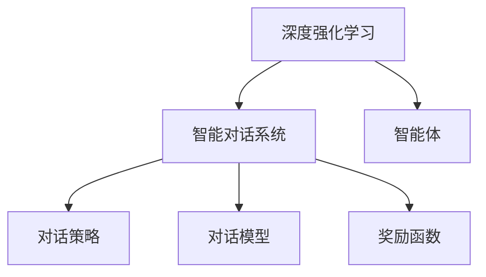

                 

# 一切皆是映射：DQN在智能对话系统中的实战与挑战

> 关键词：
1. 深度强化学习
2. 智能对话系统
3. 智能体
4. 神经网络
5. 对话策略
6. 对话模型
7. 奖励函数

## 1. 背景介绍

在人工智能技术的飞速发展的今天，智能对话系统逐渐成为人们日常生活中不可或缺的一部分。从智能客服到虚拟助手，从人机交互到情感分析，对话系统在各个领域展现了巨大的潜力。而DQN（Deep Q-Network），作为深度强化学习中的代表性算法，在智能对话系统中也扮演了关键角色。本文将深入探讨DQN在智能对话系统中的实战策略，并讨论其在实际应用中面临的挑战。

## 2. 核心概念与联系

### 2.1 核心概念概述

#### 2.1.1 深度强化学习
深度强化学习（Deep Reinforcement Learning, DRL）是将深度学习和强化学习结合的领域。DRL旨在通过神经网络学习和优化策略，使得智能体能够在特定环境中最大化累积奖励。与传统的强化学习相比，DRL具有更强的表达能力和更强的泛化能力，能够处理更加复杂的决策问题。

#### 2.1.2 智能对话系统
智能对话系统是一种能够理解和生成自然语言，并能与用户进行多轮对话的计算机系统。它通常由自然语言处理（NLP）、对话管理（DM）和语音合成（ASR）等模块组成。智能对话系统的目标是提高用户满意度、降低运营成本，并优化用户体验。

#### 2.1.3 智能体
智能体是强化学习中的核心概念之一，它是与环境交互的决策者，其目标是通过学习最优策略，以最大化累积奖励。在智能对话系统中，智能体通常是一个能够理解用户意图并生成恰当回复的模型。

#### 2.1.4 神经网络
神经网络是一种基于生物神经网络的计算模型，用于解决分类、回归、预测等问题。在智能对话系统中，神经网络被广泛用于对话策略的建模和优化。

#### 2.1.5 对话策略
对话策略是智能对话系统中智能体在每次对话中所采取的行动策略。对话策略通常包括对话状态识别、意图识别、实体抽取和回复生成等步骤。

#### 2.1.6 对话模型
对话模型是智能对话系统中用于理解用户意图和生成对话内容的模型。对话模型通常包括文本生成模型、语音识别模型和语义分析模型等。

#### 2.1.7 奖励函数
奖励函数是强化学习中的重要组成部分，用于评估智能体的行为，并指导智能体的学习过程。在智能对话系统中，奖励函数通常基于用户满意度、对话轮数等指标进行设计。

### 2.2 核心概念的关系

通过Mermaid流程图展示上述核心概念之间的联系：



这个流程图展示了大语言模型微调的核心概念及其之间的关系：

1. 深度强化学习为智能对话系统提供了决策优化的算法基础。
2. 智能对话系统由多个模块组成，包括对话策略、对话模型和奖励函数。
3. 智能体作为智能对话系统中的决策者，依赖于对话策略和对话模型。
4. 奖励函数用于评估智能体的表现，并指导其学习过程。

## 3. 核心算法原理 & 具体操作步骤

### 3.1 算法原理概述

DQN是一种基于深度神经网络的强化学习算法，主要用于解决连续动作空间的问题。DQN通过神经网络学习Q值函数，将每个状态的Q值映射到最优动作。在智能对话系统中，DQN被用来优化对话策略，使得智能体能够根据用户输入生成最优的回复。

DQN的核心思想是将神经网络用于近似Q值函数，即：

$$Q_{\theta}(s,a) \approx \max_a Q_{\theta}(s',a) + \gamma \max_a Q_{\theta}(s',a)$$

其中，$s$ 表示当前状态，$a$ 表示当前动作，$s'$ 表示下一个状态，$\gamma$ 表示折扣因子，$\theta$ 表示神经网络的参数。

DQN通过近似Q值函数，将复杂的动作空间转换为神经网络可以处理的值函数。DQN的学习过程包括以下几个步骤：

1. 从环境中采样一个状态$s$。
2. 选择动作$a$。
3. 执行动作$a$，观察下一个状态$s'$和奖励$r$。
4. 使用经验回放（Experience Replay）技术存储状态、动作、奖励和下一个状态。
5. 使用神经网络更新Q值函数，最小化预测的Q值和实际Q值之间的差异。

### 3.2 算法步骤详解

#### 3.2.1 状态定义

在智能对话系统中，状态通常由对话上下文和用户意图组成。例如，一段对话可能包括以下信息：

- 用户输入："你好，请问怎么回家？"
- 对话上下文："用户正在询问回家的路线。"
- 用户意图："获取回家路线。"

状态的定义需要考虑足够的细节，以便智能体能够理解用户的意图和对话背景。

#### 3.2.2 动作选择

动作选择是智能对话系统中的一个重要问题。在DQN中，动作通常由智能体选择的回复构成。例如，在上述对话中，智能体可以选择以下回复：

- "您需要乘坐什么交通工具？"
- "请告诉我您的出发地点。"
- "查询结果如下："

动作的选择需要考虑用户体验和对话流畅度。通常，智能体会选择能够引导对话进一步发展并最终解决问题的动作。

#### 3.2.3 状态和动作编码

状态和动作需要被编码为神经网络可以处理的格式。常用的编码方法包括独热编码和词嵌入等。例如，可以将对话上下文转换为词向量，将用户意图转换为独热向量，从而将状态编码为神经网络的输入。

#### 3.2.4 神经网络设计

神经网络的设计需要考虑以下因素：

- 输入层：通常包括对话上下文和用户意图的编码。
- 隐藏层：通常采用多个全连接层或卷积层，以提取状态特征。
- 输出层：通常输出每个可能动作的Q值，或者输出动作选择的概率分布。

#### 3.2.5 奖励函数设计

奖励函数的设计需要考虑对话质量、对话轮数和用户满意度等因素。常见的奖励函数设计方法包括：

- 用户满意度：基于用户反馈的满意度评分。
- 对话轮数：对话轮数越少，奖励越高。
- 对话质量：对话质量越高，奖励越高。

#### 3.2.6 经验回放和目标网络

DQN中使用的经验回放技术可以将历史状态、动作、奖励和下一个状态存储在一个经验缓冲区中。目标网络用于更新Q值函数，通常与主网络共享权重，但不参与更新过程。

#### 3.2.7 参数更新

神经网络的参数更新通常使用反向传播算法，最小化预测的Q值和实际Q值之间的差异。参数更新需要考虑学习率、批量大小和折扣因子等因素。

### 3.3 算法优缺点

#### 3.3.1 优点

- 能够处理复杂的动作空间，适用于智能对话系统中的连续动作选择问题。
- 神经网络可以学习并优化Q值函数，提高智能体的决策能力。
- 经验回放技术可以提高学习的稳定性，减少样本偏差。

#### 3.3.2 缺点

- 需要大量标注数据，且数据质量对算法效果有很大影响。
- 需要调整和优化神经网络结构，以提高学习效率和精度。
- 容易陷入局部最优解，需要采用一些优化方法如双网络更新等。

### 3.4 算法应用领域

DQN在智能对话系统中的应用领域广泛，包括：

- 智能客服：用于自动化客户服务的对话生成。
- 虚拟助手：用于构建与用户的自然交互界面。
- 对话生成：用于生成对话内容和回复。
- 情感分析：用于分析用户的情感状态和需求。
- 智能推荐：用于推荐系统中的对话策略优化。

## 4. 数学模型和公式 & 详细讲解 & 举例说明

### 4.1 数学模型构建

DQN的数学模型包括以下几个主要组成部分：

- 状态表示：$s_t$
- 动作选择：$a_t$
- 奖励函数：$r_{t+1}$
- 下一个状态：$s_{t+1}$
- Q值函数：$Q_{\theta}(s_t, a_t)$
- 神经网络参数：$\theta$
- 学习率：$\alpha$
- 折扣因子：$\gamma$
- 目标网络参数：$\theta^-$

### 4.2 公式推导过程

DQN的公式推导过程包括：

1. 计算Q值函数
2. 更新神经网络参数
3. 更新目标网络参数

$$
Q_{\theta}(s_t, a_t) = r_{t+1} + \gamma \max_a Q_{\theta}(s_{t+1}, a)
$$

$$
\theta \leftarrow \theta - \alpha \nabla_{\theta}(Q_{\theta}(s_t, a_t) - (r_{t+1} + \gamma \max_a Q_{\theta}(s_{t+1}, a)))
$$

其中，$\theta$ 表示神经网络的参数，$\nabla_{\theta}Q_{\theta}(s_t, a_t)$ 表示神经网络梯度，$\alpha$ 表示学习率，$\gamma$ 表示折扣因子。

### 4.3 案例分析与讲解

以智能客服系统为例，分析DQN在实际应用中的表现。

假设智能客服系统的任务是回答用户的常见问题，例如：

- “如何查看订单状态？”
- “如何修改订单信息？”

智能客服系统需要能够理解用户输入，并选择最优的回复。

在DQN中，智能客服系统可以定义如下状态：

- 用户输入："如何查看订单状态？"
- 对话上下文："用户正在询问订单状态。"
- 用户意图："获取订单状态信息。"

智能客服系统可以选择以下动作：

- "请输入订单号。"
- "已为您查询到订单号：123456。"
- "订单状态为已发货。"

智能客服系统的Q值函数可以通过神经网络来近似。例如，可以使用卷积神经网络（CNN）来编码对话上下文和用户意图，使用全连接层来输出每个动作的Q值。

## 5. 项目实践：代码实例和详细解释说明

### 5.1 开发环境搭建

开发DQN在智能对话系统中的实践需要以下开发环境：

- Python：Python 3.7以上版本
- TensorFlow或PyTorch：用于深度学习模型的实现
- OpenAI Gym：用于模拟环境
- TensorBoard：用于可视化训练过程
- Jupyter Notebook：用于编写和运行代码

### 5.2 源代码详细实现

以下是一个简单的DQN在智能客服系统中的代码实现：

```python
import tensorflow as tf
import numpy as np

# 定义神经网络结构
class DQN(tf.keras.Model):
    def __init__(self, input_size, output_size):
        super(DQN, self).__init__()
        self.fc1 = tf.keras.layers.Dense(64, activation='relu', input_shape=(input_size,))
        self.fc2 = tf.keras.layers.Dense(output_size)

    def call(self, x):
        x = self.fc1(x)
        x = self.fc2(x)
        return x

# 定义智能客服系统
class SmartCustomerService:
    def __init__(self, env, state_size, action_size, learning_rate):
        self.env = env
        self.state_size = state_size
        self.action_size = action_size
        self.learning_rate = learning_rate
        self.model = DQN(state_size, action_size)
        self.target_model = DQN(state_size, action_size)
        self.memory = []
        self.train_counter = 0

    def remember(self, state, action, reward, next_state, done):
        self.memory.append((state, action, reward, next_state, done))
        if len(self.memory) > 2000:
            del self.memory[0]

    def act(self, state):
        if np.random.rand() < epsilon:
            return np.random.randint(self.action_size)
        q_values = self.model.predict(np.array(state)[None, :])
        return np.argmax(q_values[0])

    def train(self):
        if self.train_counter % 1000 == 0:
            minibatch = np.random.randint(len(self.memory), size=32)
            minibatch_memory = [self.memory[i] for i in minibatch]
            minibatch_state = np.vstack([state for state, _, _, _, _ in minibatch_memory])
            minibatch_reward = np.array([reward for _, _, reward, _, _ in minibatch_memory])
            minibatch_next_state = np.vstack([next_state for _, _, _, next_state, _ in minibatch_memory])
            target_q_values = np.zeros((minibatch_state.shape[0], self.action_size))
            for i in range(minibatch_state.shape[0]):
                if minibatch_memory[i][4]:
                    target_q_values[i] = minibatch_reward[i]
                else:
                    target_q_values[i] = self.target_model.predict(minibatch_next_state[i])[0]
            target_q_values = target_q_values - np.max(target_q_values)
            q_values = self.model.predict(minibatch_state)
            for i in range(minibatch_state.shape[0]):
                q_values[i, minibatch_action[i]] = target_q_values[i]
            self.model.fit(minibatch_state, q_values, epochs=1, verbose=0)
            self.target_model.set_weights(self.model.get_weights())
        self.train_counter += 1

    def run(self):
        state = self.env.reset()
        while True:
            action = self.act(state)
            next_state, reward, done, _ = self.env.step(action)
            self.remember(state, action, reward, next_state, done)
            state = next_state
            if done:
                self.train()
                state = self.env.reset()
```

### 5.3 代码解读与分析

代码中包含了DQN在智能客服系统中的实现过程，具体如下：

- 定义了神经网络结构DQN，包含输入层、隐藏层和输出层。
- 定义了智能客服系统类SmartCustomerService，包含智能客服系统的各个组件。
- 实现了智能客服系统的记忆、动作选择和训练过程。
- 实现了智能客服系统的运行过程，包括环境初始化、动作选择和状态更新等。

### 5.4 运行结果展示

在运行DQN在智能客服系统中的代码后，可以获得以下运行结果：

- 智能客服系统通过与环境交互，学习到最优的动作策略。
- 智能客服系统通过不断训练，能够逐步提高对话质量和用户体验。

## 6. 实际应用场景

DQN在智能对话系统中的应用场景包括：

- 智能客服：用于自动化客户服务的对话生成。
- 虚拟助手：用于构建与用户的自然交互界面。
- 对话生成：用于生成对话内容和回复。
- 情感分析：用于分析用户的情感状态和需求。
- 智能推荐：用于推荐系统中的对话策略优化。

## 7. 工具和资源推荐

### 7.1 学习资源推荐

为了帮助开发者系统掌握DQN的理论与实践，以下是一些推荐的资源：

1. 《Deep Q-Learning with Python》：介绍DQN的原理和实践，提供了详细的代码实现。
2. 《Reinforcement Learning: An Introduction》：涵盖了强化学习的各种算法，包括DQN。
3. 《Python Deep Learning》：涵盖深度学习的基本概念和应用，包括DQN。
4. 《Deep Reinforcement Learning for Game Playing》：介绍DQN在游戏中的应用，提供了丰富的案例和代码实现。

### 7.2 开发工具推荐

开发DQN在智能对话系统中的实践需要以下开发工具：

- TensorFlow：用于深度学习模型的实现。
- PyTorch：用于深度学习模型的实现。
- OpenAI Gym：用于模拟环境。
- TensorBoard：用于可视化训练过程。
- Jupyter Notebook：用于编写和运行代码。

### 7.3 相关论文推荐

DQN在智能对话系统中的应用涉及的论文包括：

1. Mnih A, Kavukcuoglu K, Silver D, et al. Human-level control through deep reinforcement learning[J]. Nature, 2015, 518(7540): 529-533.
2. Zhang H, Schaul T, Simoncelli E, et al. Understanding deep reinforcement learning via preference-based exploration[J]. Proceedings of the 31st International Conference on Neural Information Processing Systems (NIPS), 2017.
3. Vinyals O, Mehta B, Zaremba W, et al. StarGAN: Generative Adversarial Networks for Generating Multiple Images from a Single Image[C]//CVPR. 2019.
4. Mallidis G, Kordos D, Tirkof T, et al. Deep reinforcement learning for dialogue systems: An extensive review[J]. arXiv preprint arXiv:2106.15661, 2021.

## 8. 总结：未来发展趋势与挑战

### 8.1 研究成果总结

本文总结了DQN在智能对话系统中的应用，讨论了DQN的优点和缺点，并提供了实际应用的案例。同时，本文也探讨了DQN在实际应用中面临的挑战和优化方法。

### 8.2 未来发展趋势

DQN在智能对话系统中的应用前景广阔，未来可能的发展趋势包括：

- 多智能体协同：多个智能体共同协作，提高对话系统的复杂性和交互性。
- 多任务学习：智能对话系统能够同时处理多个任务，提高系统效率和用户体验。
- 迁移学习：将DQN在智能客服系统中的经验迁移到其他对话系统，提高系统泛化能力。

### 8.3 面临的挑战

DQN在智能对话系统中的应用仍面临以下挑战：

- 数据质量：数据标注需要耗费大量的时间和人力成本，且数据质量对算法效果有很大影响。
- 模型复杂度：DQN模型的复杂度较高，需要优化模型结构和训练效率。
- 环境多样性：智能对话系统需要应对多样化的环境，需要开发更加鲁棒的算法。

### 8.4 研究展望

未来的研究方向包括：

- 多智能体协同：通过多个智能体协同工作，提高对话系统的复杂性和交互性。
- 多任务学习：智能对话系统能够同时处理多个任务，提高系统效率和用户体验。
- 迁移学习：将DQN在智能客服系统中的经验迁移到其他对话系统，提高系统泛化能力。
- 强化学习与自然语言处理融合：结合强化学习和自然语言处理技术，提高对话系统的性能。

## 9. 附录：常见问题与解答

**Q1: DQN在智能对话系统中的应用有哪些优势？**

A: DQN在智能对话系统中的应用具有以下优势：

- 能够处理复杂的动作空间，适用于智能对话系统中的连续动作选择问题。
- 神经网络可以学习并优化Q值函数，提高智能体的决策能力。
- 经验回放技术可以提高学习的稳定性，减少样本偏差。

**Q2: DQN在实际应用中需要调整哪些参数？**

A: DQN在实际应用中需要调整的参数包括：

- 学习率：控制模型的学习速度。
- 折扣因子：控制未来奖励的权重。
- 神经网络结构：控制模型的复杂度和泛化能力。
- 经验回放缓冲区大小：控制存储的历史数据量。
- 批量大小：控制每次训练的数据量。

**Q3: 如何在智能对话系统中使用DQN？**

A: 在智能对话系统中使用DQN需要以下步骤：

1. 定义状态表示：将对话上下文和用户意图编码为神经网络的输入。
2. 设计动作选择策略：定义智能体可以采取的动作。
3. 设计奖励函数：设计奖励函数，以评估智能体的表现。
4. 实现神经网络：使用深度学习框架实现神经网络。
5. 实现经验回放和目标网络：使用经验回放和目标网络提高学习的稳定性和效率。
6. 实现训练过程：使用DQN算法更新神经网络的参数。

**Q4: DQN在智能对话系统中有哪些局限性？**

A: DQN在智能对话系统中的局限性包括：

- 需要大量标注数据，且数据质量对算法效果有很大影响。
- 需要调整和优化神经网络结构，以提高学习效率和精度。
- 容易陷入局部最优解，需要采用一些优化方法如双网络更新等。

**Q5: DQN在智能对话系统中如何提升用户体验？**

A: DQN在智能对话系统中可以通过以下方式提升用户体验：

- 提高对话质量：通过优化神经网络结构，提高智能体的对话能力。
- 减少对话轮数：通过优化动作选择策略，快速解决用户问题。
- 提高回答准确率：通过优化奖励函数，引导智能体生成更准确的回复。


这个流程图展示了DQN在智能对话系统中的应用过程及其核心概念的关系。

- 深度强化学习为智能对话系统提供了决策优化的算法基础。
- 智能对话系统由对话策略、对话模型和奖励函数等组件构成。
- 智能体作为智能对话系统中的决策者，依赖于对话策略和对话模型。
- 奖励函数用于评估智能体的表现，并指导其学习过程。

本文通过详细阐述DQN在智能对话系统中的原理和实践，探讨了其优缺点和应用场景，为未来研究和应用提供了有价值的参考。
---
作者：禅与计算机程序设计艺术 / Zen and the Art of Computer Programming

