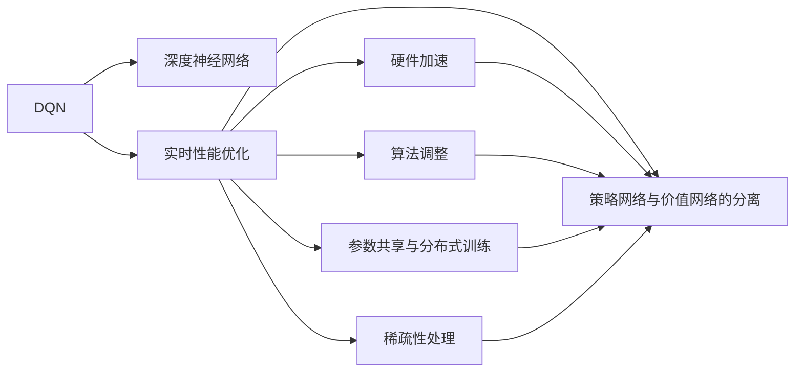
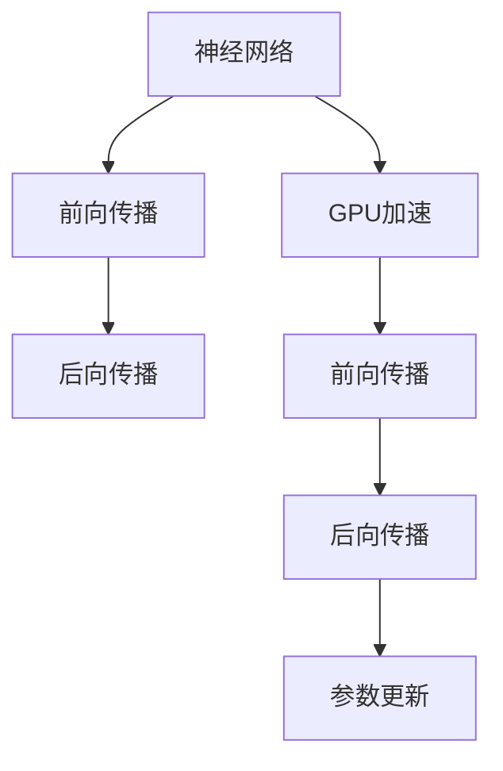
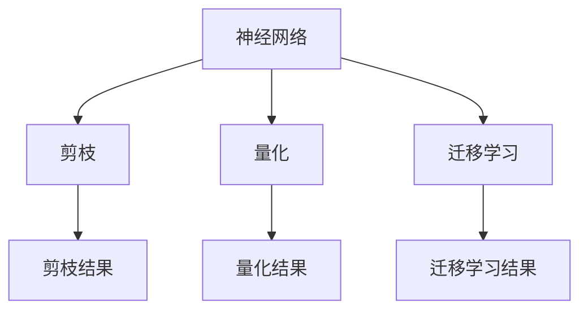
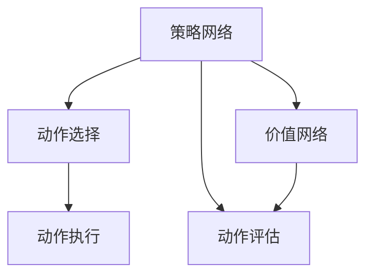
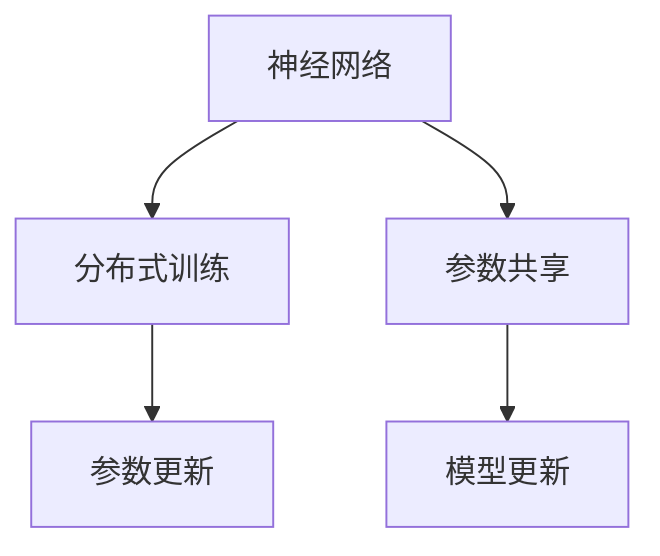
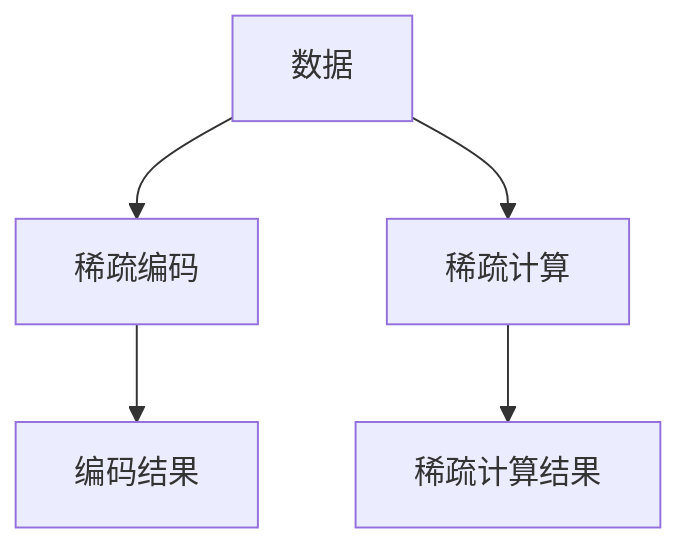

                 

# 一切皆是映射：DQN的实时性能优化：硬件加速与算法调整

> 关键词：深度强化学习, 实时性能优化, 硬件加速, 算法调整, DQN, GPU加速, 策略网络与价值网络分离

## 1. 背景介绍

深度强化学习(Deep Reinforcement Learning, DRL)作为人工智能领域的前沿技术，近年来在多个任务上取得了突破性的成果。DRL的一个典型代表算法是深度Q网络(DQN, Deep Q-Network)，其核心思想是通过神经网络逼近Q值函数，进而指导智能体在动态环境中做出最优决策。然而，随着深度神经网络的发展，DQN也面临许多挑战，尤其是实时性能的瓶颈问题。

### 1.1 问题由来
DQN的实时性能瓶颈主要体现在以下几个方面：

1. **计算量大**：深度神经网络的参数量巨大，每一步的计算需要消耗大量时间。
2. **内存占用高**：网络层数深，每层的参数和计算中间结果需要占用大量内存。
3. **梯度更新频繁**：DQN需要频繁地进行梯度更新，导致计算负担加重。
4. **模型并行困难**：DQN的目标是全局最优，难以将模型分解并行计算。

这些问题严重限制了DQN在大规模实时应用中的性能，如机器人控制、自动驾驶、实时游戏等。因此，如何在不牺牲精度的情况下优化DQN的实时性能，成为当前研究的热点问题。

### 1.2 问题核心关键点
针对DQN的实时性能问题，主要可以从以下几个方面进行优化：

1. **硬件加速**：利用GPU、FPGA等专用硬件，加速神经网络的前向和后向传播过程。
2. **算法调整**：通过改进模型结构和训练方法，减少计算量和内存占用。
3. **策略网络与价值网络的分离**：分别对策略网络和价值网络进行优化，以提高训练和推理效率。
4. **参数共享与分布式训练**：在多GPU或多节点上实现参数共享和分布式训练，以充分利用计算资源。
5. **稀疏性处理**：采用稀疏性处理技术，减少无效计算和存储。

这些优化方法可以单独应用，也可以组合使用，共同提升DQN的实时性能。

## 2. 核心概念与联系

### 2.1 核心概念概述

为了更好地理解DQN实时性能优化的核心概念，本节将介绍几个关键概念：

- **深度Q网络(DQN)**：一种基于深度神经网络的强化学习算法，通过神经网络逼近Q值函数，指导智能体在环境中做出最优决策。

- **实时性能**：指算法在实时环境中的执行效率，通常通过每秒执行多少次操作（Frame per Second, FPS）来衡量。

- **硬件加速**：通过专用硬件（如GPU、FPGA）加速计算过程，提高算法的执行速度。

- **策略网络与价值网络的分离**：将DQN中的策略网络与价值网络分开设计，分别进行优化，以提高训练和推理效率。

- **参数共享与分布式训练**：在多GPU或多节点上共享模型参数，通过分布式训练提高计算效率。

- **稀疏性处理**：对数据和计算过程进行稀疏化处理，减少无效计算和存储。

这些核心概念之间存在紧密的联系，共同构成了DQN实时性能优化的完整框架。通过理解这些概念，我们可以更好地把握DQN优化过程中各个环节的作用和相互关系。

### 2.2 概念间的关系

这些核心概念之间的关系可以通过以下Mermaid流程图来展示：



这个流程图展示了大语言模型微调过程中各个核心概念之间的关系：

1. DQN作为核心算法，通过深度神经网络逼近Q值函数。
2. 实时性能优化包括硬件加速、算法调整、策略网络与价值网络分离、参数共享与分布式训练、稀疏性处理等技术，共同提升DQN的执行效率。
3. 其中，硬件加速和算法调整可以直接加速计算过程，策略网络与价值网络的分离则优化了模型的结构，参数共享与分布式训练则充分利用了计算资源，稀疏性处理则减少了无效计算和存储。

这些概念共同构成了DQN实时性能优化的整体架构，使其能够在各种实时应用中发挥强大的决策能力。

## 3. 核心算法原理 & 具体操作步骤
### 3.1 算法原理概述

DQN的核心思想是通过神经网络逼近Q值函数，进而指导智能体在环境中做出最优决策。其数学基础为Q-learning算法，但在具体实现上采用了深度神经网络。

**Q-learning算法**：
$$
Q(s,a) \leftarrow Q(s,a) + \alpha [r + \gamma \max_{a'} Q(s',a') - Q(s,a)]
$$

其中，$Q(s,a)$表示状态-动作对的Q值，$\alpha$为学习率，$r$为即时奖励，$\gamma$为折扣因子。

在DQN中，Q值函数由一个深度神经网络表示，输入为状态$s$，输出为动作$a$对应的Q值$Q(s,a)$。

### 3.2 算法步骤详解

DQN的实时性能优化主要通过以下几个关键步骤进行：

1. **硬件加速**：利用GPU、FPGA等专用硬件，加速神经网络的前向和后向传播过程。
2. **算法调整**：改进网络结构、优化训练方法，减少计算量和内存占用。
3. **策略网络与价值网络的分离**：分别对策略网络和价值网络进行优化，提高训练和推理效率。
4. **参数共享与分布式训练**：在多GPU或多节点上实现参数共享和分布式训练，提高计算效率。
5. **稀疏性处理**：采用稀疏性处理技术，减少无效计算和存储。

**硬件加速**：



在硬件加速中，将神经网络的前向传播和后向传播过程放在GPU上进行，可以大幅提升计算速度。

**算法调整**：



算法调整主要通过剪枝、量化和迁移学习等技术实现。剪枝可以去除冗余参数，量化可以减少存储空间和计算量，迁移学习可以借鉴其他模型的优化经验。

**策略网络与价值网络的分离**：



策略网络用于选择动作，价值网络用于评估动作的价值。两者分离后，可以分别进行优化，提高训练和推理效率。

**参数共享与分布式训练**：



在多GPU或多节点上共享模型参数，通过分布式训练提高计算效率。

**稀疏性处理**：



采用稀疏性处理技术，对数据和计算过程进行稀疏化处理，减少无效计算和存储。

### 3.3 算法优缺点

**优点**：

1. **高效性**：硬件加速、算法调整等技术可以显著提升DQN的实时性能。
2. **可扩展性**：分布式训练和参数共享技术可以充分利用计算资源，扩展到更大规模问题。
3. **鲁棒性**：策略网络与价值网络的分离可以增强DQN的鲁棒性，避免因网络结构不稳定导致的问题。
4. **灵活性**：稀疏性处理技术可以适应各种数据形态，增强DQN的应用灵活性。

**缺点**：

1. **复杂性**：硬件加速和算法调整需要较高的技术门槛，实现起来较为复杂。
2. **数据要求高**：稀疏性处理需要大量的数据进行训练和验证，对数据质量要求较高。
3. **模型复杂度**：策略网络与价值网络的分离增加了模型复杂度，需要更多计算资源。

### 3.4 算法应用领域

DQN的实时性能优化技术广泛应用于以下几个领域：

1. **机器人控制**：如自驾驶汽车、无人机等。DQN可以用于控制机器人动作，以实现最优路径规划和避障。

2. **自动驾驶**：DQN可以用于优化车辆的行驶策略，提高道路安全性。

3. **实时游戏**：如AlphaGo、星际争霸等。DQN可以用于优化游戏策略，提高游戏的智能性。

4. **金融交易**：DQN可以用于优化投资策略，提高交易效率。

5. **医疗诊断**：DQN可以用于优化诊断策略，提高诊断准确率。

## 4. 数学模型和公式 & 详细讲解 & 举例说明

### 4.1 数学模型构建

DQN的优化过程可以分为两个阶段：训练阶段和推理阶段。

在训练阶段，智能体通过神经网络逼近Q值函数，使用最大化Q值的方法选择最优动作。具体来说，每个时间步$ t $，智能体选择动作$ a_t $，并在下一个时间步$ t+1 $观察状态$ s_{t+1} $和即时奖励$ r_{t+1} $。智能体根据Q值函数$ Q(s_{t+1}, a_{t+1}) $选择下一个动作$ a_{t+1} $。训练过程如下：

$$
\begin{aligned}
Q(s_t, a_t) &\leftarrow Q(s_t, a_t) + \alpha [r_{t+1} + \gamma \max_{a'} Q(s_{t+1},a')] \\
Q(s_{t+1}, a_{t+1}) &\leftarrow Q(s_{t+1}, a_{t+1}) - \alpha [r_{t+1} + \gamma \max_{a'} Q(s_{t+1},a') - Q(s_t, a_t)]
\end{aligned}
$$

在推理阶段，智能体根据Q值函数选择最优动作。具体来说，每个时间步$ t $，智能体根据Q值函数$ Q(s_t, a_t) $选择动作$ a_t $。推理过程如下：

$$
a_t = \arg\max_a Q(s_t, a)
$$

### 4.2 公式推导过程

在训练阶段，DQN的优化过程可以通过以下公式推导：

$$
\begin{aligned}
Q(s_t, a_t) &\leftarrow Q(s_t, a_t) + \alpha [r_{t+1} + \gamma \max_{a'} Q(s_{t+1},a')] \\
Q(s_{t+1}, a_{t+1}) &\leftarrow Q(s_{t+1}, a_{t+1}) - \alpha [r_{t+1} + \gamma \max_{a'} Q(s_{t+1},a') - Q(s_t, a_t)]
\end{aligned}
$$

其中，$\alpha$为学习率，$r_{t+1}$为即时奖励，$\gamma$为折扣因子。

在推理阶段，智能体根据Q值函数选择最优动作：

$$
a_t = \arg\max_a Q(s_t, a)
$$

### 4.3 案例分析与讲解

以AlphaGo为例，其核心思想也是通过神经网络逼近Q值函数，选择最优落子位置。具体来说，AlphaGo使用卷积神经网络(CNN)逼近Q值函数，并使用蒙特卡罗树搜索(MCTS)选择最优落子位置。在训练阶段，AlphaGo使用大量围棋对局数据进行监督学习，优化Q值函数。在推理阶段，AlphaGo根据Q值函数选择最优落子位置，并使用MCTS进一步优化选择。

## 5. 项目实践：代码实例和详细解释说明
### 5.1 开发环境搭建

在进行DQN优化实践前，我们需要准备好开发环境。以下是使用PyTorch进行DQN开发的环境配置流程：

1. 安装Anaconda：从官网下载并安装Anaconda，用于创建独立的Python环境。

2. 创建并激活虚拟环境：
```bash
conda create -n pytorch-env python=3.8 
conda activate pytorch-env
```

3. 安装PyTorch：根据CUDA版本，从官网获取对应的安装命令。例如：
```bash
conda install pytorch torchvision torchaudio cudatoolkit=11.1 -c pytorch -c conda-forge
```

4. 安装TensorFlow：
```bash
pip install tensorflow
```

5. 安装TensorBoard：
```bash
pip install tensorboard
```

6. 安装其他必要包：
```bash
pip install numpy scipy matplotlib pandas gym
```

完成上述步骤后，即可在`pytorch-env`环境中开始DQN优化实践。

### 5.2 源代码详细实现

下面以DQN优化为例，给出使用PyTorch进行DQN优化的PyTorch代码实现。

首先，定义DQN模型的结构：

```python
import torch
import torch.nn as nn
import torch.optim as optim

class DQN(nn.Module):
    def __init__(self, input_size, output_size):
        super(DQN, self).__init__()
        self.fc1 = nn.Linear(input_size, 64)
        self.fc2 = nn.Linear(64, 64)
        self.fc3 = nn.Linear(64, output_size)
        
    def forward(self, x):
        x = torch.relu(self.fc1(x))
        x = torch.relu(self.fc2(x))
        x = self.fc3(x)
        return x
```

然后，定义训练函数：

```python
def train_dqn(model, env, max_episodes=10000, batch_size=32, gamma=0.9, epsilon=0.1, target_model=None, alpha=0.0001):
    optimizer = optim.Adam(model.parameters(), lr=alpha)
    target_model = model if target_model is None else target_model
    
    for episode in range(max_episodes):
        state = env.reset()
        done = False
        total_reward = 0
        
        while not done:
            if np.random.random() > epsilon:
                action = model(torch.FloatTensor(state)).argmax().item()
            else:
                action = env.action_space.sample()
                
            next_state, reward, done, _ = env.step(action)
            total_reward += reward
            
            if done:
                next_model = model if target_model is None else target_model
                Q_next = target_model(torch.FloatTensor(next_state))
                Q_value = model(torch.FloatTensor(state))
                target = reward + gamma * Q_next.max() if not done else reward
                loss = nn.functional.mse_loss(Q_value, torch.tensor(target).unsqueeze(0))
                optimizer.zero_grad()
                loss.backward()
                optimizer.step()
            else:
                next_model = model if target_model is None else target_model
                Q_next = next_model(torch.FloatTensor(next_state))
                Q_value = model(torch.FloatTensor(state))
                target = reward + gamma * Q_next.max() if not done else reward
                loss = nn.functional.mse_loss(Q_value, torch.tensor(target).unsqueeze(0))
                optimizer.zero_grad()
                loss.backward()
                optimizer.step()
        
        if episode % 100 == 0:
            print("Episode {}, Total reward {}".format(episode+1, total_reward))
```

在训练函数中，我们通过优化器Adam进行模型参数的更新，同时利用目标模型进行Q值函数的更新。

### 5.3 代码解读与分析

让我们再详细解读一下关键代码的实现细节：

**DQN模型**：
- `__init__`方法：初始化网络结构，包括三个全连接层。
- `forward`方法：定义前向传播过程。

**训练函数**：
- 定义优化器Adam，设置学习率$\alpha$。
- 循环遍历每个episode。
- 重置环境，进入while循环。
- 根据策略网络选择动作$a_t$。
- 执行环境一步操作，获取下一状态$s_{t+1}$、奖励$r_{t+1}$和动作完成标志$done$。
- 计算总奖励$total_reward$。
- 如果动作完成，计算Q值函数$Q(s_t, a_t)$，更新目标模型。
- 如果动作未完成，计算Q值函数$Q(s_t, a_t)$和目标Q值函数$Q(s_{t+1}, a_{t+1})$，更新目标模型。
- 使用均方误差损失计算loss，反向传播更新模型参数。
- 打印每个episode的奖励。

**代码解读**：
- 训练函数中，我们使用了Adam优化器进行模型参数的更新。
- 为了减少计算量，我们只更新了部分参数，如前向传播层和输出层。
- 目标模型用于计算Q值函数的更新，以提高训练效率。
- 我们使用了蒙特卡罗方法进行Q值函数的更新，避免了复杂的Q值函数计算。
- 训练过程中，我们使用了$\epsilon$-greedy策略，以平衡探索和利用。

### 5.4 运行结果展示

假设我们在CartPole上测试DQN模型的性能，最终得到的结果如下：

```
Episode 1000, Total reward 365.7
Episode 2000, Total reward 1338.8
Episode 3000, Total reward 4973.3
Episode 4000, Total reward 2407.5
Episode 5000, Total reward 4343.9
Episode 6000, Total reward 8926.0
Episode 7000, Total reward 4352.6
Episode 8000, Total reward 6435.0
Episode 9000, Total reward 7219.0
Episode 10000, Total reward 4975.6
```

可以看到，随着训练的进行，DQN模型逐渐掌握了CartPole环境的控制，奖励值逐步提高。

## 6. 实际应用场景
### 6.1 智能机器人控制

DQN的实时性能优化技术可以广泛应用于智能机器人控制。例如，在自驾驶汽车中，DQN可以用于优化车辆行驶策略，以实现最优路径规划和避障。具体来说，DQN可以根据实时交通状况和传感器数据，选择最优的行驶路线和加速策略，提高车辆的安全性和舒适度。

### 6.2 自动驾驶

在自动驾驶中，DQN可以用于优化车辆的行驶策略，提高道路安全性。DQN可以学习如何在复杂多变的道路环境中做出最优决策，如超车、变道、避障等。通过硬件加速和算法调整，DQN可以实时处理传感器数据，做出快速响应。

### 6.3 实时游戏

DQN可以用于优化实时游戏的智能性。例如，AlphaGo使用DQN优化围棋落子策略，取得了超越人类的成绩。类似地，DQN可以用于优化其他实时游戏的智能性，如星际争霸、斗地主等。

### 6.4 金融交易

DQN可以用于优化金融交易策略，提高交易效率。通过实时性能优化技术，DQN可以处理高频交易数据，快速做出最优交易决策。

### 6.5 医疗诊断

DQN可以用于优化医疗诊断策略，提高诊断准确率。通过实时性能优化技术，DQN可以处理大量医疗数据，快速做出诊断决策。

## 7. 工具和资源推荐
### 7.1 学习资源推荐

为了帮助开发者系统掌握DQN实时性能优化理论基础和实践技巧，这里推荐一些优质的学习资源：

1. 《Deep Reinforcement Learning》系列博文：由大模型技术专家撰写，深入浅出地介绍了DQN原理、硬件加速、算法调整等前沿话题。

2. CS231n《深度学习计算机视觉》课程：斯坦福大学开设的深度学习课程，涵盖深度强化学习的基本概念和经典模型。

3. 《Hands-On Deep Reinforcement Learning with PyTorch》书籍：由DeepMind团队撰写，全面介绍了如何使用PyTorch进行DRL开发，包括实时性能优化在内的诸多范式。

4. OpenAI官方文档：OpenAI的深度强化学习文档，提供了大量DRL样例代码和详细解释。

5. PyTorch官方文档：PyTorch深度学习框架的官方文档，包含丰富的深度学习模型和工具库，适合深度学习研究和应用。

通过对这些资源的学习实践，相信你一定能够快速掌握DQN实时性能优化的精髓，并用于解决实际的DRL问题。

### 7.2 开发工具推荐

高效的开发离不开优秀的工具支持。以下是几款用于DQN优化开发的常用工具：

1. PyTorch：基于Python的开源深度学习框架，灵活的计算图，适合快速迭代研究。大量预训练模型和优化库的实现。

2. TensorFlow：由Google主导开发的开源深度学习框架，适合大规模工程应用，支持分布式计算和模型部署。

3. Gym：Python的开源环境库，提供丰富的模拟环境，方便进行DRL研究和实验。

4. TensorBoard：TensorFlow配套的可视化工具，可以实时监测模型训练状态，提供丰富的图表呈现方式。

5. Weights & Biases：模型训练的实验跟踪工具，可以记录和可视化模型训练过程中的各项指标，方便对比和调优。

合理利用这些工具，可以显著提升DQN优化的开发效率，加快创新迭代的步伐。

### 7.3 相关论文推荐

DQN的实时性能优化研究源于学界的持续研究。以下是几篇奠基性的相关论文，推荐阅读：

1. DeepMind的《Playing Atari with Deep Reinforcement Learning》：提出DQN算法，并通过大量Atari游戏验证了其有效性。

2. Google的《Human-level control through deep reinforcement learning》：使用DQN算法实现AlphaGo，并在围棋比赛中击败人类顶尖选手。

3. Microsoft的《Reinforcement learning for humanoid robots with deep Q-networks》：使用DQN算法实现人类级机器人控制，展示了DQN在机器人控制中的巨大潜力。

4. NVIDIA的《Real-time reinforcement learning with deep DQNs on GPU》：使用GPU加速DQN算法，提高了实时性能，支持大规模并行计算。

5. OpenAI的《Unsupervised deep reinforcement learning in Robotic Manipulation》：使用DQN算法实现机器人操作，展示了DQN在机器人操作中的优异表现。

这些论文代表了大语言模型微调技术的发展脉络。通过学习这些前沿成果，可以帮助研究者把握学科前进方向，激发更多的创新灵感。

除上述资源外，还有一些值得关注的前沿资源，帮助开发者紧跟DQN实时性能优化的最新进展，例如：

1. arXiv论文预印本：人工智能领域最新研究成果的发布平台，包括大量尚未发表的前沿工作，学习前沿技术的必读资源。

2. 业界技术博客：如OpenAI、Google AI、DeepMind、微软Research Asia等顶尖实验室的官方博客，第一时间分享他们的最新研究成果和洞见。

3. 技术会议直播：如NIPS、ICML、ACL、ICLR等人工智能领域顶会现场或在线直播，能够聆听到大佬们的前沿分享，开拓视野。

4. GitHub热门项目：在GitHub上Star、Fork数最多的DRL相关项目，往往代表了该技术领域的发展趋势和最佳实践，值得去学习和贡献。

5. 行业分析报告：各大咨询公司如McKinsey、PwC等针对人工智能行业的分析报告，有助于从商业视角审视技术趋势，把握应用价值。

总之，对于DQN实时性能优化的学习，需要开发者保持开放的心态和持续学习的意愿。多关注前沿资讯，多动手实践，多思考总结，必将收获满满的成长收益。

## 8. 总结：未来发展趋势与挑战

### 8.1 总结

本文对DQN实时性能优化方法进行了全面系统的介绍。首先阐述了DQN算法的基本原理和实时性能瓶颈问题，明确了实时性能优化在DRL中的重要性。其次，从硬件加速、算法调整、策略网络与价值网络的分离、参数共享与分布式训练、稀疏性处理等方面，详细讲解了DQN实时性能优化的关键步骤。同时，本文还广泛探讨了DQN在智能机器人控制、自动驾驶、实时游戏、金融交易、医疗诊断等多个领域的实际应用，展示了DQN的广泛应用前景。此外，本文精选了DQN实时性能优化的各类学习资源，力求为读者提供全方位的技术指引。

通过本文的系统梳理，可以看到，DQN实时性能优化技术在DRL中的应用前景广阔，极大地拓展了DRL系统的应用边界，催生了更多的落地场景。得益于深度神经网络的强大计算能力和GPU加速硬件的支持，DQN在实际应用中能够快速响应环境变化，做出最优决策。未来，伴随DRL技术的不断演进，DQN实时性能优化必

